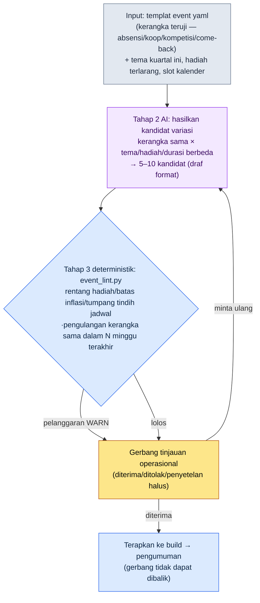

# 15.2 Operasional Event dan Musim — Dari Satu Lembar Templat, Sepuluh Kandidat Variasi, Hanya Tinjauan yang Dikerjakan Manusia

> Pembaca utama: Game Designer MMORPG yang bertanggung jawab atas Live Ops (tim skala menengah, 10–50 orang)
> Versi ringkas untuk pembaca solo/hobi: §15.2.9 "Kalau Sendirian, Cukup Sampai Sini"

Saya membayangkan rapat Senin pagi sebuah game live yang sudah berjalan empat tahun. Setiap minggu, pertanyaan "mau jalankan event apa minggu depan" selalu dimulai dari kertas kosong. Kalau ada yang bilang, "Kita naikkan sedikit hadiah event absensi yang dulu, lalu ulangi lagi?", ada saja yang menyahut, "Itu sudah kita lakukan dua bulan lalu," dan seberapa banyak hadiah dinaikkan pun ditentukan dengan feeling. Setelah rapat selesai, satu Game Designer operasional menghabiskan setengah hari untuk mengisi format event dari nol. Setiap minggu, dari kertas kosong, setengah hari.

Masalahnya bukan karena kurang ide. Tim operasional sudah punya di kepala mereka beberapa kerangka event yang sudah teruji — absensi, kerja sama (koop), kompetisi, dan come-back (kembali main). Tinggal mengganti tema dan hadiah pada kerangka itu, jadilah sebuah event satu minggu. Hanya saja, karena "penggantian" itu setiap kali dilakukan dengan tangan dan dengan feeling, prosesnya lambat dan hasilnya goyah.

Bab ini membahas cara menyerahkan penggantian itu kepada AI. Intinya ada dua. Pertama, kita masukkan kerangka event yang sudah teruji sebagai **templat yaml yang bisa divariasikan**. Kedua, pekerjaan membosankan untuk menarik beberapa kandidat minggu depan dari templat itu kita serahkan kepada AI, sementara manusia **menerapkan batas rentang hadiah dan duplikasi lewat kode, lalu hanya meninjau tone-nya**. Teori umum perancangan event (semacam absensi bagus untuk akuisisi pemain baru, kerja sama bagus untuk aktivasi) sudah cukup banyak dibahas di buku lain, jadi bab ini hanya berfokus pada *tempat di mana pengetahuan itu dijalankan dalam alur kerja AI*.

> **Catatan Pengalaman Operasional Penulis (sejujurnya)**
> Pengalaman saya langsung bertanggung jawab atas Live Ops pascarilis dalam satuan 1–2 tahun hanya terbatas pada sebagian karier saya. Alur kerja di bab ini adalah hasil memindahkan alat produksi-dan-tinjauan yang saya operasikan (konten dan HUD) ke ranah event, dan setiap kali angka efektivitas muncul, di dalam teks saya tegaskan bahwa itu adalah *pengamatan industri + perkiraan penulis*. Struktur alat (templat yaml, lint, gerbang tinjauan) sama persis kerangkanya dengan alat produksi konten yang benar-benar saya operasikan.

---

## 15.2.1 Manusia Hanya Menulis Templat dan Melakukan Tinjauan Akhir

Keseluruhan alur produksi event terdiri dari empat tahap. Intinya: tahap 1 (templat) dan tahap 3 (lint) bersifat deterministik, dan hanya tahap 2 yang dikerjakan AI. Ini pembagian peran yang sama seperti yang sudah kita lihat pada produksi konten (§6.2) dan kompresi HUD (§14.1). Kalau rulebook (buku aturan) mengunci input dan verifikasi dari kedua sisi, maka meskipun AI yang terjepit di tengah setiap kali menghasilkan variasi yang sedikit berbeda, keseimbangan hadiah dan jadwal tidak akan goyah.



Pada gambar ini, tempat yang disentuh tangan manusia hanya ada dua. Di paling atas, tempat memasukkan templat dan batasan kuartal ini secara bersih; di paling bawah, tempat menilai hal yang tak bisa ditangkap lint — "apakah tema ini cocok dengan suasana game kita sekarang". Di antara keduanya, produksi kandidat yang membosankan dan hitung-hitungan hadiah dijalankan oleh templat, AI, dan lint.

Desain yang menentukan adalah: meskipun lint (tahap 3) menemukan pelanggaran, ia tidak otomatis membuang kandidat, melainkan hanya menaikkan WARN ke gerbang operasional (tahap 4). Alasannya dibahas di §15.2.5. Lalu, fakta bahwa panah paling akhir (pengumuman) bersifat **tidak dapat dibalik** itulah yang membedakan Live Ops dari produksi lainnya. NPC kota, kalau tak disukai, cukup dibuang sebelum build; tetapi event yang sudah diumumkan ke pengguna menanggung biaya kepercayaan komunitas ketika dibatalkan (§15.2.7).

---

## 15.2.2 Input — Templat Event yaml

Kita mengunci kerangka teruji milik tim operasional sebagai sebuah format. Kalau dibiarkan sebagai dokumen desain berformat bebas, AI tidak tahu apa yang harus divariasikan. Slot harus terpisah dulu, baru perintah "ganti hanya slot ini" bisa berlaku.

```yaml
# event_templates/coop_raid.yaml — kerangka coop raid (teruji, 4 kali dioperasikan)
template_id: coop_raid
purpose: [aktivasi_existing, komunitas]   # Hanya 1~2. Dilarang mengejar 4 tujuan sekaligus
core_loop: dalam periode, seluruh server mengumpulkan kontribusi → hadiah seluruh server terbuka per tahap
duration_range: [5, 10]              # hari. Lebih dari 10 hari, kelelahan menumpuk
slots:                               # ← kolom yang divariasikan AI. Kerangka tetap
  theme: { type: bebas, batasan: patuhi_tema_kuartal }
  boss_or_target: { type: bebas, batasan: utamakan_pakai_ulang_aset_boss_existing }
  reward_tiers: { type: daftar_hadiah, count: 3~5, batasan: lihat reward_policy }
reward_policy:                       # ← kolom yang dibaca lint. Dilarang divariasikan
  batu_penempaan_per_event_max: 30   # batas pemberian per satu event
  gold_per_event_max: 50000
  kostum_terbatas: diizinkan (milik permanen, dampak ekonomi 0)
  pemberian_langsung_item_berbayar: dilarang
inflation_guard:
  batu_penempaan_batas_kumulatif_kuartal: 90   # total semua event dalam kuartal
post_event_kpi:                      # ← slot pengukuran otomatis pascaevent
  - tingkat partisipasi (1 kali partisipasi atau lebih, relatif terhadap paparan event)
  - perubahan harga batu penempaan (30 hari pascaevent, target ±10%)
  - playtime hari kerja pascaevent (sinyal ketergantungan)
```

Pemisahan yang paling penting adalah antara `slots` (divariasikan AI) dan `reward_policy` (dibaca lint, dan AI tidak boleh menyentuhnya). Tema dan boss boleh berbeda tiap kali, tetapi batas pemberian batu penempaan adalah garis yang ditetapkan ekonomi game. Kalau AI menarik garis ini dengan angka berbeda setiap kali dipanggil, inflasi dimulai persis di titik itu. Karena itu *item* hadiah boleh diusulkan AI, tetapi *jumlah* hadiah hanya boleh bergerak di dalam rentang kebijakan, dan lint yang menerapkannya.

Di folder yang sama, ada `daily_attendance.yaml` (absensi), `pvp_ladder.yaml` (kompetisi), dan `comeback.yaml` (come-back) dalam format yang sama. Empat lembar inilah seluruh input pool untuk produksi kandidat kuartal ini.

---

## 15.2.3 [Worked Transcript] Satu Lembar Templat → Hasilkan Kandidat Variasi

Saya tunjukkan satu siklus sampai tuntas, bagaimana ini benar-benar dijalankan. Prompt input bisa langsung disalin dan dipakai, sedangkan keluarannya adalah rekonstruksi dari sesi produksi yang sebenarnya.

### Langkah 1 — Prompt: minta variasi, tetapi paksa kerangka dan kebijakan

```
Pakai coop_raid.yaml terlampir (kerangka coop raid yang sudah 4 kali teruji), berikan saya hanya 5 kandidat variasi untuk minggu depan (W2).
Tema kuartal ini adalah "Musim Panas — air, festival, terik".
Jangan sentuh sama sekali core_loop, ubah hanya slots (tema, boss, hadiah),
hadiah hanya di dalam batas reward_policy, dan untuk tiap kandidat tambahkan satu baris alasan kenapa tema dan hadiah ini dipilih.
Tiga minggu terakhir adalah absensi, PvP ladder, dan coop raid, jadi untuk kandidat yang mengulang coop raid lagi tempelkan [PERINGATAN PENGULANGAN],
kalau tidak yakin tempelkan [AMBIGU] lalu serahkan ke saya. Hanya dalam bentuk tabel, dengan kolom: nama kandidat, tema, ringkasan tier hadiah, alasan, flag.
```

Dari enam baris aturan itu, tidak ada satu baris pun yang *menentukan* tema atau hadiah. Semuanya adalah pagar: "ubah hanya sampai sini, jangan lewati ini, kalau bingung laporkan". Sebab kalau dibiarkan terbuka seperti "buatkan event musim panas", yang keluar adalah rata-rata RPG mobile pada umumnya. **Rentang variasi (hanya slots), batas hadiah (reward_policy), peringatan pengulangan (riwayat 3 minggu terakhir), dan "kalau ambigu, serahkan ke manusia"** — pagar inilah yang menjaga kerangka tetap utuh sekaligus melepaskan variasinya.

### Langkah 2 — Keluaran Claude (rekonstruksi sesi nyata, kutipan)

```
| Nama Kandidat      | Tema                | Ringkasan Tier Hadiah              | Alasan                                  | Flag                     |
|--------------------|---------------------|-------------------------------------|-----------------------------------------|--------------------------|
| Bendungan Banjir   | menahan banjir sungai| batu penempaan 25 / gold 40 ribu / kostum | koop=metafora menyusun bendungan, langsung terkait kontribusi kumulatif | |
| Menerbangkan Lentera| festival air musim panas| batu penempaan 20 / gold 30 ribu / gelar | tone festival, menyegarkan suasana ketimbang kompetisi | |
| Perang Boss Terik  | menumbangkan jelmaan terik| batu penempaan 30 / gold 50 ribu / kostum | pakai ulang aset boss existing, batas hadiah | [PERINGATAN PENGULANGAN] |
| Balapan Arus       | berlomba menunggang arus| batu penempaan 28 / gold 45 ribu / mount | campuran koop + kompetisi | [AMBIGU] |
| Koleksi Ikan Koi   | koop tipe koleksi   | batu penempaan 22 / gold 35 ribu / gelar | hambatan masuk rendah bagi pemain kasual | |

[PERINGATAN PENGULANGAN] Perang Boss Terik: core_loop praktis sama dengan coop raid pada W-3.
  Pengulangan kerangka sama dalam selang 3 minggu → khawatir kelelahan pengguna. Disarankan kerangka lain (absensi/koleksi).
[AMBIGU] Balapan Arus: mencampur kontribusi kumulatif koop + kompetisi individu dalam satu event.
  Slot purpose membengkak jadi [aktivasi+kompetisi]. Mungkin bertabrakan dengan prinsip 1~2 tujuan.
```

Bagian paling berharga dari keluaran ini bukanlah tabelnya, melainkan **dua baris di paling bawah**. Yaitu tempat AI melaporkan batasnya sendiri — "Perang Boss Terik sama dengan kerangka 3 minggu lalu", "Balapan Arus tujuannya bertambah jadi dua" — lalu menyerahkannya ke manusia. Prompt yang baik membuat AI mampu berkata, "Yang ini saya tidak yakin."

Sekarang kumpulan kandidat ini diproses oleh lint.

---

## 15.2.4 Tahap 3 lint — Menerapkan Rentang Hadiah dan Duplikasi Lewat Kode

Kalau setiap kali memeriksa dengan mata apakah kandidat mematuhi kebijakan hadiah dan tumpang tindih jadwal, pasti ada yang terlewat lagi. Apa pun yang bisa diputuskan lewat `reward_policy`, `inflation_guard`, dan kalender, biarkan kode yang memeriksanya. Manusia hanya menghabiskan waktu untuk penilaian tone dan keseruan yang tak bisa ditangkap kode.

```python
# event_lint.py — verifikasi kandidat variasi event (kerangka)
# Input: daftar kandidat yang diusulkan AI + kebijakan templat + kalender kuartal
# Output: daftar WARN (bukan pembuangan otomatis — dinaikkan ke gerbang operasional)

def lint(candidates, policy, quarter_ledger, recent_weeks):
    warns = []
    stone_used = sum(quarter_ledger.batu_penempaan)   # kumulatif yang sudah diberikan kuartal ini
    for c in candidates:
        # A: batas hadiah per satu event (kebijakan)
        if c.batu_penempaan > policy["batu_penempaan_per_event_max"]:
            warns.append(f"[A] {c.name}: batu penempaan {c.batu_penempaan} > batas "
                         f"{policy['batu_penempaan_per_event_max']} (melebihi per event)")
        # B: batas kumulatif inflasi kuartal
        if stone_used + c.batu_penempaan > policy["batu_penempaan_batas_kumulatif_kuartal"]:
            warns.append(f"[B] {c.name}: kumulatif kuartal {stone_used + c.batu_penempaan} > "
                         f"{policy['batu_penempaan_batas_kumulatif_kuartal']} (batas inflasi)")
        # C: pengulangan kerangka sama dalam N minggu terakhir
        if c.template_id in recent_weeks[-2:]:
            warns.append(f"[C] {c.name}: kerangka {c.template_id} ada dalam 2 minggu terakhir (pengulangan)")
        # D: tabrakan slot kalender (event besar lain di minggu yang sama)
        if quarter_ledger.slot_taken(c.week):
            warns.append(f"[D] {c.name}: slot W{c.week} sudah terisi event besar")
    return warns
```

Kalau lima kandidat dari worked transcript di atas dimasukkan ke kode ini, hasilnya seperti berikut.

```
[PASS] Bendungan Banjir: batu penempaan 25 ≤ 30, kumulatif kuartal 65+25=90 ≤ 90 (mencapai batas)
[WARN] [C] Perang Boss Terik: kerangka coop_raid ada dalam 2 minggu terakhir (W-3) (pengulangan)
[WARN] [B] Balapan Arus: kumulatif kuartal 65+28=93 > 90 (melebihi batas inflasi)
[PASS] Menerbangkan Lentera: batu penempaan 20 ≤ 30, kumulatif kuartal 65+20=85 ≤ 90
[PASS] Koleksi Ikan Koi: batu penempaan 22 ≤ 30, kumulatif kuartal 65+22=87 ≤ 90
```

Yang menarik di sini adalah `Balapan Arus`. AI menempelkan [AMBIGU] karena konflik tujuan, tetapi lint menangkapnya dengan alasan yang sama sekali berbeda — **melebihi batas kumulatif inflasi kuartal**. Kalau batu penempaan 28 ditambahkan, kumulatif kuartal menjadi 93 dan melewati 90 yang ditetapkan kebijakan. Hitungan yang tidak dilihat AI ditangkap oleh kode. Sebaliknya, `Perang Boss Terik` ditunjuk oleh hal yang sama oleh [PERINGATAN PENGULANGAN] dari AI dan [C] dari lint. Manusia, AI, dan kode masing-masing menyaring dengan jaring yang berbeda.

Berkat 30 baris ini, "hadiah kali ini terlalu kuat, ya?" tidak lagi berakhir sebagai adu feeling melawan feeling. Begitu kode menampilkan `[B] kumulatif kuartal 93 > 90`, tidak ada lagi yang perlu diperdebatkan. Tinggal turunkan hadiah atau ganti kandidatnya.

---

## 15.2.5 Satu Siklus sampai Tuntas — Tinjauan, Penolakan, Permintaan Ulang

Kalau hanya ditulis abstrak "tim operasional meninjau", kita tak tahu apa yang sebenarnya disaring gerbang ini. Saya ikuti sampai tuntas, satu kali, apa yang dibunuh dan apa yang dihidupkan manusia setelah lolos lint.

> **[Tahap 4 Tinjauan Operasional — Keputusan]**
>
> Game Designer operasional memproses lima kandidat seperti berikut.
>
> - **Perang Boss Terik** → **ditolak.** lint [C] dan AI [PERINGATAN PENGULANGAN] sama-sama menunjuknya. Kalau dalam 3 minggu kerangka coop raid yang sama diputar lagi, muncul kelelahan "kontribusi kumulatif lagi?". Dicatat untuk dialihkan ke slot kuartal berikutnya.
> - **Balapan Arus** → **ditolak.** lint [B] melebihi batas inflasi. Kalau hadiah diturunkan ke 25 ia lolos, tetapi konflik tujuan yang ditunjuk AI [AMBIGU] (aktivasi+kompetisi) adalah masalah yang lebih mendasar. Kalau peringkat individu dicampurkan ke event koop, pemain kasual merasa "pada akhirnya hanya pesta para pemain veteran". Tidak diselamatkan dengan hanya memotong hadiah, melainkan ditangguhkan seutuhnya.
> - **Bendungan Banjir** → **kandidat peringkat 1 untuk diterima.** Tetapi, meskipun lint memberi PASS pada `kumulatif kuartal 90 mencapai batas`, fakta bahwa itu *batas* mengganjal hati. Kalau event ini dipakai, sisa kelonggaran batu penempaan kuartal ini menjadi 0. Saat dorongan penutup musim di minggu terakhir Juni, tidak ada lagi daya hadiah yang tersisa.
> - **Menerbangkan Lentera / Koleksi Ikan Koi** → **dipertahankan.** Keduanya hadiahnya ringan (20·22) dan menyisakan kelonggaran kuartal.

Inti gerbang ini ada di sini: manusia menggoyang `Bendungan Banjir` yang sudah lolos lint dari posisi peringkat 1. Kode memberi PASS pada `90 ≤ 90`. Secara kebijakan ini bukan pelanggaran. Namun, Game Designer operasional melihat *ritme hadiah seluruh kuartal*. lint melihat legalitas satu event, tetapi manusia melihat sampai penutup musim di ujung kuartal. Karena itu ia memutar permintaan ulang.

```
Buat ulang variasi Bendungan Banjir dengan hadiah batu penempaan diturunkan dari 25 → 18.
Alasan: untuk dorongan penutup musim di minggu terakhir Juni, harus disisakan kelonggaran batu penempaan sebesar 12.
Karena daya tarik hadiah berkurang, susun ulang reward_tiers ke arah yang memperkuat nilai yang dirasakan
dengan kostum terbatas dan gelar sebagai ganti batu penempaan.
```

AI menurunkan batu penempaan ke 18 dan menambah kostum terbatas menjadi 2 jenis (hadiah milik permanen dengan dampak ekonomi 0), lalu mengajukan kandidat baru. Saat lint dijalankan ulang, hasilnya `kumulatif kuartal 65+18=83 ≤ 90`, sehingga tersisa kelonggaran 7 untuk penutup musim. Satu siklus dari input → produksi kandidat → lint → tinjauan → penolakan → permintaan ulang tertutup di sini.

Satu putaran ini adalah standar Show untuk seluruh buku ini. Kalau kita belum pernah sekali pun melihat sampai tuntas apa yang dimuntahkan alat, apa yang tersaring, dan apa yang dibunuh manusia, maka kalimat "saya memproduksi event dengan AI" terasa hampa.

Alasan saya tidak memasang lint tipe pembuangan otomatis juga ada di siklus ini. Seandainya lint otomatis membuang pelanggaran [B], tim operasional akan kehilangan kesempatan mempelajari masalah `Balapan Arus` yang sebenarnya (konflik tujuan), dan tempat untuk menggoyang kandidat seperti `Bendungan Banjir` yang *legal tetapi berisiko bagi ritme kuartal* pun akan lenyap. Kandidat yang diragukan ditarik oleh mesin, tetapi penerimaan dan penolakan ditentukan oleh manusia.

---

## 15.2.6 Musim — Ritme yang Lebih Besar, Pemisahan yang Sama

Kalau event berirama mingguan sampai bulanan, maka musim berirama kuartalan. Cara operasinya sama. Kalau musim pun memisahkan elemen-elemen teruji menjadi slot, maka tiap kuartal cukup mengganti temanya.

| Slot Musim | Variasi (AI·manusia) | Tetap (kebijakan·lint) |
|---|---|---|
| Tema musim | musim panas/dingin/tahun baru (bebas) | — |
| Track hadiah season pass | item hadiah per tahap | jumlah tahap·tingkat kesulitan penyelesaian·batas hadiah |
| Peringkat PvP musim | item hadiah peringkat | batas inflasi hadiah |
| Meta shuffle | karakter baru·balancing | guardrail rentang perubahan (§8.1) |

Pada season pass, angka inti yang manusia kunci sebagai kebijakan adalah **target tingkat penyelesaian**. Patokan yang lazim dikutip di industri adalah menetapkan tingkat kesulitan sedemikian rupa agar sekitar 70% pengguna aktif mencapai tahap akhir (perkiraan penulis — karena berbeda tiap game, ini sebaiknya dibaca bukan sebagai nilai absolut melainkan sebagai *arah*: di bawah 30% terasa frustrasi, di atas 90% kehilangan rasa tantangan). Kalau target ini sudah dimasukkan ke dalam slot, maka ketika AI mengusulkan variasi season pass pun kita bisa memaksanya sekaligus menghitung "estimasi tingkat penyelesaian".

Kalender kuartal harus terlihat dalam satu pandang agar event dan musim tidak bertabrakan. Ia mirip kalender di meja bersama tim operasional. Selama semua orang melihat gambar yang sama, tabrakan berkurang.

<svg viewBox="0 0 720 300" xmlns="http://www.w3.org/2000/svg" role="img" aria-label="Kalender terpadu event-musim kuartal 2 (April–Juni)">
  <rect x="0" y="0" width="720" height="300" fill="#0f1117"/>
  <text x="16" y="26" fill="#e5e7eb" font-family="sans-serif" font-size="15" font-weight="bold">Kalender Terpadu Kuartal 2 — 1 musim (kuartal), event per minggu</text>
  <!-- 시즌 띠 -->
  <rect x="16" y="42" width="688" height="30" rx="5" fill="#1e3a5f" stroke="#3b82f6" stroke-width="1.5"/>
  <text x="360" y="62" fill="#bfdbfe" font-family="sans-serif" font-size="13" text-anchor="middle">Musim "Festival Musim Panas" (season pass 50 tahap · peringkat PvP) — April~Juni terus-menerus</text>
  <!-- 월 구분 -->
  <text x="130" y="96" fill="#9ca3af" font-family="sans-serif" font-size="12" text-anchor="middle">April</text>
  <text x="360" y="96" fill="#9ca3af" font-family="sans-serif" font-size="12" text-anchor="middle">Mei</text>
  <text x="590" y="96" fill="#9ca3af" font-family="sans-serif" font-size="12" text-anchor="middle">Juni</text>
  <line x1="245" y1="84" x2="245" y2="270" stroke="#374151" stroke-width="1" stroke-dasharray="4 4"/>
  <line x1="475" y1="84" x2="475" y2="270" stroke="#374151" stroke-width="1" stroke-dasharray="4 4"/>
  <!-- 이벤트 블록: 색 = 골격 종류 -->
  <!-- 4월 -->
  <rect x="20" y="110" width="100" height="34" rx="4" fill="#14532d"/><text x="70" y="131" fill="#bbf7d0" font-size="11" text-anchor="middle">W1 Absensi</text>
  <rect x="128" y="110" width="100" height="34" rx="4" fill="#7c2d12"/><text x="178" y="131" fill="#fed7aa" font-size="11" text-anchor="middle">W2 Koop (Bendungan)</text>
  <!-- 5월 -->
  <rect x="250" y="110" width="100" height="34" rx="4" fill="#581c87"/><text x="300" y="131" fill="#e9d5ff" font-size="11" text-anchor="middle">W3 PvP Ladder</text>
  <rect x="358" y="110" width="100" height="34" rx="4" fill="#14532d"/><text x="408" y="131" fill="#bbf7d0" font-size="11" text-anchor="middle">W4 Koleksi Koop</text>
  <!-- 6월 -->
  <rect x="480" y="110" width="100" height="34" rx="4" fill="#7c2d12"/><text x="530" y="131" fill="#fed7aa" font-size="11" text-anchor="middle">W5 Come-back</text>
  <rect x="590" y="110" width="110" height="34" rx="4" fill="#854d0e"/><text x="645" y="131" fill="#fde68a" font-size="11" text-anchor="middle">W6 Penutup Musim</text>
  <!-- 인플레 게이지 -->
  <text x="16" y="180" fill="#9ca3af" font-family="sans-serif" font-size="12">Kumulatif inflasi batu penempaan kuartal (batas 90)</text>
  <rect x="16" y="190" width="688" height="22" rx="4" fill="#1f2937"/>
  <rect x="16" y="190" width="635" height="22" rx="4" fill="#b45309"/>
  <line x1="651" y1="184" x2="651" y2="218" stroke="#ef4444" stroke-width="2"/>
  <text x="640" y="232" fill="#fca5a5" font-size="11" text-anchor="end">Kumulatif saat ini 83 / batas 90 (kelonggaran 7 = jatah dorongan penutup musim)</text>
  <!-- 범례 -->
  <rect x="16" y="252" width="14" height="14" fill="#14532d"/><text x="36" y="264" fill="#9ca3af" font-size="11">Absensi·Koleksi</text>
  <rect x="120" y="252" width="14" height="14" fill="#7c2d12"/><text x="140" y="264" fill="#9ca3af" font-size="11">Koop·Come-back</text>
  <rect x="240" y="252" width="14" height="14" fill="#581c87"/><text x="260" y="264" fill="#9ca3af" font-size="11">Kompetisi (PvP)</text>
  <rect x="360" y="252" width="14" height="14" fill="#854d0e"/><text x="380" y="264" fill="#9ca3af" font-size="11">Event musim</text>
</svg>

Gambar satu lembar ini menjelaskan penilaian di §15.2.5 secara visual. Warna menunjukkan jenis kerangka. **Kalau warna yang sama muncul dua kali dalam 2\~3 minggu, lint [C] di §15.2.4 akan menyalak.** Lalu, karena gauge inflasi di bawah hampir menyentuh garis merah (batas 90), hanya tersisa kelonggaran 7 untuk dipakai pada penutup musim Juni (W6) — itulah 7 yang diamankan dengan menurunkan hadiah `Bendungan Banjir` ke 18.

---

## 15.2.7 Gerbang Tidak Dapat Dibalik — Selesaikan Semua Tinjauan sebelum Pengumuman

Ada satu hal yang membuat Live Ops berbeda secara menentukan dari NPC kota (§6.2) atau HUD (§14.1). **Pengumuman tidak dapat dibatalkan.** Kalau tone NPC tidak pas, cukup dibuang sebelum build, dan pengguna bahkan tak tahu NPC itu pernah ada. Namun event yang sudah diumumkan ke pengguna — hadiah, durasi, aturannya — tertinggal di komunitas. Setelah dimulai, pernyataan "hadiah event terlalu kuat, kami tarik kembali" disertai biaya yang tidak dapat dibalik.

```mermaid
flowchart LR
    A["Kandidat variasi templat"] -->|dapat dibalik| B["Tinjauan lint"]
    B -->|dapat dibalik| C["Tinjauan operasional·penolakan·permintaan ulang"]
    C -->|dapat dibalik| D["Tinjauan build<br/>(rilis dapat ditahan)"]
    D ==>|gerbang tidak dapat dibalik| E["Pengumuman·mulai event"]
    E -.->|biaya pemulihan besar| F["Hanya penyetelan halus tahap akhir<br/>(menarik hadiah·mengubah durasi = biaya kepercayaan)"]
    classDef code fill:#dbeafe,stroke:#2563eb,color:#0b2545;
    classDef human fill:#fde68a,stroke:#b45309,color:#000;
    classDef data fill:#e2e8f0,stroke:#64748b,color:#1e293b;
    classDef fail fill:#fee2e2,stroke:#dc2626,color:#7f1d1d;
    class A data;
    class B code;
    class C,D human;
    class F fail;
```



Prinsip seluruh buku ini (pesan yang sama seperti rekaman suara di §5.4.5, build live di §8.1, render akhir di Bagian 12) berlaku sama di Live Ops. Semua tinjauan — rentang hadiah, batas inflasi, tabrakan jadwal, tone — harus selesai di tahap yang dapat dibalik sebelum pengumuman. Itulah alasan seluruh siklus produksi·lint·tinjauan·permintaan ulang di §15.2.3\~5 berputar di *sebelah kiri* gerbang tidak dapat dibalik ini. Yang bisa dilakukan setelah melewati gerbang hanyalah penyetelan halus tahap akhir di §15.2.8, dan itu pun menggerus kepercayaan pengguna sedikit demi sedikit.

---

## 15.2.8 Sinyal dan Resep selama Operasi

Sesudah pengumuman pun KPI tetap dipantau. Hanya saja, berbeda dengan tinjauan sebelum pengumuman, di sini yang bisa dilakukan hanyalah penyetelan halus tahap akhir. Kita memisahkan sinyal yang terukur otomatis dari resep yang ditentukan manusia.

| Sinyal (terukur otomatis) | Resep (keputusan manusia) |
|---|---|
| Tingkat partisipasi di bawah 50% | Sedikit perkuat hadiah tahap akhir atau perpanjang durasi +2 hari (dalam rentang yang dipercaya saat pengumuman) |
| Tingkat partisipasi 95% ke atas | Terlalu mudah — catat tingkat kesulitan untuk siklus berikutnya, event saat ini dipertahankan |
| Harga batu penempaan pascaevent 30 hari turun melebihi -10% | Perkuat sink (toko terbatas), turunkan batas inflasi kuartal berikutnya |
| Playtime hari kerja pascaevent menurun | Sinyal ketergantungan event — perkuat daya tarik konten hari kerja, sesuaikan frekuensi event |

Baris terakhir (penurunan playtime hari kerja) adalah sinyal yang paling sering terlewat. Kalau hanya melihat DAU (Daily Active Users, pengguna aktif harian) selama periode event, event selalu tampak sukses. Namun kalau pengguna tidak kembali pada hari kerja setelah event berakhir, itu berarti event sedang menyedot daya tarik game di hari-hari biasa. Karena itu, sejak awal "playtime hari kerja pascaevent" dimasukkan sebagai slot pada `post_event_kpi` di templat §15.2.2. Yang tidak diukur tidak bisa diresepkan.

---

## 15.2.9 Sampai Mana Efeknya Bisa Dikatakan dengan Jujur

Bab event sangat menggoda untuk memasukkan tabel seperti "setelah menjalankan event koop, retention (tingkat retensi) naik dari 30% ke 50%". Angka semacam itu, kalau tidak diverifikasi, justru menggerus kepercayaan buku. Yang bisa dikatakan bab ini hanya tiga hal.

Pertama, **arahnya bisa dikatakan dari pengamatan industri.** Event yang memperkuat hadiah absensi mendongkrak jumlah pengguna aktif jangka pendek, event koop meningkatkan kohesi komunitas, dan paket terbatas mendongkrak pendapatan selama periode event — ini adalah pemahaman umum industri yang lahir dari mengamati game live. Hanya saja, *seberapa banyak*-nya bervariasi besar tergantung game dan komposisi pengguna, jadi memindahkan begitu saja angka perusahaan lain itu berbahaya.

Kedua, **perkiraan penulis ditulis sebagai perkiraan.** "Target tingkat penyelesaian season pass 70%", "lebih dari 10 hari event memunculkan kelelahan", "produksi event setengah hari → satu jam" adalah perkiraan penulis berbasis pengalaman dan hipotesis yang belum terverifikasi. Jangan menghafal nilai absolutnya; bacalah sebagai *struktur* (templat+lint menggantikan perancangan dari kertas kosong).

Ketiga, **hanya yang bisa diukur yang dijanjikan sebagai KPI.** Indikator hasil seperti retention tidak ditentukan oleh satu event saja, jadi saya tidak memastikan sebab-akibatnya. Sebagai gantinya, yang benar-benar dibuat terukur oleh alur kerja ini adalah hal-hal berikut — jumlah WARN lint (sampai pelanggaran hadiah menjadi 0), kumulatif inflasi kuartal (relatif terhadap batas), selang pengulangan kerangka sama (minggu), serta tingkat partisipasi per event dan perubahan harga batu penempaan pascaevent. Empat hal ini bisa dikatakan dalam rapat dengan angka, bukan dengan "perasaan".

---

## 15.2.10 Kegagalan yang Umum

| Pola | Mengapa gagal | Resep |
|---|---|---|
| Merancang event dari kertas kosong setiap minggu | Lambat dan hasilnya goyah | Masukkan kerangka teruji sebagai templat yaml (§15.2.2) |
| "AI, buatkan event musim panas" — pendelegasian utuh | Yang keluar event rata-rata RPG umum | Kunci kerangka + variasikan hanya slot (§15.2.3) |
| Jumlah hadiah diusulkan bebas oleh AI | Inflasi dimulai persis di titik itu | reward_policy diterapkan oleh lint (§15.2.4) |
| Meninjau kandidat hanya dengan mata | Kumulatif kuartal·selang pengulangan terlewat tiap kali | Verifikasi otomatis dengan event_lint.py (§15.2.4) |
| Lolos lint = langsung diterima | Tidak melihat ritme kuartal·konflik tujuan | Gerbang manusia melihat seluruh kuartal (§15.2.5) |
| Mencoba menarik hadiah setelah pengumuman | Biaya kepercayaan tidak dapat dibalik | Semua tinjauan sebelum pengumuman (§15.2.7) |
| Hanya mengukur DAU selama periode event | Tidak melihat penggerusan daya tarik hari kerja | Slot playtime hari kerja pascaevent (§15.2.8) |

Yang kelima paling sering terlewat. Kalau lolos lint lalu langsung dikirim ke pengumuman, hilanglah tempat untuk menggoyang kandidat seperti `Bendungan Banjir` yang *legal tetapi membuat daya hadiah di ujung kuartal menjadi 0*. Kode melihat legalitas satu event, manusia melihat ritme seluruh kuartal.

---

## 15.2.11 Coba Sendiri — Satu Langkah yang Bisa Dilakukan Hari Ini

> **Kalau Sendirian, Cukup Sampai Sini**: Tidak perlu ada kode lint. Pilih satu kerangka event yang sering Anda lihat di game Anda sendiri (atau game live favorit Anda), lalu tulis sendiri templat yaml dengan format §15.2.2 (tiga kolom `core_loop`·`slots`·`reward_policy` adalah intinya). Lalu tempelkan prompt §15.2.3 untuk menarik 5 kandidat variasi, pilih satu yang menurut Anda "hadiahnya terlalu kuat", dan bantah dengan "ini melebihi daya hadiah bulan ini, turunkan lalu ulangi". Anda akan merasakan langsung di tubuh sendiri penerimaan dan penolakan itu adalah kumpulan penilaian seperti apa.

Kalau Anda bekerja dalam tim, mulailah dengan satu langkah berikut. Masukkan 3\~4 kerangka event yang sering Anda putar sebagai templat yaml, lalu buat tiga baris dari `event_lint.py` (batas hadiah·kumulatif inflasi kuartal·selang pengulangan) menjadi kode terlebih dahulu. Dengan hanya templat dan tiga baris ini saja, Anda sudah bisa lebih dulu mencegah dua kegagalan umum: "perancangan dari kertas kosong setiap minggu" dan "menentukan hadiah dengan feeling". Alur kerja ini adalah implementasi praktis pertama dari tiga elemen kerangka penerapan progresif §15.1.5 — pustaka templat event·aturan musim, generator kandidat event AI, dan pengukuran otomatis pascaevent.

---

### Poin-Poin Penting
- Kalau kerangka event teruji dimasukkan sebagai templat yaml, AI memproduksi kandidat dengan hanya memvariasikan slot.
- Jumlah hadiah·batas inflasi·selang pengulangan diterapkan oleh lint, sedangkan tone·ritme kuartal diterapkan oleh manusia.
- Karena pengumuman tidak dapat dibalik, semua tinjauan selesai di tahap yang dapat dibalik sebelum pengumuman.

### Pratinjau Bab Berikutnya
- 15.3 Siklus Umpan Balik Pengguna — keseimbangan antara opini pengguna dan visi direktur, serta pengklasteran umpan balik otomatis
