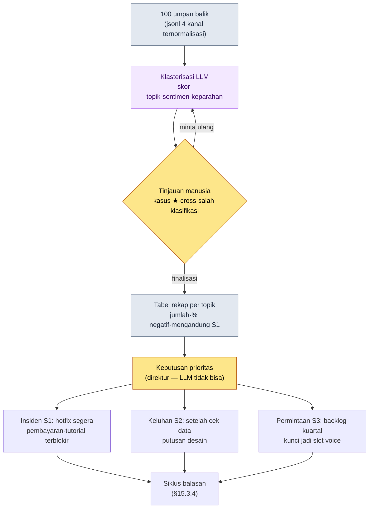

# 15.3 Mengubah 100 Umpan Balik Jadi Topik — Klasterisasi ke LLM, Prioritas ke Manusia

> Pembaca utama: Game Designer dan direktur yang bertanggung jawab atas respons pengguna dalam Live Ops (operasional game) (tim skala menengah, 10\~50 orang)
> Versi ringkas untuk pembaca solo/hobi: §15.3.7 "Kalau Sendirian, Cukup Sebanyak Ini"

Sejujurnya saya akui dulu di awal. Saya tidak punya pengalaman panjang menangani langsung Live Ops pascarilis dalam satuan 1\~2 tahun. Sebagian besar bab ini adalah **pengamatan industri dan pengalaman bersinggungan** yang menumpuk di atas karier 24 tahun. Karena itu bab ini tidak menyatakan secara mutlak "lakukan Live Ops seperti ini". Sebagai gantinya, saya mencoba memutar satu kali sampai tuntas: apa yang muncul jika siklus *masukan → AI → verifikasi → keputusan manusia* yang sudah teruji dalam produksi konten prarilis disisipkan begitu saja ke masukan bernama **umpan balik pengguna**. Kerangka alat ini sama dengan city_hunting_generator di §6.2, hanya masukannya yang berubah dari "metadata kota" menjadi "100 umpan balik pengguna".

Pemandangan minggu pertama operasional umumnya serupa. Forum, Discord, tiket CS, dan ulasan toko menumpuk ratusan hingga ribuan per hari. Mustahil dibaca semua oleh manusia, tetapi kalau tidak dibaca, laporan bug yang sama sampai 50 kali ikut terkubur. Bab ini membahas metode di mana **LLM mengelompokkan tumpukan itu menjadi topik dan memberi skor sentimen**, lalu manusia hanya masuk ke **keputusan prioritas**: "jadi, apa yang akan kita perbaiki minggu ini".

---

## 15.3.1 Umpan Balik Bukan 'Bahan Bacaan', tetapi 'Masukan Klasifikasi'

Tabel yang membagi umpan balik ke dalam 4 kanal (survei dalam game, forum/Discord, ulasan toko, tiket CS) dan mengklasifikasikannya ke dalam 4 jenis (bug, permintaan, keluhan, pujian) ada di buku panduan operasional mana pun. Semuanya benar. Masalahnya, walau tabel itu dihafal, tetap tidak menjawab "bagaimana memproses 412 umpan balik yang masuk hari ini". Selama umpan balik dipandang sebagai *objek yang dibaca dan diklasifikasikan manusia*, volume umpan balik akan selalu mengalahkan jumlah anggota tim operasional.

Saya ubah sudut pandangnya. Satu umpan balik adalah **masukan terstruktur**. Ia adalah rekaman dengan lima slot: `{sumber, teks asli, topik, sentimen, tingkat keparahan}`. Dengan memandangnya begini, hakikat pekerjaannya berubah. Bukan "membaca semua", melainkan "mengelompokkan menjadi topik dan menentukan prioritas". Dan klasterisasi topik serta penilaian sentimen kalau dikerjakan manusia akan membosankan dan kriterianya goyah setiap kali, sementara mesin menerapkan tolok ukur yang sama secara persis ke 100 data. Inilah jenis pekerjaan yang LLM lebih unggul daripada manusia. Pembagian peran yang memproduksi 30 kota di §6.2 (rulebook = deterministik, isi teks = AI, tinjauan = manusia) tetap berlaku di sini. Yang berbeda hanya satu: pekerjaan terakhir yang dilakukan manusia bukan "meninjau isi teks", melainkan "menentukan prioritas".

Saya catat satu hal tentang distribusi jenis umpan balik. Pengguna yang secara sukarela menulis cenderung condong ke pengguna yang punya keluhan, bukan pengguna yang puas. Pelanggan yang puas pergi dengan diam, sedangkan pelanggan yang tidak puas datang lagi ke meja layanan. Karena itu distribusi sentimen di forum dan ulasan cenderung condong ke sisi negatif dibanding kepuasan seluruh pengguna sebenarnya (pengamatan penulis — besar bias persisnya berbeda menurut game, kanal, dan periode, jadi tepat dibaca sebagai *arah*, bukan sebagai angka mutlak). Bias ini harus dipegang di kepala agar, saat melihat "negatif 60%" pada hasil klasterisasi, kita tidak salah baca seolah game sedang ambruk.

---

## 15.3.2 [Worked Transcript] 100 Umpan Balik → Klaster Topik + Sentimen

Mari putar satu siklus sampai tuntas secara nyata. Masukannya adalah 100 umpan balik yang terkumpul dari 4 kanal dalam satu pekan, dan keluarannya adalah klaster topik, sentimen, serta prioritas. Prompt masukan bisa disalin dan dipakai apa adanya, dan keluaran di bawah adalah hasil rekonstruksi dari format sesi klasifikasi nyata.

### Tahap 1 — Masukan: Jadikan Umpan Balik Tabel yang Bisa Dibaca Mesin

Teks asli yang dikeruk dari kanal dinormalisasi menjadi satu rekaman per baris. Ini bukan menulis baru, cukup mengekstrak dan merapikan.

```jsonl
{"id": "fb_0001", "src": "discord",     "text": "Di enhancement +12 gagal 50 kali. Apa peluangnya benar segini? Tolong refund"}
{"id": "fb_0002", "src": "store_review","text": "Grafiknya cantik tapi lag-nya parah banget, tiap perang guild selalu force close"}
{"id": "fb_0003", "src": "cs_ticket",   "text": "Sudah bayar tapi diamond-nya tidak masuk, nomor order terlampir"}
{"id": "fb_0004", "src": "forum",       "text": "Kapan job baru Archer rilis ㅠㅠ kan sudah dijanjikan waktu pra-registrasi"}
{"id": "fb_0005", "src": "discord",     "text": "Baru minggu pertama buka tapi komunikasi tim operasional bagus, pengumuman cepat. Lanjutkan ya"}
{"id": "fb_0006", "src": "store_review","text": "Damage bos tertentu (Heuknang) nggak masuk akal. Full gear pun sekali pukul mati. Minta patch balance"}
{"id": "fb_0007", "src": "cs_ticket",   "text": "Tutorial tahap 5 tidak bisa lanjut, tombolnya tidak bisa ditekan (perangkat: Galaxy seri A)"}
// ... fb_0008 ~ fb_0100 (dihilangkan)
```

Pada tahap masukan, rekaman membiarkan `topik·sentimen·tingkat keparahan` kosong. Mengisi kolom kosong itu adalah tugas LLM dua tahap.

### Tahap 2 — Prompt: Suruh Klasterisasi, tetapi Paksakan Label, Format, dan Jalan Keluar

```
Kelompokkan feedback_100.jsonl yang dilampirkan (100 umpan balik satu pekan) menjadi topik dan beri skor sentimen sekalian.
Topik hanya boleh dipilih dari daftar ini (dilarang membuat sendiri secara bebas): Enhancement/Peluang, Balance, Server/Performa, Pembayaran/Refund,
Permintaan Konten Baru, Tutorial/Onboarding, UI/Kontrol, Pujian/Dukungan, Lainnya. Jika 'Lainnya' melebihi 8, usulkan juga kandidat topik baru.
Sentimen: negatif·netral·positif, tingkat keparahan: S1·S2·S3·S4.
// (maksud: S1 hanya jika spesifik·dapat direproduksi·memblokir fungsi. Keluhan kuat biasa = S2)
Untuk yang tidak yakin, taruh di 'Lainnya' dan beri tanda ★ di ujung id lalu serahkan ke saya, jangan dipaksakan masuk.
Beri dua tabel saja — Tabel A (per kasus): id·topik·sentimen·tingkat keparahan / Tabel B (per topik): topik·jumlah·% negatif·1 teks asli perwakilan·apakah mengandung S1.
```

Yang menentukan hasil klasifikasi dalam prompt ini bukan daftar topik atau skala sentimen, melainkan tiga perangkat kendali: *mengunci* label, *memaku* format, dan *membuka* jalan keluar. Kalau topik dibiarkan dibuat bebas, LLM akan menciptakan label rancu yang tidak bisa dipakai sebagai prioritas, seperti "ketidakpuasan umum" atau "permintaan perbaikan gameplay". Daftar label yang diizinkan (aturan 1), definisi tingkat keparahan (aturan 3 — definisi sempit S1 adalah intinya), format keluaran (dua tabel), serta "kalau tidak yakin beri ★ dan serahkan ke manusia" (aturan 5). Jika keempatnya hilang, tabel justru merosot dari alat prioritas menjadi satu lagi bahan bacaan. Daftar label ini sendiri adalah *sistem kategori lapisan L4 umpan balik* yang disebut di §15.1.5 — label harus terkunci agar tren bisa dibandingkan dengan sumbu yang sama di tiap kuartal.

### Tahap 3 — Keluaran Claude (Rekonstruksi, Cuplikan)

```
[Tabel A] Klasifikasi per kasus (cuplikan)
id       | topik              | sentimen | keparahan
fb_0001  | Enhancement/Peluang| negatif  | S2
fb_0002  | Server/Performa    | negatif  | S2
fb_0003  | Pembayaran/Refund  | negatif  | S1
fb_0004  | Permintaan Konten Baru | netral | S3
fb_0005  | Pujian/Dukungan    | positif  | S4
fb_0006  | Balance            | negatif  | S1
fb_0007  | Tutorial/Onboarding| negatif  | S1
fb_0042★ | Lainnya            | netral   | S3
...

[Tabel B] Rekap per topik (total 100 kasus)
topik              | jumlah | % negatif | teks perwakilan                        | mengandung S1
Server/Performa    | 24     | 92%       | "tiap perang guild force close"         | ya (sebagian tereproduksi)
Enhancement/Peluang| 21     | 95%       | "di +12 gagal 50 kali"                  | tidak
Balance            | 14     | 86%       | "Heuknang full gear sekali pukul"       | ya
Permintaan Konten Baru | 12 | 8%        | "kapan Archer rilis"                    | tidak
Tutorial/Onboarding| 9      | 78%       | "tombol tahap 5 tidak bisa ditekan (Galaxy A)" | ya
Pembayaran/Refund  | 8      | 100%      | "diamond tidak masuk"                   | ya
UI/Kontrol         | 6      | 67%       | "tombol skill kecil jadi salah sentuh"  | tidak
Pujian/Dukungan    | 4      | 0%        | "komunikasi tim operasional bagus"      | tidak
Lainnya            | 2      | -         | (fb_0042★, fb_0067★ menunggu putusan manusia) | -

Sentimen keseluruhan: negatif 71 / netral 18 / positif 11
'Lainnya' 2 kasus (kurang dari 8) → tidak perlu usul topik baru
Tanda ★ kurang yakin 2 kasus: fb_0042, fb_0067 (minta putusan manusia)
```

Bagian paling bernilai dari keluaran ini bukan tabelnya, melainkan **dua baris paling bawah, "2 kasus bertanda ★"**. Itulah tempat LLM melaporkan apa yang tidak bisa ia kelompokkan dan menyerahkannya ke manusia. Ini desain yang sama seperti saat AI memberi tanda ambigu sendiri pada NPC 'Greum' di §6.2. Prompt yang baik membuat AI bisa berkata "yang ini saya tidak yakin".

### Tahap 4 — Verifikasi dan Penolakan (Tempat Manusia)

Keluaran ini tidak boleh diterima mentah-mentah. Satu titik benar-benar tersangkut.

21 kasus topik `Enhancement/Peluang` semuanya diklasifikasikan S2 (keluhan). Padahal di antaranya fb_0001 mengandung "tolong refund". LLM hanya melihatnya sebagai "keluhan kuat (S2)". Di sinilah manusia turun tangan. Keluhan tentang peluang enhancement — selama data menunjukkan peluang bekerja sesuai spesifikasi — bukanlah insiden S1. Sebab keluhan terhadap peluang yang berjalan sesuai spesifikasi adalah *masalah desain·persepsi*, bukan *bug*. Putusan S2 dari LLM benar. Namun, sinyal "permintaan refund" perlu di-*cross-link* ke topik pembayaran agar CS menanganinya terpisah. LLM hanya memberi satu label tunggal per topik, dan melewatkan kasus di mana satu umpan balik mencakup dua topik.

Maka saya minta ulang.

```
Tambah aturan: jika satu kasus mencakup dua topik (mis. keluhan enhancement + permintaan refund), selain topik utama
tulis topik pendukung di kolom 'cross'. Tambahkan kolom cross pada Tabel A dan keluarkan ulang.
Namun, keluhan tentang peluang enhancement itu sendiri, jika menurut data peluangnya sesuai spesifikasi, pertahankan sebagai S2, bukan S1.
```

Selesai dengan satu putaran bolak-balik ini. LLM menjawab ulang fb_0001 dengan `topik=Enhancement/Peluang, cross=Pembayaran/Refund, keparahan=S2`, dan 2 kasus bertanda ★ dibaca langsung oleh manusia lalu fb_0042 ditempatkan ulang ke `UI/Kontrol`, fb_0067 ke `Tutorial/Onboarding`. **Membaca dan mengklasifikasikan 100 kasus dari nol oleh manusia butuh setengah hari, sedangkan draf LLM + tinjauan manusia + satu putaran bolak-balik selesai dalam kurang dari satu jam** (perkiraan penulis, hipotesis belum terverifikasi — nilai penghematan persisnya berbeda menurut jumlah umpan balik dan jumlah kanal, jadi tepat dibaca dari beda struktur antara "manual dari nol" dan "draf+tinjauan", bukan dari waktu mutlak).

---

## 15.3.3 LLM Tidak Bisa Memberi Prioritas — Tempat Manusia

Di sini saya menarik garis yang menentukan. Tabel B di atas hanya berkata "topik mana berapa kasus, seberapa negatif". **"Jadi, apa yang akan diperbaiki lebih dulu minggu ini" tidak bisa diberikan LLM.** Itu keputusan yang terjalin dengan biaya, jadwal, dan visi game, dan tanggung jawab keputusan itu ada pada direktur.

Dengan tabel yang sama, dua tim operasional bisa mengambil keputusan yang berlawanan. Dilihat dari jumlah saja, `Server/Performa` (24 kasus) dan `Enhancement/Peluang` (21 kasus) menempati peringkat 1·2. Namun prioritas berjalan berbeda dari urutan jumlah. Alasannya adalah **tingkat keparahan dan keterbalikan**.



Dalam alur ini, tempat yang disentuh tangan manusia hanya dua. Gerbang tinjauan di tengah (putusan ★·cross·salah klasifikasi), dan keputusan prioritas paling bawah. Klasifikasi 100 kasus yang membosankan di antaranya diputar LLM. Dan logika nyata keputusan prioritas bukan jumlah, melainkan tiga sumbu berikut.

| Topik | Jumlah | Pertimbangan prioritas (tempat direktur) |
|---|---|---|
| Pembayaran/Refund (S1) | 8 | **Prioritas 1.** Jumlahnya sedikit tapi memblokir fungsi + tidak dapat dibalik (uang). Hotfix 24h |
| Tutorial/Onboarding (S1) | 9 | **Prioritas 2.** Langsung terkait churn pengguna baru. Tereproduksi di perangkat tertentu → patch |
| Server/Performa | 24 | **Prioritas 3.** Jumlah terbanyak tapi kerja infrastruktur = jadwal panjang. Tak bisa hotfix, pekan depan |
| Enhancement/Peluang (S2) | 21 | **Dipertahankan.** Jika sesuai spesifikasi menurut data, bukan bug. Ditinjau terpisah sebagai keputusan desain |
| Permintaan Konten Baru | 12 | **Backlog.** Negatif 8% (= ekspektasi positif). Dikunci jadi slot voice kuartal |

Alasan `Server/Performa` peringkat jumlah 1 turun ke prioritas 3 adalah karena itu kerja infrastruktur yang tak bisa diperbaiki dengan hotfix, dan alasan `Pembayaran/Refund` peringkat jumlah 6 naik ke peringkat 1 adalah karena itu insiden tidak dapat dibalik yang menyangkut uang. **Penataan ulang ini tidak bisa dilakukan LLM.** LLM hanya memberi fakta sampai "pembayaran 8 kasus, negatif 100%". Keputusan bahwa itu prioritas 1 adalah bagian manusia yang tahu biaya, risiko hukum, dan visi game. Inilah wujud nyata di bidang umpan balik dari "AI membuat klasifikasi·kandidat, manusia berfokus pada adopsi dan keputusan visi" yang disebut di §15.1.5.

---

## 15.3.4 Balasan — Karena Tahap Tidak Dapat Dibalik, Gerbang Tinjauan Lebih Berat

Setelah prioritas ditetapkan, kita membalas pengguna. Dalam Live Ops, ketiadaan balasan adalah titik kerusakan kepercayaan terbesar. Walau tidak ada yang bisa dijawab, "sedang ditinjau" lebih baik daripada tanpa respons. Draf balasan pun bisa ditarik LLM per topik.

> **[Draf balasan — keluaran LLM, per topik]**
>
> - **Pembayaran/Refund (S1)**: "Kami telah memverifikasi kasus diamond yang tidak masuk. Kami akan memberikan secara retroaktif dalam 24 jam berdasarkan nomor order, dan membalas secara individual."
> - **Server/Performa**: "Kami sedang memverifikasi reproduksi force close yang terjadi saat perang guild. Akan kami tangani secara prioritas pada pemeliharaan pekan depan, dan kami akan menginformasikan perkembangannya lewat pengumuman."
> - **Enhancement/Peluang**: "Kami telah memverifikasi lewat data bahwa peluang enhancement diterapkan persis sesuai notasi spesifikasi. Namun, masukan tentang tingkat kesulitan yang dirasakan sedang kami tinjau secara terpisah."
> - **Permintaan Konten Baru (Archer)**: "Job baru ada di roadmap, dan begitu jadwalnya difinalkan kami akan mengumumkannya paling pertama."

Di sini ada satu hal yang berbeda secara menentukan dari §6.2. **Pengiriman balasan adalah tahap tidak dapat dibalik.** NPC kota tinggal dibuang dan dibuat ulang, tetapi teks pengumuman·balasan yang sekali sudah dilihat pengguna tak bisa ditarik kembali. Jika kita kirim otomatis "diberikan dalam 24 jam" padahal kenyataannya butuh tiga hari, janji itu tertinggal sebagai jejak tidak dapat dibalik di komunitas. Karena itu prinsip tahap tidak dapat dibalik di §15.1.4 bekerja **lebih berat** di bidang umpan balik dibanding bidang lain. Draf balasan otomatis dibuat LLM, tetapi **sebelum lolos gerbang tinjauan CS, satu huruf pun tidak dikirim otomatis.** Peninjau hanya melihat apakah janji jadwal (24h·pekan depan) cocok dengan jadwal kerja sebenarnya, dan apakah kasus sensitif (sengketa hukum·sengketa refund) tidak tercampur ke dalam kumpulan kirim otomatis. Inilah tempat manusia mengambil alih penilaian yang tak bisa ditangkap lint.

| Tahap | Keterbalikan | Siapa |
|---|---|---|
| Klasterisasi umpan balik·skor sentimen | dapat dibalik (bebas dijalankan ulang) | LLM |
| Tinjauan topik·keputusan prioritas | dapat dibalik (sebelum finalisasi) | manusia (direktur) |
| Pembuatan draf balasan | dapat dibalik (dibuang·ditulis ulang) | LLM |
| **Pengiriman balasan·penayangan pengumuman** | **tidak dapat dibalik (persepsi pengguna)** | **manusia (setelah tinjauan CS)** |

---

## 15.3.5 Kunci Voice Pengguna ke Dalam Retrospektif Kuartal

Agar umpan balik yang sama tidak goyah ke keputusan berbeda tiap kuartal, hasil klasterisasi harus dikunci sebagai **slot masukan tetap retrospektif kuartal**. Bukan secara impulsif "belakangan banyak keluhan enhancement", melainkan tabel yang direkap dengan sumbu label yang sama tiap kuartal masuk ke dalam tabel retrospektif. Alasan melarang pembuatan label bebas dan menguncinya dengan daftar yang diizinkan di §15.3.2 dipanen kembali di sini.

> **2026 Q2 voice pengguna (rekap otomatis LLM, akumulasi kuartal)**
> ```
> Klasterisasi sekitar 5,000 kasus akumulasi dari 4 jenis kanal (jumlah = rekap nyata kuartal, bukan rekayasa)
>
> Topik negatif teratas:   Enhancement/Peluang > Server/Performa > Balance > Pembayaran/Refund
> Topik permintaan teratas: Job baru > Area berburu baru > Sistem guild > Perbaikan UI
> Tren sentimen kuartal:    Q1 negatif 68% → Q2 negatif 71% (sedikit memburuk — ditarik topik enhancement)
> ```

Tabel ini menjadi *masukan* keputusan kuartal. Keputusannya sendiri bagian direktur, dan masukannya bagian pengguna. Tren kuartal ("Q1 68% → Q2 71%") dibaca hanya sebagai *arah*. Bukan nilai mutlak satu kuartal, melainkan arah perubahan pada sumbu label yang sama yang menjadi sinyal. Jika % negatif naik, kita telusuri ulang "topik mana yang menariknya naik" lalu menghubungkannya ke prioritas kuartal berikutnya. Draf laporan kuartal ini sendiri pun ditarik LLM dalam bahasa alami, dan manusia hanya menambahkan komentar keputusan — inilah tempat nyata dari draf otomatis laporan kuartal yang disebut di §15.1.5.

---

## 15.3.6 Cara Menangani Angka Secara Jujur

Bab Live Ops mudah tergoda menyisipkan tabel seperti "setelah siklus umpan balik diterapkan, NPS naik dari 20 menjadi 45". Saya tidak pernah mengukur kausalitas itu, jadi saya tidak menulisnya. Prinsip buku ini salah satu dari tiga hal berikut.

Pertama, **jumlah rekap nyata dipakai apa adanya.** Jumlah per topik di §15.3.2 (server 24·enhancement 21·pembayaran 8) dan akumulasi kuartal di §15.3.5 adalah nilai yang dihitung satu per satu dari hasil klasifikasi, bukan rasio yang dicocokkan agar enak dilihat.

Kedua, **perkiraan ditulis sebagai perkiraan.** "Klasifikasi 100 kasus dari setengah hari → satu jam" (§15.3.2) dan "sentimen forum condong ke negatif" (§15.3.1) adalah perkiraan berbasis pengalaman·pengamatan penulis dan merupakan hipotesis belum terverifikasi. Jangan hafal nilai mutlaknya, cukup baca sebagai *arah* (volume umpan balik selalu mengalahkan jumlah orang, tulisan sukarela condong ke sisi keluhan).

Ketiga, **hanya yang dapat diukur yang dijanjikan sebagai indikator.** Yang benar-benar bisa diukur dari siklus umpan balik bukan kepuasan hasil (NPS), melainkan indikator proses — sisa umpan balik belum terklasifikasi (target 0), lead time penemuan insiden S1 → hotfix, waktu respons balasan, rasio topik 'Lainnya' (kalau label yang diizinkan tak mampu menampung kenyataan, 'Lainnya' menggelembung). Keempatnya bisa dibicarakan dalam rapat dengan angka, bukan "perasaan".

---

## 15.3.7 Coba Sendiri — Satu Langkah yang Bisa Dilakukan Hari Ini

> **Kalau sendirian, cukup sebanyak ini**: Tidak perlu sistem CS maupun dataset. Salin saja secara manual 20\~30 ulasan toko·tulisan komunitas dari game Anda sendiri (atau game yang Anda sukai), jadikan jsonl (`{"id":..., "src":..., "text":...}`), tempel prompt §15.3.2 apa adanya lalu putar satu kali. Dari Tabel B yang keluar, cari satu kasus di mana "topik peringkat jumlah 1" dan "topik yang ingin Anda perbaiki lebih dulu" berbeda, lalu tuliskan satu baris alasannya — maka akan terasa di badan kenapa prioritas itu pekerjaan manusia, bukan pekerjaan LLM.

Kalau tim, mulailah dengan satu langkah berikut. Kunci dulu skrip ekstraksi yang mengumpulkan umpan balik 4 kanal menjadi jsonl satu rekaman per baris, dan **daftar label topik yang diizinkan** dari §15.3.2. Label harus terkunci agar, entah klasifikasi LLM atau klasifikasi manusia, semuanya diukur dengan sumbu yang sama dan tren kuartal bisa dibandingkan. Balasan otomatis menyusul setelah itu — karena balasan tidak dapat dibalik, jangan pernah menghubungkannya ke kirim otomatis tanpa gerbang tinjauan CS.

---

### Poin-Poin Penting
- Umpan balik bukan bahan bacaan, melainkan masukan klasifikasi — klasterisasi·sentimen ke LLM, prioritas ke manusia.
- Prioritas terbelah bukan oleh jumlah, melainkan oleh tingkat keparahan·keterbalikan (pembayaran 8 kasus > server 24 kasus).
- Karena balasan tidak dapat dibalik, gerbang tinjauan CS lebih berat dibanding bidang lain.

### Pratinjau Bab Berikutnya
- 16.1 Operasional TaskForce — alat untuk menarik kesepakatan antarbidang
