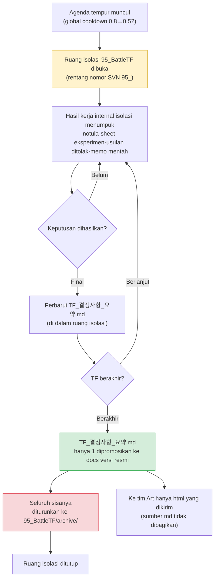

# 16.1 Mengoperasikan TF Tempur — Hanya Keputusan yang Menjadi Versi Resmi di Ruang Kerja Terisolasi

Kamis pukul 4 sore. Rapat TF tempur baru saja selesai dan tujuh orang kembali ke meja masing-masing. Di papan tulis masih tersisa coretan tentang apakah global cooldown sebaiknya diturunkan dari 0.8 detik ke 0.5 detik atau tidak. Desainer balancing senior berkata, "Di simulasi saya, 0.5 yang benar," sementara code lead berkata, "Kalau 0.5, server tick tidak akan sanggup mengejarnya." UI Designer berkata, "Saya tidak tahu mana yang benar, tapi lebar gauge cooldown jadi terlalu sempit."

Ketiganya benar. Dan jika ketiganya mulai menuliskan kesimpulan masing-masing di dokumen bidangnya sendiri, minggu depan ketiga dokumen itu akan saling bertabrakan. Sheet balancing tertulis 0.5, spesifikasi kode tertulis 0.8, panduan UI tertulis 0.6. Siapa pun yang melihatnya tidak akan tahu mana yang versi resmi.

Alasan keberadaan TF tempur justru untuk menyerap tabrakan ini di satu tempat. Dan hasil penyerapan itu — satu-satunya keputusan — yang boleh naik menjadi dokumen versi resmi. Sisa puing-puing diskusi harus berakhir di dalam ruang kerja yang terisolasi. Bab ini membahas mekanisme isolasi dan penyerapan tersebut.

---

## 16.1.1 TF Bukan Departemen Permanen, melainkan Ruang Kerja Terisolasi

Perombakan besar sistem tempur tidak pernah selesai dengan satu fungsi pekerjaan saja. Begitu Anda menyentuh satu global cooldown, balancing (angka), kode (server tick), UI (representasi gauge), animasi (durasi motion), dan suara (rasa hantaman) ikut bergoyang bersamaan. Jika agenda seperti ini dijalankan terpisah per bidang, keputusan molor 2–4 minggu, dan begitu keputusan keluar pun bidang-bidang itu tidak sinkron satu sama lain.

TF (TaskForce) adalah unit yang mengumpulkan beberapa fungsi pekerjaan ke satu ruang kerja untuk sementara, demi mencegah ketidaksinkronan ini. Intinya ada pada "sementara" dan "terisolasi". Jika diskusi TF dibiarkan mengalir begitu saja ke dalam sistem dokumen versi resmi perusahaan, diskusi yang belum terverifikasi, usulan yang ditolak, dan angka yang masih dieksperimenkan akan mencemari versi resmi. Karena itu, di dalam SVN kami membuat ruang kerja terisolasi yang diawali dengan nomor `95_`.

`95_BattleTF`. Penomoran rentang 95 adalah kesepakatan yang berarti ruang kerja TF jangka pendek. Docs versi resmi umum menggunakan penomoran rentang 10 dan 20, sedangkan rentang 90 adalah sinyal "sementara, terisolasi, akan ditutup". Hanya dengan melihat nomor folder, pesan "ini bukan versi resmi, jangan kutip angka yang Anda lihat di sini" langsung tersampaikan.

Aturan isolasinya sederhana.

- Semua dokumen yang diproduksi di dalam TF (notula rapat, sheet eksperimen, usulan yang ditolak, memo mentah) hanya hidup di dalam `95_BattleTF`.
- Saat TF berakhir, **hanya satu** `TF_결정사항_요약.md` yang dipromosikan menjadi docs versi resmi.
- Sisanya seluruhnya diturunkan ke `95_BattleTF/archive/` dan hanya disimpan.

Di sinilah letak bahaya TF yang mengeras menjadi departemen permanen. Begitu isolasi terlepas, angka yang belum terverifikasi di ruang kerja TF mulai dikutip seolah versi resmi, dan keputusan yang sama kembali pecah di tempat lain setiap kuartal.

---

## 16.1.2 Dari Isolasi ke Penyerapan: Alur Keseluruhan

Satu siklus TF tempur berstruktur membuka ruang yang terisolasi, menumpuk diskusi, eksperimen, dan keputusan di dalamnya, lalu saat berakhir hanya menyerap keputusannya saja menjadi versi resmi.



Dari kiri atas agenda masuk, di dalam ruang isolasi berwarna kuning semua kebisingan diproses, dan hanya satu kotak hijau — ringkasan keputusan — yang keluar menjadi versi resmi. Warna merah adalah penurunan. Satu gambar ini adalah keseluruhan dari pengoperasian ruang kerja rentang 95.

---

## 16.1.3 Worked Transcript (rekaman sesi nyata) — Membentuk Ringkasan Keputusan agar Bisa Diserap

Saat TF berakhir, pekerjaan yang paling banyak menyita tenaga adalah menyaring "hanya keputusan yang akan naik menjadi versi resmi" dari notula rapat dan sheet eksperimen senilai satu kuartal. Diskusinya panjang, usulan yang ditolak dan usulan yang difinalisasi bercampur, dan angka yang sama tertulis sedikit berbeda di tiap rapat. Jika ini dirapikan manusia secara manual, pekerjaan penutupannya saja menghabiskan satu hari penuh.

Berikut adalah seluruh proses prompt yang benar-benar saya jalankan, keluaran mentah dari Claude, dan bagaimana saya memverifikasi, menolak, serta meminta ulang. Saya menyajikannya apa adanya tanpa ringkasan.

### Prompt Pertama (lengkap)

```
Dari 6 notula rapat 95_BattleTF di bawah ini, ambil hanya keputusan final yang akan naik
menjadi versi resmi dan buat draf TF_결정사항_요약.md. TF akan segera berakhir.
Hanya yang sudah final (kecualikan yang ditolak, masih dieksperimenkan, dan "lihat lain kali"), tiap keputusan
dalam format ID keputusan·topik·nilai final·dasar (sumber data)·pengambil keputusan·tanggal final.
Jika topik yang sama nilainya berubah di tiap rapat, simpan hanya nilai terakhir dan buang yang sebelumnya.
Jika tidak jelas apakah final, jangan dibuang melainkan pisahkan sebagai [perlu ditinjau], dan jika tidak ada sumber dasar tandai sebagai [dasar tidak dicantumkan].

Notula rapat:
--- notula 2026-W14-mon ---
Agenda 1: Tinjau global cooldown 0.8→0.5. Menurut simulasi balancing (sim_gcd_0407.xlsx),
0.5 membuat dispersi DPS -12%. Code lead: 0.5 ditangguhkan karena batas server tick (33ms).
Keputusan: kesepakatan awal 0.6 (sementara). Tes beban 0.6 dari sisi kode hingga rapat berikutnya.
Agenda 2: i-frame penghindaran 12f→10f. Anim director: motion 8f, jadi 10f akan terlihat terputus secara visual.
Keputusan: 12f dipertahankan, final. Pengambil keputusan: lead perancang.
... (tidak ada yang dipotong, sebenarnya 6 notula rapat lengkap dimasukkan) ...
--- notula 2026-W16-thu ---
Agenda 1: Global cooldown. Tes beban 0.6 lolos (server tick masih punya cadangan 18%).
Keputusan: 0.6 final. Pengambil keputusan: lead perancang. Dasar sim_gcd_0407.xlsx + load_0415.log.
Agenda 3: Reward kill koin 1.2x. Usulan balancing, tanpa dasar. Ditangguhkan.
```

### Keluaran Mentah dari Claude (apa adanya)

```markdown
# TF_결정사항_요약.md (draf)

## Keputusan Final

### D-GCD-01 | Global Cooldown
- Nilai final: 0.6 detik (sebelumnya 0.8 detik)
- Dasar: sim_gcd_0407.xlsx (pengaruh dispersi DPS), load_0415.log (beban server tick punya cadangan 18%)
- Pengambil keputusan: lead perancang
- Tanggal final: 2026-W16-thu
- Catatan: Di W14 ada usulan 0.5 tetapi karena batas server tick mengerucut ke 0.6. Usulan 0.5 dibatalkan.

### D-IFRAME-01 | i-frame Penghindaran
- Nilai final: 12 frame dipertahankan
- Dasar: [dasar tidak dicantumkan] — hanya tercatat penilaian kualitatif bahwa motion anim 8f terlihat terputus secara visual
- Pengambil keputusan: lead perancang
- Tanggal final: 2026-W14-mon

## [Perlu Ditinjau]

### R-COIN-01 | Reward Kill Koin 1.2x
- Status: ditangguhkan (usulan balancing, tanpa data dasar)
- Penilaian: tidak bisa difinalisasi karena dasar belum diajukan. Disarankan dialihkan menjadi agenda mandiri tim balancing setelah TF berakhir.
```

### Verifikasi Saya — Apa yang Saya Terima dan Apa yang Saya Tolak

Saya memeriksa ketiga item satu per satu.

**D-GCD-01 lolos apa adanya.** Membuang usulan sementara 0.5/0.6 dari W14 dan hanya menyisakan 0.6 final dari W16 sudah tepat. Aturan 3 dijalankan dengan benar. Mengikat dua sumber dasar juga benar.

**D-IFRAME-01 saya tolak.** Claude mengklasifikasikannya sebagai "final", padahal dasarnya `[dasar tidak dicantumkan]`. Jika dinaikkan ke keputusan final hanya dengan penilaian kualitatif (terputus secara visual), orang lain yang melihat versi resmi tidak akan menemukan dasar "mengapa 12f". Ini kasus benturan antara aturan 1 dan 5 — Claude menganggapnya "final" karena pengambil keputusan sudah memfinalkannya, tetapi saya harus menerapkan kebijakan docs kami bahwa "keputusan final tanpa dasar tidak boleh naik ke versi resmi". Kebijakan ini tidak tertulis di notula rapat, jadi mustahil Claude mengetahuinya.

**R-COIN-01 klasifikasinya benar tetapi resepnya berlebihan.** "Disarankan dialihkan menjadi agenda mandiri tim balancing" adalah prosedur yang dibuat-buat oleh Claude. Di perusahaan kami tidak ada jalur pengalihan semacam itu. Klasifikasinya (perlu ditinjau) saya terima, tetapi kalimat resepnya saya buang.

### Prompt Permintaan Ulang Kedua

```
Buat ulang dengan memasukkan verifikasi. D-GCD-01 biarkan apa adanya,
D-IFRAME-01 karena dasarnya hanya penilaian kualitatif, keluarkan dari final dan pindahkan ke [promosi setelah dasar dilengkapi].
R-COIN-01 klasifikasinya biarkan tetapi buang kalimat resep seperti "disarankan dialihkan" — kamu tidak tahu prosedur perusahaan kami, jadi tulis hanya status dan fakta.
Dan jangan mengarang prosedur, jalur, atau nama tim yang tidak ada di notula rapat, kalau tidak tahu kosongkan sebagai [perlu penilaian lead perancang].
// (maksud: syarat promosi versi resmi D-IFRAME-01 = data pengukuran frame motion dari anim director dilampirkan ke notula rapat)
```

### Keluaran Kedua (versi final)

```markdown
# TF_결정사항_요약.md

## Keputusan Final (kandidat promosi versi resmi)

### D-GCD-01 | Global Cooldown
- Nilai final: 0.6 detik (sebelumnya 0.8 detik)
- Dasar: sim_gcd_0407.xlsx, load_0415.log (beban server tick punya cadangan 18%)
- Pengambil keputusan: lead perancang / Tanggal final: 2026-W16-thu
- Catatan: Usulan 0.5 dibatalkan karena batas server tick.

## [Promosi Setelah Dasar Dilengkapi]

### D-IFRAME-01 | i-frame Penghindaran 12f Dipertahankan
- Hanya tercatat penilaian kualitatif (terputus secara visual dibanding motion anim 8f).
- Syarat promosi: data pengukuran frame motion dilampirkan ke notula rapat.

## [Perlu Penilaian Lead Perancang]

### R-COIN-01 | Reward Kill Koin 1.2x
- Status: ditangguhkan. Usulan balancing, tanpa data dasar. Tidak ada nilai final.
```

Dari versi final ini, hanya bagian "Keputusan Final" — satu item D-GCD-01 — yang dipromosikan menjadi docs versi resmi. Dua bagian lainnya turun ke `archive/`. Enam notula rapat senilai satu kuartal terserap menjadi satu baris versi resmi.

Di sinilah terpisah apa yang dikerjakan AI dan apa yang tidak. AI menelusuri perubahan nilai topik yang sama melintasi 6 notula rapat, memisahkan usulan yang ditolak, dan menandai dasar yang hilang — pengulangan sederhana mencocokkan enam notula rapat baris demi baris inilah justru bagian yang mudah terlewat oleh tangan manusia. Namun penerapan kebijakan "keputusan final tanpa dasar tidak boleh naik ke versi resmi", fakta perusahaan bahwa "tidak ada jalur pengalihan", dan penilaian akhir "final/ditangguhkan" semuanya dikerjakan oleh manusia. Jika paragraf AI dihapus, kerja ekstraksi dan penyortiran lenyap, tetapi keputusan tentang apa yang akan naik ke versi resmi tetap berada di tangan manusia.

---

## 16.1.4 Permintaan Eksternal Masuk dengan Diklasifikasikan ke dalam 3 Jalur

Tidak semua agenda yang masuk ke TF berasal dari internal. Ada permintaan dari publisher, outsourcing art, dan tim bisnis berupa "tolong kerjakan ini terkait tempur". Jika ini diterima tanpa pandang bulu sebagai agenda TF, TF berubah menjadi loket aduan eksternal.

Karena itu permintaan eksternal langsung diklasifikasikan ke tiga cabang begitu diterima. Hanya yang membutuhkan keputusan tempur yang dimasukkan ke 95_BattleTF, hal yang selesai dengan satu bidang ditangani sendiri oleh penanggung jawabnya, dan yang di luar lingkup atau kurang dasar dibalas atau ditangguhkan dengan menuliskan alasannya. Yang masuk ke TF hanya cabang pertama — inilah garis pertahanan pertama yang mencegah TF merosot menjadi loket aduan. Klasifikasinya sendiri adalah penilaian manusia, tetapi sebatas membaca teks permintaan yang masuk dan menandai secara awal "ini menyangkut berapa bidang" boleh saja AI yang menelaahnya lebih dulu.

Urutan penilaian, worked transcript, dan penanganan lanjutan per jalur dari klasifikasi tiga sisi (`request-triangulate`) ini ditangani sepenuhnya oleh bab berikutnya, 16.2. Di sini saya hanya menegaskan aturan pintu masuk bahwa "TF hanya menerima cabang pertama".

---

## 16.1.5 Ke Tim Art Hanya html yang Dikirim — md Nol Pembelajaran

Begitu keputusan TF dipromosikan menjadi versi resmi, keputusan itu dibagikan ke tim terkait. Di sini ada satu asimetri. Ke tim Art, sumber Markdown (.md) tidak diberikan, melainkan hanya html yang sudah dirender yang dikirim.

Alasannya sederhana. Tim Art cukup mengetahui **hasil** keputusan saja. "Gauge cooldown tolong dirancang ulang lebarnya berbasis acuan 0.6 detik" — satu baris ini adalah seluruh yang mereka butuhkan. Sumber md berisi sistem ID keputusan, referensi atom, jejak usulan 0.5 yang ditolak, dan nama file data dasar. Ini adalah bahasa kerja yang dibagikan oleh perancang dan kode, bukan sesuatu yang harus dipelajari Art.

Jika md diberikan apa adanya, tim Art membayar dua biaya. Pertama, mereka menghabiskan waktu untuk menafsirkan sistem notasi yang tidak ada hubungannya dengan mereka. Kedua, mereka bisa salah mengira informasi yang belum terverifikasi atau yang ditolak sebagai keputusan. html mencegah keduanya — hanya hasil keputusan yang dirender rapi yang terlihat, dan notasi internal disaring dalam proses build.

Jika dituliskan sebagai prinsip: **Bahasa kerja (md) hanya beredar di dalam fungsi pekerjaan yang memakai bahasa itu, dan ke luar dari sana hanya hasil kerja (html) yang keluar.** Ini filosofi yang sama dengan isolasi ruang kerja TF (rentang 95). Yang mentah dipakai di dalam tetap di dalam, dan ke luar hanya hasil yang sudah terserap yang dikirim.

---

## 16.1.6 Fondasi Pengoperasian TF — Lima Prinsip

Agar mekanisme isolasi dan penyerapan dapat berjalan, di bawahnya harus terhampar lima prinsip pengoperasian. Jika salah satu saja hilang, TF runtuh menjadi ajang diskusi.

- **Kejelasan kewenangan keputusan** — Di meja rapat, siapa pengambil keputusan akhir harus sudah ditetapkan per jenis agenda. Aturan tempur oleh lead perancang, angka oleh desainer balancing senior, cara implementasi oleh code lead, benturan antarbidang dieskalasi ke Game Director. Jika kewenangan keputusan kabur, rapat molor menjadi diskusi.
- **Kewajiban notula rapat** — Keputusan tanpa notula bukanlah keputusan. Harus tertinggal sebagai catatan di dalam ruang isolasi. Bahan mentah yang akan diserap saat penutupan adalah notula rapat ini.
- **Data lebih dulu** — Masukan adalah data, bukan opini. Jika "menurut saya" makin banyak, TF jadi tak berdaya. Membuat `[dasar tidak dicantumkan]` ditandai otomatis pada transcript sebelumnya juga merupakan kelanjutan prinsip ini.
- **Tenggat** — Tiap agenda diberi tenggat keputusan, eksperimen, implementasi, dan verifikasi. Agenda tanpa tenggat terkatung-katung 1–2 minggu.
- **Evaluasi ulang berkala** — TF tidak permanen. Kelangsungannya ditinjau ulang tiap kuartal. Jika keputusan kuartal jatuh di bawah jumlah tertentu, TF dibubarkan atau diperkecil. Namun jika kuartal berikutnya sudah diumumkan akan ada ledakan agenda, sepakati perpanjangan satu kuartal.

Saat lima prinsip terikat dan bekerja, ruang rentang 95 yang terisolasi menjadi pabrik keputusan, bukan ajang diskusi.

---

## 16.1.7 Jebakan Umum

Saya merangkum jebakan dan resep yang berulang setelah pertengahan masa operasi TF.

| Jebakan | Gejala | Resep |
|---|---|---|
| Berubah jadi ajang rapat | Hanya tukar opini, tanpa keputusan | Paksa N slot keputusan tiap rapat |
| Pelanggaran kewenangan | TF mengintervensi keputusan bidang lain | Perjelas tabel kewenangan keputusan |
| Beban anggota berlebih | Tergerus pekerjaan utama karena ikut 5–6 TF | Batas total partisipasi TF 8 jam per minggu |
| Permanensi | Mengulang rapat yang sama tanpa dibubarkan | Evaluasi ulang kuartalan |
| Kebocoran isolasi | Angka belum terverifikasi rentang 95 dikutip seolah versi resmi | Promosi versi resmi hanya 1 ringkasan keputusan |
| Putus dari eksternal | Keputusan tidak dibagikan ke eksternal | Promosi versi resmi + pengiriman html |

Kebocoran isolasi adalah yang paling senyap dan berbahaya. Begitu kesepakatan nomor folder runtuh, semuanya runtuh.

---

## 16.1.8 Pengukuran — Apa yang Diserap TF

Saya hanya memindahkan arah dan rasio dari catatan operasi Proyek A milik penulis. Angka di bawah ini bukan nilai absolut, melainkan arah perubahan saat operasi dibanding tanpa TF — siklus absolut berbeda menurut skala tim dan siklus build (pengamatan berdasarkan lingkungan penulis).

| Item | Tanpa TF | Dengan TF | Arah |
|---|---|---|---|
| Siklus 1 keputusan tempur | Terpisah per bidang, beberapa minggu | Satuan beberapa hari | Memendek |
| Benturan antarbidang pasca keputusan | Banyak per kuartal | Sedikit per kuartal | Berkurang |
| Eskalasi ke Game Director | Beberapa per minggu | 1–2 per minggu | Berkurang |
| Berbagi informasi antarbidang | Sporadis | Tetap melalui notula·promosi versi resmi | Tersistematisasi |

Yang paling besar dipulihkan adalah waktu Game Director. Karena TF menyerap keputusan antarbidang di dalam ruang isolasi, benturan yang naik sampai ke meja director berkurang. Pada akhirnya TF adalah perangkat yang mengunduh "kesepakatan antarbidang yang dulu dimediasi director satu per satu" ke satu ruang kerja untuk diproses.

---

## Poin-Poin Penting

- TF adalah ruang kerja sementara yang diisolasi dengan rentang 95, dan saat berakhir hanya 1 ringkasan keputusan yang terserap menjadi versi resmi.
- AI mengekstrak dan menyortir keputusan melintasi notula rapat, tetapi apakah dipromosikan menjadi versi resmi ditentukan manusia.
- Permintaan eksternal diklasifikasikan ke dalam 3 jalur, dan ke tim Art hanya hasil kerja html yang dikirim.

---

> **Penerapan di Luar Game.** Prinsip menyerap hanya keputusan menjadi versi resmi di ruang kerja terisolasi berlaku apa adanya untuk semua proyek lintas departemen yang tidak ada hubungannya dengan game. Sebagai contoh, bayangkan TF tempat marketing, legal, dan sales bersama-sama membahas revisi syarat dan ketentuan baru. Notula rapat, opini tinjauan, dan draf rumusan yang ditolak diletakkan di folder sementara pada shared drive (ruang isolasi seperti `95_약관TF`), dan begitu TF selesai, hanya satu `최종_확정문구.docx` yang dinaikkan ke lemari dokumen versi resmi internal sementara sisanya diturunkan ke arsip. Dengan cara ini, ketika enam bulan kemudian seseorang bertanya "kenapa dulu pasal ini diputuskan seperti ini", Anda bisa mencegah kecelakaan draf yang belum final menyelinap masuk berpura-pura menjadi versi resmi.

---

## Coba Sendiri — Menyerap Keputusan saat Kuartal Berakhir

**setup**
- Buat ruang isolasi `95_BattleTF/` di SVN (atau folder), dan kumpulkan notula rapat senilai satu kuartal di dalamnya.
- Buat `95_BattleTF/archive/` terlebih dahulu (tempat tujuan item yang diturunkan).

**prompt**
- Tempelkan prompt pertama bab ini bersama notula rapat lengkap. Aturan intinya: ① hanya keputusan final ② topik yang sama hanya nilai terakhir ③ jika ragu jangan dibuang melainkan ditandai terpisah ④ jika tanpa dasar cantumkan secara eksplisit ⑤ jangan mengarang prosedur perusahaan atau nama tim.

**verify**
- Periksa klasifikasi "final" pada keluaran satu per satu. Item yang dasarnya hanya penilaian kualitatif diturunkan dari "final" (penerapan kebijakan promosi versi resmi).
- Pastikan tidak ada prosedur yang tidak benar-benar ada menyelinap ke dalam kalimat resep yang dibuat AI (pengalihan, jalur, rekomendasi), lalu hapus.
- Salin hanya bagian "Keputusan Final" ke docs versi resmi, dan turunkan sisanya ke `archive/`.

---

## 16.1.9 Versi Ringkas Solo

Bagi developer solo yang bekerja sendirian pun, isolasi dan penyerapan tetap berlaku apa adanya. Cukup ganti "TF" menjadi "beberapa peran di dalam kepala saya".

- Saat memutuskan satu fitur, gali folder sementara seperti `95_temp_결정/`, dan curahkan semua simulasi, memo, dan usulan yang ditolak di sana.
- Begitu keputusan keluar, pindahkan hanya satu lembar `결정요약.md` ke folder kerja utama, dan turunkan folder sementara secara utuh ke `archive/`.
- Saat memberikannya ke eksternal (outsourcing art, penerjemah), render ringkasan keputusan menjadi html dan kirim hanya hasilnya, jangan berikan memo kerja saya (md).

Jika ada ruang isolasi, Anda bisa membedakan "apakah angka ini final atau masih dieksperimenkan" hanya dari lokasi folder. Meski sendirian, ini cara termurah agar tidak mewariskan kebingungan yang sama kepada diri saya di masa depan.
