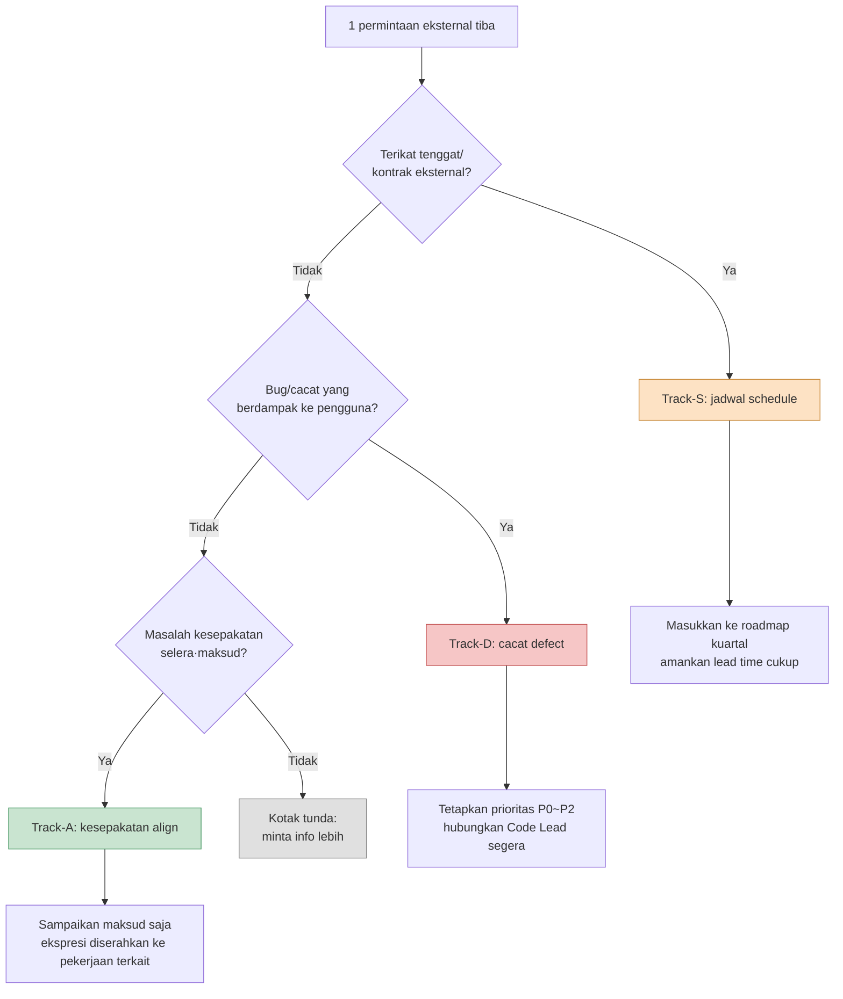

# 16.2 Kolaborasi Lintas Pekerjaan — Memilah Permintaan Eksternal ke dalam 3 Jalur

Selasa pagi, messenger berbunyi tiga kali nyaris bersamaan.

Art Lead: "Warna efek pertempuran sekarang terlalu kusam — boleh saya buat lebih cerah?"

QA Lead: "Ada kasus hadiah kehadiran guild masuk dua kali. Video reproduksinya saya lampirkan."

Penanggung jawab publisher: "Tolong terapkan panduan budaya Islam pada build Asia Tenggara. Sebelum peninjauan kuartal berikutnya, ya."

Jumlah karakter ketiga pesan itu mirip. Namun yang satu adalah pekerjaan yang selesai dalam 30 menit, yang satu lagi adalah insiden yang menuntut saya langsung menahan Code Lead, dan yang terakhir adalah jadwal eksternal yang harus diselipkan ke dalam rencana kuartalan. Kalau ketiganya diperlakukan dengan bobot yang sama hanya karena jatuh di kotak masuk yang sama, saya bisa menghabiskan setengah hari untuk pekerjaan 30 menit, sementara insiden yang sesungguhnya dibiarkan terbengkalai sampai malam.

Permintaan yang masuk ke Game Designer punya nuansa sebanyak ragam pekerjaan yang ada. Masalahnya, semua permintaan itu tiba dalam bentuk yang sama: "pesan satu baris". Bab ini membahas pekerjaan memilah baris-baris itu ke dalam tiga jalur begitu mereka masuk. Pada saat jalur terpilah, di situlah ditentukan apa yang harus dihentikan sekarang dan apa yang ditunda ke nanti.

---

## 16.2.1 Kolaborasi Menentukan Pekerjaan Inti

Game Designer tidak membuat kode, art, maupun suara secara langsung. Ia hanya menulis spesifikasi, menyampaikan maksud, dan memvalidasi hasil. Semua keluaran lahir lewat tangan pekerjaan lain. Karena itu, kualitas kolaborasi menentukan langsung kualitas hasil kerja desain.

Pada Proyek A tempat saya bekerja sebagai direktur (MMORPG yang mengutamakan mobile, tim skala menengah (10\~50 orang)), jika dibentangkan, pekerjaan yang sehari-hari berkolaborasi dengan Game Designer adalah seperti ini.

<svg viewBox="0 0 720 300" xmlns="http://www.w3.org/2000/svg" font-family="sans-serif" font-size="13">
  <rect x="300" y="120" width="120" height="60" rx="8" fill="#2b3a55" stroke="#1a2433"/>
  <text x="360" y="146" fill="#fff" text-anchor="middle" font-weight="bold">Game Designer</text>
  <text x="360" y="166" fill="#cdd6e5" text-anchor="middle" font-size="11">40~60% dari waktu</text>

  <g fill="#e8edf5" stroke="#9fb0c9">
    <rect x="40" y="30" width="130" height="44" rx="6"/>
    <rect x="40" y="100" width="130" height="44" rx="6"/>
    <rect x="40" y="170" width="130" height="44" rx="6"/>
    <rect x="40" y="240" width="130" height="44" rx="6"/>
    <rect x="550" y="30" width="130" height="44" rx="6"/>
    <rect x="550" y="100" width="130" height="44" rx="6"/>
    <rect x="550" y="170" width="130" height="44" rx="6"/>
  </g>
  <g fill="#1a2433" text-anchor="middle">
    <text x="105" y="50">Pengembangan (kode·tool)</text><text x="105" y="66" font-size="10" fill="#5a6a82">setiap hari</text>
    <text x="105" y="120">Art</text><text x="105" y="136" font-size="10" fill="#5a6a82">2~3x/minggu</text>
    <text x="105" y="190">Suara</text><text x="105" y="206" font-size="10" fill="#5a6a82">1~2x/minggu</text>
    <text x="105" y="260">Animasi</text><text x="105" y="276" font-size="10" fill="#5a6a82">1~2x/minggu</text>
    <text x="615" y="50">QA</text><text x="615" y="66" font-size="10" fill="#5a6a82">1x/minggu+MS</text>
    <text x="615" y="120">Operasional·CS</text><text x="615" y="136" font-size="10" fill="#5a6a82">1x/minggu</text>
    <text x="615" y="190">Eksternal (publisher·platform)</text><text x="615" y="206" font-size="10" fill="#5a6a82">1~2x/kuartal</text>
  </g>

  <g stroke="#9fb0c9" stroke-width="1.2" fill="none">
    <path d="M170 52 C 240 90, 270 120, 300 135"/>
    <path d="M170 122 C 230 130, 260 140, 300 148"/>
    <path d="M170 192 C 230 175, 260 162, 300 158"/>
    <path d="M170 262 C 240 210, 270 180, 300 170"/>
    <path d="M550 52 C 480 90, 450 120, 420 135"/>
    <path d="M550 122 C 490 130, 460 142, 420 150"/>
    <path d="M550 192 C 490 175, 460 162, 420 160"/>
  </g>
</svg>

Tujuh pekerjaan saling terkait, mulai dari frekuensi harian hingga kuartalan. 40\~60% dari waktu yang dihabiskan Game Designer di mejanya tersedot ke kolaborasi ini. Artinya, waktu untuk pekerjaan inti (perancangan) hanya tersisa separuh. Kalau begitu, mengurangi waktu kolaborasi sama dengan menambah waktu pekerjaan inti. Dan penyebab terbesar yang menggerogoti waktu kolaborasi adalah kegagalan memilah permintaan yang masuk, sehingga energi tercurah ke tempat yang salah.

---

## 16.2.2 Tiga Nuansa yang Disembunyikan Permintaan Satu Baris

Mari kembali ke tiga pesan tadi. Di permukaan, semuanya adalah "tolong lakukan \~". Namun di dalamnya tersembunyi tiga karakter yang berbeda.

- Permintaan warna dari Art Lead adalah **ranah selera dan maksud**. Ini bukan soal benar atau salah, melainkan soal kesepakatan. Hampir tidak butuh kode maupun koordinasi jadwal.
- Bug hadiah ganda dari QA adalah **cacat yang harus ditangani segera**. Karena berkaitan langsung dengan aset pengguna, prioritasnya tinggi, dan Code Lead harus segera dilibatkan.
- Penerapan panduan dari publisher adalah **perubahan yang terikat jadwal eksternal**. Cakupannya luas, ada tenggat eksternal berupa peninjauan kuartal, dan melibatkan beberapa pekerjaan sekaligus.

Ketiga nuansa ini saya sebut masing-masing dengan satu kata. **Kesepakatan (align)**, **Cacat (defect)**, **Jadwal (schedule)**. Pekerjaan mendorong permintaan yang masuk ke salah satu dari tiga ini lebih dulu — di Proyek A ini saya bakukan menjadi alur kerja bernama `request-triangulate`. Nama triangulasi (triangulate) diberikan karena maknanya: mengurung satu titik (permintaan) dengan tiga titik acuan (karakter pekerjaan·tingkat urgensi·ketergantungan eksternal) untuk menentukan posisinya.

Alur klasifikasinya adalah sebagai berikut.



**Urutan** pertanyaannya yang menjadi inti. Alasan ketergantungan jadwal ditanyakan paling dulu adalah karena, untuk pekerjaan yang terikat tenggat eksternal, lead time lebih diutamakan daripada penilaian internal. Kalau pekerjaan yang tinggal 3 minggu menuju peninjauan kuartal dipilah sebagai "nanti saja disepakati", maka begitu kesepakatan selesai, tenggatnya sudah di depan mata. Alasan cacat diletakkan kedua adalah karena pekerjaan yang sudah berdampak ke pengguna selalu didahulukan dari diskusi selera. Kesepakatan ada di urutan terakhir. Hanya pekerjaan yang tidak mendesak, tidak terikat eksternal, dan tidak merugikan pengguna, barulah berlaku "ayo disepakati pelan-pelan".

Kalau ketiga pertanyaan dijawab "Tidak", itu bukan kegagalan klasifikasi melainkan **kekurangan informasi**. Dalam keadaan begitu, jangan memaksakan jalur — masukkan ke kotak tunda dan balik bertanya. Satu kalimat seperti "Apakah ini harus masuk ke build berikutnya, atau cukup ditinjau dulu saja?" biasanya sudah menentukan jalurnya.

---

## 16.2.3 Worked Transcript: Memilah Kotak Masuk ke dalam Jalur

Kalau klasifikasi ini hanya dilakukan di kepala, di hari yang sibuk ia akan ambruk. Karena itu saya lemparkan seluruh tumpukan permintaan yang masuk ke AI untuk mendapat klasifikasi awal, lalu hasilnya saya validasi dan koreksi. Berikut adalah satu sesi yang benar-benar saya jalankan, disalin nyaris apa adanya. Tidak saya ringkas — bagian yang salah dari AI dan bagian yang saya tolak pun saya tinggalkan.

### Naskah Lengkap Prompt

```text
Pilah permintaan eksternal di bawah ini ke dalam tiga jalur — Track-S (jadwal: terikat tenggat·kontrak·peninjauan eksternal),
Track-D (cacat: bug berdampak ke pengguna, penilaian P0~P2), Track-A (kesepakatan: selera·maksud, ditutup lewat kesepakatan).
Tinjau dengan urutan ketergantungan eksternal → dampak ke pengguna → selera/maksud, lalu tetapkan ke jalur pertama yang tersangkut,
kalau ketiganya tidak ada, taruh sebagai tunda dan beri 1 pertanyaan untuk balik bertanya.
Keluaran per permintaan dalam bentuk | jalur | dasar (1 baris) | tindakan berikutnya (1 baris) |.

[Daftar permintaan]
1. Art Lead: Warna efek pertempuran kusam. Boleh dibuat lebih cerah?
2. QA Lead: Bug hadiah kehadiran guild diberikan ganda. Ada video reproduksinya.
3. Publisher: Terapkan panduan budaya pada build Asia Tenggara. Sebelum peninjauan kuartal berikutnya.
4. Sound Director: Intro BGM bos terlambat 0.5 detik dari timing mulai pertempuran.
5. Tim operasional: Banyak pengguna mengeluh "font chat guild terlalu kecil".
```

### Keluaran Mentah Claude

```text
| # | jalur | dasar | tindakan berikutnya |
|---|------|------|-----------|
| 1 | Track-A | Tone warna ranah selera·maksud, tak terkait eksternal/bug | Sampaikan maksud (ketegangan pertempuran) saja, keputusan saturasi diserahkan ke art |
| 2 | Track-D | Hadiah ganda = dampak langsung ke aset pengguna, dapat direproduksi | Penilaian P0, hubungkan Code Lead segera, tinjau hotfix |
| 3 | Track-S | Terikat tenggat eksternal berupa peninjauan kuartal | Masukkan ke roadmap kuartal, uraikan item panduan lalu hitung lead time |
| 4 | Track-A | Timing BGM tampak masalah selera penyutradaraan | Sepakati dengan Sound Director |
| 5 | Track-D | Keterbacaan font adalah cacat UI | Daftarkan sebagai bug P2 |
```

### Verifikasi / Penolakan oleh Manusia

Pada nomor 4 dan 5, saya berhenti.

**Nomor 4 ditolak.** AI memandang keterlambatan intro BGM sebagai "selera penyutradaraan (Track-A)". Namun "terlambat 0.5 detik dari timing mulai pertempuran" bukanlah selera, melainkan **cacat sinkronisasi**. Besar kemungkinan bukan masalah mengubah sumber audionya, melainkan ketidakcocokan antara titik trigger pada BT (Behavior Tree) dan cue audio. Ini tidak selesai dengan kesepakatan, melainkan harus menyentuh data timing di sisi animasi·kode. → **Dikoreksi menjadi Track-D.** Namun, karena tidak berdampak ke aset pengguna, prioritasnya P2.

**Nomor 5 diturunkan menjadi tunda.** AI langsung memutuskan "font kecil" sebagai cacat UI (Track-D). Padahal, dari pesannya saja tidak bisa dipastikan apakah ini cacat atau selera. Kalau font dirender sesuai spesifikasi desain tetapi "terasa kecil", itu lebih dekat ke kesepakatan (Track-A); kalau font tampil lebih kecil dari spesifikasi, itu cacat (Track-D). → **Tunda. Balik bertanya ke tim operasional:** "Apakah font tampak lebih kecil dibanding ukuran pada spesifikasi, atau ini usulan untuk memperbesar spesifikasinya sendiri?"

### Permintaan Ulang

Instruksi tambahan pada prompt yang dilempar ulang dengan memuat dua poin yang ditolak itu singkat saja.

```text
Untuk nomor 4, klasifikasikan ulang 'terlambat 0.5 detik dari mulai pertempuran' sebagai cacat sinkronisasi (Track-D, P2).
Tambahkan 1 pertanyaan untuk memastikan timing meleset di trigger BT atau di cue audio.
Untuk nomor 5, taruh sebagai tunda, dan nyatakan eksplisit pertanyaan apakah ini 'render aktual dibanding spesifikasi'.
```

Keluaran ulang membetulkan nomor 4 menjadi `Track-D / P2 / "Periksa apakah offset cue audio pada node mulai-pertempuran BT bernilai 0, atau apakah klip BGM-nya sendiri memuat 0.5 detik hening"`, dan nomor 5 menjadi `tunda / "Konfirmasi ulang ke tim operasional: apakah dirender lebih kecil dibanding spesifikasi vs permintaan menaikkan spesifikasi"`. Pada titik ini klasifikasi selesai tuntas.

Di sini terlihat jelas pembagian apa yang dikerjakan AI dan apa yang dikerjakan manusia. AI dengan cepat membagi kelima permintaan secara awal dan membuatkan **tabel tanpa kolom kosong**. Manusia menangkap **dua poin yang batas jalurnya samar** (BGM yang tampak seperti selera tetapi sebenarnya cacat sinkronisasi, dan font yang tampak seperti cacat tetapi bisa jadi selera). Mengisi kelima kolom tanpa terlewat dan menyadari bahwa dua di antaranya terisi keliru adalah dua kemampuan yang berbeda, dan worked transcript ini menyerahkan keduanya ke pihak yang masing-masing mahir.

---

## 16.2.4 Tiap Jalur Menuntut Penanganan yang Berbeda

Begitu klasifikasi selesai, setiap jalur masuk ke pekerjaan lanjutan yang sama sekali berbeda. Berangkat dari tabel yang sama, tetapi tujuannya berlainan.

Permintaan yang dipilah ke **Track-A (kesepakatan)** ditangani dengan prinsip "sampaikan maksud saja, ekspresi diserahkan". Jawaban yang saya kembalikan atas permintaan warna dari art bukanlah angka saturasi, melainkan maksud. "Pertempuran ini adalah fase 1 bos, jadi ketegangan adalah intinya. Saya berharap tekanan lebih diutamakan daripada kecerahan. Di dalam batasan itu, saturasi saya serahkan ke penilaian art." Pada saat Game Designer langsung menentukan nilai saturasi, otonomi art tergerus dan tanggung jawab atas hasilnya pun menjadi kabur. Menjaga batas antara maksud dan ekspresi itulah keseluruhan dari jalur kesepakatan.

Permintaan yang dipilah ke **Track-D (cacat)** berlanjut ke penetapan prioritas dan penyambungan kode. Hadiah ganda guild (P0) saya serahkan langsung ke Code Lead di tempat, sedangkan sinkronisasi BGM (P2) saya daftarkan ke backlog disertai pertanyaan dugaan penyebab. Di jalur cacat, tugas Game Designer bukanlah "memperbaiki", melainkan **menetapkan prioritas dan memberi input yang akurat**. Tolok ukur yang memilah P0 atau P2 adalah "apakah saat ini berdampak ke aset·progres pengguna". Hadiah ganda berkaitan langsung dengan aset sehingga P0, sedangkan keterlambatan 0.5 detik BGM memang mengganggu tetapi tidak menghalangi progres sehingga P2.

Permintaan yang dipilah ke **Track-S (jadwal)** masuk ke roadmap kuartal. Panduan budaya dari publisher adalah permintaan satu baris, tetapi sebenarnya terurai menjadi beberapa item — penggambaran simbol keagamaan, warna yang tabu, arah teks, busana karakter. Intinya adalah, begitu menerimanya, jawab "akan saya tinjau" dan tumpangkan seluruhnya ke rencana kuartal. Pekerjaan yang terikat tenggat eksternal, sekecil apa pun tampaknya, lead time-nya adalah nyawa — kalau dimulai terlambat, insiden pasti terjadi.

Bila ketiga cabang ini dibandingkan sekilas, hasilnya seperti ini.

<svg viewBox="0 0 720 240" xmlns="http://www.w3.org/2000/svg" font-family="sans-serif" font-size="13">
  <g>
    <rect x="20" y="30" width="210" height="180" rx="10" fill="#c9e4d0" stroke="#4f9d6a"/>
    <rect x="255" y="30" width="210" height="180" rx="10" fill="#f6c6c6" stroke="#c25151"/>
    <rect x="490" y="30" width="210" height="180" rx="10" fill="#fde2c4" stroke="#c98a3a"/>
  </g>
  <g text-anchor="middle" font-weight="bold" fill="#1a2433">
    <text x="125" y="58">Track-A · Kesepakatan</text>
    <text x="360" y="58">Track-D · Cacat</text>
    <text x="595" y="58">Track-S · Jadwal</text>
  </g>
  <g text-anchor="start" fill="#23303f" font-size="12">
    <text x="38" y="92">Pertanyaan penentu</text>
    <text x="38" y="112" fill="#3c5a45">Selera·maksud?</text>
    <text x="38" y="142">Tugas Game Designer</text>
    <text x="38" y="162" fill="#3c5a45">Sampaikan maksud saja,</text>
    <text x="38" y="180" fill="#3c5a45">ekspresi diserahkan</text>

    <text x="273" y="92">Pertanyaan penentu</text>
    <text x="273" y="112" fill="#7a2e2e">Bug berdampak ke pengguna?</text>
    <text x="273" y="142">Tugas Game Designer</text>
    <text x="273" y="162" fill="#7a2e2e">Penilaian P0~P2,</text>
    <text x="273" y="180" fill="#7a2e2e">hubungkan Code Lead</text>

    <text x="508" y="92">Pertanyaan penentu</text>
    <text x="508" y="112" fill="#7a5320">Terikat tenggat eksternal?</text>
    <text x="508" y="142">Tugas Game Designer</text>
    <text x="508" y="162" fill="#7a5320">Uraikan item,</text>
    <text x="508" y="180" fill="#7a5320">amankan lead time</text>
  </g>
</svg>

Kalau klasifikasinya akurat, lima baris dari kotak masuk yang sama akan terurai rapi ke tiga lini penanganan yang berbeda. Kalau klasifikasinya salah, cacat akan terseret ke rapat kesepakatan dan menggerogoti waktu, atau perkara jadwal dimulai terlambat dan meledak tepat menjelang tenggat.

---

## 16.2.5 Berkolaborasi dengan Mengisolasi ke dalam TF

Ada saatnya permintaan datang bukan satu-dua, melainkan menyerbu sebagai satu gumpalan. Misalnya beberapa minggu menjelang peninjauan publisher, atau saat perombakan total sistem pertempuran. Dalam keadaan begini, pekerjaannya sendiri diisolasi ke ruang kerja sementara seperti `95_BattleTF`, dan begitu selesai, hanya keputusannya yang dipromosikan menjadi naskah resmi. Mekanisme isolasi·penyerapan itu beserta praktik operasional "hanya html yang diserahkan ke tim art (md dipelajari 0)" telah dibahas seluruhnya di bab sebelumnya, 16.1.

Dari sudut pandang klasifikasi (3-track), kalau ditambahkan satu baris saja, kira-kira begini. Kolaborasi yang membesar menjadi satu gumpalan umumnya adalah keadaan di mana perkara Track-S (jadwal) terurai melintasi beberapa pekerjaan, sehingga ketika penanganan per jalur secara individual tak lagi mampu menampungnya, ia dipindahkan ke wadah satu tingkat di atasnya, yaitu ruang kerja isolasi. Artinya, kalau klasifikasi 3-track adalah pintu masuk, isolasi TF adalah ruang yang menampung gumpalan besar yang sudah melewati pintu itu.

---

## 16.2.6 Kegagalan Umum dan Resepnya

| Pola Kegagalan | Resep |
|---|---|
| Menangani semua permintaan dengan bobot sama | Begitu masuk, pilah ke 3-track, tanyakan ketergantungan eksternal lebih dulu |
| Salah memilah perkara jadwal sebagai kesepakatan | Pakukan pertanyaan tenggat eksternal di urutan penentu nomor 1 |
| Menangani cacat sinkronisasi yang tampak seperti selera sebagai kesepakatan | "Ketidakcocokan timing/nilai" dicurigai sebagai cacat lebih dulu |
| Memutuskan selera yang tampak seperti cacat sebagai cacat | Balik tanya "apakah render aktual dibanding spesifikasi" lalu tunda |
| Game Designer ikut menentukan ekspresi di jalur kesepakatan | Hanya sampai maksud, ekspresi diserahkan ke pekerjaan terkait |
| Memulai perkara jadwal terlambat | Segera masukkan ke roadmap kuartal, amankan lead time |

Separuh dari tabel ini adalah kesalahan di tahap klasifikasi, dan separuhnya adalah kesalahan penanganan setelah klasifikasi. Sekalipun klasifikasinya akurat, kalau penanganan per jalurnya keliru, efeknya lenyap. (Untuk jebakan terkait isolasi·promosi·media TF, lihat tabel jebakan di 16.1.)

---

### Poin-Poin Penting

- Permintaan eksternal terpilah ke tiga jalur kesepakatan·cacat·jadwal, dan kalau diperlakukan dengan bobot sama, setengah hari terbuang untuk pekerjaan 30 menit.
- Urutan penentunya adalah tenggat eksternal → dampak ke pengguna → selera, dan kalau urutannya salah, perkara jadwal meledak tepat menjelang tenggat.
- AI kuat dalam pembagian awal tanpa kolom kosong, sedangkan penentuan batas jalur lebih akurat dilakukan manusia.

---

> **Penerapan di Luar Game.** Masalah bahwa permintaan satu baris diperlakukan dengan bobot sama hanya karena jatuh di kotak masuk yang sama bukanlah khas game — ia adalah keseharian setiap perancang layanan·PM. Klasifikasi yang memilah permintaan masuk ke tiga jalur "kesepakatan (selera·arah)·cacat (bug berdampak ke pengguna)·jadwal (tenggat eksternal)" tetap bekerja sekalipun domainnya berganti. Misalnya, bila di messenger seorang PM layanan web jatuh bersamaan "warna tombol agak lebih terang (kesepakatan)", "tanda terima pembayaran terkirim ganda (cacat)", dan "tenggat penerapan revisi UU Perlindungan Data Pribadi tinggal 3 minggu (jadwal)", maka Anda cukup memasukkannya ke jalur pertama yang tersangkut dengan urutan tenggat eksternal → dampak ke pengguna → selera: langsung tempatkan tenaga pada bug pembayaran, dan untuk revisi undang-undang, amankan lead time lebih dulu.

---

### Coba Sendiri

**Jalur minimal chatbot web (tanpa terminal)** — Inti bab ini bukanlah skrip alur kerja, melainkan gagasan "memilah permintaan satu baris ke tiga jalur kesepakatan·cacat·jadwal". Gagasan itu dapat direproduksi apa adanya hanya dengan chatbot web (ChatGPT atau Claude web), tanpa infrastruktur CLI·hook·atom. Dua langkah berikut adalah jalur utamanya.
1. Kumpulkan permintaan yang masuk hari itu, satu baris per permintaan tanpa format khusus. Boleh dikais dari mana saja — messenger, surel, atau memo.
2. Tempel prompt di bawah ini ke kolom input chatbot web, lalu tempel daftar permintaan yang sudah dikumpulkan di bawahnya. Ini sama dengan melakukan klasifikasi awal yang biasanya dikerjakan `request-triangulate`, sekali dengan tangan.
   ```
   Pilah permintaan di bawah ini ke Track-A (kesepakatan)/Track-D (cacat)/Track-S (jadwal).
   Tinjau dengan urutan tenggat eksternal → bug berdampak ke pengguna → selera·maksud, lalu tetapkan ke jalur pertama yang tersangkut,
   kalau ketiganya tidak ada, taruh sebagai tunda dan beri 1 pertanyaan untuk balik bertanya. Keluaran dalam bentuk | jalur | dasar 1 baris | tindakan berikutnya 1 baris |.
   [Tempel daftar permintaan]
   ```
   Setelah itu, dari tabel keluaran, manusia cukup memverifikasi dua kolom saja — kalau "ketidakcocokan timing·nilai" terpilah sebagai kesepakatan, curigai cacat sinkronisasi; dan kalau keluhan rasa seperti "\~ kecil/lambat" diputuskan sebagai cacat, balik tanya "apakah render aktual dibanding spesifikasi" lalu turunkan ke tunda. Skrip·alur kerja baru perlu diadopsi ketika klasifikasi ini sudah terbiasa di tangan dan tumpukan harian mulai terasa berat.

**setup.** Kumpulkan permintaan eksternal yang masuk ke satu tempat (kanal·dokumen). Tuliskan definisi ketiga jalur, satu baris masing-masing — kesepakatan (selera·maksud), cacat (bug berdampak ke pengguna), jadwal (tenggat eksternal).

**prompt.** Lemparkan tumpukan permintaan yang terkumpul ke AI sambil memakukan urutan penentu.

```text
Pilah permintaan di bawah ini ke Track-A (kesepakatan)/Track-D (cacat)/Track-S (jadwal).
Tinjau dengan urutan tenggat eksternal → bug berdampak ke pengguna → selera·maksud, lalu tetapkan ke jalur pertama yang tersangkut,
kalau ketiganya tidak ada, taruh sebagai tunda dan beri 1 pertanyaan untuk balik bertanya. Keluaran dalam bentuk | jalur | dasar 1 baris | tindakan berikutnya 1 baris |.
[Tempel daftar permintaan]
```

**verify.** Verifikasi sendiri dua tempat di tabel keluaran. (1) Kalau "ketidakcocokan timing·nilai" terpilah sebagai kesepakatan, curigai apakah ini cacat sinkronisasi. (2) Kalau keluhan rasa seperti "\~ kecil/lambat" diputuskan sebagai cacat, balik tanya "apakah render aktual dibanding spesifikasi" lalu turunkan ke tunda. Asalkan manusia menangkap dua perkara batas itu, sisanya boleh dipercaya.

### Versi Ringkas Solo

Kalau Anda developer solo tanpa tim maupun TF, biarkan jalurnya tetap dan ganti sasarannya saja. Kumpulkan ulasan toko, laporan Discord, dan memo beta tester ke satu dokumen, lalu klasifikasikan tumpukannya seminggu sekali dengan prompt di atas. Kesepakatan (selera) "diterima asalkan tidak bertabrakan dengan visi saya", cacat (bug) ditangani pada minggu itu, dan jadwal (peninjauan toko·tenggat event) dimasukkan ke kalender beserta lead time-nya. Untuk operasional folder isolasi pada periode pembenahan terfokus, ikuti Versi Ringkas Solo di 16.1.
