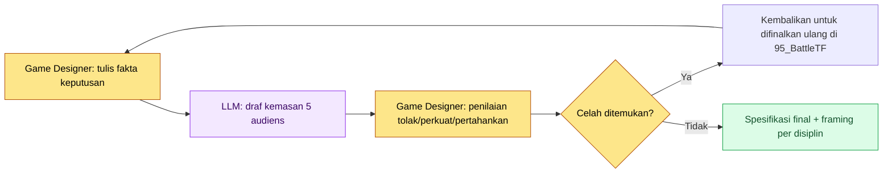

# 16.3 Satu Keputusan, Tiga Kemasan — Framing Artefak per Disiplin

Ruang rapat 95_BattleTF. Sore hari di hari kami memfinalkan hadiah kehadiran guild menjadi sumber daya +5, saya mengalirkan satu keputusan yang sama ke tiga tempat. Ke kanal tim desain saya kirim spesifikasi markdown, ke tim program satu baris kolom data, dan ke tim seni satu lembar html berisi satu layar. Jawaban datang hampir bersamaan dari ketiganya. Lead program bertanya "kapan trigger-nya terjadi", art director bertanya "apakah posisi tombol kehadiran sesuai dengan panduan 06_UI", dan animator tidak berkata apa-apa. Keputusannya sama, tetapi yang dilihat ketiga orang itu sama sekali berbeda.

Bab ini adalah catatan tentang mengubah "melihat secara berbeda" itu dari kecelakaan menjadi desain. Mengemas satu keputusan secara berbeda untuk tiap disiplin — itulah framing.

---

## 16.3.1 Lima Orang Membaca Keputusan yang Sama secara Berbeda

Pada satu keputusan hadiah kehadiran guild, ada lima audiens yang menempel. Mereka membaca kalimat yang sama, tetapi masing-masing hanya memilih wilayahnya sendiri dan melewatkan sisanya. Kecelakaan terjadi tepat di tempat yang dilewatkan.

| Audiens | Yang dibaca dengan fokus | Yang secara naluriah dilewati |
|---|---|---|
| Lead kode | Kolom data, antarmuka, waktu trigger | Warna, naratif, presentasi |
| Art director | Tata letak layar, komponen, panduan gaya | Integritas data, trigger |
| Sound director | Trigger aksi, suasana, durasi | Detail data |
| Animator | Gerak, timing, transisi status | Nuansa visual, angka |
| QA | Kriteria penerimaan, risiko, skenario tepi | Internal cara implementasi |

Masalahnya bukan jumlah informasi, melainkan cara pemaparannya. Jika Anda meletakkan satu salinan spesifikasi tebal yang sama persis di meja lima orang, kelimanya akan membuka halaman yang berbeda dan menutup halaman yang berbeda. Framing tidak menyerahkan pembukaan halaman ini pada kebetulan, melainkan menatanya secara sengaja.

Berikut adalah matriks framing yang memperlihatkan bagaimana satu keputusan yang sama berganti bentuk ketika melewati batas-batas disiplin.

<svg viewBox="0 0 720 360" xmlns="http://www.w3.org/2000/svg" role="img" aria-label="Matriks framing tempat satu keputusan terpecah menjadi artefak per disiplin">
  <rect x="0" y="0" width="720" height="360" fill="#fbfbfd"/>
  <!-- source decision -->
  <rect x="270" y="20" width="180" height="52" rx="8" fill="#1f2d3d"/>
  <text x="360" y="42" text-anchor="middle" fill="#ffffff" font-family="sans-serif" font-size="14" font-weight="bold">Keputusan: Hadiah Kehadiran = Sumber Daya +5</text>
  <text x="360" y="60" text-anchor="middle" fill="#aeb9c6" font-family="sans-serif" font-size="11">95_BattleTF / Fakta Tunggal</text>
  <!-- arrows -->
  <line x1="360" y1="72" x2="120" y2="140" stroke="#9aa7b4" stroke-width="1.5"/>
  <line x1="360" y1="72" x2="360" y2="140" stroke="#9aa7b4" stroke-width="1.5"/>
  <line x1="360" y1="72" x2="600" y2="140" stroke="#9aa7b4" stroke-width="1.5"/>
  <!-- three framings -->
  <rect x="30" y="140" width="180" height="86" rx="8" fill="#e8f0fe" stroke="#4a73b8" stroke-width="1.5"/>
  <text x="120" y="162" text-anchor="middle" fill="#1f2d3d" font-family="sans-serif" font-size="13" font-weight="bold">Desain → markdown</text>
  <text x="120" y="182" text-anchor="middle" fill="#33414f" font-family="sans-serif" font-size="11">Maksud, aturan, dasar lengkap</text>
  <text x="120" y="200" text-anchor="middle" fill="#33414f" font-family="sans-serif" font-size="11">Konteks pembelajaran disertakan</text>
  <text x="120" y="218" text-anchor="middle" fill="#7a8794" font-family="sans-serif" font-size="10">spec_guild_attendance.md</text>

  <rect x="270" y="140" width="180" height="86" rx="8" fill="#fdeee8" stroke="#b8674a" stroke-width="1.5"/>
  <text x="360" y="162" text-anchor="middle" fill="#1f2d3d" font-family="sans-serif" font-size="13" font-weight="bold">Seni → html</text>
  <text x="360" y="182" text-anchor="middle" fill="#33414f" font-family="sans-serif" font-size="11">1 layar, tata letak, komponen</text>
  <text x="360" y="200" text-anchor="middle" fill="#33414f" font-family="sans-serif" font-size="11">Pembelajaran md 0 (hanya kirim)</text>
  <text x="360" y="218" text-anchor="middle" fill="#7a8794" font-family="sans-serif" font-size="10">guild_screen_v3.html</text>

  <rect x="510" y="140" width="180" height="86" rx="8" fill="#e8f6ec" stroke="#4a9a5e" stroke-width="1.5"/>
  <text x="600" y="162" text-anchor="middle" fill="#1f2d3d" font-family="sans-serif" font-size="13" font-weight="bold">Program → data</text>
  <text x="600" y="182" text-anchor="middle" fill="#33414f" font-family="sans-serif" font-size="11">Kolom, antarmuka, trigger</text>
  <text x="600" y="200" text-anchor="middle" fill="#33414f" font-family="sans-serif" font-size="11">Item lint verifikasi dirinci</text>
  <text x="600" y="218" text-anchor="middle" fill="#7a8794" font-family="sans-serif" font-size="10">guild_table 1 row</text>
  <!-- invariant band -->
  <rect x="30" y="262" width="660" height="72" rx="8" fill="#ffffff" stroke="#c7ced6" stroke-width="1.2"/>
  <text x="360" y="286" text-anchor="middle" fill="#1f2d3d" font-family="sans-serif" font-size="12" font-weight="bold">Fakta Invarian (yang harus dipertahankan ketiga kemasan)</text>
  <text x="360" y="308" text-anchor="middle" fill="#33414f" font-family="sans-serif" font-size="11">Angka = +5 · Waktu = login pertama harian · Cakupan = seluruh anggota guild</text>
  <text x="360" y="326" text-anchor="middle" fill="#7a8794" font-family="sans-serif" font-size="10">Kemasan boleh beda, tetapi jika ketiga nilai ini meleset, framing gagal</text>
</svg>

Kemasan berbeda untuk tiap audiens, tetapi fakta invarian yang terhampar di tengah (angka, waktu, cakupan) tidak boleh goyah di kemasan mana pun. Keterampilan framing bukanlah "menampilkan secara berbeda", melainkan "menampilkan secara berbeda sambil mempertahankan hal yang sama".

---

## 16.3.2 Worked Transcript — Satu Keputusan Menjadi Tiga Kemasan

Jika framing harus dibentuk ulang dengan tangan setiap kali, bebannya besar sehingga akhirnya tidak dikerjakan. Karena itu saya melempar satu keputusan dan menerima draf kemasan per disiplin sekaligus. Berikut adalah rekaman nyata percakapan yang benar-benar saya lakukan seputar keputusan hadiah kehadiran guild. Saya salin apa adanya tanpa dirapikan.

### Prompt Lengkap

```
[Fakta Keputusan — difinalkan di 95_BattleTF]
- Hadiah kehadiran guild = sumber daya guild +5
- Trigger: 1 kali saat anggota guild login pertama hari itu
- Cakupan: masing-masing seluruh anggota guild terkait
- UI: tampilkan total sumber daya di bagian atas layar guild + tombol "Hadir"

Kemas satu keputusan ini untuk tiga disiplin.
Desain dalam markdown berisi maksud, aturan, dampak data; seni berupa spesifikasi layar yang masuk ke html
berfokus pada tata letak, komponen, referensi panduan gaya (dilarang menyebut data atau trigger),
program berupa satu baris data, antarmuka, trigger, item verifikasi.
Ketiga kemasan harus mencantumkan nilai invarian yang sama (+5, 1 kali login pertama, seluruh anggota guild),
dan untuk nilai yang tidak diketahui, jangan dibuat-buat, tandai dengan [perlu konfirmasi].
```

### Keluaran Mentah Claude (tanpa ringkasan atau penataan)

```
1) Desain → markdown

## Hadiah Kehadiran Guild
- Maksud: mengonversi 1 kali akses harian menjadi sumber daya kolaborasi tingkat guild untuk meningkatkan retensi.
- Aturan: saat anggota guild login pertama pada hari itu, sumber daya guild +5. Sehari 1 kali. Akumulasi tingkat guild.
- Dampak data: guild_resource_total bertambah. Perlu pemantauan inflasi sumber daya [perlu konfirmasi: batas atas belum ditetapkan].

2) Seni → spesifikasi layar (konten yang masuk ke html)
- Tampilkan total sumber daya di area atas layar guild (progress_bar + badge angka).
- Tombol "Hadir" di sebelah kanan. Perubahan status saat ditekan mengikuti aturan status tombol di panduan 06_UI.
- Gaya: sesuai panduan 06_UI. Warna [perlu konfirmasi: token warna tema guild belum ditentukan].
- (angka data, trigger sengaja dikecualikan dari kemasan ini)

3) Program → data/antarmuka
- Data: tambahkan kolom ke guild_table — guild_resource_total (int, default 0)
- Antarmuka: GuildResourceManager.add(guild_id, amount)
- Trigger: panggil add(guild_id, 5) 1 kali pada hook event login pertama harian
- Verifikasi: integrity_check_guild_resource (tidak boleh negatif / blokir pemanggilan melebihi 1x sehari)
- Konkurensi: penambahan ganda saat anggota guild yang sama login bersamaan di banyak perangkat [perlu konfirmasi]
```

### Verifikasi & Penolakan oleh Manusia

Saya tidak memakai keluaran mentah apa adanya. Saya menangkap tiga titik.

- **Penolakan**: kalimat "perubahan status saat tombol ditekan mengikuti panduan 06_UI" di kemasan seni. Prinsip 95_BattleTF adalah tidak melatihkan md ke tim seni dan hanya mengirim html, sehingga frasa referensi panduan memicu lompatan ke dokumen eksternal. Saya putuskan menyisipkan contoh status secara inline agar semua tertutup dalam satu layar.
- **Permintaan penguatan**: dua butir `[perlu konfirmasi]` di kemasan program (batas atas sumber daya, penambahan ganda multi-perangkat) adalah celah yang tidak ada dalam fakta keputusan. Bahwa AI menandainya alih-alih mengarangnya memang penilaian yang tepat, tetapi ini adalah lubang pada keputusan itu sendiri, bukan pada framing, sehingga harus dikembalikan ke 95_BattleTF.
- **Dipertahankan**: ketiga nilai invarian (+5, 1 kali login pertama, seluruh anggota guild) sudah dimasukkan secara konsisten ke ketiga kemasan. Hanya bagian ini yang tidak saya sentuh.

### Permintaan Ulang

```
Perbaiki kemasan seni:
- Hapus semua frasa referensi dokumen eksternal seperti "mengikuti panduan 06_UI".
- Deskripsikan langsung perbedaan visual 3 status tombol (ditekan/menunggu/selesai) di dalam spesifikasi layar.
- Dengan asumsi tim seni hanya melihat satu lembar ini, buat swasembada agar tidak melompat ke dokumen lain.

Keluarkan 2 butir [perlu konfirmasi] di kemasan program dari artefak,
dan sebagai gantinya pisahkan menjadi blok "Item yang Perlu Difinalkan Ulang di 95_BattleTF" di paling atas.
```

Dengan satu kali penolakan dan permintaan ulang ini, artefak menjadi bentuk yang bisa langsung dipungut dan dipakai ketiga disiplin di posisinya masing-masing. AI memang membentuk tiga draf kemasan dan bahkan menandai celah-celahnya, tetapi mana yang harus dikurangi dari kemasan mana — menghapus referensi eksternal dari kemasan seni dan mengangkat item yang belum final dari kemasan program — pengguntingan itu pada akhirnya tetap berada di tangan saya. Penilaian inti framing terletak pada sisi pengecualian, bukan penyertaan.

---

## 16.3.3 Tiga Metode Framing dan Waktu Pengembaliannya

Metodenya bercabang tergantung di mana kemasan akan diletakkan. Mana di antara ketiganya yang dipakai ditentukan oleh ukuran spesifikasi dan stamina operasional.

**(1) Ringkasan per audiens dalam satu dokumen.** Tambahkan bagian ringkasan per disiplin di belakang badan dokumen. Lima orang berbagi satu berkas, tetapi masing-masing hanya membaca bagiannya sendiri.

```markdown
## Ringkasan per Audiens

### Kode (Implementasi)
- Data: guild_table.guild_resource_total (int)
- Antarmuka: GuildResourceManager.add(guild_id, amount)
- Trigger: 1 kali login pertama harian
- Verifikasi: integrity_check_guild_resource

### Seni (Visual)
- Layar: total sumber daya di atas guild + tombol hadir
- Komponen: progress_bar, badge, button (3 status)
- Prioritas: milestone ini

### QA (Verifikasi)
- Kriteria penerimaan: setelah hadir, sumber daya guild +5 terterap, blokir melebihi 1x sehari
- Risiko: inflasi sumber daya, penambahan ganda multi-perangkat
```

**(2) Artefak terpisah per audiens.** Pisahkan satu badan dokumen menjadi berkas per disiplin. Operasi 95_BattleTF yang mengirim hanya html ke tim seni dan tidak mengirim md adalah wujud nyata dari metode ini — bahkan untuk keputusan yang sama, medianya sendiri berbeda per disiplin.

```
spec_guild_attendance.md     — Badan desain (konteks lengkap)
guild_screen_v3.html         — Seni (hanya html, pembelajaran md 0)
guild_table 1 row + add()    — Program (data/antarmuka)
qa_guild_attendance.md       — QA (kriteria penerimaan, risiko)
```

Cocok untuk spesifikasi berukuran besar, dan medianya langsung masuk ke alat tiap disiplin. Sebagai gantinya, jika satu keputusan berubah, beberapa artefak harus diperbaiki bersamaan sehingga beban operasionalnya besar.

**(3) Graf Wikilink.** Sisipkan hanya titik awal per disiplin sebagai tautan di badan dokumen, lalu masing-masing menelusuri cabangnya sendiri.

```
[[spec_guild_attendance]]
   ├── [[code_guild_table]]
   ├── [[ui_guild_screen_v3]]
   └── [[qa_guild_attendance]]
```

Biaya dan pengembalian ketiga metode adalah sebagai berikut. Di antara angka di bawah, "efek" adalah perkiraan penulis (belum terverifikasi); percayai hanya arah dan rasio relatifnya.

| Metode | Biaya | Waktu Pengembalian |
|---|---|---|
| (1) Ringkasan per audiens | Sekitar +30% volume badan dokumen | Kembali segera di hampir semua spesifikasi |
| (2) Artefak terpisah | Mengelola N salinan artefak | Kembali hanya saat volume besar dan media beda per disiplin |
| (3) Graf Wikilink | Investasi awal infrastruktur graf | Kembali saat spesifikasi terakumulasi dan graf itu sendiri menjadi aset |

Untuk sebagian besar spesifikasi, (1) yang cocok. Biayanya paling kecil dan pengembaliannya paling cepat. (2) dipakai hanya di tempat yang medianya sudah terpisah seperti html seni, dan (3) dinyalakan ketika spesifikasi sudah cukup menumpuk sehingga graf tautan menghasilkan nilai penelusuran.

---

## 16.3.4 Memfiksasi Audiens menjadi Lima

Jika audiens didefinisikan ulang untuk tiap spesifikasi, framing harus dibentuk ulang setiap kali. Karena itu saya memfiksasi kodenya.

| Kode Audiens | Wilayah |
|---|---|
| code | Kode, sistem, data |
| art | Seni, visual, UI |
| sound | Sound, audio |
| anim | Animasi, motion |
| qa | QA, verifikasi |

Kelima ini adalah standar operasional internal. Audiens eksternal seperti vendor atau legal ditangani secara terpisah di luar standar ini. Dengan memfiksasi menjadi lima, saat menyerahkan framing ke LLM tidak perlu menulis ulang definisi audiens setiap kali, dan audiens yang terlewat bisa ditangkap dengan checklist.

---

## 16.3.5 Otomatisasi dan Jebakannya

Jika ringkasan lima disiplin ditulis dengan tangan untuk tiap spesifikasi, akhirnya tidak akan ditulis. Karena itu saya mengikat alurnya seperti ini.



Jika Game Designer hanya menulis fakta keputusan, LLM membuat lima draf kemasan, lalu Game Designer menilai tolak, perkuat, atau pertahankan. Jika muncul celah (`[perlu konfirmasi]`), celah itu tidak ditangani di framing melainkan dikembalikan ke tahap keputusan — karena framing bukan alat untuk menambal lubang keputusan, melainkan alat untuk memindahkan keputusan yang sudah ditetapkan.

Empat jebakan yang berulang kali diinjak dalam siklus ini saya letakkan beserta resepnya.

| Jebakan | Gejala | Resep |
|---|---|---|
| Duplikasi informasi | Konten yang sama berulang di badan dan ringkasan sehingga membebani operasi | Badan 1 kali, ringkasan hanya item yang berbeda |
| Hilangnya informasi | Nilai penting bagi satu disiplin hilang seutuhnya | Periksa kelalaian dengan checklist 5 audiens yang difiksasi |
| Mengabaikan badan dokumen | Hanya melihat ringkasan dan melewatkan konteks badan | Cantumkan "dasar ada di badan dokumen" di akhir ringkasan |
| Kekeliruan media | Mengirim md ke seni sehingga membebani pembelajaran | Fiksasi prinsip media per disiplin (seni = html) |

Otomatisasi menurunkan beban penulisan menjadi sekitar 5 menit per spesifikasi, tetapi penilaian tolak, perkuat, dan pertahankan tidak ikut terotomatisasi. Penilaian itulah tempat manusia.

---

## 16.3.6 Pengukuran — Saat Framing Dinyalakan

Berikut adalah nilai perbandingan sebelum dan sesudah penerapan framing di Proyek A yang penulis operasikan. Angka absolutnya adalah perkiraan penulis (belum terverifikasi); yang patut dipercaya adalah arah perubahan dan rasio relatifnya.

| Item | Tanpa framing | Dengan framing | Arah |
|---|---|---|---|
| Kecelakaan interpretasi per disiplin | 15\~20 kasus per kuartal | 3\~5 kasus per kuartal | Turun drastis |
| Waktu audiens membaca spesifikasi | 15\~30 menit | 5\~10 menit (hanya bagiannya) | Turun |
| Keputusan → mulai kerja | 1\~2 hari | 4\~8 jam | Memendek |
| Konflik interpretasi antardisiplin | 8\~12 kasus per kuartal | 2\~3 kasus per kuartal | Turun |
| Waktu penulisan spesifikasi | 1\~2 jam | 1.5\~2.5 jam (bantuan LLM) | Naik sedikit |

Penulisan spesifikasi itu sendiri sedikit memanjang. Karena kemasan per disiplin ditambahkan. Namun setelah itu siklus kerja per disiplin memendek sehingga total waktu dari keputusan hingga mulai kerja menjadi berkurang. Trade-off inilah dasar inti penerapan framing. Bagi tim yang merasa terbebani dengan tinjauan berbantuan LLM, urutan yang aman adalah memantapkan dulu ringkasan 5 audiens secara manual pada metode (1), baru kemudian menambahkan otomatisasi.

---

> **Penerapan di Luar Game.** Framing yang mengemas satu keputusan secara berbeda untuk tiap audiens namun mempertahankan fakta invarian (angka, waktu, cakupan) di mana pun, berlaku langsung — bukan untuk game — pada pengumuman dan komunikasi rilis di setiap organisasi. Misalnya, jika Anda memutuskan satu hal "menaikkan biaya langganan menjadi 9,900 won mulai 1 Juli", maka untuk tim pengembang kemasannya berupa data seperti kolom tabel pembayaran dan waktu penerapan, untuk tim desain berupa satu lembar layar banner pemberitahuan, dan untuk tim dukungan pelanggan berupa skrip tanggapan untuk pertanyaan yang diperkirakan. Ketiga kemasan berbeda, tetapi pada saat ketiga angka "9,900 won, 1 Juli, seluruh pelanggan baru dan lama" meleset di kemasan mana pun, saat itu juga sengketa pelanggan meledak.

---

## 16.3.7 Coba Sendiri

**setup**

- Masukkan 5 audiens disiplin (code, art, sound, anim, qa) ke wiki tim sebagai definisi tetap.
- Tetapkan prinsip media per disiplin (contoh: seni = html, program = data row, desain = md).
- Siapkan satu spesifikasi dalam bentuk fakta keputusan (nilai invarian = cantumkan angka, waktu, cakupan).

**prompt**

```
[Fakta Keputusan]
(angka, waktu, cakupan satu baris masing-masing)

Kemas keputusan ini untuk disiplin terkait di antara code, art, sound, anim, qa.
Setiap kemasan menghilangkan informasi yang tidak diminati disiplin tersebut, tetapi nilai invarian (angka, waktu, cakupan) dicantumkan sama persis di kemasan mana pun,
kemasan seni dibuat swasembada hanya dengan satu lembar itu tanpa referensi dokumen lain, dan untuk nilai yang tidak diketahui, jangan dibuat-buat, tandai dengan [perlu konfirmasi].
```

**verify**

- Bandingkan satu baris demi satu baris apakah nilai invarian (angka, waktu, cakupan) sama di ketiga kemasan.
- Jika ada `[perlu konfirmasi]`, kembalikan bukan ke framing melainkan ke tahap keputusan (TF semacam 95_BattleTF).
- Jika di kemasan seni masih ada frasa referensi dokumen eksternal, hapus.

**Versi Ringkas Solo**

Jika Anda bekerja sendiri, kurangi audiens menjadi dua — 'saya yang akan datang' (implementasi) dan 'pemeriksa' (QA). Tulis satu baris fakta keputusan, minta LLM "bagi ini menjadi dua salinan: memo implementasi dan checklist verifikasi", lalu cukup bandingkan apakah angka kunci cocok di kedua salinan. Bahkan dengan dua audiens saja, kerangka framing "kemas satu keputusan secara berbeda namun pertahankan nilai invarian" tetap bekerja apa adanya.

---

### Poin-Poin Penting
- Mengemas satu keputusan secara berbeda untuk tiap disiplin namun mempertahankan nilai invarian adalah esensi dari framing
- Penilaian inti framing bukan apa yang dimasukkan, melainkan apa yang dikeluarkan dari kemasan mana
- LLM sampai pada draf kemasan dan penandaan celah, sedangkan penilaian tolak, perkuat, dan pertahankan adalah bagian manusia
