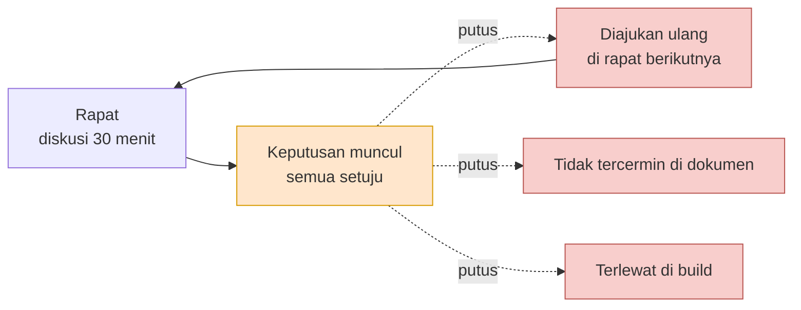
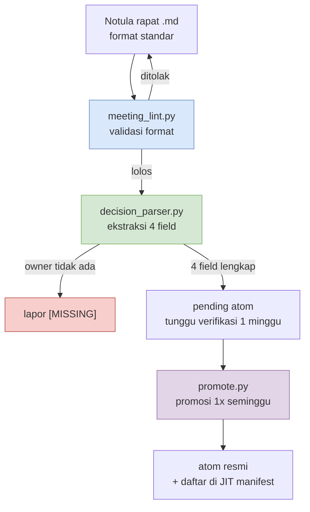

# 17.1 Mengapa Notula Rapat Adalah Titik Nyeri Terbesar

Rapat baru saja selesai lima menit lalu. Di papan tulis ruang rapat masih tersisa coretan. "Deteksi hit pada combat, kita pakai pendekatan client-side dulu. Tapi prioritas verifikasi server kita undur ke sprint berikutnya." Inilah kesimpulan yang dicapai lima orang setelah menghabiskan 30 menit. Semua mengangguk, dan seseorang memotretnya.

Tiga minggu kemudian, lima orang yang sama berkumpul lagi di ruang rapat yang sama. Di baris pertama daftar agenda tertulis: "Deteksi hit combat — client-side dulu vs verifikasi server, perlu keputusan." Tidak ada satu pun yang mengingat kesimpulan tiga minggu lalu. Foto papan tulis ada di suatu tempat dalam roll kamera seseorang, dan orang itu hari ini sedang cuti. Mereka menghabiskan 30 menit lagi. Kali ini kesimpulannya justru berbalik.

Inilah seluruh alasan mengapa notula rapat menjadi titik nyeri terbesar. Di rapat, keputusan memang dibuat. Tetapi keputusan itu tidak **mengalir (propagate)** ke rapat berikutnya, dokumen berikutnya, build berikutnya. Keputusan sudah dibuat, tetapi tidak tersebar. Bab ini adalah cerita tentang menyambung kembali rantai yang putus itu dengan data.

---

## 17.1.1 Rapat → Keputusan → Eksekusi, di Mana Rantainya Putus

Sistem RnD pribadi yang saya jalankan terbagi menjadi 17 dokumen. Standar penamaan atom, otomasi peta relasi, panduan pemetaan Layer, infrastruktur injeksi JIT, dan lain-lain. Di antara semuanya, dokumen tunggal yang menyedot paling banyak waktu adalah rencana perbaikan notula rapat. Bobotnya begitu besar hingga setara dengan gabungan 16 dokumen lainnya.

Awalnya saya heran. Notula rapat — bukankah cukup ditulis saja? Namun setelah diukur, ternyata titik nyerinya bukan pada *penulisan* notula, melainkan pada *apa yang terjadi setelah* notula. Di rapat, keputusan jelas-jelas dibuat. Masalahnya, siapa yang bertanggung jawab atasnya, atas dasar apa, sampai kapan, dan menuju apa — semua itu menguap begitu kita melangkah keluar dari pintu ruang rapat.

Bila keterputusan ini digambarkan dalam satu adegan, hasilnya seperti ini.



Garis putus-putus adalah penyebaran yang terputus. Keputusan (oranye) sudah dibuat, tetapi tidak mengalir ke salah satu dari tiga cabang (merah) itu. Keputusan yang tidak mengalir akan kembali ke rapat tiga minggu kemudian. Panah yang melengkung ke atas dan kembali ke rapat itulah inti sebenarnya dari titik nyeri ini.

Ketika penyebaran terputus, empat hal terjadi bersamaan.

Riwayat keputusan hilang. Pertanyaan "kenapa dulu diputuskan begitu?" dijawab dengan "saya tidak ingat, mari atur rapat lagi." Rapat berulang bertambah. Agenda yang sama diajukan ulang setiap kuartal. Anggota baru tidak bisa menangkap konteks. Karena akumulasi pengambilan keputusan tidak terlihat, setiap kali harus dijelaskan satu per satu. Lalu bantuan AI menjadi tidak berdaya. Karena tidak ada konteks, jawabannya hanya berhenti pada generalisasi umum. Bila notula rapat tercerai-berai, kita tidak bisa memberi AI jawaban atas "bagaimana tim kita dulu memutuskan agenda ini," dan AI hanya mengembalikan nilai rata-rata dari internet.

Keempatnya berasal dari akar yang sama. **Karena keputusan diperlakukan sebagai memo, bukan data.** Memo menguap, data mengalir.

---

## 17.1.2 Memandang Notula Rapat Bukan Sebagai Keluaran, Melainkan Database Keputusan

Di sini kita perlu membalik sudut pandang sekali. Jika notula rapat dipandang sebagai "keluaran dari rapat," maka tugas selesai begitu ia ditulis dan disimpan. Notula yang tersimpan sama seperti memo di atas meja. Hari itu terlihat, tetapi minggu depan entah ke mana.

Jika notula rapat dipandang sebagai "database pengambilan keputusan," ia menjadi pekerjaan yang sama sekali berbeda. Yang menjadi aset bukan notula itu sendiri, melainkan **keputusan** yang diekstrak dari notula, dan keputusan itu harus dapat dicari, dapat dirujuk, serta dapat disebarkan. Notula rapat hanyalah urat tambang tempat keputusan ditambang.

Memaksakan peralihan ini lewat kode adalah inti dari seluruh Bagian 17. Dalam sistem saya terdapat satu atom yang menopang peralihan ini. Namanya `decision_summary_not_clickup_mirror`. Bila dijabarkan, ia adalah prinsip bahwa "ringkasan keputusan notula rapat bukanlah cermin dari ClickUp (pelacak tugas)."

Mengapa atom ini diperlukan justru menohok tepat di jantung titik nyeri. Banyak tim yang sekadar menyalin slot keputusan dari notula rapat ke papan tugas. Akibatnya "yang harus dilakukan" tersisa, tetapi "mengapa diputuskan begitu (rationale)" hilang. Pelacak tugas memuat *apa yang harus dilakukan*, bukan *mengapa diputuskan begitu*. Inilah persisnya alasan rapat berulang tiga minggu kemudian. Tugasnya sudah ditutup, tetapi tidak ada rationale-nya, sehingga ketika ada yang bertanya "tapi kenapa dulu kita putuskan melakukannya begini," tidak ada yang bisa menjawab. Karena itu ringkasan keputusan tidak boleh menjadi cermin (mirror) dari pelacak tugas, melainkan harus menjadi aset mandiri yang memuat rationale. Nama atom itu sendiri adalah garis larangan ini.

---

## 17.1.3 Memecah Keputusan Menjadi Empat Field

Perbedaan antara keputusan yang menyebar dan keputusan yang menguap terletak pada strukturnya. Keputusan yang menguap adalah satu kalimat "kita pakai pendekatan client-side dulu." Keputusan yang menyebar terurai menjadi empat field.

<svg viewBox="0 0 720 300" xmlns="http://www.w3.org/2000/svg" font-family="sans-serif">
  <rect x="0" y="0" width="720" height="300" fill="#fbfbfb" stroke="#ddd"/>
  <text x="360" y="32" font-size="17" font-weight="bold" text-anchor="middle" fill="#333">1 Keputusan = 4 Field</text>
  <!-- decision -->
  <rect x="30" y="60" width="310" height="80" rx="6" fill="#dae8fc" stroke="#6c8ebf"/>
  <text x="46" y="86" font-size="14" font-weight="bold" fill="#1f3a5f">decision</text>
  <text x="46" y="108" font-size="12" fill="#333">apa yang diputuskan</text>
  <text x="46" y="128" font-size="11" fill="#666">"deteksi hit client-side dulu"</text>
  <!-- owner -->
  <rect x="380" y="60" width="310" height="80" rx="6" fill="#d5e8d4" stroke="#82b366"/>
  <text x="396" y="86" font-size="14" font-weight="bold" fill="#2d5016">owner</text>
  <text x="396" y="108" font-size="12" fill="#333">siapa yang bertanggung jawab</text>
  <text x="396" y="128" font-size="11" fill="#666">Anggota A (jika kosong [MISSING])</text>
  <!-- rationale -->
  <rect x="30" y="160" width="310" height="80" rx="6" fill="#ffe6cc" stroke="#d79b00"/>
  <text x="46" y="186" font-size="14" font-weight="bold" fill="#7a4f00">rationale</text>
  <text x="46" y="208" font-size="12" fill="#333">mengapa diputuskan begitu</text>
  <text x="46" y="228" font-size="11" fill="#666">"prioritas respons terasa, risiko cheat ditanggung"</text>
  <!-- follow_up -->
  <rect x="380" y="160" width="310" height="80" rx="6" fill="#e1d5e7" stroke="#9673a6"/>
  <text x="396" y="186" font-size="14" font-weight="bold" fill="#4a2d5f">follow_up</text>
  <text x="396" y="208" font-size="12" fill="#333">menuju apa selanjutnya</text>
  <text x="396" y="228" font-size="11" fill="#666">"tugas verifikasi server sprint berikutnya"</text>
  <!-- caption -->
  <text x="360" y="278" font-size="12" text-anchor="middle" fill="#555">Jika owner kosong, pipeline melaporkannya sebagai [MISSING] — memaksa garis tanggung jawab penyebaran</text>
</svg>

Dari keempat field, yang terpenting adalah `owner`. Jika sebuah keputusan tidak punya penanggung jawab, maka keputusan itu bukan pekerjaan siapa pun, dan keputusan yang bukan pekerjaan siapa pun tidak akan menyebar menjadi eksekusi. Karena itu pipeline ekstraksi saya tidak begitu saja melewatkannya ketika owner kosong, melainkan melaporkannya secara eksplisit sebagai `[MISSING]`. Fakta bahwa garis tanggung jawab itu kosong sendiri ditarik ke permukaan.

`rationale` adalah tempat bersemayamnya prinsip `decision_summary_not_clickup_mirror` yang disebut tadi. Bila tidak ada rationale, rapat akan berulang tiga minggu kemudian. `follow_up` adalah jembatan yang menghubungkan keputusan ke eksekusi nyata. Bila field ini kosong, keputusan hanya tinggal sebagai keputusan dan tidak menyentuh build.

---

## 17.1.4 Pipeline Ekstraksi — Menambang Keputusan dari Notula Rapat

Mengisi keempat field ini dengan tangan setiap kali memang mungkin, tetapi daya paksanya lemah. Sistem saya menggunakan pipeline yang mengekstrak keputusan dari notula rapat secara otomatis dan melaporkan field yang kosong. Tiga skrip terhubung secara seri.



Tahap pertama, `meeting_lint.py`, memeriksa apakah notula rapat mengikuti format standar. Apakah ada frontmatter, apakah 4 slot — agenda/keputusan/action/rapat berikutnya — sudah terisi. Notula dengan format yang rusak akan ditolak di sini dan dikembalikan ke penulisnya. Karena parser otomatis hanya dapat memproses input yang formatnya dipaksakan, lint ini berperan sebagai gerbang pintu masuk bagi seluruh pipeline.

Tahap kedua, `decision_parser.py`, adalah intinya. Ia membaca slot keputusan dan menguraikannya menjadi empat field (decision/owner/rationale/follow_up). Bila di sini owner tidak ditemukan, keputusan itu tidak dibuang melainkan dilaporkan sebagai `[MISSING]`. Sebab meloloskan keputusan tanpa penanggung jawab secara diam-diam adalah hal yang paling berbahaya.

Tahap ketiga adalah keputusan yang diekstrak tidak langsung menjadi aset resmi, melainkan menunggu dalam status `pending` selama 1 minggu. Periode verifikasi ini adalah gerbang yang dapat dibalik (reversible). Bila dalam 1 minggu terungkap bahwa "ini bukan keputusan, melainkan diskusi" atau "rationale-nya salah," maka ia dibuang. Lalu `promote.py` hanya memindahkan keputusan yang bertahan dari tinjauan mingguan ke folder atom resmi dan mendaftarkannya ke JIT manifest. Keputusan yang terdaftar akan otomatis diinjeksikan ke pekerjaan terkait mulai sesi berikutnya. Barulah keputusan itu mulai mengalir.

Batas antara dapat dibalik dan tidak dapat dibalik ada di sini. Hingga pembuangan pending, semuanya masih dapat dibalik. Namun begitu promote selesai dan keputusan menyebar ke dokumen lain, sheet data, atau build, sejak saat itu ia tidak dapat dibalik. Sebab persepsi anggota tim berubah dan keputusan-keputusan turunan menumpuk di atasnya. Karena itu semua tinjauan manusia harus dirampungkan tepat sebelum promote, yakni di rentang pending yang dapat dibalik.

---

## 17.1.5 Worked Transcript (rekaman sesi nyata) — Meloloskan Selembar Notula Rapat yang Rusak

Bila hanya bicara secara abstrak terasa tidak mengena, maka saya salin apa adanya catatan dari memasukkan selembar notula rapat yang benar-benar rusak ke dalam pipeline. Inputnya adalah notula rapat yang formatnya runtuh separuh.

**Input — `2026-06-02-battle.md` (format buruk)**

```markdown
---
type: meeting_note
date: 2026-06-02
category: battle
---

## Agenda
1. Lokasi deteksi hit (client vs server)

## Keputusan
- Deteksi hit diputuskan diterapkan client-side terlebih dulu. Pendapat
  bahwa kecepatan respons yang terasa lebih penting daripada bolak-balik
  ke server lebih dominan. Risiko cheat ditanggung.
- Verifikasi server menjadi tugas terpisah di sprint berikutnya.

## Action Item
- [ ] Desain verifikasi server
```

Notula rapat ini memang mencatat keputusan, tetapi owner-nya tidak ada di mana pun. Siapa yang menangani verifikasi server dibiarkan kosong. Slot jadwal rapat berikutnya juga hilang sama sekali. Saya masukkan ini ke parser dan melihat apa yang keluar.

**Prompt (prompt bantuan LLM lengkap yang dilampirkan ke decision_parser.py)**

```
Baca slot "## Keputusan" dari notula rapat di bawah dan untuk setiap
keputusan ekstrak 4 field: decision, owner, rationale, follow_up.
- Jika owner tidak dapat dipastikan dari isi teks, wajib tandai "[MISSING]".
  Jangan mengisinya dengan terkaan.
- rationale hanya kutip alasan yang tertulis dalam teks. Jika tidak ada, "[MISSING]".
- follow_up hubungkan dengan action item atau penyebutan sprint berikutnya.
Keluarkan hanya sebagai array JSON.

[isi notula rapat ditempelkan]
```

**Keluaran mentah Claude (apa adanya tanpa diringkas)**

```json
[
  {
    "decision": "Menerapkan deteksi hit di sisi client terlebih dulu",
    "owner": "[MISSING]",
    "rationale": "Kecepatan respons yang terasa lebih penting daripada bolak-balik server. Risiko cheat ditanggung",
    "follow_up": "Menjalankan verifikasi server sebagai tugas terpisah di sprint berikutnya"
  },
  {
    "decision": "Memisahkan verifikasi server menjadi tugas terpisah di sprint berikutnya",
    "owner": "[MISSING]",
    "rationale": "[MISSING]",
    "follow_up": "Terhubung dengan action item 'Desain verifikasi server' (penanggung jawab belum ditentukan)"
  }
]
```

Di sini saya berhenti dan meninjau keluarannya. Owner kedua keputusan tertangkap sebagai `[MISSING]`. Itu tepat — karena memang tidak ada penanggung jawab di mana pun dalam notula, maka benar bahwa parser tidak mengisinya dengan terkaan. Rationale keputusan kedua juga `[MISSING]`, dan memang dalam teks tidak ada alasan untuk keputusan kedua. Artinya parser tidak mengarang, sehingga dapat dipercaya.

Hanya saja ada satu tempat yang ambigu. Follow_up keputusan pertama adalah "verifikasi server ke sprint berikutnya," dan ini tumpang tindih isinya dengan keputusan kedua. Parser memandang batas antara kedua keputusan itu agak kabur. Inilah titik tempat manusia perlu turun tangan.

**Veto manusia + permintaan ulang**

```
Follow_up keputusan pertama tumpang tindih dengan isi keputusan kedua.
Persempit follow_up yang pertama menjadi "membuat tugas verifikasi server",
dan serahkan isi rinci verifikasi server ke keputusan kedua.
Lalu karena owner kedua keputusan sama-sama [MISSING],
tambahkan baris peringatan di paling atas keluaran yang menyatakan
bahwa owner perlu dipastikan sebelum notula rapat ini dinaikkan ke pending.
```

**Keluaran ulang Claude (mentah)**

```
⚠️ Peringatan: kedua keputusan owner [MISSING]. Sebelum promosi ke pending,
   perlu meminta fasilitator rapat memastikan owner.

[
  {
    "decision": "Menerapkan deteksi hit di sisi client terlebih dulu",
    "owner": "[MISSING]",
    "rationale": "Prioritas kecepatan respons yang terasa, risiko cheat ditanggung",
    "follow_up": "Membuat tugas verifikasi server (rincian di keputusan #2)"
  },
  {
    "decision": "Memisahkan verifikasi server menjadi tugas terpisah sprint berikutnya",
    "owner": "[MISSING]",
    "rationale": "[MISSING]",
    "follow_up": "Terhubung dengan action item 'Desain verifikasi server'"
  }
]
```

Yang ditunjukkan transcript ini adalah inti Bagian 17. Parser menambang keputusan, tetapi tidak menyembunyikan fakta bahwa garis tanggung jawab bernama owner itu kosong. `[MISSING]` tercetak dua kali, dan itu kembali kepada fasilitator rapat sebagai sinyal "pastikan owner." Agar keputusan menyebar menjadi eksekusi, harus ada penanggung jawab, dan bila tidak ada penanggung jawab, sistemlah yang mendorongnya ke permukaan. Agar selembar notula rapat yang rusak ini lolos gerbang tersebut, mau tak mau manusia harus mengisi owner. Simpul pertama penyebaran terikat di sini.

Sebagai catatan, `⚠️` pada keluaran di atas hanyalah baris peringatan konsol, bukan bagian dari format isi notula. Notula rapat itu sendiri tetap tinggal sebagai markdown 4 slot yang rapi.

---

## 17.1.6 Memangkas Ranting Samping dan Menegakkan Tulang Punggung

Bagian 17 semula dirancang dengan 6 bab (motivasi, ekstraksi, kategori, caption, sinkronisasi, bantuan AI), lalu disatukan menjadi 4 bab. Caption gambar dan sinkronisasi adalah ranting samping notula rapat, dan menyatukan titik nyeri terbesar yaitu "penyebaran keputusan" menjadi satu bab serta meletakkannya di depan adalah pilihan yang tepat. Saya menarik titik nyeri terbesar (penyebaran rapat → keputusan → eksekusi) ke §17.1, lalu menempatkan pipeline yang mengurai nyeri itu (meeting_lint → decision_parser → promote) tepat di belakangnya.

Sudut pandang yang memperlakukan notula rapat sebagai database, struktur yang memecah keputusan menjadi 4 field, gerbang yang melaporkan `[MISSING]` ketika owner kosong, verifikasi pending 1 minggu yang dapat dibalik — keempat hal ini menyambung kembali penyebaran yang putus. Titik nyeri berupa keputusan yang sudah dibuat tetapi tidak mengalir akan terurai bila keputusan dibentuk menjadi wujud yang dapat mengalir.

---

### Poin-Poin Penting
- Inti titik nyeri bukanlah penulisan notula rapat, melainkan putusnya penyebaran rapat → keputusan → eksekusi.
- Keputusan harus dipecah menjadi 4 field (decision/owner/rationale/follow_up) agar mengalir. Jika owner tidak ada, lapor [MISSING].
- Notula rapat bukan keluaran, melainkan DB pengambilan keputusan. Ia tidak boleh menjadi cermin dari pelacak tugas.

---

> **Penerapan di Luar Game.** Titik nyeri berupa "di rapat keputusan sudah dibuat, tetapi keputusan itu tidak mengalir ke rapat berikutnya" terulang setiap minggu bukan hanya di pengembangan game, melainkan di ruang rapat semua tempat kerja. Cara mencatat keputusan bukan sebagai memo satu kalimat melainkan dipecah menjadi empat field (apa, siapa, mengapa, tindakan berikutnya), dan menarik penanggung jawab yang kosong ke permukaan sebagai `[MISSING]`, dapat dipindahkan apa adanya ke rapat mana pun. Misalnya, jika di rapat mingguan pemasaran disepakati bahwa "kampanye berikutnya berfokus pada Instagram," tambahkanlah owner (siapa yang menjalankan), rationale (mengapa Instagram — dasar tingkat konversi kuartal lalu), dan follow_up (menyusun rencana anggaran). Tiga minggu kemudian, pertanyaan "siapa tadi yang akan mengerjakan itu" tidak akan pernah muncul lagi.

---

## Coba Sendiri

**Jalur Minimal Chatbot Web (tanpa terminal)** — Inti bab ini bukanlah skrip, melainkan gagasan "memecah keputusan menjadi 4 field agar mengalir." Gagasan itu dapat direproduksi apa adanya hanya dengan chatbot web (ChatGPT atau Claude web), tanpa infrastruktur CLI, hook, atau atom. Tiga langkah di bawah ini adalah arus utamanya.
1. Begitu rapat selesai, salin notula rapat (atau memo rapat) apa adanya. Tidak perlu ada format.
2. Tempelkan prompt di bawah ke kolom input chatbot web, lalu tempelkan notula rapat di bawahnya (di posisi `[isi notula rapat]`). Inilah melakukan dengan tangan, satu kali, apa yang dulu dikerjakan `decision_parser.py`.
   ```
   Dari notula rapat di bawah, untuk setiap keputusan tarik 4 field dalam bentuk tabel:
   decision (apa), owner (siapa yang bertanggung jawab), rationale (mengapa), follow_up (tindakan berikutnya).
   - Jika owner tidak dapat dipastikan, wajib "[MISSING]". Jangan menerka.
   - rationale hanya alasan yang tertulis dalam teks. Jika tidak ada, "[MISSING]".
   [isi notula rapat]
   ```
3. Pada tabel keluaran, konfirmasikan kolom bertanda `[MISSING]` ke fasilitator rapat dan isilah. Bila tabel yang sudah jadi Anda tempel dan tumpuk berurutan menurut tanggal dalam selembar dokumen seperti `decisions.md`, maka dokumen itulah yang langsung menjadi DB pengambilan keputusan. Untuk pencarian, cukup fitur cari dalam dokumen (Ctrl+F). Skrip, atom, dan JIT baru perlu diperkenalkan ketika kebiasaan ini menumpuk dan pencarian mulai terasa berat.

**setup** (versi infrastruktur — setelah jalur minimal di atas terbiasa di tangan)
- Tetapkan satu format standar notula rapat. frontmatter (type/date/category) + 4 slot (agenda/keputusan/action/rapat berikutnya).
- Siapkan 3 skrip: `meeting_lint.py` untuk validasi format, `decision_parser.py` untuk ekstraksi keputusan, dan `promote.py` untuk promosi (pada awalnya cukup dengan lint dan parser saja).
- Rincikan 4 field keputusan: decision, owner, rationale, follow_up. Masukkan aturan ke parser yang memaksa `[MISSING]` ketika owner kosong.

**prompt** (prompt bantuan LLM yang dilampirkan ke decision_parser)
```
Baca slot "## Keputusan" dari notula rapat di bawah dan untuk setiap keputusan ekstrak 4 field:
decision, owner, rationale, follow_up.
- Jika owner tidak dapat dipastikan, wajib "[MISSING]". Jangan menerka.
- rationale hanya kutip alasan yang tertulis dalam teks. Jika tidak ada, "[MISSING]".
- follow_up hubungkan dengan action item dan penyebutan sprint berikutnya.
Keluarkan hanya sebagai array JSON.
[isi notula rapat]
```

**verify**
- Pastikan owner pada semua keputusan di keluaran sudah terisi. Bila ada satu saja `[MISSING]`, naikkan ke pending hanya setelah meminta fasilitator rapat memastikan owner.
- Periksa apakah rationale tidak mengarang alasan yang tidak ada dalam teks (jika tidak ada, seharusnya `[MISSING]` adalah normal).
- Setelah ditahan 1 minggu di pending, promosikan ke atom resmi dengan `promote.py` hanya keputusan yang bertahan dari tinjauan mingguan.

## 17.1.7 Versi Ringkas Solo

Jika 3 skrip terasa membebani, rampingkan seperti ini. Cukup satukan format notula rapat menjadi 4 slot, dan begitu rapat selesai, lepas hanya slot keputusan lalu jalankan sekali ke LLM dengan prompt di atas. Pada keputusan yang owner-nya keluar sebagai `[MISSING]`, langsung tuliskan penanggung jawabnya saat itu juga. Tanpa otomasi pun, dengan melakukan ini saja, satu putusnya penyebaran yang paling umum — yaitu "keputusan tanpa penanggung jawab" — sudah dapat dicegah. lint dan promote dapat ditambahkan ketika notula rapat menumpuk dan pencarian mulai diperlukan.
