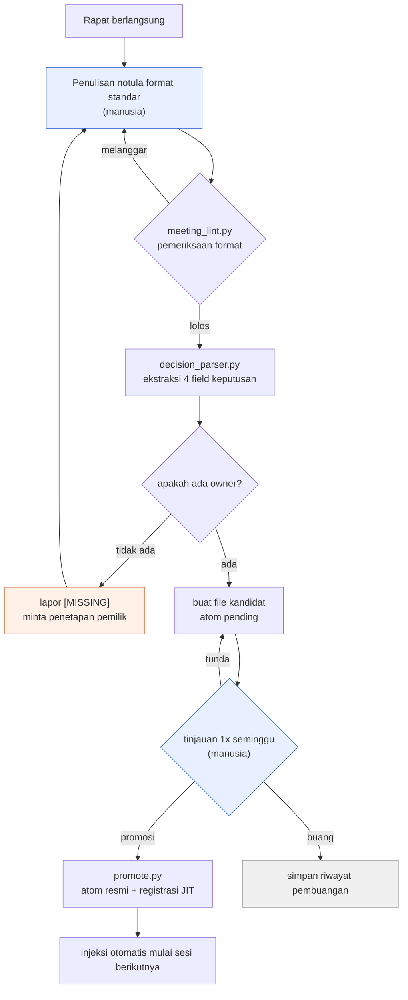

# 17.2 Pipeline Ekstraksi untuk Menambang Keputusan dari Notula Rapat

Rabu pagi, begitu tiba di kantor, sebuah notifikasi muncul di messenger tim internal. "Minggu lalu kita kan sepakat menambah jumlah slot inventaris menjadi 30 slot, betul? Siapa yang bertugas memperbaiki sheet data-nya?" Di thread itu tidak ada satu pun yang bisa menjawab. Notula rapatnya pasti ada. Tersimpan di suatu folder. Begitu dibuka, agenda dan diskusinya tertulis padat, tetapi "jadi apa yang diputuskan dan siapa yang bertanggung jawab" justru meleleh di sela-sela kalimat. Akhirnya, di rapat berikutnya, agenda yang sama diangkat lagi dari awal.

Bab ini adalah cerita tentang mesin yang menambal kekosongan selama tiga hari itu. Begitu satu notula rapat masuk, ia lolos pemeriksaan format, empat field keputusan terambil keluar, keputusan tanpa pemilik diberi label [MISSING], file kandidat terbentuk, dan setelah ditinjau seminggu kemudian ia menjadi aset yang diinjeksikan secara otomatis. Tangan manusia hanya menyentuh dua titik di kedua ujung. Pintu masuk tempat notula ditulis, dan pintu keluar tempat tinjauan dilakukan sekali seminggu.

---

## 17.2.1 Alur Keseluruhan Pipeline

Pertama, kita lihat keseluruhannya dalam satu gambar. Setiap kotak persegi adalah sebuah skrip kecil atau sebuah penilaian manusia. Kotak yang dipindahkan dengan tangan hanya dua, sisanya mengalir secara otomatis.



Hanya dua kotak biru (penulisan notula dan tinjauan 1x seminggu) yang dikerjakan manusia, sisanya skrip. Kotak oranye (lapor [MISSING]) adalah titik tempat pemeriksaan otomatis memanggil manusia kembali. Jika sebuah keputusan tidak punya pemilik, pipeline tidak sekadar berhenti, melainkan mengembalikan keputusan itu ke tahap penulisan notula sampai ditetapkan siapa yang bertanggung jawab. Inilah inti rancangan pipeline ini. Field kosong tidak dilewati diam-diam, melainkan dilaporkan dengan lantang.

Struktur folder aset secara keseluruhan tersusun seperti ini.

<svg xmlns="http://www.w3.org/2000/svg" viewBox="0 0 720 300" font-family="monospace" font-size="13">
  <rect x="10" y="10" width="700" height="280" fill="#fafafa" stroke="#cccccc"/>
  <text x="24" y="38" font-weight="bold">meeting_pipeline/</text>
  <line x1="40" y1="48" x2="40" y2="270" stroke="#bbbbbb"/>
  <text x="52" y="68">scripts/</text>
  <text x="80" y="92" fill="#3366cc">meeting_lint.py</text>
  <text x="300" y="92" fill="#777777">pemeriksaan format & seksi wajib</text>
  <text x="80" y="116" fill="#3366cc">decision_parser.py</text>
  <text x="300" y="116" fill="#777777">ekstraksi 4 field keputusan + lapor owner [MISSING]</text>
  <text x="80" y="140" fill="#3366cc">promote.py</text>
  <text x="300" y="140" fill="#777777">pending → atom resmi + perbarui JIT manifest</text>
  <text x="52" y="172">meetings/</text>
  <text x="80" y="196" fill="#999999">2026-05-18_battle_tf.md</text>
  <text x="300" y="196" fill="#777777">notula format standar (input)</text>
  <text x="52" y="228">atoms/pending/</text>
  <text x="80" y="252" fill="#cc6633">meeting_decision_2026-05-18_D1.md</text>
  <text x="300" y="252" fill="#777777">kandidat (menunggu verifikasi 1 minggu)</text>
</svg>

---

## 17.2.2 Tahap 1 — lint yang Memaksakan Format

Agar ekstraksi mungkin dilakukan, notula rapat harus berbentuk sesuatu yang dapat dibaca mesin. Jika seksi "## 결정" tidak ada, atau jika keputusan tercampur dalam satu paragraf prosa, parser tidak akan bisa mengambil apa pun. Karena itu, hal pertama yang dimasukkan adalah pemeriksaan format. Yang dilakukan `meeting_lint.py` sederhana. Apakah frontmatter wajib ada, apakah seksi wajib ada, apakah slot keputusan terisi dalam format `D1`, `D2`.

```python
# Kerangka meeting_lint.py
REQUIRED_FRONTMATTER = ["type", "date", "category", "attendees"]
REQUIRED_SECTIONS = ["## 안건", "## 결정", "## 액션 아이템", "## 다음 회의"]
ALLOWED_CATEGORIES = ["art", "battle", "daily", "issue", "review"]

def lint(meeting_note_path):
    fm, body = parse_markdown(meeting_note_path)
    errors = []
    for key in REQUIRED_FRONTMATTER:
        if key not in fm:
            errors.append(f"frontmatter hilang: {key}")
    if fm.get("category") not in ALLOWED_CATEGORIES:
        errors.append(f"nilai category tidak valid: {fm.get('category')}")
    for section in REQUIRED_SECTIONS:
        if section not in body:
            errors.append(f"seksi hilang: {section}")
    if "## 결정" in body:
        block = extract_section(body, "## 결정")
        if not any(l.strip().startswith("- D") for l in block.split("\n")):
            errors.append("slot keputusan kosong (perlu format D1, D2...)")
    return errors
```

Pemeriksaan ini dipasang sebagai hook sebelum notula di-commit. Jika format dilanggar, commit itu sendiri terblokir. Kalau hanya dijadikan anjuran, di hari yang sibuk format akan dilewati diam-diam, dan format yang sekali dilewati akan runtuh pada minggu berikutnya. Cukup terblokir selama 1\~2 minggu saja, format itu akan melekat di tangan. Namun, kalau terlalu ketat justru penulisan notula akan ditunda-tunda, jadi operasional yang realistis adalah membereskan false positive sekali setelah masa adaptasi.

---

## 17.2.3 Tahap 2 — Parser yang Menambang Empat Field Keputusan

Dari notula yang lolos format, `decision_parser.py` membaca slot keputusan. Dari satu keputusan, yang harus diambil persis ada empat. **Apa yang diputuskan (decision), siapa yang bertanggung jawab (owner), mengapa diputuskan begitu (rationale), apa yang harus dilakukan berikutnya (follow_up).** Empat field inilah yang menjadikan keputusan sebagai aset. Terutama owner. Keputusan tanpa pemilik bukanlah keputusan, melainkan sekadar harapan. Karena itu, kalau owner kosong, parser tidak diam-diam membiarkannya kosong, melainkan mengisi `[MISSING]` untuk melaporkannya.

Mulai dari sini sampai akhir, kita ikuti proses satu notula rapat menjadi aset tanpa melewati satu baris pun. Ini adalah contoh tunggal yang berkelanjutan, dari input hingga promosi atom.

```text
================ Input: meetings/2026-05-18_battle_tf.md ================
---
type: meeting
date: 2026-05-18
category: battle
attendees: [이민수, teammate_a, teammate_b]
related_atoms: [combat_global_cooldown_constant]
---
## 안건
- Menyeragamkan nilai Global Cooldown (GCD) pertempuran
- Apakah skill penyembuhan dikecualikan dari GCD

## 결정
- D1: Menyeragamkan global cooldown pertempuran menjadi 0.5 detik. (pemilik: teammate_a) [dasar: pada tes respons input yang dirasakan terhadap refgame, 0.5 detik paling stabil]
- D2: Skill penyembuhan dikecualikan dari penerapan global cooldown. [dasar: kekhawatiran terputusnya siklus penyembuhan]

## 액션 아이템
- @teammate_a: Terapkan 0.5 secara serentak pada kolom cooldown di sheet data pertempuran (~MM-DD)

## 다음 회의
- MM-DD 14:00, tinjau hasil tes 1 minggu siklus penyembuhan

================ $ python meeting_lint.py meetings/2026-05-18_battle_tf.md ================
[OK] frontmatter 4/4, seksi 4/4, terdeteksi 2 slot keputusan. Commit diizinkan.

================ $ python decision_parser.py meetings/2026-05-18_battle_tf.md ================
[
  {
    "id": "D1",
    "decision": "Menyeragamkan global cooldown pertempuran menjadi 0.5 detik.",
    "owner": "teammate_a",
    "rationale": "Pada tes respons input yang dirasakan terhadap refgame, 0.5 detik paling stabil",
    "follow_up": "Terapkan 0.5 secara serentak pada kolom cooldown di sheet data pertempuran (~MM-DD)",
    "source_meeting": "2026-05-18_battle_tf.md",
    "category": "battle",
    "related_atoms": ["combat_global_cooldown_constant"]
  },
  {
    "id": "D2",
    "decision": "Skill penyembuhan dikecualikan dari penerapan global cooldown.",
    "owner": "[MISSING]",          # ← Pemilik tidak dicantumkan. Parser melaporkannya
    "rationale": "Kekhawatiran terputusnya siklus penyembuhan",
    "follow_up": null,             # ← Aksi lanjutan juga tidak ada
    "source_meeting": "2026-05-18_battle_tf.md",
    "category": "battle",
    "related_atoms": ["combat_global_cooldown_constant"]
  }
]
[WARN] D2: owner=[MISSING] — keputusan tanpa pemilik. Pembuatan pending ditahan, dikembalikan ke penulis notula.

================ Pembuatan pending: hanya D1 yang lolos ================
$ cat atoms/pending/meeting_decision_2026-05-18_D1.md
---
name: meeting_decision_2026-05-18_D1
description: Keputusan menyeragamkan global cooldown pertempuran menjadi 0.5 detik
status: pending
type: decision
source_meeting: 2026-05-18_battle_tf.md
owner: teammate_a
category: battle
related_atoms: [combat_global_cooldown_constant]
created: 2026-05-18
---
## 결정
Menyeragamkan global cooldown pertempuran menjadi 0.5 detik.
## 근거
Pada tes respons input yang dirasakan terhadap refgame, 0.5 detik paling stabil.
## 후속 액션
- [ ] @teammate_a: Terapkan 0.5 secara serentak pada kolom cooldown (~MM-DD)

================ Tinjauan mingguan 1 minggu kemudian ================
$ python promote.py atoms/pending/meeting_decision_2026-05-18_D1.md
[PROMOTE] → atoms/combat_global_cooldown_constant_decisions/meeting_decision_2026-05-18_D1.md
[JIT] registrasi manifest: trigger=(전투|쿨다운|GCD|cooldown), atom 18 → 19
[OK] Mulai sesi berikutnya, saat "글로벌 쿨다운" dimasukkan, keputusan ini diinjeksikan otomatis.
```

Satu kotak ini adalah keseluruhan pipeline. Tempat yang perlu diperhatikan adalah D2. Isi keputusannya baik-baik saja dan dasarnya pun ada, tetapi owner-nya kosong. Parser tidak begitu saja meloloskannya. Ia mengisi `[MISSING]`, menahan pembuatan pending, lalu mengembalikannya ke penulis. Beberapa hari kemudian, D2 mendapatkan pemiliknya di rapat "tinjau hasil tes 1 minggu siklus penyembuhan" dan masuk lagi. Satu kali pengembalian yang menghalangi field kosong inilah yang membuat "siapa tadi yang bertugas melakukannya?" tidak akan pernah muncul lagi di messenger tim internal tiga hari kemudian.

Aturan untuk melaporkan ketika tidak ada owner itu sendiri telah dipakukan jadi aturan dengan satu atom (`decision_summary_not_clickup_mirror`, §17.1.2). Di alat task bisa saja ada tugas berbunyi "perbaiki sheet data", tetapi mengapa dan apa yang diputuskan sehingga tugas itu ada hanya tersimpan di atom notula rapat.

---

## 17.2.4 Tahap 3 — Diperam Seminggu di pending

Keputusan yang diloloskan parser tidak langsung menjadi atom resmi, melainkan menunggu seminggu di `pending/`. Sebab, apa yang diputuskan dengan penuh percaya diri di rapat kerap terbalik setelah dioperasikan seminggu. D2 pada contoh di atas tepat berada di zona berbahaya itu. Keputusan "penyembuhan dikecualikan dari GCD (global cooldown)" bisa terbalik lagi jika siklus penyembuhan rusak pada tes 1 minggu. pending adalah kotak yang secara paksa mengamankan waktu agar tintanya mengering.

Dan pembuangan pun disimpan sebagai aset. Andai keputusan seperti D2 runtuh pada tes 1 minggu, ia tidak sekadar dihapus, melainkan dibuatkan atom riwayat pembuangan.

```markdown
---
name: meeting_decision_2026-05-18_D2_DISCARDED
status: discarded
discarded_reason: Hasil tes 1 minggu, kurva DPS siklus penyembuhan runtuh
---
## 원 결정
Global cooldown 0.5 detik juga diterapkan pada skill penyembuhan.
## 폐기 이유
Pada tes 1 minggu, DPS siklus penyembuhan turun sehingga keseluruhan balance runtuh. Dikembalikan ke keputusan pengecualian.
## 교훈
"Penyembuhan dikecualikan dari GCD adalah standar" → dipromosikan menjadi atom combat_healing_skill_cooldown_exception.
```

Riwayat pembuangan menjadi jawaban untuk "agenda ini dulu belum pernah dicoba?" di rapat berikutnya. Ini alat termurah untuk mencegah kesalahan yang sama terjadi dua kali. Namun, kalau catatan pembuangan menumpuk ia menjadi noise pencarian, jadi diperlukan perapian per kuartal untuk membereskan duplikat dan hanya menyisakan pelajarannya.

---

## 17.2.5 Tahap 4 — Tinjauan 1x Seminggu dan Promosi

Setiap minggu, pada waktu yang sudah ditentukan, kandidat pending dilihat sekaligus. Hasilnya salah satu dari tiga.

| Hasil | Penanganan |
|---|---|
| Promosi | pending → pindahkan ke folder atom resmi, registrasi JIT manifest |
| Buang | keputusan terbalik → keluarkan dari pending dan simpan atom riwayat pembuangan |
| Tunda | informasi kurang → perpanjang pending 1 minggu |

Tinjauan memakan sekitar 15 menit per 10 atom. Begitu promosi diputuskan, `promote.py` menangani pemindahan file dan pembaruan manifest sekaligus.

```python
# Kerangka promote.py
def promote(pending_path):
    fm, body = parse_markdown(pending_path)
    target = ATOM_BASE / f"{fm['related_atoms'][0]}_decisions" / f"{fm['name']}.md"
    move(pending_path, target)
    manifest = json.load(open(JIT_MANIFEST))
    manifest['atoms'].append({
        "name": fm['name'],
        "path": str(target),
        "trigger_regex": build_trigger(fm),   # kata kunci related_atoms + category
        "description": fm['description'],
        "added": today(),
    })
    json.dump(manifest, open(JIT_MANIFEST, "w"), indent=2)
    log_promotion(fm['name'])
```

Jika `trigger_regex` cocok dengan input pengguna pada sesi berikutnya, keputusan ini diinjeksikan otomatis. Pada contoh di atas, saat memasukkan "글로벌 쿨다운", keputusan D1 beserta dasarnya akan ikut masuk. Inilah titik ketika keputusan yang dulu dipindahkan dengan tangan menjadi aset yang muncul dengan sendirinya pada saat dibutuhkan.

---

## 17.2.6 Pengukuran — Apa Bedanya dengan Saat Dipindahkan dengan Tangan

Ini adalah kesan dari pengalaman saya mengoperasikan Proyek A, membandingkan tahap saat hanya format standar yang ditetapkan dengan tahap saat pipeline dijalankan. Angka di bawah bukan pengukuran presisi, melainkan arah yang dirasakan selama operasional dan rasio kasar, dan tercampur perkiraan penulis (belum terverifikasi).

| Item | Format saja (ekstraksi manual) | Pipeline berjalan |
|---|---|---|
| Waktu notula → ekstraksi keputusan | 20\~30 menit per rapat | Kurang dari 1 menit |
| Rasio promosi keputusan menjadi atom | 5\~10% (waktu perapian kurang) | 60\~80% (tinjauan menyeluruh) |
| Rapat ulang "dulu belum diputuskan?" | 5\~10 kasus per kuartal | 0\~2 kasus per kuartal |
| Munculnya keputusan tanpa pemilik jelas | Tidak terlacak | Langsung terlihat lewat lapor [MISSING] |

Yang paling besar berubah adalah rasio promosi. Saat masih dirapikan dengan tangan, karena tidak ada waktu, lebih dari 90% keputusan menguap. Setelah diotomatisasi, tinjauan menyeluruh menjadi mungkin, sehingga keputusan yang berharga tersisa tanpa terlewat. Arahnya jelas. Nilai pasti rasionya berbeda-beda tergantung ukuran tim dan frekuensi rapat.

---

## 17.2.7 Kegagalan yang Umum dan Resepnya

| Pola | Resep |
|---|---|
| Mengoperasikan lint hanya sebagai anjuran | Paksakan lewat commit hook |
| Menulis diskusi sekalian di slot keputusan | Keputusan satu kalimat, dasar di field terpisah |
| Membiarkan owner kosong begitu saja lolos | Lapor [MISSING] + tahan pending lalu kembalikan |
| Tinjauan pending tertunda | Slot tetap di retrospektif mingguan, walau 5 menit tiap minggu |
| Tidak menyimpan riwayat pembuangan | Simpan pembuangan pun sebagai atom terpisah |

Lima baris ini hampir keseluruhannya. Mengurangi sebanyak mungkin titik yang harus dijaga manusia dengan kemauan, dan menyerahkan pemeriksaan format serta owner kepada mesin, itulah titik stabil sistem ini.

---

## Poin-Poin Penting
- Satu notula rapat mengalir otomatis lewat lint → parser → pending → tinjauan → registrasi JIT lalu menjadi aset.
- Di antara empat field keputusan, jika owner kosong, parser mengisi [MISSING] dan mengembalikannya.
- Pemeraman 1 minggu di pending dan penyimpanan riwayat pembuangan memaksakan waktu agar tinta keputusan mengering.

---

> **Penerapan di Luar Game.** Struktur ini — mengalirkan satu notula rapat melalui konveyor pemeriksaan format → ekstraksi keputusan → verifikasi 1 minggu → registrasi resmi, sementara manusia hanya menyentuh dua titik yaitu pintu masuk (penulisan) dan pintu keluar (tinjauan 1x seminggu) — bukan cuma untuk game, melainkan dapat dipindahkan ke operasional dokumen tim kerja pengetahuan apa pun. Misalnya, ketika tim konsultan menangani catatan rapat klien, cukup seragamkan format catatan, ekstraksi awal slot "keputusan, penanggung jawab, dasar, tindakan berikutnya" dengan LLM, lalu jika penanggung jawab kosong munculkan `[MISSING]` dan kembalikan, dan promosikan menjadi action tracker resmi hanya keputusan yang sudah diperam seminggu. Keputusan rapat yang dulu lebih dari 90% menguap saat dirapikan dengan tangan, begitu dinaikkan ke konveyor menjadi objek tinjauan menyeluruh dan tersisa tanpa terlewat.

---

## Coba Sendiri

**setup.** Letakkan templat format standar di folder notula rapat, dan pasang `meeting_lint.py` pada hook sebelum commit. Tetapkan 4 field frontmatter dan 4 seksi sebagai wajib.

**prompt.** Masukkan satu notula rapat ke parser dan instruksikan seperti berikut.

> Dari seksi `## 결정` di notula rapat ini, untuk setiap keputusan, ambil empat field decision / owner / rationale / follow_up sebagai JSON. Untuk keputusan yang owner-nya tidak dicantumkan, tandai owner sebagai `[MISSING]` dan kumpulkan terpisah pada baris peringatan. Jangan mengisi dengan menebak-nebak.

**verify.** Jika pada JSON keluaran ada keputusan yang owner-nya terisi `[MISSING]`, jangan buat pending untuk keputusan itu, melainkan kembalikan ke penulis notula. Buat file kandidat pending hanya untuk keputusan yang owner-nya sudah terisi semua, lalu tetapkan promosi, pembuangan, atau penundaan pada tinjauan mingguan seminggu kemudian.

### Versi Ringkas Solo
Kalau Anda bekerja sendirian, tiga skrip ditambah commit hook itu berlebihan. Standarkan saja seksi `## 결정` di notula rapat, dan untuk setiap keputusan tulis satu baris `D1: apa / pemilik: saya / dasar: mengapa`. Sekali seminggu, kais saja baris keputusan dari notula minggu itu dan kumpulkan dalam satu file (`decisions.md`), lalu pada baris yang pemiliknya kosong tinggalkan sendiri tanda `[MISSING]` untuk diisi minggu berikutnya. Skrip boleh ditempelkan nanti saat tangan sudah pegal, tidak akan terlambat. Intinya adalah tiga kebiasaan: "satu baris keputusan, mencantumkan pemilik, mengumpulkan sekali seminggu".
