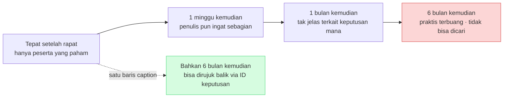
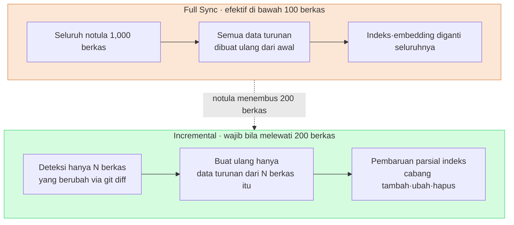

# 17.3 Klasifikasi, Caption, dan Sinkronisasi Rapat — Tiga Poros Notula yang Menjadi Aset

> Tujuan notula bukan sekadar menumpuknya. Tujuannya adalah agar masih bisa dicari enam bulan kemudian, mengalir menjadi keputusan, dan terlihat dalam keadaan yang sama di dua komputer.

---

Selasa sore. Saya teringat bahwa dalam rapat setahun lalu kami jelas-jelas sepakat menurunkan satu tingkat saturasi kostum karakter. Namun saya tidak bisa menemukan notula rapat itu. Ketika saya membuka foldernya, ada 200 berkas seperti `meeting_0413.md`, `회의_수정본_final.md`, dan `IMG_2034.png` yang hanya bertumpuk berurutan menurut tanggal. Tidak ada kategori, tidak ada caption, tidak ada penamaan yang konsisten. Keputusannya ada di suatu tempat, tetapi jalan untuk mencapainya sudah lenyap.

Agar notula menjadi aset, tiga hal harus bekerja secara bersamaan. **Klasifikasi** membuat titik masuk pertama bagi pencarian, **caption** menjaga separuh gambar tetap dapat dicari, dan **sinkronisasi** mengikat biaya pemrosesan hanya pada bagian yang berubah meski jumlahnya melampaui 1,000 berkas. Jika satu saja dari ketiga ini hilang, notula hanya menjadi tumpukan mati yang semakin berat seiring penumpukannya.

Pada §17.1·§17.2, saya menyusun alur untuk mengubah notula menjadi pipeline ekstraksi — memeriksa format dengan `meeting_lint.py`, lalu `decision_parser.py` menarik empat field keputusan (`decision` / `owner` / `rationale` / `follow_up`), melaporkannya sebagai `[MISSING]` jika owner kosong, mengumpulkannya sebagai pending atom, kemudian mempromosikannya dengan `promote.py`. Bab ini membahas tiga standar operasional yang menopang pipeline itu agar tidak rusak dalam jangka panjang.

---

## 17.3.1 Kategori — Titik Masuk Pertama bagi Pencarian

Seiring berjalannya waktu, notula menjadi ratusan, bahkan ribuan. Materi yang tidak bisa dicari bukanlah aset. Kategori adalah persimpangan pertama dari pencarian itu. Sama seperti menempelkan label pada lemari arsip di kantor. Lemari tanpa label pada akhirnya tidak pernah dibuka siapa pun.

Proyek A yang saya jalankan (pengembangan MMORPG) mengelompokkan kategori menjadi lima. Intinya adalah menjaganya tetap **kecil dan saling tegak lurus (ortogonal)**.

<svg viewBox="0 0 720 220" xmlns="http://www.w3.org/2000/svg" font-family="sans-serif" font-size="13">
  <rect x="10" y="10" width="130" height="190" rx="8" fill="#fce7d6" stroke="#d98a4a"/>
  <text x="75" y="34" text-anchor="middle" font-weight="bold">art</text>
  <text x="75" y="58" text-anchor="middle" font-size="11">Arah visual·seni</text>
  <text x="75" y="78" text-anchor="middle" font-size="10" fill="#666">Tinjauan konsep</text>
  <text x="75" y="94" text-anchor="middle" font-size="10" fill="#666">Kesepakatan tona lingkungan</text>
  <text x="75" y="120" text-anchor="middle" font-size="10" fill="#a05a20">→ Bobot caption↑</text>

  <rect x="150" y="10" width="130" height="190" rx="8" fill="#d6e7fc" stroke="#4a7ad9"/>
  <text x="215" y="34" text-anchor="middle" font-weight="bold">battle</text>
  <text x="215" y="58" text-anchor="middle" font-size="11">Tempur·balance</text>
  <text x="215" y="78" text-anchor="middle" font-size="10" fill="#666">Cooldown·DPS</text>
  <text x="215" y="94" text-anchor="middle" font-size="10" fill="#666">Kurva damage</text>
  <text x="215" y="120" text-anchor="middle" font-size="10" fill="#2050a0">→ Ekstraksi atom↑</text>

  <rect x="290" y="10" width="130" height="190" rx="8" fill="#d6fce0" stroke="#4ad97a"/>
  <text x="355" y="34" text-anchor="middle" font-weight="bold">daily</text>
  <text x="355" y="58" text-anchor="middle" font-size="11">Berbagi progres rutin</text>
  <text x="355" y="78" text-anchor="middle" font-size="10" fill="#666">Stand-up</text>
  <text x="355" y="94" text-anchor="middle" font-size="10" fill="#666">Tugas hari ini</text>
  <text x="355" y="120" text-anchor="middle" font-size="10" fill="#207040">→ Hampir tanpa keputusan</text>

  <rect x="430" y="10" width="130" height="190" rx="8" fill="#fcd6d6" stroke="#d94a4a"/>
  <text x="495" y="34" text-anchor="middle" font-weight="bold">issue</text>
  <text x="495" y="58" text-anchor="middle" font-size="11">Respons isu mendesak</text>
  <text x="495" y="78" text-anchor="middle" font-size="10" fill="#666">Build gagal</text>
  <text x="495" y="94" text-anchor="middle" font-size="10" fill="#666">Insiden jelang rilis</text>
  <text x="495" y="120" text-anchor="middle" font-size="10" fill="#a02020">→ Wajib dibereskan pasca-rapat</text>

  <rect x="570" y="10" width="130" height="190" rx="8" fill="#ece6fc" stroke="#7a4ad9"/>
  <text x="635" y="34" text-anchor="middle" font-weight="bold">review</text>
  <text x="635" y="58" text-anchor="middle" font-size="11">Milestone·QA</text>
  <text x="635" y="78" text-anchor="middle" font-size="10" fill="#666">Tinjauan MS</text>
  <text x="635" y="94" text-anchor="middle" font-size="10" fill="#666">Retrospektif kuartalan</text>
  <text x="635" y="120" text-anchor="middle" font-size="10" fill="#502090">→ atom ringkasan</text>

  <text x="360" y="172" text-anchor="middle" font-size="11" fill="#444">Kelima kotak tidak saling tumpang tindih — satu rapat tepat satu kotak</text>
  <text x="360" y="192" text-anchor="middle" font-size="11" fill="#444">Begitu ditambah jadi enam kotak, "ini art atau battle?" akan menghambat rapat tiap minggu</text>
</svg>

Lima bukanlah jawaban benar untuk semua tim. Untuk proyek yang berpusat pada sistem non-tempur, perlu penyesuaian seperti mengganti `battle` dengan `system`. Intinya bukan angkanya, melainkan prinsip menjaga **keputusan klasifikasi tetap cukup kecil agar tidak menghambat rapat itu sendiri**.

### Satu Rapat Satu Kategori

Sering terjadi sebuah rapat menjangkau dua kotak. Jika ketika meninjau konsep karakter kalian juga menyepakati motion tempur, itu art atau battle? Prinsipnya adalah **hanya satu, berdasarkan keluaran utama**. Jika konsep adalah keluaran utama, klasifikasikan sebagai art, dan motion tempur dicatat sebagai pelengkap di field `sub_topic`.

```yaml
---
type: meeting_note
category: art
sub_topic: [character, battle_motion]
date: 2026-05-18
attendees: [teammate_a, teammate_b, teammate_c, 이민수]
related_atoms: [character_concept_kim, battle_motion_kim]
confidential: internal
---
```

`sub_topic` hanyalah filter pencarian tingkat kedua, dan tidak digunakan untuk keputusan routing. Routing selalu bekerja hanya dengan nilai tunggal `category`. Jika prinsip nilai tunggal ini runtuh, `promote.py` dari §17.2 tidak dapat menentukan ke folder mana atom harus dikirim, dan jumlah statistik per kategori pun jadi tidak sinkron. Ortogonalitas bukan soal estetika, melainkan prasyarat bagi integritas pipeline.

### Operasinya Berbeda untuk Tiap Kategori — Itulah Nilai Sejati Pemisahan

Alasan sebenarnya membagi lima kotak bukanlah label pencarian. Karena cara operasinya berbeda di tiap kotak, pemisahan membuat operasi yang berbeda-beda terancang secara alami.

`art` memiliki banyak gambar lampiran, sehingga standar caption pada subbab berikutnya menjadi wajib. Karena keputusannya berpusat pada visual, ke dalam slot keputusan masuk referensi gambar seperti ``. Pada `battle`, keputusannya berupa angka·aturan sehingga rasio promosi otomatis atom-nya paling tinggi, dan karena satu baris keputusan berujung pada perubahan massal sheet data, visualisasi cakupan dampak (diagram relasi Bagian 11) menjadi penting. Pada `daily`, normal bila hampir tidak ada keputusan, dan karena penumpukannya cepat, ia dipisahkan ke folder otomatis per minggu (`daily/2026-W21/`). Pada `issue`, karena notulanya berserakan, kami mewajibkan pembenahan dalam 24 jam pasca-rapat dan mengekstrak atom pencegahan kambuh ke `issue_postmortem/`. Pada `review`, karena panjang, kami menulis atom ringkasan 5\~10 baris secara terpisah agar otomatis dikutip pada retrospektif kuartal berikutnya.

Penambahan kategori baru dilakukan dengan sangat hati-hati. Hanya ditinjau bila keempat syarat ini terpenuhi semua — muncul 5 kali atau lebih per kuartal, cara operasinya jelas berbeda dari kelima yang ada, memerlukan folder routing tersendiri, dan tetap bertahan 5 kali atau lebih sebulan kemudian. Berdasarkan pengalaman operasi saya, lima kategori bertahan lebih dari 1 tahun, dan bahkan ketika kandidat seperti `tech_review` atau `external` terlintas, pada akhirnya semuanya terserap sebagai `sub_topic`.

### Pengklasifikasi AI Harus Tetap Sebatas Pelengkap

Yang utama adalah kategori diinput langsung oleh manusia saat menulis. Hanya notula yang kategorinya hilang — seperti materi yang diterima dari luar — yang dibantu oleh pengklasifikasi AI. Sekitar 90% tertangkap dengan kamus kata kunci, dan hanya sisanya yang `uncertain` yang diputuskan oleh LLM atau manusia.

Saat mendelegasikannya ke LLM, prompt yang memasang batasan ketat lebih stabil. Berikut adalah prompt lengkap yang benar-benar saya gunakan.

```
Berikut ini adalah notula rapat. Klasifikasikan ke salah satu dari 5 kategori.

Kategori:
- art: arah visual·seni
- battle: sistem tempur·balance
- daily: berbagi progres rutin
- issue: respons isu mendesak
- review: tinjauan milestone·QA

Notula rapat:
[teks lengkap atau 500 karakter pertama]

Format respons: hanya satu kata kategori. Dilarang keras penjelasan·alasan·ketidakpastian apa pun.
Jika respons bukan salah satu dari 5 kategori, dianggap sebagai kegagalan sistem.
```

Ketika saya memasukkan notula yang sama (berikut adalah pembuka sebuah rapat art), keluaran mentah dari Claude seperti ini.

> Notula input:
> `Tinjauan konsep v3 karakter K_007 (cendekiawan). Ada pendapat bahwa saturasi rona warna kostum terlalu tinggi. Sepakat diturunkan satu tingkat. Disepakati untuk turut memeriksa tona motion tempur pada rapat berikutnya.`

> Keluaran Claude:
> `art`

Keluar rapi hanya satu kata. Namun ketika saya memasukkan notula daily ke prompt yang sama, terjadi pula hal seperti ini.

> Input: `Build pagi ini rusak dini hari, penyebabnya tampaknya konflik merge sheet data. Akan di-hotfix dulu, lalu rencananya diperbaiki secara resmi.`

> Keluaran Claude:
> `issue`

Secara permukaan ini ucapan yang muncul dalam stand-up daily, tetapi Claude melihat isinya dan mengklasifikasikannya sebagai `issue`. **Inilah persis alasan mengapa pengklasifikasi tidak boleh dijadikan yang utama.** Manusia membuat penilaian operasional: "ini insiden build yang tiba-tiba muncul di tengah daily, jadi harus dipisah menjadi rapat issue tersendiri." AI hanya melihat teks dan menempelkan label. Labelnya mungkin benar, tetapi soal memisahkan rapat atau tidak, ia tidak bisa memutuskannya. Karena itu manusia menjadi yang utama, dan LLM tetap sebatas pelengkap untuk bagian yang hilang.

Pada retrospektif kuartalan, kami menghitung jumlah rapat per kategori untuk melihat "di mana kami menghabiskan waktu". Distribusi di bawah ini adalah perkiraan penulis (belum terverifikasi); jumlah absolutnya hanya contoh, dan hanya relasi besar-kecil rasionya yang sesuai dengan rasa operasi yang sebenarnya.

| Kategori | Bobot (perkiraan) | Catatan |
|---|---|---|
| `daily` | sekitar 1/3 | Rutin tiap hari, hampir tanpa keputusan |
| `battle` | sekitar 1/5 | TF tempur 2 kali seminggu |
| `art` | sekitar 1/7 | Tinjauan seni + rapat eksternal |
| `issue` | rendah | Insiden build dsb. |
| `review` | paling rendah | Milestone·retrospektif kuartalan |
| Lainnya | sekitar 1/5 | 1:1, eksternal, dll. non-kategori |

Jika `issue` tertangkap menonjol dalam suatu kuartal, perbaikan stabilitas build·CI muncul sebagai prioritas berikutnya. Kategori bukan hanya untuk pencarian, melainkan juga cermin yang memantulkan alokasi waktu organisasi.

---

## 17.3.2 Caption — Satu Baris yang Menghidupkan Separuh Gambar

Notula `art` separuh isinya adalah gambar. Dan gambar tanpa caption sama seperti tumpukan foto di atas meja. Hari itu semuanya teringat, tetapi sebulan kemudian hanya foto yang punya satu baris memo di baliknya yang bertahan.



Jika gambar adalah separuh notula tetapi tidak bisa dicari, berarti separuh aset notula telah lenyap. Yang menghidupkan separuh itu adalah satu baris caption.

### Tiga Unsur Caption

Standar caption Proyek A selesai dalam tiga baris.

```markdown


**[Gambar 1]** Konsep v3 karakter K_007 (cendekiawan) — saturasi rona kostum diturunkan satu tingkat
*Keputusan: D2 (saturasi kostum -10%) | Aksi berikutnya: pengerjaan v4 (~MM-DD)*
```

Ketiga unsur masing-masing membuka jalur pencarian yang berbeda. **Nomor + keterangan satu baris** membuka jalan untuk mengutip "lihat Gambar 1" di badan teks, **referensi ID keputusan (D2)** membuka rujukan balik "gambar yang terkait keputusan ini", dan **aksi berikutnya** meninggalkan petunjuk pekerjaan lanjutan. Ketiga baris dapat ditulis dalam waktu kurang dari 1 menit. "Lekatkan segera" tidak berarti "ditulis saat rapat". Saat rapat cukup merapikan keputusan saja, lalu mengisi caption dalam 10 menit setelahnya — itulah yang realistis.

### Nama Berkas dan Folder adalah Titik Masuk Pertama

Sepenting caption adalah nama berkas. Sebab folder dan nama berkas itu sendiri adalah titik masuk pertama pencarian.

```
folder notula/
├── 2026-05-18_art_review.md
└── images/
    └── 2026-05-18_art_review/
        ├── character_kim_concept_v3.png
        ├── env_palette_comparison.png
        └── reference_external_game_a.png
```

Aturannya adalah `<topik>_<item>_<versi atau catatan>.<ext>`, dan bahasa Korea·spasi·karakter khusus dilarang (mencegah insiden encoding path). `IMG_2034.png` (makna 0), `김캐릭터 v3.png` (Korea·spasi), `final_final_v3_real.png` (versi tak bermakna), `untitled.png` (kandidat dibuang) semuanya adalah antipola. Daripada bergantung pada kemauan manusia, lebih baik memaksakan nama seperti ini dengan menambahkan aturan pemeriksaan ke `meeting_lint.py` — cukup menumpangkan satu baris pemeriksaan nama berkas pada lint yang mengotomasikan pemeriksaan format di §17.2.

### Sumber Materi Eksternal dan Tingkat confidential

Dalam rapat, sering terjadi pengutipan game·seni eksternal sebagai referensi. Tanpa sumber, ini langsung berujung pada insiden hak cipta.

```markdown


**[Gambar 3]** Gambar referensi — refgame (Developer Y, 2024)
*Alasan pengutipan: membandingkan penanganan saturasi pada konsep serupa. Tanpa peminjaman langsung.*
```

Sumber (nama game·pengembang·tahun), alasan pengutipan, dan ada-tidaknya peminjaman langsung dicantumkan semuanya. Dan karena gambar berisiko bocor lebih besar daripada teks, tingkatnya dilekatkan pada frontmatter.

```yaml
confidential: internal   # internal / restricted / external_ok
images:
  - file: character_kim_concept_v3.png
    confidential: restricted
    reason: desain karakter yang belum dirilis
```

`internal` berarti berbagi internal perusahaan, `restricted` hanya untuk TF·penanggung jawab terkait, dan `external_ok` berarti persetujuan berbagi pemasaran·eksternal. Saat build notula, keluaran dipisahkan per tingkat, dan gambar yang bukan `external_ok` di-blur otomatis pada salinan berbagi eksternal. Pemisahan otomatis ini memberikan efek langsung yang membuat insiden masking berbagi eksternal praktis menjadi 0.

### AI Juga Menyusun Draf Caption

Menulis 50 caption untuk 50 gambar dengan tangan adalah beban. Saya memberikan badan teks dan nama berkas ke AI lalu menerima draf secara massal.

```
Berikut adalah badan teks notula + daftar berkas gambar.

[badan teks notula]
[10 nama berkas gambar]

Susunlah draf caption untuk setiap gambar.

Format:
- [Gambar N] <keterangan> — <keputusan inti atau perubahan>
- *Keputusan: D? | Aksi berikutnya: ?*

Untuk gambar yang tidak dapat ditemukan dasarnya di badan teks, tandai sebagai "isi tidak jelas — perlu konfirmasi penulis".
```

Di sini baris terakhir adalah intinya. Ketika notula yang sama dimasukkan, Claude memberi caption pada gambar yang ada dasarnya di badan teks, tetapi untuk `reference_external_game_a.png` menjawab seperti ini.

> Keluaran Claude (kutipan):
> `[Gambar 3] reference_external_game_a.png — isi tidak jelas, perlu konfirmasi penulis. Alasan pengutipan gambar referensi eksternal ini tidak tercantum di badan teks.`

AI melaporkan bahwa ia tidak tahu hal yang tidak diketahuinya. Menerima ini, penulis mengisi alasan pengutipan. Jika hanya dengan konteks badan teks tidak cukup, pilih saja 5\~10 gambar inti dan kirim ke model Vision (karena biaya token gambar besar, tidak semuanya dijalankan).

```python
# Terapkan hanya pada 5~10 gambar inti — biaya token per gambar besar
response = client.messages.create(
    model="claude-opus-4-8",
    messages=[{
        "role": "user",
        "content": [
            {"type": "image", "source": {"type": "base64", "data": img_b64}},
            {"type": "text", "text": "Jelaskan gambar ini dalam satu baris bahasa Indonesia. Dilarang menebak, hanya yang terlihat."},
        ],
    }],
)
```

Penulis merapikan satu baris ini ke dalam format caption. Tidak perlu menjalankan Vision pada semua gambar. Hanya dengan 5\~10 gambar inti pun, kemungkinan dapat dicari sudah cukup meningkat.

Notula setahun yang caption-nya tertulis baik, dengan sendirinya menjadi dokumen visual development. Perubahan visual `character_kim` v1 → v2 → v3 dapat dilacak via ID keputusan, dan jika hanya memfilter tingkat `external_ok`, materi laporan eksternal otomatis terkurasi, serta jika mengumpulkan gambar inti + caption per bidang, ia menjadi materi onboarding anggota tim baru. Jika perubahan sebelum-sesudah penerapan caption dinyatakan dengan perkiraan penulis (belum terverifikasi), **arahnya** seperti ini — tingkat keberhasilan pencarian notula 6 bulan lalu naik signifikan, pertanyaan ulang "di mana ya saya pernah lihat gambar ini?" berkurang signifikan, dan insiden masking berbagi eksternal mengerucut ke 0. Angka absolutnya tentu berbeda tiap tim, tetapi hanya dengan tahap 1·2 (standar nama berkas + format caption) pun arah itu sudah muncul dengan jelas.

---

## 17.3.3 Sinkronisasi — Bukan Keseluruhan, Hanya Bagian yang Berubah

Notula itu sendiri adalah berkas teks sehingga git sudah cukup. Sasaran sinkronisasi yang sebenarnya adalah **data turunan** dari notula — kandidat pending atom dari §17.2, JIT manifest, statistik kategori, indeks keputusan (`decision_index.json`), indeks caption, keluaran build per tingkat confidential, dan embedding LLM untuk pencarian vektor. Semua data ini harus merespons perubahan notula.

Masalahnya, begitu notula melampaui 1,000 berkas, biaya memproses ulang seluruhnya setiap kali memakan separuh operasi. Sama seperti menghentikan seluruh lini kerja dan membuat ulang semua komponen — padahal hanya satu komponen yang berubah.



Full Sync sederhana implementasinya dan risiko ketidaksesuaian state-nya 0, sehingga pada tahap awal penerapan (di bawah 100 berkas) justru lebih aman. Ini bukan berarti Full adalah cara yang buruk. Hanya saja, biaya yang berbanding lurus linear dengan jumlah notula menjadi bottleneck mulai dari titik di mana ia melampaui 200 berkas. Saat itulah beralih ke Incremental.

### Deteksi Perubahan Berdasarkan git diff

Tahap pertama Incremental adalah menilai secara tepat "berkas mana yang berubah". mtime berkas cepat, tetapi hanya dengan `touch` saja sudah tertangkap sebagai perubahan sehingga akurasinya rendah. Hash berkas akurat karena berbasis isi, tetapi lemah dalam membedakan tambah·hapus. Rekomendasi saya adalah berbasis **git diff**. Catat hash commit pada saat sync terakhir, lalu hanya proses berkas yang berubah setelahnya. Ia menangkap tambah·ubah·hapus secara akurat sekaligus paling kecil beban pengelolaan state tersendirinya.

```python
# Kerangka incremental_sync.py
def get_changed_files(last_sync_commit):
    result = subprocess.run(
        ["git", "diff", "--name-only", last_sync_commit, "HEAD", "--", "meetings/"],
        capture_output=True, text=True
    )
    return result.stdout.strip().split("\n")

def sync():
    last_commit = read_state("last_sync_commit")
    for path in get_changed_files(last_commit):
        if not os.path.exists(path):
            handle_deletion(path)        # hapus atom·indeks·embedding sekaligus
        elif is_new(path, last_commit):
            handle_creation(path)        # lint → ekstraksi keputusan → pending atom → indeks → embedding
        else:
            handle_modification(path)    # batalkan turunan lama lalu proses ulang
    write_state("last_sync_commit", get_current_commit())
```

Di sini ada satu lagi cabang yang paling besar membedakan biaya. Apakah notula berubah hingga ke **badan teks**, atau hanya **frontmatter**-nya yang berubah.

```python
def detect_change_scope(file_path, last_commit):
    diff = subprocess.run(
        ["git", "diff", last_commit, "HEAD", "--", file_path],
        capture_output=True, text=True
    ).stdout
    fm_lines, body_lines = split_diff_by_section(diff)
    return {"frontmatter_changed": bool(fm_lines), "body_changed": bool(body_lines)}

scope = detect_change_scope(path, last_commit)
if scope["body_changed"]:
    full_reprocess(path)          # termasuk pembuatan ulang embedding
elif scope["frontmatter_changed"]:
    metadata_only_update(path)    # pembuatan ulang embedding 0
```

Jika hanya metadata seperti `category` atau `confidential` yang berubah, tidak perlu membuat ulang embedding LLM. Embedding biasanya merupakan bongkahan terbesar dari biaya sinkronisasi, sehingga satu cabang ini banyak menekan biaya. Embedding di-cache berdasarkan `content_hash` — jika hash badan teks sama, embedding yang ter-cache dipakai ulang apa adanya, dan pada perubahan frontmatter saja, pemanggilan embedding menjadi 0.

**Arah** selisih biaya itu jelas (berikut perkiraan penulis, bukan nilai absolut). Pada operasi di mana sekitar 50 berkas berubah per minggu, biaya embedding Incremental turun ke tingkat sepersekian puluh dibanding Full re-embed setiap minggu. Semakin banyak notula, biaya Full membesar berbanding lurus dengan akumulasi, sebaliknya biaya Incremental terikat hanya pada jumlah perubahan per minggu sehingga hampir datar tanpa kaitan dengan akumulasi. Sifat "tak terkait akumulasi" inilah nilai esensial Incremental.

### Dua Jaring Pengaman — Full re-sync Berkala dan sync Satu PC

Incremental cepat, tetapi membawa risiko ketidaksesuaian yang terakumulasi. Jika satu atom hilang akibat bug kecil, kehilangan itu tidak akan memperbaiki diri sendiri pada Incremental berikutnya. Karena itu kami menyelipkan guardrail — Incremental tiap hari, Partial Full (verifikasi) untuk 1 minggu terakhir tiap minggu, dan **Full re-sync menyeluruh tiap bulan** untuk memeriksa konsistensi indeks·embedding. Jika ketidaksesuaian ditemukan pada pemeriksaan bulanan, logika deteksi perubahan diperkuat. Satu kali per bulan ini adalah jaring pengaman terakhir bagi operasi jangka panjang.

Di atas ini bertumpuk satu lapis lagi: operasi pemisahan PC. Saya menangani notula di dua tempat, yaitu PC kantor dan PC rumah. Prinsipnya adalah **pekerjaan sync hanya dilakukan di satu PC**.

| Alur | Penanganan |
|---|---|
| PC kantor → git push | PC kantor menangani pekerjaan sync (pembuatan ulang data turunan) |
| PC rumah → git pull | Hanya memperbarui `last_sync_commit`, tidak perlu proses ulang |
| Berubah di kedua sisi lalu merge | Hitung ulang berkas changed berdasarkan hasil merge |

Jika sync dilakukan dari kedua sisi bersamaan, state `last_sync_commit` berkonflik, dan konflik itu diam-diam membuat indeks jadi tidak sinkron. Aturan sederhana mengunci satu PC sebagai subjek sync adalah pertahanan yang paling pasti.

---

## 17.3.4 Tempat Tiga Poros Bertemu dalam Satu Pipeline

Klasifikasi·caption·sinkronisasi bukanlah standar yang berjalan sendiri-sendiri. Ketiganya terikat menjadi satu alur di atas pipeline ekstraksi §17.2.

Ketika notula ditulis, `category` menentukan routing `promote.py`, ID keputusan caption terhubung dengan empat field keputusan yang ditarik `decision_parser.py`, dan semua data turunan yang terbentuk demikian, oleh Incremental sync, diperbarui hanya pada bagian yang berubah. Titik awal operasi bab ini adalah `decision_summary_not_clickup_mirror` (§17.1.2). Klasifikasi membuka jalan untuk menemukan keputusan, caption meninggalkan bukti visual keputusan, dan sinkronisasi menjaga aset keputusan itu dalam keadaan yang sama di dua PC.

Kebuntuan Selasa sore itu — keadaan ketika jelas sudah disepakati tetapi tidak ada jalan untuk mencapainya — lenyap pada saat ketiga poros ini bekerja. Folder dipersempit dengan `category: art`, mencapai keputusan yang tepat lewat `Keputusan: D2` pada caption, dan sinkronisasi menampilkan notula itu dalam rupa yang sama di rumah pula.

---

> **Penerapan di Luar Game.** Prinsip bahwa materi baru menjadi aset bila dapat dicari·dirujuk·disinkronkan bukanlah cerita khusus notula game, melainkan tugas bersama setiap pekerja kantoran yang menangani dokumen. Tiga poros — klasifikasi (kategori kecil dan ortogonal)·caption (keterangan satu baris untuk gambar lampiran)·sinkronisasi (bukan keseluruhan, hanya bagian yang berubah) — tetap sama meski domainnya diganti. Misalnya, jika tim penjualan menumpuk materi rapat klien setahun, cukup mengunci kategori menjadi lima kotak atau kurang seperti "proposal baru·negosiasi kontrak·dukungan pasca-jual", melekatkan satu baris seperti "[Gambar 1] Penawaran kedua Perusahaan A — harga satuan turun 5%" pada tiap tangkapan kuotasi yang dilampirkan, dan membiarkan sinkronisasi cloud memilih hanya berkas yang berubah untuk diproses. Dengan begitu setengah tahun kemudian "waktu itu kenapa ya harganya dipotong" bisa langsung ditemukan lewat satu baris caption.

---

## 17.3.5 Coba Sendiri

**setup**
1. Definisikan kategori rapat menjadi 5 atau kurang (jadikan art / battle / daily / issue / review sebagai titik awal, ganti 1\~2 sesuai tim).
2. Tambahkan dua pemeriksaan ke `meeting_lint.py` — apakah `category` adalah salah satu dari nilai yang didefinisikan, dan apakah nama berkas gambar mengikuti pola `<topik>_<item>_<versi>` (tanpa Korea·spasi).
3. Siapkan berkas state yang mencatat field `confidential` dan `last_sync_commit` di frontmatter.

**prompt** (bantuan klasifikasi notula yang hilang)
```
Berikut ini adalah notula rapat. Klasifikasikan ke salah satu dari 5 kategori.
[5 baris definisi kategori] / [500 karakter pertama notula]
Format respons: hanya satu kata kategori. Dilarang keras penjelasan·alasan·ketidakpastian apa pun.
Jika respons bukan salah satu dari 5 kategori, dianggap sebagai kegagalan sistem.
```

**verify**
1. Coba telusuri langsung apakah Anda dapat menemukan notula sembarang dari 6 bulan lalu hanya dengan kategori + ID keputusan caption.
2. Periksa apakah jumlah berkas berubah yang tertangkap oleh `git diff --name-only <last_sync_commit> HEAD` sama dengan jumlah notula yang benar-benar Anda revisi.
3. Jangan menerima hasil klasifikasi AI secara membabi buta; biarkan manusia melihat sekali lagi kasus `uncertain` dan "keputusan yang muncul di tengah daily".

---

## 17.3.6 Versi Ringkas Solo

Jika Anda perancang yang bekerja sendiri, pangkas seperti ini.

- **Klasifikasi**: Mulailah dengan hanya 2 kategori — `decision` (rapat yang ada keputusan) dan `log` (catatan progres). Hanya untuk rapat yang ada keputusan, urus caption·atom-nya, sisanya cukup tumpuk di folder tanggal.
- **Caption**: Lewati semua tingkat confidential·bantuan Vision, dan lekatkan tiga unsur caption **hanya pada gambar yang terkait keputusan**. Satu baris per gambar sudah cukup.
- **Sinkronisasi**: Tidak perlu membuat data turunan hingga embedding. Cukup taruh satu berkas `decision_index.json` (pemetaan ID keputusan → path notula), dan saat menyimpan notula, perbarui hanya baris itu. git itu sendiri adalah sinkronisasi, dan sebelum volumenya menumpuk cukup untuk membedakan Full/Incremental, pembuatan ulang seluruhnya setiap kali sudah memadai.

Inti yang tidak berubah bahkan pada skala satu orang hanya satu — **meninggalkan jalan untuk mencapai keputusan**. Klasifikasi·caption·sinkronisasi hanyalah tiga pilar yang menopang jalan itu; ia boleh dibuat setipis apa pun sesuai skala.

---

### Poin-Poin Penting
- Kategori dibuat 5 atau kurang, kecil dan ortogonal; satu rapat di-routing hanya ke satu category.
- Tiga unsur caption (nomor·ID keputusan·aksi berikutnya) menghidupkan separuh gambar bahkan 6 bulan kemudian.
- Sinkronisasi bukan keseluruhan, hanya bagian yang berubah dari git diff, dikoreksi dengan Full tiap bulan.

### Pratinjau Bab Berikutnya
- 17.4 Otomasi notula berbantuan AI·pelacakan keputusan — otomasi penuh dari ekstraksi hingga promosi
