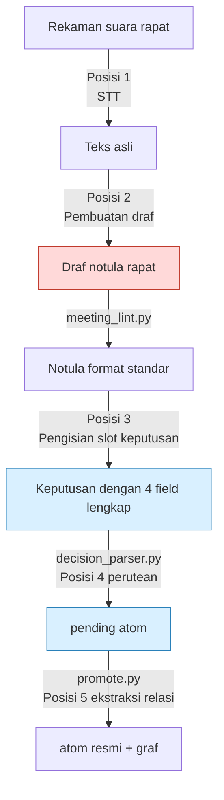
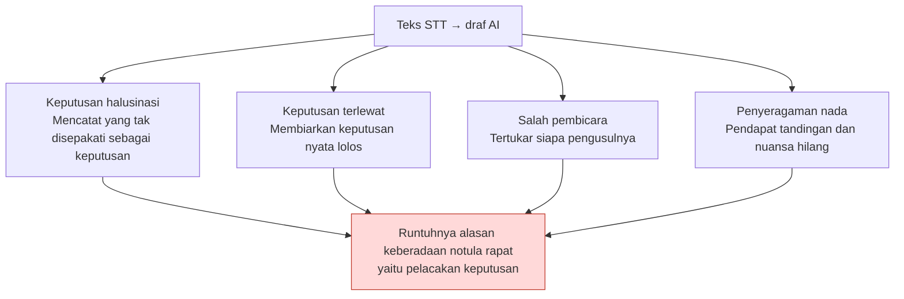

# 17.4 Dari Notula Rapat Menjadi Basis Data Keputusan — Lima Titik Otomatisasi AI

> Saat makan siang, tiga hari sebelum demo milestone, seorang Game Designer menaruh nampannya dan bertanya, "Soal menaikkan reward gold quest jadi 1.5 kali lipat itu — itu memang diputuskan di rapat, kan? Boleh saya masukkan ke sheet data?" Rekan di sebelahnya menjawab, "Bukannya itu cuma usulan supaya kita coba dulu, ya?" File rekaman berdurasi 90 menit dan dua halaman memo yang diketik seseorang jelas-jelas ada. Namun catatan itu memuat "apa yang dibicarakan", tetapi tidak memuat "apa yang diputuskan, siapa yang bertanggung jawab, dan mengapa demikian".

Ketika 17 dokumen R&D perusahaan saya urutkan berdasarkan tingkat rasa sakitnya, yang menempati porsi terbesar adalah proposal perbaikan notula rapat. Itu di luar dugaan. Bukan balancing combat, bukan pula pipeline produksi konten. Titik paling menyakitkan hanyalah satu: keputusan yang diambil dalam rapat tidak menyebar sampai ke eksekusi.

Maka saya merancang ulang sistem notula rapat menjadi basis data pelacak keputusan (decision tracking database), lalu memverifikasi langsung selama enam bulan di mana dalam alur itu AI sebaiknya diselipkan dan di mana tidak. Bab ini adalah peta dari kelima titik tersebut.

---

## 17.4.1 Lima Titik Tempat Otomatisasi AI Bisa Masuk

Mulai dari file rekaman hingga pembaruan graf pengambilan keputusan, di sepanjang pipeline notula rapat terdapat tepat lima posisi yang bisa diisi asisten AI. Kelimanya tidak diselipkan sekaligus secara bersamaan. Sebab setiap posisi memiliki tingkat kematangan dan risiko kesalahan berpikir yang berbeda.



Merah (Posisi 2) adalah posisi yang paling menarik sekaligus paling berbahaya, sedangkan biru (Posisi 3·4) adalah posisi aman yang paling awal saya adopsi. `meeting_lint.py` → `decision_parser.py` → `promote.py` di tengah pipeline bukanlah AI, melainkan skrip deterministik. AI hanya masuk ke "celah yang membutuhkan penilaian" di antara kerangka deterministik ini.

Jika sifat setiap titik diringkas dalam satu baris, hasilnya seperti ini.

- **Posisi 1 (STT, Speech-to-Text, suara→teks)**: suara → teks. Kematangan tertinggi, risiko terendah.
- **Posisi 2 (pembuatan draf)**: teks → draf notula rapat. Daya tarik tertinggi, risiko tertinggi.
- **Posisi 3 (pengisian slot keputusan)**: mengisi dasar pertimbangan dan dampak pada keputusan yang dinyatakan manusia. Peringkat 1 untuk ROI (Return on Investment, hasil dibanding investasi).
- **Posisi 4 (perutean atom)**: merekomendasikan ke folder mana keputusan dikirim.
- **Posisi 5 (ekstraksi relasi)**: menyimpulkan relasi ketergantungan antar-atom secara otomatis. Paling rentan terhadap non-determinisme.

---

## 17.4.2 Kerangka Deterministik — Membuat Lebih Dulu Celah agar AI Bisa Menyela

Sebelum membicarakan otomatisasi AI, kita harus lebih dulu melihat kerangka skrip yang bukan AI. Sebab inti dari notula rapat yang menjadi basis data keputusan bukanlah LLM, melainkan tiga skrip Python kecil.

Notula rapat berformat standar memiliki blok keputusan di bagian akhir. Setiap keputusan dalam blok itu mewajibkan empat field.

```markdown
## Decisions

D1:
  decision: Menyeragamkan global cooldown combat menjadi 0.5 detik
  owner: teammate_a
  rationale: Pada uji rangkaian skill, 0.3 detik sering menyebabkan input terlewat (badan notula 14:22)
  follow_up: Terapkan GCD 0.5 di sheet desain combo, paling lambat 6/13
```

Blok ini dibaca oleh `decision_parser.py`. Cara kerjanya sederhana — jika salah satu dari empat field kosong, ia menandai dan melaporkan `[MISSING]`. Khususnya jika `owner` tidak ada, keputusan itu adalah "keputusan yang tidak dipertanggungjawabkan siapa pun", yaitu keputusan yang tidak akan dieksekusi, sehingga itulah yang paling kuat dicegah.

```
$ python decision_parser.py 2026-06-06_combat-sync.md

D1: OK   (owner=teammate_a)
D2: [MISSING owner]  "Tinjau pengecualian GCD untuk skill penyembuh" — tanpa owner, promosi diblokir
D3: [MISSING rationale]  field dasar pertimbangan kosong, peringatan
```

D2 yang ditandai `[MISSING owner]` bahkan tidak bisa masuk ke folder `pending`. Sampai manusia mengisi owner-nya, D2 tidak diperlakukan sebagai keputusan. Inilah perangkat yang secara struktural mencegah "sudah rapat, tetapi tidak ada yang bergerak".

Keputusan yang lolos dijadikan `pending atom` oleh `promote.py`, dan ketika manusia menyetujuinya pada gerbang tinjauan mingguan, keputusan itu dipromosikan menjadi atom resmi. Prinsip yang berlaku di sini adalah atom `decision_summary_not_clickup_mirror` (§17.1.2). Papan tugas (task board) melacak "apa yang akan dikerjakan", sedangkan basis data keputusan melacak "mengapa diputuskan demikian". Jika keduanya dicampur, keduanya rusak.

Ketiga skrip inilah kerangkanya, dan AI adalah asisten yang mengisi bagian kosong dari kerangka ini. Jika urutannya terbalik — jika AI yang membuat kerangkanya — halusinasi akan meruntuhkan kepercayaan terhadap basis data keputusan itu sendiri.

---

## 17.4.3 Posisi Paling Berbahaya — Mengapa Posisi 2 Ditaruh Paling Akhir

Posisi 2 (teks STT → pembuatan otomatis draf notula rapat) adalah posisi yang paling ingin dikerjakan lebih dulu oleh setiap tim. Sebab gambaran "tinggal lempar rekaman, notula rapat keluar" terlalu menarik. Dan justru karena daya tarik itulah, posisi ini gagal dengan biaya paling mahal.

Bentuk kegagalannya ada empat.



Yang paling fatal di antaranya adalah keputusan halusinasi. Dalam rapat seseorang hanya melontarkan pendapat, "Bukankah global cooldown lebih baik 0.5 detik?", tetapi draf AI menuliskannya menjadi "disepakati global cooldown 0.5 detik". Tiga minggu kemudian satu baris ini diterapkan ke sheet data, desain combo bertumpuk di atasnya, dan kasus QA disusun. Keputusan yang tidak pernah disepakati menyebar secara tidak dapat dibalik (irreversible).

Karena itu di Posisi 2 berlaku prinsip mutlak.

- Draf AI **selalu** melewati tinjauan fasilitator. Commit otomatis tidak ada dalam keadaan apa pun.
- Slot keputusan **tidak diisi** oleh AI. AI hanya meringkas agenda dan pernyataan, sedangkan keberadaan keputusan dinyatakan oleh manusia.
- Teks STT asli **disimpan permanen secara terpisah** dari ringkasan. Jika hanya ringkasan yang disimpan, ketika dasar pertimbangan menjadi kabur, verifikasi terhadap sumber asli menjadi mustahil.

Ini bukan berarti Posisi 2 "tidak akan pernah dilakukan". Setelah Posisi 3·4·1 stabil dan fasilitator merasakan sendiri batas keluaran AI, nilai adopsi Posisi 2 cukup besar. Hanya saja **urutannya paling akhir**.

---

## 17.4.4 Posisi 3 — Mengapa Pengisian Slot Keputusan Menjadi Peringkat 1 ROI

Di sinilah posisi yang memberi efek terbesar dalam enam bulan operasional. Manusia menyatakan keberadaan keputusan, lalu AI mengisi field-field pelengkap dari keputusan itu. Perbedaan menentukan dengan Posisi 2 adalah **manusia lebih dulu memaku fakta bahwa keputusan itu ada**.

Tiga hal yang terlalu memakan waktu jika diisi sendiri secara manual, itulah yang dibuat drafnya oleh AI.

- **rationale**: mengutip pernyataan yang menjadi dasar pertimbangan keputusan dari badan notula rapat
- **affected_atoms**: merekomendasikan kandidat sistem·sheet data yang terdampak
- **follow_up**: kandidat tindak lanjut yang berasal dari keputusan

Intinya terletak pada prompt yang **mewajibkan pengutipan dasar pertimbangan dan secara eksplisit melarang halusinasi**. Berikut adalah teks lengkap prompt pengisian yang benar-benar saya jalankan operasionalnya.

### Worked Transcript (rekaman sesi nyata) — Pengisian Slot Keputusan

**Prompt (dimasukkan oleh manusia):**

```
Lihat badan notula rapat di bawah, lalu isi hanya empat kolom
owner / rationale / affected_atoms / follow_up untuk keputusan D1
("seragamkan global cooldown combat jadi 0.5 detik") yang dinyatakan fasilitator.
Jangan membuat keputusan baru. Untuk rationale, kutip pernyataan badan notula
beserta timestamp persis seperti aslinya, dan untuk kolom yang tak punya dasar,
jangan menebak — tulis "tanpa dasar".
// (maksud: affected_atoms hanya sistem·sheet yang disebut di badan notula, maksimal 3)

[Badan Notula Rapat]
(14:18) teammate_a: GCD sekarang 0.3 detik, tapi waktu skill ditekan beruntun, input sering ketelan.
(14:22) teammate_b: Kemarin di uji combo juga, 0.3 detik bikin skill kedua nggak keluar
        di sekitar 30 persen kasus. Saya sudah simpan log-nya.
(14:25) teammate_a: Kalau begitu kita naikkan ke 0.5 detik. Saya yang akan terapkan ke sheet combo.
(14:26) fasilitator: Kita pakai 0.5 detik. Diputuskan.
(14:31) teammate_c: Skill penyembuh kalau kena GCD jadi nggak bisa dipakai saat genting, itu bagaimana...
(14:33) fasilitator: Yang itu kita lihat terpisah lain kali.
```

**Keluaran Claude (mentah apa adanya):**

```
1. owner: teammate_a
   dasar: (14:25) "Saya yang akan terapkan ke sheet combo." — teammate_a
   menyatakan tanggung jawab atas dirinya sendiri.

2. rationale:
   - (14:18) teammate_a: "Pada GCD 0.3 detik, input ketelan saat skill ditekan beruntun"
   - (14:22) teammate_b: "Di uji combo, 0.3 detik membuat skill kedua tidak aktif
     pada sekitar 30% kasus, log tersedia"
   → Masalah input terlewat pada 0.3 detik adalah dasar langsung keputusan 0.5 detik.

3. affected_atoms (kandidat berdasarkan penyebutan di badan notula):
   - atoms/combat/global_cooldown
   - Sheet desain combo (disebut "sheet combo" pada badan notula 14:25)
   - atoms/combat/skill_recovery  ← namun, pada (14:31) pembahasan
     pengecualian GCD untuk skill penyembuh "ditunda ke lain waktu" (14:33).
     Tidak pasti apakah harus disertakan ke dalam ruang lingkup dampak keputusan ini.
     Dasar lemah, perlu konfirmasi manusia.

4. follow_up:
   - teammate_a: Terapkan GCD 0.5 detik ke sheet desain combo
   - [agenda terpisah] Soal pengecualian GCD skill penyembuh berada di luar
     ruang lingkup keputusan ini, dipisahkan menjadi agenda rapat berikutnya (pernyataan fasilitator 14:33)
```

**Verifikasi/penolakan manusia:**

Fasilitator meninjau keluaran tersebut. owner dan rationale dikutip secara akurat sehingga langsung diterima apa adanya. Kandidat ketiga `skill_recovery` pada `affected_atoms` dilaporkan AI sendiri sebagai "dasar lemah, perlu konfirmasi manusia", dan atas penilaian fasilitator hal itu **dikeluarkan** dari ruang lingkup dampak keputusan ini — pengecualian skill penyembuh adalah perkara yang akan menjadi keputusan terpisah, bukan dampak D1 kali ini. Usulan "pisahkan menjadi agenda terpisah" pada follow_up diterima dan didaftarkan sebagai agenda rapat berikutnya.

Yang penting di sini adalah AI tidak memaksakan butir yang tidak pasti sebagai halusinasi, melainkan **melaporkan sendiri ketidakpastiannya**. Batasan prompt "dilarang menebak·berhalusinasi, jika tanpa dasar nyatakan tanpa dasar" itulah yang menghasilkan keluaran yang jujur ini. Jika batasan itu dilepas, AI dengan percaya diri akan memasukkan `skill_recovery` ke dalam affected_atoms, dan halusinasi itu menyebar ke dalam graf.

Blok keputusan yang selesai ditinjau lolos `decision_parser.py` dan — karena keempat field telah terisi sehingga tanpa `[MISSING]` — diteruskan menjadi `pending atom`.

---

## 17.4.5 Posisi 4 — Perutean atom dan Posisi 5 — Ekstraksi Relasi

Ketika pending atom yang lolos Posisi 3 dipromosikan ke folder resmi, AI merekomendasikan ke folder mana atom itu dikirim (Posisi 4).

```
Pilih hingga 3 folder berdasarkan prioritas, tempat yang paling cocok untuk
menaruh atom ini ("seragamkan global cooldown combat 0.5 detik / owner teammate_a")
di antara folder di bawah. Jangan mengusulkan pembuatan folder baru,
hanya dari dalam daftar ini.
- atoms/combat/  atoms/character/  atoms/operations/  atoms/visual/
```

"Dilarang membuat folder baru" adalah batasan intinya. Jika ini dilepas, AI akan terus-menerus mengusulkan folder seperti `atoms/combat_timing/`, `atoms/gcd_rules/`, dan kategori berbiak tak terbatas sehingga pencarian dan injeksi otomatis runtuh. Prinsipnya adalah menjaga kategori tetap kecil dan ortogonal serta tidak berubah selama lebih dari satu tahun. AI hanya memilih dari dalam daftar tertutup itu.

Posisi 5 (ekstraksi relasi antar-atom) diadopsi paling akhir dan paling hati-hati. Ini posisi yang menyimpulkan relasi ketergantungan di antara atom-atom yang telah dipromosikan.

```
atom baru A: "Skill penyembuh dikecualikan dari penerapan global cooldown"
atom lama B: "Global cooldown diseragamkan 0.5 detik"

Relasi yang disimpulkan:
  A.exception_of: [B]
  A.derives_from: [B]
  B.affects: [A]   ← arah balik otomatis diberikan
```

Masalahnya, penyimpulan ini terpapar langsung pada non-determinisme LLM. Dari input yang sama, relasi yang muncul kemarin dan hari ini bisa berbeda. Perangkat mitigasinya ada tiga — `temperature=0` dan penguncian seed pada model yang memungkinkan, gerbang tinjauan tempat AI menyajikan kandidat lalu manusia menyetujui, serta cara mengekstraksi hanya satu arah lalu arah baliknya dikoreksi skrip secara deterministik. Sebab jika kedua arah sama-sama diserahkan ke LLM, salah satu sisi akan terlewat.

---

## 17.4.6 Satu hingga Dua Sekaligus — Urutan Adopsi Itulah Perangkat Pengaman

Menyalakan kelima titik sekaligus adalah kegagalan yang paling umum sekaligus paling mahal. Beban operasional tiba lebih dulu daripada efeknya, sehingga tim membuang sistem itu secara keseluruhan. Berikut adalah urutan yang benar-benar saya ikuti.

<svg viewBox="0 0 720 240" xmlns="http://www.w3.org/2000/svg" font-family="sans-serif" font-size="13">
  <line x1="40" y1="40" x2="40" y2="210" stroke="#999" stroke-width="2"/>
  <!-- step 1 -->
  <circle cx="40" cy="50" r="7" fill="#2980b9"/>
  <text x="60" y="48" font-weight="bold">Tahap 1 · Posisi 3 Pengisian Slot Keputusan</text>
  <text x="60" y="66" fill="#666">1~2 bulan · Mulai dari ROI peringkat 1, risiko terendah</text>
  <!-- step 2 -->
  <circle cx="40" cy="95" r="7" fill="#2980b9"/>
  <text x="60" y="93" font-weight="bold">Tahap 2 · Posisi 4 Rekomendasi Perutean atom</text>
  <text x="60" y="111" fill="#666">Tambah 1 bulan · Paksakan daftar kandidat folder tertutup</text>
  <!-- step 3 -->
  <circle cx="40" cy="140" r="7" fill="#27ae60"/>
  <text x="60" y="138" font-weight="bold">Tahap 3 · Posisi 1 STT</text>
  <text x="60" y="156" fill="#666">Saat infrastruktur self-hosting mapan · Hindari API eksternal demi keamanan</text>
  <!-- step 4 -->
  <circle cx="40" cy="185" r="7" fill="#c0392b"/>
  <text x="60" y="183" font-weight="bold">Tahap 4 · Posisi 2 Draf Notula Rapat</text>
  <text x="60" y="201" fill="#666">Setelah 3 di atas stabil, paling hati-hati · Commit otomatis dilarang mutlak</text>
  <!-- step 5 -->
  <circle cx="40" cy="225" r="7" fill="#8e44ad"/>
  <text x="60" y="223" font-weight="bold">Tahap 5 · Posisi 5 Ekstraksi Relasi</text>
</svg>

Menaruh Posisi 2 paling akhir adalah inti dari urutan ini. Posisi yang paling ingin dikerjakan justru dilakukan paling belakangan — bertentangan dengan intuisi, tetapi menempatkan tangan yang paling terlatih di meja tinjauan yang paling berbahaya adalah prinsip keselamatan tempat kerja.

Dari sisi biaya pun urutan ini masuk akal. Dengan acuan 100 rapat/bulan, Posisi 3 sekitar $5\~10 dan Posisi 4 di kisaran $1\~2 (perkiraan berdasarkan lingkungan operasional penulis, belum terverifikasi), sehingga **menyalakan keduanya saja masih di bawah $10 per bulan**. Dua posisi yang memberi efek terbesar justru paling murah.

---

## 17.4.7 before / after — Rapat yang Sama, Dua Notula Rapat

Perbedaan ketika rapat yang sama dicatat dengan dua cara adalah ringkasan dari keseluruhan bab ini.

**Before — Notula rapat narasi bebas (tanpa AI, atau ketika Posisi 2 sampai diserahi pengisian slot keputusan):**

```markdown
## 2026-06-06 Rapat Sinkronisasi Combat

Membahas soal GCD. Muncul pendapat bahwa 0.3 detik terlalu pendek.
Katanya ada masalah di uji combo. Muncul pembicaraan soal 0.5 detik.
Pengecualian skill penyembuh juga sempat disinggung.
Suasananya cenderung mengarah ke 0.5 detik.
```

Tiga minggu kemudian, jika notula rapat ini dibuka kembali, **tidak ada seorang pun yang bisa memulihkan** apakah "suasana mengarah ke 0.5 detik" itu keputusan atau pendapat, siapa yang sepakat menerapkannya ke sheet, dan apakah pengecualian skill penyembuh sudah diputuskan atau ditunda. Tidak ada pembicara, tidak ada owner, dan dasar pertimbangannya pun ada di suatu tempat dalam badan notula sehingga rekaman harus didengar ulang.

**After — Notula rapat dengan slot keputusan + pengisian Posisi 3:**

```markdown
## 2026-06-06 Rapat Sinkronisasi Combat

### Ringkasan Agenda (bantuan AI)
- Masalah input terlewat pada global cooldown (GCD) combat 0.3 detik
- Soal pengecualian GCD untuk skill penyembuh (dipisahkan menjadi agenda terpisah)

### Decisions  (dinyatakan manusia + diisi AI)
D1:
  decision: Menyeragamkan global cooldown combat menjadi 0.5 detik
  owner: teammate_a
  rationale: |
    - (14:18) teammate_a: pada 0.3 detik, input ketelan saat skill ditekan beruntun
    - (14:22) teammate_b: uji combo 0.3 detik skill kedua tidak aktif ~30%, log tersedia
  follow_up: teammate_a — terapkan GCD 0.5 detik ke sheet desain combo (paling lambat 6/13)
  affected_atoms: [atoms/combat/global_cooldown, sheet desain combo]

### Agenda yang Dipisahkan
- Pengecualian GCD skill penyembuh → rapat berikutnya (keputusan fasilitator 14:33)
```

Tiga minggu kemudian notula rapat ini telah dibaca `decision_parser.py` dan terhubung ke graf, dan siapa pun yang bertanya "mengapa 0.5 detik" bisa langsung dijawab dengan kutipan dua baris pada rationale. Karena owner dinyatakan eksplisit, apakah follow_up sudah dieksekusi pun terlacak, dan bahkan fakta bahwa pengecualian skill penyembuh **bukan keputusan, melainkan agenda yang ditunda** ikut terjaga.

Yang membuat perbedaan bukanlah banyaknya kontribusi AI, melainkan **struktur yang menjaga tetap utuhnya posisi tempat manusia menyatakan keputusan, sambil hanya menyerahkan pengisian dasar pertimbangan kepada AI**. Pada notula After di atas, jika seluruh paragraf yang diisi AI (ringkasan agenda, kutipan rationale, kandidat affected_atoms) dihapus, yang tersisa hanyalah satu baris keputusan dan owner — lebih dari separuh volume informasi notula rapat berasal dari pengisian AI, tetapi intinya adalah bahwa separuh itu semuanya merupakan kutipan dasar pertimbangan yang telah lolos tinjauan manusia.

---

## Poin-Poin Penting

- Bangun lebih dulu kerangka deterministik notula rapat (meeting_lint → decision_parser → promote), lalu AI hanya mengisi bagian kosong di celahnya.
- Keberadaan keputusan dinyatakan manusia dan AI hanya mengisi dasar pertimbangan·owner·dampak — pembuatan otomatis keputusan pada Posisi 2 mengundang halusinasi yang tidak dapat dibalik.
- Jangan menyalakan kelima titik sekaligus; mulai dari Posisi 3·4 dengan satu hingga dua sekaligus, dan adopsi Posisi 2 yang paling menarik itu paling belakangan.

---

> **Penerapan di Luar Game.** Prinsip "keberadaan keputusan dinyatakan manusia, dan AI hanya mengisi dasar pertimbangan·penanggung jawab·dampak" adalah garis pengaman yang berlaku apa adanya bukan untuk game, melainkan untuk setiap pekerja kantoran yang merapikan rekaman dengan AI. Alasan posisi yang paling menarik (membuat otomatis notula rapat dari rekaman utuh sekaligus) justru paling berbahaya adalah karena halusinasi AI yang menyulap pendapat "bukankah lebih baik 0.5 detik" menjadi keputusan "disepakati 0.5 detik". Misalnya ketika tim HR merapikan rekaman rapat penilaian, biarkan hanya keputusan "ditetapkan grade B" yang dipaku langsung oleh fasilitator, dan kepada AI hanya minta "kutipkan pernyataan dasar untuk grade ini dari rekaman, kalau tidak ada bilang tidak ada". Jika keputusan dibiarkan dibuat AI, penilaian yang tidak pernah disepakati akan tertinggal secara tidak dapat dibalik dalam catatan kepegawaian.

---

## Coba Sendiri

**setup**
1. Buatlah blok `## Decisions` pada format standar notula rapat dan wajibkan 4 field `decision / owner / rationale / follow_up` pada setiap keputusan.
2. Tulislah `decision_parser.py` — jika salah satu dari 4 field kosong, ia mencetak `[MISSING <field>]`, dan khususnya jika `owner` kosong, ia memblokir promosi.
3. Bakukan aturan (`decision_summary_not_clickup_mirror`) bahwa ringkasan keputusan bukanlah cermin dari papan tugas, melainkan aset independen yang memuat "mengapa".

**prompt**
4. Tulislah prompt pengisian Posisi 3. Batasan yang wajib disertakan: "Jangan membuat keputusan baru / kutip dasar dari badan notula beserta timestamp / jika tanpa dasar nyatakan 'tanpa dasar' / dilarang menebak·berhalusinasi". Mintalah empat slot rationale·owner·affected_atoms·follow_up.
5. Pada prompt perutean Posisi 4, sertakan "dilarang membuat folder baru di luar daftar + daftar folder tertutup".

**verify**
6. Jalankan blok keputusan yang telah diisi melalui `decision_parser.py` dan pastikan tidak ada `[MISSING]`.
7. Mintalah manusia meninjau langsung butir bertanda "dasar lemah" di antara affected_atoms yang diisi AI untuk dikeluarkan/diterima. Commit otomatis tidak dilakukan dalam keadaan apa pun.

**Versi Ringkas Solo**
Jika Anda bekerja sendirian atau tidak punya waktu memasang perkakas, tanpa skrip pun tuliskan saja dengan tangan empat baris blok keputusan (`keputusan / penanggung jawab / dasar / tindakan berikutnya`) di akhir notula rapat. Bahkan jika owner-nya adalah diri Anda sendiri, tetap tuliskan namanya. Kepada AI cukup minta, "Kutipkan dasar keputusan ini dari memo rapat, kalau tidak ada bilang tidak ada". Tanpa pipeline pun, hanya dengan dua hal — **posisi tempat keputusan dinyatakan dan prompt yang mewajibkan pengutipan dasar** — notula rapat mulai menjadi basis data keputusan.
