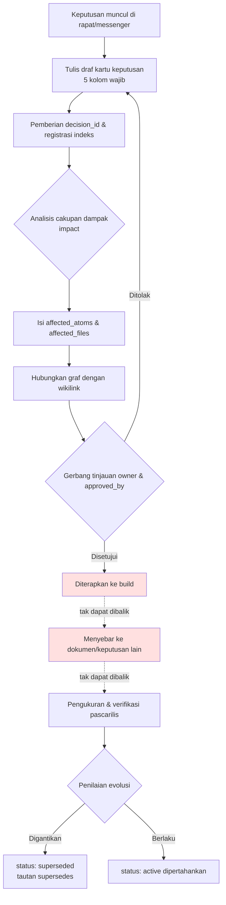

# 18.1 Sistem Pelacakan Keputusan

Saat itu di tengah rapat kuartalan. Desainer combat mengusulkan, "Mari kita seragamkan global cooldown menjadi 0.5 detik," dan semua orang mengangguk setuju. Namun seorang senior di sebelah mengangkat tangan. "Bukankah ini bertabrakan dengan keputusan kuartal keempat tahun lalu yang menetapkan 0.3 detik? Waktu itu kenapa kita pilih 0.3 detik?" Ruang rapat sejenak hening. Tidak ada yang ingat alasan keputusan itu. Kami mengaduk-aduk notula rapat, tetapi hanya ada satu baris: "Dibahas di TF Combat." Akhirnya kami menghabiskan 30 menit untuk merekonstruksi keputusan tahun lalu, dan toh "kenapa 0.3" tetap tidak pernah ketemu.

Keputusan lebih sulit dilacak daripada dibuat. Ketika ratusan keputusan menumpuk dalam setahun, kepala manusia tidak mampu mengejar mana keputusan yang masih hidup dan mana yang sudah dibuang, serta mana keputusan yang berpijak pada keputusan lain sebagai prasyarat. Bab ini membahas sistem yang mengunci keputusan menjadi atom sehingga ia berubah menjadi aset yang dapat dilacak. Intinya sederhana. Catat satu keputusan sebagai kartu yang memiliki `decision_id`, `owner`, dan `rationale`; hubungkan kartu satu sama lain dengan wikilink untuk membentuk graf; lalu telusuri balik sejauh mana dampaknya menjalar dengan grep.

## 18.1.1 Kartu Keputusan: Dikunci Menjadi atom

Unit terkecil pelacakan keputusan adalah kartu keputusan (decision card). Saya mengambil apa adanya satu kartu yang benar-benar dipakai di Proyek A (pengembangan MMORPG) yang saya kelola. Inilah keputusan penyeragaman 0.5 detik yang persis bertabrakan di rapat tadi.

```yaml
---
decision_id: D2026_Q2_017
title: Penyeragaman Global Cooldown Combat 0.5 detik
type: system_change
status: active        # active / superseded / deprecated
created: 2026-04-18
owner: teammate_a      # Desainer combat, pengusul & pemilik keputusan
approved_by: 이민수    # Design Director
approval_meeting: 95_BattleTF_2026-04-18

scope:
  - combat_system
  - all_active_skills

content: |
  Terapkan global cooldown 0.5 detik pada semua skill aktif combat.
  Skill pemulihan dikecualikan (keputusan terpisah D2026_Q2_018).

rationale:
  - Masalah keterbacaan input combo (akumulasi umpan balik pengguna)
  - Arah memperpanjang durasi rata-rata combat pada simulasi
  - Memperlandai kurva belajar pengguna baru

affected_atoms:
  - combat_global_cooldown_constant
  - combat_skill_cooldown_rule

affected_files:
  - CombatBalance.xlsx
  - CombatFormula_v3.md
  - UI/skill_cooldown_indicator

implementation:
  target_build: 2026-05-09
  impl_owner: teammate_b    # Lead code
  qa_owner: teammate_c      # Senior QA

related_decisions:
  - supersedes: D2025_Q4_034   # Keputusan 0.3 detik sebelumnya
  - relates_to: D2026_Q2_018   # Pengecualian pemulihan
---
```

Tiga kolom adalah tulang punggungnya. `decision_id` memberi alamat permanen kepada keputusan. `owner` memakukan "siapa yang bertanggung jawab atas keputusan ini." `rationale` menjawab pertanyaan "kenapa dulu begitu?" enam bulan kemudian. Jawaban atas "kenapa 0.3 dulu" yang tidak ketemu di rapat itu seharusnya justru ada di kolom `rationale` milik `D2025_Q4_034`. Kolom sisanya (`scope`, `affected_atoms`, `related_decisions`) adalah pengabelan untuk pelacakan dampak dan penghubungan graf.

Di sinilah satu desain keputusan masuk. Jika 12 kolom dipaksakan semuanya, orang-orang justru menghindari pengisian kartu itu sendiri. Maka kami membaginya menjadi 5 kolom wajib (`decision_id`, `title`, `owner`, `status`, `rationale`) dan 7 kolom opsional. Mengisi 5 kolom saja tepat setelah keputusan diambil di rapat sudah membuat kartu itu hidup, sedangkan sisanya diisi pada tahap implementasi.

## 18.1.2 Alur Keseluruhan Pelacakan Keputusan

Jalur yang dilalui satu kartu sejak kemunculan hingga pembuangannya adalah kerangka sistem pelacakan. Perhatikan di mana letak gerbang yang tidak dapat dibalik.



Mulai dari penulisan draf (B) hingga gerbang tinjauan (G), seluruhnya adalah tahap yang dapat dibalik. Mau memperbaiki atau membuang kartu, biayanya hampir nol. Namun, setelah penerapan ke build (H) praktis tidak dapat dibalik. Perubahan yang sudah dirasakan pengguna meninggalkan jejak pada persepsi komunitas meskipun dikembalikan lewat hotfix, dan begitu keputusan-keputusan lanjutan mulai menumpuk dengan berpijak pada keputusan ini sebagai prasyarat, biaya pengembaliannya membengkak secara eksponensial. Karena itu, seluruh tinjauan pengambil keputusan harus tuntas di gerbang G. Ini persis struktur yang sama dengan prinsip "perekaman dan casting adalah tahap yang tidak dapat dibalik" yang dibahas di Bagian 5.

## 18.1.3 Graf Keputusan: Menyambung Kartu

Begitu kartu dijadikan atom, kartu satu sama lain bisa dihubungkan. `supersedes` dan `relates_to` pada `related_decisions` menjadi sisi (edge) graf. Tabrakan pada rapat tadi sebenarnya hanya satu potongan dari graf ini.

<svg viewBox="0 0 640 280" xmlns="http://www.w3.org/2000/svg" font-family="sans-serif" font-size="13">
  <defs>
    <marker id="arrow" markerWidth="10" markerHeight="10" refX="9" refY="3" orient="auto" markerUnits="strokeWidth">
      <path d="M0,0 L9,3 L0,6 Z" fill="#555"/>
    </marker>
  </defs>
  <!-- nodes -->
  <rect x="40" y="20" width="220" height="48" rx="6" fill="#eef2f8" stroke="#888"/>
  <text x="150" y="40" text-anchor="middle" fill="#333">D2025_Q4_034</text>
  <text x="150" y="58" text-anchor="middle" fill="#777" font-size="11">Global cooldown 0.3 detik (deprecated)</text>

  <rect x="40" y="116" width="220" height="48" rx="6" fill="#dff0df" stroke="#5a5"/>
  <text x="150" y="136" text-anchor="middle" fill="#333">D2026_Q2_017</text>
  <text x="150" y="154" text-anchor="middle" fill="#777" font-size="11">Global cooldown 0.5 detik (active)</text>

  <rect x="380" y="116" width="220" height="48" rx="6" fill="#dff0df" stroke="#5a5"/>
  <text x="490" y="136" text-anchor="middle" fill="#333">D2026_Q2_018</text>
  <text x="490" y="154" text-anchor="middle" fill="#777" font-size="11">Pengecualian cooldown skill pemulihan (active)</text>

  <rect x="380" y="212" width="220" height="48" rx="6" fill="#fdf3df" stroke="#cb5"/>
  <text x="490" y="232" text-anchor="middle" fill="#333">D2026_Q2_025</text>
  <text x="490" y="250" text-anchor="middle" fill="#777" font-size="11">Varian global cooldown PvP (active)</text>

  <!-- edges -->
  <line x1="150" y1="68" x2="150" y2="116" stroke="#555" marker-end="url(#arrow)"/>
  <text x="160" y="96" fill="#555" font-size="11">supersedes</text>

  <line x1="260" y1="140" x2="380" y2="140" stroke="#555" marker-end="url(#arrow)"/>
  <text x="285" y="132" fill="#555" font-size="11">relates_to</text>

  <line x1="490" y1="164" x2="490" y2="212" stroke="#555" marker-end="url(#arrow)"/>
  <text x="500" y="192" fill="#555" font-size="11">relates_to</text>
</svg>

Andai graf ini ada, rapat itu akan selesai dalam 30 detik. Begitu `D2026_Q2_017` dibuka, terlihat `supersedes: D2025_Q4_034`, dan satu klik pada `rationale` kartu tersebut langsung memunculkan "kenapa 0.3 dulu". Graf adalah riwayat evolusi keputusan, dan riwayat evolusi keputusan tak lain adalah sejarah game itu sendiri. Bahkan cabang yang lahir dari keputusan inti, seperti varian PvP (`D2026_Q2_025`), pun terlacak dalam sekali pandang.

## 18.1.4 Mengekstraksi Cakupan Dampak Secara Otomatis — impact

Jika `affected_atoms` dan `affected_files` pada kartu keputusan diisi satu per satu oleh manusia, pasti ada yang terlewat. Proyek A memiliki prosedur ekstraksi cakupan dampak bernama `impact`. Ia menerima atom keputusan, lalu menyusuri graf ke tiga arah.

- **Sisi masuk (inbound edge)**: atom-atom lain yang merujuk atom ini (siapa yang bergantung padaku)
- **Tautan `affects` ontologi**: relasi yang dideklarasikan secara eksplisit "memberi dampak"
- **Referensi balik wikilink**: semua dokumen yang mengutip `[[combat_global_cooldown_constant]]` di dalam isinya

Gabungan dari ketiga jalur itulah cakupan dampak sejati dari sebuah keputusan. Selain itu, atom `portal_layer_change_impact_check` memeriksa secara terpisah apakah keputusan "menyentuh portal layer (dokumen yang terekspos ke luar & spesifikasi API)". Jika portal layer terlibat, peringkatnya naik satu tingkat. Sebab penyebaran ke luar lebih mahal untuk dikembalikan.

## 18.1.5 Worked Transcript: Dari Notula Rapat hingga Kartu Keputusan

Teorinya sampai di sini. Saya muat apa adanya seluruh proses ketika benar-benar melemparkan satu bongkah notula rapat ke LLM dan menerima kartu keputusan, lengkap dengan prompt utuh dan keluaran mentahnya. Saya tidak meringkasnya. Titik tempat Claude kebingungan, titik tempat manusia menolak, hingga permintaan ulang, semuanya saya tampilkan.

### Prompt pertama (utuh)

```
Ubah notula rapat di bawah ini menjadi kartu keputusan YAML. Skemanya adalah
decision_id / title / type / status / owner / approved_by / scope /
content / rationale / affected_atoms / affected_files / related_decisions.
owner adalah pengusul, approved_by adalah pemberi persetujuan. affected_atoms dan related_decisions
tulis hanya yang benar-benar muncul di notula, jangan menebak.
// (maksud: decision_id berformat D{YYYY}_Q{n}_{seq}, jika seq tidak diketahui pakai XXX)

[Notula rapat]
- Diputuskan menyeragamkan global cooldown combat menjadi 0.5 detik (diusulkan teammate_a).
  Saat ini berbeda-beda tiap skill, dengan akumulasi umpan balik bahwa keterbacaan combo buruk.
- Ada catatan bahwa 0.3 detik tahun lalu terlalu cepat sehingga combo jadi rusak.
- Skill pemulihan jika diterapkan 0.5 detik membuat respons darurat tidak sempat. Perlu penanganan pengecualian.
- Disetujui Director (이민수). teammate_b mengimplementasi, teammate_c menangani QA.
- target build adalah 9 Mei.
```

### Keluaran pertama Claude (mentah apa adanya)

```yaml
---
decision_id: D2026_Q2_XXX
title: Penyeragaman Global Cooldown Combat 0.5 detik
type: system_change
status: active
owner: teammate_a
approved_by: 이민수
approval_meeting: 95_BattleTF
scope:
  - combat_system
  - all_skills          # ← Ada pengecualian skill pemulihan, tetapi malah ditangkap sebagai all_skills
content: |
  Terapkan global cooldown 0.5 detik pada semua skill combat.
rationale:
  - Akumulasi umpan balik keterbacaan combo
  - 0.3 detik tahun lalu terlalu cepat sehingga combo rusak
affected_atoms:
  - combat_global_cooldown      # ← Berbeda dari nama atom asli. Hasil tebakan
affected_files: []              # ← Dikosongkan. Tidak disebutkan di notula
implementation:
  target_build: 2026-05-09
  impl_owner: teammate_b
  qa_owner: teammate_c
related_decisions:
  - supersedes: D2025_Q4_XXX    # Keputusan 0.3 detik tahun lalu. seq tidak diketahui
  - relates_to: Keputusan pengecualian skill pemulihan (ID belum ditentukan)  # ← Diisi sebagai deskripsi, bukan tautan
---
```

Jika dilihat tanpa membohongi diri, keluaran ini bernilai 60 poin. Yang benar dan yang salah bercampur.

- **Benar**: pembedaan `owner`/`approved_by` akurat, `target_build`, pengimplementasi, dan QA akurat, relasi `supersedes` tertangkap.
- **Salah ①**: memasukkan `all_skills` ke `scope`. Pengecualian skill pemulihan sudah dinyatakan eksplisit, tetapi malah ditangkap sebagai keseluruhan.
- **Salah ②**: menebak `combat_global_cooldown` lalu memasukkannya ke `affected_atoms`. Nama atom asli proyek adalah `combat_global_cooldown_constant`. Ia melanggar instruksi "jangan menebak".
- **Salah ③**: mengisi pengecualian pemulihan pada `related_decisions` sebagai deskripsi bahasa alami, bukan tautan.
- **Ambigu**: mengosongkan `affected_files: []`. Memang ia mengikuti instruksi dengan setia, tetapi mustahil tidak ada file yang terdampak.

### Verifikasi & penolakan oleh manusia

Saya tidak menerima kartu ini apa adanya. Saya menuliskan ①②③ sebagai alasan penolakan lalu mengajukan permintaan ulang. Inti penolakan adalah **menebak nama atom**. Jika ID atom salah satu huruf pun, grep dan referensi balik yang menyusul semuanya akan meleset. Akurasi sistem pelacakan terikat pada akurasi ID atom.

### Prompt kedua (permintaan ulang, utuh)

```
Perbaiki tiga tempat. scope karena skill pemulihan adalah pengecualian, jangan all_skills
melainkan all_active_skills, dan tulis pengecualian pemulihan di content. affected_atoms
sudah kularang menebak tapi kau menebak — kalau tidak tahu nama asli atom, biarkan sebagai [perlu dicek] dan cukup
beri komentar apa yang perlu dicek, indeksnya akan kulihat sendiri. related_decisions, pengecualian pemulihan jadikan
D2026_Q2_018 sebagai relates_to, supersedes jadikan D2025_Q4_034. affected_files juga
cukup sebagai kandidat [perlu dicek] saja.
```

### Keluaran kedua Claude (mentah)

```yaml
affected_atoms:
  # [perlu dicek] Di bawah ini kandidat. Mohon pastikan ID atom yang tepat dari indeks.
  - combat_global_cooldown_constant   # Nilai konstanta global cooldown
  - combat_skill_cooldown_rule        # Aturan cooldown per skill (termasuk penanganan pengecualian)
affected_files:
  # [perlu dicek] Tidak ada di notula. Kandidat dampak lazim berdasarkan type=system_change:
  - CombatBalance.xlsx        # Sheet nilai cooldown
  - CombatFormula_v3.md       # Dokumen formula combat
  - UI/skill_cooldown_indicator   # Indikator UI cooldown
related_decisions:
  - supersedes: D2025_Q4_034
  - relates_to: D2026_Q2_018
scope:
  - combat_system
  - all_active_skills
content: |
  Terapkan global cooldown 0.5 detik pada semua skill aktif combat.
  Skill pemulihan dikecualikan (keputusan terpisah D2026_Q2_018).
```

Keluaran kedua menjadi jujur. Alih-alih menebak atom lalu memastikannya, ia memasang penanda `[perlu dicek]` dan melampirkan komentar dasar pertimbangan. Saya membuka indeks atom, memastikan bahwa kedua nama `combat_global_cooldown_constant` dan `combat_skill_cooldown_rule` benar-benar ada, lalu melepaskan penandanya. Ketiga kandidat `affected_files` pun saya pastikan setelah dicocokkan dengan indeks. Kartu final yang dimuat di awal bab ini adalah hasilnya.

Pelajaran dari transcript ini hanya satu. **LLM kuat sebagai penulis draf kartu keputusan, tetapi penetapan final ID atom dan ID keputusan harus dicocokkan manusia dengan indeks.** AI menjelajahi kandidat, manusia memilih. Jika peran keduanya bercampur, nama atom yang salah akan mencemari seluruh graf.

## 18.1.6 Menelusuri Balik Dampak dengan grep

Jika kartu dan graf terikat oleh ID atom, "ke mana keputusan ini memberi dampak" terjawab dengan satu baris grep. Saya menyusuri secara referensi balik atom inti `combat_global_cooldown_constant` dari keputusan `D2026_Q2_017` di seluruh naskah, sheet, dan kartu keputusan.

```
rg "combat_global_cooldown_constant" --type md --type yaml -l
# → D2026_Q2_017.yaml          (kartu keputusan itu sendiri)
#   D2026_Q2_025.yaml          (varian PvP — mengutip ulang konstanta ini)
#   CombatFormula_v3.md        (dokumen formula)
#   95_BattleTF_2026-04-18.md  (notula rapat asli)
```

Hasil ini langsung menjadi peta dampak yang berbunyi "jika konstanta ini diubah, empat tempat akan ikut terguncang." Fakta bahwa kartu varian PvP mengutip konstanta yang sama mudah terlewat oleh ingatan manusia, tetapi grep tidak akan melewatkannya. Hal ini mungkin justru karena ID atom-nya akurat — andai grep dilakukan dengan `combat_global_cooldown` dari keluaran pertama, satu pun dari empat baris ini tidak akan tertangkap. Klasifikasi peringkat (§18.2), alur kerja seluruh siklus (§18.3), dan penajaman alur kerja grep (§18.4) semuanya berdiri di atas akurasi ID atom ini.

## 18.1.7 Perbedaan yang Diciptakan Sistem Pelacakan

Saya bandingkan kondisi sebelum dan sesudah penerapan sistem pelacakan di Proyek A saya. Angka-angka di bawah adalah perkiraan penulis (belum terverifikasi); saya sarankan membacanya berdasarkan arah dan rasio, bukan nilai absolutnya.

| Item | Tanpa sistem | Dengan sistem | Arah |
|---|---|---|---|
| Pembahasan ulang "apakah dulu sudah diputuskan?" | 8\~12 kali per kuartal | 0\~2 kali per kuartal | Berkurang drastis |
| Pemahaman cakupan dampak keputusan | 1\~2 hari | beberapa menit dengan grep | Dipersingkat drastis |
| Pelacakan riwayat evolusi keputusan | Bergantung ingatan senior | Otomatis lewat graf | Ketergantungan pada manusia hilang |
| Pembelajaran riwayat keputusan oleh anggota tim baru | 1\~2 bulan | 1\~2 minggu | Efek terbesar |

Efek terbesar ada pada baris terakhir. Alih-alih mencengkeram senior untuk bertanya "kenapa game ini sekarang berbentuk seperti ini", anggota tim baru membacanya sendiri menyusuri graf keputusan. Pelacakan keputusan langsung menjadi aset pembelajaran pengambilan keputusan perusahaan. Hanya saja, pada kuartal pertama sistem ini masuk, beban penulisan kartu jelas ada. Jalan yang aman adalah memantapkan dulu 5 kolom wajib lalu memperluasnya secara bertahap.

## 18.1.8 Dari Konservatif ke Progresif — Otomasi Berdiri di Atas Pemecahan atom

Operasi yang dijalankan sejauh ini adalah penerapan konservatif. Manusia memutuskan di rapat, menulis kartu, mengidentifikasi atom yang terdampak, dan otomasi hanya menangani indeks, pencarian, grep, dan visualisasi graf. Manusia memegang penilaian inti, otomasi memegang penyimpanan dan pencarian.

Tahap berikutnya adalah arah yang ditunjukkan transcript di atas. Dengan notula rapat berbahasa alami sebagai masukan, LLM mengisi draf 12 kolom kartu keputusan, menjelajahi kandidat atom terdampak menyusuri graf, hingga merekomendasikan peringkatnya. Pekerjaan yang tersisa di tangan manusia menyempit menjadi dua: "meninjau apakah kartu dan nama atom yang diisi AI cocok dengan indeks" dan "persetujuan final". Beban mengisi 12 kolom dari nol dan beban memastikan nama atom draf LLM di indeks adalah dua hal yang berbeda kualitasnya.

Agar penerapan progresif ini melekat, dibutuhkan tiga kerangka. Pertama, **graf keputusan** tempat semua keputusan terdaftar sebagai atom dan terhubung dengan wikilink. Satu bongkah notula rapat tidak bisa menjadi masukan otomasi — ia harus dipecah ke dalam unit keputusan. Kedua, **mesin peringkat dampak otomatis** (§18.2) yang menghitung jumlah bidang terdampak, biaya pengembalian, dan cakupan dampak pengguna di atas graf untuk merekomendasikan peringkat. Ketiga, **pelacakan dampak grep & LLM** (§18.4) yang bekerja secara presisi dengan ID atom dan wikilink.

Di sinilah pesan yang menembus keseluruhan buku ini tampak sekali lagi. Pekerjaan memecah keputusan menjadi atom, graf, dan peringkat memang tampak di permukaan sebagai "kemudahan pencarian dan referensi balik", tetapi esensinya ada pada kenyataan bahwa **dari satu bongkah notula rapat yang belum terpecah, analisis dampak otomatis bahkan tidak tahu apa yang menjadi unit keputusan**. Inilah tesis umum (§6.6) — bahwa pemecahan menempatkan penyeragaman bahasa kolaborasi sebagai tujuan permukaan dan prasyarat otomasi prosedural sebagai tujuan esensi — yang muncul di ranah pengambilan keputusan dalam bentuk graf keputusan, atom, dan peringkat. Ini kerangka yang sama dengan world BT (BehaviorTree, pohon perilaku) & quest cloud di Bagian 5, serta balancing progresif di Bagian 8. Pada tahun 2010-an pun teorinya sudah mungkin, tetapi pemecahan otomatis notula rapat menjadi atom keputusan masih terhambat; lalu sejak 2023, ketika LLM mengambil alih draf pemecahan itu, sebagian besar visi yang hanya ada di atas kertas memasuki ranah perwujudan.

## Poin-Poin Penting

- Keputusan harus dikunci menjadi kartu yang memiliki `decision_id`, `owner`, dan `rationale` agar enam bulan kemudian bisa menjawab "kenapa dulu begitu".
- Akurasi ID atom adalah urat nadi pelacakan — LLM mengambil draf kartu, manusia mengambil penetapan nama atom.
- Pemecahan Layer (graf keputusan) menempatkan penyeragaman bahasa kolaborasi sebagai permukaan dan prasyarat analisis dampak otomatis sebagai esensi.

> **Penerapan di Luar Game.** Kartu keputusan bukanlah perangkat khusus game, melainkan alat yang membuat "kenapa dulu kita putuskan begitu" pada setiap organisasi tetap bisa terjawab enam bulan kemudian. Peristiwa tim pemasaran memboroskan 30 menit karena tidak menemukan "kuartal lalu kanal ini kan diputuskan ditutup, tapi kenapa ya" dalam satu baris notula akan lenyap hanya dengan satu kartu tiga kolom: `decision_id`, `owner`, `rationale`. Misalnya, ketika tim HR menetapkan kebijakan seperti "kerja dari rumah diseragamkan 2 hari seminggu", jika di kartu itu dituliskan pengusul, pemberi persetujuan, dasar pertimbangan (data produktivitas, survei karyawan), serta ID kebijakan sebelumnya yang digantikan, maka setahun kemudian pada forum peninjauan ulang kebijakan, dasar pertimbangan masa lalu tetap hidup apa adanya.

## Coba Sendiri

**Jalur minimal chatbot web (tanpa terminal)** — Inti bab ini bukanlah direktori kartu keputusan atau grep, melainkan gagasan "mengunci alamat permanen (`decision_id`), penanggung jawab (`owner`), dan dasar pertimbangan (`rationale`) pada keputusan, lalu mencari dulu keputusan masa lalu sebelum membuat keputusan baru". Gagasan itu bisa direproduksi hanya dengan chatbot web (ChatGPT atau Claude web) tanpa CLI maupun indeks atom. Tiga langkah di bawah ini adalah arus utamanya.
1. Tulis satu keputusan dalam satu baris. Cukup satu dokumen biasa bernama `decisions.md`. Tidak perlu YAML maupun skrip.
   ```
   - [D17] Penyeragaman global cooldown 0.5 detik (owner: saya, dasar: keterbacaan combo, pengganti: D08)
   ```
2. Saat mengubah notula rapat menjadi kartu, tempelkan teks berikut ke chatbot web. Ini memindahkan apa adanya keempat batasan dari prompt pertama.
   ```
   Ubah keputusan dalam notula rapat di bawah menjadi tabel. Kolomnya adalah
   decision_id / title / owner / rationale / keputusan masa lalu yang digantikan.
   Jika owner tidak bisa ditentukan tulis [MISSING], jika nama atom/file tidak diketahui biarkan [perlu dicek] dan
   jangan menebak.
   // (maksud: decision_id berformat D{tahun}_{urutan}, jika urutan tidak diketahui pakai XXX)
   [Isi notula rapat]
   ```
3. Sebelum membuat keputusan baru, cari dulu di `decisions.md` dengan pencarian dalam dokumen (Ctrl+F) — satu pertanyaan "apakah dulu sudah diputuskan" terselesaikan dengan ini. Inilah versi-tangan dari penelusuran balik grep. Indeks atom, kartu YAML, dan alur kerja `rg` baru perlu diperkenalkan ketika keputusan sudah menumpuk ratusan dan pencarian dengan satu dokumen menjadi berat.

**setup** (versi infrastruktur — setelah jalur minimal di atas sudah terbiasa di tangan) — Buatlah direktori kartu keputusan dan file indeks.

```
decisions/
  D2026_Q2_017.yaml
  _index.json        # agregasi by_status / by_scope / by_quarter
```

**prompt** — Saat melempar agenda keputusan notula rapat ke LLM, pastikan menyertakan keempat batasan dari prompt pertama di atas. Khususnya nyatakan eksplisit "jangan menebak nama atom, biarkan sebagai [perlu dicek]".

**verify** — Cocokkan item `affected_atoms` dari kartu yang dihasilkan dengan indeks atom untuk memastikan nama aslinya, lalu hapus penandanya. Setelah itu jalankan `rg "<atom_id>" -l` dengan atom inti untuk verifikasi silang apakah file terdampak cocok dengan `affected_files` pada kartu.

### Versi Ringkas Solo

Jika dipakai sendirian tanpa infrastruktur tim, buanglah kartu YAML. Tulis satu keputusan dalam satu baris markdown.

```
- [D17] Penyeragaman global cooldown 0.5 detik (owner: saya, dasar: keterbacaan combo, pengganti: 0.3 detik dari D08)
```

Tumpuk baris-baris ini dalam satu file `decisions.md`, lalu sebelum membuat keputusan baru cari dulu keputusan masa lalu dengan `rg "쿨다운" decisions.md`. Tidak ada kartu, graf, maupun alat, tetapi satu pertanyaan "apakah dulu sudah diputuskan" terselesaikan. 90% dari sistem pelacakan dimulai dari kebiasaan satu baris ini.
