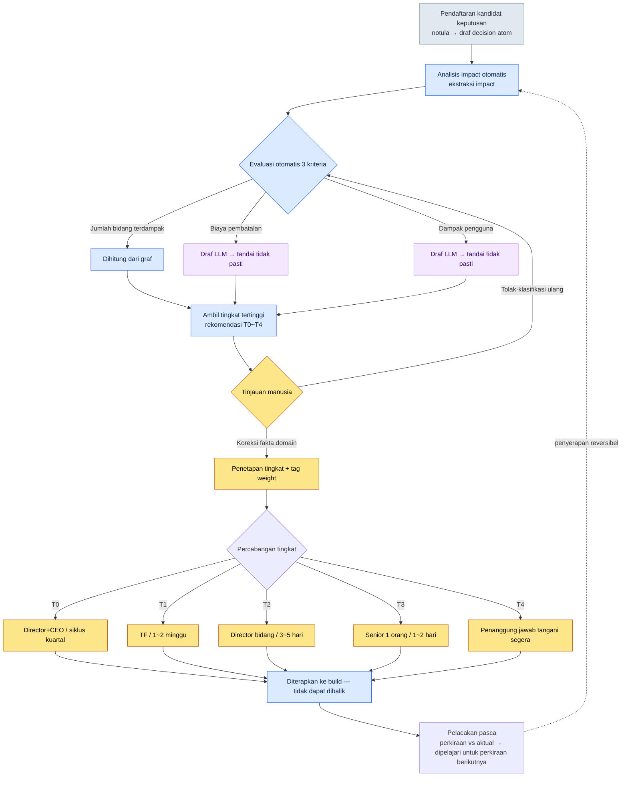
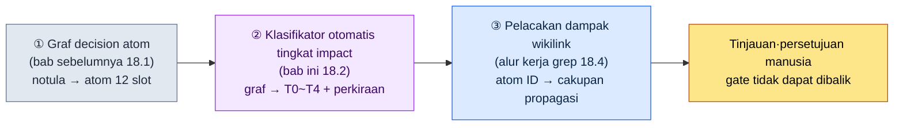

# 18.2 Propagasi Impact dan Klasifikasi Tingkat

Saya sedang merapikan notula rapat setelah rapat selesai. Ada satu baris keputusan yang tertulis di sana. "Global cooldown disatukan menjadi 0.5 detik." Di rapat, kesepakatannya tercapai dalam waktu kurang dari 30 detik. Semua orang mengangguk, lalu beralih ke agenda berikutnya.

Satu baris itu menghabiskan dua bulan berikutnya. Seluruh 277 skill di data combat terkena dampaknya, animasi cooldown gauge di UI digambar ulang, dan sheet balance dirombak dua kali. Keputusan lain yang tertulis di notula yang sama — "Perbaikan salah ketik pada teks panduan tutorial" — selesai hanya dalam 5 menit.

Kedua keputusan itu sama-sama satu baris di atas notula. Jumlah hurufnya pun mirip. Namun yang satu butuh 5 menit, yang lain butuh dua bulan. Membuat perbedaan ini terlihat tepat pada saat notula ditulis — itulah klasifikasi tingkat impact. Jika tingkatnya tidak terlihat, keputusan berdurasi dua bulan akan terkubur di baris yang sama dengan keputusan berdurasi 5 menit.

Bab ini membahas cara mengklasifikasikan secara otomatis dampak (impact) sebuah keputusan ke dalam lima tingkat, lalu melacak sampai mana dampak itu menjalar di atas graf decision atom. Alat yang dipakai adalah decision atom yang sudah dibangun di bab sebelumnya, ekstraksi `impact`, serta atom `portal_layer_change_impact_check`.

---

## Apa yang Terjadi Jika Tingkat Tidak Terlihat

Pertama-tama saya tunjukkan seperti apa wujudnya bila tidak ada klasifikasi tingkat. Jika semua keputusan diletakkan di baris yang sama, dua jenis insiden meledak bergantian.

Yang pertama adalah **penanganan kurang (under-handling)**. Keputusan yang mengguncang seluruh proyek — seperti keputusan global cooldown — diperlakukan sebagai "urusan 5 menit" dan masuk ke build tanpa verifikasi. Dampaknya baru tersingkap dua bulan kemudian, dan saat itu biaya untuk membatalkannya sudah menumpuk setinggi gunung.

Yang satu lagi adalah **penanganan berlebih (over-handling)**. Untuk memperbaiki satu salah ketik, sebuah TF dikumpulkan dan persetujuan game director diminta. Siklus keputusan membengkak, dan waktu yang semestinya dipakai director untuk keputusan T0 malah tersedot ke rapat soal salah ketik.

Kedua insiden ini tampak berlawanan, tetapi akarnya sama. **Bobot keputusan tidak terlihat.** Karena bobotnya tidak terlihat, tenaga dihabiskan pada hal yang ringan dan hal yang berat dibiarkan berlalu. Klasifikasi tingkat adalah pekerjaan menempelkan label bobot pada keputusan, dan begitu label itu menempel, cara penanganannya otomatis bercabang.

---

## 18.2.1 Lima Tingkat Impact — dari T0 hingga T4

Di Proyek A, perusahaan pengembang MMORPG yang saya jalankan, dampak (impact) keputusan dibagi ke dalam lima tingkat. Makin ke atas makin berat, dan penanganannya menuntut lebih banyak orang dan waktu.

| Tingkat | Definisi | Contoh | Pengambil Keputusan | Siklus |
|---|---|---|---|---|
| T0 | Visi game / sistem inti | Keputusan mobile-first, perubahan mekanik inti | Game Director + CEO | Per kuartal |
| T1 | Sistem / lintas bidang | Penyatuan global cooldown, penambahan job baru | Ketua TF + Director | 1\~2 minggu |
| T2 | Bidang / menengah | Penyesuaian nilai skill tertentu, penambahan komponen UI | Director bidang | 3\~5 hari |
| T3 | Tunggal / kecil | Perbaikan dialog satu NPC, penyesuaian warna halus | Senior 1 orang | 1\~2 hari |
| T4 | Segera / hotfix | Perbaikan bug, salah ketik teks | Penanggung jawab | Satuan jam |

Kalau hanya melihat tabelnya, semuanya rapi seperti buku teks. Namun kesulitan di lapangan bukan menghafal tabelnya, melainkan **menilai satu keputusan di depan mata harus dimasukkan ke kotak yang mana**. Bahwa "penyatuan global cooldown" adalah T1 harus diketahui bukan setelah rapat selesai, melainkan tepat pada saat notula ditulis. Karena itu, tiga kriteria pada bagian berikut menjadi inti.

---

## 18.2.2 Tiga Kriteria yang Membedakan Tingkat

Tingkat tidak ditentukan dengan firasat. Tiga kriteria dievaluasi, lalu tingkat tertinggi di antaranya diambil.

<svg viewBox="0 0 720 300" xmlns="http://www.w3.org/2000/svg" font-family="sans-serif" font-size="13">
  <rect x="0" y="0" width="720" height="300" fill="#fafafa" stroke="#ddd"/>
  <text x="20" y="30" font-size="15" font-weight="bold">Matriks Penentuan Tingkat — 3 Kriteria × 5 Tingkat</text>
  <!-- header row -->
  <rect x="20" y="50" width="160" height="40" fill="#2c3e50"/>
  <text x="30" y="75" fill="#fff" font-weight="bold">Kriteria \ Tingkat</text>
  <rect x="180" y="50" width="100" height="40" fill="#c0392b"/><text x="215" y="75" fill="#fff" font-weight="bold">T0</text>
  <rect x="280" y="50" width="100" height="40" fill="#e67e22"/><text x="315" y="75" fill="#fff" font-weight="bold">T1</text>
  <rect x="380" y="50" width="100" height="40" fill="#f1c40f"/><text x="415" y="75" font-weight="bold">T2</text>
  <rect x="480" y="50" width="100" height="40" fill="#2ecc71"/><text x="515" y="75" fill="#fff" font-weight="bold">T3</text>
  <rect x="580" y="50" width="120" height="40" fill="#95a5a6"/><text x="625" y="75" fill="#fff" font-weight="bold">T4</text>
  <!-- row 1: 영향 분야 수 -->
  <rect x="20" y="90" width="160" height="60" fill="#ecf0f1" stroke="#bbb"/><text x="30" y="125">Jumlah bidang terdampak</text>
  <rect x="180" y="90" width="100" height="60" fill="#fff" stroke="#bbb"/><text x="220" y="125">5+</text>
  <rect x="280" y="90" width="100" height="60" fill="#fff" stroke="#bbb"/><text x="315" y="125">2~4</text>
  <rect x="380" y="90" width="100" height="60" fill="#fff" stroke="#bbb"/><text x="425" y="125">1</text>
  <rect x="480" y="90" width="100" height="60" fill="#fff" stroke="#bbb"/><text x="525" y="125">1</text>
  <rect x="580" y="90" width="120" height="60" fill="#fff" stroke="#bbb"/><text x="635" y="125">1</text>
  <!-- row 2: 되돌리기 비용 -->
  <rect x="20" y="150" width="160" height="60" fill="#ecf0f1" stroke="#bbb"/><text x="30" y="185">Biaya pembatalan</text>
  <rect x="180" y="150" width="100" height="60" fill="#fff" stroke="#bbb"/><text x="200" y="185">Sangat besar</text>
  <rect x="280" y="150" width="100" height="60" fill="#fff" stroke="#bbb"/><text x="315" y="185">Besar</text>
  <rect x="380" y="150" width="100" height="60" fill="#fff" stroke="#bbb"/><text x="415" y="185">Sedang</text>
  <rect x="480" y="150" width="100" height="60" fill="#fff" stroke="#bbb"/><text x="515" y="185">Kecil</text>
  <rect x="580" y="150" width="120" height="60" fill="#fff" stroke="#bbb"/><text x="600" y="185">Sangat kecil</text>
  <!-- row 3: 사용자 영향 범위 -->
  <rect x="20" y="210" width="160" height="60" fill="#ecf0f1" stroke="#bbb"/><text x="30" y="245">Cakupan dampak pengguna</text>
  <rect x="180" y="210" width="100" height="60" fill="#fff" stroke="#bbb"/><text x="215" y="245">Seluruhnya</text>
  <rect x="280" y="210" width="100" height="60" fill="#fff" stroke="#bbb"/><text x="320" y="245">Besar</text>
  <rect x="380" y="210" width="100" height="60" fill="#fff" stroke="#bbb"/><text x="415" y="245">Sedang</text>
  <rect x="480" y="210" width="100" height="60" fill="#fff" stroke="#bbb"/><text x="515" y="245">Kecil</text>
  <rect x="580" y="210" width="120" height="60" fill="#fff" stroke="#bbb"/><text x="600" y="245">Sangat kecil</text>
</svg>

Di antara ketiga kriteria, **jumlah bidang terdampak** bisa dihitung secara mekanis dari graf decision atom. Cukup kumpulkan tag yang menunjukkan bidang mana (combat, UI, data, naratif, dan seterusnya) yang menjadi tempat atom yang disentuh keputusan tersebut, lalu selesai.

Masalahnya ada pada dua kriteria sisanya. **Biaya pembatalan** dan **cakupan dampak pengguna** tidak bisa dikonversi menjadi angka di atas graf. "Berapa biaya untuk membatalkan keputusan ini dua bulan kemudian" adalah penilaian bahasa alami. Justru inilah titik yang menjadi tembok terakhir klasifikasi otomatis impact hingga sebelum tahun 2023. Jumlah bidang terdampak sudah terotomasi, tetapi dua kotak penilaian bahasa alami tetap kosong, sehingga pada akhirnya manusia harus menilainya kembali dari awal. Tembok itu menjadi lebih rendah ketika LLM membaca isi decision atom dan mengisi draf untuk dua kotak ini.

Di sini saya tegaskan dengan jujur. Yang diisi LLM adalah **draf**, bukan keputusan final. Meskipun LLM memperkirakan biaya pembatalan sebagai "Besar", director bidang bisa saja memutuskan "menurut struktur sheet kami, ini Sedang". Klasifikasi otomatis bukan menggantikan penilaian manusia, melainkan membuat **manusia tidak memulai dari kotak kosong**.

---

## 18.2.3 Worked Transcript — Menyuruh LLM Mengklasifikasikan Satu Keputusan

Inilah proses nyata ketika satu decision atom yang dibuat di bab sebelumnya dimasukkan apa adanya ke LLM dan disuruh menilai tingkatnya. Saya pindahkan seluruh proses tanpa meringkasnya. Termasuk penolakan dan permintaan ulang.

### Input — Teks Asli Decision Atom

```yaml
# decisions/D2026_Q2_017.md (atom yang didaftarkan di bab sebelumnya 18.1)
id: D2026_Q2_017
title: Penyatuan global cooldown menjadi 0.5 detik
date: 2026-04-18
proposer: teammate_a
decider: Minsoo Lee    # Design Director (sama dengan approved_by di 18.1)
context: Standar cooldown per job berbeda-beda, sehingga setiap kali ada
         job baru, biaya perhitungan ulang balance terus menumpuk.
         Diusulkan penyatuan dengan standar global 0.5 detik.
affected_atoms: [combat_cooldown_rule, skill_table, ui_cooldown_gauge]
reversible: ?
status: proposed
```

### Teks Lengkap Prompt

```
Berikan penilaian tingkat impact untuk decision atom di bawah ini, pilih salah satu dari T0~T4.
Tinjau tiga kriteria secara terpisah — jumlah bidang terdampak / biaya pembatalan / cakupan dampak pengguna —
lalu pilih tingkat tertinggi di antaranya. Untuk kotak yang kamu tidak yakin, tulis "tidak pasti"
dan katakan bahwa manusia perlu memeriksanya.
// (maksud: T0=bidang 5+ / biaya sangat besar / seluruhnya, T1=2~4 / besar / besar, T2=1 / sedang, T3=1 / kecil, T4=1 / sangat kecil)

[lampiran teks asli atom]
```

### Keluaran Mentah Claude (tanpa penyuntingan)

```
Penilaian 3 kriteria:

1. Jumlah bidang terdampak
   Jika melihat affected_atoms:
   - combat_cooldown_rule → bidang combat
   - skill_table → bidang data
   - ui_cooldown_gauge → bidang UI
   Bidang yang disebutkan secara eksplisit ada 3.
   Namun, jika melihat context "setiap kali ada job baru, perhitungan ulang
   balance", kemungkinan besar bidang balance juga terdampak secara tidak langsung.
   Langsung 3 + tidak langsung 1 = secara efektif masuk rentang 2~4. → sinyal T1

2. Biaya pembatalan
   Jika global cooldown sudah disatukan lalu hendak dibatalkan, seluruh
   cooldown skill di skill_table harus dicabangkan ulang menurut standar per job.
   Karena saya tidak tahu jumlah baris skill_table, biaya pastinya tidak pasti,
   tetapi "penyatuan → pemulihan pencabangan" umumnya berbiaya besar. → Besar (sinyal T1)
   ※ Kotak ini tidak bisa dipastikan tanpa mengetahui skala skill_table. Ditandai tidak pasti.

3. Cakupan dampak pengguna
   Karena cooldown berlaku di semua situasi combat, hampir semua pengguna
   merasakannya. → Besar (sinyal T1)

Tingkat yang dipilih: T1
Dasar: ketiga kriteria sama-sama menunjuk T1. Bukan T0 —
karena ini belum sampai "perubahan mekanik inti", melainkan
penyatuan parameter dari mekanik yang sudah ada.

Perlu pemeriksaan manusia:
- Kotak biaya pembatalan: perlu memastikan jumlah baris skill_table yang sebenarnya
- Slot reversible masih kosong dengan "?" → klasifikasi ini berasumsi reversible
  akan diisi dengan "sulit".
```

### Verifikasi dan Penolakan oleh Manusia

Saya tidak menerimanya begitu saja. Tangan saya tergerak pada poin nomor 1 keluaran itu. LLM melihat bidang balance sebagai "dampak tidak langsung", tetapi dalam struktur nyata Proyek A, penyatuan cooldown merombak sheet balance secara **langsung** — sebab formula perhitungan balance untuk job baru itu sendiri menerima nilai cooldown sebagai input. Jadi balance bukan tidak langsung, melainkan bidang keempat yang langsung. Jumlah bidang terdampak menjadi 4. Meski begitu, tingkat yang dipilih, T1, tetap tidak berubah.

Satu hal lagi, tanda "tidak pasti" pada kotak biaya pembatalan ternyata tepat. `skill_table` nyatanya berisi 277 baris skill, dan jika penyatuan dibatalkan, cooldown dari seluruh 277 baris harus dicabangkan ulang. Biayanya bukan "Besar", melainkan lebih dekat ke "Sangat besar". Namun meski satu kotak naik ke atas, tingkat yang dipilih tidak lantas berpindah ke T0 — karena jumlah bidang terdampak dan dampak pengguna berada di rentang T1, tingkat tertinggi tetaplah T1.

### Permintaan Ulang

```
Koreksi. Tambahkan balance_sheet ke affected_atoms (formula balance menerima nilai
cooldown sebagai input, jadi dampaknya langsung). Dengan begitu bidang terdampak ada 4,
dan skill_table berisi 277 baris. Terapkan ini, isi reversible, dan tetapkan tingkat akhirnya.
```

```
Sudah diterapkan.

Bidang terdampak: combat, data, UI, balance = 4
Biaya pembatalan: Sangat besar (seluruh 277 baris skill_table dicabangkan ulang)
Dampak pengguna: Besar

reversible: sulit (mendekati nyaris tidak dapat dibalik — pencabangan ulang 277 baris
menuntut 1~2 kali build + cabang verifikasi ulang balance)

Tingkat akhir: T1
Catatan: jika hanya melihat satu kotak biaya pembatalan, itu sinyal T0,
tetapi 4 bidang terdampak dan dampak pengguna "Besar" berada di rentang T1.
Karena 2 dari 3 kriteria menunjuk T1, maka T1-lah yang benar.
Namun saya sarankan menandai keputusan ini sebagai "yang berat di antara T1"
— karena biaya pembatalannya setara T0.
```

Kalimat terakhir itu lebih berhati-hati daripada manusia. Usulan untuk melabeli "yang berat di antara T1" — bahwa tingkatnya T1 tetapi biaya pembatalannya setara T0 — ini adalah penilaian yang tidak ada di prompt awal. Saya menerimanya. Pada keputusan ini saya menambahkan tag `weight: heavy`, dan menaikkan prioritas pelacakan pascanya.

Inti yang ditunjukkan transcript ini hanya satu. **LLM membuat draf dan alasan klasifikasi, lalu manusia mengoreksinya dengan fakta domain (balance terdampak langsung, 277 baris).** Hanya salah satu dari keduanya saja tidak cukup. Jika hanya manusia, ia mulai dari kotak kosong sehingga lambat; jika hanya LLM, ia menulis "Besar" tanpa tahu soal 277 baris.

---

## 18.2.4 Kode untuk Melacak Propagasi Impact Secara Otomatis

Setelah tingkat ditetapkan, berikutnya adalah "sampai mana ia menjalar". Ekstraksi `impact` dari bab sebelumnya — inbound edge, relasi `affects` dari ontologi, dan back-reference wikilink — diterapkan pada decision atom.

```python
# impact_propagation.py — melacak cakupan propagasi decision atom

def trace_impact(decision):
    # tingkat 1: atom·file yang langsung disentuh keputusan
    direct = decision.affected_atoms + decision.affected_files

    # tingkat 2: atom yang me-referensi balik atom tingkat 1 lewat wikilink (inbound edge impact)
    secondary = []
    for atom in direct:
        secondary.extend(find_inbound_refs(atom))   # referensi balik [[atom]]
        secondary.extend(find_affects_edges(atom))   # affects ontologi

    secondary = dedup(secondary) - set(direct)

    return {
        "direct": direct,
        "secondary": secondary,
        "affected_fields": determine_fields(direct + secondary),
        "estimated_hours": estimate_hours(direct, secondary),
    }
```

Intinya adalah `find_inbound_refs` — fungsi yang mengumpulkan panah **masuk** yang menunjuk atom bersangkutan dengan `[[...]]` di dalam graf atom. Apa yang disentuh keputusan itu sendiri (panah keluar) tertulis di atom, tetapi siapa yang bergantung pada atom itu (panah masuk) baru terlihat setelah seluruh graf dipindai secara terbalik. Dampak berdurasi dua bulan hampir selalu bersembunyi di sisi **inbound edge** ini.

Saya catat dengan jujur hasil menjalankan pelacakan ini pada D2026_Q2_017. direct adalah 4 atom yang ditetapkan di atas. secondary — atom-atom yang me-referensi balik `skill_table`, seperti teks deskripsi skill, pemetaan ikon skill, skill tree per job, dan seterusnya — berderet keluar mengikutinya. **Karena angkanya berbeda di setiap titik waktu, saya tidak memvonisnya.** Fakta yang ditangkap pelacakan adalah arah "secondary berkali-kali lipat lebih banyak daripada direct", sementara jumlah atom yang persis bergantung pada keadaan graf. Arah saja sudah cukup — jika secondary lebih besar satu digit daripada direct, itu sinyal T1, dan berarti ia menjadi objek pelacakan pasca.

---

## 18.2.5 Di Mana Klasifikasi Tingkat Disisipkan — mermaid

Klasifikasi bukan tahap yang berdiri sendiri, melainkan dipasang sebagai gate di tengah-tengah alur keputusan. Begitu kandidat keputusan didaftarkan, analisis otomatis merekomendasikan tingkat, dan baru setelah manusia meninjau serta menyesuaikannya, ia diteruskan ke rapat keputusan.



Dalam alur ini, **satu-satunya tahap yang tidak dapat dibalik adalah penerapan ke build (I)**. Sebelum itu semuanya dapat dibalik — meski tingkat direkomendasikan keliru, manusia tinggal menolaknya, dan tag weight pun bisa dilepas. Ia baru menjadi tidak dapat dibalik setelah masuk ke build dan menjalar ke dokumen lain. Karena itulah gate (tinjauan manusia di F) berada tepat di depan build. Sebelum garis tidak-dapat-dibalik dilewati, manusia menghadangnya sekali.

Garis putus-putus terakhir — panah yang membuat pelacakan pasca (J) berbalik ke analisis otomatis keputusan berikutnya (B) — itulah yang menjadikan sistem ini sebuah siklus pembelajaran. Data hasil pengukuran nyata dari tahap tidak-dapat-dibalik (misalnya: waktu QA ternyata lebih lama dari perkiraan) diserap ke tahap dapat-dibalik dari keputusan berikutnya.

---

## 18.2.6 Pelacakan Pasca — Mengubah Selisih Perkiraan dan Aktual Menjadi Pembelajaran

1 minggu hingga 1 bulan setelah keputusan masuk ke build, perkiraan dan aktual diadu. Inilah format pelacakan pasca untuk D2026_Q2_017.

```
Pelacakan pasca keputusan D2026_Q2_017  (contoh format · angka adalah input fiktif)
─────────────────────────────────
Waktu kerja (perkiraan → aktual)
  kode:    16h → 22h  (+38%)
  data:     8h →  6h  (-25%)
  UI:       4h →  4h  (=)
  QA:       8h → 12h  (+50%)
  total:   36h → 44h  (+22%)

Atom terdampak (perkiraan → aktual)
  direct:    4 →  4   (tepat)
  secondary: perkiraan puluhan → aktual puluhan  (arah cocok, angka persis tidak dipublikasikan)

Insiden terjadi: 0 kasus
Pola galat: QA selalu melebihi perkiraan (kali ini +50%)
Penerapan pada keputusan berikutnya: terapkan margin +20% sebagai default pada perkiraan QA
```

Blok di atas adalah contoh format yang menunjukkan **seperti apa bentuk** pelacakan pasca. Nilai waktu dan persentasenya bukan data proyek nyata, melainkan input fiktif yang mengisi format, jadi pada proyek Anda sendiri, isilah dengan angka Anda sendiri — persis seperti janji buku ini, kami menunjukkan strukturnya dan angkanya Anda yang mengukur. Terlepas dari formatnya, yang sungguh nyata hanya satu. **Arah galat "QA selalu melebihi perkiraan"**, serta prosedur yang mengumpanbalikkan arah itu ke keputusan berikutnya. Karena itulah muncul resep untuk menempelkan margin QA (misalnya: +20%) sejak awal pada perkiraan berikutnya.

Nilai pelacakan pasca bukan pada menebak angka secara persis, melainkan pada mengumpanbalikkan arah galat. Makin akurat perkiraannya, makin tinggi kepercayaan pada klasifikasi tingkat, dan makin tinggi kepercayaan, makin mungkin pendelegasian.

---

## 18.2.7 Pola Insiden dan Resep per Tingkat

Insiden yang berulang di tiap tingkat berbeda. Resepnya pun berbeda.

| Tingkat | Pola Insiden | Resep |
|---|---|---|
| T0 | Visi kabur → kekacauan sepanjang kuartal | Wajibkan mencantumkan satu baris visi pada teks keputusan |
| T1 | Benturan antarbidang → keterlambatan jadwal | Hadirkan perwakilan semua bidang terdampak di TF |
| T2 | Dampak sistem berdekatan terlewat → ledakan keputusan susulan | Pelacakan secondary wajib |
| T3 | Keputusan kecil menumpuk → konsistensi rusak | Periksa kumpulan T3 di retrospektif kuartal |
| T4 | Verifikasi kurang → hotfix ulang | Hotfix pun minimal ditinjau 1 orang |

Resep-resep dalam tabel ini semuanya dijalankan dengan alat yang muncul di bagian-bagian sebelumnya. "Pelacakan secondary wajib" pada T2 adalah `find_inbound_refs` dari §18.2.4, dan "hadirkan perwakilan semua bidang terdampak" pada T1 ditentukan siapa yang harus masuk berdasarkan `affected_fields` yang ditangkap §18.2.4.

Insiden termahal tidak ada di mana pun dalam tabel. **Yaitu salah menentukan tingkat itu sendiri.** Jika T0 diputuskan sendirian oleh seorang senior, visi akan rusak; jika T4 ditangani langsung oleh director, akan timbul bottleneck. Jika tingkat salah, semua resep di bawahnya bekerja di tempat yang keliru. Karena itu, gate tinjauan manusia di §18.2.3 bukan sekadar formalitas.

---

## 18.2.8 Pengukuran — Efek Pengoperasian Tingkat

Saya bandingkan sebelum dan sesudah penerapan klasifikasi tingkat di Proyek A. Di antara angka di bawah ini, nilai absolutnya adalah contoh olahan, dan **arah (tanda pertidaksamaan) adalah kecenderungan nyata**.

| Item | Tanpa Tingkat | Dengan Pengoperasian Tingkat |
|---|---|---|
| Siklus keputusan | Semua seragam 1\~2 minggu | Terdiferensiasi dari T0 kuartal \~ T4 satuan jam |
| Keputusan salah tangani | Banyak per kuartal | Sedikit per kuartal |
| Beban keputusan mingguan director | Besar (semua keputusan ke director) | Kecil (T2\~T4 didelegasikan) |
| Siklus hotfix | 1\~2 hari | 4\~24 jam |
| Analisis keputusan di retrospektif kuartal | Sulit dikelompokkan | Diagregasi sebagai statistik per tingkat |

Alasan saya menulis tabel ini dengan arah alih-alih angka pasti dijelaskan oleh satu item saja, yaitu item nomor 3. **Pengembalian waktu director adalah efek terbesar dari klasifikasi tingkat.** Tanpa tingkat, semua keputusan dari salah ketik hingga visi terkumpul pada satu orang director. Begitu ada tingkat, T2 ke bawah bercabang ke director bidang, senior, dan penanggung jawab, sehingga director berfokus pada T0 dan T1. Mungkinnya pendelegasian berarti director merebut kembali waktu untuk dipakai pada keputusan yang benar-benar berat.

---

## 18.2.9 Posisi Bab Ini dalam Kerangka Penerapan Progresif

Di bab sebelumnya saya membangun graf decision atom, dan di bab ini saya menumpukan klasifikator tingkat otomatis di atas graf itu. Keduanya bukan alat yang berjalan terpisah, melainkan posisi yang berkesinambungan dalam satu kerangka.



Ketiga elemen ini berurutan secara seri. Graf membuat input (①), klasifikator memberi bobot (②), dan pelacakan dampak membentangkan cakupan propagasi (③). Bab ini adalah posisi di tengah.

Ketiga elemen ini baru masuk ke wilayah yang terwujudkan setelah perkembangan LLM. Tembok yang paling terakhir terpecahkan adalah dua kotak evaluasi bahasa alami pada ② — biaya pembatalan dan cakupan dampak pengguna ("tembok terakhir" di §18.2.2) — dan ketika LLM mengisi drafnya, barulah ①→②→③ mulai berputar secara seri.

Penyelarasan dapat-dibalik dan tidak-dapat-dibalik pun bertaut dengan kerangka ini. Sesuai diagram alur §18.2.5, garis tidak-dapat-dibalik hanya satu, yaitu penerapan ke build, dan penerapan ke build itu sendiri tidak dapat dibatalkan, tetapi hasil pengukuran nyatanya berbalik sebagai pembelajaran yang dapat dibalik yang membuat keputusan berikutnya lebih akurat.

---

## 18.2.10 Kegagalan yang Umum

| Pola | Resep |
|---|---|
| Menangani semua keputusan dengan siklus yang sama | Diferensiasi siklus per tingkat |
| Penilaian otonom masing-masing tanpa klasifikasi tingkat | Gate klasifikasi 3 kriteria |
| Mengabaikan tingkat (T0 diputuskan senior) | Wajibkan tabel pengambil keputusan |
| Melewatkan penilaian dampak di muka | Jadikan analisis otomatis sebagai gate sebelum rapat keputusan |
| Menetapkan kotak bahasa alami apa adanya dari keluaran LLM | Manusia mengoreksi dengan fakta domain |
| Menutup keputusan tanpa pelacakan pasca | Bandingkan perkiraan vs aktual dalam 1 minggu\~1 bulan |
| Tidak menerapkan galat perkiraan pada keputusan berikutnya | Terapkan arah galat pada margin perkiraan berikutnya |

---

> **Penerapan di Luar Game.** Tingkat impact adalah label yang membuat "apakah satu baris permintaan itu urusan 5 menit atau urusan dua bulan" terlihat lebih awal, sehingga ia berlaku di tempat kerja mana pun di mana keputusan mengalir deras. Bila perbaikan satu baris teks wiki perusahaan dan "perubahan kebijakan cuti seluruh divisi" sama-sama masuk sebagai 'satu agenda' dan melewati jalur persetujuan yang sama, urusan ringan akan tertangani berlebih dan urusan berat akan berlalu tanpa verifikasi. Misalnya, ketika menerima permintaan kerja dari tim operasional, jika Anda menempelkan T0\~T4 berdasarkan tiga kriteria — jumlah divisi terdampak, biaya pembatalan, cakupan dampak pelanggan — maka apa yang bisa langsung ditangani penanggung jawab dan apa yang butuh persetujuan kepala tim otomatis bercabang, dan waktu manajer direbut kembali untuk keputusan yang benar-benar berat.

## Coba Sendiri — Mengklasifikasikan Tingkat Satu Keputusan

**setup.** Siapkan satu decision atom yang dibuat di bab sebelumnya. Slot `affected_atoms` harus sudah terisi. Jika kosong, jumlah bidang terdampak tidak bisa dihitung.

**prompt.** Gunakan teks lengkap prompt dari §18.2.3 apa adanya. Jangan lewatkan tiga baris inti — (1) evaluasi masing-masing dari 3 kriteria, (2) ambil tingkat tertinggi, (3) tandai kotak yang tidak diyakini dengan "tidak pasti" dan minta pemeriksaan manusia. Tanpa baris ketiga, LLM akan memvonis hal yang ia tidak tahu sekalipun.

**verify.** Begitu menerima keluaran LLM, periksa dua hal secara langsung. Pertama, meski LLM sudah menghitung jumlah bidang terdampak, hitung kembali sendiri secara langsung dari graf atom — bisa jadi ada dampak tidak langsung yang ditangkap sebagai langsung atau malah terlewat (kasus balance pada transcript). Kedua, kotak yang ditandai "tidak pasti" diisi dengan fakta domain (skala nyata seperti 277 baris skill_table). Baru setelah menyelesaikan dua pemeriksaan ini, tetapkan tingkatnya dan teruskan ke build gate.

## Versi Ringkas Solo

Jika proyek Anda dibuat seorang diri tanpa tim maupun TF, lima tingkat itu berlebihan. Kurangi menjadi tiga tingkat.

- **Berat**: keputusan yang mengubah arah game atau beberapa sistem. Tidurlah sebelum memutuskan, lalu lihat kembali setelah bangun. Dilarang keputusan dadakan.
- **Sedang**: keputusan yang tertutup di dalam satu sistem. Tangani di tempat, tetapi tinggalkan satu baris decision atom.
- **Segera**: salah ketik·bug. Perbaiki langsung. Pencatatannya pun boleh dilewati.

Mulailah dengan alat yang bahkan tanpa satu baris kode pun. Saat mencatat keputusan, cukup tempelkan tag `[Berat]` `[Sedang]` `[Segera]` di depannya. Itu saja sudah membuat Anda berhenti sekali lagi di depan keputusan yang bertag "Berat" — esensi klasifikasi tingkat pada akhirnya adalah kebiasaan berhenti di depan keputusan yang berat, dan otomatisasi hanyalah perangkat yang membuat perhentian itu juga bekerja pada skala tim.

---

### Poin-Poin Penting
- Keputusan yang sama-sama satu baris pun terbelah menjadi 5 menit atau dua bulan tergantung tingkat impact-nya, dan jika tingkat tidak terlihat, penanganan kurang dan berlebih akan meledak bergantian
- Dua kotak bahasa alami di antara 3 kriteria (biaya pembatalan·dampak pengguna) adalah tembok terakhir otomatisasi, dan menjadi lebih rendah ketika LLM mengisi drafnya
- Efek terbesar klasifikasi tingkat adalah pengembalian waktu director, dan itu memungkinkan pendelegasian
