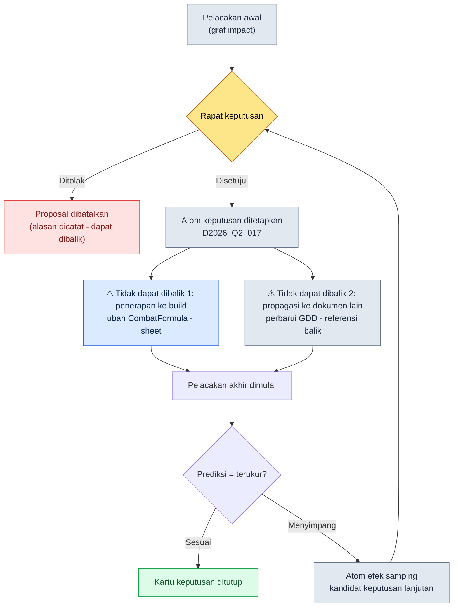

# 18.3 Alur Kerja Pelacakan Dampak Sebelum dan Sesudah Keputusan

Tiga minggu setelah rilis, kami mengadakan retrospektif untuk menelusuri penyebab runtuhnya balance PvP. Setelah menelusuri mundur di papan tulis, titik awal yang kami temukan adalah satu keputusan dari sebulan sebelumnya. "Menaikkan global cooldown dari 0.3 menjadi 0.5." Itu usulan yang masuk akal, yang kami sepakati hanya dalam dua jam setelah menerima umpan balik bahwa combo tidak terlihat. Namun, perubahan itu menaikkan tingkat bertahan hidup job tanker 14% lebih tinggi dari perkiraan, dan itulah yang meruntuhkan PvP. Tidak seorang pun di forum keputusan itu menyebut bahwa keputusan tersebut akan merembet sampai ke tanker. Keputusannya sendiri tidak salah. Penyebab kecelakaannya adalah kami tidak melihat sampai mana keputusan itu merembet **sebelum** mengambil keputusan.

Pelacakan dampak harus terjadi di dua tempat. **Sebelum** menekan tombol keputusan (pre), kita melihat sampai mana ia akan merembet, dan **setelah** keputusan diterapkan (post), kita memastikan apakah dampaknya benar-benar berhenti sampai di situ saja. Bab ini menyatukan kedua pelacakan itu menjadi satu alur kerja.

---

## 18.3.1 Pelacakan Awal dan Pelacakan Akhir Membaca Graf yang Sama Dua Kali

Inti dari analisis dampak keputusan ternyata sederhana. Kita melihat satu atom keputusan sebagai sebuah node, lalu membaca **edge yang masuk** dan **edge yang keluar** dari node tersebut. Pelacakan awal bertanya, "Jika keputusan ini diubah, bagian mana yang terkena dampak?" (outbound + referensi balik), sedangkan pelacakan akhir bertanya, "Apakah dampaknya benar-benar terjadi sesuai maksud?" (membandingkan edge yang sama dengan nilai terukur).

Pada Proyek A milik penulis, keputusan disimpan sebagai atom di dalam folder `decisions/`. Saat ini sudah terkumpul 26 atom, dan setiap atom memuat tanggal, pihak terkait, rasional, dan cakupan dampak di dalam frontmatter. Alat yang mengekstrak cakupan dampak adalah `impact`, dan atom yang memberlakukan aturan ekstraksi itu per keputusan adalah `portal_layer_change_impact_check`. Ketiga hal inilah aset nyata dari pelacakan awal dan akhir.

<svg viewBox="0 0 720 300" xmlns="http://www.w3.org/2000/svg" font-family="sans-serif" font-size="13">
  <rect x="0" y="0" width="720" height="300" fill="#fbfbfd"/>
  <!-- center decision node -->
  <rect x="300" y="120" width="120" height="60" rx="8" fill="#2b6cb0" stroke="#1a4971"/>
  <text x="360" y="146" text-anchor="middle" fill="#fff" font-weight="bold">Atom keputusan</text>
  <text x="360" y="164" text-anchor="middle" fill="#cfe2f3" font-size="11">D2026_Q2_017</text>
  <!-- inbound (left) -->
  <rect x="40" y="40" width="150" height="38" rx="6" fill="#e6f0fa" stroke="#2b6cb0"/>
  <text x="115" y="64" text-anchor="middle" fill="#1a4971">Dasar: umpan balik pengguna</text>
  <rect x="40" y="130" width="150" height="38" rx="6" fill="#e6f0fa" stroke="#2b6cb0"/>
  <text x="115" y="154" text-anchor="middle" fill="#1a4971">Keputusan induk D_011</text>
  <rect x="40" y="220" width="150" height="38" rx="6" fill="#e6f0fa" stroke="#2b6cb0"/>
  <text x="115" y="244" text-anchor="middle" fill="#1a4971">Referensi balik: tautan GDD</text>
  <!-- outbound (right) -->
  <rect x="540" y="40" width="150" height="38" rx="6" fill="#fdeee6" stroke="#c05621"/>
  <text x="615" y="64" text-anchor="middle" fill="#7b3d12">CombatFormula.md</text>
  <rect x="540" y="130" width="150" height="38" rx="6" fill="#fdeee6" stroke="#c05621"/>
  <text x="615" y="154" text-anchor="middle" fill="#7b3d12">Sheet CombatBalance</text>
  <rect x="540" y="220" width="150" height="38" rx="6" fill="#fdeee6" stroke="#c05621"/>
  <text x="615" y="244" text-anchor="middle" fill="#7b3d12">Tampilan combo UI</text>
  <!-- inbound arrows -->
  <line x1="190" y1="59" x2="300" y2="135" stroke="#2b6cb0" stroke-width="1.5" marker-end="url(#a)"/>
  <line x1="190" y1="149" x2="300" y2="150" stroke="#2b6cb0" stroke-width="1.5" marker-end="url(#a)"/>
  <line x1="190" y1="239" x2="300" y2="165" stroke="#2b6cb0" stroke-width="1.5" marker-end="url(#a)"/>
  <!-- outbound arrows -->
  <line x1="420" y1="135" x2="540" y2="59" stroke="#c05621" stroke-width="1.5" marker-end="url(#b)"/>
  <line x1="420" y1="150" x2="540" y2="149" stroke="#c05621" stroke-width="1.5" marker-end="url(#b)"/>
  <line x1="420" y1="165" x2="540" y2="239" stroke="#c05621" stroke-width="1.5" marker-end="url(#b)"/>
  <text x="115" y="22" text-anchor="middle" fill="#1a4971" font-weight="bold" font-size="12">Inbound (mengapa keputusan ini)</text>
  <text x="615" y="22" text-anchor="middle" fill="#7b3d12" font-weight="bold" font-size="12">Outbound (merembet ke mana)</text>
  <defs>
    <marker id="a" markerWidth="8" markerHeight="8" refX="6" refY="3" orient="auto"><path d="M0,0 L6,3 L0,6 Z" fill="#2b6cb0"/></marker>
    <marker id="b" markerWidth="8" markerHeight="8" refX="6" refY="3" orient="auto"><path d="M0,0 L6,3 L0,6 Z" fill="#c05621"/></marker>
  </defs>
</svg>

Pelacakan awal membaca sisi kanan (outbound) untuk memprediksi "sampai sini ia merembet", sedangkan pelacakan akhir mengambil nilai terukur dari node-node di sisi kanan lalu membandingkannya dengan prediksi. Ini adalah membaca graf yang sama dua kali, untuk tujuan yang berbeda.

---

## 18.3.2 Pelacakan Awal — Membaca Graf Sebelum Menekan Tombol Keputusan

Mulai dari sini adalah sesi nyata. Tanpa diringkas, saya muat apa adanya: prompt selengkapnya, keluaran mentah dari Claude, serta bagaimana manusia menolaknya dan meminta ulang.

`impact` adalah pipeline kecil yang menerima ID atom keputusan lalu mengekstrak graf dampaknya. Ia menggabungkan edge inbound (dasar keputusan ini), edge outbound (berkas yang akan diubah keputusan ini), relasi `affects` di ontologi, dan referensi balik wikilink (dokumen lain yang menunjuk keputusan ini dengan `[[D2026_Q2_017]]`) untuk menyusun daftar kandidat dampak.

### Prompt (selengkapnya)

```
Tolong evaluasi dampak awal pada tahap proposal dari decisions/D2026_Q2_017.md.
- Berkas yang akan diubah keputusan ini (outbound)
- Dokumen yang melakukan referensi balik ke keputusan ini dengan [[D2026_Q2_017]] (wikilink inbound)
- Sistem yang terhubung lewat relasi affects di ontologi
Gabungkan ketiganya untuk menghasilkan kandidat dampak, lalu untuk setiap kandidat
bedakan apakah ia butuh konfirmasi saya (T1) atau bisa ditetapkan secara otomatis.
Jangan menambal dengan tebakan; jika tidak ada berkas dasar,
tandai sebagai 'tidak ada dasar'.
```

### Keluaran mentah dari Claude

> Saya sudah membaca `decisions/D2026_Q2_017.md`. Berikut graf dampak yang diekstrak dari frontmatter-nya.
>
> **Outbound (diubah langsung oleh keputusan ini)**
> - `data/CombatFormula.md` — field `global_cooldown` (dinyatakan di atom)
> - `sheets/CombatBalance` — baris pengecualian skill pemulihan (dinyatakan di atom)
> - `ui/ComboIndicator` — diperkirakan dari `affected_teams: [ui]` pada atom. **Namun, berkas spesifiknya tidak ada di atom → tidak ada dasar (perkiraan)**
>
> **Wikilink inbound (referensi balik ke keputusan ini)**
> - Hasil `grep` mencari `[[D2026_Q2_017]]`, tetapi pada indeks saat ini terdapat **0 referensi balik**. Karena ini keputusan baru, tampaknya belum ada yang mengutipnya.
>
> **Relasi affects di ontologi**
> - Terdapat relasi `CombatFormula → affects → TankSurvival` di ontologi.
> - Karena itu, keputusan ini memberi dampak tidak langsung pada metrik `TankSurvival`. Perkiraan dampak +12%.

Di sinilah manusia berhenti. Baris terakhir, "Perkiraan dampak +12%", adalah masalahnya.

### Verifikasi dan penolakan oleh manusia

> Ditolak. "Perkiraan dampak +12%" itu angka dari mana? Nilai itu tidak ada di atom maupun di ontologi, kan. Kalau itu kamu yang mengarang, hapus. Laporkan hanya sampai fakta bahwa relasi affects **ada**, sedangkan besar dampaknya baru muncul setelah simulasi dijalankan. Lalu, kasus perkiraan ui sudah kamu klasifikasikan 'tidak ada dasar', kenapa di daftar kandidat malah kamu naikkan sebagai T1?

### Respons permintaan ulang dari Claude

> Koreksi Anda benar. Saya perbaiki dua hal.
>
> 1. **Menarik "+12%".** Tidak ada dasar nilai itu di atom maupun ontologi mana pun. Itu nilai yang saya bangkitkan sendiri. Saya hanya akan melaporkan **relasi bahwa ada dampak** pada `TankSurvival`, sedangkan besarnya harus diisi dari hasil simulasi (Layer 2). Nilai saat ini adalah `belum terukur`.
> 2. **Mengklasifikasikan ulang kasus ui.** Karena berkas spesifik tidak ditemukan, seharusnya saya menurunkannya dari daftar kandidat — bukan sebagai T1 (butuh konfirmasi), melainkan `dasar tidak cukup — manusia perlu menentukan berkas`. Tabel yang sudah dikoreksi adalah sebagai berikut.

| Kandidat dampak | Jenis edge | Dasar | Klasifikasi |
|---|---|---|---|
| `CombatFormula.md` global_cooldown | Outbound | dinyatakan di atom | ditetapkan otomatis |
| baris pengecualian pemulihan `CombatBalance` | Outbound | dinyatakan di atom | ditetapkan otomatis |
| metrik `TankSurvival` | affects | relasi ontologi | ada dampak / besar belum terukur |
| tampilan combo ui (berkas tak diketahui) | perkiraan | tidak ada dasar | manusia perlu menentukan berkas |
| referensi balik inbound | wikilink | grep 0 hasil | tidak berlaku |

Tabel ini adalah keluaran dari pelacakan awal. Intinya ada pada baris `TankSurvival`. Dampak yang meruntuhkan PvP di bagian pembuka itu sudah muncul di pelacakan awal sebagai **"ada dampak / besar belum terukur"**. Seandainya kami melihat ini di forum rapat, keputusannya akan menjadi "kalau begitu, ukur besarnya lewat simulasi dulu baru putuskan". Membiarkan AI mengarang +12% justru lebih berbahaya. Sebab presisi palsu membuat orang melewatkan verifikasi.

---

## 18.3.3 Keputusan dan Tahap yang Tidak Dapat Dibalik

Setelah pelacakan awal selesai, keputusan diambil dalam rapat. Begitu keputusan ditetapkan sebagai atom, dua **tahap yang tidak dapat dibalik** dimulai.



Alasan ketidakbalikan itu sederhana. Nilai yang sudah diterapkan ke build sudah dimainkan oleh pengguna, dan isi yang sudah dipropagasikan ke dokumen lain sudah dijadikan dasar oleh rekan tim untuk memulai pekerjaan berikutnya. Karena itu, **tepat sebelum** kedua tahap ini, atom `portal_layer_change_impact_check` dipasang sebagai gerbang. Aturan atom ini dapat diringkas dalam satu kalimat. "Jika sebuah keputusan mencakup perubahan yang melintasi Layer (data → formula → UI), daftar kandidat dampak harus disetujui sekali oleh manusia sebelum diterapkan." Jika hanya ada item yang ditetapkan otomatis, lolos; jika ada satu saja item 'manusia perlu menentukan berkas', diblokir. Pada 18.3.2, kasus ui menjadi alasan pemblokiran.

---

## 18.3.4 Pelacakan Akhir — Menempelkan Nilai Terukur ke Graf yang Sama

Pelacakan akhir dijalankan 1 minggu hingga 1 bulan setelah penerapan ke build. Ini adalah pekerjaan menempelkan **nilai terukur** ke setiap baris tabel kandidat dampak yang dibuat oleh pelacakan awal.

### Prompt (selengkapnya)

```
Pelacakan akhir D2026_Q2_017. Tolong tempelkan nilai terukur ke setiap kandidat
pada tabel pelacakan awal (18.3.2).
Sumber nilai terukur:
- git diff sheet CombatBalance (untuk konfirmasi penerapan)
- log simulasi 1000 kali sim_2026q2_017.json
- ekspor KPI minggu 1 rilis kpi_w1.csv
Hitung selisih antara nilai maksud dan nilai terukur, lalu kumpulkan secara terpisah
hanya baris yang keluar dari rentang galat 10%.
Data yang tidak ada, tandai 'belum dikumpulkan'.
```

### Keluaran mentah dari Claude

> Saya sudah menggabungkan nilai terukur ke tabel pelacakan awal.

| Kandidat | Maksud | Terukur | Selisih | Putusan |
|---|---|---|---|---|
| global_cooldown 0.3→0.5 | diterapkan | git diff dikonfirmasi | — | diterapkan |
| baris pengecualian pemulihan | diterapkan | sheet dikonfirmasi | — | diterapkan |
| waktu pertempuran | +15% | +14.2% | -0.8%p | dalam rentang |
| TankSurvival | (belum terukur) | +44% | tidak ada acuan | **tidak dapat diputuskan** |
| win rate PvP 5:5 | +15%p | +29%p | +14%p | **menyimpang** |
| keterbacaan combo ui | membaik | 65% pengguna positif | — | sesuai |

> Baris yang keluar dari rentang galat (±10%): **win rate PvP +29%p (maksud +15%p)**. `TankSurvival` tidak diukur besarnya di tahap awal sehingga tidak ada nilai maksud, maka tidak dapat diputuskan.
>
> Jika kedua baris dihubungkan, `TankSurvival +44%` tampak menjadi penyebab penyimpangan win rate PvP. Membiarkan `TankSurvival` sebagai "besar belum terukur" pada pelacakan awal telah menjadi pertanda penyimpangan kali ini.

### Verifikasi oleh manusia

> Tepat. Tidak mengukur `TankSurvival` lewat simulasi adalah akar kecelakaannya. Buat atom keputusan lanjutan. Rancangan untuk mengembalikan win rate PvP ke rentang maksud lewat penyesuaian dmg pada kelompok job tanker.

### Respons permintaan ulang dari Claude

> Saya sudah membuat draf `decisions/D2026_Q2_025.md`. Saya pasang `[[D2026_Q2_017]]` pada inbound-nya, untuk menyatakan secara referensi balik bahwa keputusan ini adalah **koreksi efek samping** dari keputusan nomor 17. Sekarang jika atom nomor 17 ditelusuri lagi dengan `impact`, akan tertangkap 1 referensi balik inbound (nomor 25) — di tempat yang pada 18.3.2 berjumlah 0 hasil.

Di sinilah graf tertutup. Node yang pada pelacakan awal berstatus "ada dampak / besar belum terukur" telah dikonfirmasi menyimpang pada pelacakan akhir, dan keputusan lanjutan masuk sebagai referensi balik yang menunjuk node tersebut. Seluruh siklus keputusan telah berputar satu putaran di atas graf yang sama.

---

## 18.3.5 Perintah Nyata yang Menjalankan Pelacakan — Alur Kerja grep

Ekstraksi referensi balik inbound oleh `impact` bukanlah alat yang mewah, melainkan satu baris `grep`. Ia mencari wikilink yang menunjuk atom keputusan di seluruh dokumen.

```bash
# Semua dokumen yang melakukan referensi balik ke D2026_Q2_017 (wikilink inbound)
grep -rln "\[\[D2026_Q2_017\]\]" decisions/ manuscript/ gdd/

# Outbound atom keputusan — ekstrak affected_files dari frontmatter
grep -A20 "affected_files:" decisions/D2026_Q2_017.md

# Pelacakan akhir: hanya baris yang menyimpang dari maksud (kolom putusan)
grep -E "이탈|판정 불가" tracking/D2026_Q2_017_post.md
```

Dengan tiga baris ini, kerangka pelacakan awal dan akhir sudah berjalan. LLM adalah tempat untuk **membaca dan menafsirkan** hasil ini, bukan menggantikan pencarian itu sendiri. grep memberi fakta (berkas mana yang menunjuk keputusan ini), LLM merangkai fakta-fakta itu menjadi tabel kandidat dampak, dan manusia bertanggung jawab atas besar dampak serta putusannya. Pemisahan inilah alasan mengapa "jangan mengarang +12%" pada §18.3.2 itu berhasil.

---

## 18.3.6 Pengukuran — Saat Pelacakan Sebelum dan Sesudah Disatukan

Berikut nilai perbandingan sebelum dan sesudah standardisasi siklus keputusan pada Proyek A milik penulis. Nilai waktu absolut bergantung pada ukuran tim (skala menengah, 10–50 orang) sehingga merupakan **perkiraan penulis (belum terverifikasi)**, sedangkan rasio dan arahnya adalah yang diamati dalam operasional nyata.

| Item | Pelacakan sebelum-sesudah terpisah | Pelacakan sebelum-sesudah terintegrasi |
|---|---|---|
| Rasio keputusan yang pelacakan akhirnya benar-benar dijalankan | sekitar 30% | 90% ke atas |
| Dampak yang muncul di awal tapi meledak jadi kecelakaan di akhir | sering | hampir tidak ada (digerbangi di awal) |
| Tingkat penyambungan efek samping → keputusan lanjutan | rendah (disampaikan lisan) | otomatis dikandidatkan lewat referensi balik |
| Kelengkapan referensi balik inbound pada graf keputusan | sporadis | loop tertutup |

Intinya satu hal. Ketika pelacakan awal dan pelacakan akhir berbagi **tabel kandidat yang sama**, lubang yang ditinggalkan sebagai "besar belum terukur" di awal dikonfirmasi tepat di tempat yang sama pada akhir. Jika keduanya terpisah, apa yang dilihat di awal dan apa yang diukur di akhir berbentuk format yang berbeda sehingga tidak bisa dibandingkan, dan karena itu tingkat pelacakan mandek di 30%. Hanya saja, jika kelengkapan referensi balik dipasang sebagai target 100% sejak awal, yang bertambah hanyalah beban operasional. Yang realistis adalah membiasakan dulu menulis `affected_files` pada atom keputusan, lalu menyelipkan grep referensi balik ke dalam siklus retrospektif untuk memperluasnya secara bertahap.

---

## 18.3.7 Kegagalan yang Sering Terjadi

| Pola | Resep |
|---|---|
| Dampak terlihat di awal tapi diputuskan tanpa mengukur besarnya | Baris "besar belum terukur" ditunda keputusannya sampai simulasi selesai |
| LLM mengarang nilai dampak | Jika tidak ada berkas dasar, 'tidak ada dasar'; besar hanya lewat simulasi |
| Pelacakan akhir berformat beda dari tabel awal | Cukup tambahkan kolom nilai terukur ke tabel kandidat yang sama |
| Efek samping disampaikan secara lisan | Wajibkan atom keputusan lanjutan + wikilink referensi balik |
| Perubahan lintas Layer diterapkan tanpa gerbang | Wajibkan lolos `portal_layer_change_impact_check` |

---

### Poin-Poin Penting
- Pelacakan awal dan akhir adalah satu alur kerja yang membaca graf keputusan dua kali.
- Dampak yang besarnya tidak terukur harus dimunculkan sebagai 'belum terukur' agar tidak menjadi kecelakaan.
- LLM menafsirkan dampak, sedangkan nilai angka menjadi tanggung jawab simulasi dan grep.

---

> **Penerapan di Luar Game.** Membaca dua kali — melihat "merembet ke mana" sebelum menekan tombol keputusan (sebelum), dan memastikan "apakah benar-benar berhenti sampai di situ saja" setelah penerapan (sesudah) — adalah operasi dasar dari semua manajemen perubahan, bukan hanya game. Ketika perusahaan mengubah kebijakan harga, jika di awal Anda memunculkan departemen yang terkena dampak (penjualan, CS, penagihan) sebagai tabel kandidat dan meninggalkan catatan "besar belum terukur sampai simulasi selesai", Anda mencegah lebih awal kecelakaan "kenapa tim penagihan tidak tahu soal ini" setelah peluncuran. Misalnya, sebelum memperkenalkan tingkat keanggotaan baru, jika Anda membuat kolom metrik akhir seperti volume pertanyaan CS atau tingkat churn sebagai kolom kosong di tabel awal, sebulan kemudian Anda dapat mengisi kolom itu dengan nilai terukur dan langsung membandingkan selisih antara maksud dan kenyataan dalam tabel yang sama.

## Coba Sendiri

**setup** — Buatlah folder keputusan dan folder pelacakan.
```bash
mkdir decisions tracking
# Pada 1 atom keputusan, tulis affected_files, affected_teams di frontmatter
```

**prompt** — Sambungkan pelacakan awal dan pelacakan akhir ke dalam tabel yang sama.
```
Evaluasi dampak awal decisions/<ID>.md: gabungkan outbound (berkas yang akan diubah),
wikilink inbound, dan affects ontologi untuk membuat tabel kandidat dampak,
tandai item tanpa dasar sebagai 'tidak ada dasar', dan besar sebagai 'belum terukur'.
Jangan mengarang angka.

(Setelah penerapan ke build)
Cukup tempelkan kolom nilai terukur ke tabel kandidat yang sama, lalu kumpulkan
hanya baris yang keluar dari galat 10% dibanding maksud.
Baris yang menyimpang, jadikan draf atom keputusan lanjutan dan pasang referensi balik [[<ID>]].
```

**verify** — Pastikan graf sudah tertutup dengan grep.
```bash
grep -rln "\[\[<ID>\]\]" decisions/   # jika referensi balik keputusan lanjutan tertangkap, loop tertutup
grep -E "이탈|미측정" tracking/<ID>_post.md   # cek lubang yang tersisa
```

## Versi Ringkas Solo

Jika Anda pengembang game indie yang bekerja sendiri, rapat, pemilik, dan tenggat bisa dihilangkan semua. Saat menulis satu baris keputusan ke markdown di `decisions/`, isilah **tepat dua kolom saja**. Yaitu `affected_files:` (berkas yang akan disentuh keputusan ini) dan `expected:` (perubahan yang dimaksudkan). Setelah build, buka berkas-berkas itu dan lihat dengan mata apakah hasilnya sesuai maksud; jika ada yang melenceng, tambahkan satu baris `actual:` pada berkas yang sama. Alatnya cukup satu, yaitu `grep -rln "[[ID keputusan]]"`. Satu kolom di awal, satu kolom di akhir — inilah bentuk minimal dari pelacakan sebelum dan sesudah.
