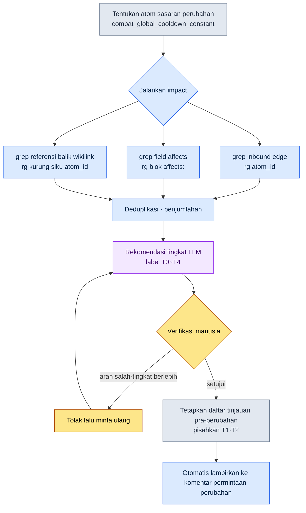

# 18.4 Alur Kerja grep Dampak Dokumen — Menarik Cakupan Dampak dengan impact

Senin pukul sepuluh pagi. Rekan tim A yang menangani combat melempar satu baris ke messenger tim internal. "Boleh tidak global cooldown diturunkan dari 0.5 detik ke 0.4 detik?" Hanya mengubah satu angka. Begitu kelihatannya di permukaan. Saya membaca baris itu dan tangan saya berhenti. Ada di berapa dokumen angka ini dimasukkan, ada berapa atom balancing skill yang disusun dengan konstanta ini sebagai premisnya, sheet mana yang rumusnya akan rusak kalau angka itu diubah — semua itu tidak terbayang di kepala. Kalau saya mengira itu terbayang, justru di situlah letak kecelakaannya. Identitas dari kelalaian "saya tidak melihat dokumen itu" yang meletus 8 sampai 12 kali setiap kuartal adalah ilusi semacam ini.

Maka saya memutuskan untuk tidak menghafal jawabannya. Sebagai gantinya, saya mengetik satu baris.

```
impact combat_global_cooldown_constant
```

Bab ini melihat apa yang dikeluarkan satu baris itu, apa adanya tanpa dipoles. Ia menunjukkan bahwa "menarik cakupan dampak" bukanlah ungkapan abstrak, melainkan tindakan konkret berupa menyapu tiga cabang — inbound edge, affects ontologi, dan referensi balik wikilink — dengan grep.

---

## 18.4.1 Cakupan Dampak Masuk lewat Tiga Cabang

Pertanyaan "kalau atom ini diubah, apa yang terdampak" sebenarnya adalah tiga pertanyaan. Kalau ketiganya dicampur jawabannya jadi kabur; kalau ketiganya dipisah, masing-masing jatuh menjadi satu baris grep.

Pertama, **inbound edge** — siapa yang menunjuk ke saya. Kalau atom A mereferensikan atom B, itu adalah edge berarah A→B. Yang berbahaya saat mengubah B adalah A-A yang menunjuk ke B, yaitu anak panah yang masuk ke B. Karena itu yang dilihat bukan outbound (saya menunjuk siapa) melainkan inbound. Gelombang kejut dari perubahan menjalar mundur menyusuri anak panah.

Kedua, **affects ontologi** — secara makna ia memengaruhi apa. Ini adalah field `affects:` yang dideklarasikan di frontmatter atom. Walaupun namanya tidak muncul secara langsung, ini adalah keterkaitan semantik yang dideklarasikan perancang bahwa "yang ini memengaruhi yang itu". Ia adalah masalah alias/sinonim yang tak terjangkau grep, yang sudah dimasukkan manusia terlebih dahulu.

Ketiga, **referensi balik wikilink** — dokumen yang menautkan saya secara eksplisit dalam format `[[atom_id]]`. Inilah yang paling tinggi tingkat kepercayaannya. Sebab ini bukan kecocokan kata yang kebetulan, melainkan tautan yang sengaja dibuat penulisnya.

Hubungan ketiga cabang itu kalau dilihat dalam diagram tampak seperti ini.

<svg viewBox="0 0 640 300" xmlns="http://www.w3.org/2000/svg" font-family="sans-serif" font-size="13">
  <rect x="250" y="125" width="140" height="50" rx="8" fill="#2d3142" />
  <text x="320" y="148" fill="#ffffff" text-anchor="middle" font-weight="bold">combat_global</text>
  <text x="320" y="165" fill="#ffffff" text-anchor="middle" font-weight="bold">_cooldown_constant</text>

  <rect x="20" y="20" width="170" height="44" rx="6" fill="#e8eaf0" stroke="#5b6178" />
  <text x="105" y="40" text-anchor="middle" font-weight="bold">Inbound edge</text>
  <text x="105" y="56" text-anchor="middle" font-size="11">siapa yang mereferensikan saya</text>

  <rect x="20" y="128" width="170" height="44" rx="6" fill="#e8eaf0" stroke="#5b6178" />
  <text x="105" y="148" text-anchor="middle" font-weight="bold">Affects ontologi</text>
  <text x="105" y="164" text-anchor="middle" font-size="11">deklarasi field affects:</text>

  <rect x="20" y="236" width="170" height="44" rx="6" fill="#e8eaf0" stroke="#5b6178" />
  <text x="105" y="256" text-anchor="middle" font-weight="bold">Referensi balik wikilink</text>
  <text x="105" y="272" text-anchor="middle" font-size="11">tautan eksplisit [[atom_id]]</text>

  <line x1="190" y1="42" x2="252" y2="135" stroke="#5b6178" stroke-width="2" marker-end="url(#arr)" />
  <line x1="190" y1="150" x2="248" y2="150" stroke="#5b6178" stroke-width="2" marker-end="url(#arr)" />
  <line x1="190" y1="258" x2="252" y2="165" stroke="#5b6178" stroke-width="2" marker-end="url(#arr)" />

  <rect x="450" y="125" width="170" height="50" rx="8" fill="#3d5a3d" />
  <text x="535" y="148" fill="#ffffff" text-anchor="middle" font-weight="bold">Daftar cakupan dampak</text>
  <text x="535" y="165" fill="#ffffff" text-anchor="middle" font-size="11">deduplikasi · pelekatan tingkat</text>
  <line x1="390" y1="150" x2="448" y2="150" stroke="#3d5a3d" stroke-width="2.5" marker-end="url(#arr2)" />

  <defs>
    <marker id="arr" markerWidth="8" markerHeight="8" refX="6" refY="3" orient="auto"><path d="M0,0 L6,3 L0,6 Z" fill="#5b6178"/></marker>
    <marker id="arr2" markerWidth="8" markerHeight="8" refX="6" refY="3" orient="auto"><path d="M0,0 L6,3 L0,6 Z" fill="#3d5a3d"/></marker>
  </defs>
</svg>

Yang mengikat tiga cabang ke dalam satu alat adalah `impact`. Pada bagian berikutnya kita melihat secara utuh keluaran yang benar-benar dikeluarkan alat ini.

---

## 18.4.2 Worked Transcript — Menjalankan impact Sekali

Alih-alih menjelaskan dengan kata-kata, saya mengikuti satu siklus nyata dari awal sampai akhir. Saya menyertakan seluruhnya: prompt selengkapnya, keluaran mentah alat (tanpa dipoles), bagian yang saya verifikasi dan tolak, hingga permintaan ulang.

### Prompt (selengkapnya)

Saya meminta Claude untuk menjalankan alur kerja `impact`. Tubuh alur kerjanya adalah shell yang memanggil ripgrep, tetapi interpretasi hasil dan rekomendasi tingkat ditangani Claude.

```
Jalankan alur kerja impact untuk combat_global_cooldown_constant.
Tarik masing-masing dari tiga cabang (inbound edge / affects / referensi balik wikilink) dengan grep,
gabungkan duplikatnya, lalu lekatkan rekomendasi tingkat dampak pada setiap sasaran dampak.
Isi perubahannya adalah "global cooldown 0.5 detik → 0.4 detik".
```

### Keluaran mentah Claude (apa adanya tanpa diringkas)

```
Saya akan menjalankan tiga cabang secara berurutan.

[1/3] Inbound edge — lokasi yang mereferensikan atom ini
$ rg -n "combat_global_cooldown_constant" --type md docs/ atoms/

atoms/combat/combat_skill_cooldown_rule.md:34:  base: combat_global_cooldown_constant
atoms/combat/combat_gcd_ui_feedback.md:12:  depends_on: combat_global_cooldown_constant
docs/spec/combat_v3.md:42:  berbasis global cooldown (combat_global_cooldown_constant)
docs/spec/skill_design.md:18:  cooldown dirancang sebagai kelipatan dari combat_global_cooldown_constant
docs/balance/refgame_comparison.md:77:  refgame 0.5 detik, combat_global_cooldown_constant kita juga sama

→ Ditemukan 5 referensi langsung.

[2/3] Affects ontologi — tempat yang menunjuk atom ini lewat field affects
$ rg -n "^\s*-?\s*combat_global_cooldown_constant" -B3 atoms/ | rg -B3 "affects:"

atoms/combat/combat_dps_curve.md:
  affects:
    - combat_global_cooldown_constant   ← (perhatian: perlu konfirmasi arah)

→ 1 temuan. Namun ini adalah deklarasi dps_curve bahwa ia "memberi pengaruh",
  jadi arahnya bisa jadi berlawanan. Perlu tinjauan manusia — lihat item verifikasi di bawah.

[3/3] Referensi balik wikilink — tautan format [[...]]
$ rg -n "\[\[combat_global_cooldown_constant" --type md

docs/spec/combat_v3.md:42:  ...[[combat_global_cooldown_constant]]...
atoms/combat/combat_skill_cooldown_rule.md:34: ...[[combat_global_cooldown_constant]]...

→ 2 temuan. Keduanya adalah lokasi yang sudah terjaring di [1/3] (duplikat).

[Penjumlahan — sasaran dampak unik setelah deduplikasi]
1. atoms/combat/combat_skill_cooldown_rule.md   (inbound+wikilink)
2. atoms/combat/combat_gcd_ui_feedback.md       (inbound)
3. docs/spec/combat_v3.md                        (inbound+wikilink)
4. docs/spec/skill_design.md                     (inbound)
5. docs/balance/refgame_comparison.md            (inbound)
6. atoms/combat/combat_dps_curve.md              (affects — arah belum pasti)

[Rekomendasi tingkat — berdasarkan 5 tingkat dampak 18.2]
1. combat_skill_cooldown_rule    → T1 (semua cooldown skill adalah kelipatan konstanta ini)
2. combat_gcd_ui_feedback        → T2 (timing umpan balik UI, perlu koreksi visual)
3. combat_v3.md                  → T3 (pembaruan angka dokumen spec)
4. skill_design.md               → T3 (pembaruan angka dokumen desain)
5. refgame_comparison.md         → T2 (tabel perbandingan benchmark, hitung ulang selisih terhadap refgame)
6. combat_dps_curve.md           → belum pasti (tingkat ditetapkan setelah konfirmasi arah)
```

### Verifikasi / penolakan manusia

Ada dua titik di sini tempat saya berhenti.

Penolakan 1 — **arah affects**. `combat_dps_curve.md` mencantumkan konstanta kita di field `affects:`, yang berarti deklarasi bahwa dps_curve *memberi pengaruh* pada konstanta ini. Namun yang sedang kita ubah sekarang adalah sisi konstantanya. Artinya arah anak panahnya berlawanan. Bukan dps_curve yang mengubah konstanta, melainkan kalau konstanta berubah, premis perhitungan dps_curve yang goyah. Claude memang benar saat secara jujur menahan diri dengan "perlu konfirmasi arah". Saya **mempertahankan item ini sebagai sasaran dampak**, tetapi mengklasifikasikannya ulang bukan sebagai affects, melainkan sebagai "ketergantungan makna arah balik". Ditetapkan T2.

Penolakan 2 — **menilai tabel perbandingan refgame sebagai T2** itu penilaian berlebihan. `refgame_comparison.md` adalah tabel perbandingan angka sederhana dengan game eksternal. Kalau angka kita berubah, cukup memperbaiki satu sel di tabel dari 0.5→0.4 dan selesai, dan tak ada sistem mana pun yang memakai tabel ini sebagai input. Diturunkan ke T3 (pembaruan angka dokumen).

### Permintaan ulang

```
Perbaiki dua hal lalu rapikan ulang tabel dampaknya.
1) combat_dps_curve.md tetap sebagai sasaran dampak, ubah labelnya menjadi "ketergantungan makna arah balik",
   tetapkan tingkat T2.
2) refgame_comparison.md diturunkan dari T2 → T3 (tidak ada sistem yang memakainya sebagai input, perbaikan satu sel tabel).
Lalu pisahkan hanya T1·T2 menjadi daftar "wajib ditinjau sebelum perubahan".
```

Hasil akhir yang dirapikan Claude adalah sebagai berikut.

```
[Wajib ditinjau sebelum perubahan — T1·T2]
T1  combat_skill_cooldown_rule.md   semua cooldown skill adalah kelipatan konstanta ini
T2  combat_gcd_ui_feedback.md       kalibrasi ulang timing umpan balik UI
T2  combat_dps_curve.md             ketergantungan makna arah balik — konfirmasi ulang premis kurva DPS

[Hanya pembaruan angka dokumen — T3]
T3  combat_v3.md / skill_design.md / refgame_comparison.md
```

Enam sasaran dampak yang semula "tidak terbayang" di kepala, lewat satu siklus grep dan dua kali penilaian manusia, berubah menjadi daftar yang sudah punya prioritas. Inilah wujud nyata dari penarikan cakupan dampak. Alat menyapu seluruh kandidat secara penuh, dan manusia menetapkan arah serta tingkatnya.

---

## 18.4.3 Pipeline Ekstraksi — Apa yang Otomatis dan Apa yang Manusia

Kalau satu siklus dari bagian sebelumnya digeneralisasi menjadi alur, hasilnya seperti ini. Intinya adalah di mana tahap otomatis dan tahap manusia berpisah.



Bagian yang otomatis adalah tiga cabang grep dan penjumlahan, serta *draf* tingkat. Bagian yang manusia hanya satu, yaitu **penilaian akhir atas arah dan tingkat**. Affects arah balik dan penurunan refgame yang kita lihat pada siklus sebelumnya terjadi tepat di posisi ini. Kalau alat dipercaya 100%, akan terjadi dua kecelakaan: mengeluarkan affects arah balik dari sasaran dampak, atau melindungi tabel perbandingan secara berlebihan sehingga setiap kali menjalankan tinjauan yang tak perlu. Menempatkan batas antara otomatis dan manusia pada satu titik ini adalah maksud desain dari alur kerja ini.

---

## 18.4.4 Referensi Pola grep Tiga Cabang

Saya tuliskan apa adanya pola ripgrep yang dipanggil di dalam impact. Inilah identitas alat ini — bukan infrastruktur mewah, melainkan tiga baris ekspresi reguler (regex) yang sudah teruji.

Inbound edge. Semua lokasi tempat atom ID muncul di tubuh dokumen. Inilah sapuan terluas.

```bash
rg -n "combat_global_cooldown_constant" --type md docs/ atoms/
```

Field affects. Hanya melihat kasus ketika atom ID berada di dalam blok `affects:`. Dengan `-B3`, 3 baris di depan ikut terangkat, sehingga manusia memastikan dengan matanya apakah itu blok affects atau field lain.

```bash
rg -n "combat_global_cooldown_constant" -B3 atoms/ | rg -B3 "affects:"
```

Referensi balik wikilink. Hanya tautan eksplisit yang dibungkus dua kurung siku. Karena tingkat kepercayaannya paling tinggi, ia jadi sasaran tinjauan yang diprioritaskan.

```bash
rg -n "\[\[combat_global_cooldown_constant" --type md atoms/ docs/
```

Ketiga pola itu kepercayaan dan recall-nya tepat berbanding terbalik. Wikilink hampir 100% akurat tetapi tak terjaring kalau penulis tidak memasang tautan. Inbound edge menyapu semuanya tetapi tercampur kecocokan kata yang kebetulan (noise). Affects menangkap makna tetapi arahnya membingungkan. Lubangnya baru tertambal kalau ketiganya digabung. Kalau hanya satu yang dipakai, pasti ada tempat yang bocor.

---

## 18.4.5 Mengikat dengan Decision Card — portal_layer_change_impact_check

Penarikan cakupan dampak adalah satu tahap dari siklus keputusan (§18.3). Pada saat decision card terdaftar, impact berjalan dengan slot `affected_atoms` kartu itu sebagai input. Atom yang memverifikasi keterkaitan ini adalah `portal_layer_change_impact_check`.

Peran atom ini adalah "menghalangi pemeriksaan dampak dilewati ketika perubahannya melintasi Layer". Perubahan konstanta cooldown hanyalah satu angka di L1 (sistem), tetapi dampaknya menjalar sampai ke L3 (rumus sheet data) dan L4 (item QA build). portal_layer_change_impact_check menilai apakah perubahan itu melewati batas Layer, dan kalau melewati, ia memaksa eksekusi impact.

```yaml
---
name: portal_layer_change_impact_check
type: gate
description: Perubahan yang melintasi batas Layer dilarang masuk build sebelum lolos pemeriksaan dampak
trigger:
  - saat decision card terdaftar, affected_atoms tidak kosong
  - layer atom yang diubah != layer atom yang terdampak
action:
  - jalankan impact (grep tiga cabang)
  - kalau ada sasaran dampak T1·T2, blokir merge sebelum centang "tinjauan selesai"
---
```

Dalam kasus cooldown, yang ditangkap gate ini bukan `combat_skill_cooldown_rule` (L1), melainkan sheet CombatBalance (L3) yang memakai rule itu sebagai input. Kolom kelipatan cooldown di sheet menyusun rumusnya dengan konstanta sebagai premis. grep menyapu atom dari dokumen, dan gate mendorong dengan "ini melewati Layer, jadi lihat sampai ke sheet". Kalau keduanya tidak terikat, terjadi kelalaian khas: dokumennya diperbarui tetapi sheet-nya tertinggal dengan premis lama.

---

## 18.4.6 Pengukuran — Apa yang Dipulihkan Alur Kerja

Ini perubahan yang saya amati dalam operasional Proyek A milik penulis. Angka waktu adalah perkiraan penulis (belum terverifikasi), sedangkan jumlah kecelakaan kelalaian adalah nilai yang benar-benar dihitung dalam retrospektif kuartalan.

| Item | Tanpa alur kerja | Operasional impact |
|---|---|---|
| Waktu memahami atom terdampak | bergantung ingatan (tak lengkap) | 1\~2 menit (grep penuh) |
| Kecelakaan kelalaian perubahan | 8\~12 per kuartal (hitungan aktual) | 1\~2 per kuartal (hitungan aktual) |
| Pelampiran dampak ke permintaan perubahan | manusia sesekali | dipaksa oleh gate |
| Pemahaman dampak oleh anggota tim baru | beberapa hari (penjelasan lisan menyeluruh) | 30 menit (alat + kartu) |
| Biaya infrastruktur | mempertimbangkan adopsi graph DB | hanya ripgrep + shell |

Baris terakhir adalah kesimpulan dari seluruh bab ini. Proyek A sempat mempertimbangkan graph DB dan indeks pencarian, tetapi pada akhirnya menetap pada ripgrep dan shell kecil. Alat ukur presisi memang lebih akurat daripada meteran. Namun alat yang dikeluarkan setiap hari cenderung menyatu ke arah meteran yang tidak rusak dan tanpa infrastruktur. Kecelakaan kelalaian turun dari 8\~12 menjadi 1\~2 bukan karena alatnya canggih, melainkan karena ia dijalankan tanpa terlewat setiap kali.

---

## 18.4.7 Batasan — Apa yang Tak Terjaring grep

Meskipun diikat dalam tiga cabang, tetap ada tempat yang bocor. Memakai sambil tahu berbeda dengan memercayai sambil tidak tahu.

Alias dan singkatan. Kalau tubuh dokumen hanya menulis "GCD (Global Cooldown, global cooldown)", ia tak terjaring grep `combat_global_cooldown_constant`. Pelengkapnya adalah memperluas kata kunci pencarian menjadi regex — `(combat_global_cooldown_constant|GCD|전역\s?쿨다운)`. Kelola kamus singkatan tim secara terpisah dan otomatis gabungkan saat mencari.

Wilayah tak dapat dibalik. grep adalah alat untuk tahap yang dapat dibalik. Sebelum masuk ke build, dampak antara dokumen, atom, dan sheet seluruhnya terlihat oleh grep. Namun reaksi setelah build keluar dan pengguna merasakan cooldown 0.4 detik — keluhan komunitas, perubahan tempo yang dirasakan — bukanlah sasaran grep. Karena itu prinsipnya sederhana. **Semua tinjauan grep diselesaikan sebelum masuk build.** Begitu melangkah ke tahap tak dapat dibalik, hal yang bisa diketahui lewat grep berkurang drastis.

Tempat tinjauan LLM. Sebagaimana pada siklus sebelumnya manusia yang menetapkan arah affects dan tingkat, kalau LLM disisipkan untuk menilai kesesuaian kandidat grep, noise-nya tersaring. Hanya saja LLM pun bukan 100%, sehingga persetujuan akhir tetap di tangan manusia. Pada struktur tempat alat, LLM, dan manusia masing-masing menyaring satu tahap, akurasinya mencapai tingkat yang layak dioperasikan. Kalau satu tahap saja dilepas, jenis kecelakaan yang biasa diloloskan tahap itu masuk kembali.

---

> **Penerapan di Luar Game.** Kebiasaan menyapu "kalau item ini diubah, di mana saja yang goyah" bukan dengan ingatan melainkan dengan pencarian penuh memberikan efek yang sama bagi pekerja kantoran mana pun yang bekerja dengan dokumen dan spreadsheet. Saat memperbaiki satu klausul ketentuan, kalau Anda mencoba membayangkan dengan kepala ada berapa kontrak, email pemberitahuan, dan FAQ pelanggan yang mencantumkan nomor klausul itu, Anda pasti akan melewatkan sebagian; tetapi kalau Anda grep seluruh folder dengan kata kunci, menyapunya secara penuh, lalu manusia mengklasifikasikan ke "harus diperbaiki / hanya ditandai / tidak terkait", kelalaian itu hilang. Misalnya, ketika seorang staf akuntansi mengubah kode akun tertentu, kalau ia mencari secara penuh sheet penyelesaian, template laporan, dan makro yang mereferensikan kode itu lalu membuatnya menjadi daftar tinjauan pra-perubahan, ia secara struktural mencegah kecelakaan tutup buku kuartalan "saya tidak melihat satu sheet itu".

## 18.4.8 Coba Sendiri

### setup

Kalau dokumen dan atom dikelola sebagai teks polos (.md) dan ripgrep (`rg`) sudah terpasang, persiapan selesai. Kalau ada aturan penamaan atom ID (snake case, ID unik), akurasi grep meningkat tajam.

```bash
# Verifikasi: berapa kali satu atom ID muncul di seluruh dokumen
rg -c "combat_global_cooldown_constant" docs/ atoms/
```

### prompt

Berikan atom sasaran perubahan dan isi perubahannya, lalu minta ekstraksi tiga cabang + rekomendasi tingkat.

```
Jalankan impact untuk <atom_id>.
Tarik masing-masing dari tiga cabang inbound edge / affects / referensi balik wikilink dengan grep,
jumlahkan setelah dideduplikasi, lalu rekomendasikan tingkat dampak 18.2 (T0~T4).
Isi perubahan: <dari apa menjadi apa>.
Pisahkan hanya T1·T2 menjadi daftar "tinjauan pra-perubahan".
```

### verify

Jangan langsung memercayai keluaran alat, konfirmasi dua hal ini dengan tangan.

1. **Arah affects** — lihat apakah item yang terjaring sebagai affects adalah "sisi yang saya pengaruhi" atau "sisi yang memengaruhi saya". Kalau arahnya berlawanan, perbaiki labelnya.
2. **Tingkat berlebih/kurang** — kalau tabel atau dokumen pembanding naik ke T1·T2, tanyakan "apakah ada sistem yang memakai dokumen ini sebagai input". Kalau tidak ada, turunkan ke T3.

Setelah dikonfirmasi, kalau hanya daftar T1·T2 yang dilampirkan ke komentar permintaan perubahan, satu siklus tertutup.

### Versi Ringkas Solo

Kalau ini pekerjaan pribadi tanpa alat maupun graph atom, Anda bisa memberikan efek yang sama dengan satu baris perintah dan satu kolom catatan.

```bash
# Cari penuh di seluruh folder dengan nama konsep yang ingin diubah
rg -n "전역쿨다운|GCD|global_cooldown" .
```

Tempelkan hasil pencarian apa adanya ke notepad, lalu di samping setiap baris tulis satu dari tiga: "harus diperbaiki / hanya tabel / tidak terkait" dengan tangan. Inilah versi solo dari impact. Intinya bukan pada kecanggihan alat, melainkan pada prosedur itu sendiri: "tidak bergantung pada ingatan, menyapu secara penuh lalu manusia mengklasifikasi". Kalau ada prosedurnya, kelalaian berkurang; kalau tidak ada, kebuntuan Senin pagi itu terulang setiap kali.

---

### Poin-Poin Penting
- Cakupan dampak terdiri atas tiga cabang inbound edge·affects·referensi balik wikilink, dan impact menyapu ketiganya secara penuh
- Yang otomatis sampai penjumlahan grep dan draf tingkat, yang manusia hanya satu titik yaitu penilaian arah affects dan tingkat
- grep adalah meteran tahap yang dapat dibalik sehingga tinjauan harus selesai sebelum masuk build, dan ia bertahan lebih lama daripada graph DB

### Pratinjau Bab Berikutnya
- 19.1 Operasional pimpinan tim — bagaimana pelacakan keputusan·dampak berjalan dalam satuan tim
