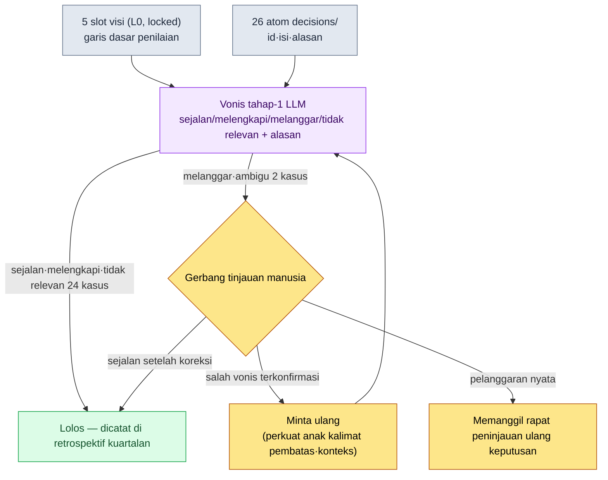

# 19.1 Mengubah Visi Menjadi Lembar Penilaian Keputusan — Menguji 26 Keputusan di decisions/ pada LLM

> Pembaca utama: Design Director dan lead Game Designer yang memimpin tim berskala menengah (10–50 orang)
> Versi ringkas untuk pembaca solo/hobi: §19.1.8 "Versi Ringkas Solo"

Bahkan di tim yang sudah menulis dokumen visi dengan rapi dalam satu halaman, pola yang sama tetap berulang. Visi tergantung di dinding, tetapi tidak ada yang benar-benar memeriksa apakah keputusan-keputusan yang menumpuk setiap minggu sejalan dengan visi itu. Saat retrospektif kuartalan, dokumen itu dibuka sekali, tetapi pada saat itu sudah ada sekitar tiga keputusan lain yang menumpuk di atas keputusan yang sudah melenceng. Agar visi menjadi "titik acuan saat terjadi perselisihan", yang penting bukanlah penulisannya, melainkan **menguji setiap keputusan terhadap visi**. Dan pekerjaan pembandingan itu — kalau dilakukan manusia dengan tangan — membosankan dan mudah terlewat; persis jenis pekerjaan yang pas untuk diserahkan ke AI.

Bab ini menggabungkan dua hal. Bagian depan adalah alur kerja yang menjadikan visi yang sudah ditulis sebagai lembar penilaian keputusan — satu siklus di mana 26 atom keputusan nyata dari proyek saya diuji pada LLM untuk mendapatkan vonis "pelanggaran slot visi", lalu manusia menangkap satu di antaranya yang ternyata salah vonis. Bagian belakang adalah pertanyaan tentang sampai keputusan siapa lembar penilaian itu menjangkau, yaitu **pendelegasian wewenang**. Teori kepemimpinan secara umum (mengapa visi penting, mengapa pendelegasian adalah alat pertumbuhan) sudah cukup banyak dibahas di buku lain, jadi bab ini hanya berfokus pada *titik di mana prinsip itu dijalankan sebagai alur kerja AI*.

---

## 19.1.1 Visi, Peta Jalan, Jadwal — Cukup Tunjukkan Mengapa Ketiga Lapis Ini Berbeda, lalu Lanjut

Kita harus meluruskan dulu pernyataan bahwa visi menyaring keputusan. Visi, peta jalan, dan jadwal bukanlah hal yang sama. Satuan waktu dan frekuensi perubahannya berbeda, dan ketika perbedaan itu runtuh, tekanan jadwal akan mengguncang visi.

| Lapis | Jangka | Frekuensi Perubahan | Makna Pembandingan Visi |
|---|---|---|---|
| Visi | 5–10 tahun | hampir tidak ada | garis dasar yang harus dipenuhi keputusan |
| Peta jalan | 1–3 tahun | kuartalan | lapis tengah yang menerjemahkan visi ke jadwal |
| Jadwal | 1–3 bulan | mingguan | tidak dibandingkan langsung dengan visi |

Intinya adalah **bahwa objek yang dijadikan acuan untuk menguji keputusan adalah visi (lapis yang paling jarang berubah)**. Bukan visi yang diubah karena jadwal mepet, melainkan sisi jadwal yang dibenahi ketika jadwal melenceng dari visi. Hierarki ini harus jelas agar pemeriksaan otomatis di subbab berikutnya bermakna. Sebab, kalau garis dasar pemeriksaan terguncang setiap minggu, pemeriksaannya sendiri menjadi tidak berarti.

Visi diselesaikan dalam satu halaman, lima slot. Dokumen visi proyek saya memakai kerangka berikut. Karena slot-slot ini menjadi kriteria penilaian untuk pemeriksaan LLM di §19.1.3, mari kita lihat dulu bentuknya.

```markdown
---
title: Visi Proyek A v2
layer: L0
locked: true   # Perlu kesepakatan Game Director + CEO untuk mengubahnya
---

## Slot 1. Apa yang Kita Buat
MMORPG mobile-first dengan latar dunia fantasi Korea.

## Slot 2. Untuk Siapa
Pengguna usia 30–50-an, terutama bermain di mobile, yang menikmati narasi yang serius.

## Slot 3. Mengapa (Diferensiasi)
- Narasi berlapis untuk cerita yang dalam (kedalaman, bukan produksi massal)
- Operasional serentak di Asia Tenggara + Korea

## Slot 4. Bagaimana (Nilai)
- Menghargai waktu pengguna (meminimalkan konten yang membuang waktu)
- Keputusan yang menyeimbangkan data + manusia
- Kesepakatan tim diutamakan di atas kecepatan keputusan

## Slot 5. Apa yang Bukan Kita
- Bukan model F2P dengan monetisasi yang agresif
- Bukan berpusat pada PvP
- Bukan kehadiran wajib N jam setiap hari
```

Slot 5 ("Apa yang Bukan Kita") adalah yang paling banyak bekerja dalam pemeriksaan. Sebab, pelanggaran umumnya muncul bukan dari "hal yang sudah disepakati untuk dilakukan", melainkan di titik di mana "hal yang disepakati untuk tidak dilakukan" diam-diam dilakukan.

---

## 19.1.2 Keputusan Sudah Menumpuk dalam Bentuk atom

Visi akan diuji pada apa? Tim saya membakukan setiap keputusan penting dalam folder `decisions/`, satu atom untuk masing-masing keputusan. Itu adalah catatan fakta yang mencantumkan tanggal, pihak terkait, dan alasan; saat ini sudah menumpuk 26 buah. Input pemeriksaan adalah 26 ini — bukan membuat yang baru, melainkan menguji apa yang sudah ada.

Bentuk nyata satu atom keputusan adalah seperti ini (sudah dianonimkan).

```markdown
---
type: decision
id: D0019
date: 2026-05-12
deciders: [Game Director, Data Director]
tier: T1
---
# refgame_selective_adoption_for_mobile
Mengadopsi secara selektif sebagian data tempur MMORPG rujukan ke build mobile.
Alasan: ada tempo tempur yang sudah teruji pada layar mobile 6 inci, dan
merancang ulang dari nol akan menggeser jadwal alfa mundur satu kuartal. Namun,
struktur dorongan monetisasi dan kehadiran tidak diadopsi.
```

Dari 26 keputusan itu, saya saring beberapa yang representatif untuk dipakai sebagai input pemeriksaan (nama atom yang sebenarnya, §A.3.3).

| atom id | nama atom (dianonimkan) | tier | Inti satu baris |
|---|---|---|---|
| D0007 | `claude_role_transition_phase2` | T1 | Menaikkan Claude dari pendamping pasif → mitra aktif |
| D0014 | `dataset_scope_alpha_split` | T2 | Menetapkan kriteria pemisahan dataset alfa |
| D0019 | `refgame_selective_adoption_for_mobile` | T1 | Adopsi selektif data tempur game rujukan |
| D0021 | `procedural_capability_frontier_5stage` | T1 | Mendefinisikan 5 tahap kemampuan procedural generation |
| D0023 | `class_keyword_world_only` | T2 | Membatasi kata kunci kelas hanya di dalam dunia game |

Tabel ini adalah data input untuk prompt di subbab berikutnya. Yang penting adalah menguji 26 keputusan sekaligus, sebab kalau manusia membandingkan 26 keputusan satu per satu dengan visi secara manual saat retrospektif, itu memakan setengah hari, dan dari pertengahan konsentrasi menurun sehingga pelanggaran terlewat. Pembandingan tahap pertama yang membosankan itu diserahkan ke LLM.

---

## 19.1.3 [Worked Transcript] Menguji 26 Keputusan terhadap Visi

Mari kita ikuti satu siklus sampai tuntas. Prompt input dapat langsung disalin dan dipakai, dan keluarannya adalah rekonstruksi dari sesi nyata.

### Langkah 1 — Prompt: Berikan Visi sebagai Lembar Penilaian, dan Paksakan Format Vonis

```
Uji 26 atom keputusan di bawah ini satu per satu terhadap 5 slot visi, lalu
nilai apakah setiap keputusan sejalan/melengkapi/melanggar/tidak relevan dengan
visi. Kalau melanggar atau tidak relevan, sebutkan slot mana dan alasannya dalam
satu baris (perhatikan terutama Slot 5 "Apa yang Bukan Kita"), dan tandai yang
ambigu dengan 'ambigu' lalu serahkan ke saya. Untuk yang sejalan tidak perlu
alasan. Berikan dalam bentuk tabel saja (id | vonis | slot konflik | alasan |
ambigu), tanpa simpulan umum.

[5 slot visi — tempel utuh §19.1.1]
[26 atom keputusan — id·isi·alasan]
```

Separuh dari prompt ini adalah "pemaksaan format vonis". Kalau diberi kebebasan, LLM akan mengaburkan semua 26 keputusan menjadi "secara umum sejalan". **Empat label vonis, kewajiban memberi alasan hanya untuk yang melanggar dan tidak relevan, serta pintu keluar "kalau ambigu serahkan ke manusia"** — itulah inti prompt ini. Penyebutan eksplisit Slot 5 dalam kalimat alasan juga disengaja — sebab pelanggaran muncul dari "hal yang disepakati untuk tidak dilakukan".

### Langkah 2 — Keluaran Claude (rekonstruksi, kutipan)

```
| id    | vonis    | slot konflik | alasan                                  | ambigu |
|-------|----------|--------------|-----------------------------------------|--------|
| D0007 | tidak rel.| —           | Keputusan operasi Claude. Sumbu          |        |
|       |          |              | evaluasinya beda dari visi game          |        |
| D0014 | tidak rel.| —           | Pemisahan dataset. Keputusan infra       |        |
|       |          |              | internal                                 |        |
| D0019 | melanggar | Slot 5      | Adopsi data tempur game rujukan →        | ★      |
|       |          |              | berpotensi konflik dengan "Bukan model   |        |
|       |          |              | F2P dengan monetisasi yang agresif"      |        |
| D0021 | sejalan  | Slot 3       |                                          |        |
| D0023 | sejalan  | Slot 1       |                                          |        |
| ...   |          |              |                                          |        |

(Dari 26: sejalan 18 · melengkapi 3 · tidak relevan 3 · melanggar 2)
Permintaan vonis melanggar/ambigu: D0019, D0026 — perlu tinjauan manusia
```

Bagian paling bernilai dari keluaran ini bukanlah tabelnya, melainkan **baris paling bawah, dua kasus pelanggaran dan tanda ambigu**. LLM secara otomatis menyaring 24 dari 26 keputusan, dan hanya menaikkan 2 yang perlu dilihat manusia. Pembandingan setengah hari menyusut menjadi tinjauan 2 kasus. Namun, salah satu dari 2 kasus itu adalah salah vonis.

### Langkah 3 — Verifikasi dan Penolakan (Bagian Manusia)

Manusia membaca ulang vonis D0019 (`refgame_selective_adoption_for_mobile`). LLM melihat "adopsi data tempur game rujukan" lalu memvonis bahwa hal itu konflik dengan "Bukan model F2P dengan monetisasi yang agresif" pada Slot 5. Kata-kata di permukaan tampak masuk akal — karena game rujukan terkenal dengan monetisasi yang agresif.

Tetapi kalau isi atom dibaca sampai habis, ada kalimat terakhir. **"Namun, struktur dorongan monetisasi dan kehadiran tidak diadopsi."** Keputusan itu hanya mengambil data tempo tempur dan secara eksplisit mengecualikan struktur monetisasi. Ini justru keputusan yang menjaga Slot 5. LLM gagal memasukkan kalimat pembatas terakhir dalam isi atom ke dalam bobot vonisnya, dan terbawa kata sumber "game rujukan" sehingga mengklasifikasikannya sebagai pelanggaran. Ini bukan pelanggaran Slot 5, melainkan **kesejalanan**.

Alasan munculnya salah vonis seperti ini jelas. LLM memandang *sumber* keputusan (diambil dari game mana) dan *isi* keputusan (apa yang diambil dan apa yang dibuang) dengan bobot yang sama. Manusia tahu bahwa anak kalimat pembatas "namun, \~ tidak dilakukan" adalah inti keputusan. Maka manusia menolak dan meminta ulang.

```
Tinjau ulang D0019. Kalimat terakhir isinya "Namun, struktur dorongan monetisasi
dan kehadiran tidak diadopsi" adalah intinya. Pisahkan hal yang diadopsi (data
tempo tempur) dan hal yang dikecualikan (struktur monetisasi/kehadiran), lalu
vonis ulang masing-masing menyangkut slot mana.
```

LLM menjawab lagi. "Objek yang diadopsi (data tempur) sejalan dengan Slot 1·2, objek yang dikecualikan (struktur monetisasi) secara aktif mendukung Slot 5. Vonis menyeluruh: sejalan. Vonis pelanggaran sebelumnya adalah kekeliruan akibat bereaksi berlebihan terhadap kata sumber." Dengan satu putaran bolak-balik ini, D0019 dikoreksi dari pelanggaran menjadi sejalan. Objek tinjauan nyata yang tersisa tinggal satu, yaitu D0026.

Siklus inilah inti bab ini. **LLM menyusutkan 26 menjadi 2 kasus, tetapi salah satu dari 2 kasus itu bisa jadi salah vonis.** Pemeriksaan otomatis bukan menghapus tinjauan manusia, melainkan alat yang membuat manusia berfokus pada 2 kasus alih-alih 26. Kalau manusia tidak membaca 2 kasus itu sampai habis, keputusan yang sebenarnya baik-baik saja akan naik ke rapat sebagai "pelanggaran visi" dan menciptakan perselisihan yang keliru.

---

## 19.1.4 Alur Pemeriksaan dalam Satu Pandangan

Kalau siklus di atas ditinggalkan dalam bentuk diagram, alur yang sama akan berulang setiap kuartal sesudahnya. Intinya adalah vonis LLM tidak secara otomatis membalikkan keputusan. Hanya pelanggaran dan ambigu yang dinaikkan ke gerbang manusia; pembatalan, koreksi, dan persetujuan dilakukan manusia.



Tempat yang disentuh tangan manusia hanya dua. Titik untuk memasukkan visi dan keputusan dengan bersih (paling atas), dan titik untuk membaca sampai habis lalu memvonis sedikit kasus yang dinaikkan LLM sebagai pelanggaran/ambigu (gerbang di tengah). Pembandingan 26 keputusan yang membosankan di antaranya dijalankan oleh LLM. Ini desain yang sama dengan generator city di §6.2, di mana lint tidak secara otomatis membatalkan pelanggaran melainkan hanya menaikkan alert ke gerbang penulis — mesin menyaring kandidat yang mencurigakan, dan manusia memutuskan akan dimatikan atau dipertahankan.

---

## 19.1.5 Sampai Keputusan Siapa Pemeriksaan Visi Menjangkau — Pendelegasian Wewenang

Di sini muncul pertanyaan yang wajar. Apakah Game Director mengambil sendiri 26 keputusan itu? Jangan sampai begitu. Kalau lead mengambil sendiri semua keputusan, ia menjadi penyumbat; kalau semua didelegasikan, visi melemah. Pemeriksaan visi juga merupakan jaring pengaman **untuk menyaring keputusan yang didelegasikan dengan lembar penilaian yang sama**.

Keputusan memiliki tingkatan, dan tingkatan itulah wewenang. Inilah matriks wewenang tim saya.

| Tingkat | Pengambil keputusan | Peninjau | Pemberitahuan | Objek pemeriksaan visi? |
|---|---|---|---|---|
| T0 visi·inti | Game Director + CEO | semua lead | seluruh tim | visi itu sendiri (garis dasar pemeriksaan) |
| T1 sistem·lintas-bidang | ketua TF + Game Director | anggota TF | tim bidang | ✅ wajib |
| T2 bidang·menengah | direktur bidang | senior | tim bidang | ✅ wajib |
| T3 satuan·kecil | senior | penanggung jawab | yang langsung terkait | pemeriksaan sampel |
| T4 segera·hotfix | penanggung jawab | senior (pascakejadian) | Game Director (pascakejadian) | dikecualikan dari pemeriksaan |

26 atom `decisions/` sebagian besar adalah T1·T2 — keputusan-keputusan yang didelegasikan. Game Director tidak melihat sendiri semua T2. Sebagai gantinya, pemeriksaan visi (§19.1.3) menguji keputusan T1·T2 yang didelegasikan terhadap visi sekali setiap kuartal. **Jaring pengaman pendelegasian itu sekaligus adalah pemeriksaan visi.** T0 bukan objek pemeriksaan melainkan garis dasar pemeriksaan, dan hotfix T4 dikecualikan karena jumlahnya banyak dan hampir tidak berdampak pada visi.

Pendelegasian itu sendiri tidak langsung penuh sekaligus, melainkan bertahap dalam 4 langkah.

| Langkah | Wewenang | Hubungan dengan pemeriksaan LLM |
|---|---|---|
| 1. Penyampaian informasi | "Lakukan begini" | Pemberi delegasi yang memutuskan, tidak perlu pemeriksaan |
| 2. Nasihat + lapor keputusan | "Putuskan dengan mempertimbangkan X" | Pembandingan visi dilihat bersamaan saat pelaporan |
| 3. Lapor pascakejadian | "Putuskan dan beri tahu hasilnya" | Dibakukan jadi atom → masuk pemeriksaan kuartalan |
| 4. Keputusan otonom | Tanpa kewajiban lapor (dalam batas tingkat) | Cukup tinggalkan atom, pemeriksaan menjangkau pascakejadian |

Keputusan otonom langkah 4 paling berisiko melenceng dari visi, dan tepat risiko itulah yang ditangkap pemeriksaan §19.1.3 secara pascakejadian. Keputusan T2 yang diambil secara otonom pun, asalkan dibakukan jadi atom, otomatis terjaring dalam pemeriksaan kuartalan. Di sinilah alasan kebebasan pendelegasian dan konsistensi visi tidak saling berbenturan — diputuskan dengan bebas, tetapi keputusannya tertinggal sebagai atom, dan atom diuji terhadap visi setiap kuartal.

---

## 19.1.6 Cara Memperlakukan Angka secara Jujur

Bab visi·pendelegasian sangat tergoda memasukkan tabel seperti "setelah visi diterapkan, waktu rapat berkurang dari 90 menit menjadi 45 menit", "setelah pendelegasian, beban keputusan direktur turun dari 30 kasus per minggu menjadi 5". Angka semacam itu, kalau tidak terverifikasi, akan menggerus kepercayaan terhadap buku. Angka dalam bab ini hanya diperlakukan dengan salah satu dari tiga cara.

Pertama, **yang dihitung dicatat sebagai hasil pengukuran nyata.** atom `decisions/` saat ini berjumlah 26 (berdasarkan pengukuran nyata per Mei 2026). Jumlah kasus yang dinaikkan ke gerbang manusia dari vonis tahap-1 LLM, dan di antaranya jumlah yang dikoreksi karena salah vonis, adalah nilai ukur nyata yang dihitung dari log sesi. Bahwa 1 dari 2 vonis pelanggaran (D0019) di worked transcript di atas ternyata salah vonis juga merupakan hasil sesi nyata.

Kedua, **efek hanya dinyatakan sebagai arah.** "Pembandingan setengah hari menyusut menjadi tinjauan sedikit kasus" adalah arah strukturnya, bukan waktu absolut. Karena waktu penghematan yang persis berbeda-beda menurut jumlah keputusan, skala tim, dan panjang isi atom, lebih tepat dibaca sebagai perbedaan struktur antara "26 dengan tangan" dan "tahap-1 LLM + gerbang manusia". Indikator hasil seperti waktu rapat dan skor motivasi tidak ditentukan oleh visi seorang diri, jadi sebab-akibatnya tidak dipastikan.

Ketiga, **yang dijanjikan hanya yang dapat diukur.** Yang benar-benar dapat diukur dari alur kerja ini adalah — jumlah keputusan yang diuji pada pemeriksaan visi per kuartal, jumlah kasus yang lolos gerbang manusia, tingkat salah vonis (proporsi yang dikoreksi manusia menjadi sejalan dari vonis pelanggaran LLM), dan jumlah keputusan yang tidak terbakukan jadi atom (keputusan yang didelegasikan tetapi terlewat dari pemeriksaan karena tidak ada atom-nya). Empat ini dapat dinyatakan dengan angka, bukan "perasaan", dalam rapat. Khususnya **tingkat salah vonis** membuktikan dengan angka setiap kuartal alasan mengapa vonis LLM tidak boleh ditelan mentah-mentah.

---

## 19.1.7 Kegagalan yang Lazim

| Pola | Mengapa gagal | Resep |
|---|---|---|
| Visi hanya ditulis, tidak diuji pada keputusan | Visi tertinggal jadi hiasan dinding dan keputusan berjalan seenaknya | §19.1.3 yang menguji 26 atom pada visi setiap kuartal |
| Vonis pelanggaran LLM langsung dinaikkan ke rapat | Salah vonis (seperti D0019) menciptakan perselisihan keliru | Kasus pelanggaran·ambigu dibaca manusia sampai habis isi atom |
| Keputusan tidak ditinggalkan sebagai atom | Keputusan yang didelegasikan terlewat sama sekali dari pemeriksaan | Mewajibkan pembakuan atom pada lapor pascakejadian (langkah 3 pendelegasian) |
| Semua diperiksa sampai hotfix T4 | Hanya menambah jumlah, dampak visinya hampir tidak ada | Membatasi objek pemeriksaan ke T1·T2 |
| Melompati pendelegasian langkah 1→4 | Keputusan otonom menumpuk dalam keadaan melenceng dari visi | Pendelegasian bertahap + jangkauan pascakejadian lewat pemeriksaan kuartalan |

Yang ketiga paling sering terlewat. Tim yang berjalan baik secara otonom justru cenderung menyepakati keputusan hanya secara lisan dan tidak meninggalkan atom. Maka pemeriksaan §19.1.3 hanya melihat keputusan yang sudah dibakukan, sehingga keputusan yang diambil paling bebas justru jatuh ke titik buta pemeriksaan. Kebebasan pendelegasian hanya aman dengan syarat pembakuan atom.

---

> **Penerapan di Luar Game.** Menguji visi pada setiap keputusan dan pendelegasian wewenang bukanlah pekerjaan tim game saja, melainkan pekerjaan setiap manajer. Kalau Anda mematok misi departemen dalam satu halaman lima slot ("Apa yang kita lakukan / Untuk siapa / Mengapa / Bagaimana / Apa yang bukan kita"), Anda dapat membandingkan tahap pertama keputusan kerja yang menumpuk setiap minggu dengan misi itu sekali per kuartal menggunakan LLM, untuk melihat apakah ada yang melenceng — khususnya pelanggaran berupa diam-diam melakukan "hal yang disepakati untuk tidak dilakukan" mudah tertangkap. Misalnya, kalau keputusan yang didelegasikan seorang ketua tim diuji pada misi departemen setiap kuartal, itu menjadi jaring pengaman yang menangkap secara pascakejadian apakah keputusan yang diambil secara otonom telah keluar dari arah. Hanya saja, kasus yang dinaikkan LLM sebagai "pelanggaran" jangan langsung dinaikkan ke rapat; salah satunya bisa jadi salah vonis, jadi manusia harus membacanya sampai habis.

## 19.1.8 Coba Sendiri — Satu Langkah yang Bisa Anda Lakukan Hari Ini

> **Versi Ringkas Solo**: Anda tidak perlu punya folder atom keputusan. Tuliskan saja visi proyek Anda sendiri (atau game hobi) dalam satu halaman dengan lima slot dari §19.1.1. Setelah itu, catat 5–10 keputusan yang baru-baru ini Anda ambil masing-masing dalam satu baris memo, lalu tempel utuh prompt dari §19.1.3 dan ujikan sekali pada LLM. Kalau muncul satu saja vonis 'melanggar', baca ulang memo keputusan itu sampai habis, dan bantahlah sendiri secara langsung apakah LLM benar. Dengan begitu, Anda akan merasakan secara fisik kumpulan penilaian apa yang ada di balik pemeriksaan visi, dan mengapa vonis LLM tidak boleh ditelan mentah-mentah.

Kalau Anda bekerja dalam tim, mulailah dengan satu langkah berikut. Pertama-tama, kunci visi dalam satu halaman lima slot (L0, locked), lalu bakukan keputusan T1·T2 yang diambil pada kuartal terakhir ke dalam folder `decisions/`, satu atom untuk masing-masing. Dengan 10 atom saja yang sudah menumpuk, Anda sudah bisa menjalankan prompt §19.1.3 sekali, dan kalau pada siklus pertama itu Anda menangkap satu keputusan yang didelegasikan yang ternyata melenceng dari visi, nilai dari alur kerja ini langsung terlihat.

---

### Poin-Poin Penting
- Yang penting pada visi bukan penulisannya, melainkan menguji pada keputusan — 26 keputusan di decisions/ diuji pada 5 slot visi setiap kuartal.
- LLM menyusutkan 26 menjadi sedikit kasus, tetapi salah satunya bisa jadi salah vonis (D0019).
- Kalau keputusan T1·T2 yang didelegasikan ditinggalkan sebagai atom, pemeriksaan visi menjadi jaring pengaman pascakejadian bagi pendelegasian.

### Pratinjau Bab Berikutnya
- 19.2 Manajemen Konflik·Budaya Tim + Kepemimpinan Rapat — saat wewenang terbagi, muncul benturan. Cara menyangga klasifikasi konflik dan pengelolaan rapat dengan AI.
