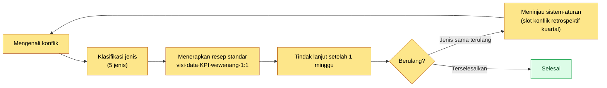
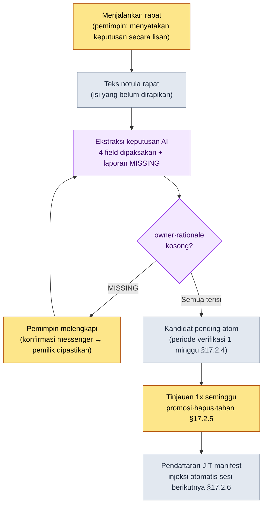

# 19.2 Mengklasifikasikan Konflik dan Tidak Membiarkan Keputusan Bocor dari Rapat — AI Pendukung Kepemimpinan Rapat

> Pembaca utama: Director dan team lead yang membuat lebih dari 50 keputusan per kuartal dalam rapat (tim berukuran menengah, 10–50 orang)
> Versi ringkas untuk pembaca solo/hobi: §19.2.8 "Jika Anda Sendirian, Cukup Sampai Sini"

Pernah saya memimpin rapat selama 90 menit dengan mulus, tetapi seminggu kemudian agenda yang sama kembali muncul di meja rapat. Jelas-jelas sudah diputuskan, namun di mana pun tidak tercatat siapa yang menangani apa. Di notula rapat hanya tertinggal "membahas global cooldown", sedangkan "ditetapkan 0.5 detik, penanggung jawab Anggota Tim A" menguap dalam seminggu dari kepala orang-orang yang hadir saat itu. Titik di mana rapat seorang pemimpin runtuh sebagian besar bukan terjadi saat rapat berlangsung, melainkan **tepat setelah rapat usai, di celah singkat sebelum keputusan mengeras menjadi catatan**.

Bab ini membahas dua bongkahan pekerjaan seorang team lead. Paruh awal adalah **cara mengirimkan konflik ke resep standar per jenisnya alih-alih menyelesaikannya dari nol setiap kali**, dan paruh akhir adalah tulang punggung bab ini — **worked transcript (rekaman sesi nyata) yang mengekstraksi keputusan dari rapat dengan AI, tetapi memaksa agar keputusan tidak diloloskan jika pemilik atau dasarnya kosong**. Teori umum kepemimpinan (memberikan visi, mendengarkan, berempati) sudah cukup dibahas di buku lain, jadi bab ini hanya berfokus pada *tempat di mana teori umum itu dijalankan sebagai alur kerja AI untuk mencegah keputusan terlewat*.

---

## 19.2.1 Konflik Bukan Bertujuan Nol, Melainkan Objek untuk Diklasifikasikan

Anggapan bahwa tim dengan nol konflik adalah tim yang sehat itu keliru. Jika sebuah tim berukuran menengah (10–50 orang) membuat lebih dari 50 keputusan per kuartal tetapi tidak pernah terlihat satu gesekan pun, bukan berarti tidak ada konflik, melainkan konflik itu telah mengendap di bawah permukaan, dan konflik yang mengendap justru lebih berbahaya.

Tugas seorang pemimpin bukan menghilangkan konflik, melainkan **mengklasifikasikan jenisnya dengan cepat dan mengirimkannya ke resep standar**. Jika konflik yang sama diselesaikan dengan cara berbeda setiap kali, waktu yang dibutuhkan untuk menyelesaikannya akan menumpuk lagi dari nol setiap kalinya.

| Jenis Konflik | Inti Benturan | Resep Standar |
|---|---|---|
| Konflik nilai | Perbedaan tafsir visi (pendapatan vs. waktu pengguna) | Mengutip slot visi |
| Konflik fakta | Tafsir berbeda atas data yang sama | Memeriksa data (laporan metagame) |
| Konflik prioritas | "Bidang sayalah yang lebih penting" | Membandingkan tingkat dampak dan pengaruh KPI |
| Konflik wewenang | "Ini keputusan saya" | Memeriksa ulang matriks wewenang |
| Konflik personal | Hubungan antarmanusia dan gaya komunikasi | 1:1, memisahkan fakta/emosi (di luar sistem) |

Empat jenis pertama memiliki resep berupa **kutipan sistem**. Jika visi, data, KPI, dan matriks wewenang tertulis secara eksplisit, bobot keputusan berpindah dari mulut manusia ke sisi sistem sehingga diskusi menjadi lebih singkat. Hanya jenis kelima, konflik personal, yang berada di luar sistem — selain 1:1 serta pemisahan fakta/emosi, hampir tidak ada alat yang berfungsi selain waktu dan ketulusan. Namun, "tidak terselesaikan oleh sistem" bukanlah alasan bagi pemimpin untuk lepas tangan. Justru kerumitan posisi ini terletak pada kenyataan bahwa ranah yang tidak bisa diselesaikan sistem pun pada akhirnya tetap menjadi tugas pemimpin.

Klasifikasi tidak diselesaikan dari awal setiap kali, melainkan berputar dalam satu alur.



Intinya ada di titik percabangan sebelah kanan. Jika konflik berjenis sama terulang, itu bukan masalah orang melainkan masalah sistem. Saat itu, alih-alih menengahi orang, kita memperbaiki aturan seperti visi atau matriks wewenang. Inilah yang menjadi masukan bagi slot konflik retrospektif kuartal yang dibahas di §19.2.7.

---

## 19.2.2 Rapat Adalah Tempat Membuat Keputusan, dan Keputusan Tidak Boleh Dibiarkan Bocor

Sebagaimana keempat jenis resep konflik semuanya berupa "kutipan sistem", rapat pun pada akhirnya adalah **perangkat untuk membuat keputusan dan mengeraskan keputusan itu menjadi catatan**. Lima prinsip yang harus dijaga seorang pemimpin dalam rapat saling terkait. Jika satu saja terlewat, sisanya ikut goyah.

1. Agenda dibagikan 24 jam sebelum rapat. (Jika berkumpul tanpa persiapan, rapat mengalir menjadi ajang diskusi)
2. Setiap agenda diberi batas waktu yang dipaksakan. (Berbagi informasi 5 menit·keputusan 15\~20 menit·diskusi 30\~45 menit, jika terlampaui ditunda)
3. Di akhir rapat, "keputusan hari ini" dinyatakan secara eksplisit. (Jika berakhir tanpa keputusan, rapat berikutnya akan membuka agenda yang sama lagi)
4. Notula rapat dibuat segera setelah rapat berakhir. (Jika menunda merapikannya kemudian, isinya akan menguap)
5. Setiap keputusan dilacak pemilik·dasar·tindak lanjutnya. (Tindakan tanpa pelacakan akan lenyap sebelum minggu berikutnya)

Yang runtuh di antara kelimanya pada insiden di awal tadi adalah nomor 3·4·5. Keputusan dibuat secara lisan (prinsip 3 terpenuhi sebagian), tetapi tidak mengeras menjadi catatan (prinsip 4 gagal), dan pemiliknya tidak terinput (prinsip 5 gagal). Itulah sebabnya seminggu kemudian agenda yang sama kembali muncul.

Masalahnya, jika prinsip 3·4·5 diserahkan pada kemauan manusia, prinsip-prinsip itulah yang paling pertama runtuh di minggu yang sibuk. Begitu rapat berakhir, pemimpin sudah berlari ke rapat berikutnya. Karena itu, ketiga prinsip ini **kita pindahkan ke pipeline yang dibantu AI.** Yakni, mengekstraksi keputusan secara otomatis dari teks notula rapat, tetapi membuatnya agar tidak diloloskan jika pemilik atau dasarnya kosong. Pipeline ini meninjau sekali lagi dari sudut pandang pemimpin alur rapat→notula→ekstraksi atom yang dibuat di Bagian 17 (§17.2).

---

## 19.2.3 [Worked Transcript] Mengekstraksi Keputusan dari Notula, tetapi Memblokirnya Jika Tanpa Pemilik

Saya tunjukkan satu siklus penuh tentang bagaimana ini benar-benar dijalankan. Panggungnya adalah tepat setelah rapat TF tempur dari proyek penulis (MMORPG yang mengutamakan mobile, selanjutnya disebut "Proyek A") berakhir. Prompt masukan bisa langsung disalin dan dipakai, dan keluarannya adalah rekonstruksi dari sesi nyata.

### Tahap 1 — Masukan: Lemparkan Apa Adanya Isi Notula yang Belum Dirapikan

Notula rapat tidak dirapikan dengan cantik. Masukannya adalah teks mentah di mana ucapan-ucapan bercampur dan baris yang ambigu apakah itu keputusan atau bukan pun dibiarkan apa adanya. Merapikan adalah tugas AI, bukan tugas manusia untuk dilakukan lebih dulu.

```text
[2026-06-05 Isi notula rapat TF tempur — kutipan, belum dirapikan]

Anggota Tim A: Hasil simulasi global cooldown ke 0.5 detik tadi stabil.
Anggota Tim B: Kalau skill pemulihan juga diikat 0.5 detik, siklus pemulihan
        sepertinya bakal rusak.
Anggota Tim A: Itu kita pisahkan saja. Pemulihan jadi pengecualian global cooldown.
Minsoo Lee: Oke, kita satukan global cooldown 0.5 detik dan pemulihan jadi
        pengecualian. A, tolong tinjau kolom cooldown di sheet data secara sekaligus.
Anggota Tim C: Aturan prioritas targeting kita lihat lagi minggu depan baru
        ditetapkan ya...
Anggota Tim B: Toggle perkecil minimap sepertinya harus dilihat bareng tim UI.
        Tahan dulu.
Minsoo Lee: Ya, itu untuk rapat berikutnya.
```

Di sini bercampur dua keputusan (global cooldown 0.5 detik, pengecualian pemulihan) dan dua penundaan (targeting, minimap). Jika manusia memilahnya dengan mata, satu per satu akan terlewat. Itulah insiden di awal tadi.

### Tahap 2 — Prompt: Suruh Mengekstraksi, tetapi Cegah Agar Pemilik·Dasar Tidak Dibiarkan Kosong

```text
Dari notula rapat terlampir, tarik "keputusan" saja. Diskusi·penundaan·berbagi
informasi bukanlah keputusan. Untuk setiap keputusan, isi empat kolom
decision (satu kalimat) / owner / rationale / follow_up, tetapi jika owner atau
rationale tidak bisa ditemukan dalam isi teks, jangan menebak dan tulis
"[MISSING — belum dipastikan dalam rapat]". Penundaan·penangguhan ke rapat
berikutnya masukkan sebagai deferred, baris yang ambigu apakah keputusan
masukkan sebagai ambiguous dan serahkan ke saya. Keluaran hanya dalam tiga
blok: decisions / deferred / ambiguous.
```

Perhatikan bahwa separuh dari prompt ini adalah "memaksa kolom kosong". Jika AI diberi kebebasan, ia akan mengarang owner secara meyakinkan atau menaikkan penundaan menjadi keputusan. **Memasukkan jalan keluar berupa "jika tidak ditemukan, jangan menebak dan laporkan sebagai [MISSING]"** itulah inti dari alur kerja ini. Keputusan baru bernilai jika manusia menyatakannya secara eksplisit (prinsip di §17.6.3), dan AI hanya bertugas sampai pada *menyingkapkan* fakta bahwa suatu kolom kosong.

### Tahap 3 — Keluaran Claude (Rekonstruksi Sesi Nyata)

```text
decisions:
  - decision: Menyatukan global cooldown tempur menjadi 0.5 detik.
    owner: Anggota Tim A ("A, tolong tinjau kolom cooldown di sheet data secara sekaligus" — Minsoo Lee)
    rationale: "Hasil simulasi global cooldown ke 0.5 detik tadi stabil" (Anggota Tim A)
    follow_up: Tinjauan sekaligus kolom cooldown

  - decision: Skill pemulihan dikecualikan dari penerapan global cooldown.
    owner: [MISSING — belum dipastikan dalam rapat]
    rationale: "Kalau pemulihan juga diikat 0.5 detik, siklus pemulihan sepertinya bakal rusak" (Anggota Tim B)
    follow_up: Menerapkan ke data penanganan pengecualian cooldown skill pemulihan

deferred:
  - Aturan prioritas targeting (Anggota Tim C, tinjauan tambahan minggu depan)
  - Toggle perkecil minimap (perlu pembahasan dengan tim UI, ditahan)

ambiguous: (tidak ada)
```

Bagian paling berharga dari keluaran ini bukanlah tabel rapi dari keputusan pertama, melainkan **`owner: [MISSING]` pada keputusan kedua**. Pengecualian pemulihan jelas-jelas sudah diputuskan, tetapi di mana pun dalam notula tidak tercatat "siapa yang akan menerapkannya ke data". AI tidak menambal lubang itu dengan tebakan, melainkan melaporkannya secara jujur. Prompt yang baik membuat AI mampu berkata "tempat ini kosong".

### Tahap 4 — Verifikasi dan Penolakan (Posisi Pemimpin)

Keluaran ini tidak boleh diterima begitu saja. Munculnya `[MISSING]` berarti **rapat baru menyelesaikan keputusan setengah jalan**. Di sini, tugas pemimpin bukan memperbaiki keluaran AI, melainkan menuntaskan keputusan yang terlewat dalam rapat.

Di posisi ini, penulis bertanya satu baris kepada Anggota Tim A lewat messenger tim internal. "Penerapan data pengecualian pemulihan juga ditinjau bareng oleh A, kan?" A menjawab "Ya". Satu baris ini memastikan pemilik yang terlewat. Setelah itu, penulis meminta ulang.

```text
Owner keputusan kedua (pengecualian pemulihan) sudah dipastikan sebagai Anggota
Tim A (sudah dikonfirmasi langsung yang bersangkutan lewat messenger tim internal).
Terapkan ini, berikan decisions lagi, dan ubah juga kedua keputusan itu menjadi
format kandidat pending atom.
// (maksud: sertakan status: pending, source_meeting, owner, related_atoms — format §17.2.4)
```

AI mengubah dua keputusan yang owner-nya telah terisi menjadi dua kandidat pending atom dan menjawab lagi. Kandidat ini tidak langsung menjadi keputusan resmi, melainkan melalui **periode verifikasi 1 minggu dalam status pending** (§17.2.4). Sebab, apa yang ditetapkan dalam rapat terkadang terbalik setelah seminggu dijalankan. Anggap saja kita memberi waktu bagi tintanya mengering. Satu siklus masukan → ekstraksi → laporan MISSING → manusia melengkapi keputusan → permintaan ulang ditutup di sini.

Satu putaran ini secara struktural mencegah insiden di awal. Saat keputusan baru jadi setengah, fakta itu tersingkap **tepat di tempatnya seusai rapat**, bukan seminggu setelah rapat berakhir.

---

## 19.2.4 Pipeline Keseluruhan — Tangan Manusia Hanya di Dua Tempat

Jika worked transcript di atas ditumpukkan pada pipeline notula Bagian 17, gambaran keseluruhannya seperti ini. Tempat yang disentuh tangan pemimpin hanya dua. Posisi *menyatakan* keputusan dalam rapat (paling depan), dan posisi *melengkapi* `[MISSING]` yang dilaporkan AI (di tengah). Ekstraksi·konversi·pendaftaran di antaranya berjalan otomatis.



Dalam pipeline ini, hal yang **tidak dilakukan** AI justru lebih penting. AI tidak membuat keputusan. Tidak mengarang pemilik. Tidak menaikkan penundaan menjadi keputusan. Yang dilakukan AI hanya sampai memilah kandidat keputusan dari notula dan *menyingkapkan* kolom kosong. Penyataan keputusan dan pelengkapan kolom kosong dilakukan manusia. Inilah penerapan dari sudut pandang pemimpin atas prinsip "slot keputusan dilarang dihasilkan otomatis oleh AI" yang disebut di §17.6.3 — karena begitu keputusan menyebar ke dokumen·sesi·build lain, ia meninggalkan jejak yang tidak dapat dibalik, maka pada gerbang masuk, posisi tempat manusia menyatakan secara eksplisit tetap dipertahankan.

---

## 19.2.5 Pemaksaan [MISSING] Menopang Budaya Keputusan yang Setara

Di antara atom bersama tim pada PC kantor, ada atom konsep bernama `team_equal_decision_culture`. Ini adalah pembakuan kosakata yang berulang kali dikutip dalam retrospektif, menunjuk dengan satu kata pada budaya tim yang berbunyi "keputusan dibuat berdasarkan dasar, bukan jabatan". Ini budaya di mana director tidak menekan dengan "saya sudah memutuskan, jadi selesai", melainkan meninggalkan siapa·mengapa pada setiap keputusan sehingga **kelak siapa pun bisa menelusuri kembali keputusan itu berdasarkan dasarnya**.

Pemaksaan `[MISSING]` di §19.2.3 itulah persisnya tumpuan teknis dari budaya ini. Tidak meloloskan pemilik dan dasar dalam keadaan kosong berarti otoritas keputusan diletakkan bukan pada "karena director yang mengatakannya", melainkan pada "karena keluar dari ucapan mana di dalam teks". Karena keputusan terblokir jika kutipan dasarnya kosong, keputusan yang ditekan dengan jabatan secara struktural tidak bisa menjadi atom.

Budaya ini juga terhubung dalam satu garis dengan resep konflik di §19.2.1. Menyelesaikan konflik nilai dengan kutipan visi, konflik fakta dengan data, dan konflik wewenang dengan matriks, semuanya adalah prinsip yang sama, yaitu **menyelesaikan dengan dasar yang tercatat alih-alih dengan mulut manusia**. Budaya keputusan yang setara adalah tanah bagi resep konflik, dan pemaksaan `[MISSING]` adalah alat yang setiap kali memadatkan tanah itu agar tidak mengeras di tingkat per rapat.

Di sini bertumpuk pula poros lain dari budaya tim, yaitu batas antara terbuka dan tertutup. Notula rapat·kartu keputusan·data KPI·laporan insiden diletakkan di ranah terbuka, sedangkan percakapan 1:1·penilaian SDM·gaji·urusan pribadi diletakkan di ranah tertutup. Apa yang ditangani pipeline ekstraksi keputusan semuanya adalah ranah terbuka. Alasan konflik personal (jenis kelima di §19.2.1) berada di luar sistem pun sama — itu ranah tertutup, jadi tidak dibakukan menjadi atom.

---

## 19.2.6 Cara Menangani Angka Secara Jujur

Pada bab kepemimpinan, godaan untuk memasukkan tabel seperti "setelah pipeline rapat diterapkan, waktu rapat berkurang setengah" itu besar. Angka semacam itu, jika tidak terverifikasi, akan mengikis kepercayaan terhadap buku. Prinsip buku ini adalah salah satu dari tiga hal.

Pertama, **janjikan sebagai indikator hanya hal yang bisa diukur.** Yang benar-benar bisa dihitung dari pipeline rapat adalah hal-hal ini — jumlah `owner`·`rationale` yang terlewat per keputusan (target 0), proporsi keputusan yang diekstraksi dari notula yang dipromosikan menjadi pending atom, jumlah rapat ulang "bukankah ini sudah diputuskan sebelumnya?". Ketiga hal ini bisa dinyatakan dengan angka, bukan dengan "perasaan", dalam rapat.

Kedua, **tuliskan perkiraan penulis sebagai perkiraan.** Bahwa waktu yang dibutuhkan untuk ekstraksi keputusan tepat seusai rapat adalah "merapikan notula dengan tangan 20\~30 menit → draf AI + pelengkapan dalam waktu kurang dari 5 menit" merupakan perkiraan penulis (belum terverifikasi) berbasis pengalaman dan hipotesis yang belum terverifikasi. Jangan menghafal nilai absolutnya, cukup baca sebagai *perbedaan struktur* ("manusia memilah dari nol" vs. "AI mengekstraksi + hanya melengkapi kolom kosong"). Waktu penghematan yang tepat berbeda-beda tergantung skala rapat·jumlah keputusan.

Ketiga, **jangan menyimpulkan kausalitas secara mutlak.** Tidak dipastikan bahwa "rapat ulang berkurang" sepenuhnya berkat pipeline ini. Kematangan tim·tahap proyek juga turut bekerja. Saya hanya menyatakan arahnya (jika keputusan yang terlewat tersingkap tepat seusai rapat, maka itu bekerja ke arah berkurangnya rapat ulang), dan tidak mengarang kelipatannya.

---

## 19.2.7 Slot Konflik·Keputusan pada Retrospektif Kuartal

Resep konflik dan pipeline keputusan menjalani satu siklus peninjauan dalam retrospektif kuartal. Pada retrospektif, kita menyiapkan "slot konflik" dan "slot keputusan terlewat".

```text
Retrospektif Kuartal Q2 2026 — Slot Konflik·Keputusan
─────────────────────────────────
[Konflik] 3 hal utama kuartal ini
1. Global cooldown (konflik nilai) → diselesaikan dengan kutipan visi.
   Pembelajaran: dikonfirmasi ulang bahwa 5 slot visi berfungsi sebagai kriteria keputusan.
2. Prioritas dungeon baru (konflik prioritas) → perbandingan pengaruh KPI.
   Pembelajaran: karena tak ada tabel prioritas, tiap kali perbandingan dadakan → terapkan tabel kuartal depan.
3. Wewenang desain karakter (konflik wewenang) → memeriksa ulang matriks wewenang.
   Pembelajaran: perlu menambahkan butir pembagian 'visual vs. fungsi' ke matriks.

[Keputusan Terlewat] Kasus [MISSING] yang muncul kuartal ini
- Owner keputusan pengecualian pemulihan tak tercatat (2026-06-05) → dilengkapi lewat messenger tim internal.
  Pembelajaran: tambahkan penyebutan owner secara langsung saat menyatakan keputusan rapat TF ke checklist jalannya rapat.
```

Konflik maupun keputusan terlewat sama-sama merupakan masukan bagi retrospektif. Jika konflik berjenis sama terulang, kita memperbaiki sistem (tabel visi·wewenang), dan jika `[MISSING]` sering muncul dengan pola yang sama, kita memperbaiki cara menjalankan rapat. "Tinjauan sistem·aturan" yang keluar ke kanan pada flowchart di §19.2.1 dikonkretkan di sini.

---

> **Penerapan di Luar Game.** Insiden rapat berupa "jelas sudah diputuskan tetapi seminggu kemudian agenda yang sama muncul lagi" tidak memandang bidang industri. Jika Anda memasukkan isi notula rapat apa adanya tanpa merapikannya ke LLM untuk mengekstraksi keputusan saja, tetapi membuatnya agar saat pemilik atau dasar kosong tidak diisi dengan tebakan melainkan dilaporkan sebagai `[MISSING]`, maka fakta bahwa keputusan baru jadi setengah akan tersingkap tepat di tempatnya seusai rapat. Misalnya, dalam rapat mingguan penjualan, jika "akun ini ditangani oleh A" hanya beredar lisan dan tidak tercatat, hal itu akan menggantung di udara minggu berikutnya; tetapi jika ekstraksi AI memunculkan `owner: [MISSING]`, di tempat itu juga Anda bisa memastikan pemiliknya dengan satu baris pesan messenger dan menghapus satu rapat ulang. Pembagian di mana penyataan keputusan dan pelengkapan kolom kosong dilakukan manusia, sedangkan ekstraksi ditangani AI, itulah intinya.

## 19.2.8 Coba Sendiri — Satu Langkah yang Bisa Anda Lakukan Hari Ini

> **Jika Anda Sendirian, Cukup Sampai Sini**: Anda tidak perlu memiliki tim ataupun pipeline notula rapat. Tempelkan catatan dari rapat yang baru-baru ini Anda ikuti (kelompok belajar·komunitas·diskusi proyek solo juga boleh) apa adanya ke prompt di §19.2.3 lalu jalankan sekali. Jika ada satu saja keputusan yang membuat AI memunculkan `owner: [MISSING]`, itulah agenda yang akan dikeluarkan lagi oleh tim Anda (atau diri Anda sendiri) seminggu kemudian. Hanya dengan mengisi kolom kosong itu sekarang, satu rapat ulang akan lenyap.

Jika Anda dalam tim, mulailah dengan satu langkah berikut. Masukkan notula rapat berikutnya apa adanya tanpa dirapikan ke prompt ekstraksi di §19.2.3, dan hidupkan aturan 2 (pemaksaan `[MISSING]`) saja. Pending atom·pendaftaran JIT (§17.2) urusan setelahnya. Dengan satu baris pemaksaan kolom kosong saja, Anda bisa menangkap keterlewatan paling mahal yang berupa "saya kira sudah diputuskan padahal tak tercatat" tepat seusai rapat.

---

## 19.2.9 Kegagalan yang Umum

| Pola | Mengapa Gagal | Resep |
|---|---|---|
| Menyelesaikan semua konflik dengan cara yang sama | Tidak ada jenis yang terselesaikan tuntas | Klasifikasi 5 jenis → resep per jenis (§19.2.1) |
| Puas dengan tim nol konflik | Konflik mengendap di bawah permukaan (lebih berbahaya) | Konflik adalah sinyal kesehatan, slot retrospektif kuartal |
| Membuat keputusan hanya secara lisan dan tidak mencatatnya | Rapat ulang agenda sama seminggu kemudian | Ekstraksi AI + pembakuan pending (§19.2.3) |
| AI mengisi pemilik dengan tebakan | Pemilik yang salah mengeras menjadi atom | Pemaksaan `[MISSING]`, dilarang menebak (§19.2.2) |
| AI menghasilkan keputusan secara otomatis | Otoritas keputusan menyimpang dari dasar | Penyataan keputusan oleh manusia, AI hanya memperkuat (§17.6.3) |
| Menaikkan penundaan menjadi keputusan | Agenda yang belum pasti menyebar secara tak dapat dibalik | Memisahkan ke blok deferred (§19.2.3) |

Yang ketiga dan keempat paling sering meledak bersamaan. Tim yang tidak mencatat keputusan menyerahkan seluruhnya kepada AI dengan "rapikan sendiri ya", dan AI dengan ramah mengarang pemiliknya. Jika pemilik karangan itu mengeras menjadi atom, seminggu kemudian timbul konflik yang lebih mahal berupa "saya tidak pernah sepakat untuk menanganinya". Pemaksaan `[MISSING]` memblokir kedua kegagalan itu dengan satu baris.

---

### Poin-Poin Penting

- Konflik bukan bertujuan nol, melainkan objek klasifikasi 5 jenis, dan empat jenis diselesaikan dengan kutipan sistem.
- Keputusan rapat diekstraksi oleh AI, tetapi jika pemilik·dasar kosong, diblokir dengan `[MISSING]`.
- Penyataan keputusan dan pelengkapan kolom kosong oleh manusia, sedangkan ekstraksi·konversi·pendaftaran ditangani AI.

### Pratinjau Bab Berikutnya

- 19.3 Strategi Adopsi AI·Komunikasi ke Atas — urutan memasukkan AI ke dalam tim, dan cara mengonversi data keputusan yang sama untuk audiens di tingkat atas
