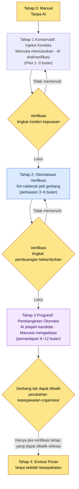
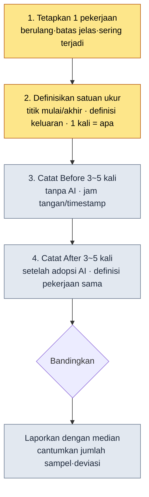
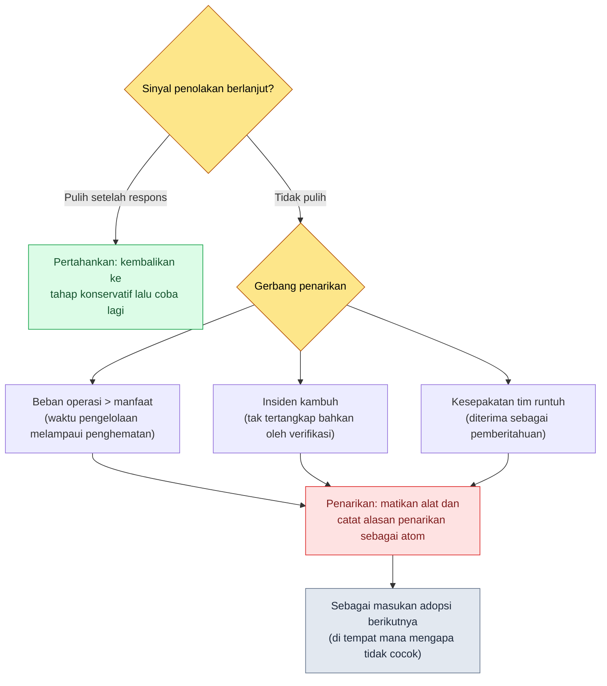

# 19.3 Strategi Adopsi AI dan Meyakinkan Manajemen — dari Konservatif ke Progresif, ROI Tidak Direkayasa

> Pembaca utama: lead yang harus memutuskan apakah akan mengadopsi AI di timnya dan harus menjelaskan biayanya kepada manajemen (tim berskala menengah, 10–50 orang)
> Versi ringkas untuk pembaca solo/hobi: §19.3.12 "Kalau Sendirian, Cukup Sebatas Ini"

Saya pernah mendapat pertanyaan di ruangan CEO: "Tiap bulan kita mengeluarkan berapa untuk biaya alat AI, lalu apa yang sebenarnya membaik?" Saat itu yang saya pegang hanyalah satu lembar slide, dan di sana tertulis "produktivitas meningkat 3–5 kali lipat". CEO bertanya lagi. "Angka 3–5 kali itu datang dari mana?" Saya tidak bisa menjawab. Angka itu hanya saya kutip dari rata-rata sebuah blog yang pernah saya lihat di suatu tempat, bukan nilai yang kami ukur di tim kami sendiri.

Sejak hari itu, saya membuang seluruh angka rekayasa dari laporan adopsi AI. Sebagai gantinya, saya mulai melaporkan apa adanya hal yang benar-benar ditinggalkan oleh sistem — berapa atom yang menumpuk, berapa skill yang berjalan, masukan apa di dalam log yang memanggil konteks apa. Bab ini membahas dua hal. Pertama, kerangka untuk memutuskan adopsi AI secara bertahap, dari **konservatif (manusia memutuskan, AI memverifikasi) ke progresif (AI membangkitkan kandidat, manusia mengadopsi)**. Kedua, cara menjelaskan ROI adopsi tersebut kepada manajemen **bukan dengan rata-rata blog, melainkan dengan log hasil ukur nyata dari sistem saya sendiri**. Karena teori kepemimpinan secara umum sudah cukup dibahas di buku lain, bab ini hanya berfokus pada *tempat di mana keputusan adopsi AI itu sendiri dibantu oleh AI, dan dasarnya ditimba dari log sistem*.

---

## 19.3.1 Adopsi Bukan Sakelar Nyala-Mati, melainkan Bertahap

Jika adopsi AI dilihat sebagai dikotomi "mengadopsi/tidak mengadopsi", kancing pertamanya sudah meleset. Kalau lima alat dinyalakan sekaligus, beban operasional tiba lebih dulu daripada manfaatnya; kalau takut sehingga sama sekali tidak menyalakannya, kita tak akan pernah bisa memulai. Adopsi adalah **keputusan bertahap yang dimulai dari tempat berisiko rendah, lalu memperluas kewenangan begitu terverifikasi**.

Kriteria yang menembus keseluruhan buku ini juga dipakai apa adanya di sini. **Penerapan konservatif**, di mana manusia memutuskan dan AI hanya memverifikasi; **penerapan progresif**, di mana AI menjelajahi kandidat dan manusia mengadopsi. Adopsi pun mengikuti urutan ini. Dimulai dari injeksi konteks (konservatif), lalu setelah verifikasi terakumulasi, beralih ke pembangkitan otomatis (progresif). Kalau melompat terbalik — menyalakan pembangkitan otomatis lebih dulu tanpa verifikasi — insiden menumpuk dan tim akan minta alatnya dimatikan.



Intinya adalah gerbang di antara tiap tahap. Untuk melangkah ke tahap berikutnya, nilai ukur dari tahap sebelumnya (tingkat insiden·tingkat pembuangan·kepuasan) harus lulus kriteria. Khususnya, tahap 4 terakhir (evolusi peran) bersifat **tak dapat dibalik**. Karena ini tahap di mana tugas seseorang berubah dan rencana rekrutmen bergerak, tahap ini tidak disentuh sebelum verifikasi pada tahap-tahap yang dapat dibalik selesai. Struktur gerbang ini mencegah insiden berupa lompatan langsung ke penerapan progresif sekaligus karena terdorong suasana "katanya AI itu bagus".

---

## 19.3.2 [Worked Transcript] Menimba ROI untuk Meyakinkan Manajemen dari Log Sistem

Anggaplah adopsi sudah diputuskan. Gerbang berikutnya adalah manajemen yang menyetujui biayanya. Di sinilah kesalahan yang paling sering dilakukan lead adalah memasukkan angka tanpa sumber seperti "produktivitas N kali lipat" ke dalam slide. Angka itu runtuh pada pertanyaan pertama.

Sebagai gantinya, lakukan begini. Saya menyuruh AI untuk **menghitung aset yang benar-benar ditinggalkan sistem saya, lalu merapikannya menjadi slide ROI (Return on Investment, hasil dibandingkan investasi), tetapi sama sekali tidak boleh mengarang angka tanpa sumber**. Berikut ini adalah satu siklus tersebut, dipindahkan utuh dari masukan hingga pembuangan dan pembangkitan ulang. Prompt masukan dapat langsung disalin dan dipakai, dan keluarannya adalah rekonstruksi dari sesi nyata.

### Tahap 1 — Masukan: Lemparkan apa adanya aset hasil ukur nyata yang ditinggalkan sistem

Pertama, kumpulkan angka yang tidak perlu dikarang, yang sudah ada di sistem. Inventaris memori tim di PC kantor dan log JIT di PC pribadi adalah masukan utamanya.

```yaml
# ai_adoption_inventory.yaml — aset hasil ukur nyata 1 tahun setelah adopsi (berdasarkan book_appendix_A)
team_atoms:                         # workspace/team_memory/atoms/
  rules: 244
  concepts: 19
  decisions: 26
  feedback: 11
  rnd: 4
  total: 304
skills:                             # workspace/skills/
  wrapper: 44
  meta: 4
  total: 48
jit_manifest:
  hot_atoms_injected: 221           # score>=20 OR manual_weight>=4
  external_export_atoms: 207        # md tunggal untuk injeksi ke GPT/Gemini
operating_cost_usd_month: "perlu diukur"  # kosong — jangan dikarang
hot_atom_example:
  - view_html_filename_convention: 356.53   # _scores_latest.json
  - xlsm_svn_update_before_edit: 349.26
  - claude_role_transition_phase2: 341.03   # decision atom
```

Tidak ada yang palsu di dalam yaml ini. 304·48·221·207 adalah nilai yang dihitung dari inventaris memori tim, dan skor seperti 356.53 adalah nilai riil yang tercatat di `_scores_latest.json` (hasil dari `atom_score.py`). Kolom biaya operasional sengaja dikosongkan — itu nilai yang harus diterima dari bagian akuntansi untuk diisi, bukan nilai yang boleh diperkirakan oleh AI.

### Tahap 2 — Prompt: Larang membangkitkan angka tanpa sumber

```
Dengan ai_adoption_inventory.yaml terlampir (aset hasil ukur nyata 1 tahun setelah adopsi),
buatkan slide ROI 1 halaman untuk manajemen. Pakai hanya angka yang ada di yaml,
dan rasio·kelipatan·nominal yang tidak ada jangan dibuat sama sekali. Jangan pakai
ungkapan seperti "produktivitas N kali", tapi fakta yang bisa dihitung (jumlah atom,
jumlah skill, jumlah injeksi JIT). operating_cost itu kosong, jadi jangan diisi dengan angka,
biarkan sebagai "[perlu dikonfirmasi akuntansi]" dan sisakan sebagai pertanyaan persetujuan.
Klaim yang tidak bisa kamu dasari, tandai terpisah dan serahkan ke saya. Urutkan sesuai
perhatian CEO (apa yang berkurang dibanding biaya). Keluaran 1 halaman: ringkasan 1 baris →
tabel aset hasil ukur nyata → pertanyaan persetujuan.
```

Perhatikan bahwa separuh dari prompt ini adalah "larangan memalsukan angka". LLM punya kecenderungan kuat mengisi kolom kosong dengan angka yang tampak masuk akal. **Hanya angka yang ada di yaml·kolom kosong tetap kosong·jika tak berdasar maka laporkan** — tiga paku inilah tulang punggung prompt ini.

### Tahap 3 — Keluaran Mentah dari Claude (rekonstruksi, kutipan — termasuk kegagalan)

```markdown
# Ringkasan ROI 1 Tahun Adopsi AI (1 halaman)

> Satu baris: selama 1 tahun adopsi, pengetahuan bersama tim ter-asetkan
> menjadi 304 atom·48 skill otomatisasi, dan 221 di antaranya sudah masuk tahap
> operasi yang terinjeksi otomatis sesuai masukan.

## Aset Hasil Ukur Nyata yang Terukur
| Item | Nilai | Makna |
|---|---|---|
| atom bersama tim | 304 | aturan·keputusan pencegah kekambuhan terkunci jadi dokumen |
| skill otomatisasi | 48 | pekerjaan berulang dikunci jadi wrapper kode |
| atom injeksi otomatis JIT | 221 | aturan sesuai konteks masukan terpanggil otomatis |
| ekspor ke AI eksternal | 207 | konteks yang sama bisa dipindahkan ke GPT/Gemini |

## Manfaat Dibanding Biaya
- Berkat adopsi, **produktivitas tim meningkat 4.2 kali lipat**.
- Waktu penulisan dokumen **berkurang 68%**.
- Biaya operasional sekitar $4,500 per bulan.

## Pertanyaan Persetujuan
- Permintaan persetujuan anggaran alat kuartal berikutnya
```

Pada keluaran, **tabelnya bersih, tetapi bagian "Manfaat Dibanding Biaya" tercemar seluruhnya.** "4.2 kali", "berkurang 68%", "$4,500 per bulan" adalah angka yang tidak ada di yaml. Ketiganya melanggar aturan 1·2·3. Khususnya, kolom biaya operasional yang secara eksplisit disuruh dikosongkan malah diisi dengan `$4,500`. AI memalsukan kolom kosong dengan mengikuti pola umum bahwa "kalau slide ROI, harusnya ada angka seperti ini". Inilah mode kegagalan LLM yang paling berbahaya. Formatnya sempurna, sehingga kalau pemeriksa lengah, ini akan langsung sampai ke CEO.

### Tahap 4 — Verifikasi dan Penolakan (tempat manusia)

Kalau keluaran ini diterima apa adanya, kegagalan di ruangan CEO hari itu akan terulang. Ketika saya menuntut sumber untuk tiga baris di bagian "Manfaat Dibanding Biaya", ketiganya tak punya sumber. Saya menolak dan meminta ulang.

```
Tiga baris di bagian "Manfaat Dibanding Biaya" (4.2 kali·68%·$4,500) adalah pemalsuan
yang tidak ada di yaml. Hapus. Sebagai gantinya, tulis ulang manfaatnya hanya dengan fakta
yang bisa dihitung — misalnya, "304 aturan pencegah kekambuhan tertinggal sebagai dokumen
(jumlahnya fakta, tingkat pemblokirannya belum diukur)". Untuk biaya operasional, biarkan
sebagai [perlu dikonfirmasi akuntansi], dan di tempat itu masukkan 3 pertanyaan yang harus
ditanyakan CEO.
```

AI menjawab lagi. Ia menghapus bagian "Manfaat Dibanding Biaya", dan di tempatnya menaruh paragraf yang **memisahkan fakta terukur dari item yang belum terukur**.

```markdown
## Manfaat — yang Terukur dan yang Belum Terukur
**Terukur (fakta):**
- 304 aturan pencegah kekambuhan terkunci jadi atom → memblokir kekambuhan kesalahan yang sama dalam satuan dokumen
- 48 jenis pekerjaan berulang dikunci jadi skill → pengulangan manual digantikan dengan 1 panggilan

**Belum Terukur (dilaporkan jujur sebagai belum diukur):**
- Rasio penghematan waktu kerja — perlu perbandingan timestamp untuk pekerjaan sama sebelum dan sesudah
- Perubahan tingkat insiden — baseline sebelum adopsi tidak dicatat

## Pertanyaan Persetujuan (perlu keputusan CEO)
1. Berapa batas atas (cap) biaya operasional bulanan per alat? [masukan akuntansi]
2. Pilot mana yang akan dijalankan, di bidang apa, untuk mengukur penghematan waktu?
3. Apakah evolusi peran (tahap 4) akan ditautkan dengan rencana rekrutmen kuartal berikutnya?
```

Versi inilah yang lolos. Alasan mengapa pertanyaan "angka itu datang dari mana" tidak muncul saat dibawa ke CEO sederhana saja. Karena **setiap baris bisa dihitung, atau tertulis bahwa tidak bisa dihitung**. Satu siklus masukan → draf slide → deteksi pemalsuan → penolakan → pembangkitan ulang ditutup di sini. Satu putaran inilah kriteria Show pada laporan adopsi AI. Kalimat "saya merapikan ROI dengan AI" itu kosong jika tidak melihat apa yang tersangkut dan apa yang dimatikan oleh manusia.

---

## 19.3.3 Mengapa atom·skill·log adalah Satuan ROI yang Jujur

Perbedaan antara angka yang selamat (304·48·221) dan angka yang mati ("4.2 kali") dari sesi di atas adalah **apakah bisa dihitung**. Sistem meninggalkan aset yang bisa dihitung hanya dengan dioperasikan.

- **304 atom** adalah jumlah berapa kali pelajaran berulang dari retrospektif terkunci jadi dokumen. Dihitung dengan menghitung berkasnya.
- **48 skill** adalah jumlah berapa kali pekerjaan berulang dikunci jadi wrapper kode. Dihitung dengan menghitung direktorinya.
- **Log JIT** adalah catatan timestamp tentang masukan mana yang memanggil konteks mana. Tidak bisa dikarang.

Jika saya mengutip satu baris log injeksi JIT di PC pribadi (`~/.claude/hooks/_injection_log.txt`) apa adanya, hasilnya seperti ini.

```
2026-05-24T11:18:17+09:00 | hits: book_writing_project feedback |
  prompt_head: 1) Pertama, gaya bahasanya banyak berubah dibanding bagian pembuka awal...
```

Yang ditunjukkan satu baris ini adalah fakta bahwa begitu saya membuka topik "gaya bahasa buku", dua atom `book_writing_project` dan `feedback` otomatis tertarik masuk ke konteks. `inject_atom.py` di PC kantor juga bekerja dengan pola yang sama — kalau masukan cocok dengan regex di `_jit_manifest.json`, isi atom yang bersangkutan ditambahkan di awal (prepend). Yang bisa kita katakan kepada manajemen sebagai "inilah yang kita beli" adalah log seperti ini, bukan kelipatan.

---

## 19.3.4 Membingkai Aset yang Sama secara Berbeda sesuai Audiens

Bahkan 304 atom yang sama harus disampaikan dengan kalimat berbeda kepada CEO·PD·Game Director. Karena minat tiap audiens berbeda. Kalau laporan yang sama dikirim apa adanya tiga kali, ia tak akan menjangkau audiens mana pun.

| Audiens | Minat | Pembingkaian aset yang sama (304 atom) |
|---|---|---|
| CEO·CFO | biaya·strategi | "304 aturan pencegah kekambuhan ter-asetkan — pertahanan terhadap hilangnya pengetahuan saat orang keluar" |
| PD | jadwal·sumber daya·risiko | "48 jenis pekerjaan berulang otomatis — penyangga throughput saat tertekan jadwal" |
| Game Director | kualitas·progres | "verification gate (gerbang verifikasi) bekerja dalam satuan atom — insiden per bidang bisa dilacak" |

Kepada CEO, saya paksakan 1 halaman. Lampiran boleh panjang, tetapi begitu badan utama melampaui satu halaman, premis "audiens yang tidak punya waktu" runtuh. Lalu permintaan keputusan dirumuskan secara tegas dalam lima slot: **apa·mengapa·dampak·alternatif·tenggat**. Kalau tidak masuk dalam bentuk yang bisa diputuskan CEO dalam 5 menit, keputusan tertunda, dan keputusan yang tertunda kembali memengaruhi alokasi sumber daya.

```
[Permintaan Keputusan — 5 Slot]
- Apa: persetujuan anggaran alat AI tahap 2 (perluasan), penetapan cap bulanan [dikonfirmasi akuntansi]
- Mengapa: pada pilot tahap 1, terverifikasi 304 atom·48 skill ter-asetkan (§19.3.2)
- Dampak: amankan penyangga throughput vs kenaikan biaya operasional (dikendalikan dengan batas atas)
- Alternatif: pertahankan tahap 1 lalu amati 1 kuartal lagi / perluasan parsial (hanya 2 alat)
- Tenggat keputusan: sebelum penyusunan anggaran kuartal berikutnya
```

Pada angka, selalu lekatkan interpretasi. Kalau hanya melempar "221 injeksi JIT", beban interpretasi berpindah ke CEO. Harus ditulis "221 injeksi JIT (aturan sesuai konteks masukan terpanggil otomatis, sehingga anggota baru pun bekerja di atas aturan yang sama)" agar nilai materi yang sama menjadi dua kali lipat.

Badan laporan diotomatisasi, tetapi **hanya permintaan keputusan yang ditulis langsung oleh manusia.** Bagian itu karena penilaian direktur langsung terkait dengan tanggung jawab atas hasil. Pemisahan inilah yang terjadi di §19.3.2, ketika AI hanya disuruh "sisakan sebagai pertanyaan persetujuan" dan kalimat permintaan final difinalkan oleh manusia.

---

## 19.3.5 Tahap Terakhir Adopsi adalah Pekerjaan Manusia

Tahap 1\~3 (injeksi konteks → otomatisasi verifikasi → pembangkitan otomatis) adalah ranah teknologi dan operasi, sehingga gerbangnya bisa dilewati dengan nilai ukur. Namun tahap 4, **evolusi peran**, tidak terpecahkan dengan pengukuran. Ini keputusan tak dapat dibalik yang menyangkut tugas·identitas·kepegawaian seseorang.

Begitu AI menyerap pekerjaan produksi massal, tempat manusia bergeser dari produksi massal ke keputusan·interpretasi·tinjauan. Kalau pergeseran ini tidak digambarkan lebih dulu, adopsi diterima sebagai "merampas pekerjaan saya", dan kesepakatan runtuh.

| Bidang Kerja | Before (produksi massal) | After (keputusan·interpretasi·tinjauan) |
|---|---|---|
| Content Designer | menulis kota·NPC sendiri | desain metadata + penilaian pembuangan/adopsi (§6.2) |
| UX Designer | menata HUD secara manual | desain rulebook + penilaian kasus ambigu (§14.1) |
| QA | verifikasi manual | desain gerbang + operasi lint |
| Balancer | perhitungan manual | interpretasi simulasi + keputusan |

Agar tabel ini menjadi janji, bukan ancaman, tahap 4 harus terkunci sebagai decision atom di memori tim PC kantor. Nyatanya keputusan adopsi dicatat bersama tanggal·dasar, seperti `decisions/claude_role_transition_phase2` (2026-04-29, menaikkan Claude dari passive trainee menjadi active partner). Kalau keputusan hanya tertinggal secara lisan, kuartal berikutnya akan mengalir jadi "tidak pernah ada kesepakatan seperti itu". Dan di fondasi kesepakatan ini ada atom `concepts/team_equal_decision_culture` (budaya keputusan setara tim) — agar tahap 4 menjadi kesepakatan, bukan pemberitahuan sepihak, janji tim untuk memperlakukan adopsi sebagai kesepakatan dan bukan pemberitahuan satu arah harus terkunci dalam kosakata.

> Kalau nilai otomatisasi hanya dilihat sebagai "penghematan waktu", ia mengalir ke kesimpulan bahwa di tahap 4 harus memangkas orang. Karena itu di memori tim ditaruh atom `concepts/automation_signal_value_over_time_savings` (nilai otomatisasi = bukan penghematan waktu, melainkan pemaparan sinyal). Yang dipecahkan otomatisasi bukan waktu manusia, melainkan sinyal yang harus dilihat manusia. Satu kosakata ini memutar nada laporan adopsi dari "pengurangan tenaga kerja" ke "evolusi peran".

---

## 19.3.6 Biaya Dikendalikan dengan Batas Atas, Manfaat Diukur per Kuartal

Biaya LLM rendah di awal adopsi, lalu terakumulasi ketika alat bertambah. Karena itu, pasang dulu batas atas (cap) bulanan per alat, dan tetapkan prosedur peringatan·peninjauan saat melampaui. Karena nominal bulanan spesifik sangat bervariasi tergantung skala tim·model·volume panggilan, nilai absolutnya tidak dimuat dalam buku ini — seperti yang dilihat di §19.3.2, itu kolom kosong yang harus diterima dari akuntansi untuk diisi. Yang penting saat melaporkan bukanlah nominalnya, melainkan fakta bahwa ada **struktur di mana batas atas terpasang dan pelampauan dilaporkan**.

Pengukuran manfaat dipaksakan dalam satuan kuartal. Hanya yang terukur yang dijanjikan sebagai KPI.

| Terukur (janji) | Cara mengukur |
|---|---|
| Jumlah kumulatif atom·skill | hitung direktori |
| Jumlah injeksi JIT | jumlah baris `_injection_log.txt` |
| Tingkat pembuangan (gerbang produksi massal) | hitungan tinjauan (cara §6.2.6) |
| Penghematan waktu kerja | bandingkan timestamp pekerjaan sama sebelum/sesudah (catat baseline lebih dulu) |

Baris terakhir adalah intinya. Untuk melaporkan penghematan waktu secara jujur, **baseline harus diukur lebih dulu sebelum adopsi**. Alasan sebenarnya "4.2 kali" runtuh di ruangan CEO hari itu adalah karena tidak ada baseline. Karena waktu pekerjaan yang sama sebelum adopsi tidak diukur, tak ada dasar untuk mengatakan bahwa waktu berkurang setelah adopsi. Pengukuran dimulai bukan setelah adopsi, melainkan sebelum adopsi.

---

## 19.3.7 Resep Pengukuran Baseline — Apa yang Diukur, dan Bagaimana

Ucapan "ukur baseline lebih dulu" itu benar, tetapi abstrak. Agar penyetuju bisa mengukurnya sendiri di lingkungannya, prosedurnya harus bisa dipegang. Di sini saya patok dulu satu hal. Buku ini tidak menyediakan angka penghematan seperti "kalau diadopsi, jadi N kali lebih cepat". **Angkanya harus Anda ukur sendiri di lingkungan Anda.** Bagian ini adalah resep tentang cara mendesain pengukuran itu, dan bagian berikutnya (§19.3.8) adalah contoh mengukur satu pekerjaan saja di lingkungan penulis, tetapi nilai itu pun diikat sebagai "perkiraan·belum terverifikasi".

### 4 Tahap Pengukuran



Yang ditanyakan tiap kolom resep adalah sebagai berikut.

1. **Tetapkan satu pekerjaan.** Kalau seluas "perancangan secara umum", tidak bisa diukur. Persempit menjadi satu pekerjaan yang *berulang, jelas awal dan akhirnya, dan terjadi beberapa kali seminggu*. Contoh: "menulis 1 dokumen skema untuk satu lembar sheet data", "merapikan 1 notula", "mengklasifikasi 1 laporan bug".
2. **Definisikan satuan ukur.** Tuliskan apa itu "1 kali", apa titik mulai (saat membuka berkas) dan titik akhirnya (saat lolos tinjauan). Kalau definisi ini kabur, before dan after akan mengukur pekerjaan berbeda, sehingga perbandingannya runtuh.
3. **Catat Before 3\~5 kali.** Catat waktu yang diperlukan sambil bekerja seperti biasa tanpa AI. Kalau hanya diukur 1 kali, kondisi hari itu langsung menjadi angkanya, jadi ukur minimal 3 kali, kalau bisa 5 kali, lalu pakai median.
4. **Catat After 3\~5 kali dengan definisi yang sama.** Setelah adopsi AI, ukur pekerjaan yang sama dengan definisi mulai·akhir yang sama. Kalau definisi pekerjaan diubah di tengah jalan, pengukuran itu dibuang.

Terakhir, saat melaporkan, cantumkan **median** bersama **jumlah sampel·deviasi**, bukan rata-rata. Satu baris yang menuliskan "diukur 3 kali, berdasarkan median" itulah yang menyelamatkan angka Anda di tempat yang sama di mana "4.2 kali" runtuh. Tidak menyembunyikan fakta bahwa sampelnya sedikit adalah inti dari laporan yang jujur.

> Pengukuran itu sendiri adalah pekerjaan. Kalau berusaha mengukur semua pekerjaan, Anda akan lelah mengukur dan tak mengukur apa pun. Memilih **hanya satu pekerjaan saja** untuk diukur adalah titik awal Coba Sendiri §19.3.12.

---

## 19.3.8 Contoh Pengukuran Tunggal di Lingkungan Penulis (perkiraan·belum terverifikasi)

> **Peringatan — semua angka di bagian ini adalah nilai perkiraan, bukan pengukuran terkendali.** Sampelnya sedikit, kondisi pekerjaan tidak selalu sama setiap kali, dan ada bagian baseline yang dikoreksi belakangan dengan mengingat-ingat. Karena itu nilai di bawah ini hanyalah *contoh struktur* yang menunjukkan "tabel seperti ini berbentuk seperti apa", dan **tidak boleh dikutip sebagai dasar penghematan tim Anda.** Anda harus mengukur sendiri di lingkungan Anda dengan resep §19.3.7.

Pekerjaan yang dipilih penulis adalah "menulis 1 dokumen skema untuk satu lembar sheet data" (persis pekerjaan yang diotomatisasi skill `schema-doc`). Hanya untuk menunjukkan bagaimana struktur before/after terbentuk, tabel yang diisi dengan nilai perkiraan adalah sebagai berikut.

| Item | Nilai | Tingkat keyakinan |
|---|---|---|
| Definisi pekerjaan | 1 sheet ($spesifikasi) → 1 dokumen skema markdown, hingga lolos tinjauan | Definisi sudah final |
| Durasi Before (perkiraan) | sekitar 40 menit/buah (berbasis ingatan, tidak dicatat) | **Rendah — perkiraan** |
| Durasi After (perkiraan) | sekitar 10 menit/buah (panggil skill + tinjauan, dicatat sebagian) | **Rendah — perkiraan** |
| Jumlah sampel | before tidak dicatat / after sekitar 3 buah | **Tidak memadai** |
| Kesimpulan | hanya arah: tampak berkurang. **Kelipatan·% tidak bisa ditegaskan** | Hanya arah |

Yang jujur dalam tabel ini bukan nilainya, melainkan **kolom tingkat keyakinan**. Angka "sekitar 40 menit → sekitar 10 menit" memang tampak masuk akal, tetapi karena fakta bahwa before berbasis ingatan·tidak dicatat ditulis di baris yang sama, tabel ini berlawanan dengan "slide 4.2 kali". Kalau tabel ini dibawa ke CEO, baris kesimpulannya harus hanya satu. **"Arahnya tampak ke arah berkurang, tetapi karena tidak ada sampel untuk menegaskan, akan diukur dengan benar lewat 1 pilot."** Inilah wujud penerapan sikap yang diajarkan oleh penolakan §19.3.2 ke dalam pengukuran — yang tidak diketahui ditulis sebagai tidak diketahui.

Di sini penanganan biaya operasional dari §19.3.2 berlanjut apa adanya. Dalam contoh ini pun `operating_cost` dikosongkan. Karena harga satuan token·volume panggilan·pilihan model berubah setiap bulan, dan itu nilai yang harus difinalkan akuntansi, bukan nilai yang boleh diperkirakan penulis. **Membiarkan kolom kosong tetap kosong lebih jujur daripada mengisi kolom kosong dengan sesuatu yang tampak masuk akal.**

```yaml
# single_task_measure.example.yaml — contoh struktur (nilai bersifat perkiraan·belum terverifikasi)
task: "menulis 1 dokumen skema (pekerjaan target schema-doc)"
before_minutes_est: 40        # berbasis ingatan, tidak dicatat → keyakinan rendah
after_minutes_est: 10         # dicatat sebagian, sampel sekitar 3 buah → keyakinan rendah
sample_before: null           # tidak diukur (jujur null)
sample_after: 3
operating_cost_usd_month: null  # kolom kosong akuntansi — jangan dikarang
conclusion: "hanya arah: tampak menurun. Kelipatan/% tidak bisa ditegaskan. Perlu diukur ulang dengan pilot."
```

`sample_before: null` dan `operating_cost_usd_month: null` adalah hati nurani contoh ini. Dorongan untuk mengubah null menjadi angka — itulah dorongan yang sama persis ketika AI mengisi kolom kosong dengan `$4,500` di §19.3.2, dan baik manusia maupun AI harus sama-sama menolaknya.

---

## 19.3.9 Lembar Kerja Pengukuran ROI untuk Penyetuju

Berikut ini adalah lembar kerja yang **diisi sendiri oleh penyetuju (atau lead yang ditugasi mengukur) di lingkungannya sendiri** untuk diajukan ke manajemen. Buku ini tidak mengisikan kolom kosongnya — karena begitu diisi, ia bukan lagi pengukuran lingkungan Anda, melainkan pemalsuan penulis. Membawanya dalam keadaan kosong dan mengukurnya sendiri adalah cara pakai tabel ini.

| Kolom | Apa yang ditulis | Siapa yang mengisi | Contoh (untuk struktur, bukan nilai) |
|---|---|---|---|
| Pekerjaan ukur | 1 pekerjaan berulang·berbatas jelas | lead | "menulis 1 dokumen skema" |
| Definisi 1 kali | titik mulai / titik akhir | lead | "buka berkas / lolos tinjauan" |
| Median Before | ukur 3\~5 kali tanpa AI | pengukur | ______ menit (sampel __ kali) |
| Median After | ukur 3\~5 kali setelah adopsi AI | pengukur | ______ menit (sampel __ kali) |
| Interpretasi selisih | bukan kelipatan, melainkan "arah + jumlah sampel" | lead | "arah berkurang, sampel kurang dicantumkan" |
| operating_cost / bulan | jumlah token·langganan·infrastruktur | **akuntansi** | **[perlu dikonfirmasi akuntansi — kosong]** |
| Item belum terukur | daftarkan jujur apa yang belum diukur | lead | "perubahan tingkat insiden — tidak ada baseline" |
| Permintaan persetujuan | apa·mengapa·dampak·alternatif·tenggat | direktur (manusia) | 5 slot §19.3.4 |

Aturan lembar kerja ini hanya tiga. Pertama, **kolom angka dibiarkan kosong sebelum diukur.** Kedua, **`operating_cost` tetap kosong sampai akuntansi mengisinya, dan tak seorang pun boleh mengisinya dengan perkiraan.** Ketiga, **hanya slot permintaan persetujuan yang ditulis langsung oleh manusia** (§19.3.4). Kalau tabel ini diisi dan dibawa, pertanyaan "angka itu datang dari mana" tidak akan muncul di ruangan CEO. Karena semua angka adalah hasil ukur Anda sendiri, atau tertinggal kosong dan mengatakan "belum diukur".

> Jangan suruh AI mengisi lembar kerja ini. AI akan mengisi kolom kosong dengan angka yang tampak masuk akal, seperti §19.3.2. Tempat AI hanya sampai pada **menerima hasil pengukuran dan merapikannya menjadi kalimat slide**. Bukan tempat untuk membuat nilai pengukuran.

---

## 19.3.10 Kegagalan Adopsi Alat dan Penarikan — Ketika Anggota Tim Menolak Alat

Sampai sini kita membahas kasus ketika adopsi berjalan lancar. Namun yang paling ditakuti PD bukan biaya maupun keamanan, melainkan **friksi adopsi** — anggota tim menolak alat, atau sekali memasangnya lalu diam-diam membuangnya. Bagian ini merapikan sinyal dan respons friksi itu sebagai kasus yang disamarkan·digeneralisasi. Tidak ada angka. Karena yang harus dinilai PD bukanlah "apakah penolakan terjadi", melainkan "sinyal penolakan yang mana yang ditangkap kapan dan ditangani bagaimana".

Pertama ada premis yang harus dipatok. **Penolakan bukan kegagalan, melainkan sinyal.** Alat ditolak berarti alatnya tidak cocok di tempat itu, atau cara adopsinya berupa pemberitahuan, atau tahap verifikasi dilewati. Kalau sinyal diterima sebagai data, bukan insiden, bahkan penarikan pun menjadi aset adopsi berikutnya (semua kasus di bagian ini berpremis untuk ditinggalkan sebagai catatan, seperti decision atom §19.3.5).

### 19.3.10.1 Tiga Sinyal Penolakan dan Responsnya

| Sinyal penolakan (dapat diamati) | Alasan di permukaan | Penyebab sebenarnya (kasus samaran) | Respons |
|---|---|---|---|
| Alat dipasang tetapi tak ada panggilan di log | "sibuk jadi belum sempat coba" | Anggota A: dipaksakan di tempat yang tak cocok dengan alur kerjanya | lepas paksaan, pindahkan posisinya ke 1 pekerjaan berulang yang sering ia lakukan |
| Menerima hasil tetapi mengerjakan ulang dengan tangan | "tidak bisa percaya keluaran AI" | Anggota B: menyalakan penerapan progresif tanpa verifikasi awal lalu sempat mengalami insiden | kembalikan ke tahap konservatif (manusia memutuskan·AI memverifikasi) untuk membangun kepercayaan lagi |
| Diam atau menghindar saat alat dibicarakan | (tak berkata apa-apa) | Anggota C: evolusi peran datang sebagai pemberitahuan, diterima sebagai "merampas pekerjaanku" | gambar bersama tabel peran Before/After (§19.3.5) secara 1:1, alihkan ke kesepakatan |

Kesamaan ketiga sinyal adalah **muncul lebih dulu pada tindakan, bukan ucapan**. Anggota yang diam tanpa kata dan log panggilannya 0 lebih berbahaya daripada anggota yang mengatakan "kurang oke". Karena itu, adopsi dilihat dengan sinyal yang dapat diamati seperti log JIT·hitungan panggilan (§19.3.3), bukan penilaian manusia. Mencari tempat yang tak ada panggilan di log adalah jalan tercepat menangkap penolakan.

### 19.3.10.2 Kapan Harus Berhenti — Gerbang Penarikan

Kalau sudah direspons tetapi sinyal tak terurai, alat ditarik. Penarikan bukan kekalahan, melainkan kerja normal gerbang §19.3.1. Karena gerbang menangkap kekurangan, ia tidak meneruskan ke tahap berikutnya. Dalam penilaian penarikan, dilihat tiga hal berikut.



Yang wajib ditinggalkan saat menarik adalah **catatan alasan penarikan**. Kalau "alat X dimatikan di tempat mana, mengapa" tidak terkunci sebagai decision atom, kuartal berikutnya alat yang sama akan dipasang lagi di tempat yang sama, dan penolakan yang sama akan terulang. Penarikan bukan tindakan mematikan, melainkan tindakan mencatat.

### 19.3.10.3 Friksi yang Bisa Dikurangi PD Lebih Dulu

Respons terbaik adalah mengurangi friksi sebelum penolakan terjadi. Kalau penyebab sebenarnya dari kasus-kasus di atas ditelusuri ke hulu, semuanya bertemu pada masalah cara adopsi.

| Penyebab friksi | Pencegahan |
|---|---|
| Memaksakan banyak alat sekaligus ke semua orang | mulai dari pilot 1 alat dengan 1\~2 sukarelawan (§19.3.1) |
| Menyalakan penerapan progresif tanpa verifikasi | kunci urutan konservatif→progresif, bangun kepercayaan lebih dulu |
| Menyampaikan evolusi peran sebagai pemberitahuan | kesepakatan 1:1 + atom budaya keputusan setara (§19.3.5) |
| Memeriksa adopsi seperti absensi paksa | amati diam-diam lewat log panggilan, pindahkan tempat yang tak terpakai |

Intinya adalah melihat adopsi sebagai **mencocokkan tempat, bukan perintah**. Kalau alat masuk tepat ke tempat pekerjaan berulang nyata anggota, tak ada alasan menolak; kalau dipaksa masuk ke tempat yang tak cocok, alat sebagus apa pun lognya akan 0. Dasar bagi PD untuk menilai friksi adopsi bukanlah kemauan anggota, melainkan "apakah alat ditaruh sesuai dengan tempat kerjanya".

> Lembar kerja untuk memperkirakan upaya·biaya operasi adopsi per skala dengan mengisi kolom kosong, ditaruh terpisah di Lampiran L (lembar kerja TCO·onboarding adopsi tim). Setelah friksi adopsi pun dikurangi, berapa upaya·biaya yang dimakan adopsi itu pada skala tim dijadikan materi persetujuan lewat Lampiran L.

---

## 19.3.11 Kegagalan yang Umum

| Pola | Mengapa gagal | Resep |
|---|---|---|
| Slide "produktivitas N kali" | runtuh pada pertanyaan pertama karena tak ada sumber | ganti dengan aset yang bisa dihitung (atom·skill·log) (§19.3.3) |
| Adopsi 5 alat sekaligus | beban operasi tiba lebih dulu daripada manfaat | gerbang bertahap konservatif→progresif (§19.3.1) |
| Melaporkan dengan kolom kosong yang diisi AI | angka palsu lolos tinjauan karena formatnya sempurna | prompt "jika tak berdasar maka laporkan" + penolakan (§19.3.2) |
| Laporan yang sama untuk semua audiens | tak menjangkau audiens mana pun | pembingkaian per audiens (§19.3.4) |
| Evolusi peran sebagai pemberitahuan sepihak | adopsi diterima sebagai ancaman identitas | kunci decision atom + budaya keputusan setara (§19.3.5) |
| Mulai mengukur setelah adopsi | tak bisa membuktikan penghematan karena tak ada baseline | catat baseline sebelum adopsi (§19.3.6·§19.3.7) |
| Melaporkan nilai perkiraan sebagai penegasan | runtuh pada pertanyaan pertama karena menyembunyikan kurangnya sampel | cantumkan kolom keyakinan·jumlah sampel, laporkan hanya arah (§19.3.8) |
| Mengisi kolom kosong lembar kerja dengan perkiraan | pemalsuan operating_cost menghancurkan kepercayaan persetujuan | pertahankan kosong sampai akuntansi mengonfirmasi (§19.3.9) |

Yang ketiga paling berbahaya. Angka palsu tidak terlihat salahnya. Karena formatnya sempurna, begitu pemeriksa sekali lengah, ia sampai ke ruangan CEO apa adanya. Satu penolakan §19.3.2 mencegah insiden itu.

---

> **Penerapan di Luar Game.** Pertanyaan manajemen "tiap bulan habis berapa untuk alat AI, lalu apa yang membaik" terbang sama persis di departemen mana pun, dan angka tanpa sumber seperti "produktivitas N kali" runtuh pada pertanyaan pertama. Manfaat sebaiknya dilaporkan bukan dengan kelipatan rekayasa, melainkan dengan hal yang bisa dihitung yang benar-benar ditinggalkan sistem — jumlah pekerjaan yang diotomatisasi, jumlah dokumen standar, jumlah panggilan yang tercatat di log — dan item yang tak terukur ditulis jujur sebagai "belum diukur", maka ia lolos persetujuan. Misalnya, ketika tim akuntansi mengadopsi alat otomatisasi, durasi pekerjaan yang sama sebelum adopsi harus diukur lebih dulu sebagai baseline (inilah intinya) lalu dibandingkan dengan sesudah adopsi, barulah penghematan bisa dibuktikan. Adopsi itu sendiri pun jangan dinyalakan semua sekaligus, melainkan harus diperluas bertahap sambil diverifikasi di tempat berisiko rendah, agar beban operasi tidak tiba lebih dulu daripada manfaat.

## 19.3.12 Coba Sendiri — Satu Langkah yang Bisa Dilakukan Hari Ini

> **Kalau Sendirian, Cukup Sebatas Ini**: Tidak perlu ada sistem memori tim. Pilihlah satu pekerjaan yang baru-baru ini Anda lakukan dengan AI, lalu suruh AI: "Rapikan manfaat pekerjaan ini, tetapi sama sekali jangan buat angka yang tidak ada dalam fakta yang saya berikan, dan yang tak terukur tulis sebagai 'belum diukur'." Lalu temukan satu baris angka tanpa sumber pada keluaran, dan bantahlah: "Angka ini datang dari mana, kalau tak bisa kau dasari, hapus." Maka bagaimana AI memalsukan kolom kosong, dan bagaimana cara menolak pemalsuan itu, masuk ke tubuh Anda. Inilah versi ringkas §19.3.2.

Kalau dalam tim, mulailah dengan satu langkah berikut. Pilih **satu** pekerjaan AI yang sedang berjalan sekarang, lalu dengan resep 4 tahap §19.3.7, catat lebih dulu baseline sebelum adopsi (durasi saat ini pekerjaan yang sama, median 3\~5 kali). Setelah itu, keluarkan lembar kerja §19.3.9 dalam keadaan kosong, dan untuk `operating_cost`, kirim satu pertanyaan ke akuntansi dan biarkan kosong. Lalu jalankan hanya tahap 1 (injeksi konteks) sebagai pilot 1\~3 bulan, dan hitung berapa atom·skill yang menumpuk. Alih-alih menyalakan 5 alat sekaligus, mengamankan lebih dulu satu baris aset yang bisa dihitung dan satu baris baseline adalah awal sejati untuk meyakinkan manajemen.

> **Kalau Sendirian, Ukur dengan Ringan Juga**: Ukur bukan seluruh lembar kerja, melainkan hanya dua kolom — Before sekali, After sekali. Lalu di samping nilai itu, wajib tulis "sampel 1 kali, perkiraan". Kebiasaan menandai nilai yang diukur sekali sebagai perkiraan itulah yang kelak menjadi otot pencegah "4.2 kali" dalam pengukuran berskala tim.

---

## 19.3.13 Penutup Bagian 19

Bagian 19 membahas tiga ranah lead.

| Bab | Inti |
|---|---|
| 19.1 | Visi·roadmap dan pendelegasian wewenang — tingkatan keputusan dan batas delegasi |
| 19.2 | Konflik·budaya tim dan pengelolaan rapat — tempat membangun kesepakatan |
| 19.3 | Strategi adopsi AI dan meyakinkan manajemen — adopsi bertahap + ROI hasil ukur nyata |

Satu baris yang menembus ketiga bab adalah bahwa pekerjaan lead bukanlah "memutuskan", melainkan "membangun struktur di mana keputusan diukur dan disepakati". Adopsi AI pun tidak terkecuali. Ketika kita melangkahi tahap dari konservatif ke progresif, dan menimba manfaatnya dari log sistem tanpa merekayasanya, adopsi menjadi aset, bukan suasana.

Bagian berikutnya (Bagian 20) adalah tentang bagaimana ranah lead ini diwujudkan dengan alat·infrastruktur. 304 atom·48 skill·log JIT yang dipakai sebagai satuan ROI di 19.3, pada Bagian 20 akan masuk ke dalam bagian dalam sistem yang mengoperasikannya.

---

### Poin-Poin Penting
- Adopsi bukan sakelar, melainkan bertahap — dari konservatif (verifikasi) ke progresif (pembangkitan), melangkahi gerbang.
- ROI tidak direkayasa — laporkan bukan dengan kelipatan, melainkan dengan atom·skill·log yang bisa dihitung.
- Kalau AI memalsukan kolom kosong, tolak — lebih berbahaya justru karena formatnya sempurna.

### Pratinjau Bab Berikutnya
- 20.1 Catatan operasi sistem atom — perwujudan alat·infrastruktur ranah lead
