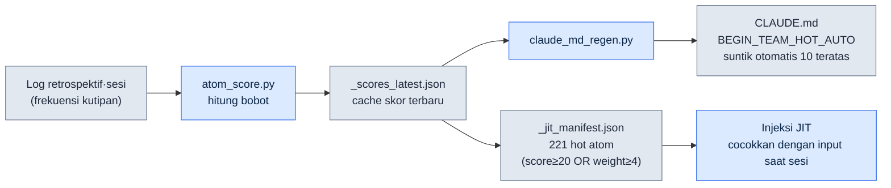
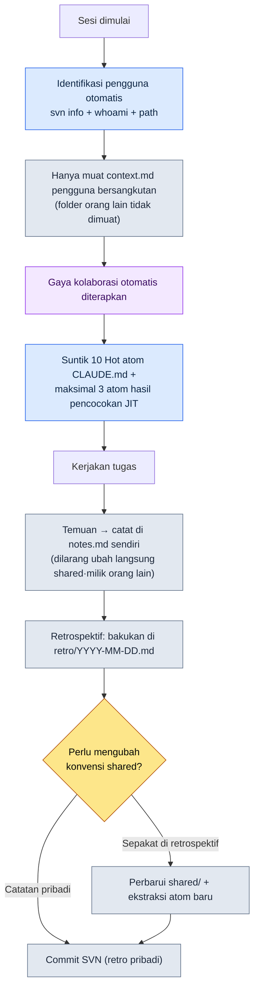

# 20.1 Seorang DD (Design Director) Solo Menjalankan Memori Kolaborasi untuk Lima Orang — Sistem team_memory

> Dalam bab ini, "DD" merujuk pada Design Director.

> Pembaca utama: direktur atau lead di tim kecil yang memikul sendiri seluruh konteks kolaborasi (tim berukuran menengah, 10–50 orang)
> Versi ringkas untuk pembaca solo/hobi: §20.1.7 "Kalau Anda Sendirian, Cukup Sebanyak Ini"

Suatu Senin pagi, saya pernah menjelaskan keputusan yang sama sebanyak tiga kali kepada tiga orang di ruang rapat yang sama. Kepada yang pertama saya bilang, "Untuk cooldown, lakukan SVN update dulu sebelum mengubah xlsm." Dua jam kemudian orang kedua menimpa file yang sama tanpa update sehingga terjadi konflik, dan sorenya orang ketiga menanyakan hal yang persis sama. Ketiganya orang baik. Masalahnya bukan pada mereka, melainkan pada kenyataan bahwa keputusan itu hanya ada di kepala saya. Seorang direktur di tim berukuran menengah mustahil menjalankan konteks kolaborasi untuk empat orang — siapa tahu aturan apa, siapa sering salah di mana, keputusan apa yang sudah diambil — secara konsisten hanya dengan ingatan manusia. Cukup berselang sebulan saja, pertanyaan "Bukankah ini sudah kita putuskan dulu?" sudah memakan separuh waktu rapat.

Bab ini membahas sistem yang mengakhiri masalah itu. Asetnya ada dua. Pertama, **304 decision card** (atom) yang dibagikan ke seluruh tim. Kedua, di atasnya terdapat **team_memory untuk lima orang** — repositori konteks per pengguna yang terbagi menjadi saya sendiri (leeminsoo), rekan tim A·B·C (nama samaran), serta folder shared. Pada awal sesi, Claude mengidentifikasi sendiri "siapa yang sedang duduk di depan keyboard saat ini", lalu hanya mengenakan gaya kolaborasi orang tersebut. Teori umum tentang memori kolaborasi sudah ada di buku lain. Bab ini hanya berfokus pada *tempat di mana AI secara otomatis mencabangkan dan menyuntikkan* memori itu.

Semua angka dalam bab ini adalah nilai terukur pada saat inventarisasi Mei 2026.

---

## 20.1.1 Kalau Keputusan Hanya Ada di Kepala, Tim Akan Mengulang Kesalahan yang Sama

Banyak buku menyelesaikan memori kolaborasi dengan "wiki bersama". Idenya: membuat halaman keputusan di Notion lalu semua orang melihatnya. Itu benar, tetapi wiki tidak bisa melakukan dua hal. Ia hanya terlihat saat orang memasukkan datanya, dan hanya terbaca saat orang mencarinya. Tidak ada yang di tengah rapat pergi bertanya, "Apa itu sudah dicatat di wiki?"

Karena itu saya membakukan keputusan menjadi **file unit atomik yang dapat dicari, dikutip, dan disuntikkan otomatis**. Saya menyebutnya atom. Satu atom adalah satu keputusan. Karena nama file sekaligus menjadi pengidentifikasi, ia bisa ditemukan dengan `rg`; karena frontmatter-nya terstandar, skrip bisa memprosesnya; dan karena isinya pendek, ia muat masuk utuh ke dalam konteks. Di bawah `workspace/team_memory/atoms/` pada PC kantor, tertumpuk 304 atom seperti ini.

| Folder | Jumlah | Sifat |
|---|---|---|
| `rules/` | 304 | Aturan pencegah kambuh (xlsm·SVN·dokumen·skill, dll.) |
| `concepts/` | 19 | Kosakata domain yang berulang muncul di retrospektif |
| `decisions/` | 26 | Keputusan dengan tanggal, pihak terkait, dan dasar pertimbangan yang jelas |
| `feedback/` | 11 | Loop koreksi kolaborasi (kesalahan → pelajaran) |
| `rnd/` | 4 | Observasi belum pasti yang bisa batal saat tool dipatch |

Totalnya 304. Kelima folder inilah "ingatan jangka panjang" tim. Poin pentingnya adalah nama folder sekaligus menjadi tingkat kepercayaan atom. `rules/` adalah aturan yang telah terverifikasi lewat banyak kambuh, sedangkan `rnd/` adalah observasi sementara yang bisa dibuang saat versi UE berubah. Bahkan di dalam memori yang sama, "yang pasti" dan "hipotesis" terpisah berdasarkan folder. Dengan demikian, secara struktural saya mencegah insiden anggota baru salah mengira metode pengakalan di `rnd/` sebagai aturan permanen.

> Definisi 5 atribut atom (prinsip satu keputusan, penamaan eksplisit, frontmatter terstandar, relasi eksplisit, dapat dilacak) telah dibahas di Bagian 5. Bab ini membahas bukan definisinya, melainkan *tempat lima orang menjalankan 304 atom secara bersama*.

---

## 20.1.2 Hot atom — Keputusan yang Sering Dipakai Mengapung ke Atas dengan Sendirinya

Mustahil membaca seluruh 304 atom setiap sesi. Karena itu saya memberi **score** (bobot) pada tiap atom, dan hanya yang berskor tinggi yang ditampilkan otomatis. Skornya dihitung `atom_score.py` berdasarkan frekuensi pemakaian, bobot manual, dan kebaruan. Berikut adalah score terukur dari 10 teratas berdasarkan pengukuran nyata Mei 2026.

| score | atom | Apa yang dipaksakan |
|---|---|---|
| 356.53 | `view_html_filename_convention` | Konvensi penamaan View_*.html (Phase/Status → Domain → Topic) |
| 349.26 | `xlsm_svn_update_before_edit` | SVN update sebelum mengubah xlsm + pertahankan baris yang sudah ada |
| 341.03 | `claude_role_transition_phase2` | Menaikkan Claude dari passive trainee → active partner (keputusan) |
| 340.26 | `skill_audit_score` | Pengukuran frekuensi pemakaian skill berbasis log SVN |
| 329.26 | `docs_is_source_of_truth` | Menjadikan workspace/docs sebagai sumber resmi |
| 326.84 | `claudeskills_naming_separation` | Memisahkan penamaan ClaudeSkills vs skill karakter dalam game |
| 324.36 | `draft_doc_body_verify_before_skip` | Dilarang skip hanya berdasarkan lokasi; evaluasi setelah grep isi |
| 309.43 | `json_over_schema_doc_as_source_of_truth` | Keluaran JSON sebenarnya lebih resmi daripada dokumen skema |
| 294.93 | `integrity_check_clickup_notify` | Beri tahu ClickUp seketika saat pemeriksaan integritas gagal |
| 293.26 | `data_entry_schema_first` | Urutan input data ($skema → Enum → proto) |

Lihat insiden yang saya jelaskan tiga kali di pembuka itu — "SVN update dulu sebelum mengubah xlsm". Itulah `xlsm_svn_update_before_edit`, dengan score 349.26, peringkat ke-2 secara keseluruhan. Score yang tinggi berarti aturan itu sering dikutip, sekaligus sering dilanggar. Saya tidak perlu lagi mengucapkannya tiga kali dengan mulut. 10 atom teratas berdasarkan score disuntikkan otomatis ke area `<!-- BEGIN_TEAM_HOT_AUTO -->` di `CLAUDE.md`, sehingga siapa pun yang membuka sesi dari folder mana pun akan langsung disuguhi di layar pertama.

Kalau berhenti di sini, ini sekadar "menyematkan aturan yang sering dilihat". Pembeda sesungguhnya adalah score ditetapkan bukan oleh tangan manusia, melainkan karena **sistem mengukur dirinya sendiri**.



Loop-nya tertutup. Semakin sering sebuah atom dikutip di retrospektif, score-nya naik; saat score naik, ia makin terlihat di bagian atas CLAUDE.md dan di manifes JIT; karena makin terlihat, ia makin sering dikutip lagi. Sebuah struktur di mana keputusan yang sering dipakai mengapung ke atas *dengan sendirinya*. Sebaliknya, atom yang tidak dikutip sama sekali selama 6 bulan akan tenggelam score-nya dan secara alami lenyap dari pandangan. Manusia tidak perlu memutuskan "Ini sudah tidak dipakai, mari turunkan".

---

## 20.1.3 Injeksi JIT — Satu Baris Input Menarik 3 Keputusan Terkait

Score menentukan "apa yang selalu terlihat", sedangkan injeksi JIT (Just-In-Time) menarik "apa yang cocok dengan yang baru saja diketik". Pada saat pengguna mengetik prompt, hook mencocokkan teks itu dengan regex di manifes atom, lalu menyelipkan atom terkait ke dalam konteks.

Logika inti hook ini mengikuti persis pola `inject_atom.py` pada PC kantor. Berikut adalah bagian inti sebenarnya dari `inject_memory.py`, pola yang sama yang ditulis ulang untuk PC pribadi — urutkan score menurun → cocokkan regex → maksimal 3 → potong di 6000 karakter, dan apa pun yang terjadi, exit 0.

```python
# Urutkan score menurun lalu cocokkan
atoms_sorted = sorted(atoms, key=lambda a: a.get("score", 0), reverse=True)

matches = []
for atom in atoms_sorted:
    if len(matches) >= max_matches:          # max_matches = 3
        break
    try:
        if re.search(atom["regex"], prompt, re.IGNORECASE):
            matches.append(atom)
    except re.error:
        continue                              # lewati regex yang salah lalu lanjutkan

if not matches:
    emit_empty()                              # jika tidak ada kecocokan, respons kosong (normal)
    return

chunks = []
for atom in matches:
    body = atom_path.read_text(encoding="utf-8")
    if len(body) > max_body:                  # max_body = 6000
        body = body[:max_body] + "\n\n[...truncated]\n"
    chunks.append(f"\n\n=== [JIT Inject] {name} (score {score}) ===\n\n{body}\n...")
```

Yang penting adalah desainnya konservatif. Jika tidak ada kecocokan, ia mengeluarkan respons kosong lalu selesai (normal). Jika regex-nya rusak, ia hanya melewati atom itu lalu terus berjalan. Jika isinya melampaui 6000 karakter, ia memotongnya. Dan seluruh hook berakhir dengan `exit 0` pada pengecualian apa pun — meski injeksi memori gagal, alur kerja pengguna sama sekali tidak akan terhenti. "Bila ada, bantu; bila tidak ada atau rusak, mundur dengan diam" adalah prinsip nomor satu sistem ini.

---

## 20.1.4 [Worked Transcript] Saat Sesi Dibuka, Claude Lebih Dulu Mencari Tahu "Siapa Anda"

Kalau yang sampai sini adalah atom (ingatan jangka panjang), sekarang giliran team_memory untuk lima orang (ingatan jangka pendek·kolaborasi per orang). Mari kita ikuti awal satu sesi nyata dari ujung ke ujung sebagai input → aksi → hasil. Latarnya PC kantor, situasinya rekan tim C (nama samaran, folder `팀원 C/`) membuka folder kerja Proyek A dari mejanya sendiri.

### Langkah 1 — Input: Satu baris prompt pertama yang biasa-biasa saja

Rekan tim C memulai pekerjaan tanpa ada yang istimewa.

```text
Mari lanjutkan meninjau draf sistem targeting yang kita putuskan kemarin.
```

Ia tidak menulis sepatah kata pun tentang siapa dirinya atau aturan apa yang harus diikuti. Memang tidak perlu menulisnya.

### Langkah 2 — Aksi: Claude mengidentifikasi pengguna secara otomatis

Sesuai prosedur "identifikasi otomatis saat sesi dimulai" di `CLAUDE.md`, sebelum menyusun jawaban Claude lebih dulu mencari tahu orang di depan keyboard. Perintah yang dijalankan ada tiga.

```bash
svn info --show-item last-changed-author   # author commit terakhir pada salinan kerja SVN
whoami                                      # akun login OS
# lalu path kerja saat ini (folder pengguna mana di PC mana)
```

Ketiga sinyal itu dicocokkan dengan pemetaan di `team_memory/users.md` lalu dipastikan sebagai `팀원 C` (rekan tim C). Setelah itu, Claude hanya memuat **satu folder pengguna itu saja**.

```text
team_memory/
├── atoms/                       ← bersama (304 atom, yang berskor tinggi sudah ada di CLAUDE.md)
├── leeminsoo/    context.md     ← (tidak dimuat — bukan saya)
├── teammate_a/   context.md     ← (tidak dimuat)
├── teammate_b/   context.md     ← (tidak dimuat)
├── teammate_c/   context.md     ← ★ hanya ini yang dimuat
│                 notes.md       ← ★ untuk mencatat temuan sendiri
│                 retro/
└── shared/       conventions.md  commit_rules.md  ...  ← hanya dirujuk, dilarang diubah
```

### Langkah 3 — Hasil: Gaya kolaborasi orang itu otomatis dikenakan

Gaya kolaborasi yang termuat di `팀원 C/context.md` diterapkan hanya pada sesi ini. Karena itu respons Claude dimulai begini.

```text
Teridentifikasi sebagai 팀원 C (svn author: teammate_c / path terverifikasi).
Gaya kolaborasi teammate_c/context.md berhasil dimuat.

Saya akan melanjutkan tinjauan pekerjaan kemarin (Draft_Targeting_System_v0.1.md).
Decision card terkait yang disuntikkan (JIT, 3 buah):
  - docs_is_source_of_truth (329.26)
  - draft_doc_body_verify_before_skip (324.36) — dilarang skip hanya berdasarkan lokasi, evaluasi setelah grep isi
  - decision_summary_not_clickup_mirror

Saya akan memeriksa isinya dengan grep lebih dulu, baru memulai tinjauan. Hal-hal
yang saya temukan saat meninjau hanya akan saya catat di teammate_c/notes.md, dan
saya tidak akan langsung mengubah shared/.
```

### Langkah 4 — Verifikasi manusia dan pengecekan batas

Di sini yang saya periksa (sebagai direktur, atau sebagai rekan tim C sendiri) ada dua hal. Apakah identifikasinya benar, dan apakah batasnya dipatuhi. Pada saran Claude berikutnya, saya menangkap satu pelanggaran batas.

```text
[Saran Claude]
Hasil tinjauan menemukan konflik aturan penamaan. Apakah perlu saya langsung
perbaiki entri istilah targeting di shared/conventions.md?

[Penolakan manusia]
Tidak. shared/ hanya diubah setelah ada kesepakatan retrospektif. Untuk sekarang
cukup catat di teammate_c/notes.md sebagai "konflik istilah targeting di
conventions.md — agenda retrospektif".

[Hasil setelah Claude diminta ulang]
Saya mengerti. Perubahan langsung pada shared/ dibatalkan.
Saya mencatatnya sebagai agenda retrospektif di teammate_c/notes.md:
  - 2026-06-06 konflik istilah targeting di conventions.md: 'lock-on' vs 'target-lock'
    → perlu kesepakatan di retrospektif tim berikutnya (perubahan shared ditunda)
```

Inilah pengaman operasi lima orang. Tiap pengguna hanya menulis **di notes.md miliknya sendiri**. Folder orang lain dan shared tidak boleh disentuh langsung. shared hanya berubah setelah disepakati di retrospektif. Karena itu, meski empat orang bekerja di atas memori yang sama, mereka tidak saling menimpa konteks satu sama lain. Temuan terkumpul dulu di catatan pribadi, lalu hanya bisa naik menjadi konvensi bersama tim setelah melewati gerbang bernama retrospektif.

---

## 20.1.5 Seluruh Alur Operasi Lima Orang dalam Satu Lembar

Mari lihat keseluruhan rute satu sesi yang berputar dalam satu lembar. Inilah satu siklus yang dimulai dari identifikasi dan berakhir dengan pembakuan di retrospektif.



Titik percabangan di kanan bawah adalah jantung sistem ini. Apa yang ditemukan individu mengalir ke notes pribadi, sedangkan konvensi dan atom baru yang berdampak pada seluruh tim hanya naik ke shared setelah melewati gerbang retrospektif. Alasan satu orang bisa menjalankan beban lima orang tanpa konflik terletak pada satu gerbang ini. Dan yang terakhir selalu harus commit SVN — sebab temuan yang tidak dibakukan akan kembali masuk ke kepala lagi pada sesi berikutnya.

---

## 20.1.6 Kegagalan Umum dan Penanganannya

Inilah ranjau-ranjau yang benar-benar saya injak saat menjalankan team_memory lima orang.

| Kegagalan | Gejala | Penanganan |
|---|---|---|
| Gagal identifikasi | svn author adalah akun bersama sehingga pengguna tak terspesifikasi | Petakan sinyal ganda path·akun di `users.md`, tanyakan bila tak terspesifikasi |
| Ubah shared tanpa izin | Claude dengan ramah memperbaiki konvensi bersama | Atom "shared hanya setelah sepakat di retrospektif" + pola penolakan dari worked transcript |
| notes tak di-commit | Temuan hanya tersisa di lokal lalu menguap di sesi berikutnya | Paksa commit SVN di penutup retrospektif (`feedback-svn-zero-red`) |
| Hot atom membeku | score berhenti sehingga aturan lama tersemat di atas | Jalankan `atom_score.py` secara berkala → perbarui `_scores_latest.json` |
| rnd disalahartikan sebagai aturan | Anggota baru menerapkan akal-akalan sementara seolah aturan permanen | Isolasi folder `rnd/` + cantumkan syarat pembatalan di frontmatter |

Kegagalan termahal di sini adalah baris kedua, "ubah shared tanpa izin". AI punya naluri kuat untuk membantu, sehingga begitu menemukan konflik ia langsung berusaha memperbaikinya. Penolakan dari worked transcript di §20.1.4 harus dibakukan menjadi atom, bukan sekadar koreksi sekali pakai, agar di sesi pengguna lain berikutnya pun garis yang sama tetap ditarik.

---

## 20.1.7 Kalau Anda Sendirian, Cukup Sebanyak Ini

Meski tanpa tim, 80% dari struktur ini bisa langsung dipakai seorang diri. Cukup susutkan lima pengguna menjadi satu folder.

- **Cukup 2 folder atom.** Pisahkan hanya `rules/` (yang pasti) dan `rnd/` (hipotesis). Hanya dengan membakukan 5–10 aturan yang sering Anda langgar menjadi atom, pertanyaan "Bukankah ini sudah kita putuskan dulu?" akan hilang.
- **JIT mulai tanpa score.** Cukup tulis regex di manifes dan biarkan score-nya seragam semua. Sekadar menyuntikkan 3 atom yang cocok pun sudah berdampak.
- **notes cukup satu file.** Cukup satu `notes.md` tanpa cabang pengguna. Hidupkan saja gerbang retrospektif — catatan dadakan ke notes, aturan yang sudah pasti naik ke `rules/` setelah melewati retrospektif.

Intinya adalah "memindahkan keputusan dari kepala ke file", dan baik lima orang maupun satu orang, aksinya sama.

---

### Coba Sendiri — Satu Langkah yang Bisa Anda Lakukan Hari Ini

Cobalah membakukan satu aturan yang sering Anda langgar menjadi atom, lalu membuatnya disuntikkan otomatis lewat JIT.

1. **setup** — Buat folder `atoms/rules/`, lalu tulis satu aturan yang paling sering Anda jelaskan berulang ke dalam sebuah file. Contoh: `atoms/rules/xlsm_svn_update_before_edit.md`.
2. **prompt** — Tulis tiga baris "kapan·apa·mengapa" di isi atom tersebut. ("Wajib SVN update sebelum mengubah xlsm — kalau tidak, baris orang lain akan tertimpa.")
3. **verify** — Tambahkan `{"name":..., "regex":"xlsm|쿨타임", "score":100, "path":...}` ke manifes JIT, lalu ketik prompt yang mengandung token "쿨타임" atau "xlsm" (mis. "쿨타임 수정" / ubah cooldown) agar cocok dengan regex, dan pastikan atom bersangkutan tercatat sebagai hit di `_injection_log.txt`.

Kalau tercatat, aturan itu sekarang tidak lagi ada di kepala Anda, melainkan di dalam sistem.

---

### Poin-Poin Penting

- Pindahkan keputusan dari kepala ke file atom, bukan ke ingatan.
- score·JIT mengapungkan keputusan yang sering dipakai dengan sendirinya.
- shared hanya berubah setelah melewati gerbang retrospektif.

### Pratinjau Bab Berikutnya

- 20.2 Memori per rekan tim — memisahkan kolom pengguna dan kolom bersama dengan tool, untuk mencegah insiden nilai eksperimen menyamar jadi keputusan
