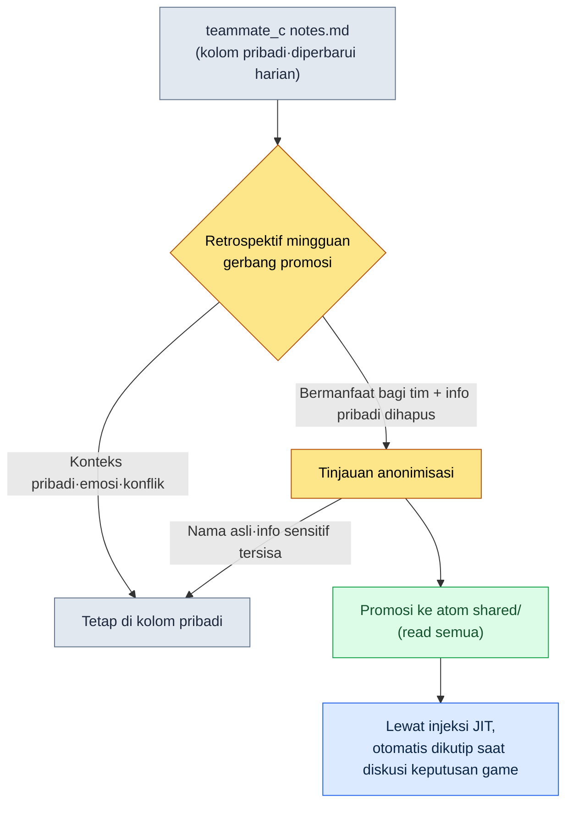

# 20.2 Memori per Anggota Tim — Memisahkan Kolom Pengguna dan Kolom Bersama

Sekitar jam makan siang hari Rabu, anggota tim B mengirim pesan lewat messenger tim. "Soal yang minggu lalu Direktur tetapkan, cooldown tempur 0.8 detik — di catatan saya tertulis 0.6 detik, mana yang benar?" Saya sejenak terdiam. 0.8 detik adalah keputusan bersama, sedangkan 0.6 detik adalah nilai yang sempat dijalankan anggota tim B di build pengujiannya sendiri. Keduanya tercatat di "memori". Masalahnya, keduanya tercampur dalam satu kolom yang sama. Anggota tim B mengira nilai eksperimennya sendiri sebagai keputusan perusahaan, dan nyaris saja memperbarui sheet data dengan nilai yang salah.

Insiden ini bukan terjadi karena memori tidak punya data. Justru sebaliknya, datanya tertumpuk dengan sangat rapi, tetapi tidak ada batas yang menandai kolom mana yang bersama dan kolom mana yang pribadi. Jika di §20.1 saya menggelar selling point bahwa lima orang melihat fakta yang sama (shared atom), bab ini membahas sisi sebaliknya — kisah bahwa **lima orang masing-masing memiliki kolomnya sendiri secara terpisah**. Lemari yang sama, tetapi kolomnya ada dua jenis. Dan jika kedua jenis itu tidak dipaksakan lewat alat, insiden 0.6 detik di atas pasti akan terjadi.

---

## 20.2.1 Lemari dengan Lima Kolom

`team_memory/` pada Proyek A terbagi menjadi kolom untuk lima orang. Termasuk diri saya (leeminsoo), lalu anggota tim A, anggota tim B, anggota tim C, dan `shared`. Empat yang pertama adalah kolom pribadi per pengguna, sedangkan yang terakhir adalah kolom bersama yang dibuka semua orang.

<svg viewBox="0 0 720 250" xmlns="http://www.w3.org/2000/svg" font-family="sans-serif" font-size="13">
  <rect x="10" y="10" width="700" height="230" fill="#fafafa" stroke="#ccc" rx="6"/>
  <text x="30" y="38" font-weight="bold" font-size="15">team_memory/  (1 lemari)</text>
  <!-- 개인 칸 4 -->
  <g>
    <rect x="30" y="60" width="150" height="160" fill="#eef4ff" stroke="#5a7fbf" rx="4"/>
    <text x="105" y="84" text-anchor="middle" font-weight="bold">leeminsoo/</text>
    <text x="105" y="106" text-anchor="middle" font-size="11" fill="#555">Direktur (diri sendiri)</text>
    <line x1="42" y1="118" x2="168" y2="118" stroke="#cdd" />
    <text x="105" y="140" text-anchor="middle" font-size="11">context.md</text>
    <text x="105" y="160" text-anchor="middle" font-size="11">notes.md</text>
    <text x="105" y="180" text-anchor="middle" font-size="11">+ strategi/evaluasi</text>
    <text x="105" y="205" text-anchor="middle" font-size="10" fill="#a33">proteksi tertinggi</text>
  </g>
  <g>
    <rect x="195" y="60" width="120" height="160" fill="#eef4ff" stroke="#5a7fbf" rx="4"/>
    <text x="255" y="84" text-anchor="middle" font-weight="bold">Anggota tim A/</text>
    <line x1="207" y1="118" x2="303" y2="118" stroke="#cdd" />
    <text x="255" y="140" text-anchor="middle" font-size="11">context.md</text>
    <text x="255" y="160" text-anchor="middle" font-size="11">notes.md</text>
  </g>
  <g>
    <rect x="330" y="60" width="120" height="160" fill="#eef4ff" stroke="#5a7fbf" rx="4"/>
    <text x="390" y="84" text-anchor="middle" font-weight="bold">Anggota tim B/</text>
    <line x1="342" y1="118" x2="438" y2="118" stroke="#cdd" />
    <text x="390" y="140" text-anchor="middle" font-size="11">context.md</text>
    <text x="390" y="160" text-anchor="middle" font-size="11">notes.md</text>
  </g>
  <g>
    <rect x="465" y="60" width="120" height="160" fill="#eef4ff" stroke="#5a7fbf" rx="4"/>
    <text x="525" y="84" text-anchor="middle" font-weight="bold">Anggota tim C/</text>
    <line x1="477" y1="118" x2="573" y2="118" stroke="#cdd" />
    <text x="525" y="140" text-anchor="middle" font-size="11">context.md</text>
    <text x="525" y="160" text-anchor="middle" font-size="11">notes.md</text>
  </g>
  <!-- 공유 칸 -->
  <g>
    <rect x="600" y="60" width="90" height="160" fill="#fff2e0" stroke="#c98a3a" rx="4"/>
    <text x="645" y="84" text-anchor="middle" font-weight="bold">shared/</text>
    <line x1="612" y1="118" x2="678" y2="118" stroke="#e3c">  </line>
    <text x="645" y="142" text-anchor="middle" font-size="11">atom</text>
    <text x="645" y="162" text-anchor="middle" font-size="11">(bersama)</text>
    <text x="645" y="205" text-anchor="middle" font-size="10" fill="#a33">read semua</text>
  </g>
</svg>

Keempat kolom pribadi saya warnai biru, dan satu kolom bersama saya warnai oranye. Alasan warnanya berbeda adalah karena aturan aksesnya berbeda. Kolom biru hanya dibuka oleh pemiliknya dan direktur, sedangkan kolom oranye dibuka semua orang. Insiden 0.6 detik terjadi karena anggota tim B menyebut nilai eksperimen yang seharusnya ditulis di kolom birunya sendiri begitu saja sebagai "memori" tanpa membedakan warna, lalu memperlakukannya seolah keputusan bersama. Jika kolom dipisahkan secara fisik — yaitu jika direktorinya dipisah — setidaknya muncul petunjuk untuk membedakan keduanya berdasarkan di mana sesuatu ditulis.

Inti di sini bukan dua folder, melainkan bahwa **setiap kolom membawa aturannya masing-masing**. Yang masuk ke `shared/` adalah keputusan perusahaan dan dibaca siapa pun. Yang masuk ke `Anggota tim B/` adalah konteks kerja orang itu dan hanya dibaca oleh dirinya dan saya. Walau angkanya sama-sama 0.6 detik, tergantung di kolom mana ia berada, statusnya terbelah antara "sedang dieksperimenkan" atau "sudah diputuskan".

---

## 20.2.2 Di Dalam Kolom Satu Orang Ada Dua Berkas

Saat membuka kolom per pengguna, terlihat dua berkas. `context.md` dan `notes.md`. Namanya sederhana, tetapi perannya berlawanan.

`context.md` mencatat **siapa orang itu sekarang**. Peran, sistem yang ditangani, pekerjaan yang sedang berjalan, gaya kerja. Relatif stabil, dan inilah berkas yang saya — sebagai direktur — buka lima menit sebelum sesi 1:1. Jika saya membuka `context.md` anggota tim A, di sana tertulis hal seperti "menangani sistem tempur, sedang melakukan balancing cooldown skill, bergaya menuntut dasar data lebih dulu". Kalau masuk ke sesi 1:1 tanpa melihat ini, 10 menit pertama terbuang untuk pertanyaan "Lagi ngerjain apa belakangan ini?".

`notes.md` mencatat **apa yang sedang dialami orang itu sekarang**. Nilai eksperimen hari demi hari, titik buntu, keputusan kecil, catatan kesalahan, memo hasil diskusi dengan anggota lain. Sifatnya mudah menguap dan sering diperbarui. 0.6 detik milik anggota tim B aslinya harus masuk ke sini. Seperti: "Dites dengan 0.6 detik, terlalu cepat sehingga input ketinggalan — diputuskan mengikuti keputusan bersama 0.8 detik."

Alasan kedua berkas ini dipisah adalah karena siklus pembaruannya berbeda. `context.md` cukup disentuh sekali per kuartal, tetapi `notes.md` menumpuk setiap hari. Kalau dicampur, informasi yang stabil akan terkubur oleh derau harian. Jika Anda bekerja sendirian, pemisahan ini mungkin terlihat berlebihan — pada kasus itu Anda boleh menjalankan `notes.md` saja dan menyimpan `context.md` di kepala. Namun, begitu jumlah orang melebihi dua, bisa membaca `context.md` orang lain dalam lima menit untuk menyiapkan sesi 1:1 sudah merupakan perbedaan yang besar.

---

## 20.2.3 Gerbang Tempat Retrospektif Naik ke shared

Memisahkan kolom pribadi dan kolom bersama belum berarti selesai. Yang paling rumit adalah bahwa **sebagian isi kolom pribadi harus naik ke kolom bersama**. Misalkan anggota tim C menulis kesalahan "saat mengimpor sheet data, jika urutan enum tidak cocok, runtime akan rusak diam-diam" ke `notes.md` miliknya. Ini adalah catatan pribadi orang itu, tetapi jika seluruh tim mengetahuinya, kesalahan yang sama bisa dicegah. Walau begitu, seluruh `notes.md` pribadi tidak boleh dibagikan — di sana tercampur hal seperti gaya kerja, emosi saat menemui jalan buntu, dan konflik dengan anggota lain.

Karena itu, di antara pribadi → bersama harus ada **gerbang**. Retrospektif adalah gerbang itu. Saat menulis retrospektif, kita menyaring sekali "dari yang saya alami minggu ini, apa yang perlu diketahui tim", dan hanya yang lolos saringan itu yang dipromosikan menjadi atom `shared/`. Alurnya seperti ini.

Kriteria penilaian gerbang ada dua. **Pertama, apakah bermanfaat bagi tim.** Bukan selera pribadi atau kondisi badan hari itu. Kedua, **apakah informasi pribadinya dihapus.** Bukan "anggota tim C kembali salah di enum", melainkan hanya menyisakan fakta sebagai "tambahkan validasi urutan enum saat mengimpor sheet data". Hanya yang lolos dua gerbang itu yang menuju `shared/`. Yang tidak lolos dibiarkan apa adanya di kolom pribadi.

Tanpa gerbang ini, kita gagal dalam salah satu dari dua arah. Jika gerbang terlalu longgar, informasi pribadi bocor ke kolom bersama dan terjadi kebalikan dari insiden 0.6 detik — yaitu insiden memo pribadi terekspos ke semua orang. Jika gerbang sama sekali tidak ada, pelajaran enum dari anggota tim C terkurung di kolomnya sendiri dan anggota tim A mengulangi kesalahan yang sama. Dengan memakai retrospektif sebagai gerbang, dua hal yang berlawanan — "kebocoran informasi pribadi" dan "pengubahan menjadi aset pembelajaran" — dapat dipisahkan dalam satu gerakan.

Prompt promosi yang saya pakai sebenarnya pendek. Tepat setelah retrospektif, saya melontarkan ini.

> "Pilih dari notes.md saya minggu ini hanya butir yang bermanfaat bagi seluruh tim. Pada tiap butir, buang nama orang dan situasi kegagalan yang spesifik, lalu tulis ulang sebagai kalimat kandidat atom yang hanya menyisakan 'apa dan bagaimana'. Memo emosi pribadi·gaya·konflik dikeluarkan dari kandidat, dan tuliskan alasan pengeluarannya dalam satu baris."

Kalimat terakhir — yang membuatnya mencatat alasan pengeluaran — itu penting. Jika AI menunjukkan apa yang tidak dinaikkannya, manusia bisa memeriksa apakah gerbangnya terlalu ketat hingga menghalangi pelajaran yang sebenarnya berharga.

---

## 20.2.4 Worked Transcript — Saat Gerbang Promosi Ditolak

Gerbang tidak selalu bekerja dengan rapi. Pada praktiknya terjadi bolak-balik: AI tidak tepat dalam sekali coba, manusia menolak, lalu meminta ulang. Saya pindahkan apa adanya bolak-balik nyata ketika hendak menaikkan `notes.md` anggota tim B selama satu minggu ke shared.

**[Prompt — Tahap 1]**

> "Berikut adalah notes.md anggota tim B minggu ini. Pilih hanya butir yang bermanfaat bagi seluruh tim sebagai kandidat shared atom. Hapus nama orang dan situasi kegagalan yang spesifik, dan sisakan hanya 'apa dan bagaimana'.
> ---
> - Sel/uji cooldown 0.6 detik, input ketinggalan. Ikut keputusan bersama 0.8 detik
> - Rab/enum skill yang dibuat anggota tim A bentrok dengan import saya. Agak sungkan ngomong langsung ke anggota tim A, jadi disampaikan lewat direktur
> - Kam/View_skill_table.html di portal web, kalau di-refresh filternya ke-reset. Kesal
> - Jum/kondisi badan kurang fit, ambil setengah hari cuti sore"

**[Keluaran mentah Claude — Tahap 1]**

> Saya mengekstrak 4 butir berikut sebagai kandidat shared atom.
> 1. Cooldown tempur menyebabkan input ketinggalan pada 0.6 detik, sehingga 0.8 detik dijadikan acuan.
> 2. Karena enum skill yang dibuat anggota tim A bentrok dengan import, perlu dibagikan terlebih dahulu saat enum diubah.
> 3. View_skill_table.html me-reset status filter saat di-refresh, sehingga diperlukan fitur penyimpanan status.
> 4. (Dikeluarkan) Cuti setengah hari Jumat sore — dinilai sebagai jadwal pribadi sehingga dikeluarkan.

Di sini saya **menolak butir nomor 2.** Frasa "yang dibuat anggota tim A" masih tersisa apa adanya. Nama orang memang dibuang, tetapi "enum buatan siapa" jadi terspesifikasi, dan lebih dari itu, *konteks konflik pribadi* berupa "sungkan ngomong langsung, jadi disampaikan lewat direktur" menjelma menjadi butir fakta. Ini bukan aset pembelajaran, melainkan isu relasi yang harus ditangani terpisah di sesi 1:1. Jika dinaikkan apa adanya ke shared, anggota tim A akan melihat catatan bentrokan yang mencantumkan namanya sendiri di kolom bersama.

**[Verifikasi/penolakan manusia → permintaan ulang]**

> "Nomor 2 ditolak. Bentrokan enum memang layak disisakan sebagai fakta, tetapi informasi bahwa orang tertentu yang membuatnya dan jalur penyampaiannya (lewat siapa disampaikan) adalah ranah relasi pribadi. Buang keduanya dan tulis ulang hanya sebagai 'prosedur untuk mencegah bentrokan data'. Lalu, bug portal web nomor 3 adalah butir yang seharusnya masuk ke pelacak isu portal, bukan atom, jadi keluarkan dari kandidat dan tuliskan alasannya."

**[Keluaran mentah Claude — Tahap 2]**

> Sudah diperbaiki.
> 2. (Revisi) Saat mengubah enum skill, bagikan terlebih dahulu dengan pekerja lain yang mengimpor sheet data. Perubahan urutan·nilai enum bisa rusak diam-diam di sisi import.
> 3. (Dikeluarkan) Reset filter View_skill_table.html — karena ini bug alat, butir isu portal lebih tepat daripada shared atom, sehingga dikeluarkan dari kandidat.
> Kandidat promosi shared final: nomor 1 (cooldown 0.8 detik), nomor 2 (berbagi awal saat ubah enum). 2 butir.

Tahap 2 saya loloskan. Pada nomor 2, baik orang maupun jalur penyampaian sudah hilang dan hanya tinggal prosedur. Dimulai dengan 4 butir, 2 butir naik ke shared, 1 butir tetap di kolom pribadi (cuti) dan 1 butir terpisah menuju isu portal (bug filter). Inilah wujud gerbang yang benar-benar bekerja — tidak selesai sekali coba, manusia menolak satu kali, dan tertinggal sebagai catatan apa yang dikeluarkan dan mengapa. Kalau diringkas memang terlihat rapi, tetapi jika hanya melihat ringkasan yang rapi, fakta bahwa nomor 2 nyaris naik dengan membawa nama orang di awal jadi terhapus. Risiko itulah alasan keberadaan gerbang ini.

---

## 20.2.5 Injeksi JIT — Kolom Mana yang Dibuka Itulah Antarmukanya

Sudah memisahkan kolom dan mendirikan gerbang pun, jika setiap kali berdialog kita harus membuka kolom secara manual, operasionalnya berat. Karena itu, kepingan terakhir adalah **kolom yang sesuai dengan konteks dialog terbuka secara otomatis**. Di PC saya sendiri, hal ini dilakukan oleh hook UserPromptSubmit (`inject_memory.py`). Ia hanya memilih kolom yang cocok dengan kalimat masukan dan menyuntikkannya ke konteks.

Aturannya sederhana. Saat mendiskusikan keputusan game, atom `shared/` terbuka. Saat menyiapkan sesi 1:1 dengan anggota tim tertentu, `context.md` orang itu + `shared` terbuka bersama. Saat menulis retrospektif kuartal, memori proyek + kolom direktur sendiri terbuka. Saat menulis laporan eksternal, kolom direktur + sebagian shared terbuka. Kolom mana yang dibuka itulah antarmuka dari memori.

Di sinilah pemisahan kolom kembali berdaya. Saat menyiapkan sesi 1:1, kolom pribadi anggota tim B terbuka tetapi kolom pribadi anggota tim C tidak — karena tidak ada kaitannya dengan dialog saat ini. Jika kolom tidak dipisahkan, setiap kali semuanya terbuka dan terkubur dalam derau, dan yang lebih buruk, memo pribadi orang yang tidak relevan ikut terseret keluar di tengah sesi 1:1. Pemisahan adalah keamanan sekaligus akurasi injeksi.

---

## 20.2.6 Data yang Sama, Banyak PC — Tempat Mencegah Insiden Sinkronisasi

Walau struktur kolom sudah tertata, masih tersisa satu jebakan terakhir. Saya berpindah-pindah antara PC rumah dan PC kantor, dan memori disinkronkan lewat folder cloud. Di sini, jika dua PC mengubah kolom yang sama secara bersamaan, terjadi konflik. Jika satu sisi menimpa sisi lain secara utuh, `notes.md` hari itu akan lenyap.

Penanganannya berbeda per kolom. `notes.md` pribadi yang sering diperbarui ditaruh di repositori yang dapat di-merge seperti git, dan saat konflik kedua sisi digabungkan. `context.md` yang stabil atau atom `shared/` jarang diperbarui, sehingga cukup dengan penguncian atau pencadangan harian. Intinya adalah mengeluarkan "perilaku sinkronisasi menimpa satu sisi" dari nilai bawaan. Insiden tersinkronnya kolom pribadi yang tercampur ke folder bersama akibat izin folder yang salah — itulah insiden yang paling sunyi dan paling fatal. Jika kita menandai dengan jelas tiap kolom termasuk ke wilayah sinkronisasi mana, insiden "tercampur" yang sejenis dengan insiden 0.6 detik dapat dicegah di pintu masuk.

---

## Coba Sendiri

**setup**
1. Buat folder per orang di bawah `team_memory/`. Diri sendiri + tiap anggota tim, lalu satu `shared/`. Nama folder pakai nama samaran (leeminsoo, Anggota tim A …).
2. Pada tiap folder pribadi, taruh dua berkas: `context.md` (stabil — peran·tanggung jawab·gaya) dan `notes.md` (mudah menguap — eksperimen·kesalahan·keputusan harian).
3. Tetapkan izin folder secara eksplisit: `shared/` izin read untuk semua, folder pribadi izin read untuk pemiliknya + direktur.

**prompt** (tepat setelah retrospektif mingguan, gerbang promosi pribadi → shared) — gunakan apa adanya prompt promosi dari §20.2.3 (buang nama orang·situasi kegagalan + sisakan hanya 'apa dan bagaimana' + tuliskan alasan pengeluaran).

**verify**
1. Baca sendiri apakah pada kalimat kandidat yang dikeluarkan masih tersisa nama orang·jalur penyampaian·deskripsi emosi. Jika ada satu saja, tolak dan minta ulang dengan "buang informasi itu dan sisakan hanya prosedurnya".
2. Hanya kandidat yang lolos yang dipindahkan ke atom `shared/`, dan butir yang dibuang dibiarkan apa adanya di kolom pribadi.
3. Periksa izin folder sinkronisasi — pastikan kolom pribadi tidak masuk ke dalam jalur folder bersama.

**Versi Ringkas Solo**
Jika sendirian, lima folder itu berlebihan. Tulis saja `notes.md` satu setiap hari, dan simpan `context.md` di kepala. Meski begitu, gerbangnya tetap dihidupkan — saring catatan Anda sendiri seminggu sekali dengan "dari notes ini, pilih hanya satu baris yang layak dilihat lagi lain kali", maka memo yang mudah menguap dan pelajaran yang menjadi aset akan terbelah. Saat jumlah orang bertambah menjadi dua, barulah pecah kolomnya saat itu.

---

### Poin-Poin Penting

- Lemari memori terbagi menjadi kolom pribadi per pengguna dan kolom bersama yang dibuka semua orang, dan jika dua kolom berbeda warna ini tidak dipaksakan lewat alat, nilai eksperimen akan menjelma menjadi keputusan.
- Di jalur menaikkan pelajaran dari kolom pribadi ke bersama ada gerbang bernama retrospektif, yang memisahkan pengubahan menjadi aset pembelajaran dan kebocoran informasi pribadi dalam satu gerakan.
- Injeksi JIT hanya membuka kolom yang sesuai dengan konteks dialog, sehingga membuat pemisahan kolom bekerja sekaligus sebagai keamanan dan akurasi injeksi.

### Pratinjau Bab Berikutnya

- 20.3 Membangun Portal Web — antarmuka terpadu untuk mengakses alat dan kolom yang tersebar dari satu layar
