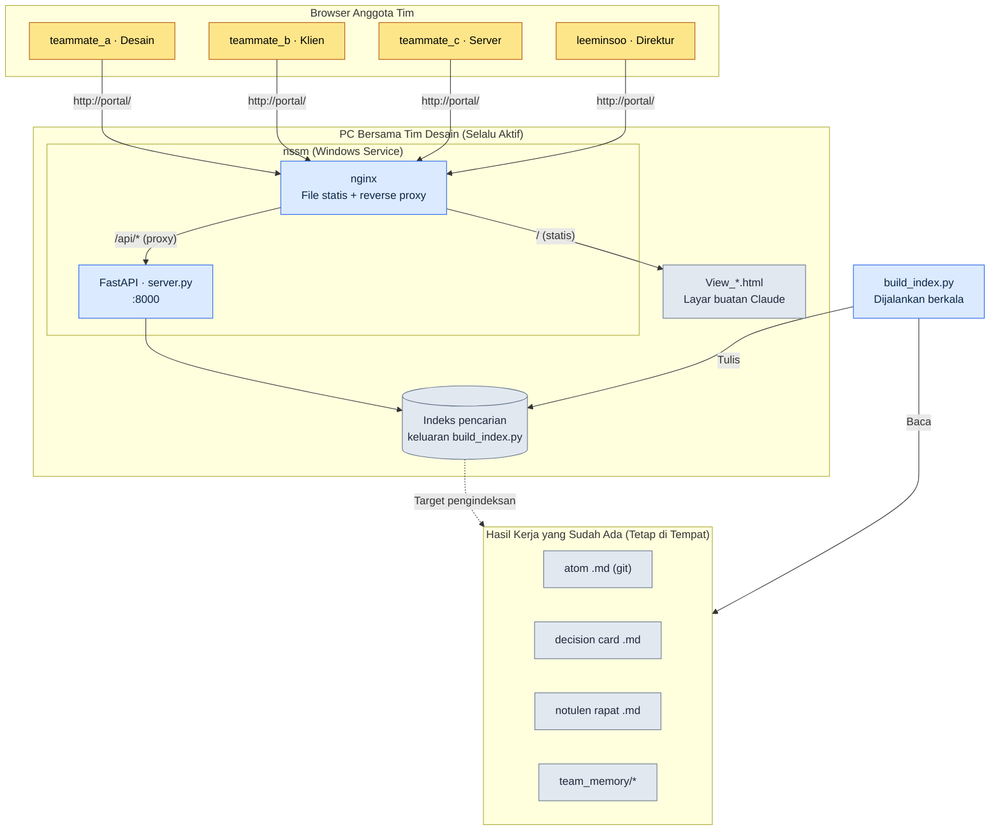

# 20.3 Portal Desain — Pintu Masuk Tim Lewat Browser

Kamis sore menjelang malam, tepat sebelum mengunggah build, anggota tim B yang seorang client programmer menulis di chat internal. "Konstanta global cooldown yang disepakati di TF Combat minggu lalu itu 0.8 detik, kan? Tercatat di dokumen yang mana, ya?" Lima menit kemudian, anggota tim A yang seorang Game Designer menjawab. "Mestinya ada di salah satu notulen rapat… lagi saya cari." Tujuh menit kemudian lagi. "Ini di folder git yang mana, ya."

Bolak-balik selama 12 menit ini bukan terjadi karena informasinya tidak ada. Informasinya jelas ada. Tercatat di file atom, di notulen rapat, juga di decision card (kartu keputusan). Hanya saja ketiganya berada di laci yang berbeda, dan cara membuka tiap laci pun berbeda. Yang jadi masalah bukan lacinya, melainkan pegangan untuk membuka laci itu.

Bab ini bercerita tentang menyatukan pegangan-pegangan itu menjadi satu. Bukan dengan mengembangkan full-stack sendiri, melainkan dengan menutupi tumpukan hasil kerja desain yang sudah ada di folder dengan satu lapisan web tipis, sehingga anggota tim cukup mengetik satu kata `portal` di address bar browser untuk masuk. Alat intinya hanya tiga. FastAPI yang menjalankan search API dengan Python, nginx yang berdiri di depannya, dan nssm yang menjaga agar PC tetap hidup selama menyala tanpa perlu seseorang mematikannya secara manual.

---

## 20.3.1 Hasil Kerja yang Tersebar, Pintu Masuk yang Disatukan

Hasil kerja desain pada dasarnya memang tersebar. Bukan karena sengaja disebar, melainkan karena tiap hasil kerja jatuh ke tempat yang paling alami baginya. atom pergi ke markdown di repositori git, jadwal ke alat manajemen task, percakapan real-time ke chat, dan KPI ke dashboard tersendiri. Bahwa masing-masing berada di tempatnya sendiri itu benar. Masalahnya, seseorang harus menyimpan peta lokasi-lokasi itu di dalam kepalanya.

Bagi anggota baru, peta inilah yang justru menjadi penghalang masuk. Untuk mencari "nilai global cooldown", ia harus (1) menentukan apakah itu decision card, atom, atau notulen rapat, (2) membuka alat yang bersangkutan, lalu (3) melakukan kueri ulang dengan sintaks pencarian alat tersebut. Ketiga langkah ini adalah pengetahuan tersirat yang hanya datang dari pengalaman.

Gagasan portal ini sederhana. Hasil kerja dibiarkan tetap pada tempatnya sekarang. Sebagai gantinya, di atasnya ditumpangkan satu lapisan indeks untuk pencarian, lalu indeks itu diekspos lewat browser. Bukan menyediakan tujuh meja, melainkan satu meja dengan tujuh laci. Lacinya tetap sama, tetapi orang hanya duduk satu kali.

Berikut adalah susunan portal yang saya jalankan secara nyata di Proyek A. Tanpa perangkat server terpisah, portal ini berjalan dalam keadaan selalu menyala di satu PC bersama milik tim desain.



Pada gambar, bagian bawah yang dikelompokkan dengan warna abu-abu adalah hasil kerja yang sudah ada sebelumnya, dan yang baru ditambahkan portal hanyalah tiga lapisan tipis di bagian atas — indeks, FastAPI, dan nginx. Inilah struktur yang hanya membuat pintu masuk baru tanpa menyentuh hasil kerjanya.

---

## 20.3.2 Empat Komponen: build_index.py · server.py · nginx · nssm

Wujud sebenarnya dari portal ini tuntas hanya dengan lima file kecil. Jika dilihat satu per satu, masing-masing hanya melakukan satu pekerjaan.

**build_index.py — mengubah hasil kerja menjadi bentuk yang bisa dicari.** Skrip ini menelusuri repositori git, membaca seluruh markdown atom, decision card, notulen rapat, dan yang ada di bawah `team_memory/`, lalu mengekstrak judul, isi, dan tag untuk menumpahkannya ke dalam satu file indeks. Yang dilakukan skrip ini hanyalah "meratakan file-file yang tersebar menjadi record satu baris". Karena file itu sendiri tidak disentuh, sumber aslinya tetap aman meski indeksnya rusak. Jika dijalankan ulang secara berkala (misalnya tiap 30 menit, atau lewat git commit hook), keadaan terbaru akan terus terjaga.

**server.py — menjalankan search API dengan FastAPI.** Skrip ini memuat indeks ke memori, dan ketika ada permintaan `/api/search?q=...`, ia mengembalikan record yang cocok dalam bentuk JSON. Kodenya tidak sampai melebihi satu layar.

```python
# server.py (kutipan — kerangka endpoint pencarian)
from fastapi import FastAPI
import json, pathlib

app = FastAPI()
INDEX = json.loads(pathlib.Path("index.json").read_text(encoding="utf-8"))

@app.get("/api/search")
def search(q: str):
    q = q.strip().lower()
    hits = [r for r in INDEX
            if q in r["title"].lower() or q in r["body"].lower()]
    # Dikelompokkan menurut jenis lalu dikembalikan → atom / keputusan / notulen / memori
    by_kind = {}
    for r in hits:
        by_kind.setdefault(r["kind"], []).append(
            {"id": r["id"], "title": r["title"], "path": r["path"]})
    return {"query": q, "count": len(hits), "results": by_kind}
```

Algoritma pencarian sengaja dimulai dengan pencocokan substring yang sederhana. Saat tim berukuran sedang (10\~50 orang) dan jumlah dokumen mencapai skala ribuan, kesederhanaan inilah yang justru menurunkan biaya pemeliharaan. Analisis morfologis atau pencarian vektor tidak terlambat untuk ditumpangkan belakangan, yaitu setelah keluhan "pencariannya lemah" benar-benar muncul.

**nginx — menyajikan layar statis dan mem-proxy ke API.** File `View_*.html` yang dibuat dengan meminta tolong Claude (layar pencarian, layar hasil, layar dashboard) disajikan secara statis, dan hanya permintaan yang masuk lewat `/api/` yang diteruskan ke FastAPI di belakang (:8000). Dari sudut pandang anggota tim, baik layar maupun pencarian semuanya terjadi pada satu alamat yang sama, `http://portal/`. Karena layarnya digambar langsung oleh Claude dalam bentuk HTML, ketika seorang Game Designer butuh layar baru, ia cukup meminta "buatkan satu layar yang hanya mengumpulkan decision card", menerima `View_decisions.html`, dan menumpahkannya ke folder — selesai. Tidak adanya pipeline build front-end jelas menjadi keunggulan pada tim berukuran sedang.

**nssm — menjaganya tetap hidup tanpa perlu dinyalakan seseorang.** Kebutuhan inti portal adalah "anggota tim harus bisa mencari meskipun saya sedang tidak di tempat". Jika server.py dijalankan dari terminal, ia akan mati begitu terminal itu ditutup, dan lenyap ketika PC di-reboot. nssm (Non-Sucking Service Manager) mendaftarkan proses Python ini sebagai Windows Service, sehingga proses akan otomatis hidup saat PC booting dan otomatis bangkit kembali jika prosesnya mati. Pendaftaran cukup sekali saja.

```powershell
# Mendaftarkan FastAPI sebagai Windows Service dengan nssm (1 kali)
nssm install Portal "C:\Python\python.exe" "C:\portal\portal_run.py"
nssm set Portal AppDirectory "C:\portal"
nssm start Portal
```

Di sini `portal_run.py` adalah launcher lima baris. Isinya hanya satu baris yang menjalankan server.py dengan uvicorn, plus kerangka minimal agar service tidak mati. Perintah yang harus dihafal seseorang hanyalah satu, `nssm start`, dan itu pun tak perlu diketik lagi setelah didaftarkan sekali.

Pembagian tugas keempat komponen ini, jika dilihat sekilas, tampak seperti berikut.

<svg xmlns="http://www.w3.org/2000/svg" viewBox="0 0 720 250" font-family="sans-serif" font-size="13">
  <rect x="0" y="0" width="720" height="250" fill="#fbfbfd"/>
  <!-- columns -->
  <g>
    <rect x="20" y="40" width="150" height="170" rx="8" fill="#eef4ff" stroke="#5b8def"/>
    <text x="95" y="65" text-anchor="middle" font-weight="bold" fill="#244">build_index.py</text>
    <text x="95" y="92" text-anchor="middle" fill="#345">Hasil kerja → indeks</text>
    <text x="95" y="112" text-anchor="middle" fill="#345">Ratakan·tagging</text>
    <text x="95" y="148" text-anchor="middle" fill="#789" font-size="11">Sumber tak diubah</text>
    <text x="95" y="168" text-anchor="middle" fill="#789" font-size="11">Jalankan ulang berkala</text>
  </g>
  <g>
    <rect x="200" y="40" width="150" height="170" rx="8" fill="#eafaf0" stroke="#3aa76d"/>
    <text x="275" y="65" text-anchor="middle" font-weight="bold" fill="#244">server.py</text>
    <text x="275" y="92" text-anchor="middle" fill="#345">FastAPI :8000</text>
    <text x="275" y="112" text-anchor="middle" fill="#345">/api/search</text>
    <text x="275" y="148" text-anchor="middle" fill="#789" font-size="11">Pengelompokan per jenis</text>
    <text x="275" y="168" text-anchor="middle" fill="#789" font-size="11">Kembalikan JSON</text>
  </g>
  <g>
    <rect x="380" y="40" width="150" height="170" rx="8" fill="#fff5e9" stroke="#e08a3c"/>
    <text x="455" y="65" text-anchor="middle" font-weight="bold" fill="#244">nginx</text>
    <text x="455" y="92" text-anchor="middle" fill="#345">Sajikan View_*.html</text>
    <text x="455" y="112" text-anchor="middle" fill="#345">Proxy /api/</text>
    <text x="455" y="148" text-anchor="middle" fill="#789" font-size="11">Alamat tunggal</text>
    <text x="455" y="168" text-anchor="middle" fill="#789" font-size="11">Tanpa pipeline build</text>
  </g>
  <g>
    <rect x="560" y="40" width="150" height="170" rx="8" fill="#f6eefe" stroke="#8a5be0"/>
    <text x="635" y="65" text-anchor="middle" font-weight="bold" fill="#244">nssm</text>
    <text x="635" y="92" text-anchor="middle" fill="#345">Windows Service</text>
    <text x="635" y="112" text-anchor="middle" fill="#345">Auto-aktif saat booting</text>
    <text x="635" y="148" text-anchor="middle" fill="#789" font-size="11">Bangkit jika mati</text>
    <text x="635" y="168" text-anchor="middle" fill="#789" font-size="11">Jaminan selalu aktif</text>
  </g>
  <text x="360" y="232" text-anchor="middle" fill="#456" font-size="12">Alur data: hasil kerja → indeks → API → layar → browser (dari kiri ke kanan)</text>
</svg>

---

## 20.3.3 Satu Adegan Saat Tim Benar-Benar Mencari

Penjelasan komponen saja tidak membuat nilai portal terasa. Mari kita lemparkan lagi pertanyaan yang tadinya menyita 12 menit itu, kali ini di atas portal. Berikut adalah prompt yang saya lemparkan ke Claude saat membuat layar pencarian, keluaran yang saya terima, beserta proses verifikasinya, disalin tanpa dipadatkan.

Prompt saya:

> Buatkan satu halaman HTML tunggal yang melakukan fetch `index.json` lalu mencari. Ketika sebuah kata kunci diketik di kolom input, panggil `/api/search?q=`, lalu tampilkan hasilnya dalam bentuk kartu yang dibagi ke empat grup: atom / decision card / notulen rapat / memori. Saat tiap hasil diklik, pindah ke path sumber asli (`path`). Jangan gunakan framework CSS·JS eksternal, cukup satu file. Nama file `View_search.html`.

Keluaran mentah dari Claude (kutipan, persis seperti yang saya terima):

```html
<!-- View_search.html -->
<input id="q" placeholder="atom atau kata kunci">
<div id="out"></div>
<script>
document.getElementById('q').addEventListener('keydown', async e => {
  if (e.key !== 'Enter') return;
  const r = await fetch('/api/search?q=' + encodeURIComponent(e.target.value));
  const d = await r.json();
  const order = ['atom','decision','meeting','memory'];
  const label = {atom:'atom', decision:'decision card',
                 meeting:'notulen rapat', memory:'memori'};
  out.innerHTML = order.filter(k => d.results[k]).map(k =>
    `<h3>${label[k]} (${d.results[k].length})</h3>` +
    d.results[k].map(x =>
      `<a href="${x.path}">${x.title}</a>`).join('<br>')
  ).join('') || 'Tidak ada hasil';
});
</script>
```

Keluaran ini bukan produk jadi. Saya tidak menerimanya begitu saja, dan menolak dua bagian.

Pertama, bagian yang memakai `out` seperti variabel global tanpa `getElementById` adalah kode berbahaya yang bergantung pada kebiasaan browser — pada sebagian lingkungan ia tidak berfungsi. Kedua, karena `path` adalah path internal git, jika dimasukkan langsung ke `href`, browser tidak akan bisa membuka file itu. Harus diperbaiki agar portal me-route ulang path tersebut ke layarnya sendiri dengan melewati `/view?path=`.

Permintaan ulang saya:

> Perbaiki dua hal. (1) Terima `out` secara eksplisit dengan `document.getElementById`. (2) Jangan biarkan link hasil langsung menuju path sumber asli, melainkan lewatkan dulu melalui viewer endpoint `/view?path=`. Viewer-nya akan saya tambahkan di server.py, jadi di sisi front cukup ubah link-nya saja.

Bolak-balik inilah yang jadi intinya. Keluaran pertama Claude sudah 80% benar, tetapi 20% sisanya adalah cacat yang hanya bisa ditangkap kalau seseorang tahu konteks bahwa "portal ini ditumpangkan di atas hasil kerja git". Verifikasi tetap menjadi bagian tugas manusia.

Sekali pencarian dijalankan, di layar anggota tim muncul hasil yang dikelompokkan seperti ini.

| Grup | Hasil untuk kata pencarian "global cooldown" |
|---|---|
| atom | `combat_global_cooldown_constant` |
| decision card | `D2026_Q2_017` (ditetapkan 0.8 detik) |
| notulen rapat | `95_BattleTF` sesi ke-2 |
| memori | Catatan 1:1 anggota tim B, 1 entri |

Bolak-balik 12 menit di Kamis sore itu menyusut menjadi 20 detik mengetik satu kata di kolom pencarian. Dan yang lebih penting, 20 detik ini menjadi pekerjaan yang bisa diselesaikan sendiri oleh anggota tim B, sehingga 12 menit dari anggota tim A sama sekali tidak terpakai.

---

## 20.3.4 Biaya dan Efek — Seberapa Jauh Layak Dibangun

Cara membangun portal pada dasarnya ada tiga. Mengembangkan full-stack sendiri dari nol, mengadopsi alat integrasi eksternal seperti Notion·Coda, atau seperti sekarang menumpangkan otomatisasi tipis di atas alat dasar. Saya memilih yang ketiga, dan dasar pilihan itu terletak pada skala, yakni tim berukuran sedang.

Pengembangan full-stack sendiri memang punya kebebasan paling tinggi, tetapi beban untuk terus memelihara web itu setelah dibuat datang lebih dulu daripada efeknya. Pekerjaan operasional seperti autentikasi, deployment, dan migrasi DB jatuh ke tim desain. Alat integrasi eksternal memang cepat, tetapi ada biaya langganan bulanan, dan yang terutama, ada biaya migrasi karena hasil kerja markdown yang tertumpuk di git harus dipindahkan lagi ke format alat tersebut. Sebaliknya, kombinasi FastAPI+nginx+nssm membiarkan hasil kerja di tempatnya dan hanya menumpangkan satu lapisan indeks, sehingga bisa aktif dalam beberapa hari dan pemeliharaannya cukup pada taraf sesekali menyentuh build_index.py.

Berikut adalah perubahan yang saya rasakan sebelum dan sesudah menerapkan portal di Proyek A. Angka dalam tabel bukan pengukuran presisi melainkan perkiraan penulis (belum terverifikasi), jadi yang harus dibaca adalah arah dan rasionya, bukan nilai absolutnya.

| Item | Tanpa portal | Dengan portal | Arah |
|---|---|---|---|
| Waktu 1 kali pencarian informasi | Beberapa menit | Di bawah 1 menit | Dipangkas drastis |
| Frekuensi pertanyaan "ini di mana, ya" | Sering | Jarang | Menurun |
| Adaptasi alat anggota baru | Sekitar 2 minggu | Beberapa hari | Dipersingkat |
| Tingkat pencatatan notulen·decision card | Taraf separuh | Sebagian besar | Meningkat |

Baris terakhir adalah yang paling mendasar. Begitu informasi jadi mudah ditemukan, bukan hanya pencarian yang jadi cepat, tetapi motivasi untuk meninggalkan catatan itu sendiri pun naik. Sinisme "buat apa menulis notulen yang toh tidak akan bisa ditemukan" berubah menjadi "kalau ditulis akan muncul di pencarian, jadi ditulis". Portal adalah alat pencari sekaligus perangkat yang memancing orang untuk mencatat. Lingkaran kebajikan inilah yang menciptakan nilai melebihi sekadar menggabungkan satu-dua alat.

Hanya saja, keseimbangan ini bergantung pada ukuran tim. Jika tim melampaui 50 orang dan hasil kerja membengkak menjadi puluhan ribu entri, batas pencarian substring dan batas penyajian dari satu PC akan tersingkap bersamaan. Pada titik itu, pengembangan full-stack sendiri atau pengadopsian search engine menjadi terjustifikasi. Susunan sekarang ini adalah "solusi yang pas untuk tim berukuran sedang", bukan jawaban benar untuk segala ukuran.

---

## 20.3.5 Coba Sendiri

**setup.** Tentukan satu PC bersama tim desain (atau PC yang selalu dinyalakan). Pasang Python, nginx, dan nssm. Pastikan lokasi folder hasil kerja yang akan diindeks (atom·decision card·notulen rapat·team_memory).

**prompt.** Mintalah tiga hal ke Claude secara berurutan.

> (1) "Buatkan build_index.py yang membaca markdown di folder ini untuk mengambil judul·isi·tag·jenis lalu menumpahkannya menjadi `index.json`. Jenisnya ditentukan dengan aturan path."
> (2) "Buatkan FastAPI server.py yang memuat index.json itu ke memori dan mencari lewat `/api/search?q=`. Hasilnya dikelompokkan menurut jenis lalu dikembalikan."
> (3) "Buatkan HTML tunggal (View_search.html) yang melakukan fetch index.json lalu mencari. Tanpa framework eksternal, cukup satu file."

**verify.** Periksa sendiri tiga hal. (1) Setelah menjalankan build_index.py, lihat apakah jumlah hasil kerja sudah masuk dengan benar ke index.json — apakah ada folder yang terlewat. (2) Jalankan server.py dan panggil langsung `/api/search?q=katakunciuji` di browser untuk melihat apakah JSON keluar dalam keadaan terkelompok. (3) Pada kode layar buatan Claude, baca dan tangkap apakah path link tidak mengekspos path internal git apa adanya, dan apakah tidak ada kode yang bergantung pada variabel global — kedua cacat yang dilihat di subbab sebelumnya tersaring tepat di sini. Terakhir, setelah mendaftarkan service dengan nssm, reboot PC untuk memastikan apakah portal tetap hidup meski seseorang tidak menyalakan apa pun.

## 20.3.6 Versi Ringkas Solo

Meski tidak ada tim, susunan ini tetap berguna apa adanya. Sebab hasil kerja orang yang bekerja sendirian pun tetap tersebar. Pada setup, gunakan PC pribadi alih-alih PC bersama, dan pendaftaran nssm boleh dilewati (jalankan dengan `python portal_run.py` hanya saat diperlukan). Pada prompt, terima ketiganya secara sama, yaitu build_index.py, server.py, dan View_search.html, tetapi lewati bagian team_memory dan indekskan hanya atom·keputusan·notulen rapat. Untuk verify, cukup memeriksa jumlah index.json dan mencari sekali. Intinya sama — biarkan hasil kerja di tempatnya, dan hanya buat satu pintu masuk pencarian yang baru.

---

### Poin-Poin Penting

- Biarkan hasil kerja di tempatnya, tumpangkan hanya satu lapisan indeks, lalu satukan pintu masuk pencarian
- Dengan tiga komponen FastAPI·nginx·nssm, portal tim berukuran sedang bisa aktif dalam beberapa hari
- Begitu pencarian jadi mudah, motivasi meninggalkan catatan ikut naik

### Pratinjau Bab Berikutnya

- 20.4 Manajemen Proyek MCP — menghubungkan alat yang sudah dipakai perusahaan ke LLM·portal
