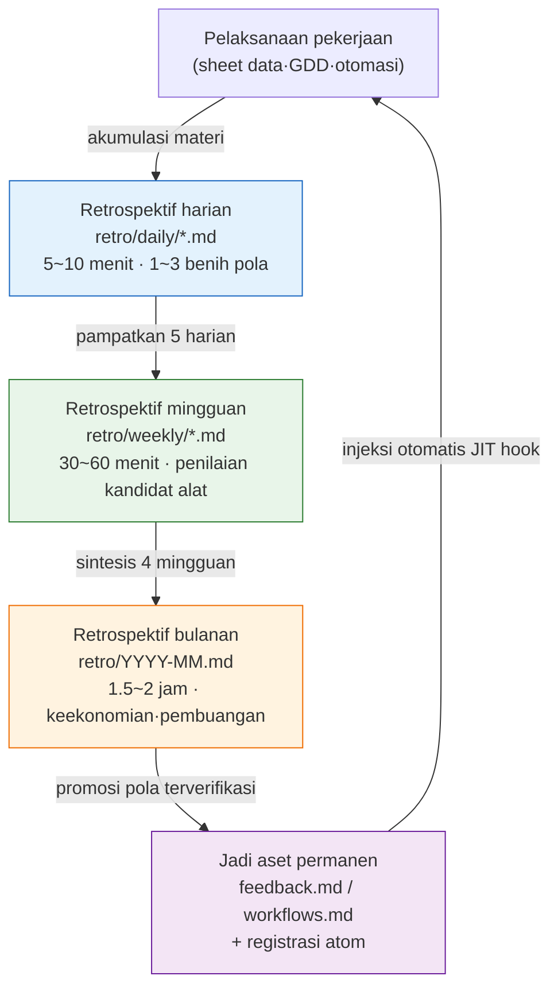

# Bagian 21 · Bab 1. Retrospektif, Titik Awal dari Segalanya

Jumat pukul 18.40. Saat hendak menutup laptop untuk pulang kerja, pekerjaan yang saya lakukan hari itu terasa familier entah dari mana. Saya menemukan dan memperbaiki referensi enum yang rusak di sheet data, tetapi minggu lalu pun saya jelas memperbaiki hal yang persis sama. Minggu sebelumnya juga. Setiap kali saya mengetik ulang prompt yang sama, dan setiap kali saya memeriksa item yang sama pada keluaran Claude. Saya baru menyadari bahwa ini sudah ketiga kalinya tepat sebelum menutup laptop.

Rasa "familier entah dari mana" inilah momen terpenting dalam seluruh buku ini. Jika Anda membiarkan rasa ini berlalu, minggu depan Anda akan mengulang pekerjaan yang sama untuk keempat kalinya. Jika Anda menangkap rasa ini dan menuliskannya dalam satu baris, satu baris itu akan menjadi skill minggu depan, dan skill itu akan menjadi atom sebulan kemudian, lalu disuntikkan secara otomatis. Tempat untuk menangkapnya itulah retrospektif.

Bagian-bagian lain dari buku ini membahas "ada alat semacam ini" dan "ada pola semacam ini". Bab ini membahas dari mana semua alat dan pola itu lahir. Di mana slash command (perintah garis miring) baru dibuat, bagaimana atom baru dibakukan, dan siapa yang menyiangi alat yang tidak dipakai sekali pun dalam sebulan. Jawabannya selalu mengerucut ke tempat yang sama. Pada retrospektif.

---

## 1.1 Mengubah Rasa Familier Jadi Satu Baris — Worked Transcript

Retrospektif bukanlah ritual yang muluk-muluk. Mari buka apa adanya salah satu berkas retrospektif harian saya. Jalur sebenarnya adalah `retro/daily/YYYY-MM-DD.md`, dan setelah sebulan berlalu, berkas-berkas ini diringkas menjadi mingguan (`retro/weekly/YYYY-Www.md`), lalu menjadi bulanan (`retro/YYYY-MM.md`). Aturannya tertulis di `retro/README.md`.

Alur yang sebenarnya saya pakai bukanlah menulis berkas retrospektif dengan tangan secara langsung, melainkan melemparkan log pekerjaan hari itu ke AI dan membiarkannya menarik pola. Berikut adalah rekonstruksi pertukaran nyata pada suatu Jumat malam. Saya muat dulu prompt selengkapnya, lalu saya muat apa adanya keluaran mentah Claude tanpa diringkas — termasuk bagian yang meleset.

**[Prompt — dimasukkan oleh manusia]**

> Rangkum pekerjaan hari ini menjadi retrospektif. Yang saya kerjakan hari ini: ① memperbaiki referensi enum yang rusak di sheet data karakter (kolom grade tidak cocok dengan sheet enum) ② menyeragamkan tone dialog NPC ③ menjalankan ulang relation-map.
> Di antara ini, jika ada **pekerjaan yang berulang 2 kali atau lebih minggu ini**, tandai, dan jika ada **kandidat yang layak dijadikan alat**, pisahkan tersendiri. Kalau tidak ada, katakan tidak ada. Jangan dipaksakan.

**[Keluaran mentah Claude — tanpa ringkasan atau saduran]**

> Berikut retrospektif pekerjaan hari ini.
>
> **Deteksi pola berulang**
> - ① Perbaikan referensi enum yang rusak → ini ada sebagai item yang sama di retrospektif hari Selasa minggu ini juga. Saya tandai sebagai **berulang 2 kali atau lebih**.
> - ② Penyeragaman tone dialog NPC → pertama kali muncul minggu ini. Bukan pengulangan.
> - ③ Menjalankan ulang relation-map → karena Anda sudah memakai skill relation-map-gen, ini pekerjaan yang sudah selesai dijadikan alat. Bukan kandidat tambahan.
>
> **Kandidat alat**
> - Verifikasi referensi enum **sepertinya bisa dibuat menjadi skill.** Dalam bentuk yang membandingkan nilai kolom sheet data dengan sheet enum lalu melaporkan ketidakcocokannya.
> - Hanya saja, karena saya tidak tahu struktur persis kedua sheet itu, sulit bagi saya untuk memastikan apakah ini benar-benar pola yang dapat diulang. Perlu dipastikan apakah kerusakan yang Anda perbaiki hari Selasa dan kerusakan hari ini **merupakan jenis kerusakan yang sama**. Jika rusak pada kolom yang sama dengan alasan yang sama, ini kandidat skill yang kuat; tetapi jika setiap kali rusak pada kolom yang berbeda dengan alasan yang berbeda, sulit untuk menyatukannya menjadi skill.

Di sini, paragraf terakhirlah yang menjadi inti. AI tidak memvonis "ayo buat skill". Ia balik bertanya, **mintalah manusia memastikan apakah ini jenis kerusakan yang sama**. Inilah alasan mengapa retrospektif tidak otomatis.

**[Verifikasi oleh manusia — menerima usulan AI namun menyaringnya]**

Saya membuka retrospektif hari Selasa dan membandingkannya. Kerusakan hari Selasa ada di kolom `grade`, kerusakan hari ini pun di kolom `grade`. **Jenisnya sama**. Usulan kandidat dari AI lolos verifikasi. Maka saya tinggalkan satu baris di retrospektif harian.

> Pekerjaan berulang: verifikasi referensi enum-grade (Selasa·Jumat, 2 kali) → **kandidat skill**. Putuskan promosinya di retrospektif mingguan berikutnya.

Satu baris ini sudah cukup. Tidak sampai 5 menit. Dan satu baris inilah ruas pertama dari loop self-improving. Andai saya menaikkan butir ③ — yang ditunjukkan AI sebagai "sudah selesai dijadikan alat" — sebagai kandidat juga, sebulan kemudian akan ada satu lagi alat duplikat yang tidak terpakai mengambang-ambang. Berkat penyaringan AI dan penyaringan manusia yang dua-duanya bekerja, hanya tersisa satu kandidat yang benar-benar nyata.

---

## 1.2 Mengapa Retrospektif Adalah Titik Awal

Pekerjaan mana yang berulang, alat mana yang sering dipakai, atom mana yang kurang — semua itu tidak terlihat dari satu kali pekerjaan saja. Pada transkrip di atas, kerusakan enum muncul sebagai kandidat bukan karena "hari ini" melainkan karena "hari Selasa dan hari ini" ditumpukkan dan dilihat bersamaan. Jejak yang terakumulasi selama 1 minggu·1 bulan·1 kuartal harus ditumpuk agar polanya muncul. Retrospektif adalah waktu untuk dengan sengaja menciptakan penumpukan itu.

Pola yang ditemukan dalam retrospektif bercabang menjadi dua arah.

- Pola berulang + hasil yang berharga → dibakukan menjadi alat (skill·atom·hook)
- Pola yang berulang tetapi tidak berharga → dibuang atau disederhanakan

Penilaian percabangan ini tidak bisa dilakukan di tengah pekerjaan. Sebab alur pekerjaan jadi terputus. Pada momen ketika sedang memperbaiki kerusakan enum, tidak ada keleluasaan untuk menimbang "apakah ini sudah ketiga kalinya?". Waktu retrospektif yang disisihkan tersendiri adalah tempat untuk penilaian itu.

Apakah suatu alat benar-benar menghasilkan nilai setelah dibuat juga diukur di tempat yang sama. Nilai alat yang dipakai sekali sebulan berbeda dengan alat yang menghemat satu jam. Baik pengukuran maupun keputusan pembuangan dilakukan dalam retrospektif. Tanpa retrospektif, alat hanya menumpuk dan tidak pernah dirapikan. Setelah beberapa tahun, puluhan alat yang tidak terpakai akan mengganggu pencarian dan operasional.

Jika diumpamakan dengan laci, retrospektif adalah waktu untuk secara berkala mengosongkan laci meja. Bila pena yang dipakai setiap hari dan kertas memo yang tidak pernah dikeluarkan sekali pun dalam setahun bercampur dalam satu sekat, mencari pena setiap kali akan memakan beberapa detik lebih lama. Alat pun sama saja.

---

## 1.3 Alur Pemampatan Retrospektif Harian·Mingguan·Bulanan

Retrospektif saya berjalan dalam tiga lapis. Harian mengumpulkan benih-benih pola, mingguan mengikat benih itu lalu memampatkannya menjadi kandidat alat, dan bulanan menilai keekonomian alat untuk dibakukan menjadi aset atau dibuang. Setiap lapis menerima keluaran lapis di bawahnya sebagai masukan.

Panah terakhirlah yang menutup loop. Pola yang sudah dijadikan aset permanen disuntikkan secara otomatis ke pekerjaan berikutnya melalui JIT (Just-In-Time) hook. Di lingkungan saya, hook bernama `inject_memory.py` memilih dan menyisipkan atom yang relevan setiap kali menerima masukan pengguna. Bila verifikasi enum-grade dibakukan menjadi atom, ketika lain kali saya memasukkan input bertipe "verifikasi sheet data", atom itu akan ikut serta dengan sendirinya. Manusia tidak perlu lagi mengingat setiap kali, "oh iya, ada aturan verifikasi itu."

Jika retrospektif hilang, hanya tersisa panah yang mengalir dari atas ke bawah, dan panah terakhir tempat aset kembali ke pekerjaan terputus. Loop tidak tertutup. Makna dari kata self-improving (perbaikan-diri) tepatnya adalah bahwa loop inilah yang sedang berputar. Alat memperbaiki dirinya sendiri, dan atom melipatgandakan atom. Tenaga penggeraknya adalah satu jam retrospektif yang disisihkan manusia.

---

## 1.4 Lima Hal yang Lahir dari Retrospektif

Berdasarkan kesan menjalankan retrospektif sekitar setengah tahun pada suatu proyek MMORPG yang saya kelola, dari satu kali retrospektif lahir lima jenis keluaran berikut. Frekuensi di bawah bukan statistik yang presisi, melainkan kesan operasional saya (perkiraan penulis·belum terverifikasi), dan tidak setiap retrospektif menghasilkan kelimanya. Bila dilihat dalam satuan kuartal, kelimanya muncul masing-masing setidaknya sekali.

Bila kelima jenis itu dijabarkan, begini. Jika minggu ini Anda mengulang keputusan yang sama 2 kali atau lebih, itu **kandidat atom baru**. Jika Anda memasukkan ulang pola prompt yang sama beberapa kali dalam seminggu, itu **kandidat skill baru** (verifikasi enum-grade di subbab sebelumnya termasuk kasus ini). Jika di antara skill yang Anda pakai minggu ini ada yang hasilnya kurang memuaskan, itu **perbaikan skill yang ada** — penyesuaian prompt·penambahan verifikasi·standardisasi input. Di antara atom yang dibuat kuartal lalu, yang selama sebulan tidak ada kecocokan sama sekali (0 kali) adalah **kandidat pembuangan**. Jika tidak dipakai, ia hanya memakan token. Terakhir, **penilaian keekonomian** adalah pekerjaan menimbang frekuensi pemakaian dan tenaga manual yang dihemat per alat, lalu memutuskan untuk dipertahankan·diperbaiki·dibuang.

Bila dilihat sebagai matriks bagaimana kelima hal ini ditata dalam satu layar, hasilnya seperti ini. Sumbu mendatar adalah "apakah berulang", sumbu tegak adalah "apakah berharga".

<svg viewBox="0 0 520 320" xmlns="http://www.w3.org/2000/svg" font-family="sans-serif" font-size="13">
  <rect x="0" y="0" width="520" height="320" fill="#ffffff"/>
  <!-- axes -->
  <line x1="90" y1="40" x2="90" y2="280" stroke="#333" stroke-width="1.5"/>
  <line x1="90" y1="280" x2="500" y2="280" stroke="#333" stroke-width="1.5"/>
  <text x="295" y="305" text-anchor="middle" fill="#333">Frekuensi pengulangan  →  tinggi</text>
  <text x="30" y="160" text-anchor="middle" fill="#333" transform="rotate(-90 30 160)">Nilai hasil  →  tinggi</text>
  <!-- quadrants -->
  <rect x="92" y="42" width="200" height="118" fill="#fdecea"/>
  <rect x="294" y="42" width="204" height="118" fill="#e8f5e9"/>
  <rect x="92" y="162" width="200" height="116" fill="#f5f5f5"/>
  <rect x="294" y="162" width="204" height="116" fill="#fff8e1"/>
  <!-- labels -->
  <text x="192" y="95" text-anchor="middle" fill="#b71c1c" font-weight="bold">Nilai tinggi·pengulangan rendah</text>
  <text x="192" y="118" text-anchor="middle" fill="#444">→ Dibiarkan (tunda pembuatan alat)</text>
  <text x="396" y="80" text-anchor="middle" fill="#1b5e20" font-weight="bold">Nilai tinggi·pengulangan tinggi</text>
  <text x="396" y="103" text-anchor="middle" fill="#444">→ Kandidat skill baru / atom baru</text>
  <text x="396" y="126" text-anchor="middle" fill="#444">(verifikasi enum-grade di sini)</text>
  <text x="192" y="215" text-anchor="middle" fill="#666" font-weight="bold">Nilai rendah·pengulangan rendah</text>
  <text x="192" y="238" text-anchor="middle" fill="#444">→ Abaikan</text>
  <text x="396" y="215" text-anchor="middle" fill="#e65100" font-weight="bold">Nilai rendah·pengulangan tinggi</text>
  <text x="396" y="238" text-anchor="middle" fill="#444">→ Kandidat pembuangan / penyederhanaan</text>
</svg>

Apa yang dilakukan retrospektif pada akhirnya adalah menebarkan pekerjaan-pekerjaan minggu itu ke dalam kuadran ini. Yang jatuh di kanan atas menjadi alat, yang jatuh di kanan bawah disiangi. Klasifikasi inilah cara kerja nyata dari self-improving.

---

## 1.5 Tempat Pembakuan Menjadi atom

Mari kita ikuti sampai tuntas proses bagaimana kandidat verifikasi enum-grade di subbab sebelumnya dipromosikan menjadi skill, lalu dari sana dibakukan lagi menjadi atom. atom adalah bentuk ketika pola yang ditemukan secara kasar dalam retrospektif menjadi aset permanen setelah melewati verifikasi.

Di memori saya sudah ada atom-atom yang dibakukan seperti itu. Salah satunya adalah `retro_atom_natural_invitation`. Persis seperti namanya, ini atom yang memuat prinsip "dalam retrospektif, atom muncul bukan sebagai perintah, melainkan sebagai undangan yang wajar". atom ini sendiri merupakan meta-pola yang ditemukan setelah menjalankan retrospektif berkali-kali — prinsip ini baru mengeras menjadi satu baris setelah saya berkali-kali mengalami bahwa, jika di tengah retrospektif kita memaksakan pembakuan secara obsesif dengan berkata "ini harus disimpan sebagai atom", retrospektif justru menjadi sekadar formalitas.

Apakah pembakuan benar-benar berdampak juga dikelola dengan skor. Di lingkungan saya ada skrip bernama `atom_score.py` yang memberi nilai pada seberapa banyak setiap atom benar-benar cocok dan dipakai. Hasilnya disimpan di `_scores_latest.json`, dan atom yang skornya melampaui ambang tertentu disuntikkan secara otomatis ke `CLAUDE.md`. Artinya, semakin sering suatu atom dipakai, semakin sering pula ia muncul di depan mata, dan atom yang tidak terpakai skornya berkurang lalu mengalir menjadi kandidat pembuangan. Siklus penilaian-injeksi inilah bagian yang mengotomasi kuadran di §1.4.

Di sini ada satu hal yang perlu saya tunjukkan dengan jujur. Skor ini tidak langsung dikonversi menjadi indikator kuantitatif seperti "menghemat 30 jam dalam sebulan". Waktu yang dihemat atom sulit diukur. Karena itu, alih-alih memvonis ROI (Return on Investment, hasil dibanding investasi) dengan angka, lebih jujur bila hanya berbicara dalam arah dan rasio — "atom yang sering dipakai skornya tinggi, dan atom berskor tinggi lebih sering disuntikkan sehingga mengurangi tenaga manual" — arah, bukan kelipatan.

---

## 1.6 Apa yang Terjadi di Tempat Tanpa Retrospektif

Pemandangan yang lazim pada tim yang tidak menyisihkan waktu retrospektif adalah seperti ini.

- Mengulang rapat yang sama setiap kuartal ("ini dulu juga sudah pernah disimpulkan, kok…").
- atom·skill hanya ada di kepala satu orang. Ketika orang itu pergi, semuanya ikut lenyap.
- Alat hanya menumpuk. Alat yang tidak terpakai mengganggu pencarian dan operasional.
- Meski Game Designer baru masuk, materi pembelajarannya berserakan sehingga ia mengalami lagi trial and error yang sama dari awal.

Pemandangan ini hampir lenyap dengan satu jam retrospektif. Jika kita mengingat kembali Jumat malam di §1.1, ini hanyalah perbedaan antara menuliskan "terasa familier entah dari mana" dalam satu baris atau membiarkannya berlalu. Menuliskannya butuh 5 menit, sedangkan waktu yang hilang karena tidak menuliskannya terakumulasi pada pengulangan keempat·kelima. Ini contoh khas kehilangan waktu yang lebih besar karena tidak meluangkan waktu.

Tentu saja tidak perlu membangun sistem retrospektif yang muluk sejak awal. Di tim besar, memulai dari retrospektif harian 5 menit mungkin terasa menjengkelkan. Namun jika sejak awal langsung memasang sistem 3 lapis harian·mingguan·bulanan sekaligus, mudah sekali untuk hanya mengikuti formalitasnya dan melewatkan esensinya. Urutan yang aman adalah orang yang langsung merasakan sendiri nilai retrospektif pada tahap terkecil baru menaikkannya ke tahap berikutnya.

Semua alat·atom·pola yang Anda temui dalam buku ini pada akhirnya lahir dari retrospektif seseorang. Tidak berlebihan bila dikatakan bahwa buku ini sendiri adalah produk dari akumulasi retrospektif yang saya kumpulkan selama setengah tahun. Pernyataan bahwa retrospektif adalah titik awal bukanlah kiasan, melainkan menunjuk pada fakta bahwa daftar isi buku ini sendiri lahir dari retrospektif.

---

> **Penerapan di Luar Game.** Retrospektif yang menangkap rasa "terasa familier entah dari mana — ini minggu lalu juga saya kerjakan" dalam satu baris adalah pintu masuk perbaikan-diri di tempat kerja mana pun yang memiliki pekerjaan berulang, bukan hanya pengembangan game. Saat menutup hari, cukup tulis satu baris "pekerjaan apa hari ini yang saya kerjakan dua kali dengan tangan", lalu pada hari Jumat tumpukkan kelima baris minggu itu, maka pola yang setiap hari tersembunyi akan tersingkap dalam satuan satu minggu. Misalnya, jika seorang staf administrasi umum menangkap "saya mengetik ulang email dengan format yang sama setiap minggu" dalam retrospektif, satu baris itu menjadi templat email minggu depan dan menjadi aturan pengiriman otomatis sebulan kemudian. Intinya bukan kecanggihan alat, melainkan tindakan menumpuk jejak itu sendiri, serta membiarkan AI menarik kandidat namun memasang saringan "jangan dipaksakan dan keluarkan yang sudah diotomasi".

## 1.7 Coba Sendiri

Ini versi terkecil untuk pertama kali memperkenalkan loop retrospektif. Anda bisa memulainya hampir tanpa memasang alat apa pun.

**setup**

1. Buat satu folder `retro/daily/` di dalam folder kerja.
2. Buka berkas kosong `retro/daily/2026-06-06.md` dengan tanggal hari ini. Tidak ada persiapan lain selain itu.

**prompt**

Setiap kali selesai bekerja, berikan log pekerjaan hari itu ke AI dan tanyakan seperti di bawah.

> Yang saya kerjakan hari ini adalah [pekerjaan 1·2·3]. Di antara ini, jika ada **pekerjaan yang berulang 2 kali atau lebih minggu ini**, tandai, dan jika ada **pola berulang yang layak dibuat menjadi alat (skill)**, pisahkan tersendiri. Keluarkan dari kandidat pekerjaan yang sudah selesai dijadikan alat. Kalau tidak ada, katakan tidak ada. Jangan dipaksakan.

Dua kalimat terakhir ("keluarkan yang sudah dijadikan alat", "jangan dipaksakan") adalah saringannya. Tanpa ini, AI akan berlebihan menghasilkan kandidat yang tampak meyakinkan setiap kali, sehingga sebulan kemudian alat yang tidak terpakai menumpuk.

**verify**

1. **Bandingkan langsung satu butir** apakah item berulang yang ditunjukkan AI benar-benar pengulangan jenis yang sama (seperti perbandingan kolom `grade` Selasa·Jumat sebelumnya). Jika jenisnya sama, kandidat ditetapkan; jika berbeda, dibuang.
2. Tinggalkan kandidat yang sudah ditetapkan dalam satu baris di retrospektif harian: `Berulang: [pekerjaan] (N kali) → kandidat skill, putuskan di retrospektif mingguan`.
3. Seminggu kemudian, berikan lagi kelima berkas retrospektif harian ke AI dan minta "saringkan kandidat untuk dipromosikan menjadi skill". Saat itu, jadikan alat hanya kandidat yang bertahan 2 kali atau lebih.

**Versi Ringkas Solo**

Jika Anda memulai sendirian tanpa tim maupun alat khusus, persingkat seperti ini.

- Tanpa membuat folder pun, tulis cukup satu baris per tanggal di aplikasi memo.
- Setiap hari hanya satu kalimat: tulis "satu pekerjaan hari ini yang terasa familier entah dari mana". Jika tidak ada, kosongkan.
- Pada hari Jumat, lihat sekilas kelima baris minggu itu. Jika kalimat yang sama muncul 2 kali atau lebih, hanya itu satu-satunya yang dibuat menjadi alat minggu depan.

Intinya bukan kecanggihan alat, melainkan **tindakan menumpuk dan melihatnya bersamaan**. Satu hari menyembunyikan pola, satu minggu menyingkap pola. 5 menit untuk menangkap penyingkapan itu adalah pintu masuk loop perbaikan-diri.

---

### Poin-Poin Penting
- Retrospektif adalah pintu masuk loop perbaikan-diri yang menangkap pengulangan dalam satu baris lalu membakukannya menjadi alat.
- Harian menyaring benih, mingguan menyaring kandidat, bulanan menyaring keekonomian, demikian aset terbentuk.
- Dampaknya dibicarakan dalam arah, bukan kelipatan — atom yang sering dipakai lebih sering disuntikkan.
