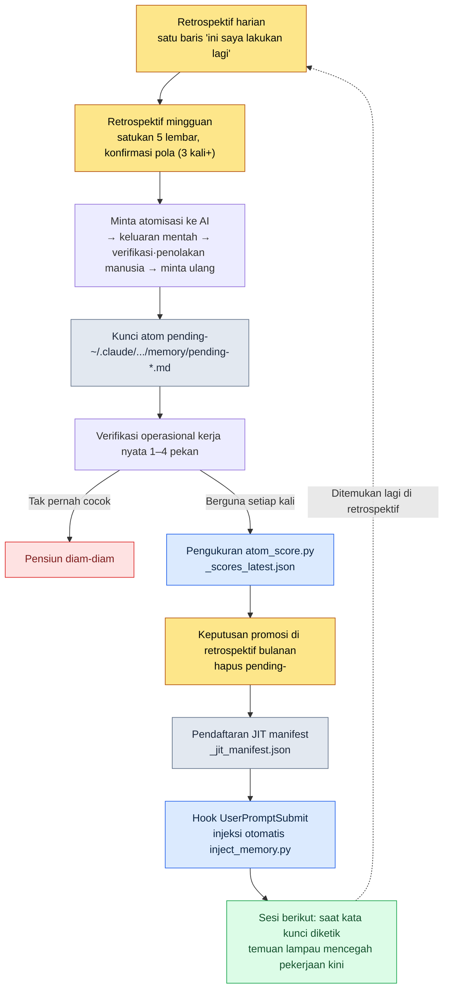

# Bagian 21 · Bab 2. Sistem Retrospektif dan Promosi atom — Mengubah Temuan Menjadi Aset Permanen

Senin pagi, saya hendak memulai pekan baru dengan menampilkan lima retrospektif harian pekan lalu di satu layar. Pada retrospektif hari Selasa tertulis: "Lupa menjalankan pemeriksaan konsistensi sebelum melakukan export sheet data." Di retrospektif hari Kamis pun ada kalimat yang nyaris sama. Dan persis pada Senin pagi itu, saya kembali melakukan hal yang sama. Saya memasukkan sheet dengan FK yang rusak ke build klien/server, lalu mencabutnya lagi. Itu sudah kali ketiga.

Momen inilah inti dari sistem retrospektif. Fakta bahwa Anda sedang melakukan hal yang sama untuk ketiga kalinya sama sekali tidak terlihat selama Anda mengerjakannya. Sebab tangan bergerak karena sudah terbiasa, dan kepala berbisik, "Ini memang pekerjaan yang biasa saya lakukan." Pengulangan hanya terlihat ketika Anda mengumpulkan jejaknya dan melihatnya dari belakang. Retrospektif adalah perangkat untuk mengumpulkan jejak itu, dan promosi atom adalah perangkat untuk mengunci jadi aturan pengulangan yang ditemukan di sana agar tidak perlu lagi dikerjakan dengan tangan.

Bab ini menelusuri hingga tuntas bagaimana kedua perangkat itu saling terkait dan berputar, dan bagaimana satu lembar file retrospektif harian yang nyata berubah menjadi satu baris atom di JIT manifest.

---

## 21.2.1 Temuan Hanya Lahir dari Tumpukan Jejak

Ada premis yang harus ditegaskan lebih dulu. Pengulangan tidak disadari secara real-time.

Hari seorang Game Designer adalah rangkaian keputusan. Akan dijadikan enum apa sebuah kolom sheet data, akankah cooldown skill diukur dalam satuan detik atau satuan frame, di bagian dokumen mana sebaiknya ditulis kesepakatan samar yang muncul di rapat. Tiap keputusan ini terlalu kecil untuk tinggal dalam ingatan. Namun, kalau Anda mengambil keputusan yang sama tiga kali dalam sepekan, itu bukan lagi keputusan, melainkan aturan. Kalau itu sebuah aturan tetapi Anda menetapkannya ulang setiap kali, itu pemborosan.

Masalahnya, pemborosan ini tidak terlihat. Karena itulah kita meninggalkan jejak. Setiap hari selama 5 menit, kita menulis satu baris untuk apa yang dikerjakan hari ini dan apa yang diulang dua kali atau lebih hari ini. Setelah sepekan berlalu, lima lembar jejak menumpuk, dan barulah saat itu terlihat: "Eh, ini tertulis tiga kali."

Inilah titik yang memisahkan retrospektif dari sekadar buku harian. Buku harian menuliskan kesan, sedangkan retrospektif menuliskan jejak demi mengekstraksi pola. Karena itu, format retrospektif harus tetap. Kalau formatnya berbeda-beda setiap kali, lima lembar tidak bisa dijajarkan dan dibandingkan, dan kalau tidak bisa dibandingkan, polanya tidak terlihat.

---

## 21.2.2 Tiga Siklus Itu Bukan Satuan Waktu, Melainkan Satuan Peran

Alasan retrospektif dibagi menjadi tiga siklus — harian, mingguan, bulanan — bukanlah karena waktu berlalu. Melainkan karena peran tiap siklus pada dasarnya berbeda.

<svg viewBox="0 0 720 300" xmlns="http://www.w3.org/2000/svg" font-family="sans-serif">
  <rect x="0" y="0" width="720" height="300" fill="#fbfbfd"/>
  <!-- Daily -->
  <rect x="30" y="40" width="190" height="220" rx="10" fill="#eaf2fb" stroke="#3b6fb0" stroke-width="1.5"/>
  <text x="125" y="70" text-anchor="middle" font-size="17" font-weight="bold" fill="#1f3d63">Harian · 5–10 menit</text>
  <text x="125" y="100" text-anchor="middle" font-size="13" fill="#33475b">Peran: mengunci jejak</text>
  <line x1="50" y1="115" x2="200" y2="115" stroke="#c2d4e8" stroke-width="1"/>
  <text x="125" y="142" text-anchor="middle" font-size="12" fill="#4a5b6b">Yang dikerjakan hari ini</text>
  <text x="125" y="166" text-anchor="middle" font-size="12" fill="#4a5b6b">Keputusan yang diulang</text>
  <text x="125" y="190" text-anchor="middle" font-size="12" fill="#4a5b6b">Alat yang tak terpakai</text>
  <text x="125" y="214" text-anchor="middle" font-size="12" fill="#4a5b6b">Estafet ke sesi berikut</text>
  <text x="125" y="244" text-anchor="middle" font-size="11" font-style="italic" fill="#7a8a99">Keluaran: 5 lembar/pekan</text>
  <!-- arrow 1 -->
  <polygon points="225,150 255,135 255,165" fill="#9bb3cc"/>
  <!-- Weekly -->
  <rect x="265" y="40" width="190" height="220" rx="10" fill="#eef6ee" stroke="#3f8a4f" stroke-width="1.5"/>
  <text x="360" y="70" text-anchor="middle" font-size="17" font-weight="bold" fill="#1f4a2a">Mingguan · 30–60 menit</text>
  <text x="360" y="100" text-anchor="middle" font-size="13" fill="#33475b">Peran: mengekstraksi pola</text>
  <line x1="285" y1="115" x2="435" y2="115" stroke="#c8e0c8" stroke-width="1"/>
  <text x="360" y="142" text-anchor="middle" font-size="12" fill="#4a5b6b">Lihat 5 lembar harian sekaligus</text>
  <text x="360" y="166" text-anchor="middle" font-size="12" fill="#4a5b6b">Ulang 3 kali+ → kandidat</text>
  <text x="360" y="190" text-anchor="middle" font-size="12" fill="#4a5b6b">Kunci atom pending-</text>
  <text x="360" y="244" text-anchor="middle" font-size="11" font-style="italic" fill="#7a8a99">Keluaran: 1–3 kandidat</text>
  <!-- arrow 2 -->
  <polygon points="460,150 490,135 490,165" fill="#9bb3cc"/>
  <!-- Monthly -->
  <rect x="500" y="40" width="190" height="220" rx="10" fill="#fbf2ea" stroke="#b07b3b" stroke-width="1.5"/>
  <text x="595" y="70" text-anchor="middle" font-size="17" font-weight="bold" fill="#634021">Bulanan · 1.5–2 jam</text>
  <text x="595" y="100" text-anchor="middle" font-size="13" fill="#33475b">Peran: nilai ekonomis · promosi</text>
  <line x1="520" y1="115" x2="670" y2="115" stroke="#e8d4c2" stroke-width="1"/>
  <text x="595" y="142" text-anchor="middle" font-size="12" fill="#4a5b6b">Menilai nilai ekonomis alat</text>
  <text x="595" y="166" text-anchor="middle" font-size="12" fill="#4a5b6b">Keputusan promosi / pensiun</text>
  <text x="595" y="190" text-anchor="middle" font-size="12" fill="#4a5b6b">Rencana kuartalan</text>
  <text x="595" y="244" text-anchor="middle" font-size="11" font-style="italic" fill="#7a8a99">Keluaran: atom resmi</text>
</svg>

Harian mengunci jejak. Tidak menilai, hanya menulis. Mingguan menyatukan lima lembar jejak dan melihat polanya. Di sinilah untuk pertama kalinya masuk penilaian "ini adalah pengulangan". Bulanan melihat keseluruhan alat yang sudah menumpuk dan menilai nilai ekonomisnya. Memutuskan apa yang dipertahankan dan apa yang dibuang.

Kalau satu siklus hilang, sisanya runtuh. Tanpa harian, kalau hanya melakukan mingguan, peristiwa sepekan lalu tak teringat sehingga jejaknya kosong melompong. Tanpa mingguan, kalau hanya melakukan bulanan, Anda harus melihat sebulan penuh retrospektif harian sekaligus, dan membandingkan 22 lembar dalam satu duduk nyaris mustahil. Polanya tidak terlihat, hanya kelelahan yang menumpuk.

Analogi bengkel kerja sangat pas. Harian adalah 5 menit merapikan meja setiap petang. Mingguan adalah 30 menit menata ulang satu laci di akhir pekan. Bulanan adalah dua jam meninjau keseluruhan alur kerja bengkel setiap kuartal. Kalau meja tidak dibereskan setiap hari, laci tak bisa ditata di akhir pekan, dan kalau laci berantakan, melihat alur kerja pun tak membuahkan jawaban.

---

## 21.2.3 Retrospektif Harian — Penguncian yang Selesai dalam 5 Menit

File retrospektif harian yang benar-benar saya pakai menumpuk per tanggal di path seperti `retro/daily/2026-05-30.md`. Templatnya dipasang otomatis oleh slash command `/retro`.

```markdown
# Retrospektif Harian 2026-05-30

## Yang dikerjakan hari ini (3–5 baris)
- Menambah 12 jenis enum ke sheet data skill baru + menata ulang kolom cooldown
- Pas pertama simulasi balance (menyesuaikan bobot drop table)
- Memperbarui build export data klien/server secara bersamaan

## Pengulangan yang ditemukan (jika ada)
- Lupa lagi menjalankan pemeriksaan konsistensi sebelum build export data → build dengan FK rusak → kali ke-3
- Menjalankan simulasi balance tanpa mengunci seed sehingga tidak bisa direproduksi (kedua kalinya)

## Kandidat pensiun
- Alat yang sama sekali tak terpakai hari ini: (dicatat hanya untuk pengukuran akumulasi bulanan)

## Estafet ke sesi berikut
- Tambal dulu dua kasus FK rusak (referensi skill→efek) lalu build ulang
- Kandidat: pertimbangkan menjadikan opsi penguncian seed simulasi sebagai nilai default
```

Terisi dalam 5 menit. Karena formatnya tetap, kita tidak perlu memikirkan ulang "apa yang harus ditulis" setiap kali. Karena kolomnya sudah ditentukan, kita tinggal mengisi kolomnya.

Yang menentukan di sini adalah kolom "Pengulangan yang ditemukan". Kolom ini boleh kosong. Sebagian besar hari kolom ini kosong. Namun, kalau muncul kesadaran bahwa hari ini saya melakukan hal yang sama dua kali, tulislah satu baris. Baris "Lupa lagi menjalankan pemeriksaan konsistensi sebelum build export data → kali ke-3" pada contoh di atas persis seperti itu. Satu baris ini beberapa hari kemudian terikat menjadi pola di retrospektif mingguan, dan beberapa pekan kemudian terkunci menjadi atom atau skill.

Penangkapan otomatis mengurangi kerja tangan manusia. Kalau log commit git, riwayat perubahan atom, dan log penggunaan skill otomatis tergabung ke retrospektif harian, separuh kolom "Yang dikerjakan hari ini" sudah terisi. Manusia tinggal menambahkan apa yang tak bisa dilihat log git — kesadaran "ini saya lakukan lagi".

Kolom terakhir "Estafet ke sesi berikut" adalah pesan untuk diri saya esok hari. Kalau kolom ini ada, pemuatan konteks saat memulai sesi baru selesai dalam 1–2 menit. Kalau tidak ada, lebih banyak waktu terbuang untuk meraba-raba "kemarin saya mengerjakan apa sampai mana ya". Nyatanya, di MEMORY.md saya ada butir terpisah "Hal yang diperiksa lebih dulu di sesi berikut", dan inilah versi atas dari estafet harian yang terakumulasi.

---

## 21.2.4 Retrospektif Mingguan — Tempat Pola Pertama Kali Menampakkan Wujudnya

Retrospektif mingguan dimulai dengan menaikkan lima lembar harian ke satu layar. File menumpuk di path seperti `retro/weekly/2026-W21.md`.

```markdown
# Retrospektif Mingguan 2026-W22 (25/5–31/5)

## Ringkasan yang dikerjakan pekan ini
- Memperbarui sheet data skill/balance, 2 kali simulasi drop table
- Build export data 4 kali (2 di antaranya build dengan FK·enum rusak)

## Pola yang ditemukan
- Pengulangan "lupa pemeriksaan konsistensi sebelum export" di 3 entri harian → kandidat atom
- Pengulangan "seed simulasi balance tak terkunci" di 2 entri harian → tinjau nilai default simulasi

## Kandidat atom
- pending-data-check-before-export (aturan yang memaksakan verifikasi konsistensi sebelum build export)

## Kandidat skill
- (tidak ada — pekan ini cukup dengan atom)

## Tinjauan alat yang sudah ada
- Tak terpakai: relation-map-gen (0 kali pekan ini)
- Paling sering dipakai: check (cascade konsistensi), excel-reader, /retro

## Rencana pekan depan
- Operasikan pending-data-check-before-export 1 pekan lagi lalu putuskan promosinya
```

Di sinilah untuk pertama kalinya masuk penilaian. "Pengulangan lupa pemeriksaan sebelum export di 3 entri harian" adalah fakta aritmetis, tetapi "ini layak dikunci sebagai atom" adalah penilaian. Alasan menjadikan 3 kali pengulangan sebagai garis dasar sederhana saja. Satu kali kebetulan, dua kali bisa jadi kebetulan, tiga kali adalah pola.

Begitu penilaian terbentuk, kunci segera. Hanya saja, bukan sebagai atom resmi, melainkan sebagai atom sementara berawalan `pending-`. Ia jatuh ke folder memori proyek saya seperti ini.

```
~/.claude/projects/<project>/memory/
  pending-data-check-before-export.md
```

Awalan `pending-` adalah penanda "ini masih dalam verifikasi". Alasan penanda ini penting: kalau intuisi yang belum diverifikasi langsung dijadikan aturan untuk seluruh tim, dua hal rusak. Yang pertama adalah kepercayaan — kalau aturan yang belum diverifikasi terus-menerus salah, orang menjadi tidak memercayai aturan itu sendiri. Yang lain adalah akumulasi — tanpa verification gate (gerbang verifikasi), intuisi menumpuk apa adanya dan memori menjadi tong sampah.

Maka, `pending-` dioperasikan dalam pekerjaan nyata selama sepekan, bahkan bisa selama sebulan. Kalau benar-benar berguna setiap kali, ia bertahan; kalau tak pernah cocok sekali pun, ia terhapus diam-diam.

---

## 21.2.5 Retrospektif Bulanan — Mengukur Kesehatan Alat dan Memilih yang Akan Dipertahankan

Retrospektif bulanan adalah tempat untuk membentangkan akumulasi sebulan dan memeriksa kondisi kesehatan keseluruhan alat. File menumpuk per bulan seperti `retro/2026-05.md`.

```markdown
# Retrospektif Bulanan 2026-05

## Akumulasi bulan ini
- Retrospektif harian: 22 entri, retrospektif mingguan: 4 entri
- atom baru: 4 (data-check-before-export, sim-seed-pinning, dll.)
- skill baru: 1 (penguatan opsi relation-map-gen)
- atom dipensiunkan: 1

## Penilaian nilai ekonomis alat
- Jumlah pemakaian bulanan per skill + rasa penghematan (kualitatif)
- skill yang dipakai kurang dari 1 kali sebulan → kandidat pensiun
- Alat bernilai paling besar: check (cascade konsistensi), excel-reader, /retro

## Distribusi atom
- Akumulasi per prefix (data: X, sim: Y, meeting: Z ...)
- Kandidat pensiun: atom dengan 0 kali pencocokan dalam sebulan

## Rencana kuartalan
- Pengadaan bulan depan: impact (pelacakan dampak), pembaruan otomatis schema-doc

## Materi penulisan buku (jika ada)
- Yang layak dikutip ke buku dari kasus bulan ini: 1 worked transcript promosi atom
```

Inti dari bulanan adalah penilaian nilai ekonomis. Saat dibuat, semua alat tampak bernilai, tetapi setelah sebulan, separuhnya tak tersentuh tangan. Untuk menyaringnya, saya memakai lima tolok ukur.

Kriteria penilaiannya ada lima: frekuensi pemakaian, penghematan waktu, beban kognitif, biaya pemeliharaan, dan kemungkinan tergantikan. Frekuensi pemakaian: kalau 1 kali atau lebih per bulan, untuk sementara dipertahankan; kalau kurang, dialihkan menjadi kandidat pensiun. Penghematan waktu: kalikan rasa penghematan per pemakaian dengan frekuensinya — di sini saya tidak memastikan angka dalam satuan menit. Penilaian kualitatif sebatas "rasanya menghemat beberapa menit setiap pemakaian dan dipakai sepuluh kali sebulan sehingga akumulasinya besar" itulah yang jujur. Beban kognitif: kalau slash command yang harus dihafal melampaui dua belas, saya anggap itu sinyal untuk merapikan. Ada batas jumlah perintah yang sanggup dipikul manusia dalam kepalanya. Biaya pemeliharaan: melihat apakah alat itu harus ikut disuntik saat sheet data berubah. Kemungkinan tergantikan: melihat apakah ada cara yang lebih sederhana yang baru muncul.

Lima tolok ukur ini digabungkan untuk menetapkan apakah suatu alat dipertahankan, dibuang, atau diperbaiki. Dalam satu jam, tiga puluh sampai lima puluh alat bisa ditinjau sekilas. Hanya saja, pada satu-dua bulan pertama sejak mulai, alatnya sedikit sehingga penilaian tak memakan satu jam. Pada masa itu, lebih tepat menghabiskan lebih banyak waktu untuk memunculkan alat baru ketimbang menilai. Penilaian nilai ekonomis adalah pengaman yang baru benar-benar bekerja setelah alat menumpuk.

---

## 21.2.6 Worked Transcript: Dari Satu Baris Harian Menjadi Satu Baris atom di JIT manifest

Mulai dari sini adalah tulang punggung bab ini. Saya menelusuri dari titik retrospektif hingga akhir, proses bagaimana kepingan-kepingan yang berserak di atas sebenarnya bermula dari satu baris dan sampai ke injeksi otomatis di seluruh sesi. Saya membiarkan apa adanya momen ketika saya menolak dan momen ketika AI menjawab secara samar di tengah jalan.

**Langkah 1 — Kesadaran di harian.** Saat menulis retrospektif harian 30 Mei, saya menulis satu baris di kolom "Pengulangan yang ditemukan".

```
- Lupa lagi menjalankan pemeriksaan konsistensi sebelum build export data → build dengan FK rusak → kali ke-3
```

Saat ini saya tidak membuat alat apa pun. Hanya meninggalkan jejak.

**Langkah 2 — Mengonfirmasi pola di mingguan lalu meminta atomisasi ke AI.** Beberapa hari kemudian, saat membentangkan lima lembar harian di retrospektif mingguan, baris yang sama ada di tiga tempat. Maka, prompt lengkap yang saya lemparkan ke Claude adalah seperti ini.

> Di 3 retrospektif harian pekan ini berulang "lupa menjalankan pemeriksaan konsistensi dengan tangan sebelum build export data". Saya ingin menjadikan ini atom pending. Tuliskan draf isi atom-nya. Formatnya seperti atom lain di memori kita: frontmatter (name, status, trigger) dan satu paragraf aturan.

Keluaran mentah dari Claude adalah seperti ini (apa adanya tanpa ringkasan).

> ```markdown
> ---
> name: data-check-before-export
> status: pending
> trigger: ["데이터", "export", "빌드 전", "정합성"]
> ---
> Sebelum melakukan build export klien/server pada sheet data game, selalu
> jalankan dulu pemeriksaan konsistensi (check cascade) untuk memastikan 0
> pelanggaran FK·enum·referensi, baru kemudian melakukan export. Kalau ada
> pelanggaran yang ditemukan, hentikan export, dan beri tahu penanggung jawab
> melalui notifikasi ClickUp mengenai rincian kegagalannya.
> ```
>
> Anda tinggal menyimpan atom ini sebagai `pending-data-check-before-export.md`. Hanya saja, di antara kata kunci trigger, "데이터" terlalu luas sehingga bisa tercocok juga pada situasi yang tak terkait export (membuka sheet data, rapat data, dsb.). Saya sarankan untuk menghapusnya.

**Langkah 3 — Verifikasi manusia dan penolakan sebagian.** Bahwa AI sendiri meragukan salah satu trigger memang catatan yang tepat. Tetapi saya melangkah satu langkah lebih jauh. Saya tidak suka bahwa pada isi aturan terikat sekaligus "verifikasi konsistensi" dan "notifikasi ClickUp saat gagal". Notifikasi kegagalan sudah menjadi tanggung jawab atom terpisah `integrity_check_clickup_notify`. Kalau dua tanggung jawab diikat dalam satu atom, nanti saat hanya ingin mengubah aturan notifikasi, aturan verifikasi pun ikut tersentuh. Maka saya menolak dan meminta ulang.

> Oke, mari hapus trigger "데이터". Lalu notifikasi ClickUp saat gagal sudah dilakukan oleh integrity_check_clickup_notify, jadi hapus dari atom ini. Persempit atom ini agar hanya bertanggung jawab atas verifikasi konsistensi sebelum export.

Setelah permintaan ulang, isi yang dipersempit Claude adalah seperti ini.

> ```markdown
> ---
> name: data-check-before-export
> status: pending
> trigger: ["데이터 빌드", "export", "빌드 전 검증"]
> ---
> Sebelum melakukan build export klien/server pada sheet data game, jalankan
> dulu pemeriksaan konsistensi (check cascade). Yang diperiksa: integritas
> referensi FK, validitas nilai enum, konsistensi referensi antar tabel.
> Lakukan export hanya setelah memastikan 0 pelanggaran. Notifikasi saat gagal
> adalah tanggung jawab integrity_check_clickup_notify dan aturan ini tidak
> ikut campur.
> ```

Inilah versi yang saya terima. Hanya memikul satu tanggung jawab, dan trigger pun dipersempit hanya ke konteks export. Yang menjadi inti di sini adalah saya tidak memakai keluaran pertama AI apa adanya. AI menyediakan format dan meragukan satu trigger, tetapi penilaian desain "mempersempit menjadi satu tanggung jawab" dilakukan oleh manusia.

**Langkah 4 — Verifikasi operasional 1 pekan.** Selama sepekan berikutnya, setiap kali saya melakukan build export data, atom pending ini teringat, dan nyatanya dua kali tepat sebelum build saya menangkap enum yang rusak. Tak pernah sekali pun ia tak cocok. Lahirlah kelayakan untuk bertahan.

**Langkah 5 — Keputusan promosi dan pengukuran score di bulanan.** Di retrospektif bulanan, saya mengangkat atom pending ini menjadi kandidat promosi. Apakah dipromosikan atau tidak diputuskan dengan pengukuran, bukan intuisi. Di lingkungan saya ada skrip yang menilai frekuensi pencocokan dan kegunaan atom secara berskor.

```bash
python ~/.claude/scripts/atom_score.py
# → memperbarui ~/.claude/projects/<project>/memory/_scores_latest.json
```

Skrip ini mengompilasi berapa kali tiap atom tercocok dengan trigger selama periode lampau dan apakah saat itu benar-benar dikutip ke pekerjaan, lalu menjatuhkannya ke `_scores_latest.json`. atom yang skornya melampaui ambang tertentu terhubung agar otomatis diinjeksikan ke CLAUDE.md. `pending-data-check-before-export`, berdasarkan pengukuran nyata Mei 2026, tercocok pada setiap build export selama sepekan sehingga skornya memadai. Promosi disahkan.

**Langkah 6 — Menghapus `pending-`, mendaftarkan ke JIT manifest.** Setelah melepas awalan dan mengubahnya menjadi atom resmi, saya menambahkan satu baris ke JIT manifest.

```
~/.claude/projects/<project>/memory/_jit_manifest.json
```

manifest ini dibaca oleh hook UserPromptSubmit (`~/.claude/hooks/inject_memory.py`) pada setiap input. Kalau input mengandung "데이터 빌드" atau "export", isi atom ini otomatis menyelip ke konteks.

**Langkah 7 — Loop tertutup.** Pada saat berikutnya saya hendak membuild dan mengetik "tolong jalankan build export data", padahal saya tidak menyuruh apa pun, Claude lebih dulu berbicara.

> Sebelum export, apakah perlu saya jalankan dulu pemeriksaan konsistensi (check cascade)? Saya akan memeriksa referensi FK · nilai enum · konsistensi referensi tabel dan setelah memastikan 0 pelanggaran, baru melakukan export.

Satu baris "ini saya lakukan lagi" yang saya tulis di retrospektif harian 3 pekan lalu kembali sebagai aturan yang dengan sendirinya mencegah pekerjaan saat ini. Verifikasi yang dulu saya lakukan dengan tangan kini tak perlu lagi dilakukan dengan tangan. Loop tertutup itu persis merujuk pada adegan ini.

---

## 21.2.7 Dari Temuan hingga Injeksi Otomatis, Gambar Utuh Loop Promosi

Kalau worked transcript di atas dipadatkan menjadi satu diagram alir, jadinya seperti ini. Temuan terjadi di harian, verifikasi dilakukan oleh periode operasi, promosi ditentukan oleh pengukuran, dan pengasetan dirampungkan oleh manifest.



Garis putus-putus terakhir adalah keseluruhan dari gambar ini. atom yang diinjeksikan otomatis kembali menyingkap pengulangan baru, dan itu masuk lagi ke retrospektif dan melahirkan atom berikutnya. Setiap kali loop berputar satu putaran, pekerjaan tangan berkurang satu demi satu. Kalau loop ini terakumulasi selama setengah tahun hingga 1 tahun, retrospektif bukan lagi buku harian, melainkan otak dari sistem kerja.

---

## 21.2.8 Biarkan Retrospektif Memanggil atom Secara Alami

Mata rantai yang paling mudah putus dalam loop promosi adalah langkah 1, persis momen menuliskan "ini saya lakukan lagi". Saat sibuk, manusia melewati kolom retrospektif dalam keadaan kosong. Maka jejak tak tertinggal, dan tanpa jejak pola tak terlihat di mingguan, dan tanpa pola atom tak lahir. Pintu masuk loop tersumbat.

Karena itu, di lingkungan saya ada satu atom bernama `retro_atom_natural_invitation`. Ini aturan agar, saat menulis retrospektif, jangan memaksakan pemunculan atom sebagai kewajiban, melainkan membiarkannya sebagai undangan yang alami. Artinya, bukan "hari ini wajib mengeluarkan satu kandidat atom", melainkan menjadikan kolom "Pengulangan yang ditemukan" pada templat retrospektif sebagai kolom yang boleh kosong, sambil mendorong agar menulis satu baris dengan ringan kalau memang ada yang layak ditulis di sana. Kalau dijadikan kewajiban, kita jadi memeras pola palsu secara paksa; kalau dibiarkan sebagai undangan, hanya pengulangan yang sungguh-sungguh yang tertangkap secara alami.

Selisih setipis ini menentukan keberlanjutan loop. Retrospektif yang diwajibkan tak bertahan dua pekan dan terisi dengan kebohongan formalitas. Retrospektif undangan tidak membebani karena di hari yang tak ada apa pun untuk ditulis kolomnya dibiarkan kosong, dan karena itu ia bertahan lama. Harus bertahan lama agar jejak menumpuk, dan jejak harus menumpuk agar pola terlihat.

atom ini sendiri pun lahir dari retrospektif. Saat saya mengoperasikan retrospektif sebagai kewajiban, saya menemukan di harian bahwa kolom terisi palsu hanya dalam beberapa hari, dan temuan itu melewati mingguan lalu dipromosikan menjadi aturan ini. Bisa dibilang, aturan yang memperbaiki retrospektif lahir dari retrospektif.

---

## 21.2.9 Tempat-Tempat yang Biasa Putus

Kalau loop diputar, ia berulang kali runtuh di tempat yang sama.

Melewatkan retrospektif adalah yang paling sering. Kalau melewatkan tiga hari karena sibuk, jejak tiga hari itu lenyap selamanya. Cara mencegahnya sederhana — kolom lain boleh dikosongkan semua, tetapi satu baris "Yang dikerjakan hari ini" tetap ditulis. Bukan 5 menit, satu menit pun jejaknya tertinggal.

Menata format ulang setiap kali juga berbahaya. Kalau ditulis bebas, lima lembar tak bisa dijajarkan dan dibandingkan. Kalau tak bisa dibandingkan, pekerjaan mingguan yang berupa ekstraksi pola itu sendiri menjadi mustahil. Karena itu `/retro` memasang templat secara paksa.

Tidak melakukan pensiun juga jebakan. Kalau atom dan skill hanya ditambah dan tak dibuang, beban kognitif menumpuk. Sejak momen slash command melampaui dua belas, kepala tak sanggup menghafal semua alat. Penilaian nilai ekonomis bulanan adalah satu-satunya perangkat yang mencegah akumulasi ini.

Melompati gerbang promosi juga berbahaya. Kalau intuisi langsung dijadikan atom resmi, aturan yang belum diverifikasi menumpuk. Gerbang yang melewati `pending-` lalu mempromosikan melalui pengukuran wajib ada di antara temuan dan pengasetan.

Terakhir, anggapan bahwa karena ini kerja solo dan tak ada berbagi tim maka tak perlu retrospektif itu keliru. Seluruh worked transcript di atas adalah kasus yang berputar di lingkungan solo. Hanya tahap merge berbagi tim yang absen; loop temuan→pending→pengukuran→promosi→injeksi JIT tetap berputar sendirian apa adanya. Justru di lingkungan solo, loop ini berperan sebagai satu-satunya peninjau eksternal.

---

> **Penerapan di Luar Game.** Loop promosi yang mengubah satu baris harian menjadi aturan permanen lewat verifikasi adalah prosedur yang, terlepas dari jenis pekerjaan, membuat "pelajaran yang sekali dipetik tak perlu lagi dikerjakan dengan tangan". Yang menjadi inti adalah gerbang yang tidak langsung mengunci temuan menjadi aturan tim, melainkan mengoperasikannya sebagai `pending` selama sepekan, dan baru meresmikannya saat ia benar-benar berguna setiap kali — sebab kalau intuisi yang belum diverifikasi langsung dijadikan aturan, orang menjadi tidak memercayai aturan itu sendiri. Misalnya, kalau tim operasi menjadikan "sebelum mengirimkan laporan, lihat sekali lagi apakah jumlah angkanya cocok" sebagai checklist sementara dan memutarnya selama sepekan, lalu meresmikannya menjadi prosedur standar setelah benar-benar menangkap kesalahan dua kali, maka penilaian desain untuk mempersempit menjadi satu tanggung jawab (tidak mengikat banyak pemeriksaan dalam satu baris) pun mengikut dengan sendirinya.

## Coba Sendiri

**setup.** Pasang folder retrospektif dan templatnya.

```bash
mkdir -p ~/.claude/projects/<your-project>/memory/retro/daily
mkdir -p ~/.claude/projects/<your-project>/memory/retro/weekly
# Simpan satu file templat harian sebagai retro/_template_daily.md
```

**prompt.** Setelah menumpuk seminggu retrospektif harian, di tempat retrospektif mingguan, lemparkan ini ke Claude.

> Saya akan menempelkan 5 lembar retrospektif harian pekan ini. Temukan pekerjaan·keputusan yang berulang 3 kali atau lebih dan rapikan sebagai kandidat atom. Tiap kandidat dengan frontmatter (name, status: pending, array kata kunci trigger) dan satu paragraf aturan. Kalau trigger terlalu luas, persempit lalu usulkan, dan kalau satu atom memikul dua tanggung jawab, pisahkan lalu usulkan.

**verify.** Jangan memakai kandidat yang diterima apa adanya, verifikasi tiga hal. (1) Apakah satu atom memikul hanya satu tanggung jawab — kalau dua tanggung jawab, tolak dan minta dipisah. (2) Apakah kata kunci trigger hanya tercocok pada konteks pekerjaan itu — kalau terlalu luas, tolak. (3) Apakah benar-benar berulang 3 kali, atau hanya kebetulan 2 kali — kalau kebetulan, jangan bahkan membuat pending. Hanya yang lolos ketiga verifikasi yang disimpan dengan awalan `pending-`, dan baru dipromosikan resmi setelah sepekan dioperasikan dan terbukti berguna setiap kali.

---

## 21.2.10 Versi Ringkas Solo

Kalau Anda belum punya tim, belum punya hook JIT, maupun skrip score, Anda bisa meniru keseluruhan loop dengan satu lembar file berikut.

Buat satu file `retro.md` dan taruh hanya tiga kolom.

```markdown
## Hari ini (1 baris)
- 

## Saya lakukan lagi (jika ada, 1 baris)
- 

## Kandidat kunci (kalau 'saya lakukan lagi' menumpuk 3 kali, pindah ke sini)
- [ ] (satu kalimat aturan) — verifikasi: ___ kali berguna
```

Setiap hari isi hanya dua kolom di atas. Kalau baris yang sama menumpuk tiga kali di "Saya lakukan lagi", pindahkan ke kolom ketiga dan tulis sebagai satu kalimat aturan. Hitung berapa kali aturan itu benar-benar berguna selama sepekan berikutnya, tulis di kolomnya, dan kalau tiga kali atau lebih, pindahkan kalimat itu secara resmi ke memori proyek (CLAUDE.md). Walaupun tak ada hook JIT, aturan yang dinaikkan ke CLAUDE.md selalu ikut di sesi berikut, sehingga itu saja sudah merampungkan bentuk minimal dari loop "temuan lampau membantu pekerjaan kini".

Intinya bukan kemewahan alat, melainkan keberadaan gerbang. Asal ada gerbang "saya lakukan lagi 3 kali → kunci → berguna 3 kali → permanenkan", dengan satu lembar file pun loop self-improving tetap berputar.

---

### Poin-Poin Penting
- Pengulangan tak terlihat saat bekerja dan hanya terlihat ketika jejaknya dikumpulkan lalu dilihat dari belakang
- Tanpa gerbang pending dan pengukuran, retrospektif berakhir hanya sebagai pemunculan dan tak menjadi aset
- Kalau satu baris harian tertutup menjadi satu baris JIT manifest, masa lalu membantu masa kini

### Pratinjau Bab Berikutnya
- Bab 3. Menutup loop self-improving — momen ketika retrospektif·atom·JIT menyatu menjadi satu sistem
