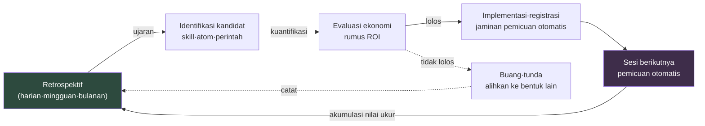

# Bagian 21 · Bab 3. Menutup Loop Self-Improving

> Apakah siklus yang dimulai dari retrospektif kembali lagi ke retrospektif? Jika tidak menutup, itu hanya catatan — bukan sistem.

---

Saya membuka retrospektif dari enam bulan lalu. "Istilah tidak konsisten", "dokumen sulit ditemukan", "pertanyaan yang sama ditanyakan lagi." Lalu saya membuka retrospektif yang saya tulis pagi ini. "Istilah tidak konsisten", "dokumen sulit ditemukan", "pertanyaan yang sama ditanyakan lagi."

Sama persis sampai ke kata-katanya. Bukan karena saya tidak melakukan retrospektif. Selama enam bulan saya melakukannya dengan tekun. Halaman Notion menumpuk rapi, dan di lokakarya kuartalan sticky note memenuhi papan tulis. Namun isi yang tertulis hanya berputar di tempat. Bukan retrospektifnya yang tidak berfungsi. Loop-nyalah yang tidak menutup.

Bab ini adalah bab terakhir buku. Karena itu pertanyaan yang dibahas pun adalah pertanyaan terakhir. Semua alat yang dibuat di bagian-bagian sebelumnya — generator kota di Bagian 6, atom tinjauan mobile di Bagian 14, standar biaya di Bagian 22 — agar semua ini bukan sekadar barang sekali pakai yang dibuat lalu selesai, melainkan menjadi sistem yang tumbuh sendiri, apa lagi yang dibutuhkan? Jawabannya satu. Sebuah lingkaran tertutup di mana ujaran yang muncul dari retrospektif otomatis bekerja mulai dari sesi berikutnya, dan kerja itu kembali diukur lalu kembali ke retrospektif. Mekanisme yang menutup lingkaran inilah loop self-improving.

---

## 21.3.1 Hakikat Loop yang Tidak Menutup

Sebuah ujaran muncul dari retrospektif. "Rapatnya terlalu banyak." Ujaran yang bagus. Namun ujaran itu tertinggal sebagai satu baris di halaman Notion. Minggu depan rapat tetap banyak, dan di retrospektif berikutnya baris yang sama ditulis lagi. Penyebabnya: di antara ujaran dan perbaikan terselip ingatan manusia. Manusia lupa. Karena itu loop terputus.

Agar bisa disebut self-improving, ujaran retrospektif harus berlanjut ke tindakan otomatis pada sesi berikutnya tanpa melewati ingatan manusia. Ada empat syarat yang memenuhi hal ini.

Pertama, ujaran retrospektif harus diubah menjadi bentuk yang langsung dapat dieksekusi. Bukan tekad abstrak, melainkan jatuh menjadi salah satu dari skill, atom, item manifest, atau slash command (perintah garis miring). Kedua, mulai sesi berikutnya ia harus terpicu otomatis tanpa manusia perlu mengingatnya. Ketiga, di retrospektif berikutnya harus terukur secara nyata apa sebenarnya yang ia ubah. Keempat, hasil pengukuran itu harus bersirkulasi kembali sebagai masukan bagi perbaikan berikutnya.

Ketika keempat hal ini berlanjut secara otomatis, loop menutup. Jika satu langkah saja ditambal dengan "minggu depan saya akan ingat dan menerapkannya", tepat di titik itu loop kembali terbuka. Dan di retrospektif berikutnya ujaran yang sama ditulis lagi.

Dengan perumpamaan laci, gambarannya begini. Jika retrospektif berakhir sebagai catatan "pena ini tidak dipakai, mari keluarkan", minggu depan pena itu tetap ada di tempatnya. Bukan catatan, melainkan tangan yang bergerak mengeluarkannya yang membuat loop menutup. Dan pemeriksaan ulang di kuartal berikutnya yang mencegah pena tak terpakai kembali menumpuk di tempat itu. Catatan adalah ujaran, gerakan tangan adalah pemicuan otomatis, dan pemeriksaan kuartal berikutnya adalah pengukuran. Jika satu saja dari ketiganya hilang, laci kembali berantakan.

---

## 21.3.2 Bentuk Tertutup dari Loop

Jika seluruh alurnya digambar, ia menjadi sirkulasi tertutup. Titik awal maupun titik akhir sama-sama retrospektif.



Panah berputar satu putaran dan kembali masuk ke retrospektif. Penutupan inilah intinya. Keluaran setiap tahap menjadi masukan tahap berikutnya, dan nilai ukur terakhir kembali menjadi masukan retrospektif pertama. Jika di antaranya terselip ingatan manusia, panah itu terputus dan sirkulasi pun pecah.

Perhatikan bahwa panah putus-putus, tempat kandidat yang ROI-nya tidak lolos jatuh ke buang·tunda, pada akhirnya juga kembali ke retrospektif. Penilaian "ini tidak layak dibuat" itu sendiri menjadi catatan retrospektif berikutnya, dan menjadi dasar untuk menyaringnya dengan cepat ketika kandidat yang sama muncul lagi. Membuang pun ada di dalam loop.

Ujaran yang berlanjut dari retrospektif menjadi self-improving memiliki lima pola yang telah ditetapkan (dibahas di §21.1.4). Skill yang akan dibuat, skill yang akan diperbaiki, atom yang akan dibuat, atom yang akan diperbaiki, dan evaluasi ulang ekonomi. Jika kelima hal ini dimasukkan sebagai slot ke dalam templat retrospektif itu sendiri, ujaran tidak akan terlewat.

```markdown
## Retrospektif (Harian) — 2026-06-06

### 1. Pekerjaan Hari Ini
- (ringkasan pekerjaan)

### 2. Ujaran self-improving (5 slot)
- Skill yang akan dibuat: <kosongkan dengan "tidak ada">
- Skill yang akan diperbaiki: <>
- Atom yang akan dibuat: <>
- Atom yang akan diperbaiki: <>
- Evaluasi ulang ekonomi: <>

### 3. Yang akan diukur di retrospektif berikutnya
- <>
```

Slot boleh kosong. Fakta bahwa ia kosong itu sendiri adalah catatan "hari ini tidak ada perbaikan baru". Namun jika selama beberapa hari berturut-turut kelima slot kosong semua, itu bukan berarti tidak ada bahan perbaikan, melainkan sinyal bahwa retrospektif mulai mengeras menjadi formalitas. Saat itulah lemparkan pertanyaan pemicu. "Apa pekerjaan yang sama yang minggu ini saya kerjakan dua kali dengan tangan?"

Ujaran muncul dalam keadaan kabur. "Notula rapatnya terlalu panjang." Untuk menumbuhkannya menjadi kandidat, kuantifikasikan menjadi satu keluaran. "Notula rapatnya terlalu panjang" dikonversi menjadi satu alat, yaitu skill `meeting_summary`, yang menerima notula rapat dan mengekstrak hanya keputusan serta action item. "Istilahnya membingungkan" dikonversi menjadi atom `glossary_lookup` yang memuat 30 kosakata domain, dan "pertanyaan yang sama ditanyakan setiap kali" dikonversi menjadi slash command `/onboarding` yang mengotomatiskan panduan hari pertama bagi karyawan baru. "Sinkronisasi sering terlewat" jatuh menjadi pembaruan manifest dan penambahan atom JIT.

Kandidat harus terdefinisi sebagai "satu keluaran tertentu" baru bisa lanjut ke tahap berikutnya. "Mari perbaiki secara keseluruhan" bukanlah kandidat. Ujaran yang tidak bisa dikonversi menjadi satu keluaran tidak bisa diangkat ke meja evaluasi ROI, dan kalau tidak bisa diangkat, ia berhenti di situ.

---

## 21.3.3 ROI adalah Soal Jumlah Digit

Bukan berarti setiap kandidat yang muncul lalu dibuat semua. Sebelum membuat, ukur efek terhadap investasi. Rumusnya sederhana.

<svg viewBox="0 0 720 150" xmlns="http://www.w3.org/2000/svg" font-family="sans-serif">
  <rect x="0" y="0" width="720" height="150" fill="#1e1e28"/>
  <text x="360" y="38" fill="#9fe0b0" font-size="17" text-anchor="middle" font-weight="bold">Rumus ROI</text>
  <line x1="180" y1="85" x2="540" y2="85" stroke="#666" stroke-width="2"/>
  <text x="360" y="72" fill="#e6e6e6" font-size="16" text-anchor="middle">waktu hemat × frekuensi pemicuan × masa operasi</text>
  <text x="360" y="115" fill="#e6e6e6" font-size="16" text-anchor="middle">waktu pembuatan + beban pemeliharaan</text>
  <text x="150" y="92" fill="#c89bf0" font-size="22" text-anchor="middle">ROI =</text>
</svg>

Setiap butir punya satuan dan garis lolosnya. Waktu hemat adalah waktu manusia yang berkurang per satu pemicuan, dihitung dalam satuan menit. Frekuensi pemicuan adalah perkiraan jumlah per minggu; jika minimal sekali seminggu, ia layak. Masa operasi adalah perkiraan jumlah minggu hingga dibuang; alat yang tidak akan bertahan 4 minggu lemah alasannya untuk dibuat. Waktu pembuatan adalah waktu untuk implementasi awal dan verifikasi, sedangkan pemeliharaan adalah waktu untuk pemeriksaan·perbaikan bulanan.

Pembilang adalah akumulasi penghematan, penyebut adalah akumulasi biaya. Putuskan berdasarkan nilai yang keluar.

| Nilai ROI | Keputusan |
|---|---|
| 10 atau lebih | Buat segera |
| 3\~10 | Buat dalam seminggu |
| 1\~3 | Tunda (pending), evaluasi ulang sebulan kemudian |
| Di bawah 1 | Buang dalam bentuk ini. Pertimbangkan cara lain |

ROI di bawah 1 bukan berarti "ide ini tidak berguna", melainkan "jangan dibuat dalam bentuk ini". Periksa dahulu apakah ia bisa digantikan oleh satu baris atom yang lebih ringan, atau apakah ia bisa diselesaikan dengan Wrapper yang hanya mengubah titik masuk alat yang sudah ada. Sering terjadi: pekerjaan yang hendak dibuat sebagai skill berat diturunkan menjadi satu baris atom, penyebut menyusut sepersepuluh, dan ROI pun hidup kembali.

Mari masukkan satu angka nyata. Mari hitung ROI dari sistem injeksi atom JIT yang saya bangun di PC pribadi pada 23 Mei 2026 — infrastruktur tempat hook UserPromptSubmit melihat input pengguna lalu otomatis menginjeksikan potongan memori (atom) yang relevan.

```
Waktu hemat:  sekitar 3~5 menit per sesi (menghilangkan waktu mencari dan memanggil atom terkait dengan tangan)
Frekuensi pemicuan:  15~25 sesi per minggu (basis PC pribadi)
Masa operasi:  diperkirakan 1 tahun+ (bersifat infrastruktur, kemungkinan dibuang rendah)
Waktu pembuatan:  4 jam (hook + manifest + verifikasi atom)
Pemeliharaan:   0.5 jam/bulan (penambahan·perbaikan atom)

ROI = (4 menit × 20 kali/minggu × 52 minggu) / (4 jam × 60 menit + 0.5 jam × 12 bulan × 60 menit)
    = 4,160 menit / (240 menit + 360 menit)
    = 4,160 menit / 600 menit
    ≈ 6.9  →  Rentang "buat segera". Keputusan didukung oleh rumus
```

Di sini ada bagian yang harus saya jujurkan. Angka-angka di atas — 3\~5 menit per sesi, 15\~25 sesi per minggu — bukan pengukuran presisi, melainkan perkiraan berdasarkan pengalaman operasi penulis. Bukan nilai yang diukur dengan stopwatch. Karena itu ROI 6.9 pun bukan nilai yang bisa dipercaya sampai ke desimalnya.

Namun itu tidak masalah. Sebab rumus ROI adalah alat untuk melihat jumlah digit, bukan presisi. Kalau hasilnya di kisaran 7, buat. Kalau di kisaran 0.3, pikirkan ulang. Untuk membedakan keduanya tidak dibutuhkan desimal. Yang penting adalah, bahkan ketika memutuskan untuk tidak membuat, dasarnya harus berasal dari rumus, bukan dari firasat di kepala. Tidak dibuat karena jumlah digitnya tidak cocok — kalau satu baris ini tertinggal di retrospektif, ketika kandidat yang sama muncul lagi kita tidak akan bimbang lagi.

---

## 21.3.4 Selesai Dibuat Bukan Berarti Selesai — Registrasi dan Verifikasi Pemicuan

Kalau kandidat lolos, buat. Namun membuat hanyalah separuhnya. Separuh sisanya adalah meregistrasikannya agar terpicu otomatis mulai sesi berikutnya. Jika registrasi ini terlewat, alat memang terbuat tetapi tertinggal di tempat yang tak tersentuh tangan siapa pun, dan loop terputus di situ.

Tempat registrasi berbeda menurut jenis keluaran. Skill global ditaruh di `~/.claude/skills/` dan dibuatkan atom panduan yang memuat cara pakainya. Skill proyek ditaruh di `.claude/skills/` proyek bersangkutan. Atom baru ditaruh di folder yang sesuai, ditambahkan satu baris ke indeks MEMORY.md, dan diregistrasikan pemicunya ke manifest JIT — ketiga hal ini harus dilakukan semua agar injeksi otomatis hidup. Slash command ditaruh di `~/.claude/commands/`, sedangkan Wrapper mengubah titik masuk alat yang sudah ada dan ditempeli atom panduan.

Jika registrasi terlewat, di retrospektif berikutnya muncul lagi ujaran "ini sudah saya buat, kenapa tidak terpakai". Itu bukan ujaran perbaikan baru, melainkan laporan bug. Sama saja dengan menemukan kembali di retrospektif registrasi yang luput Anda lakukan sendiri.

Bahkan setelah registrasi selesai, masih ada satu tahap. Yaitu membuka sesi baru dan memastikan ia benar-benar terpicu dengan pemicu yang dimaksudkan.

```
1. Mulai sesi baru
2. Masukkan pemicu (mis. "bagaimana kesehatan keluarga")
3. Periksa log JIT → apakah atom yang dimaksudkan benar-benar terinjeksi
   (~/.claude/hooks/_injection_log.txt)
4. Jika tidak muncul → perluas regex pemicu di manifest
   atau tambahkan jalur pemanggilan manual
```

Jika verifikasi ini terlewat, insiden "saya kira ada, tapi pas dibutuhkan malah tidak muncul" akan berulang. Registrasi dan pemicuan adalah dua hal berbeda. Registrasi adalah menaruh file, sedangkan pemicuan adalah pemicunya benar-benar tertangkap. Jika regex pemicu meleset satu huruf saja, registrasi memang dilakukan tetapi ia takkan pernah muncul.

---

## 21.3.5 Pengukuran — Panah yang Kembali ke Retrospektif

Setelah alat yang dibuat dijalankan sekitar 1 minggu hingga 1 bulan, ukur. Pengukuran inilah panah terakhir dari loop, yaitu panah yang kembali masuk ke retrospektif.

Jumlah pemicuan nyata dihitung dari log JIT atau log pemanggilan perintah. Waktu hemat nyata dicatat di retrospektif dalam bentuk "pekerjaan yang dulunya butuh N menit kini selesai dalam M menit". Efek samping — pemicuan keliru, polusi konteks yang tidak perlu — juga dilihat bersamaan. Lalu sandingkan ROI yang diperkirakan di awal dengan ROI hasil ukur.

Kalau ROI perkiraan adalah 6 tetapi ROI hasil ukur 0.8, buang tanpa ampun. Sebab kebersihan sistem lebih utama daripada harga diri pembuatnya. Jika alat yang tidak dipakai menumpuk di manifest, derau itu menggerogoti akurasi retrospektif berikutnya.

Hanya saja, sebelum menekan tombol buang, periksa sekali. Bisa jadi regex pemicunya terlalu sempit sehingga pemicuan sendiri tidak terjadi, atau bisa jadi ia begitu saja terlupakan karena tidak ada jalur pemanggilan manual. Bedakan dahulu apakah ia memang alat yang tidak bernilai, atau alat bagus yang jalur pemicuannya tersumbat. Kalau yang pertama, buang; kalau yang kedua, bukalah jalurnya.

Pembuangan pun diputuskan di retrospektif. Keputusan "alat ini dibuang" itu sendiri adalah keluaran self-improving. Siklus yang hanya membuat tanpa pernah mengosongkan adalah siklus yang hanya bertambah monoton, dan sistem yang bertambah monoton pada akhirnya tertindih oleh bobotnya sendiri.

---

## 21.3.6 Tanda-Tanda Loop yang Tertutup

Apakah loop telah tertutup dapat diketahui dari empat sinyal.

Pertama, ujaran yang sama tidak berulang. Jika item yang sekali ditulis di retrospektif ditulis untuk kedua kalinya, itu berarti pada putaran pertama ada yang gagal di suatu tempat — entah identifikasi kandidat atau implementasi. "Istilah tidak konsisten" di awal bab ini yang berulang selama enam bulan — itulah bukti paling jelas dari loop yang terbuka.

Kedua, jumlah manifest dan atom tidak hanya bertambah monoton. Pembuangan terjadi. Sekitar 10\~20% per kuartal dibereskan — itulah siklus yang sehat. Sistem yang tidak pernah sekali pun menyusut sama dengan laci yang tidak pernah sekali pun dibersihkan.

Ketiga, waktu retrospektif berkurang. Kalau sistem berputar dengan baik, waktu untuk meraba-raba "kemarin saya ngapain ya" lenyap, dan 5 menit cukup untuk mengisi lima slot ujaran.

Keempat, karyawan baru dapat ikut serta dalam retrospektif dalam 1 minggu. Ini mungkin jika format retrospektif terstandar dan atom·skill terlihat jelas.

Tempat loop terputus selalu sudah tertentu setiap kalinya. Jika mode kegagalan dikumpulkan, ketika gejala yang sama terlihat lain kali, resepnya bisa langsung diambil.

| Titik putus | Gejala | Resep |
|---|---|---|
| Tidak ada ujaran | 5 slot selalu kosong | Tambahkan pertanyaan pemicu: "Apa pekerjaan yang sama yang dikerjakan dua kali dengan tangan" |
| Tidak jatuh jadi kandidat | Kabur ala "perbaiki secara keseluruhan" | Paksa kuantifikasi menjadi satu keluaran |
| Evaluasi ROI dilewati | Bikin dulu baru lihat | Jadikan rumus ROI templat 5 menit |
| Dibuat tapi tidak muncul | Registrasi terlewat | Paksa checklist registrasi |
| Muncul tapi tidak dipakai | Pemicu absen·salah setel | Perluas regex + sediakan jalur manual sekaligus |
| Tidak mengukur | Tidak ada slot ukur di retrospektif | Tambahkan slot "yang akan diukur di retrospektif berikutnya" |

Setiap mode kegagalan diujarkan di retrospektif, dan ujaran itu kembali menjadi masukan self-improving. Bahkan pekerjaan memperbaiki loop pun terjadi di dalam loop. Inilah meta-loop.

---

## 21.3.7 Kalimat Terakhir Buku

Buku ini panjang. Dimulai dari arsitektur informasi, membuat alat yang membangkitkan kota, merancang sistem pertempuran, mengotomatiskan tinjauan mobile, menstandarkan biaya, dan menimba atom dari retrospektif. Pertanyaan yang dijawab oleh seluruh alat dari semua bab itu, yang berkumpul di satu tempat, adalah bab terakhir ini. Apakah yang dibuat tumbuh sendiri?

Self-improving pada akhirnya menyusut menjadi satu kalimat.

> Apa yang diputuskan di retrospektif otomatis bekerja mulai sesi berikutnya, dan kerja itu kembali diukur lalu kembali ke retrospektif.

Jika tidak bekerja otomatis, retrospektif adalah buku harian. Buku harian yang ditulis dengan baik bisa menjadi penghiburan, tetapi tidak mengubah sistem. Jika bekerja otomatis, retrospektif menjadi otak sistem. Ujaran setiap hari mengubah tindakan setiap hari, dan hasil tindakan itu membuat ujaran berikutnya lebih akurat.

Seluruh bidang yang dibahas di buku ini — desain informasi, sistem, pertempuran, mobile, biaya, dan dekomposisi Layer sebagai prasyarat procedural generation·otomatisasi — semuanya berevolusi di atas loop self-improving ini. Alat menjadi usang, model berganti, proyek berakhir. Namun selama loop tetap tertutup, sistem hari ini sedikit lebih baik daripada kemarin. Itulah satu hal terakhir yang ditinggalkan buku ini. Bukan cara membuat alat, melainkan cara membuat alat tumbuh sendiri.

Semoga retrospektif Anda berikutnya menjadi putaran pertama dari loop itu.

---

### Poin-Poin Penting
- Loop akan kembali terbuka tepat di titik mana pun — ujaran→kandidat→ROI→implementasi→pemicuan otomatis→pengukuran — yang diserahkan kepada ingatan manusia
- ROI adalah alat untuk melihat jumlah digit, bukan presisi, dan dasar keputusan untuk tidak membuat pun harus berasal dari rumus
- Pembuangan juga keluaran self-improving — siklus yang tidak mengosongkan akan tertindih bobotnya sendiri

---

> **Penerapan di Luar Game.** Jika "istilah tidak konsisten / dokumen sulit ditemukan" tertulis di retrospektif sama persis sampai ke kata-katanya selama enam bulan, itu bukan berarti Anda tidak melakukan retrospektif, melainkan loop-nya yang tidak menutup — karena di antara ujaran dan perbaikan terselip ingatan manusia. Di departemen mana pun, syarat loop tertutup itu sama. Ujaran harus jatuh menjadi satu keluaran yang langsung dapat dieksekusi (templat·checklist·aturan otomatisasi), bekerja tanpa manusia perlu mengingatnya mulai berikutnya, dan efeknya kembali diukur lalu kembali. Misalnya ujaran "rapatnya terlalu panjang" dikonversi menjadi "satu alat yang menerima notula rapat dan mengekstrak hanya keputusan·tugas", dan sebelum dibuat, dengan (waktu hemat × frekuensi pemicuan × masa operasi) ÷ (waktu pembuatan·pemeliharaan) hanya dihitung jumlah digitnya untuk menentukan apakah langsung dibuat atau ditunda. Bahkan keputusan untuk tidak membuat pun dasarnya harus berasal dari rumus, bukan firasat, agar ketika kandidat yang sama muncul lagi kita tidak bimbang lagi.

## Coba Sendiri

### setup
1. Masukkan 5 slot self-improving dan slot "yang akan diukur di retrospektif berikutnya" ke dalam templat retrospektif.
2. Tetapkan satu baris rumus ROI dan tabel rentang keputusan (10↑ segera / 3\~10 seminggu / 1\~3 tunda / 1↓ buang) di bagian atas berkas retrospektif.
3. Siapkan checklist registrasi (lokasi registrasi per skill·atom·perintah·Wrapper).

### prompt
```
Isikan 5 slot self-improving dari retrospektif hari ini.
Kuantifikasi setiap ujaran menjadi "satu keluaran", dan untuk tiap kandidat perkirakan ROI
dengan (menit hemat × pemicuan per minggu × minggu operasi) / (menit pembuatan + menit pemeliharaan),
lalu lampirkan rentang keputusan (segera/seminggu/tunda/buang).
Cantumkan dasar tiap angka perkiraan dalam satu baris, dan jika bukan pengukuran presisi tandai sebagai "perkiraan".
```

### verify
1. Setelah mengimplementasikan kandidat yang lolos, buka sesi baru dan masukkan dengan pemicu yang dimaksudkan.
2. Periksa log pemicuan — apakah atom·perintah yang dimaksudkan benar-benar muncul.
3. Di retrospektif 1 minggu\~1 bulan kemudian, bandingkan ROI hasil ukur dengan ROI perkiraan, dan jika di bawah 0.8 putuskan pembuangan setelah membedakan apakah jalurnya tersumbat.

### Versi Ringkas Solo
Tak perlu punya tim. Kalau sendirian, ringkas seperti ini. Di penghujung hari, satu baris catatan — "apa yang hari ini saya kerjakan dua kali dengan tangan." Satu hal itu Anda ubah keesokan harinya menjadi satu baris otomatisasi (atom·alias·snippet). Seminggu kemudian, cukup lihat apakah satu baris itu benar-benar terpakai. Kalau terpakai biarkan, kalau tidak hapus. Satu baris ujaran → satu baris otomatisasi → satu baris pengukuran. Unit terkecil dari loop adalah ketiga baris ini.
