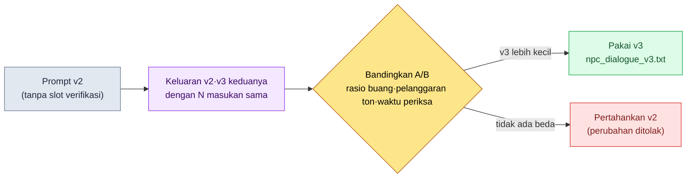

# 22.1 Rekayasa Prompt — Satu Halaman Surat Perintah Kerja bagi Game Designer

> Pembaca utama: Game Designer yang menarik LLM ke dalam pekerjaan nyata (tim skala menengah, 10\~50 orang)
> Versi ringkas untuk pembaca solo/hobi: §22.1.7 "Versi Ringkas Solo"

Saya pernah mengetik "Buatkan 5 dialog untuk NPC ini" hanya untuk mendapat tiga baris dialog NPC. Yang kembali adalah lima baris yang tidak akan terasa janggal jika ditempelkan ke game fantasi mana pun — dan justru karena itu tidak cocok di mana pun dalam game kami. Tonnya kosong, AI tidak tahu siapa NPC ini, dan dialognya tidak nyambung dengan baris di sebelahnya. Satu per satu, tiap baris secara gramatikal baik-baik saja. Masalahnya, menerima lima baris itu lalu memeriksanya memakan waktu lebih lama daripada jika saya menulisnya sendiri dari awal.

Bab ini membahas cara mengubah perintah satu baris itu menjadi **satu halaman surat perintah kerja**. Teori umum tentang prompt sudah cukup banyak dibahas di buku lain. Di sini, empat hal yang harus dipegang oleh seorang Game Designer saat duduk di depan LLM — konteks, format keluaran, pencegahan halusinasi, dan permintaan verifikasi — ditunjukkan bukan sebagai potongan abstrak, melainkan sebagai **satu halaman prompt npc_dialogue yang benar-benar dijalankan**. Saya menelusuri prompt itu sampai habis satu siklus: apa yang saya masukkan, apa yang keluar, dan apa yang saya tolak.

---

## 22.1.1 Prompt Adalah Surat Perintah Kerja — Empat Prinsip Muat dalam Satu Halaman

Surat perintah kerja yang baik tidak harus pendek. Sama seperti saat Anda menyerahkan pekerjaan kepada anggota baru dengan berkata "Kerjakan yang bagus, ya" lalu setiap kali hasilnya berbeda, begitu pula jika Anda berkata "Buatkan dialog" kepada LLM, setiap kali yang datang adalah rata-rata RPG umum. Dengan model yang sama pun, hasilnya berbeda jika surat perintah kerjanya berbeda — bahwa kualitas keluaran bisa berbeda berlipat-lipat adalah anggapan umum di industri, dan buku ini tidak menjanjikan kelipatan itu dengan angka. Yang jelas hanyalah arahnya: prompt yang memuat konteks dan batasan menghasilkan keluaran dengan beban pemeriksaan yang lebih kecil daripada satu baris polos tanpa konteks.

Empat hal yang harus dipenuhi sekaligus oleh prompt seorang Game Designer adalah sebagai berikut.

| Prinsip | Definisi satu baris | Jika tidak dipatuhi |
|---|---|---|
| ① Konteks | Memberikan apa yang harus dilihat untuk menjawab (visi·voice·dialog yang berdekatan) | Keluar rata-rata fantasi umum |
| ② Format keluaran | Mematok jumlah·panjang·label·item yang dilarang | Pemeriksaan melebar menjadi tafsir uraian bebas |
| ③ Pencegahan halusinasi | Menyatakan "Jangan membuat apa pun di luar materi yang diberikan" | Mengarang latar yang tidak ada |
| ④ Permintaan verifikasi | Membuat keluaran menandai sendiri sesuai kriteria apa ia cocok | Tidak ada dasar untuk meloloskannya melewati gerbang |

Jika Anda menghafal empat baris ini secara terpisah, satu-dua di antaranya selalu terlewat. Karena itu, pendekatan bab ini adalah **menaruh keempat prinsip sebagai slot di dalam satu halaman prompt**. Jika sebuah slot kosong, terlihat jelas bahwa prinsip itu terlewat. Pada bagian berikutnya kita melihat satu halaman itu secara utuh.

---

## 22.1.2 [Worked Transcript] Satu Halaman Prompt npc_dialogue

Saya memindahkan apa adanya `prompts/narrative/npc_dialogue_v3.txt` yang benar-benar dioperasikan di proyek penulis (MMORPG mobile-first, selanjutnya disebut "Proyek A") setelah menganonimkannya. Nama kota·NPC dan sebutan khas perusahaan diganti untuk keperluan buku, dan keluarannya adalah rekonstruksi sesi nyata. Prompt masukan berbentuk siap salin-pakai langsung.

### Tahap 1 — Memasukkan Konteks: Mulai dari Siapa NPC Ini

Pertama, isi slot dengan materi yang akan dirujuk oleh prompt. Ketiganya bukan ditulis baru, melainkan diambil dari aset yang sudah ada.

```yaml
# Masukan slot (ditempel di atas badan prompt)
L0_visi:        # Caching — tidak dikirim ulang setiap pemanggilan
  world_premise:  "Konfederasi negara-kota para sarjana yang segel sihirnya kian mendingin"
  tone_manifesto: "Tahan sentimentalitas. Tokoh tidak menjelaskan emosi, melainkan menyatakannya lewat tindakan·benda."
voice_profile:    # Identitas NPC ini (5 item)
  id: npc_doren_vale
  rentang_usia: "50-an"
  kebiasaan_bicara: "Hanya bicara dengan angka. Hampir tidak memakai kata sifat."
  pengetahuan_dunia: "Mencatat getaran mikro urat segel selama 30 tahun. Tidak tahu keadaan di luar Guild sarjana."
  pantangan:  "Dilarang kosakata mistis seperti ramalan·takdir·dewa (ton kota = scholarly_strict)"
  relasi:  "Memperlakukan pemain sebagai 'variabel eksternal di luar objek pengamatan', kewaspadaan maupun keramahannya lemah"
dialog_berdekatan:        # Konteks tepat sebelumnya — baris yang sudah muncul di scene yang sama
  - (Pemain) "Lampu menara lonceng menyala semalaman, ada apa gerangan?"
```

Di sini, 5 item `voice_profile` adalah inti dari prinsip ①. Usia·kebiasaan bicara·rentang pengetahuan·pantangan·relasi — kelima hal inilah yang membuat "Doren Vale" berbeda dari NPC lain. Khususnya, **rentang dari pengetahuan_dunia** (tidak tahu keadaan di luar Guild) adalah pekerjaan pendahulu untuk prinsip ③ pencegahan halusinasi. Apa yang tidak diketahui harus dinyatakan agar AI tidak melangkah keluar dari sana.

### Tahap 2 — Badan Prompt: Memaku Format·Halusinasi·Verifikasi dalam Satu Halaman

```
[Konteks L0] world_premise + tone_manifesto                    (di-cache)
[voice_profile] 5 item npc_doren_vale (yaml di atas)
[Dialog berdekatan] 1 baris pertanyaan pemain tepat sebelumnya

Lihat materi di atas, lalu tulis dialog doren_vale yang menjawab pertanyaan pemain.

[Format keluaran — prinsip ②] Tepat 3 buah, satu baris satu dialog, masing-masing maksimal 40 karakter. Di akhir baris beri label emosi salah satu dari (datar|waspada|sinis). Hilangkan penjelasan·tanda kutip lainnya.

[Pencegahan halusinasi — prinsip ③] Tulis hanya yang ada pada materi di atas, dan jangan mengarang fakta baru terkait segel·menara lonceng. Jika ada yang dibutuhkan tetapi tidak ada di materi, tandai baris itu sebagai '[tidak ada materi: apa yang dibutuhkan]'. Dilarang kosakata seperti ramalan·takdir·dewa.

[Permintaan verifikasi — prinsip ④] Di bawah dialog, tulis satu baris untuk tiap dari 5 item voice_profile apakah cocok/melanggar, dan pada baris yang Anda tidak yakin beri ★ serta satu baris alasannya.
```

Perhatikan bahwa keempat prinsip seluruhnya termuat dalam satu halaman ini. Slot di bagian atas adalah ①, blok `[Format keluaran]` adalah ②, blok `[Pencegahan halusinasi]` adalah ③, dan blok `[Permintaan verifikasi]` adalah ④. Lebih dari separuh prompt bukanlah "tulis apa", melainkan batasan: "tulis bagaimana, apa yang tidak boleh ditulis, dan bagaimana memverifikasi diri sendiri". Karena memberi kebebasan menghasilkan rata-rata, pekerjaan kita adalah memangkas kebebasan itu.

### Tahap 3 — Keluaran Claude (rekonstruksi sesi nyata, mentah)

```
Urat itu mendingin. 12.4. Kemarin 12.1. (datar)
Bukan hal yang baik. Tapi tugasku hanya mencatat. (sinis)
Mengapa kau bertanya bukanlah objek pengamatanku. (waspada)

[Verifikasi — 5 item voice_profile]
- rentang_usia (50-an): Cocok. Tutur kata terkendali ala sarjana lanjut usia.
- kebiasaan_bicara (hanya angka): Cocok. 2 angka di baris ke-1. Namun baris ke-2·3 tanpa angka ★
- pengetahuan_dunia (tak tahu luar Guild): Cocok. Tidak ada penyebutan keadaan luar.
- pantangan (dilarang mistisisme): Cocok. Kosakata ramalan·takdir·dewa 0 buah.
- relasi (perlakukan sebagai variabel eksternal): Cocok. Di baris ke-3 mendorong pemain keluar dari objek pengamatan.

★ Catatan: jika item kebiasaan_bicara ditafsirkan ketat sebagai 'hanya bicara dengan angka',
   baris ke-2·3 bisa jadi melanggar. Perlu pertimbangan manusia apakah memaksakan angka di tiap baris.
```

Bagian paling berharga dari keluaran ini bukanlah tiga baris dialognya, melainkan **satu baris ★ di paling bawah**. AI melaporkan sendiri titik yang ambigu di antara keluarannya dan menyerahkannya kepada manusia. Prompt yang baik membuat AI mampu berkata "Bagian ini saya tidak yakin" — itu efek langsung dari memasukkan prinsip ④.

### Tahap 4 — Verifikasi dan Penolakan (Tempat Manusia)

Keluaran tidak diterima begitu saja. ★ yang diajukan AI diputuskan oleh manusia. Di sesi ini memang ada satu baris yang tersangkut.

Kata *"baik"* pada baris ke-2 "Bukan hal yang baik" bentrok dengan kebiasaan bicara di voice_profile ("Hampir tidak memakai kata sifat"). Itulah titik yang AI laporkan dengan ★. Doren Vale adalah tokoh yang bicara dengan angka alih-alih kata sifat berisi penilaian, tetapi "Bukan hal yang baik" tergelincir menjadi tutur kata NPC orang tua yang lazim. Itu satu baris yang membuat tonnya buram.

Maka saya meminta ulang.

```
Baris ke-2 "Bukan hal yang baik" memakai kata sifat ('baik') sehingga melanggar kebiasaan bicara voice_profile.
Tulis ulang hanya baris ini dengan angka atau kosakata pengamatan. Baris ke-1·3 dipertahankan.
Aturan format·halusinasi·verifikasi tetap diberlakukan.
```

AI menjawab ulang baris ke-2 menjadi **"Tiga tahun lalu 9.0. Inilah jawabannya. (datar)"**. Tanpa kata sifat, ia menyatakan krisis lewat perubahan angka, dan lolos kembali pada 5 item voice_profile. Tutup dengan sekali bolak-balik. Antara menulis sendiri dengan tangan tiga baris dialog yang tonnya sudah terjaga sejak awal, versus satu halaman prompt berisi slot + pemeriksaan ★ + sekali bolak-balik — yang terakhir punya beban pemeriksaan lebih kecil; itulah kesimpulan sesi ini (berdasar pengalaman penulis; waktu absolutnya berubah-ubah tergantung tingkat kesulitan ton NPC, jadi sebaiknya dibaca sebagai arah).

---

## 22.1.3 Struktur 4 Lapis — Bagaimana Menyusun Satu Halaman Prompt

Jika Anda mencatat dalam satu halaman mengapa prompt di atas tersusun dalam urutan itu, maka mulai dari prompt berikutnya Anda bisa membuatnya seperti mengisi slot kosong. Konteks disusun dari bawah ke atas, dari yang berat (hampir tak berubah) ke yang ringan (berubah tiap kali). Lapis yang tak berubah di-cache untuk menghemat biaya (§22.1.5).

<svg viewBox="0 0 560 360" xmlns="http://www.w3.org/2000/svg" role="img" aria-label="Diagram struktur 4 lapis prompt Game Designer">
  <rect x="0" y="0" width="560" height="360" fill="#0f1117"/>
  <!-- L0 -->
  <rect x="40" y="40" width="480" height="56" rx="6" fill="#1e3a5f" stroke="#3b82f6" stroke-width="1.5"/>
  <text x="56" y="64" fill="#bfdbfe" font-family="sans-serif" font-size="14" font-weight="bold">L0  Visi · Ton (world_premise · tone_manifesto)</text>
  <text x="56" y="84" fill="#93c5fd" font-family="sans-serif" font-size="11">Hampir tak berubah → caching. Fondasi prinsip ① Konteks.</text>
  <!-- L1 -->
  <rect x="40" y="106" width="480" height="56" rx="6" fill="#14532d" stroke="#22c55e" stroke-width="1.5"/>
  <text x="56" y="130" fill="#bbf7d0" font-family="sans-serif" font-size="14" font-weight="bold">L1  voice_profile · aturan penamaan · lore wilayah</text>
  <text x="56" y="150" fill="#86efac" font-family="sans-serif" font-size="11">5 item pembeda NPC ini + menyatakan rentang yang tak diketahui → kerja pendahulu prinsip ③.</text>
  <!-- L2 -->
  <rect x="40" y="172" width="480" height="56" rx="6" fill="#854d0e" stroke="#f59e0b" stroke-width="1.5"/>
  <text x="56" y="196" fill="#fde68a" font-family="sans-serif" font-size="14" font-weight="bold">L2  dialog berdekatan · forbidden_names</text>
  <text x="56" y="216" fill="#fcd34d" font-family="sans-serif" font-size="11">Baris tepat sebelum scene·nama yang dilarang berulang → agar nyambung dengan dialog di sebelahnya.</text>
  <!-- L3 -->
  <rect x="40" y="238" width="480" height="82" rx="6" fill="#7f1d1d" stroke="#ef4444" stroke-width="1.5"/>
  <text x="56" y="262" fill="#fecaca" font-family="sans-serif" font-size="14" font-weight="bold">L3  Instruksi kerja (berubah tiap kali)</text>
  <text x="56" y="282" fill="#fca5a5" font-family="sans-serif" font-size="11">[Format keluaran]②  ·  [Pencegahan halusinasi]③  ·  [Permintaan verifikasi]④</text>
  <text x="56" y="302" fill="#fca5a5" font-family="sans-serif" font-size="11">"Tepat 3 buah · 40 karakter · label (emosi) · dilarang di luar materi · verifikasi diri 5 item"</text>
  <!-- 화살표 라벨 -->
  <text x="280" y="350" fill="#9ca3af" font-family="sans-serif" font-size="11" text-anchor="middle">Disusun dari bawah (berat·caching) → ke atas (ringan·diganti tiap kali)</text>
</svg>

Satu halaman pada §22.1.2 persis seperti gambar ini. L0·L1 diambil dari materi lalu ditempel ke slot (fondasi prinsip ①·③), dan ke L3 dimasukkan tiga blok format·halusinasi·verifikasi (prinsip ②·③·④). Saat menerima dialog NPC berikutnya, yang berubah hanyalah voice_profile di L1 dan dialog berdekatan di L2. Kerangka L0 dan L3 dipakai ulang — itulah sebabnya prompt menjadi sebuah "pustaka".

---

## 22.1.4 Prompt sebagai Aset — Pustaka dan Manajemen Versi

Prompt npc_dialogue di atas bukan dipakai sekali lalu dibuang. Ia ditaruh dalam berkas per bidang·per pekerjaan, lalu dipanggil alih-alih ditulis baru tiap kali. Folder prompt Proyek A tampak seperti ini.

```
prompts/
├── narrative/
│   ├── npc_dialogue_v3.txt        # ← §22.1.2 adalah berkas ini
│   ├── quest_synopsis_v2.txt
│   └── consistency_check_v1.txt
├── balance/
│   ├── change_proposal_v2.txt
│   └── outlier_analysis_v1.txt
├── content/
│   ├── city_npc_batch_v2.txt
│   └── side_quest_v3.txt
└── meta/
    ├── meeting_summary_v2.txt
    └── decision_card_v1.txt
```

`_v3` di ujung nama berkas adalah intinya. Prompt bukan selesai begitu dibuat sekali, melainkan **aset yang mendekati keputusan**, jadi setiap kali diubah, perubahan hasilnya diukur dan versinya dinaikkan. Begitulah jalur npc_dialogue sampai ke v3.



Perubahan nyata dari v2 ke v3 adalah blok `[Permintaan verifikasi]` di §22.1.2. Pada v2 tidak ada slot bagi AI untuk memverifikasi sendiri keluarannya per item dan memasang ★. Begitu satu blok itu dimasukkan, seperti pada Tahap 4 §22.1.2, AI mulai melaporkan lebih dulu baris yang ambigu, dan beban manusia membaca seluruhnya dari awal untuk menangkapnya berkurang. Saya tidak menaikkan versi dengan "kesannya membaik". Saya menaruh keluaran v2·v3 berdampingan dengan satu kumpulan masukan yang sama, lalu memakainya setelah memastikan jumlah pelanggaran ton dan waktu pemeriksaan benar-benar berkurang.

Efek terbesar yang diberikan pustaka adalah bagi anggota baru. Jika pada hari pertama masuk kerja ia memanggil npc_dialogue_v3.txt, ia langsung memakai struktur slot 4 lapis yang telah dipoles seorang senior lewat puluhan kali bolak-balik, sejak awal. Sebelum menguasai "cara menulis prompt yang baik" lewat tubuhnya sendiri, ia sudah memegang di tangan satu halaman yang sudah ditulis dengan baik.

---

## 22.1.5 Cara Menangani Biaya secara Jujur — Caching dan cap

Bila prompt memanjang, biaya token bertambah. Bab ini tidak menuliskan kelipatan tak terverifikasi seperti "berkat standardisasi, biaya ×2 lenyap". Sebagai gantinya, ia hanya menyebut yang benar-benar dapat diukur.

Ada dua perangkat struktural untuk menahan biaya. Pertama, **alasan menaruh L0·L1 di bawah pada §22.1.3 adalah caching**. Jika lapis visi·ton yang hampir tak berubah di-cache, lapis itu tidak dikirim ulang·ditagih lagi pada setiap pemanggilan. Saat menarik dialog NPC 100 kali, selisih antara mengirim ulang L0 100 kali versus men-cache-nya sekali saja makin melebar seiring tumpukan pemanggilan. Kedua, dengan menaruh **cap token per pemanggilan**, kita mencegah terlalu banyak pekerjaan dijejalkan sekaligus ke dalam satu prompt.

Yang penting di sini adalah bahwa tempat biaya diukur itu benar-benar ada. Pada sistem atom Proyek A, `_economy_log/` (log ekonomi token·waktu) dan `_roi_report.md` (laporan ROI (Return on Investment, efek terhadap investasi)) ada sebagai meta operasional. Efek standardisasi prompt dilacak dengan pengukuran nyata di log ini, bukan diklaim dengan menuliskan angka yang tampak meyakinkan di tabel naskah. Prinsip buku ini ada salah satu dari tiga.

- **Standar publik dikutip apa adanya.** (Item ini sedikit pada bab ini — angka resmi jarang ada untuk format prompt.)
- **Perkiraan penulis ditulis sebagai perkiraan.** Arah "beban pemeriksaan berkurang" adalah perkiraan berdasar pengalaman, dan tidak pernah menjanjikan kelipatan absolut.
- **Hanya yang dapat diukur dijanjikan sebagai KPI.** Yang benar-benar terukur dalam operasi prompt adalah jumlah pelanggaran ton, rasio buang, token per pemanggilan (sebelum-sesudah caching), dan waktu pemeriksaan. Keempat hal ini keluar angkanya lewat `_economy_log`.

---

## 22.1.6 Kegagalan yang Umum

| Pola | Mengapa gagal | Resep |
|---|---|---|
| Perintah satu baris "Buatkan 5 dialog" | Konteks 0 → rata-rata RPG umum | Prompt slot 4 lapis §22.1.2 |
| Tidak menuliskan 'rentang yang tak diketahui' di voice_profile | AI mengarang latar di luar materi | Nyatakan batas pada slot pengetahuan_dunia (prinsip ③) |
| Menerima keluaran saja tanpa slot verifikasi | Manusia harus membaca seluruhnya dari awal | Verifikasi diri + ★ lewat blok `[Permintaan verifikasi]` (prinsip ④) |
| Menulis prompt baru tiap kali | Membentuk ulang know-how yang sama dari nol | Pustaka `prompts/` + versi |
| Mengadopsi perubahan prompt dengan kesan | Tak bisa memastikan apakah membaik | Naikkan versi setelah mengukur A/B masukan sama |
| Mengirim ulang konteks panjang tiap pemanggilan | Biaya token menumpuk sebanyak jumlah pemanggilan | Caching L0·L1 + cap per pemanggilan |

Yang keenam paling lambat ditemukan. Biaya tidak terasa sakit dengan sekali pemanggilan, dan baru terlihat di `_economy_log` setelah produksi massal menumpuk.

---

> **Penerapan di Luar Game.** Perintah satu baris memanggil hasil rata-rata "yang tidak terasa janggal ditempel di mana pun, sehingga justru tidak cocok untuk pekerjaan saya" — ini bukan masalah dialog game semata. Prompt adalah surat perintah kerja saat Anda menyerahkan pekerjaan kepada anggota baru, jadi jika Anda menaruh empat hal dalam satu halaman — apa yang harus dilihat untuk menjawab (konteks), jumlah·panjang·item yang dilarang (format keluaran), "jangan mengarang di luar materi" (pencegahan halusinasi), "tandai sendiri sesuai kriteria apa ia cocok" (permintaan verifikasi) — keluar keluaran dengan beban pemeriksaan kecil. Misalnya, saat seorang petugas SDM menerima draf lowongan kerja, jika ia menyatakan "Tulis hanya item yang ada pada materi syarat jabatan, dan jangan mengarang tunjangan·gaji yang tidak ada di materi; tandai dengan [perlu diperiksa]", maka ia mencegah insiden syarat yang dipalsukan secara meyakinkan menyusup ke dalam lowongan. Jika Anda menyimpan satu halaman surat perintah kerja untuk pekerjaan yang sering dipakai sebagai berkas, itulah garis start bagi rekan kerja Anda.

## 22.1.7 Coba Sendiri — Satu Langkah yang Bisa Dilakukan Hari Ini

> **Versi Ringkas Solo**: Anda tidak butuh pustaka maupun caching. Pilih satu NPC dari game Anda sendiri (atau game favorit Anda), tuliskan dengan tangan 5 item voice_profile dari Tahap 1 §22.1.2 (usia·kebiasaan bicara·rentang yang diketahui·pantangan·relasi), lalu tempel badan prompt Tahap 2 apa adanya dan jalankan sekali. Dari tiga baris yang keluar, pilih sendiri satu baris yang menyimpang dari voice_profile dan bantah dengan "baris ini melanggar item kebiasaan bicara, tulis ulang hanya baris itu" — maka Anda akan merasakan lewat tubuh sendiri apa yang dilakukan masing-masing dari keempat slot prompt itu.

Jika Anda dalam tim, mulailah dengan satu langkah berikut. Pilih satu pekerjaan yang sering dipakai (misalnya: dialog NPC), lalu taruh satu halaman prompt berformat §22.1.2 sebagai berkas di `prompts/narrative/`. Jika Anda mulai dengan memastikan keempat blok (slot·format·halusinasi·verifikasi) sudah masuk semua, maka satu berkas itu langsung menjadi garis start bagi anggota baru tim. Manajemen versi dan caching adalah langkah berikutnya.

**Jalur minimum chatbot web (tanpa terminal)** — keempat prinsip bab ini bekerja apa adanya hanya dengan satu kolom input chatbot web (ChatGPT atau Claude web), tanpa berkas·pustaka·caching. Sebab rekayasa prompt bukanlah soal alat, melainkan soal "apa yang Anda masukkan dalam satu halaman". Dua langkah berikut adalah jalur utamanya.
1. Pilih satu pekerjaan Anda sendiri, lalu tuliskan dengan tangan kelima item dari Tahap 1 §22.1.2 (usia·kebiasaan bicara·rentang yang diketahui·pantangan·relasi; jika di luar game, baca menjadi 'sasaran·gaya bicara·rentang dasar·larangan·relasi'). Tidak butuh YAML maupun berkas, cukup tulis sebagai kalimat di kolom input chatbot.
2. Di bawahnya, tempel badan prompt Tahap 2 §22.1.2 apa adanya, tetapi pastikan saja keempat blok sudah masuk semua — `[Format keluaran]` (jumlah·panjang·label·larangan), `[Pencegahan halusinasi]` ("jangan mengarang di luar materi, jika perlu [tidak ada materi]"), `[Permintaan verifikasi]` ("tulis cocok/melanggar per item dan beri ★ jika tidak yakin"). Setelah dijalankan, manusia hanya memutuskan baris yang dipasangi ★ lalu membantah sekali, maka satu siklus tertutup. Pustaka·versi·caching baru diperkenalkan ketika Anda mulai memakai prompt yang sama berulang kali.

---

## 22.1.8 Pratinjau Bab Berikutnya

Pada 22.2 dibahas halusinasi dan keamanan. Jika prinsip ③ bab ini (slot pencegahan halusinasi) adalah pertahanan lapis pertama di dalam satu halaman prompt, maka 22.2 melihat pertahanan berlapis yang menangkap di tingkat operasi halusinasi yang berhasil menembus pertahanan itu.

---

### Poin-Poin Penting
- Prompt adalah surat perintah kerja — masukkan 4 prinsip ke dalam slot satu halaman.
- Satu halaman npc_dialogue: konteks·format·pencegahan halusinasi·verifikasi dalam 4 lapis.
- Biaya·efek lewat pengukuran nyata `_economy_log`, kelipatan rekaan tidak ditulis.

### Pratinjau Bab Berikutnya
- 22.2 Keamanan AI·Halusinasi — pertahanan berlapis terhadap halusinasi yang menembus prompt
