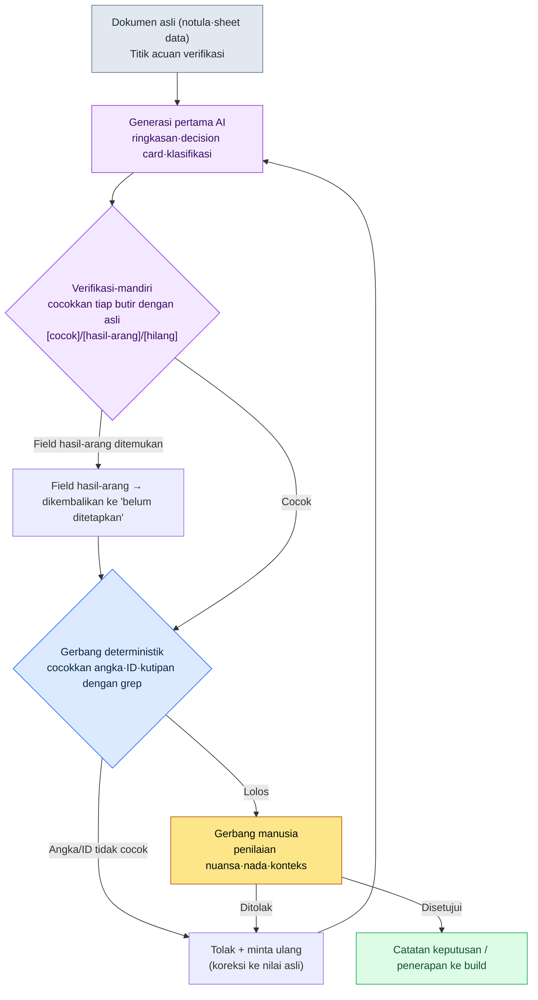

# 22.2 Rekan Kerja yang Berbohong dengan Penuh Percaya Diri — Mencegah Halusinasi dengan Gerbang Verifikasi

> Pembaca utama: Game Designer yang memproduksi dokumen, data, dan catatan keputusan secara masif dengan AI (tim skala menengah, 10–50 orang)
> Versi ringkas untuk pembaca solo/hobi: §22.2.7 "Versi Ringkas Solo"

Ini terjadi pada hari ketika saya meringkas 17 notula rapat dengan AI untuk merapikannya menjadi decision card (kartu keputusan). Keluarannya rapi. Mulai dari ID keputusan, tanggal rapat yang dikutip, hingga satu baris alasan — formatnya sempurna. Salah satu kartu di antaranya tertulis "Pada rapat TF Combat 2026-04-18, kebijakan cooldown ditetapkan". Masalahnya, hari itu tidak ada rapat TF Combat. AI mencampur agenda dan tanggal dari rapat lain lalu mengarang satu kartu yang tampak meyakinkan, dan karena formatnya sempurna, kartu itu nyaris masuk begitu saja ke dalam catatan keputusan tim.

Inilah halusinasi (halusinasi). LLM justru semakin percaya diri menjawab ketika ia kurang tahu. Jika diibaratkan manusia, ia seperti rekan kerja yang di rapat berkata tegas "Ah, itu sudah diputuskan begitu," padahal kalau ditelusuri keputusan semacam itu tidak pernah ada. Ketika satu kalimat itu mengalir ke sheet data, ke balasan CS, atau ke aset atom, jadilah ia sebuah insiden. Bab ini tidak membahas cara membungkam mulut rekan kerja itu — itu mustahil — melainkan cara membangun **gerbang verifikasi yang wajib dilewati sebelum ucapannya diloloskan**. Pembahasan umum tentang halusinasi sudah banyak di buku lain, jadi bab ini hanya berfokus pada *tempat mencegahnya dengan alur kerja AI*.

---

## 22.2.1 Halusinasi Tidak Pernah Menjadi Nol — Karena Itu Kita Pasang 'Gerbang'

Tidak ada prompt yang membuat halusinasi menjadi nol. Model yang lebih besar dan prompt yang lebih baik menurunkan frekuensinya, tetapi tidak sampai nol. Karena itu, titik berangkat operasional bukanlah "menghilangkan halusinasi", melainkan "memasang gerbang yang menangkap halusinasi sebelum ia menyentuh keputusan dan data".

Prinsip inti gerbang hanya satu. **Hal-hal yang dapat diarang oleh LLM (kutipan, angka, ID) diverifikasi di tempat yang bukan LLM.** Sumber verifikasi ada tiga: kode (deterministik), dokumen asli (grep), atau mata manusia. Bertanya ulang kepada LLM "tolong cek apakah ini benar" juga bisa menjadi satu tahap gerbang, tetapi itu hanya pelengkap, bukan penentu akhir.

Di sini saya rapikan dulu titik yang paling sering dibingungkan oleh Game Designer. Wilayah yang rentan halusinasi dan yang tahan halusinasi jelas berbeda.

| Pekerjaan | Risiko halusinasi | Mengapa | Gerbang |
|---|---|---|---|
| Perhitungan angka (reward/probabilitas) | Sangat tinggi | LLM menerka aritmetika | Hitung dengan kode, larang LLM |
| Kutipan (rapat/ID keputusan) | Tinggi | Membuat sumber yang tidak ada tampak meyakinkan | Cocokkan dengan grep ke dokumen asli |
| Klasifikasi (tag/kategori) | Sedang | Tertukar labelnya | Bisa dibandingkan secara deterministik |
| Ringkasan/inferensi | Sedang | Menambah atau menghilangkan butir yang tidak ada | Verifikasi-mandiri + gerbang manusia |
| Penciptaan (flavor text) | Rendah | Tidak ada jawaban benar, konsep 'halusinasi' lemah | Gerbang tinjauan nada |

Baris pertama adalah resep paling sederhana. **Angka tidak diserahkan ke LLM.** Sebagaimana kita menyerahkan perkalian kepada kalkulator, serahkan ke alat deterministik. Baris kedua (kutipan) adalah tulang punggung bab ini. Pada pekerjaan seperti meringkas notula rapat dan decision card — di mana *dokumen asli ada tetapi LLM menarasikannya ulang* — halusinasi paling berbahaya sekaligus paling mudah ditangkap. Karena dokumen aslinya ada, kita bisa membandingkannya.

---

## 22.2.2 [Worked Transcript] Menangkap Halusinasi Ringkasan Notula dengan Verifikasi-Mandiri

Jika hanya menulis "diverifikasi" secara abstrak, kita tidak tahu apa yang dikerjakan dan bagaimana caranya. Kita akan melihat tuntas satu siklus — dari masukan hingga permintaan ulang — yang meringkas satu notula rapat lalu menangkap halusinasi pada ringkasan itu. Prompt di bawah bisa langsung disalin dan dipakai, dan keluarannya adalah hasil rekonstruksi sesi nyata.

### Langkah 1 — Masukan: Lemparkan Notula Asli Apa Adanya

Pertama, ada dokumen asli yang akan diringkas. Inilah yang menjadi titik acuan verifikasi. Jika kita membiarkan LLM meringkas dari "ingatan" tanpa dokumen asli, tidak ada yang bisa dibandingkan.

```markdown
# 회의록 — 2026-04-15 전투 밸런스 검토

참석: Minsoo Lee, Anggota Tim A, Anggota Tim B
안건:
1. Cooldown skill area — pendapat bahwa 8 detik saat ini terlalu pendek. Dipertimbangkan dinaikkan ke 12 detik.
   결론: Diputuskan sementara 12 detik, dikonfirmasi setelah memeriksa telemetri pada build berikutnya.
2. HP transisi fase bos — usulan menurunkan dari 50% ke 30%.
   결론: Ditunda. Berbenturan dengan jadwal pengarahan seni (art), dibahas ulang minggu depan.
3. Durasi status abnormal baru 'Freeze' — sudah dibahas tetapi angkanya belum ditetapkan.
```

### Langkah 2 — Prompt Ringkasan Pertama

```
첨부한 회의록을 결정 카드로 요약하라.

규칙:
1) Tiap agenda menjadi 1 kartu. Format: [agenda | kesimpulan | status (konfirmasi/sementara/ditunda) | alasan]
2) Jangan menghasilkan informasi yang tidak ada di notula. Jangan menerka angka, tanggal, atau peserta.
3) Untuk agenda yang belum berkesimpulan, setel status menjadi 'belum ditetapkan' dan jangan mengarang kesimpulan sembarangan.

출력 형식: Hanya tabel. Dilarang memberi penjelasan.
```

### Langkah 3 — Keluaran Pertama Claude (rekonstruksi, kutipan)

```
| 안건            | 결론                  | 상태 | 근거                          |
|----------------|----------------------|------|------------------------------|
| Cooldown skill area | 8 detik → 12 detik | Sementara | Dikonfirmasi setelah cek telemetri |
| Transisi fase bos | 50% → 30% ditunda | Ditunda | Bentrok jadwal pengarahan seni |
| Durasi Freeze    | Diputuskan 3 detik | Konfirmasi | Mengikuti standar durasi status abnormal |
```

Mari lihat kartu ketiga. Pada dokumen asli hanya tertulis "Durasi Freeze sudah dibahas tetapi angkanya belum ditetapkan". Namun keluarannya menulis **"Diputuskan 3 detik / Konfirmasi / Mengikuti standar"**. Ketiga butir itu semuanya informasi yang tidak ada di notula. LLM mengisi kolom kosong dengan pengetahuan umum semacam "kalau status abnormal biasanya beberapa detik". Karena formatnya sempurna, kalau sekadar dilihat sepintas, ia tidak ketahuan.

### Langkah 4 — Permintaan Ulang Verifikasi-Mandiri (inti gerbang)

Di sini kita tidak menerima keluaran apa adanya, melainkan **memaksa verifikasi-mandiri yang mencocokkan baris demi baris dengan dokumen asli**. Inilah satu jurus kunci bab ini.

```
방금 만든 결정 카드 3장을, 첨부한 원본 회의록과 한 항목씩 대조하라.

Untuk setiap field (kesimpulan, status, alasan, angka) pada tiap kartu:
- Apakah ini isi yang tertulis langsung di dokumen asli? → [cocok]
- Apakah ini isi yang kau tambahkan padahal tidak ada di asli? → tandai [hasil-arang] dan nyatakan bahwa sumbernya tidak ada
- Adakah butir yang ada di asli tetapi hilang dari kartu? → laporkan sebagai [hilang]

Kembalikan semua field [hasil-arang] yang tidak punya dasar di asli menjadi 'belum ditetapkan'.
```

### Langkah 5 — Keluaran Verifikasi-Mandiri Claude (rekonstruksi, mentah apa adanya)

```
대조 결과:

Kartu 1 (Cooldown skill area)
- Kesimpulan "8 detik→12 detik": [cocok] Agenda 1 "dinaikkan ke 12 detik"
- Status "sementara": [cocok] "diputuskan sementara"
- Alasan "dikonfirmasi setelah cek telemetri": [cocok]

Kartu 2 (Transisi fase bos)
- Kesimpulan "50%→30% ditunda": [cocok]
- Status "ditunda": [cocok] "Ditunda. Dibahas ulang minggu depan"
- Alasan "bentrok jadwal pengarahan seni": [cocok]
- [hilang] Syarat "dibahas ulang minggu depan" di asli hilang dari kartu. Perlu ditambahkan ke alasan.

Kartu 3 (Durasi Freeze)
- Kesimpulan "diputuskan 3 detik": [hasil-arang] — asli berbunyi "angka belum ditetapkan". 3 detik adalah nilai yang saya tambahkan.
- Status "konfirmasi": [hasil-arang] — asli tidak menarik kesimpulan.
- Alasan "mengikuti standar durasi status abnormal": [hasil-arang] — tidak ada penyebutan standar semacam itu di asli.
  → Sesuai aturan, saya kembalikan Kartu 3 menjadi sebagai berikut:
  | Durasi Freeze | (angka belum ditetapkan) | belum ditetapkan | Dibahas di rapat tetapi tanpa kesimpulan |
```

Keluaran inilah bagian paling bernilai di bab ini. AI mencocokkan keluarannya sendiri dengan dokumen asli, lalu **mengaku "3 detik adalah nilai yang saya tambahkan"**, dan mengembalikan Kartu 3 menjadi 'belum ditetapkan' sesuai aturan. Pada saat yang sama, ia bahkan menangkap kelalaian pada Kartu 2 (syarat "dibahas ulang minggu depan") yang luput juga oleh manusia. Halusinasi (menambah yang tidak ada) dan kelalaian (menghilangkan yang ada) adalah dua sisi mata uang yang sama, sehingga keduanya tertangkap dengan pencocokan yang sama.

Hal yang perlu diwaspadai juga jelas. Verifikasi-mandiri ini **bukan obat mujarab.** Jika LLM salah membaca dokumen asli, ia bisa saja mengeluarkan hasil pencocokan yang keliru dengan penuh percaya diri. Karena itu verifikasi-mandiri adalah *tahap pertama* gerbang, dan jika dokumen aslinya pendek, manusia menopangnya sekali lagi dengan grep. Hasil-arang yang kentara seperti Kartu 3 hampir selalu tertangkap oleh verifikasi-mandiri, tetapi penyimpangan makna dan distorsi nuansa yang halus pada akhirnya tetap ditentukan oleh gerbang manusia di tahap terakhir.

---

## 22.2.3 Gerbang Verifikasi — Diagram Alir dalam Satu Lembar

Jika kita menggeneralisasi siklus di atas, gerbang yang dilewati keluaran AI sampai menyentuh keputusan dan data adalah seperti berikut. Tempat yang disentuh tangan manusia hanya ada dua: paling depan, tempat memasukkan dokumen asli dengan bersih, dan paling belakang, tempat menjatuhkan penilaian yang tak bisa ditangkap gerbang otomatis.



Alasan gerbangnya rangkap tiga adalah karena tiap tahap menangkap hal yang berbeda. Verifikasi-mandiri menangkap *apakah ada yang ditambahkan padahal tidak ada* dengan cara LLM mencocokkannya sendiri; gerbang deterministik menangkap *apakah angka dan ID sama persis huruf demi huruf dengan asli* dengan kode; dan gerbang manusia menangkap *apakah isinya memang benar tetapi konteksnya melenceng*. Jika hanya satu tahap yang dinyalakan, insiden akan bocor di tempat yang seharusnya dijaga oleh dua tahap lainnya. Pada §22.2.2, "3 detik" di Kartu 3 tertangkap di tahap pertama (verifikasi-mandiri), kelalaian Kartu 2 tertangkap di tahap pertama, dan seandainya verifikasi-mandiri salah membaca "12 detik" menjadi "21 detik", ia akan tertangkap di tahap kedua (grep).

---

## 22.2.4 Gerbang Tidak Boleh Menghentikan Aliran meski Ia Gagal — Desain Aman hook

Ketika memasukkan gerbang verifikasi ke dalam pipeline otomasi, ada satu insiden yang paling sering dibuat pemula. Yaitu membuat **seluruh pekerjaan berhenti ketika gerbangnya sendiri meledak**. Jika grep mati karena kesalahan encoding atau berkas manifes rusak, kode yang seharusnya membantu verifikasi malah memblokir seluruh pekerjaan pengguna. Lalu dalam satu dua minggu tim akan berkata "matikan saja verifikasi itu".

Saya kutip apa adanya cara hook injeksi atom JIT (`inject_memory.py`) yang benar-benar beroperasi di buku ini menangani masalah ini. hook ini menyela setiap kali pengguna mengetik prompt untuk menginjeksikan memori yang relevan — bisa dikatakan ia adalah *gerbang yang selalu menyala*. Satu baris tertulis jelas pada komentar prinsip desainnya.

```python
설계 원칙:
- Selalu exit 0 (meski gagal, dilarang mengganggu aliran kerja pengguna)
- Jika tidak ada kecocokan, kembalikan respons kosong (normal)
```

Dan prinsip ini terimplementasi secara konsisten di seluruh kode. Meski parsing stdin gagal, meski JSON manifes rusak, meski pembacaan isi atom gagal — semuanya jatuh ke `emit_empty()` dan `exit 0`.

```python
def emit_empty() -> None:
    sys.exit(0)

def main() -> None:
    try:
        ...
        payload = json.loads(raw)
    except Exception:
        emit_empty()        # meski masukan rusak, lolos diam-diam
        return
    ...
    try:
        manifest = json.loads(MANIFEST_PATH.read_text(encoding="utf-8"))
    except Exception:
        emit_empty()        # meski manifes rusak, pekerjaan tidak diblokir
        return

if __name__ == "__main__":
    try:
        main()
    except Exception:
        emit_empty()        # jaring terakhir untuk exception apa pun
```

Inti desainnya adalah **memisahkan kegagalan gerbang dari kegagalan konten**. Ketika hook gagal menginjeksikan memori, bagi pengguna itu hanyalah "sesi biasa tanpa memori terlampir", bukan insiden yang memblokir pekerjaan. Gerbang verifikasi pun harus seperti itu. Ketika gerbang grep tak bisa berjalan karena masalah encoding, kartu itu *bukannya diloloskan*, melainkan ditandai "verifikasi otomatis gagal — alihkan ke gerbang manusia" dan diserahkan ke tahap manusia. Matinya gerbang tidak boleh membuat keluaran yang belum terverifikasi otomatis disetujui, dan pada saat yang sama matinya gerbang tidak boleh membuat seluruh pipeline berhenti. Nilai baku aman yang memenuhi keduanya adalah "diam-diam diserahkan ke manusia". `except: emit_empty()` pada `inject_memory.py` justru adalah implementasi minimal dari pola itu.

---

## 22.2.5 Cara Menangani Angka Halusinasi secara Jujur

Godaan untuk memasukkan tabel semacam "menurunkan tingkat halusinasi dari 89% ke 3%" ke bab ini sangat besar. Angka semacam itu menggerus kepercayaan buku jika metode pengukurannya tidak diungkap. Prinsip buku ini ada tiga.

Pertama, **hanya yang dapat diukur yang dikatakan sebagai angka.** Untuk menjanjikan tingkat halusinasi, kita harus mendefinisikan penyebut dan pembilangnya. Penyebut adalah "jumlah decision card yang ditinjau", pembilang adalah "jumlah kartu yang padanya terdapat minimal 1 [hasil-arang]/[hilang] saat dicocokkan dengan asli". Tanpa definisi ini, "tingkat halusinasi 5%" itu hampa. Inilah cara yang sebenarnya saya hitung saat meninjau ringkasan notula di awal penerapan, dan karena sampelnya kecil, ia bukan parameter populasi yang presisi melainkan *nilai arah*.

Kedua, **perbandingan antarmodel hanya menyatakan arah.** Arah "model besar lebih sedikit berhalusinasi daripada model kecil" teramati secara stabil. Namun angka absolut semacam "Opus 3%, open 7B 20%" sangat berfluktuasi tergantung pekerjaan, prompt, dan domain, sehingga buku ini tidak mengeklaim nilai absolut. Yang diambil hanya arahnya (semakin besar model semakin sedikit, tetapi bertukar untung dengan biaya).

Ketiga, **standar publik dikutip apa adanya.** Pada bab ini hampir tidak ada angka standar yang perlu diarang, tetapi nilai setelan seperti temperature adalah fakta publik di dokumentasi API model. Pekerjaan verifikasi dan analisis menyetel temperature rendah (mendekati deterministik), pekerjaan kreatif menyetelnya tinggi — ini bukan perkiraan, melainkan definisi perilaku API.

Maka indikator terukur yang benar-benar dijanjikan bab ini ada tiga — jumlah deteksi [hasil-arang] (jumlah halusinasi yang ditangkap verifikasi-mandiri), jumlah penolakan gerbang grep (jumlah ketidakcocokan angka·ID), dan jumlah penolakan gerbang manusia. Ketiganya dapat dihitung dari log tiap kuartal, dan di rapat kita bisa berbicara dengan angka, bukan dengan "perasaan".

---

## 22.2.6 Kegagalan yang Umum

| Pola | Mengapa gagal | Resep |
|---|---|---|
| Menerima ringkasan AI hanya dengan melihat format | Halusinasi paling tak ketahuan saat formatnya sempurna | Verifikasi-mandiri pencocokan dengan asli (§22.2.2 Langkah 4) |
| Meringkas dari ingatan LLM tanpa dokumen asli | Tidak ada titik acuan untuk dicocokkan, verifikasi mustahil | Masukkan dokumen asli ke input lebih dulu |
| Menyerahkan perhitungan angka ke LLM | Aritmetika ditebak sehingga berbeda tiap kali | Hitung dengan alat deterministik (§22.2.1) |
| Seluruh pekerjaan berhenti ketika gerbang verifikasi meledak | Tim mematikan gerbangnya | exit 0 + alihkan ke tahap manusia (§22.2.4) |
| Keluaran tak terverifikasi otomatis disetujui ketika gerbang mati | Halusinasi lolos begitu saja | Kegagalan gerbang = tandai 'belum terverifikasi' |
| Memercayai verifikasi-mandiri sebagai penilaian akhir | Jika LLM salah baca asli, salah nilai pun penuh percaya diri | Dokumen asli pendek diiringi grep manusia |

---

> **Penerapan di Luar Game.** "Rekan kerja yang berbohong dengan penuh percaya diri" — AI yang mengarang tanggal rapat atau keputusan yang tidak ada dengan format yang sempurna — sama berbahayanya bukan hanya pada decision card game, melainkan pada semua peringkasan dokumen. Karena halusinasi paling tak ketahuan saat formatnya sempurna, pada pekerjaan yang punya dokumen asli (ringkasan notula, kutipan kontrak, perapian laporan) janganlah menerima keluaran apa adanya, melainkan memaksa verifikasi-mandiri berupa "cocokkan tiap butir dengan dokumen asli, dan tandai isi yang kau tambahkan sebagai [hasil-arang]" sebagai intinya. Misalnya, setelah meminta asisten hukum meringkas kontrak lalu mencocokkan nominal, tanggal, dan nomor pasal dengan asli huruf demi huruf, AI akan mengaku "nilai denda ini adalah angka yang saya tambahkan" sambil mengembalikan kolom kosong ke 'belum ditetapkan'. Perhitungan angka jangan sekali-kali diserahkan ke AI, serahkan ke kalkulator atau rumus; dan rancanglah alat verifikasi otomatis agar, meski gagal, ia tidak memblokir pekerjaan, melainkan mengalihkannya ke "belum terverifikasi — konfirmasi manusia".

## 22.2.7 Coba Sendiri — Satu Langkah yang Bisa Anda Lakukan Hari Ini

> **Versi Ringkas Solo**: Anda tidak butuh kode maupun hook. Mintalah AI meringkas satu dokumen pendek yang Anda miliki (memo rapat, patch notes, satu halaman dokumen desain), lalu tempelkan apa adanya prompt verifikasi-mandiri Langkah 4 dari §22.2.2. Cukup satu baris "cocokkan tiap butir dengan dokumen asli, dan tandai isi yang kau tambahkan sebagai [hasil-arang]" maka AI akan mulai melaporkan sendiri halusinasinya. Sekali saja Anda menerima pengakuan [hasil-arang], alasan mengapa ringkasan AI tidak boleh sekadar dipercaya akan terasa langsung di badan.

Jika Anda dalam tim, mulailah dengan satu langkah berikut. Tetapkan tahap verifikasi-mandiri sebagai *prompt baku* pada decision card dan ringkasan yang dibuat AI (§22.2.2). Setelah itu, pilih hanya field yang harus sama persis huruf demi huruf dengan asli — seperti angka, ID keputusan, dan tanggal — lalu buat pencocokan grep dengan kode. Pada titik ini, kode verifikasi tersebut wajib dirancang agar **meski gagal, ia tidak memblokir pekerjaan** (exit 0 + tandai 'belum terverifikasi') seperti `inject_memory.py` (§22.2.4). Dengan dua tahap saja — verifikasi-mandiri dan grep — Anda sudah bisa lebih dulu mencegah insiden paling umum, yakni halusinasi berformat sempurna bocor ke dalam catatan keputusan.

---

### Poin-Poin Penting
- Halusinasi tidak pernah menjadi nol, maka cegahlah dengan gerbang verifikasi sebelum ia menyentuh keputusan.
- Jika dicocokkan tiap butir dengan dokumen asli, AI akan melaporkan sendiri halusinasinya.
- Rancang kode verifikasi agar tidak memblokir aliran meski gagal (exit 0).

### Pratinjau Bab Berikutnya
- 22.3 Manajemen Biaya AI — Mengoperasikan token per model, caching, dan cap dengan log nyata
