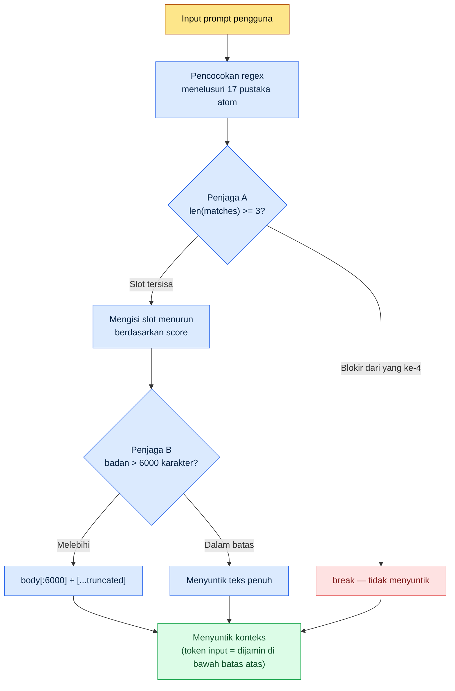

# 22.3 Manajemen Biaya AI — Menjaga Anggaran Token lewat Kode

> Pembaca utama: lead perancang yang memperkenalkan alat AI ke tim dan bertanggung jawab atas biayanya (tim skala menengah, 10\~50 orang)
> Versi ringkas untuk pembaca solo/hobi: §22.3.9 "Versi Ringkas Solo"

Bila bab tentang biaya justru memakai angka biaya yang palsu, bab itu menjadi kontradiksi terhadap dirinya sendiri. Karena itu bab ini tidak membuat tabel mulus bertuliskan "tim kami menghemat sekian per bulan". Sebagai gantinya, saya hanya memakai dua jenis angka. Yang pertama adalah **harga token publik** yang bisa diperiksa siapa pun (tarif per 1M token untuk tiap model), yang lain adalah **konstanta yang terpaku** di dalam kode hook yang saya operasikan sendiri (`max_atom_body = 6000`, `max_matches = 3`). Keduanya bukan dibuat-buat, melainkan dikutip.

Yang menakutkan dari biaya AI bukanlah jumlahnya yang besar. Tetapi karena **tidak terlihat**. Pada bulan pertama pemakaian, jumlah panggilan masih sedikit sehingga tagihan kecil. Lalu ketika konteks menjadi panjang dan panggilan makin sering, tagihan suatu kuartal mengubah jumlah digitnya. Bila kesimpulan bab ini saya sebut lebih dulu, begini — biaya dikendalikan bukan dengan tekad "ayo berhemat", melainkan dengan **kode yang secara paksa memangkas token pada setiap panggilan**. Bukan kemauan manusia, melainkan wrapper dan truncate yang menahannya.

---

## 22.3.1 Biaya LLM Pada Dasarnya adalah Satu Pos Saja: 'Token Input'

Pos biaya ada empat — input, output, cache hit, dan cache write — tetapi yang mendominasi tagihan dalam praktik adalah **token input**. Alasannya sederhana. Hampir semua pekerjaan yang memakai AI dalam desain game berbentuk "memasukkan konteks panjang dan menerima jawaban pendek". Bila dokumen visi L0, pustaka atom, badan teks kota-kota tetangga, dan kutipan sheet data semuanya dijejalkan, inputnya mencapai puluhan ribu token, sementara outputnya hanya satu tabel sehingga beberapa ratus token.

Karena itu prioritas pertama pengendalian biaya bukan "ayo kurangi output", melainkan **"di mana memangkas token input"**. Satu baris ini menggiring seluruh sisa bab ini.

Mari kita pakukan dulu harga publik per model. Berikut adalah tarif per 1M (satu juta) token yang dipublikasikan Anthropic, sebuah **snapshot yang langsung mengutip harga publik dari generasi model pada saat buku ini ditulis (tingkatan terbaru Opus·Sonnet·Haiku saat itu)** (dikutip dari harga publik resmi — karena berubah menurut generasi dan waktu model, wajib memeriksa daftar harga terkini sebelum diterapkan). Sesuai prinsip yang dirangkum Lampiran K, yang tidak berubah di sini bukanlah **nilai absolut harga, melainkan rasio harga di antara ketiga tingkatan**. Maka tabel di bawah dibaca bukan sebagai "tagihan hari ini", melainkan sebagai struktur yang menunjukkan bahwa "makin rendah tingkatan, harga turun dalam ukuran digit".

| Model | Input 1M token | Output 1M token | Catatan |
|---|---|---|---|
| Claude Opus | $15 | $75 | Penalaran tingkat teratas (harga publik) |
| Claude Sonnet | $3 | $15 | Menengah — harga input 1/5 dari Opus |
| Claude Haiku | $0.80 | $4 | Ringan — harga input sekitar 1/19 dari Opus |
| Cache hit (read) | Sekitar 1/10 dari harga input standar | — | Saat menggunakan ulang input yang tercache (kebijakan caching publik) |

Intinya ada di dua baris terakhir. **Bila pekerjaan yang sama dijalankan dengan Haiku alih-alih Opus, harga per token input menjadi sekitar 1/19**, dan **bila konteks yang sama dilewatkan ke cache, harga input untuk bagian itu menjadi sekitar 1/10**. Dua sumbu besar penghematan biaya muncul dari sini — pengoptimalan model dan caching. Keduanya bukan struktur "ayo pakai lebih sedikit", melainkan "ayo kerjakan pekerjaan yang sama dengan harga yang lebih murah".

> Penghematan datang bukan dari tekad, melainkan dari selisih harga. Bila Opus diturunkan ke Haiku, sekitar 19 kali lipat, dan bila dilewatkan ke cache, sekitar 10 kali lipat berkurang secara otomatis.

---

## 22.3.2 Biaya Input Terbesar adalah 'Konteks yang Disuntikkan di Setiap Panggilan'

Ada biaya yang menumpuk lebih diam-diam ketimbang harga pekerjaan individual. Yaitu **konteks yang otomatis menempel di setiap panggilan**. Pada PC pribadi saya berjalan sebuah hook yang otomatis menyelipkan memori (atom) yang relevan setiap kali pengguna mengetik prompt (UserPromptSubmit hook, `inject_memory.py`). Ini fitur kemudahan, tetapi sekaligus juga **kandidat nomor satu kebocoran biaya**. Karena badan atom yang panjang masuk ke konteks pada setiap input, bila dibiarkan tanpa kendali, token input membengkak pada setiap panggilan.

Karena itu pada hook ini terpaku tiga lapis pengaman yang memangkas biaya. Bukan teori abstrak, melainkan konstanta dalam kode nyata.

```python
# inject_memory.py — UserPromptSubmit hook (kode operasi nyata, kutipan)
# Prinsip desain (teks asli docstring):
#   - Selalu exit 0 (jangan ganggu alur pengguna meski gagal)
#   - Menyuntikkan maksimal 3 atom menurun berdasarkan score
#   - Bila badan atom melebihi 6000 karakter, truncate

# (1) Membaca konstanta anggaran dari config manifest
max_matches = cfg.get("max_matches", 3)      # jumlah atom maksimal per panggilan
max_body    = cfg.get("max_atom_body", 6000) # batas atas badan per atom (karakter)

# (2) Mengurutkan menurun berdasarkan score — mengisi slot mahal sesuai nilainya
atoms_sorted = sorted(atoms, key=lambda a: a.get("score", 0), reverse=True)

matches = []
for atom in atoms_sorted:
    if len(matches) >= max_matches:   # (Penjaga A) berhenti di maksimal 3
        break
    if re.search(atom["regex"], prompt, re.IGNORECASE):
        matches.append(atom)

# (3) Saat menyuntikkan badan, memotong di 6000 karakter
for atom in matches:
    body = atom_path.read_text(encoding="utf-8")
    if len(body) > max_body:          # (Penjaga B) truncate
        body = body[:max_body] + "\n\n[...truncated]\n"
```

Di sini sudah tercakup ketiga lapis penjaga biaya.

- **Penjaga A — batas atas jumlah (`max_matches = 3`)**: walau ada 10 atom yang cocok dengan input, hanya maksimal 3 yang menempel. Kode mencegah kecelakaan di mana seluruh pustaka berisi 17 atom masuk ke setiap panggilan.
- **Penjaga B — batas atas panjang (`max_atom_body = 6000`)**: walau badan atom berisi 12,000 karakter, dipotong di 6,000 karakter. Secara struktural mustahil satu atom retrospektif panjang menggandakan biaya panggilan.
- **Penjaga C — prioritas score**: tiga slot diisi menurut score tertinggi. Artinya "atom bernilai rendah" tidak bisa menempati token input yang mahal.

Tiga konstanta ini sekaligus adalah **batas atas token input per panggilan**. Bila ditaksir kasar, 6,000 karakter satu atom dalam bahasa Korea berskala kira-kira beberapa ribu token (karena jumlah token yang tepat berbeda menurut tokenizer dan bahasa, lebih tepat dibaca sebagai struktur "ada batas atas yang terpasang" ketimbang nilai absolut). 3 × 6,000 karakter adalah anggaran penyuntikan per panggilan, dan di atas itu kode memangkasnya. Manusia tidak perlu menemukan dengan mata bahwa "atom yang menempel terlalu banyak".

---

## 22.3.3 [Worked Transcript] Bagaimana Satu Baris truncate 6000 Karakter Menahan Biaya

Bila hanya diucapkan bahwa "truncate menahan biaya", itu hampa. Sebenarnya ketika membuat konstanta ini, saya menjalankan satu siklus penuh bersama AI sampai tuntas. Berikut adalah reproduksi sesi itu secara setia. Prompt input bisa disalin dan dipakai apa adanya, dan output direkonstruksi dari sesi nyata.

### Langkah 1 — Input: melempar situasi masalah apa adanya

Tepat setelah hook pertama kali dijalankan, di `_injection_log.txt` tertinggal catatan bahwa pada satu panggilan badan atom disuntikkan secara utuh. Bila atom panjang (retrospektif, konteks kesehatan, dll.) masuk dengan ukuran penuh pada setiap panggilan, makin sering pekerjaan itu dipakai, makin menumpuk token inputnya. Di mana ini harus dipotong, itulah yang saya tanyakan ke AI.

### Langkah 2 — Prompt: memaksakan batas dan format

```
Ada hook (inject_memory.py) yang otomatis menyuntikkan atom ke konteks pada
setiap panggilan. Saya ingin menetapkan batas atas truncate untuk menahan biaya
token input, jadi usulkan batas atas jumlah karakter badan per atom dan batas
atas jumlah atom yang disuntikkan per panggilan. Kalau terlalu pendek inti
terpotong, kalau terlalu panjang token bocor, jadi jelaskan juga trade-off itu,
dan untuk yang kamu tidak yakin, tandai tersendiri agar diserahkan ke manusia.
(maksud: nilai batas atas diasumsikan dieksternalisasi sebagai config) Dalam
tabel: Item | Nilai usulan | Dasar | Tingkat keyakinan.
```

Perhatikan bahwa separuh prompt adalah "pemaksaan batas dan format". Bila AI dibiarkan bebas pada pertanyaan terkait biaya, akan keluar jawaban tak bertanggung jawab semacam "tergantung situasi". **Memaksakan angka konkret, mewajibkan menyebut trade-off, dan menyisipkan pintu keluar berupa perintah melapor bila tak yakin** itulah inti dari prompt ini.

### Langkah 3 — Output Claude (rekonstruksi, kutipan)

```
| Item            | Usulan | Dasar                                          | Keyakinan |
|-----------------|--------|------------------------------------------------|-----------|
| max_atom_body   | 6000 kr| 'Inti+dasar' satu atom Korea umumnya muat dalam| Sedang    |
|                 |        | 4~6 ribu karakter. Dengan 6000 karakter kepala |           |
|                 |        | badan (intisari·aturan) hampir terjaga, hanya  |           |
|                 |        | ekor (deret contoh) yang terpotong.            |           |
| max_matches     | 3      | Topik yang satu input cocoki kuat secara serempak| Tinggi  |
|                 |        | biasanya 1~3. 4 atau lebih sinyal bahwa regex   |          |
|                 |        | terlalu lebar.                                  |          |
| Lokasi eksternal| _jit_manifest.json > config | Disesuaikan saat operasi tanpa | Tinggi |
|                 |                             | redeploy kode                  |        |
| Penanda truncate| Lekatkan ekor [...truncated]| Model·manusia tahu ada potongan| Sedang |
| Yang tak diyakini| Apakah 6000 nilai tepat    | Konversi token per tokenizer    | ★Rendah|
|                 | (konversi karakter→token    | beda menurut bahasa·model, jadi  |        |
|                 | tidak pasti)                | satuan karakter adalah aproksimasi|       |
```

Yang paling bernilai dari output bukan tabelnya, melainkan **baris ★ paling bawah**. AI sendiri melaporkan bahwa "saya tidak tahu apakah 6000 adalah nilai optimal yang tepat, konversi karakter→token tidak pasti". Prompt yang baik membuat AI mengatakan bahwa ia tidak tahu.

### Langkah 4 — Verifikasi dan Penolakan (tempat manusia)

Saya tidak menerima output ini apa adanya. AI menyajikan 6000 karakter sebagai "garis di mana inti terjaga", tetapi sebenarnya bila dipotong di 6000 karakter, apa yang terpotong harus diperiksa sendiri. Saya memilih atom paling panjang (konteks kesehatan, akumulasi retrospektif) dan melihat dengan mata titik 6000 karakternya.

Hasil pemeriksaan, satu kasus tersangkut. **Titik 6000 karakter memotong baris tabel di tengah badan** sehingga baris seperti `| Vitamin D | 1000IU |` terpotong di tengah. Maknanya terjaga, tetapi baris tabel yang terpotong masuk ke model sebagai Markdown yang rusak terasa mengganjal. Maka saya minta ulang.

### Langkah 5 — Permintaan ulang

```
Saat memotong di 6000 karakter, ada kasus di mana baris tabel Markdown
terputus di tengah. Apakah lebih baik koreksi yang menjepret posisi potongan ke
batas pergantian baris tepat sebelumnya? Karena tidak boleh implementasinya jadi
lebih rumit daripada efek truncate, simpulkan sekalian apakah dikerjakan atau
tidak dengan menimbang nilai terhadap biayanya.
```

AI menjawab begini — "Jepret batas baris bisa dilakukan dengan satu baris `body[:max_body].rsplit('\n', 1)[0]`, tetapi **karena tujuan truncate adalah batas atas token, bukan integritas tabel**, satu baris tabel yang rusak hampir tidak berpengaruh pada biaya·perilaku. Karena saat ini penanda `[...truncated]` saja sudah membuat model tahu 'di sini terpotong', saya **menyarankan untuk tidak melakukan** jepret baris. Bila tetap dilakukan, koreksi satu baris saja sudah cukup."

Jawaban ini benar. Bila kode pengendali biaya sampai mengincar integritas tabel, kode penjaganya sendiri membengkak. **Kode operasi saat ini mempertahankan pemotongan sederhana `body[:max_body] + "[...truncated]"`.** Sebuah siklus yang ditutup dengan satu kali bolak-balik: usulan pertama AI (6000 karakter) diverifikasi manusia, lalu nafsu untuk koreksi berlebihan ditahan kembali oleh AI.

---

## 22.3.4 Struktur Penjaga Biaya — Sekilas Pandang

Saya catatkan dalam diagram aliran penuh bagaimana konstanta yang ditetapkan di sesi atas tadi memangkas token input pada panggilan nyata.



Pokok gambar ini adalah bahwa **apa pun yang diinput pengguna, ada plafon untuk token yang disuntik per panggilan**. Plafonnya adalah `3 × 6000 karakter` (+penanda), dan di atas itu kode tanpa syarat memangkasnya. Biaya tidak bersandar pada kemampuan menahan diri pengguna. Penjaga A·B bekerja secara mekanis pada setiap panggilan.

Filosofi yang sama berulang juga di tingkat alat. Pada sistem perusahaan saya ada kebijakan untuk **mematok tepat 12 buah** skill wrapper yang terekspos ke slot global (atom `skill_listing_budget_wrapper_only_policy`). Saat sesi dimulai, bila jumlah wrapper `*` global bukan 12, skrip pembersih berjalan otomatis. Nama bakunya "penataan slot", tetapi esensinya adalah **perlindungan anggaran token saat sesi dimulai** — biaya daftar skill yang termuat ke konteks diikat sebanyak 12 buah. Batas atas penyuntikan 3 atom dan batas atas paparan 12 skill adalah penerapan berbeda dari pemikiran yang sama.

---

## 22.3.5 Pembagian Model per Pekerjaan — 80% dengan Harga Lebih Murah

Bila penjaga menahan token per panggilan, pemilihan model menentukan harga token itu. Pada tabel §22.3.1, harga input adalah Opus:Sonnet:Haiku ≈ 19:4:1. Maka menjalankan semua pekerjaan dengan Opus sama dengan menanggung harga 19 kali lipat bahkan untuk pekerjaan sederhana seperti klasifikasi dan penggantian.

Bagikan harga menurut kompleksitas pekerjaan.

| Jenis pekerjaan | Model yang disarankan | Alasan |
|---|---|---|
| Terkait langsung verifikasi·hukum, analisis keputusan | Opus | Pekerjaan yang kecelakaannya besar bila salah — jangan irit harga |
| Laporan·ringkasan·pengolahan bahasa alami | Sonnet | Butuh kualitas tetapi tak sampai penalaran teratas |
| Klasifikasi·penandaan·ekstraksi kata kunci | Haiku | Pola sederhana — cukup dengan harga sekitar 1/19 dari Opus |
| Pemetaan·penggantian sederhana | Haiku atau deterministik | LLM pun sering tidak perlu |

Berdasarkan pengalaman, sebagian besar pekerjaan cukup dengan Sonnet·Haiku. **Model mahal dipakai hanya untuk "pekerjaan yang mahal bila salah".** Hanya ada satu jebakan — bila diturunkan ke model yang terlalu murah, halusinasi bertambah sehingga biaya verifikasi memakan habis nilai penghematan (terkait langsung dengan halusinasi·keamanan di bab sebelumnya, §22.2). Maka pembagian model bukanlah "pokoknya murah", melainkan pemisahan "pekerjaan yang murah meski salah dibikin murah, pekerjaan yang mahal bila salah dibikin mahal".

Baris terakhir "Pemetaan·penggantian sederhana → deterministik" sering kali adalah penghematan terbesar. Pekerjaan yang jawabannya sudah pasti satu, seperti penggantian nama atau pemetaan aturan yang sudah ditetapkan, tidak perlu memanggil LLM. **Panggilan termurah adalah membuat panggilan itu sendiri menjadi 0.**

---

## 22.3.6 Caching — Input yang Sama dengan Harga 1/10

Walau token per panggilan ditahan (penjaga) dan harga diturunkan (pembagian model), **bila konteks yang sama dikirim ulang baru di setiap panggilan**, biaya bocor. Input panjang yang nyaris tidak berubah, seperti dokumen visi L0, pustaka atom, dan panduan gaya bidang, dicache. Saat cache hit, bagian input itu ditagih sekitar 1/10 dari harga standar (tabel §22.3.1).

```python
# Konteks yang tidak berubah ditandai dengan cache_control — saat cache hit sekitar 1/10
messages = [
    {"role": "system", "content": SYSTEM_PROMPT},
    {"role": "user", "content": [
        {"type": "text", "text": L0_VISION,    "cache_control": {"type": "ephemeral"}},
        {"type": "text", "text": ATOM_LIBRARY, "cache_control": {"type": "ephemeral"}},
        {"type": "text", "text": SPECIFIC_TASK},  # hanya bagian yang berubah tiap kali, di luar cache
    ]},
]
```

Intinya adalah **memisahkan bagian yang berubah dari bagian yang tidak berubah**. Karena cache hanya hit bila bagian depan input identik, konteks tetap (L0·atom) diletakkan di depan, dan instruksi pekerjaan yang berubah tiap kali diletakkan di belakang.

Apa yang dilewatkan ke cache dipilah menurut frekuensi perubahan.

| Konteks | Caching | Alasan |
|---|---|---|
| Visi L0 (nyaris tetap) | Cocok | Hanya berubah dalam hitungan beberapa hari\~beberapa minggu |
| Pustaka atom | Cocok | Diperbarui hanya saat retrospektif |
| Panduan gaya bidang | Cocok | Berubah dalam hitungan kuartal |
| Notula rapat terbaru | Tidak cocok | Berubah tiap hari — laju cache hit rendah |
| Input pengguna | Tidak cocok | Unik di setiap panggilan |

TTL cache bila pendek dalam hitungan beberapa menit, sehingga efeknya paling besar pada **pekerjaan yang berturut-turut mengetuk konteks yang sama** (seperti memproduksi 30 kota yang menggunakan ulang L0 yang sama 30 kali). Pada pertanyaan sekali pakai, hanya keluar biaya cache write tanpa hit sehingga justru bisa merugi — karena itu diterapkan secara selektif hanya pada "pekerjaan yang sering·berturut-turut memakai konteks yang sama".

---

## 22.3.7 Cara Memperlakukan Angka secara Jujur

Bab biaya adalah tempat yang godaannya paling besar untuk memasukkan tabel semacam "menurunkan $5,000 per bulan menjadi $1,000". Nilai penghematan absolut seperti itu sangat bervariasi menurut skala tim dan volume pekerjaan, sehingga begitu dibuat-buat, bab biaya menjadi kontradiksi terhadap dirinya sendiri karena berbohong tentang biaya. Bab ini hanya memakai tiga jenis angka.

Pertama, **harga publik dikutip apa adanya.** Opus $15 / Sonnet $3 / Haiku $0.80 (input 1M token) di §22.3.1, dan cache hit sekitar 1/10, adalah tarif yang dipublikasikan Anthropic. Rasio harga input 19:4:1 dan penghematan caching sekitar 10 kali lipat adalah nilai yang keluar secara aritmetika dari harga publik ini — bukan perkiraan, melainkan perhitungan.

Kedua, **konstanta kode mengutip kode.** `max_atom_body = 6000`, `max_matches = 3` adalah nilai yang tercatat nyata di `inject_memory.py` dan `_jit_manifest.json`. Bukan kiasan, melainkan berkas nyata.

Ketiga, **yang tidak diketahui ditulis sebagai tidak diketahui.** "6000 karakter itu berapa token" berbeda menurut tokenizer·bahasa·model sehingga satuan karakter adalah aproksimasi. Di §22.3.3 AI pun melaporkan poin ini dengan ★. Karena itu di mana pun dalam bab ini tidak ada tabel konversi semacam "6000 karakter = N token = penghematan $X". Alih-alih nilai penghematan absolut, saya hanya berbicara dengan **arah dan rasio** (19 kali·10 kali).

> Angka biaya dalam bab ini adalah harga publik (daftar tarif Anthropic), atau konstanta yang terpaku dalam kode (`inject_memory.py`·`_jit_manifest.json`), atau aproksimasi yang secara eksplisit disebut "tidak diketahui".

---

## 22.3.8 Kegagalan yang Lazim

| Pola | Mengapa gagal | Resep |
|---|---|---|
| Model teratas untuk semua pekerjaan | Harga sekitar 19 kali bahkan untuk klasifikasi·penggantian | Pembagian model per pekerjaan (§22.3.5) |
| Mengirim ulang konteks yang sama tiap panggilan | Membuang cache hit 1/10 | Caching konteks tetap (§22.3.6) |
| Tidak ada batas atas pada penyuntikan otomatis | Seluruh pustaka atom disuntik tiap panggilan | Penjaga jumlah·panjang (§22.3.2) |
| Mengelola biaya dengan tekad "ayo berhemat" | Daya tahan manusia tak bisa menahan lonjakan | Pakukan batas atas di kode |
| Memanggil LLM bahkan untuk yang bisa deterministik | Panggilan termurah adalah 'tidak memanggil' | Pisahkan pemetaan·penggantian ke kode |

Yang keempat adalah intinya. Bila pengendalian biaya diserahkan ke kemauan manusia, pasti bocor. Kemauan adalah yang paling pertama runtuh saat sibuk, sedangkan biaya paling cepat naik saat sibuk. Maka pengendalian haruslah berupa **konstanta kode** seperti `max_matches = 3`.

---

> **Penerapan di Luar Game.** Yang menakutkan dari biaya AI bukanlah jumlahnya yang besar, melainkan karena tidak terlihat, dan ini sama saja entah di tim game maupun tim marketing. Biaya ditangkap dengan struktur, bukan dengan tekad "ayo berhemat". Pertama, bagikan harga model menurut tingkat kesulitan pekerjaan — bila klasifikasi·penandaan sederhana pun dijalankan dengan model teratas, sama dengan menanggung harga berkali lipat untuk pekerjaan yang sama, dan untuk pemetaan·penggantian sederhana, tidak memanggil sama sekali (menangani dengan aturan·rumus) adalah panggilan termurah. Kedua, input panjang yang nyaris tak berubah (profil perusahaan·dokumen kebijakan·glosarium) dicache untuk mengurangi biaya kirim ulang. Misalnya, mengklasifikasikan pertanyaan pelanggan cukup dengan model ringan dan hanya tinjauan kontrak yang rumit yang diserahkan ke model atas, sehingga harga terbagi sambil kualitas terjaga. Bila ada titik di mana konteks panjang menempel secara otomatis, menetapkan "batas atas jumlah·panjang yang menempel sekali" secara struktural mencegah kecelakaan di mana tagihan suatu hari mengubah jumlah digitnya.

## 22.3.9 Coba Sendiri — Satu Langkah yang Bisa Dilakukan Hari Ini

> **Versi Ringkas Solo**: tidak perlu hook maupun manifest. Pada alat AI yang sering Anda pakai, coba turunkan satu tingkat model untuk satu pekerjaan berikutnya (ringkasan yang biasa pakai Opus jadi Sonnet, klasifikasi Sonnet jadi Haiku). Bila kualitas output sudah cukup, pekerjaan itu terpaku selamanya pada harga yang lebih murah. Hanya dengan menanyakan "apakah pekerjaan ini benar-benar butuh model teratas" satu kali per pekerjaan saja, separuh penghematan keluar dari sana.

Bila Anda tim, mulailah dengan satu langkah berikut. Cari satu titik yang otomatis menyuntikkan konteks (hook·system prompt·RAG), lalu masukkan dua penjaga dari §22.3.2 (satu batas atas jumlah penyuntikan, satu batas atas panjang badan) sebagai kode di sana. Bila batas atasnya dieksternalisasi sebagai config seperti `inject_memory.py`, Anda bisa menyesuaikan hanya angkanya tanpa redeploy kode saat operasi. Dua baris penjaga secara struktural mencegah kecelakaan di mana "tagihan suatu hari mengubah jumlah digitnya".

Bila diringkas menjadi setup → prompt → verify — **setup**: masukkan konstanta batas atas jumlah·panjang di titik penyuntikan otomatis dan keluarkan sebagai config. **prompt**: mintalah AI mengusulkan nilai batas atas dengan format §22.3.3, sambil mewajibkan trade-off dan tingkat keyakinan. **verify**: pilih input terpanjang dan periksa sendiri dengan mata apa yang terpotong di titik batas atas.

---

### Poin-Poin Penting
- Token input adalah sebagian besar biaya — prioritas pertama pengendalian adalah "di mana memangkas input".
- Penghematan dilakukan bukan dengan tekad, melainkan dengan konstanta kode (`max_matches=3`·truncate 6000 karakter).
- Pakai selisih harga — pembagian model sekitar 19 kali, caching sekitar 10 kali.

### Pratinjau Bab Berikutnya
- 22.4 Hak Cipta·Lisensi dan Etika — operasi aman hukum·kesepakatan dalam penggunaan alat AI
