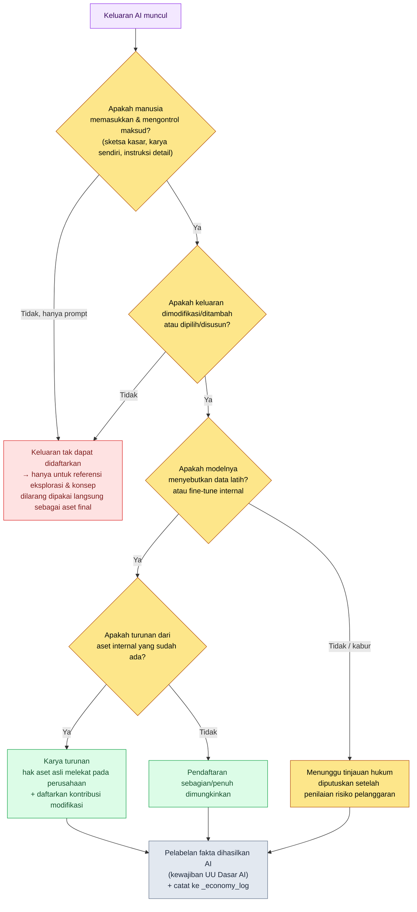

# 22.4 Hak Cipta dan Etika — Menutup Hak, Pelabelan, dan Kesepakatan atas Keluaran dalam Satu Prosedur

> Pembaca utama: Direktur dan lead game yang bertanggung jawab atas adopsi AI (tim berukuran menengah, 10–50 orang)
> Versi ringkas untuk pembaca solo/hobi: §22.4.9 "Kalau Sendirian, Cukup Sampai Sini"

Dua bulan sebelum rilis, pernah ada rapat yang terhenti gara-gara satu ilustrasi kota yang dibuat seorang concept artist. Seseorang bertanya, "Ini dibuat pakai AI, kan? Kalau begitu hak ciptanya milik kita, atau malah tidak bisa didaftarkan sama sekali?" Tidak ada yang bisa menjawab. Pendapat yang muncul di ruangan itu terbagi tiga arah. "AI yang membuatnya, jadi ini bukan milik kita", "Kita yang bayar untuk menjalankannya, jadi ini milik kita", "Hukumnya belum ada, jadi pakai saja." Ketiganya salah. Dan pertanyaan ini bukan sekadar isu hukum. Apa sebenarnya peran artist yang membuat ilustrasi itu, dan bagaimana tim menyepakati penggunaan AI — semuanya tergantung sekaligus pada momen itu.

Bab ini tidak membahas hak cipta dan etika secara terpisah. Sebab dalam praktik, keduanya adalah sisi depan dan belakang dari pertanyaan yang sama. "Hak atas keluaran ini milik siapa" (hak cipta) langsung tereduksi menjadi "seberapa besar manusia terlibat dalam keluaran ini" (etika dan peran). Persyaratan pendaftaran yang ditetapkan dengan tegas oleh Korea Copyright Commission pada tahun 2025 persis menyentuh titik itu. Karena itu, tulang punggung bab ini adalah satu worked transcript (rekaman sesi nyata) — menilai secara nyata kelayakan pendaftaran hak cipta atas sebuah karya seni konsep yang dibuat AI, lalu menelusuri dari awal sampai akhir, dari input hingga keputusan, bagaimana penilaian itu berlanjut menjadi kesepakatan peran di tim.

> **Catatan Operasional Nyata Penulis**
> Atom `design_intent_vs_automation_boundary` serta `_economy_log` dan `_roi_report.md` yang dikutip dalam bab ini adalah aset tata kelola (governance) yang benar-benar dioperasikan penulis di perusahaan, yang telah dianonimkan. Nama atom dan nama file log disalin apa adanya dari nama operasional aslinya (hanya nama unik perusahaan dan proyek yang diganti demi melindungi IP). Keluaran dalam worked transcript merupakan rekonstruksi dari sesi penilaian yang sesungguhnya.

---

## 22.4.1 Otoritas Datang dari Pedoman Publik, Bukan dari "Firasat"

Banyak buku hanya menulis bahwa hak cipta AI itu "kabur karena hukumnya belum ada". Itu hanya setengah benar. Pada Juni 2025, ketika Kementerian Kebudayaan, Olahraga, dan Pariwisata Korea bersama Korea Copyright Commission menerbitkan "Panduan Pendaftaran Hak Cipta atas Karya yang Memanfaatkan AI Generatif", setidaknya di Korea garis batas kelayakan pendaftaran menjadi jelas. Tidak perlu mengarang.

Inti panduan itu bisa diringkas dalam satu kalimat. **Syarat pendaftaran hak cipta adalah "kontribusi kreatif manusia".** Di sinilah dua jenis itu terbagi.

| Kategori | Definisi | Pendaftaran |
|---|---|---|
| Keluaran AI Generatif | Hasil yang dikeluarkan AI tanpa kontribusi kreatif manusia | Tidak bisa |
| Karya yang memanfaatkan AI Generatif | Bagian dari hasil yang dibuat manusia dengan AI sebagai alat, yang kontribusi kreatifnya diakui | Bisa |

Selanjutnya panduan menyajikan tiga jalur untuk diakui sebagai "karya yang memanfaatkan AI": ① ketika karya milik pengguna sendiri dimasukkan sebagai prompt sehingga kreativitasnya tercermin pada keluaran, ② ketika pekerjaan tambahan berupa modifikasi atau penambahan terhadap keluaran memiliki kreativitas, ③ ketika pemilihan, penyusunan, dan pengaturan keluaran memiliki kreativitas. Dua poros penilaiannya adalah **"kemampuan mengontrol" dan "kemampuan memprediksi"**. Pencipta diakui kreatif hanya jika ia dapat menentukan dengan jelas apa yang ingin diekspresikan dan menarik keluar hasil sesuai maksudnya.

Bagian inilah yang menentukan. "Kemampuan mengontrol dan memprediksi" yang dirumuskan panduan dalam bahasa hukum sebenarnya sama dengan **"Game Designer menyediakan maksud (intent)"** (atom `planner_provides_intent_not_recommendation`) yang sudah diulang buku ini sejak §1.1. Keluaran yang diserahkan sepenuhnya kepada AI tidak memiliki kontrol maupun prediksi, sehingga tidak ada hak ciptanya juga; sedangkan keluaran yang maksudnya dimasukkan, ditinjau, dan direkonstruksi oleh manusia akan disertai hak. Kelayakan pendaftaran hak cipta dan syarat alur kerja AI yang baik berdiri di garis yang sama.

Ada satu standar publik lagi. UU Dasar AI yang diberlakukan pada 2026 membebankan **kewajiban menjamin transparansi (pelabelan fakta bahwa konten dihasilkan AI)** pada keluaran AI generatif. Pendaftaran (pihak yang mengklaim hak) dan pelabelan (pihak yang mengungkapkan fakta penggunaan) adalah dua kewajiban yang terpisah. Timbul hak atau tidak, fakta bahwa AI digunakan itu sendiri harus diungkapkan. Dua standar publik inilah yang menjadi **input awal rulebook (buku aturan)** yang akan kita berikan kepada AI dalam bab ini.

---

## 22.4.2 [Worked Transcript] Menilai Kelayakan Pendaftaran atas Satu Karya Seni Konsep Buatan AI

Kita kembali ke ilustrasi di pembuka tadi. Alih-alih menilainya dengan "firasat", kita masukkan kriteria panduan dari §22.4.1 sebagai rulebook lalu meminta AI melakukan klasifikasi awal. Manusia hanya membuat penilaian akhir. Prompt input di bawah ini bisa disalin dan dipakai apa adanya, dan keluarannya merupakan rekonstruksi dari sesi penilaian yang sesungguhnya.

### Langkah 1 — Input: Lemparkan Riwayat Pembuatan Keluaran Apa Adanya

Input penilaian bukanlah ilustrasinya, melainkan log tentang bagaimana ilustrasi itu dibuat. Ini sudah ada di metadata aset, jadi cukup diekstrak saja.

```yaml
# asset_concept_city021_v4.meta.yaml — riwayat pembuatan keluaran yang dinilai
asset_id: concept_city021_v4
asset_type: concept_illustration
created_by: Anggota Tim A (concept artist)
generation_log:
  - step: 1
    actor: Anggota Tim A
    action: "Melampirkan sketsa kasar tata letak kota yang digambar sendiri sebagai gambar input"
  - step: 2
    actor: AI (image_model)
    action: "Membuat 4 variasi dari sketsa kasar + prompt"
    prompt: "stone observatory tower over sealed magic core, cold arid, scholar guild, muted palette"
  - step: 3
    actor: Anggota Tim A
    action: "Memilih 1 dari 4 variasi, meretus langsung siluet menara lonceng, saturasi, dan komposisi (sekitar 40% area dikerjakan ulang)"
  - step: 4
    actor: Anggota Tim A
    action: "Mendesain sendiri motif lingkaran segel latar lalu menggabungkannya"
ai_generated_disclosure: true   # memenuhi kewajiban pelabelan UU Dasar AI
```

### Langkah 2 — Prompt: Klasifikasikan dengan Kriteria Panduan, tetapi Paksakan Dasar Alasannya

```
meta.yaml yang dilampirkan adalah riwayat pembuatan satu ilustrasi konsep.
Klasifikasikan kelayakan pendaftaran berdasarkan kriteria "Panduan Pendaftaran
Hak Cipta atas Karya yang Memanfaatkan AI Generatif" (2025) dari Korea Copyright
Commission, menjadi salah satu dari: dapat-didaftarkan/pendaftaran-sebagian/
tidak-dapat-didaftarkan. Untuk dasar alasannya, kemukakan masing-masing satu baris
berdasarkan dua poros panduan (kemampuan mengontrol & kemampuan memprediksi), dan
tunjuk dengan nomor step mana dalam generation_log yang merupakan 'kontribusi
kreatif'. Hal yang tidak bisa dipastikan secara hukum, tandai sebagai 'perlu
konfirmasi hukum' dan serahkan ke manusia. Dalam tabel: Klasifikasi | Dasar
(kontrol) | Dasar (prediksi) | Step kontribusi | Konfirmasi hukum.
```

Perhatikan bahwa separuh dari prompt ini adalah "pemaksaan dasar alasan" dan "pintu keluar hukum". Jika penilaian hukum diserahkan seluruhnya kepada AI, ia akan memuntahkan kepastian yang terdengar meyakinkan. Inti prompt ini adalah memasukkan kriteria klasifikasi (tiga kategori panduan), kewajiban dasar alasan (dua poros), penunjukan step kontribusi, dan pintu keluar "kalau tidak bisa dipastikan, serahkan ke bagian hukum".

### Langkah 3 — Keluaran Claude (rekonstruksi sesi nyata)

> ```
> | Klasifikasi    | Dasar (kemampuan mengontrol)       | Dasar (kemampuan memprediksi)    | Step kontribusi | Konfirmasi hukum |
> |---------------|------------------------------------|----------------------------------|----------------|-----------------|
> | Pendaftaran    | Sketsa kasar (step1) dan retus 40% | Pemilihan dari 4 variasi dapat   | 1,3,4          | ★               |
> | sebagian       | (step3) langsung mengontrol maksud | diprediksi, tetapi 4 variasi AI  |                |                 |
> |               | ekspresi                            | itu sendiri tidak dapat diprediksi |                |                 |
>
> Analisis:
> - step1 (input sketsa kasar sendiri): termasuk ① panduan 'kreativitas tercermin melalui input karya sendiri'.
> - step3 (retus 40%): termasuk ② panduan 'pekerjaan tambahan berupa modifikasi/penambahan'. Kontribusi terkuat.
> - step4 (mendesain sendiri motif lingkaran segel): penggabungan karya independen, jelas merupakan ciptaan manusia.
> - step2 (4 variasi AI): keluaran murni tanpa kontribusi kreatif manusia → bagian ini secara tersendiri bukan objek pendaftaran.
>
> ★ Perlu konfirmasi hukum: apakah "retus 40%" mencapai 'perubahan substansial' tidak memiliki kriteria kuantitatif.
>   Apakah rasio retus melewati ambang batas kelayakan pendaftaran sebaiknya ditinjau pengacara.
>   (AI tidak dapat memastikan kecukupan rasio secara hukum.)
> ```

Bagian paling berharga dari keluaran ini bukanlah tabel, melainkan **★ Konfirmasi hukum** di paling bawah. AI melaporkan keterbatasannya sendiri — "saya tidak bisa memastikan apakah retus 40% cukup secara hukum" — dan menyerahkannya ke manusia. Prompt yang baik membuat AI bisa mengatakan bahwa ia tidak tahu. Ini bukan tipe penolakan otomatis, melainkan tipe pelaporan otomatis.

### Langkah 4 — Verifikasi dan Penolakan (Tempat Manusia)

Keluaran ini tidak boleh diterima begitu saja. Direktur menyaringnya sekali dengan rulebook. AI mengklasifikasikan step4 (motif lingkaran segel) sebagai "karya independen", tetapi setelah melihat lagi riwayat pembuatannya, motif itu ternyata diturunkan dari lore kota yang dibuat `city_hunting_generator` di §6.2. Artinya step4 bukan ciptaan murni, melainkan bisa jadi **pekerjaan turunan yang ditumpangkan di atas aset internal perusahaan**. Karena merupakan aset perusahaan, kepemilikan haknya jelas, tetapi ungkapan AI "karya independen" akan menimbulkan kesalahpahaman jika ditulis apa adanya pada formulir permohonan pendaftaran.

Maka kita meminta ulang.

```
Motif lingkaran segel di step4 adalah pekerjaan turunan dari aset lore kota internal
perusahaan (bukan ciptaan baru yang independen). Cerminkan fakta ini lalu klasifikasikan
ulang sifat kontribusi step4. Sarankan juga dalam satu baris bagaimana saat mendaftar
harus mencantumkan bahwa ini 'berbasis aset internal perusahaan yang sudah ada'.
```

Cukup satu kali bolak-balik ini saja sudah selesai. AI menjawab ulang step4 dari "karya independen" menjadi "karya turunan dari aset lore internal — hak aset asli melekat pada perusahaan, kontribusi modifikasinya menjadi objek pendaftaran", dan penilaian itu diserahkan ke tinjauan hukum. Kesimpulannya ditetapkan sebagai **pendaftaran sebagian + pelabelan fakta dihasilkan AI**. Jika seluruhnya dikerjakan dengan tangan, bagian hukum harus mengorek riwayat pembuatan tiap aset, tetapi dengan draf AI + tinjauan rulebook + satu kali bolak-balik, bagian hukum hanya menghabiskan waktu pada kasus batas yang ditandai ★.

Satu putaran inilah yang menjadi kriteria Show pada bab ini. Kalimat "hak cipta AI itu kabur" terasa hampa sampai kita benar-benar mengklasifikasikan riwayat pembuatan satu keluaran sampai tuntas berdasarkan kriteria panduan.

---

## 22.4.3 Pohon Keputusan — Keluaran Ini, Bisa Dipakai atau Tidak

Agar penilaian sesi di atas tidak perlu diulang dari nol setiap kali, kita mencatat kriteria panduan sebagai diagram alir. Begitu satu aset masuk, cukup menelusuri pohon ini ke bawah. Semua titik cabang adalah kriteria publik dari §22.4.1.



Yang menjadi inti adalah bahwa ujung pohon (J) sama di semua jalur. Didaftarkan atau tidak, aset perusahaan atau karya turunan, **pelabelan fakta bahwa AI digunakan dan log riwayat pembuatan tetap ditinggalkan tanpa kecuali.** Pelabelan adalah kewajiban yang terpisah dari hak, dan log adalah satu-satunya dasar untuk melacak tanggung jawab ketika terjadi insiden. Rapat di pembuka tadi terhenti karena log ini tidak ada, sehingga tidak ada yang bisa merekonstruksi siapa melakukan apa di tiap step.

Jalur merah (C, tak dapat didaftarkan) pun bukan sekadar dibuang. "Keluaran AI murni yang hanya dimasukkan prompt" cukup dipakai sebagai referensi pada tahap eksplorasi dan konsep. Hanya saja tidak dimasukkan ke dalam game sebagai aset final. Mengunggah keluaran AI apa adanya ke rilis adalah pemicu terbesar insiden hak cipta di kemudian hari.

---

## 22.4.4 Rulebook Hak Cipta Menjadi Log Operasional — `design_intent_vs_automation_boundary`

Pohon (§22.4.3) adalah alur penilaian, dan yang membuat alur itu selalu ditarik di garis yang sama tiap kali adalah satu atom. Di antara aset tata kelola perusahaan, `design_intent_vs_automation_boundary` adalah tulang punggung seluruh bab ini.

Definisi satu baris atom ini adalah "maksud desain oleh manusia, otomasi oleh alat — batas itu dicantumkan untuk tiap aset". Ini bukan slogan abstrak. Atom ini terdaftar pada JIT hook (`inject_memory.py`), sehingga ketika kata kunci seperti "hak cipta", "dihasilkan AI", atau "pendaftaran aset" masuk ke prompt, ia otomatis disuntikkan ke sesi. Prinsip desain hook menopang operasi atom ini apa adanya.

```python
# inject_memory.py — selalu exit 0, tidak menghalangi alur kerja pengguna meski gagal (kutipan)
def main() -> None:
    ...
    # urutkan score menurun lalu cocokkan — suntikkan maksimal 3 atom saja
    atoms_sorted = sorted(atoms, key=lambda a: a.get("score", 0), reverse=True)
    matches = []
    for atom in atoms_sorted:
        if len(matches) >= max_matches:   # mencegah penyuntikan berlebih
            break
        try:
            if re.search(atom["regex"], prompt, re.IGNORECASE):
                matches.append(atom)
        except re.error:
            continue
    if not matches:
        emit_empty()   # jika tidak ada kecocokan, respons kosong (normal)
        return
```

Di sini ada dua desain yang penting secara tata kelola. Pertama, hook **selalu `exit 0`** (dinyatakan dalam docstring skrip). Sekalipun gagal saat menyuntikkan aturan hak cipta, ia sama sekali tidak menghalangi pekerjaan pengguna. Jika pengaman menyandera pekerjaan, tim akan mematikan pengaman itu dalam satu-dua kuartal. Kedua, **hanya menyuntikkan maksimal 3**. Jika semua aturan tata kelola dijejalkan setiap sesi, context window akan meledak dan tidak ada yang membacanya. Hanya aturan dengan score tinggi yang muncul.

Ini filosofi yang sama dengan lint di §6.2 yang tidak otomatis membuang pelanggaran melainkan hanya menaikkan alert ke gerbang penulis. **Kandidat yang dicurigai dipilih oleh mesin, tetapi keputusan membunuh atau membiarkannya ditentukan manusia.** Pada hak cipta pun sama. Atom otomatis memunculkan "apakah hak cipta aset ini sudah dicek", tetapi penilaian akhir tentang kelayakan pendaftaran dilakukan manusia dan bagian hukum.

---

## 22.4.5 Setelah Hak adalah Manusia — Menutup Evolusi Peran dengan Kesepakatan

Penilaian ilustrasi di pembuka tadi tidak berakhir pada hak cipta. Sebab itu berarti pekerjaan Anggota Tim A yang membuat aset itu telah bergeser dari "menggambar" menjadi "memilih 4 variasi AI dan meretus 40%". Begitu hak cipta menuntut "kontribusi kreatif manusia", definisi peran orang yang melakukan kontribusi itu pun ikut berubah. Keduanya adalah sisi depan dan belakang dari peristiwa yang sama.

Insiden yang paling sering terjadi di sini adalah memperlakukan perubahan ini sebagai pemberitahuan sepihak. Meski alatnya bagus, jika enam bulan kemudian tidak ada yang memakainya, biasanya bukan karena alatnya buruk, melainkan karena tidak ada kesepakatan. Esensi adopsi adalah peran bergeser dari produksi massal ke pemilihan, peninjauan, dan rekonstruksi; tetapi jika ini tidak dicantumkan secara jelas dan tidak ditopang dengan pelatihan, anggota tim akan menerimanya sebagai "tempatku akan hilang".

| Bidang | Sebelum AI | Setelah AI (evolusi peran) | Makna dari sisi hak cipta |
|---|---|---|---|
| Concept artist | Menggambar seluruhnya sendiri | Input maksud, pemilihan, retus | Retus itulah 'kontribusi kreatif' |
| Balancer | Simulasi manual | Interpretasi simulasi, keputusan | Log keputusan jadi dasar tanggung jawab |
| Game Designer | Menulis seluruh spesifikasi | Menyediakan maksud, peninjauan | Input maksud adalah kemampuan mengontrol |

Satu baris yang dikatakan tabel ini begini. **"Kontribusi manusia" yang memungkinkan pendaftaran hak cipta itulah pekerjaan yang dilakukan manusia setelah evolusi peran.** Jika kontrol dan prediksi yang dituntut panduan hilang, hak cipta hilang dan tempat manusia pun hilang. Karena itu, evolusi peran harus dijelaskan bukan sebagai perubahan yang merampas pekerjaan, melainkan sebagai perubahan yang meninggalkan hak dan tanggung jawab di tangan manusia, agar kesepakatan tercapai.

Kesepakatan bukanlah rapat yang tak berujung. Ia ditutup dengan prosedur. Usulan adopsi (direktur) → pemberitahuan awal ke seluruh tim (tujuan, peran yang terdampak, metrik pengukuran, risiko) → rapat kesepakatan (bicara bebas, pengumpulan kekhawatiran) → 1:1 dengan anggota yang perlu → presentasi rencana penyesuaian → kesepakatan atau penundaan. Tidak perlu mendapat persetujuan semua anggota untuk memulai, tetapi setelah mendengar dan menyesuaikan kekhawatiran lewat prosedur, direktur memutuskan. Tanpa prosedur, kesepakatan akan selalu dimulai ulang dari nol, dan biaya itu memperlambat adopsi.

---

## 22.4.6 Biaya dan ROI Juga Bagian dari Etika — Dengan Jujur lewat `_roi_report.md`

Jika etika dipersempit hanya pada pekerjaan dan kesepakatan, satu poros akan terlewat. Mengukur biaya dan efek operasi AI dengan jujur lalu mengungkapkannya itu sendiri adalah tata kelola. Jika tanpa pengukuran hanya berkata "efisiensi naik berkat AI", anggota tim akan mencurigai perkataan itu sebagai dalih untuk memangkas tempat mereka.

Infrastruktur tata kelola perusahaan punya dua aset nyata untuk ini. Pada sistem atom ada `_economy_log/` (log ekonomi token dan waktu) dan `_roi_report.md` (laporan ROI). Yang pertama mencatat token dan waktu tiap sesi secara otomatis oleh mesin, yang kedua menjumlahkannya secara berkala untuk dibaca manusia. Intinya, log ini melacak bukan "seberapa banyak AI menggantikan manusia", melainkan "ke mana waktu manusia dibebaskan".

Prinsip angka buku ini terdiri atas tiga hal. Pertama, standar publik dikutip apa adanya (syarat pendaftaran panduan, kewajiban pelabelan UU Dasar AI). Kedua, perkiraan penulis ditulis sebagai perkiraan. Ketiga, hanya yang dapat diukur yang dijanjikan sebagai KPI. Dalam ranah hak cipta dan etika, yang dapat diukur bukanlah metrik hasil, melainkan metrik prosedur.

| Item ukur | Cara mengukur | Bisa dijanjikan atau tidak |
|---|---|---|
| Jumlah pelabelan fakta dihasilkan AI yang terlewat | grep `ai_generated_disclosure` di meta aset | Dapat diukur (target 0) |
| Tingkat kepemilikan log riwayat pembuatan | Rasio aset yang punya `generation_log` | Dapat diukur |
| Aset AI yang dirilis tanpa tinjauan hukum | Bandingkan build rilis vs daftar lolos hukum | Dapat diukur (target 0) |
| "Pendapatan naik karena AI" | — | Tidak dapat diukur, tidak dijanjikan |

Baris terakhir adalah inti kejujuran. Efek pendapatan dari adopsi AI tidak bisa dipisahkan sebagai variabel tunggal, jadi kausalitasnya tidak dipastikan. Sebagai gantinya, "rasio aset yang dihasilkan AI yang lolos pelabelan, log, dan tinjauan hukum" benar-benar bisa dihitung lewat `_economy_log` dan meta aset. Yang dijanjikan tata kelola bukanlah hasil, melainkan integritas prosedur.

---

## 22.4.7 Konten Buatan Pengguna (UGC) dan Perlindungan Data

Setelah hak aset, peran, dan biaya dirapikan, satu ranah tersisa. Yaitu jalur ketika pengguna mengunggah konten yang dibuat dengan AI ke dalam game. Aset yang dibuat perusahaan ditutup dengan prosedur internal, tetapi UGC membanjir masuk sebagai keluaran di luar kendali.

Di sini pun ujung pohon §22.4.3 (pelabelan, log) berlaku apa adanya. Kostum dan emblem guild yang diunggah pengguna mensyaratkan pelabelan dihasilkan AI, dan dimoderasi dengan kombinasi tinjauan otomatis + gerbang manusia. Jika hanya satu poros yang dijalankan, insiden pada kuartal berikutnya akan menumpuk. Dan data pengguna tidak boleh dikirim sembarangan ke LLM. Informasi pribadi dan informasi pembayaran dilarang dikirim, log perilaku dikirim setelah dianonimkan — itu prinsipnya (mematuhi GDPR dan UU Perlindungan Data Pribadi dalam negeri).

Yurisdiksinya tidak berhenti di Korea saja. Begitu menerima pengguna luar negeri, regulasi data wilayah tempat pengguna itu berada ikut terlibat. Bagi pengguna Uni Eropa, GDPR menetapkan syarat tersendiri atas transfer lintas batas data pribadi, persetujuan, dan hak penghapusan; negara layanan lain pun masing-masing punya ketentuan perlindungan data pribadi dan lokalisasi data. Karena itu, baris ketiga tabel — 'larangan mengirim informasi pribadi dan pembayaran ke LLM' — adalah nilai default paling aman di yurisdiksi mana pun, dan tingkat anonimisasi serta pseudonimisasi saat mengirim log perilaku ke model eksternal harus diperiksa tersendiri sesuai wilayah layanan. Namun bagian ini hanya panduan desain prosedur, bukan nasihat hukum. Jika menyangkut rilis global atau transfer lintas batas, tinjauan hukum dari yurisdiksi terkait wajib diambil secara terpisah.

| UGC/Data | Kebijakan | Dasar |
|---|---|---|
| Kostum/emblem unggahan pengguna | Pelabelan AI + tinjauan otomatis + gerbang manusia | Kewajiban pelabelan UU Dasar AI |
| Nickname karakter/postingan | Ketentuan umum + tanggung jawab pengguna | — |
| Informasi pribadi/pembayaran | Dilarang dikirim ke LLM | UU Perlindungan Data Pribadi |
| Log perilaku game | Dikirim setelah dianonimkan | Anonimisasi, pseudonimisasi |

Semakin banyak UGC, semakin berat beban moderasi. Tinjauan otomatis menyaring lebih dulu, hanya kasus batas yang dilihat manusia. Ini adalah pemindahan filosofi atom §22.4.4 (mesin memilih kandidat, manusia memutuskan) ke dimensi konten pengguna.

---

## 22.4.8 Kegagalan yang Umum

| Pola | Mengapa gagal | Resep |
|---|---|---|
| Memakai keluaran AI apa adanya sebagai aset final | Kontribusi manusia 0 → tak dapat didaftarkan + risiko pelanggaran | Pohon §22.4.3, hanya untuk eksplorasi & konsep |
| Tidak ada log riwayat pembuatan | Saat insiden, tanggung jawab per step tak dapat direkonstruksi | Wajibkan meta aset `generation_log` |
| Tidak melabeli fakta dihasilkan AI | Melanggar kewajiban transparansi UU Dasar AI | Tahap pelabelan di ujung pohon tanpa kecuali |
| Memperlakukan evolusi peran sebagai pemberitahuan | Penolakan 6 bulan setelah adopsi alat | Prosedur kesepakatan (§22.4.5) |
| Hanya meneriakkan "efisiensi naik berkat AI" | Anggota tim mencurigainya sebagai ancaman pada tempatnya | Ukur dan ungkapkan lewat `_economy_log`·`_roi_report` |
| Memakai model dengan data latih kabur tanpa kritik | Penilaian risiko pelanggaran terlewat | Utamakan model yang menyebutkan data, atau fine-tune internal (cabang E pohon) |

Yang kelima paling sering terlewat. Seperti yang terlihat pada penilaian ilustrasi di pembuka, "kontribusi manusia" yang memungkinkan pendaftaran hak cipta itulah peran baru orang tersebut. Jika hanya mengukur efisiensi dan tidak mengukur ke mana waktu orang itu dibebaskan, tata kelola berhasil di atas KPI tetapi manusianya pergi.

---

> **Penerapan di Luar Game.** Pertanyaan "ini dibuat pakai AI, apa hak ciptanya milik kita" yang membuat rapat terhenti tidak hanya terjadi pada ilustrasi game, tetapi muncul di mana saja — pada laporan, copy iklan, atau proposal yang dibuat dengan AI. Kriteria yang ditetapkan dengan tegas oleh Panduan Korea Copyright Commission 2025 sederhana — kelayakan pendaftaran bergantung pada "kontribusi kreatif manusia (kemampuan mengontrol & memprediksi)", dan keluaran AI murni yang hanya dimasukkan prompt tidak memiliki hak. Karena itu, di departemen mana pun, kebiasaan meninggalkan satu lembar riwayat pembuatan yang mencatat per step "tahap mana yang manusia, tahap mana yang AI" untuk tiap keluaran AI akan menjadi jaring pengaman. Misalnya, jika seorang marketer menerima draf copy AI lalu memodifikasi dan merekonstruksinya sendiri, mencatat kontribusi itu akan menjadi dasar untuk mengklaim hak; dan didaftarkan atau tidak, pelabelan fakta bahwa "AI digunakan" (kewajiban UU Dasar AI 2026) ditinggalkan tanpa kecuali. Karena setelah hak adalah manusia, perubahan peran karyawan yang melakukan kontribusi itu harus ditutup dengan kesepakatan, bukan pemberitahuan sepihak.

## 22.4.9 Coba Sendiri — Satu Langkah yang Bisa Dilakukan Hari Ini

> **Kalau Sendirian, Cukup Sampai Sini**: Tidak harus punya tim hukum. Pilih satu keluaran berupa gambar atau teks yang Anda buat dengan AI, lalu tulis `generation_log` berformat §22.4.2 dengan tangan (bagi per step, tahap mana yang manusia, tahap mana yang AI). Setelah itu, telusuri pohon §22.4.3 dan nilai sendiri "apakah ini bisa didaftarkan", maka kriteria "kontrol dan prediksi" pada Panduan Korea Copyright Commission akan terasa langsung sebagai sekumpulan penilaian semacam apa. Untuk proyek pribadi atau hobi sekalipun, sebaiknya tinggalkan satu baris pelabelan fakta dihasilkan AI (`ai_generated: true`).

Kalau tim, mulailah dengan satu langkah berikut. Wajibkan dua slot, `generation_log` dan `ai_generated_disclosure`, pada semua meta aset AI (Anda bisa menjaring yang terlewat dengan satu baris grep), dan tempelkan pohon keputusan §22.4.3 sebagai satu halaman wiki. Otomasi penilaian syarat pendaftaran atau operasi `_economy_log` adalah langkah sesudahnya. Cukup dengan log riwayat pembuatan dan satu lembar pohon saja, Anda sudah bisa mencegah rapat terhenti seperti di pembuka tadi.

---

## 22.4.10 Penutup Bagian 22

Bagian 22 adalah empat poros tata kelola.

| Bab | Inti |
|---|---|
| 22.1 | Rekayasa prompt — memaksakan format, dasar alasan, pintu keluar |
| 22.2 | Halusinasi & keamanan — gerbang tinjauan, verifikasi tipe pelaporan |
| 22.3 | Manajemen biaya — caching, cap, `_economy_log` |
| 22.4 | Hak cipta & etika — syarat pendaftaran, pelabelan, kesepakatan peran |

Satu kalimat yang menembus keempat bab ini begini. **Tata kelola bukanlah alat untuk menghalangi AI, melainkan prosedur untuk meninggalkan maksud dan tanggung jawab manusia pada keluaran.** Atom `design_intent_vs_automation_boundary` adalah nama prosedur itu. "Kontrol dan prediksi" yang dituntut pendaftaran hak cipta, "peran dan kesepakatan" yang dituntut etika, dan "pengukuran yang jujur" yang dituntut biaya, semuanya menunjuk ke satu tempat — apa pun yang dilakukan AI, tempat terakhir bagi keputusan dan tanggung jawab adalah manusia.

---

### Poin-Poin Penting
- Syarat pendaftaran hak cipta adalah 'kontribusi kreatif manusia' (Panduan Korea Copyright Commission 2025).
- Didaftarkan atau tidak, pelabelan fakta dihasilkan AI dan log riwayat pembuatan ditinggalkan tanpa kecuali.
- 'Kontribusi manusia' yang dituntut hak cipta itulah pekerjaan manusia setelah evolusi peran.

### Pratinjau Bab Berikutnya
- Bagian 23 Perluasan — menerapkan alur kerja yang sama dalam skala kecil untuk pengembangan solo/hobi

---


---

> **Sumber**
> - Korea Copyright Commission & Kementerian Kebudayaan, Olahraga, dan Pariwisata, "Panduan Pendaftaran Hak Cipta atas Karya yang Memanfaatkan AI Generatif" (2025) — https://www.copyright.or.kr/information-materials/publication/research-report/view.do?brdctsno=54253
> - Korea Copyright Commission & Kementerian Kebudayaan, Olahraga, dan Pariwisata, "Panduan Hak Cipta AI Generatif" (2023.12) — https://www.copyright.or.kr/information-materials/publication/research-report/view.do?brdctsno=52591
> - UU Dasar Kecerdasan Buatan (UU Dasar AI), kewajiban transparansi & pelabelan keluaran AI generatif (berlaku 2026) — https://www.shinkim.com/kor/media/newsletter/3142
