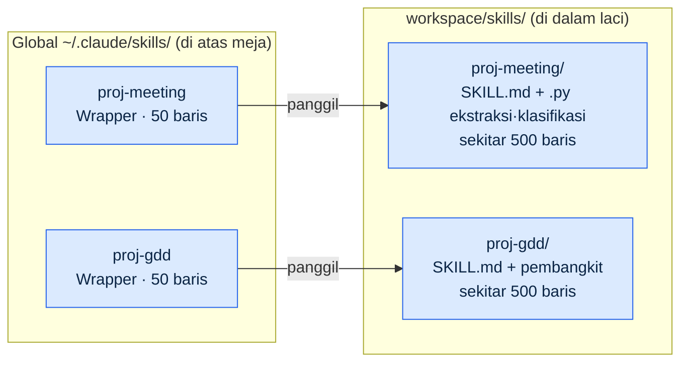
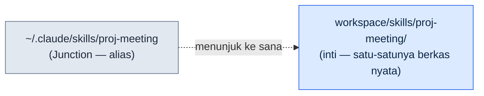
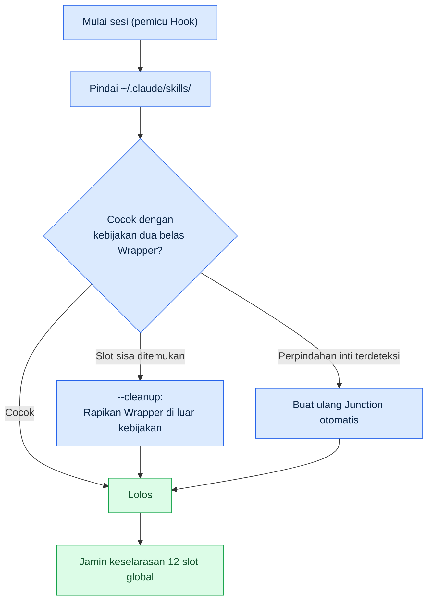
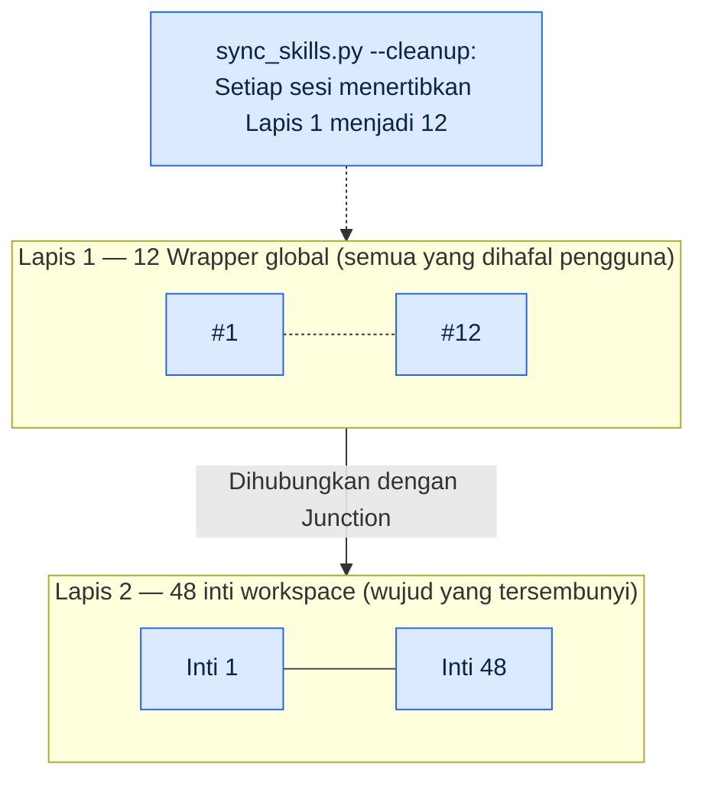
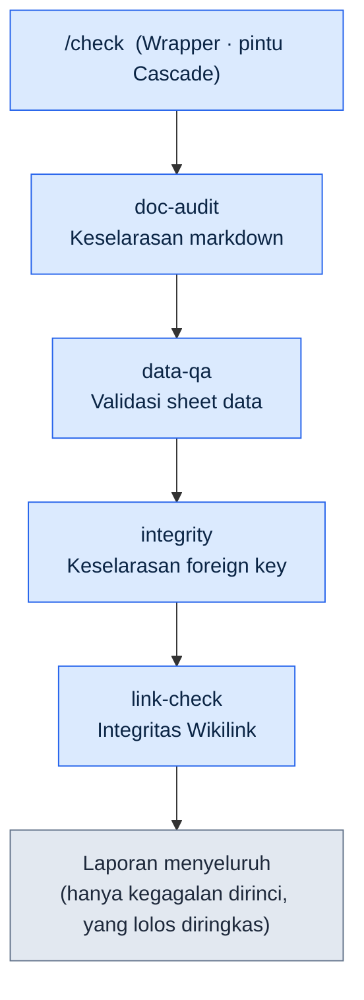
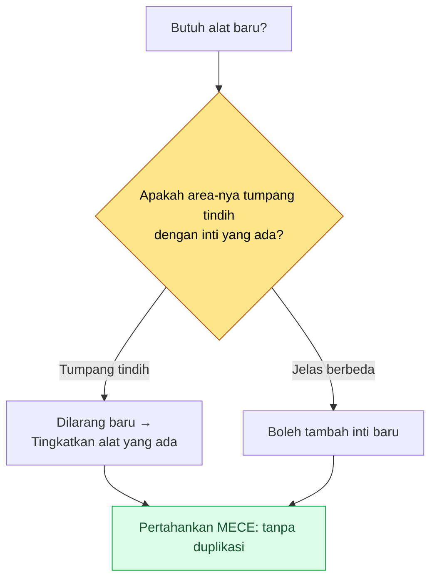

# Part 23 · Bab 1. Pola Wrapper, Cascade, dan Junction

> Jangan menambah alat, tetapi buatlah alat untuk mengelola alat. Ini adalah cerita tentang struktur dua lapis yang menyembunyikan 48 alat inti di balik 12 titik masuk global, dan tentang otomasi yang menjaga keselarasan struktur itu tanpa campur tangan manusia.

---

Suatu malam saat menjalankan retrospektif bulanan, tangan saya berhenti ketika menghitung daftar slash command. Ada empat puluh. Padahal setengah tahun lalu saya jelas memulainya dengan tujuh atau delapan saja. Namun dengan pola menambah satu alat untuk notulen rapat, lalu menempelkan satu alat untuk validasi data, lalu menambahkan satu pembangkit GDD (Game Design Document, dokumen spesifikasi rinci) — satu atau dua per minggu — tanpa terasa jumlahnya sudah menjadi empat puluh. Dan hampir setengah di antaranya tidak pernah sekali pun saya panggil selama sebulan terakhir.

Masalahnya bukan sekadar alat yang tidak terpakai itu diam-diam ada di sana. Setiap kali memulai sesi, spesifikasi keempat puluh slash command itu seluruhnya dimuat. Hal itu menggerogoti anggaran token, membuat perintah-perintah dengan nama mirip (`skill-design`·`skill-design-new`·`skill-design-template`) membingungkan, dan justru memakan waktu untuk mengingat alat yang sebenarnya saya butuhkan. Alat tidak lagi membantu pekerjaan; mengelola alat itu sendiri yang menjadi pekerjaan.

Bab ini membahas proses memangkas empat puluh alat itu menjadi dua belas titik masuk global, tanpa membuang satu pun alat inti yang tersisa. Intinya ada pada tiga pola: **Wrapper** yang membuat titik masuk ringan, **Cascade** yang menyatukan banyak alat ke dalam satu pintu, dan **Junction** yang menghubungkan titik masuk dengan alat inti secara fisik. Lalu ada `sync_skills.py` yang menjaga keselarasan ketiganya menggantikan tangan manusia.

---

## 23.1.1 Sinyal Kuantitatif yang Ditemukan dari Retrospektif

Kesan bahwa alat terlalu banyak bisa dimiliki siapa saja. Namun, dengan kesan saja kita tidak bisa memutuskan apa yang harus dipangkas. Yang memungkinkan keputusan itu adalah pengukuran efisiensi ekonomi alat dalam retrospektif bulanan.

Proyek ini menjalankan retrospektif sebagai mekanisme perbaikan diri (self-improvement). Selama retrospektif harian menumpuk menjadi mingguan, dan mingguan menyatu menjadi bulanan, retrospektif bulanan menghitung balik dari log commit SVN: "selama sebulan terakhir, alat mana yang dipakai berapa kali." Skor yang digunakan untuk pengukuran ini adalah `skill_audit_score`. Skor ini melacak seberapa sering setiap slash command muncul dalam hasil kerja nyata melalui riwayat commit, lalu menilai frekuensi penggunaannya.

Distribusi yang terungkap dari pengukuran bulan itu adalah sebagai berikut. (Rasio penggunaan adalah hasil pengukuran nyata berbasis log commit SVN, dan ini bukan jumlah panggilan absolut melainkan bobot kemunculan per alat.)

<svg viewBox="0 0 640 220" xmlns="http://www.w3.org/2000/svg" font-family="sans-serif" font-size="13">
  <rect x="0" y="0" width="640" height="220" fill="#fafafa" stroke="#ddd"/>
  <text x="20" y="30" font-weight="bold" font-size="15">40 Slash Command — Distribusi Frekuensi Penggunaan</text>

  <!-- TOP 12 bar -->
  <rect x="20" y="55" width="500" height="40" fill="#2c7be5"/>
  <text x="30" y="80" fill="#fff" font-weight="bold">12 perintah TOP</text>
  <text x="530" y="80" fill="#2c7be5" font-weight="bold">92% penggunaan</text>

  <!-- middle group -->
  <rect x="20" y="105" width="55" height="40" fill="#a6c8f0"/>
  <text x="85" y="130" fill="#555">10 dengan pemakaian menengah — sekitar 8%</text>

  <!-- tail group -->
  <rect x="20" y="155" width="18" height="40" fill="#e0e0e0" stroke="#bbb"/>
  <text x="85" y="180" fill="#999">18 dipakai &lt;1 kali/bulan (45% dari total) — hampir 0%</text>

  <text x="20" y="212" fill="#888" font-size="11">Sumber: skill_audit_score retrospektif bulanan, hitung balik dari log commit SVN / rasio = bobot kemunculan nyata</text>
</svg>

Dua belas teratas mengisi 92% dari seluruh penggunaan, sementara perintah yang tidak dipakai bahkan sekali sebulan ada delapan belas, yakni 45% dari total. Jawabannya bisa dibilang sudah separuh tergambar: hanya dua belas yang sering dipakai yang dibiarkan tampak di global, dan sisanya dirapikan.

Masalahnya, "merapikan" bukan berarti "menghapus." Dua puluh delapan alat yang tidak terpakai pun masih dibutuhkan sekali atau dua kali per kuartal. Saat menulis laporan semesteran, saat membuat skema data baru, atau saat menjalankan validasi tertentu. Jika alat itu tidak ada saat dibutuhkan, pekerjaan berhenti di tempat. Jadi pertanyaan yang sebenarnya adalah ini: **bagaimana caranya membuat hanya dua belas yang terlihat, sambil tetap mempertahankan dua puluh delapan agar hidup?**

Analogi meja kerja menjadi benang merah seluruh bab ini. Tidak ada orang yang menjejerkan empat puluh batang pena di atas meja dan memakainya setiap hari. Hanya dua belas pena yang sering dipakai yang ditaruh di atas meja, dan sisanya dimasukkan ke laci. Di dalam laci pun, pena jenis yang sama dikumpulkan dalam satu wadah. Wrapper adalah titik masuk ringan yang ditaruh di atas meja, Junction adalah lorong yang menghubungkan laci dengan meja, dan Cascade adalah seikat pena yang diikat dalam satu wadah.

---

## 23.1.2 Pola Wrapper — Titik Masuk Ringan, Inti yang Berat

Wrapper adalah cangkang tipis dari slash command. Di global hanya ditaruh titik masuknya, sedangkan logika sebenarnya ditaruh pada inti di workspace. Di direktori global tinggal panduan 50 baris, sedangkan di inti hidup implementasi 500 baris.



Pemisahan ini menghasilkan lima keuntungan. Saat memulai sesi, di global hanya 50 baris yang dimuat sehingga token hemat; inti boleh disunting setiap hari tanpa memengaruhi slot global; inti boleh ditaruh di mana saja, entah di SVN entah di Git; inti ditaruh di folder berbagi tim sementara hanya Wrapper yang ada di global pribadi sehingga mudah dibagikan; dan jika format Wrapper diseragamkan, pengalaman pengguna menjadi konsisten.

Format standar Wrapper adalah sebagai berikut. Semua Wrapper berbagi kerangka ini.

```markdown
---
name: proj-meeting
description: Analisis notulen rapat·ekstraksi keputusan (inti: workspace/skills/proj-meeting/)
---

# /proj-meeting — Wrapper

Lokasi inti: workspace/skills/proj-meeting/SKILL.md

## Cara Kerja
Wrapper ini memanggil skrip entri pada inti. Logika rincinya didefinisikan di inti.
Jika inti berubah, cukup perbarui description Wrapper ini saja (disarankan sinkronisasi otomatis).
```

Intinya adalah hanya satu baris description dan penunjuk ke inti. Begitu logika masuk, Wrapper menjadi berat, dan sinkronisasinya dengan inti mulai rusak. Karena itu Wrapper menjaga batas di bawah 100 baris sebagai aturan yang ditegakkan.

Slot slash command global di proyek ini diikat menjadi dua belas. Seluruh alat yang sering dipakai harus muat dalam dua belas itu, dan kriteria pemilihannya ditentukan oleh retrospektif bulanan: dipakai 5 kali ke atas per bulan, keseimbangan bidang (satu bidang tidak boleh melebihi enam alat), dan konsistensi entri (aturan penamaan diseragamkan). Jika melewati dua belas, yang paling jarang dipakai dibuang atau digabungkan ke perintah lain.

Angka dua belas itu sendiri bukan mutlak. Yang penting adalah fakta bahwa angkanya sudah ditetapkan. Untuk tim kecil (\~10 orang) sepuluh mungkin pas, dan untuk tim dengan banyak bidang lima belas mungkin lebih tepat. Harus ada batas atas yang ditetapkan agar beban kognitif tetap berada pada tingkat tertentu.

---

## 23.1.3 Pola Junction — Sambungan Fisik antara Inti dan Titik Masuk

Jika Wrapper adalah aturan "di global hanya ditaruh titik masuk yang ringan," maka Junction adalah sarana yang mengimplementasikan aturan itu pada tingkat sistem operasi. Junction adalah symbolic link direktori, yakni alias yang disediakan OS.



Ketika pengguna menengok ke lokasi global, inti tampak seolah berada di tempat itu. Namun berkas yang sesungguhnya hanya ada satu salinan di lokasi inti. Sisi global hanyalah papan penunjuk yang mengarah ke sana.

Keuntungan dari struktur ini jelas. Jika inti disunting, perubahan langsung tercermin di global (tidak ada tahap penyalinan). Karena berkas hanya ada satu salinan, ruang disk hemat, dan karena di global hanya ada Junction, tidak ada konflik Git (inti dikelola terpisah di SVN/Git). Meski inti dipindahkan, cukup memasang ulang Junction-nya dan bagi pengguna tidak ada perubahan apa pun.

Cara memasangnya berbeda di tiap OS. Di Windows, junction direktori dibuat dengan `mklink /J <link> <target>` dan tidak memerlukan hak administrator. Linux dan macOS memakai `ln -s <target> <link>`, sedangkan WSL memakai perintah Linux apa adanya. Perbedaan platform ini ditangani secara otomatis oleh `sync_skills.py` yang akan dibahas nanti, sehingga operator tidak perlu menghafal sendiri perintah untuk masing-masing OS.

Jika tidak memakai Junction dan beroperasi dengan penyalinan, kecelakaan sinkronisasi terjadi pada saat inti dan salinan global mulai bercabang. Misalnya, bug sudah diperbaiki di inti tetapi salinan global masih versi lama sehingga menjalankan perilaku lama. Junction menghapus kemungkinan kecelakaan ini dari akarnya. Papan penunjuk tidak mungkin ada dua, dan wujud nyatanya selalu satu.

---

## 23.1.4 sync_skills.py — Alat yang Menjaga Keselarasan Menggantikan Manusia

Jika Wrapper dan Junction dikelola dengan tangan, pada akhirnya kita kembali ke empat puluh. Manusia menunda merapikan, melupakan kebijakan, dan membuat pengecualian. Karena itu pemeliharaan keselarasan diotomasi. Alat untuk itu adalah `sync_skills.py`.

Setiap kali sesi dimulai, Hook memicu skrip ini. Yang dikerjakan skrip ini mengikuti alur berikut.



Fungsi intinya ada tiga. Pertama, memindai direktori global untuk memeriksa apakah ia sesuai dengan kebijakan dua belas Wrapper. Kedua, dengan flag `--cleanup`, merapikan Wrapper sisa yang tidak ada dalam kebijakan. Jika ada alat yang ditambahkan seseorang secara sementara dan tertinggal di slot, ia akan dirapikan saat sesi berikutnya dimulai sehingga slot tidak meledak lagi. Ketiga, jika lokasi inti berubah, Junction dipasang ulang secara otomatis. Skrip mendeteksi OS, lalu memilih dan memanggil `mklink /J` untuk Windows dan `ln -s` untuk selainnya.
Yang penting, ketiga fungsi ini dirancang **idempoten (idempotent)**. Karena ini alat yang berputar otomatis setiap kali sesi dimulai, sebanyak apa pun ia dijalankan ulang pada keadaan yang sama, hasilnya harus sama dengan satu kali jalan. Wrapper yang sudah sesuai kebijakan tidak disentuh, Junction yang sudah terpasang benar tidak dipasang ulang, dan jika tidak ada slot sisa untuk dirapikan, tidak ada yang dihapus. Jika tidak idempoten, perapian yang sama menumpuk di setiap sesi sehingga terjadi kecelakaan seperti membuat ulang Junction yang sebenarnya baik-baik saja atau salah menyentuh inti — dan pada alat yang berputar tanpa pengawasan setiap sesi, hal itu langsung berujung pada kecelakaan sinkronisasi. Karena itu `sync_skills.py` menjadikan "hanya menyentuh yang berubah, dan tidak menyentuh jika tidak ada yang berubah" sebagai invariannya.

Efek `--cleanup` langsung terhubung dengan perlindungan anggaran token. Jika spesifikasi slash yang dimuat ke global setiap sesi diikat menjadi dua belas, maka meski inti bertambah hingga empat puluh delapan, biaya mulai sesi tetap konstan. Karena tidak dikelola dengan tangan manusia, kebijakan tidak berantakan.

Keselarasan otomatis inilah pin pengaman struktur dua lapis. Wrapper dan Junction membentuk struktur, dan `sync_skills.py` mempertahankan struktur itu meski waktu berlalu.

---

## 23.1.5 Struktur Dua Lapis — 12 wrapper global → 48 inti workspace

Ketika tiga pola dan keselarasan otomatis disatukan, terbentuklah dua lapis berikut. Di lapis atas ada dua belas titik masuk yang dihafal pengguna, dan di lapis bawah ada empat puluh delapan inti.



Pengguna hanya mengingat dua belas yang ada di global. Meski di baliknya tersembunyi empat puluh delapan inti, beban kognitif tetap berada pada dua belas. Wrapper membuat titik masuk menjadi ringan, Junction menghubungkan titik masuk dengan inti, dan `sync_skills.py` menjaga keselarasan dua belas itu di setiap sesi.

Dilihat dari rasionya, titik masuk berbanding inti adalah 1 banding 4 (12 banding 48). Meski alat ditambah, yang harus dihafal pengguna tidak bertambah. Meski inti bertambah menjadi enam puluh atau delapan puluh, Lapis 1 tetap dua belas. Inilah implementasi nyata dari kalimat "jangan menambah alat, tetapi buatlah alat untuk mengelola alat." Yang bertambah adalah Lapis 2 (inti), sedangkan Lapis 1 (titik masuk) yang dihadapi pengguna tetap konstan.

---

## 23.1.6 Pola Cascade — Panggilan Berantai yang Diikat ke Satu Pintu

Jika struktur dua lapis adalah pola untuk "memangkas banyak alat menjadi sedikit titik masuk," maka Cascade adalah pola untuk "mengikat alat-alat yang sering dipakai bersamaan ke dalam satu kali panggilan." Satu slash command memanggil beberapa alat bawahan secara berurutan, lalu mengeluarkan hasilnya sebagai satu laporan menyeluruh.

Cascade perwakilan di proyek ini adalah `check`. Empat alat yang setiap pagi memeriksa integritas data desain saya satukan menjadi satu.



Dahulu, setiap pagi keempat alat dipanggil satu per satu. Sekali pemeriksaan dokumen, sekali pemeriksaan data, sekali pemeriksaan foreign key, sekali pemeriksaan tautan. Tiga sampai empat panggilan manual diperlukan per satu siklus kerja. `check` mengikat keempatnya menjadi satu perintah, sehingga sekali dipanggil, empat tahap berjalan berurutan dan hasilnya disatukan menjadi satu.

Desain Cascade memiliki prinsip. Setiap tahap harus dapat dipanggil sendiri (`data-qa` harus bisa dipanggil terpisah). Apakah berhenti atau lanjut saat gagal diatur per tahap. Pekerjaan validasi tetap menjalankan sisanya meski satu tahap gagal agar gambaran keseluruhan terlihat, sedangkan pekerjaan perubahan langsung berhenti jika satu tahap gagal. Hasil terakumulasi menjadi masukan tahap berikutnya, dan laporan menyeluruh memakai format yang sama untuk tiap Cascade.

Definisi nyata `check` adalah sebagai berikut. (Ini adalah susunan yang menyatukan 4 jenis validasi menjadi satu.)

```yaml
cascade:
  - step: doc-audit
    purpose: Keselarasan markdown (YAML frontmatter·tautan·referensi atom)
    fail_action: continue
  - step: data-qa
    purpose: Validasi sheet data Excel (skema·rentang·kolom wajib)
    fail_action: continue
  - step: integrity
    purpose: Keselarasan foreign key (referensi antar-sheet)
    fail_action: continue
  - step: link-check
    purpose: Integritas Wikilink·tautan eksternal
    fail_action: continue

report:
  format: markdown
  include_pass: false   # Item yang lolos hanya diringkas, hanya kegagalan dirinci
  group_by: severity
```

Bahwa `fail_action: continue` dipasang pada keempat tahap adalah karena ini Cascade validasi. Meski satu pemeriksaan gagal, sisa ketiganya tetap dijalankan tuntas agar seluruh daftar cacat hari itu terlihat sekaligus. Laporan melipat item yang lolos menjadi ringkasan saja dan hanya membentangkan kegagalan, sehingga perhatian terfokus pada hal yang perlu dilihat di pagi hari.

Cascade pun memiliki jebakan. Jika tahap ditambah tanpa batas, kompleksitas meledak. Karena itu, seperti kebijakan 12 slot, Cascade juga diberi batas atas tahap. Jika melebihi kira-kira lima hingga tujuh tahap, ia dipecah menjadi dua atau sebagian dipisahkan menjadi Cascade tersendiri.

---

## 23.1.7 Kurasi Alat — Kebijakan MECE Wrapper

Ketika struktur dua lapis dan Cascade telah mapan, menambah inti menjadi mudah. Karena cukup menambahkan inti di workspace tanpa menyentuh slot global. Namun justru di sinilah muncul jebakan baru. Jika penambahan menjadi mudah, alat-alat serupa menumpuk secara berulang.

Karena itu, saat menambah inti, satu kebijakan ditegakkan: **kebijakan MECE Wrapper**. Ketika hendak menambah alat baru, penilaian dibuat melalui dua cabang. Jika area-nya tumpang tindih dengan alat yang sudah ada, jangan membuat yang baru melainkan tingkatkan alat yang sudah ada. Hanya jika area-nya jelas berbeda, baru dibuat yang baru. Artinya, daftar inti dipertahankan tanpa tumpang tindih (Mutually Exclusive) dan tanpa ada yang terlewat (Collectively Exhaustive).



Penilaian ini didukung oleh retrospektif. Karena `skill_audit_score` mengukur frekuensi penggunaan per alat dari log SVN, sinyal seperti "alat ini sebenarnya mengerjakan hal yang hampir sama dengan alat itu, padahal keduanya hampir tidak dipakai" pun tertangkap. Maka keduanya disatukan menjadi satu atau yang lebih jarang dipakai diturunkan dari inti. Dalam kurasi, merapikan sama pentingnya dengan menambah.

Tanpa kebijakan MECE, "kebebasan menambah inti" yang diciptakan struktur dua lapis justru menjadi racun. Meski inti tidak menggerogoti slot Lapis 1, jika inti itu sendiri membengkak karena duplikasi, kita kembali bingung inti mana yang harus dipakai. Kebijakan inilah yang mencegah pembengkakan itu.

---

## 23.1.8 Mengapa Retrospektif Memicu Semua Ini

Pada titik ini mari kembali ke awal. Wrapper, Junction, Cascade, maupun kebijakan MECE — tak satu pun dirancang lebih dulu di meja kerja. Semuanya lahir sebagai jawaban atas masalah yang ditemukan dari retrospektif.

Ketika `skill_audit_score` retrospektif bulanan secara kuantitatif mengungkap empat puluh slot dan ketimpangan 92% penggunaan, keputusan "batasi menjadi dua belas" pun diambil. Di balik keputusan itu menyusul pertanyaan "lalu bagaimana cara mempertahankan dua puluh delapan," dan jawabannya adalah Wrapper dan Junction. Pada retrospektif berikutnya muncul temuan "merepotkan memanggil empat alat validasi serupa secara terpisah setiap pagi," dan jawabannya adalah Cascade `check`. Pada retrospektif lain tertangkap sinyal "karena penambahan inti menjadi mudah, duplikasi menumpuk," dan jawabannya adalah kebijakan MECE.

Tanpa retrospektif, pola-pola ini tidak akan terbentuk. Pun seandainya terbentuk, ia akan menjadi over-engineering yang tak relevan dengan masalah nyata. Urutan menemukan masalah lewat pengukuran lalu memperkenalkan pola — urutan itulah yang membuat alat benar-benar terpakai. Pesan Part 21 bahwa retrospektif adalah titik mula perbaikan diri, di tataran alat mengejawantah secara konkret seperti ini.

---

## 23.1.9 Studi Kasus Operasional — Akumulasi 6 Bulan

Nilai pengukuran selama enam bulan dibandingkan sebelum dan sesudah penerapan. Yang diperhatikan bukan jumlah panggilan absolut, melainkan perubahan beban operasional.

| Item | Sebelum penerapan | Sesudah penerapan (Wrapper+Cascade+Junction) |
|---|---|---|
| Jumlah slot global | 40 (meledak) | 12 (ditegakkan kebijakan) |
| Jumlah inti | tersebar·banyak duplikasi | 48 (dirapikan MECE) |
| Bobot slot global saat mulai sesi | besar (memuat 40 spesifikasi) | kecil (hanya memuat 12 spesifikasi) |
| Pencerminan ke global usai menyunting inti | perlu tahap salin manual | seketika (Junction, tanpa salin) |
| Panggilan alat validasi serupa | 3\~4 kali manual per pekerjaan | 1 kali (Cascade check) |

Nilai pengukuran bulan pertama penerapan masih naik-turun. Sampai format Wrapper mapan, kecelakaan sinkronisasi terjadi dua kali lebih, dan sampai kebijakan dua belas ditegakkan, slot bergerak antara lima belas dan delapan belas. Stabilisasi terjadi mulai bulan kedua. Setelah `sync_skills.py --cleanup` mulai menertibkan slot di setiap sesi, ledakan slot tidak pernah terjadi lagi.

Ungkapan arah seperti "bobot"·"perlu"·"seketika" pada tabel itu disengaja. Karena biaya token dan waktu berbeda di tiap lingkungan, hanya arah perubahannya yang dicatat. Yang jelas adalah Lapis 1 terpaku dari empat puluh menjadi dua belas, dan tahap salin manual lenyap dari pencerminan inti.

---

## 23.1.10 Kesalahan Umum dan Cara Menghindarinya

Jebakan yang ditunjuk pada subbab-subbab sebelumnya dikumpulkan di satu tempat. Kelimanya menunjuk pelajaran yang sama: mempertahankan struktur seiring berlalunya waktu lebih sulit daripada membangunnya.

- **Logika merembes ke Wrapper.** Begitu titik masuk yang ringan menyerap sebagian inti, sinkronisasi rusak → tegakkan aturan menjaga di bawah 100 baris (§23.1.2).
- **Beroperasi dengan penyalinan alih-alih Junction.** Jika inti dan salinan bercabang, versi lama menjalankan perilaku lama → Junction bukan pilihan melainkan keharusan (§23.1.3).
- **Menempelkan tahap Cascade tanpa batas.** Jika melebihi lima\~tujuh, kompleksitas meledak → beri batas atas tahap (§23.1.6).
- **Mengelola 12 slot dengan tangan.** Tanpa perangkat penegak, ia pasti meledak lagi → `sync_skills.py --cleanup` menertibkan di setiap sesi (§23.1.4).
- **Memperkenalkan pola sebelum retrospektif.** Jika struktur dibangun sebelum pengukuran, akan tertinggal kerangka yang tak terpakai → urutan pengukuran → temuan → pola (§23.1.8).

---

## Coba Sendiri (setup → prompt → verify)

**setup.** Buatlah satu direktori inti di workspace (misalnya: `workspace/skills/proj-meeting/`). Di dalamnya taruh `SKILL.md` dan skrip yang sebenarnya. Di global `~/.claude/skills/`, taruh hanya Wrapper 50 baris.

**prompt.** Mintalah hal berikut kepada Claude.

```
Pindai daftar slash command di ~/.claude/skills/ .
Klasifikasikan setiap perintah menjadi (a) Wrapper ringan yang hanya berisi penunjuk ke inti
atau (b) perintah berat yang berisi logika,
lalu untuk yang termasuk (b), pisahkan inti-nya ke workspace
dan ajukan rancangan perubahan yang menyisakan hanya Wrapper 50 baris di global.
Lalu keluarkan perintah untuk memasang Junction yang menunjuk ke inti sesuai OS
(mklink /J untuk Windows, ln -s untuk selainnya).
```

**verify.** Periksa tiga hal. Pertama, apakah setiap item di direktori global ada di bawah 100 baris. Kedua, apakah saat membuka item global hanya terlihat satu baris lokasi inti dan description. Ketiga, apakah saat menyunting satu baris inti lalu memanggilnya dari global, suntingan itu langsung tercermin (jika Junction terpasang dengan benar, ia tercermin tanpa penyalinan).

## Versi Ringkas Solo

Jika Anda beroperasi sendiri tanpa tim maupun SVN, ringkaslah seperti ini. Anda tidak perlu menyiapkan workspace; satu repositori Git pribadi sudah cukup. Inti ditaruh di repositori itu, dan di global hanya ditaruh Wrapper. Meski tidak ada alat pengukur seperti `skill_audit_score`, sekadar menulis sendiri dengan tangan "perintah yang benar-benar saya panggil bulan ini" di akhir bulan pun sudah mengungkap ketimpangannya. Sisakan hanya lima sampai tujuh teratas di global dan turunkan sisanya menjadi inti. Cascade cukup mengikat ke dalam satu perintah saat ada dua atau lebih alat yang sering dipanggil bersamaan. Jika skrip keselarasan otomatis terasa membebani, ia dapat digantikan dengan kebiasaan melirik direktori global sekali setiap memulai sesi baru. Saat skalanya mengecil, kebiasaan menggantikan otomasi untuk mengerjakan hal yang sama.

---

### Poin-Poin Penting
- Jangan menambah alat, tetapi buatlah alat untuk mengelola alat — 12 titik masuk global, 48 inti wujud.
- Wrapper·Junction·sync_skills menjaga keselarasan dua lapis tanpa campur tangan manusia.
- Semua pola dipicu dari pengukuran kuantitatif retrospektif — ukur dahulu, struktur menyusul.

### Pratinjau Bab Berikutnya
- Part 23 · Bab 2. Kisah Penerapan Hermes Agent
