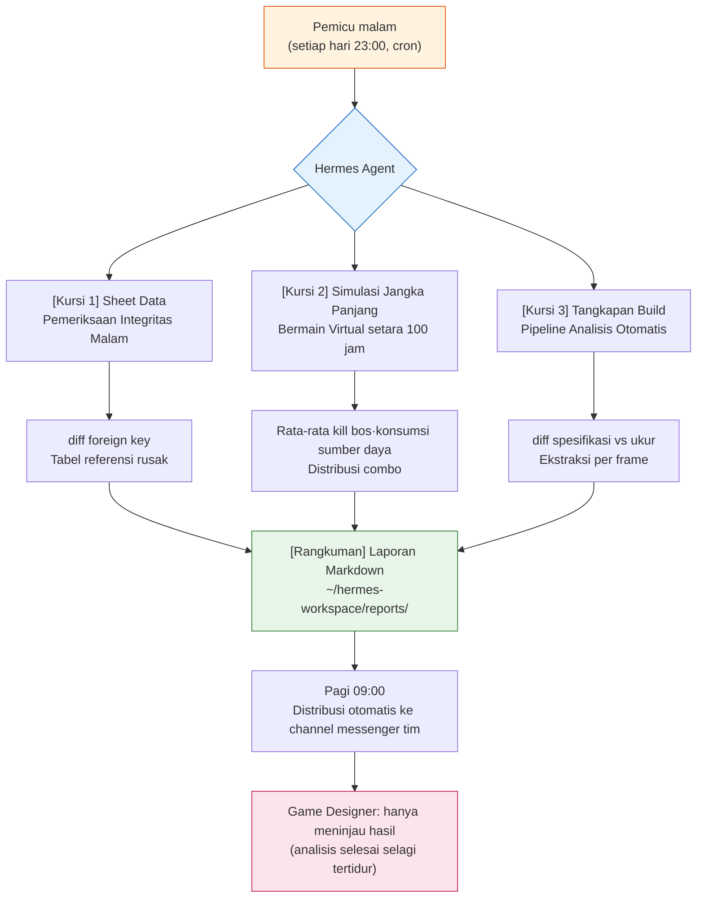

# Bagian 23 · Bab 2. Catatan Mengadopsi Hermes Agent

Pukul 23.47. Saya menyimpan sheet data untuk terakhir kalinya, lalu menutup laptop. Keesokan paginya pukul 09.10, sambil menyeduh kopi, saya membuka messenger tim internal dan menemukan sebuah laporan sudah terpampang di bagian atas channel. Sebuah berkas Markdown yang memeriksa silang tiga sheet balance yang diperbarui semalam berdasarkan foreign key, lalu menandai dua referensi yang rusak dengan warna merah. Bukan saya yang menulisnya. Laporan itu dibuat selagi saya tertidur.

Bab ini adalah catatan tentang proses memasang Hermes Agent — alat yang membuat laporan tadi — di PC pribadi saya, lalu menumpangkannya di atas operasional Wrapper, Cascade, dan Junction yang dibahas di §23.1. Pada awal pengadopsian, Hermes masih berbasis Linux, sehingga untuk memakainya di Windows saya harus melalui WSL2. Namun pada tahun 2026 muncul build Windows native, dan jalan memutar itu pun lenyap. Saya katakan kesimpulannya lebih dulu: agen ini tidak menyingkirkan Claude Code. Ia justru duduk di sebelahnya.

---

## 23.2.1 Dua Alat yang Duduk di Meja yang Sama

Seluruh operasional sampai §23.1 berpusat pada Claude Code. Saya mengetik satu kalimat, alat itu merespons sekali, lalu saya meninjau respons tersebut sebelum mengetik kalimat berikutnya. Siklus pendek ini luar biasa cocok untuk pekerjaan presisi. Untuk pekerjaan yang menuntut konfirmasi di setiap langkah — seperti mengubah satu angka balance — sudah seharusnya manusia ikut campur setiap kali.

Masalahnya muncul pada pekerjaan yang panjang. Permintaan seperti "baca semua 30 notulen rapat sebulan terakhir, lalu ekstrak hanya keputusan-keputusannya sebagai kandidat atom" akan membutuhkan 30 kali bolak-balik jika diproses di dalam alur percakapan. Selama 30 putaran itu, saya tidak bisa mengerjakan hal lain. Pada pekerjaan semacam ini, keunggulan alat yang merapatkan masukan dan keluaran dalam siklus pendek justru berbalik menjadi kelemahan.

Agen mengisi kursi yang berlawanan itu. Begitu saya melemparkan tujuannya saja — "ambil keputusan-keputusan dari 30 notulen sebagai kandidat atom, lalu jadikan laporan" — ia memilih sendiri alat yang dipakai, menapaki langkah-langkah perantara secara mandiri, dan setelah selesai hanya membawakan hasilnya. Siklusnya panjang dan otonom. Sebagai gantinya, datang pula kelemahan bahwa manusia tidak melihat setiap langkahnya.

<svg viewBox="0 0 640 280" xmlns="http://www.w3.org/2000/svg" font-family="sans-serif" font-size="13">
  <rect x="0" y="0" width="640" height="280" fill="#fafafa" stroke="#ddd"/>
  <text x="320" y="28" text-anchor="middle" font-size="15" font-weight="bold">Perbandingan Siklus Kerja Dua Alat</text>

  <!-- Claude Code lane -->
  <text x="20" y="70" font-weight="bold" fill="#1565c0">Claude Code</text>
  <text x="20" y="88" font-size="11" fill="#666">Presisi · Sekali Jalan · Verifikasi Tiap Langkah</text>
  <g fill="#bbdefb" stroke="#1565c0">
    <rect x="160" y="58" width="60" height="26"/>
    <rect x="260" y="58" width="60" height="26"/>
    <rect x="360" y="58" width="60" height="26"/>
    <rect x="460" y="58" width="60" height="26"/>
  </g>
  <g fill="#1565c0" font-size="10" text-anchor="middle">
    <text x="190" y="75">Masuk→Keluar</text>
    <text x="290" y="75">Masuk→Keluar</text>
    <text x="390" y="75">Masuk→Keluar</text>
    <text x="490" y="75">Masuk→Keluar</text>
  </g>
  <g stroke="#90caf9" stroke-width="2">
    <line x1="220" y1="71" x2="260" y2="71"/>
    <line x1="320" y1="71" x2="360" y2="71"/>
    <line x1="420" y1="71" x2="460" y2="71"/>
  </g>
  <text x="160" y="112" font-size="10" fill="#1565c0">↑ Manusia meninjau di tiap panah</text>

  <!-- divider -->
  <line x1="20" y1="140" x2="620" y2="140" stroke="#ddd" stroke-dasharray="4"/>

  <!-- Agent lane -->
  <text x="20" y="180" font-weight="bold" fill="#c62828">Hermes Agent</text>
  <text x="20" y="206" font-size="11" fill="#666">Jangka Panjang · Otonom · Hanya Checkpoint</text>
  <rect x="160" y="168" width="360" height="26" fill="#ffcdd2" stroke="#c62828"/>
  <text x="340" y="185" text-anchor="middle" font-size="10" fill="#c62828">Masukkan 1 tujuan → (eksekusi otonom: pilih alat·ulangi·verifikasi) → Keluarkan 1 hasil</text>
  <g fill="#c62828">
    <circle cx="250" cy="168" r="4"/>
    <circle cx="340" cy="168" r="4"/>
    <circle cx="430" cy="168" r="4"/>
  </g>
  <text x="160" y="222" font-size="10" fill="#c62828">● Checkpoint (titik manusia bisa meninjau) — bukan tiap langkah</text>

  <text x="320" y="262" text-anchor="middle" font-size="12" fill="#555">Keputusan presisi di lajur atas, pengulangan·jangka panjang di lajur bawah. Meja yang sama.</text>
</svg>

Akan mudah dipahami jika dimisalkan dengan rekan kerja di sebelah. Claude Code adalah teman duduk yang ikut mencermati setiap kalimat saya, sedangkan agen adalah tenaga bantu yang dengan sukarela bertugas di malam hari dan menaruh laporan di atas meja sebelum saya berangkat kerja. Hubungannya bukan satu pihak memecat pihak lain. Keduanya berbagi meja yang sama.

---

## 23.2.2 Mengapa Repot-Repot Menambah Satu Alat Lagi

Di §23.1 saya membuat operasional yang mengikat slot slash command global menjadi 12 buah, lalu menyembunyikan 48 alat induk di belakangnya dengan Junction. Kesimpulannya saat itu adalah: jangan menambah alat, melainkan buatlah alat untuk mengelola alat. Lalu di sini, niat untuk menambah alat baru lagi terdengar bertentangan dengan kesimpulan tadi.

Itu bukan kontradiksi. Kebijakan 12 slot di §23.1 menangani beban kognitif "alat yang dipanggil langsung oleh manusia". Kursi yang ingin diisi Hermes adalah waktu ketika manusia tidak memanggil — waktu tertidur, waktu sedang rapat, waktu tangan terikat pekerjaan lain. Ia tidak bersaing dengan 12 slot, melainkan mengisi rentang waktu yang tidak terjangkau oleh 12 slot itu.

Dasar keputusan untuk mengadopsinya adalah satu nilai ukur dari retrospektif. Ketika saya menjalankan `skill_audit_score` — yang menghitung mundur frekuensi pemakaian alat global dari log commit SVN — untuk data sebulan, sebagian besar alat teratas ternyata jenis yang "dipakai sering, singkat, di waktu manusia terjaga". Sebaliknya, pekerjaan yang frekuensi pemakaiannya rendah tetapi memakan waktu lama sekali jalan — klasifikasi notulen secara massal, pemeriksaan integritas sheet data di malam hari, analisis tangkapan build — terus saja ditunda dengan dalih "nanti pagi saja". Alasan penundaannya jelas: pekerjaan itu menyita waktu terjaga dalam waktu lama.

Kelompok pekerjaan yang tertunda inilah sasaran tepat bagi agen.

---

## 23.2.3 Pemasangan — Build Windows Native

Saat pertama memasang Hermes, karena berbasis Linux, untuk memakainya di PC pribadi Windows saya harus lebih dulu memasang WSL2 (Windows Subsystem for Linux 2) lalu mendudukkan Hermes di dalamnya. Sekarang sudah ada build Windows native sehingga jalan memutar itu tak diperlukan. Pemasangannya sama seperti aplikasi Windows pada umumnya — Anda mengunduh installer dan menjalankannya, lalu pada peluncuran pertama menetapkan nilai awal untuk path workspace dan whitelist izin.

Jika Anda sudah memakai WSL2 atau lebih menyukai lingkungan Linux, build untuk sisi itu pun tetap didukung sebagaimana adanya. Hanya saja, jika baru memulai dari awal, sisi native lebih sederhana. Karena installer dan versi yang tepat berubah dengan cepat, ikutilah dokumentasi resmi.

Ada satu jebakan yang tetap ada terlepas dari lokasi pemasangan. Workspace Hermes harus diletakkan di **disk lokal yang cepat**. Jika Anda menautkan network drive atau folder kerja SVN langsung sebagai workspace, satu kali pemeriksaan integritas malam hari yang seharusnya hanya beberapa menit bisa membengkak menjadi puluhan menit. Praktik bakunya adalah meletakkan sheet data di luar workspace dan menyalinnya masuk hanya pada saat pekerjaan dimulai. Jika Anda memakai WSL2, dengan alasan yang sama, letakkan workspace di dalam filesystem Linux dan jangan bolak-balik menyeberangi path Windows seperti `/mnt/c`.

---

## 23.2.4 Memasang Hermes dan Koneksi Pertama — Worked Transcript (rekaman sesi nyata)

Mulai dari sini barulah bagian yang benar-benar perlu dikerjakan dengan tangan. Karena inti bab ini bukan pemasangan itu sendiri melainkan "apa yang Anda suruh kerjakan setelah dipasang", saya akan menelusuri satu pekerjaan pertama sampai tuntas — prompt utuh, keluaran mentah, verifikasi manusia, hingga permintaan ulang. Untuk pekerjaan ini saya memilih yang paling sederhana dari kelompok pekerjaan tertunda di §23.2.2, yakni pemeriksaan integritas sheet data di malam hari.

> Perhatian: sebagian perintah di bawah ini berbentuk contoh untuk memperlihatkan bentuk permukaan Hermes. Karena URL installer dan subperintah berubah dari versi ke versi, periksalah dokumentasi resmi. Struktur alur kerjanya (tujuan → eksekusi otonom → verifikasi → permintaan ulang) tetap bertahan meski alatnya berganti.

Untuk Windows native, Anda mengunduh `install.ps1` resmi dari PowerShell lalu menjalankannya. Hanya saja, sebelum menjalankan begitu saja one-liner `iex (irm ...)` yang berbentuk satu baris, lebih aman jika Anda mengunduh dulu skripnya (sekitar 2,800 baris), menyapu pola berbahaya dengan mata sendiri — itulah prosedur minimal untuk memercayai sumbernya — lalu memisahkan pengaturan kunci dengan memasang hanya bagian intinya lebih dahulu menggunakan `-SkipSetup`, kemudian menjalankan `hermes setup` secara terpisah. Jika Anda memakai WSL2 atau Linux, ikutilah bagian pemasangan yang relevan di dokumentasi resmi.

```powershell
# Windows native — install.ps1 resmi (unduh dan tinjau dulu sebelum dijalankan)
irm https://hermes-agent.nousresearch.com/install.ps1 -OutFile install.ps1
# (setelah memeriksa isi install.ps1)
.\install.ps1 -SkipSetup
# Memasang sekaligus Python 3.11 · Node · Git · Playwright · skill bundel
# Lokasi pemasangan: %LOCALAPPDATA%\hermes\  (mendaftarkan perintah hermes ke PATH — dikenali mulai dari terminal baru)
# Setelah selesai: hermes setup
```

Installer memasang dependensi (Python 3.11·Node 22·Git) sekaligus, memasang intinya ke `%LOCALAPPDATA%\hermes\`, lalu mendaftarkan perintah `hermes` ke PATH (dikenali mulai dari terminal baru). Data operasional seperti pengaturan, log, penjadwalan (cron), dan checkpoint juga tertinggal di bawah `%LOCALAPPDATA%\hermes\` yang sama sehingga tetap terjaga meski dipasang ulang (di sinilah jebakannya — di `~/.hermes\` hanya ada skrip pendukung sehingga mudah membingungkan. `config.yaml` dan `logs\` yang sebenarnya semuanya ada di sisi `%LOCALAPPDATA%\hermes\`). Saat Anda menjalankan `hermes setup` pada peluncuran pertama, ia akan menanyakan kunci API model, lalu menetapkan nilai awal untuk path workspace dan whitelist izin.

```powershell
hermes --version
hermes setup
```

Kini saya menyerahkan pekerjaan pertama. Tujuan yang dilemparkan kepada agen satu tingkat lebih abstrak daripada prompt Claude Code. Bukan "kerjakan ini begini", melainkan lebih mendekati "buatkan hasil ini". Tujuan utuh yang sebenarnya saya masukkan adalah sebagai berikut.

**[Prompt Utuh]**

```
Tujuan: pemeriksaan integritas sheet data malam hari.

Baca tiga xlsx item_master·drop_table·npc_shop di ~/hermes-workspace/sheets/,
lalu periksa foreign key apakah item_id yang dirujuk oleh drop_table·npc_shop
benar-benar ada di item_master. Temukan semua referensi yang rusak (baris yang
menunjuk ke item_id yang tidak ada), lalu simpan ke reports/ dalam Markdown dengan
nama berkas bertanggal. (Maksud: yang lolos cukup jumlahnya saja, yang gagal dalam
tabel nama sheet·nomor baris·item_id.)

Batasan:
- sheets/ hanya dibaca, jangan diubah sama sekali.
- Jika sheet tidak terbaca atau nama kolom berbeda dari perkiraan, berhenti dan
  laporkan apa yang berbeda. Dilarang menebak.
```

Dua baris terakhir itu penting. Karena agen bersifat otonom, ada kecenderungan ia mencoba menambal "dengan caranya sendiri" ketika tersendat. Misalnya, jika nama kolom berbeda, ia memilih nama yang mirip lalu melanjutkan. Maka dari itu, saya memasukkan secara eksplisit "jika tersendat, berhenti dan laporkan, jangan menebak". Ini satu napas dengan pelajaran yang saya peroleh saat menyusun Cascade verifikasi sheet data di §23.1.

**[Keluaran Mentah Hermes — Putaran ke-1]**

Saya pindahkan apa adanya tanpa meringkas. Percobaan pertama tidak berakhir mulus.

```
[hermes] goal accepted: pemeriksaan integritas sheet data malam hari
[hermes] step 1/4  reading sheets...
         item_master.xlsx   loaded (4,210 rows)
         drop_table.xlsx    loaded (1,880 rows)
         npc_shop.xlsx      ERROR

[hermes] npc_shop.xlsx: expected column 'item_id', found columns:
         ['shop_id', 'sell_item', 'price', 'stock']
[hermes] this conflicts with the constraint: "jika nama kolom berbeda dari perkiraan, berhenti dan laporkan".
[hermes] HALTING. reporting instead of guessing.

[hermes] partial result:
  - Pemeriksaan item_master ↔ drop_table memungkinkan (kolom item_id ada di kedua sisi)
  - Pada npc_shop, kolom item_id diperkirakan bernama 'sell_item', tetapi tidak dapat dipastikan sehingga tidak dijalankan
[hermes] awaiting clarification on npc_shop column mapping.
```

Di sinilah orang yang baru pertama memakai agen paling terkejut. Alat itu berhenti. Dan ia menyebutkan alasan berhentinya dengan tepat. Kolom referensi item pada `npc_shop.xlsx` bukan `item_id` seperti perkiraan saya, melainkan `sell_item`. Andai saya tidak memasukkan batasan tadi, agen tentu akan menganggap sendiri `sell_item` sebagai `item_id` lalu melanjutkan, dan pagi harinya saya hanya akan menerima laporan bertuliskan "normal". Berhenti itulah keamanan.

**[Verifikasi·Penolakan Manusia]**

Saya melihat keluaran itu lalu menilai dua hal.

Pertama, bagian yang melaporkan bahwa pemeriksaan item_master ↔ drop_table sudah bisa dilakukan layak dipercaya. Kedua, perkiraan `sell_item` pada npc_shop itu benar — memang itulah nama kolom item yang dijual pada sheet tersebut. Namun, keputusan untuk tidak melanjutkan berdasarkan "perkiraan" sudah tepat. Maka saya tidak menerima keluaran putaran pertama apa adanya (menolak), dan memasukkan permintaan ulang yang menyebutkan pemetaan kolom secara eksplisit.

**[Prompt Permintaan Ulang]**

```
Sudah saya konfirmasi. Saya jelaskan pemetaan kolomnya:
- Kolom referensi item pada npc_shop.xlsx adalah 'sell_item'. Anggap ini sebagai item_id lalu periksa.
- Sisa batasan tetap sama. Jangan menebak kolom lain selain 'sell_item'.
Jalankan ulang.
```

**[Keluaran Mentah Hermes — Putaran ke-2]**

```
[hermes] resuming with column map: npc_shop.sell_item -> item_id
[hermes] step 2/4  foreign-key check...
         drop_table → item_master   : 1,880 refs, 2 broken
         npc_shop   → item_master   : 642 refs, 0 broken
[hermes] step 3/4  collecting broken refs...
[hermes] step 4/4  writing report...
         ~/hermes-workspace/reports/2026-05-25_sheet_integrity.md  written
[hermes] done. 2 broken references found. summary:
  | sheet      | row  | bad item_id |
  |------------|------|-------------|
  | drop_table | 417  | ITM_90412   |
  | drop_table | 1356 | ITM_90727   |
```

Dua referensi yang rusak tertangkap. Baris 417 dan baris 1356 pada `drop_table` menunjuk ke `item_id` yang tidak ada di `item_master`. Tabel merah yang saya lihat pagi itu persis inilah.

Dalam satu kali bolak-balik ini, pesan bab ini hampir seluruhnya tersingkap. Agen bersifat otonom tetapi berhenti di hadapan batasan, dan ketika manusia menambal titik berhentinya, ia melaju sampai tuntas. Otonomi dan kendali bukannya berbenturan, melainkan saling mengait. Dan jika seluruh siklus ini Anda jadwalkan agar berputar sekali lagi di waktu Anda tertidur, itulah yang menjadi otomasi malam hari di §23.2.5.

---

## 23.2.5 Tiga Kursi yang Ditumpangkan ke Alur Kerja Perancangan Game

Begitu pekerjaan pertama terbiasa di tangan, kelompok pekerjaan yang tertunda dilimpahkan satu per satu ke malam hari. Yang sebenarnya saya tumpangkan ada tiga kursi. Kesamaan ketiganya jelas — semuanya mengubah waktu yang tidak perlu dihadiri manusia menjadi waktu kerja.



**Kursi 1 — Integritas Sheet Data Malam Hari.** Pekerjaan yang ditelusuri sampai tuntas di 2.4 itu saya jadwalkan setiap malam pukul 23.00. Tidak peduli siapa menyentuh sheet apa semalam, ketika pagi tiba, tempat di mana foreign key rusak sudah terpampang dalam tabel. Ini secara permukaan mirip dengan tugas yang dahulu dikerjakan Cascade `/check` di §23.1 (integrasi empat jenis: doc-audit → data-qa → integrity → link-check), tetapi ada satu perbedaan menentukan. `/check` baru berputar jika saya terjaga dan memanggilnya. Agen malam berputar bahkan tanpa kehadiran saya. Keduanya tidak bersaing — Cascade siang berperan sebagai verifikasi seketika, agen malam sebagai verifikasi tanpa awak.

**Kursi 2 — Simulasi Jangka Panjang.** Simulasi pertarungan yang dibahas di §4.4 saya perpanjang lebih dalam pada sumbu waktu. Ini adalah pekerjaan menjalankan permainan virtual setara 100 jam untuk mengukur waktu rata-rata kill bos, kurva konsumsi sumber daya, dan distribusi combo. Pada hakikatnya ini tidak cocok dengan alur percakapan Claude Code — satu kali putaran memakan beberapa jam, dan saya tak mungkin terus memegangi jendela percakapan selama waktu itu. Agen menjalankannya di latar belakang, lalu setelah selesai hanya membawakan grafik kurva dan angka rangkuman.

**Kursi 3 — Analisis Otomatis Tangkapan Build.** Begitu rekaman build yang ditangkap QA jatuh ke folder, agen mengekstrak data per frame lalu membuat diff antara angka spesifikasi dan angka hasil ukur. Game Designer tidak perlu memutar rekaman dari awal sampai akhir, cukup melihat baris diff seperti "spesifikasi damage 120 tetapi build terukur 108". Seluruh bagian membosankan dari analisis menjadi jatah agen.

Pada ketiga kursi itu, waktu orang yang melihat hasilnya tidak berkurang. Yang berkurang adalah waktu orang yang masuk ke dalam analisis. Penilaian tetap dilakukan manusia.

---

## 23.2.6 Harga dari Otonomi — Lima Pengaman

Otonomi agen sekaligus juga merupakan risiko. Jika alat membaca berkas dan menjalankan perintah tanpa konfirmasi manusia di setiap langkah, ketika ada yang melenceng, manusia tidak ada di tempat itu. Bukan kebetulan bahwa di §23.2.4 saya secara eksplisit menuliskan "dilarang menebak". Kelima pengaman bukanlah pilihan, melainkan satu paket yang harus dinyalakan bersama pada hari pertama pengadopsian.

| Pengaman | Tugasnya (kunci pengaturan Hermes sebenarnya) | Yang terjadi bila hilang |
|---|---|---|
| Whitelist izin | Perintah destruktif harus melalui persetujuan manusia (`approvals.mode: manual`), hanya perintah yang diizinkan masuk whitelist (`command_allowlist`), nilai rahasia disamarkan dari log (`security.redact_secrets`) | Sheet data asli diubah sendiri secara otonom |
| Checkpoint | Mengambil snapshot sebelum operasi berkas agar bisa dikembalikan (`checkpoints.enabled`, pemulihan dengan `/rollback`) | Asumsi yang salah menggelinding sampai akhir hingga seluruh hasil tercemar |
| Pencatatan log otomatis | Meninggalkan log gateway·agen·error di `%LOCALAPPDATA%\hermes\logs\` | Setelah insiden, tidak bisa melacak "mengapa jadi begini" |
| Batas biaya | Batas atas giliran per pekerjaan (`agent.max_turns`)·timeout terminal (`terminal.timeout`)·deteksi otomatis loop tak terhingga (`tool_loop_guardrails`)·kompresi konteks otomatis (`compression`) | Pekerjaan yang terjebak loop tak terhingga membengkakkan tagihan API |
| Dapat dibatalkan | Hentikan kapan saja (`/stop`)·jeda/hapus penjadwalan (cron pause)·timeout subtugas (`delegation.child_timeout_seconds`)·arsip otomatis skill yang tak terpakai (`curator`) | Tidak bisa menghentikan pekerjaan malam yang mulai berputar keliru |

Kelima ini bukan pengaman yang bekerja sendiri-sendiri, melainkan beroperasi sebagai satu paket. Jika Anda hanya mengunci izin tetapi tidak memasang batas biaya, loop tak terhingga akan berputar di dalam izin dan tagihan membengkak. Jika Anda hanya menyalakan log tanpa sarana pembatalan, Anda melihat insiden terjadi tetapi tak bisa menghentikannya. Hilang salah satu saja, probabilitas insiden operasi tanpa awak di malam hari langsung melonjak.

Saat benar-benar menyalakan alatnya, ada beberapa tempat di mana alat itu mengimplementasikan kelima konsep ini satu tingkat lebih rapat daripada yang digambarkan di buku. Pada sisi izin ada satu lapis tambahan berupa policy engine tersendiri (`security.tirith_enabled`) yang menyaring perintah dengan aturan. Deteksi loop tak terhingga pada sisi biaya bukan sekadar satu batas atas, melainkan menetapkan ambang tersendiri untuk sinyal seperti "pengulangan kegagalan yang sama" dan "pengulangan tanpa kemajuan". Lalu pada penjadwalan tanpa awak malam hari (cron) ada saklar tersendiri (`approvals.cron_mode: deny`) sehingga, jika di rentang waktu tanpa manusia tertangkap perintah destruktif, ia langsung menolaknya tanpa menunggu persetujuan — semacam mengikat "izin + checkpoint" dari buku menjadi satu pengaturan. `curator` pada sisi pembuangan adalah tempat di mana "alat yang tak terpakai dibuang" dari §21 benar-benar terpasang sebagai fitur. Kerangka kelima paket itu dipertahankan apa adanya, dan pada tempat di mana alat lebih canggih, Anda cukup membiarkan kunci itu menyala.

Berikut kira-kira tampilan ketika paket ini dimasukkan ke `config.yaml`.

```yaml
# %LOCALAPPDATA%\hermes\config.yaml (cuplikan)
approvals:
  mode: manual              # ① Izin — perintah destruktif melalui persetujuan manusia
  command_allowlist:        #    Sebutkan hanya perintah yang diizinkan tanpa persetujuan
    - "python *"
    - "rg *"
  cron_mode: deny           #    cron tanpa awak malam menolak otomatis bila bertemu perintah destruktif
security:
  redact_secrets: true      #    Menyamarkan nilai rahasia dari log
  tirith_enabled: true      #    Satu lapis tambahan policy engine (filter perintah berbasis aturan)
checkpoints:
  enabled: true             # ② Checkpoint — snapshot sebelum operasi berkas (pemulihan /rollback)
  max_snapshots: 20
  retention: 7d
logs:
  path: "%LOCALAPPDATA%\\hermes\\logs"   # ③ Log — gateway/agent/errors
agent:
  max_turns: 60             # ④ Biaya — batas atas giliran per pekerjaan
terminal:
  timeout: 180              #    Timeout perintah terminal (detik)
tool_loop_guardrails:       #    Deteksi otomatis loop tak terhingga (kegagalan sama·tanpa kemajuan)
  enabled: true
compression:
  enabled: true             #    Kompresi konteks otomatis (penghematan token)
delegation:
  child_timeout_seconds: 600  # ⑤ Pembuangan — timeout subtugas (bersama /stop·cron pause)
curator:
  enabled: true             #    Arsip otomatis skill yang tak terpakai
```

Pendelegasian pun tidak diserahkan seluruhnya sekaligus. Mula-mula serahkan hanya pekerjaan yang paling sempit dan paling mudah dikembalikan (yang hanya membaca, seperti pemeriksaan integritas), amati hasilnya beberapa hari, lalu perluas ke kursi berikutnya. Alasan saya memilih pemeriksaan integritas malam sebagai pekerjaan pertama di §23.2.4 juga sama — karena hanya membaca, paling buruk pun cukup berakhir dengan satu lembar laporan yang keliru, dan aslinya tidak tergores.

---

## 23.2.7 Kemajuan Pengadopsian dan Tahap Bertahap (Per Juni 2026)

Pada saat bab ini diperbarui, pengadopsian sudah memasuki tahap mapan. Saya telah merampungkan pemasangan build Windows native (v0.16.0), dan menuntaskan pendaftaran kunci API model lewat `hermes setup`. Saya menggerakkan kursi pertama dan memeriksa kelima pengaman satu per satu dengan kunci pengaturan yang sebenarnya, dan kini sedang membiasakannya sambil menjalankan pekerjaan otonom yang nyata. Jujur saja, saya sedang memverifikasinya lebih dulu di PC pribadi, bukan PC kantor — dan pengadopsian di kantor saya tunda sampai pengaman cukup matang di PC pribadi. Ini lebih dekat ke prinsip pemisahan PC daripada sekadar kehati-hatian. Saya tidak langsung melepaskan alat otonom yang belum terverifikasi ke data tim.

| Periode | Aktivitas | Gerbang |
|---|---|---|
| 1 bulan | Pasang Hermes (Windows native v0.16.0) + `hermes setup` + pekerjaan pertama | Apakah kelima pengaman sudah menyala semua |
| 2\~3 bulan | Perluas ke 2\~3 kursi (klasifikasi notulen·analisis tangkapan build) | Periksa log di tiap lingkup pendelegasian |
| 3\~6 bulan | Tinjauan kantor — pengambilan keputusan berdasarkan hasil verifikasi PC pribadi | Pastikan 0 insiden operasi tanpa awak |
| 6\~12 bulan | Pengadopsian skala tim | Pengaman mapan sebagai konvensi tim |

Godaan untuk melompati tahap adalah yang paling berbahaya. Jika dari 1 bulan langsung melompat ke 6 bulan (pengadopsian tim), pengaman terlepas dalam keadaan masih sekadar kebiasaan satu orang dan belum matang sebagai konvensi tim. Jawabannya adalah berhenti sejenak sekali di akhir setiap tahap untuk memeriksa kelima pengaman. Lebih penting bergerak dalam keadaan dapat dikembalikan daripada bergerak cepat.

---

## 23.2.8 Lima Salah Kaprah yang Umum

"Agen menggantikan manusia" adalah salah kaprah yang paling umum. Worked transcript di §23.2.4 menunjukkan kebalikannya — agen berhenti pada satu pemetaan kolom, dan penilaian itu ditambal manusia. Keputusan inti perancangan game tetap menjadi jatah manusia, dan yang diambil agen adalah bagian membosankan dari pengulangan dan analisis.

Harapan bahwa "sekali dipasang, semuanya otomatis" juga berbahaya. Satu dua bulan pertama justru lebih merepotkan. Anda harus menyelaraskan pemetaan nama kolom, lingkup izin, dan batas biaya untuk tiap pekerjaan, dan sampai penyelarasan itu terbiasa, manusia meninjau setiap keluaran.

Pernyataan bahwa "Claude Code kini ketinggalan zaman" itu keliru. Keduanya berbeda rentang waktu. Keputusan presisi siang dengan Claude Code, pengulangan tanpa awak malam dengan agen. Cascade `/check` di §23.1 tidak lenyap, melainkan di sebelahnya muncul satu lajur malam lagi.

Anggapan bahwa "karena open source, berarti gratis" hanya benar separuh. Meski intinya gratis, biaya panggilan API model tetap dikeluarkan. Karena itulah batas biaya seperti `agent.max_turns`·`compression` pada `config.yaml` sekaligus menjadi pengaman dan buku kas.

Terakhir, harapan bahwa "agen mengerjakan sampai pekerjaan yang rumit dan berbahaya sekalipun" adalah yang paling berbahaya. Semakin besar risiko sebuah pekerjaan, semakin ia ditaruh di bawah kendali manusia. Yang diserahkan ke agen adalah pekerjaan yang sederhana dan mudah dikembalikan lebih dahulu. Pendelegasian diperluas hanya sebesar kepercayaan yang telah terbangun.

---

## 23.2.9 Penghubung ke Bab Berikutnya

Jika Wrapper·Cascade·Junction di §23.1 adalah puncak operasional Claude Code, maka Hermes di bab ini adalah satu lajur malam yang dipasang lagi di atas operasional itu. Gambaran di mana alat siang dan alat malam berbagi meja yang sama — inilah keadaan sekarang per tahun 2026 sekaligus kerangka masa depan terdekat.

Bab berikutnya adalah kurasi alat untuk Game Designer. Apa yang dimasukkan ke dalam 12 slot, apa yang disaring keluar dengan `skill_audit_score` — kriteria kurasi yang sempat tersinggung di bab ini akan diuraikan menjadi rekomendasi alat yang konkret.

---

### Poin-Poin Penting
- Agen tidak menggantikan Claude Code, melainkan mengisi rentang waktu yang tak terjangkau
- Lima pengaman (izin·checkpoint·log·biaya·pembuangan) harus dinyalakan sebagai satu paket
- Pendelegasian dimulai dari pekerjaan sempit yang hanya membaca, dan diperluas hanya sebesar kepercayaan yang terbangun

### Pratinjau Bab Berikutnya
- Bagian 23 · Bab 3. Kurasi Alat untuk Game Designer

---

## Coba Sendiri

**setup**
1. Unduh installer Windows native Hermes lalu pasang (jika Anda lebih menyukai Linux, jalur `wsl --install` lalu memasang di dalamnya pun tetap ada).
2. Buatlah folder kerja di disk lokal yang cepat, lalu salin sheet data yang akan diperiksa ke sana (dilarang menautkan network drive·folder kerja SVN langsung sebagai workspace).
3. `hermes setup` → masukkan kunci API model → konfirmasi nilai awal path workspace·izin.
4. Nyalakan lima pengaman di `%LOCALAPPDATA%\hermes\config.yaml`: persetujuan izin (`approvals.mode: manual`·`command_allowlist`·`cron_mode: deny`), batas biaya (`agent.max_turns`·`terminal.timeout`·`tool_loop_guardrails`), checkpoint (`checkpoints.enabled`), path log (`logs.path`), serta pahami prosedur penghentian (`/stop`·`/rollback`).

**prompt**
- Lemparkan tujuan satu tingkat lebih abstrak: bukan "kerjakan ini", melainkan "buatkan hasil ini".
- Sebutkan sasaran·tugas·lokasi penyimpanan secara bernomor, dan di akhir pastikan memasukkan satu baris: "jika tersendat atau kolom/format berbeda dari perkiraan, berhenti dan laporkan, dilarang menebak."
- Pilihlah pekerjaan pertama yang mudah dikembalikan, seperti pemeriksaan integritas yang hanya membaca.

**verify**
- Jangan percaya keluaran putaran pertama begitu saja; manusialah yang memeriksa titik tempat agen berhenti (pemetaan kolom·ketidakcocokan format).
- Jika berhentinya tepat, sebutkan pemetaan lalu minta ulang; jika keliru, masukkan ulang batasannya.
- Cocokkan langsung satu dua item gagal dari laporan yang dihasilkan dengan sheet aslinya untuk memverifikasi apakah penilaian agen benar, baru setelah itu serahkan ke penjadwalan malam (cron 23:00).

## Versi Ringkas Solo

Jika Anda ingin lebih dulu menangkap rasa dari sebuah agen tanpa memasang Hermes, Anda bisa menjalankan versi ringkasnya dengan eksekusi latar belakang di dalam Claude Code.

- Siapkan satu sheet data yang akan diperiksa, dan satu paragraf: "ambil baris yang foreign key-nya rusak dalam tabel / jika nama kolom berbeda, berhenti dan laporkan / simpan hasilnya ke folder reports".
- Jalankan ini sekali sebagai pekerjaan latar belakang, dan kerjakan hal lain selama itu. Setelah selesai, cukup periksa hasilnya.
- Intinya bukan alatnya melainkan siklusnya — begitu empat ketukan ini terbiasa di tangan, yakni melempar tujuan, memercayai berhentinya, menambal titik berhentinya, dan hanya meninjau hasilnya, ketika nanti Anda berpindah ke Hermes asli pun Anda akan bergerak dengan ketukan yang sama.
