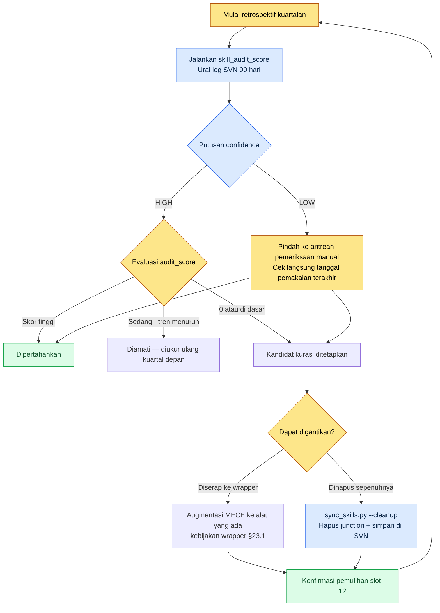

# Bagian 23 · Bab 3. Kurasi Alat — Memangkas Alat yang Tidak Terpakai Berdasarkan Data

Saat sedang melakukan retrospektif kuartalan, saya membuka folder skill global. Setelah saya hitung satu per satu, ternyata ada 19 wrapper. Padahal saya jelas-jelas sudah menetapkan untuk mengoperasikan 12 saja dan menjalankannya selama setahun, tetapi entah kapan 7 lainnya ikut menempel. Yang lebih konyol, separuh di antaranya tidak langsung terbayang fungsinya hanya dari namanya. `migrate-legacy-enum`. Ini apa, ya? Kapan terakhir kali saya memakainya?

Saya tidak ingat. Selama saya mengandalkan ingatan, pertanyaan ini tidak akan pernah bisa saya jawab. Karena itu, alih-alih ingatan, saya memutuskan untuk melihat log. Kurasi alat seharusnya bukan pekerjaan menyingkirkan berdasarkan selera, melainkan menyingkirkan berdasarkan angka — yaitu "berapa kali alat ini saya panggil pada kuartal lalu".

Bab ini adalah catatan tentang bagaimana menarik angka itu secara otomatis, bagaimana memangkas alat berdasarkan angka tersebut, dan bagaimana mencegah alat membludak sejak awal.

---

## 23.3.1 Bertambahnya Alat Adalah Fenomena Alami

Sebelum membahas kurasi, ada satu hal yang harus kita akui. Jika tidak dicegah, alat pasti akan bertambah. Bukan karena tekad yang lemah. Sebab pada setiap pekerjaan, membuat satu skrip kecil "hanya untuk menyelesaikan yang ini dengan cepat" adalah pilihan yang rasional. Ketika pilihan rasional itu menumpuk puluhan kali, hasilnya adalah tumpukan yang tidak rasional.

Struktur yang dioperasikan di Proyek A berbentuk 12 wrapper global yang menunjuk ke 48 alat inti di workspace melalui junction. Sisi global ringan, sedangkan alat inti yang berat disimpan di workspace yang dikelola dengan SVN. Struktur ini sendiri sudah dibahas di §23.1. Masalahnya, angka 12 ini tidak mau diam.

Ketika kita melihat apa saja yang ikut bertambah saat alat bertambah, menjadi jelas mengapa hal itu harus dicegah.

<svg viewBox="0 0 640 250" xmlns="http://www.w3.org/2000/svg" font-family="sans-serif" font-size="13">
  <rect x="0" y="0" width="640" height="250" fill="#fbfbfb"/>
  <text x="20" y="28" font-size="15" font-weight="bold" fill="#222">1 alat ditambah → 4 biaya yang ikut bertambah</text>
  <!-- center node -->
  <rect x="270" y="100" width="100" height="46" rx="8" fill="#2b6cb0"/>
  <text x="320" y="128" fill="#fff" text-anchor="middle" font-weight="bold">Alat baru +1</text>
  <!-- four cost nodes -->
  <rect x="40" y="55" width="160" height="40" rx="6" fill="#fff" stroke="#c53030"/>
  <text x="120" y="80" text-anchor="middle" fill="#c53030">Okupansi token konteks ↑</text>
  <rect x="440" y="55" width="160" height="40" rx="6" fill="#fff" stroke="#c53030"/>
  <text x="520" y="80" text-anchor="middle" fill="#c53030">Kelelahan memilih ↑</text>
  <rect x="40" y="155" width="160" height="40" rx="6" fill="#fff" stroke="#c53030"/>
  <text x="120" y="180" text-anchor="middle" fill="#c53030">Luas permukaan pemeliharaan ↑</text>
  <rect x="440" y="155" width="160" height="40" rx="6" fill="#fff" stroke="#c53030"/>
  <text x="520" y="180" text-anchor="middle" fill="#c53030">Risiko duplikasi fungsi ↑</text>
  <!-- lines -->
  <line x1="270" y1="115" x2="200" y2="75" stroke="#a0a0a0"/>
  <line x1="370" y1="115" x2="440" y2="75" stroke="#a0a0a0"/>
  <line x1="270" y1="131" x2="200" y2="175" stroke="#a0a0a0"/>
  <line x1="370" y1="131" x2="440" y2="175" stroke="#a0a0a0"/>
  <text x="320" y="232" text-anchor="middle" fill="#555" font-size="12">Alat hanya +1, tetapi biayanya +4. Itulah alasan kurasi adalah pekerjaan memangkas.</text>
</svg>

Khususnya yang pertama, okupansi token konteks, adalah biaya yang menjadi semakin tajam setelah memasuki era penggunaan alat AI. Ketika wrapper global bertambah, token yang dibaca AI untuk "daftar alat yang bisa saya pakai" pada setiap sesi pun bertambah. Karena harus membaca deskripsi 19 alat, konteks yang justru dipakai untuk pekerjaan menjadi berkurang. Karena itu, `sync_skills.py` di Proyek A memiliki opsi `--cleanup` yang secara otomatis membereskan wrapper yang junction-nya rusak atau yang alat intinya hilang. Ini lebih dekat ke pekerjaan higiene untuk menjaga anggaran token.

Namun, yang ditangkap oleh `--cleanup` hanyalah alat yang "rusak". Alat yang masih hidup utuh tetapi tidak dipakai siapa pun tidak bisa ditangkap. Untuk menangkapnya, dibutuhkan data frekuensi penggunaan.

---

## 23.3.2 skill_audit_score — Mengukur Frekuensi Penggunaan dari Log SVN

Ide intinya sederhana. Seluruh skill dan alat di workspace tersimpan dalam SVN. Dan setiap kali sebuah alat dipakai, keluaran yang dihasilkan alat itu (sheet, dokumen, HTML peta relasi, dan sebagainya) di-commit ke SVN. Artinya, **dengan melihat log SVN, terlihat jejak alat mana yang benar-benar bekerja.**

Karena itu, saya membuat skrip pengukur kecil bernama `skill_audit_score`. Sesuai namanya, ia memberi "skor audit" pada setiap skill. Saat membuat alat ini, saya tidak menulis seluruh kodenya dari awal sendiri, melainkan menjelaskan logika pengukuran kepada AI dan menerima draf darinya. Worked transcript (rekaman sesi nyata) itu saya tinggalkan apa adanya. Tanpa diringkas, dan termasuk bagian yang sempat salah arah.

### Prompt (Lengkap)

> Wrapper skill global sudah ditetapkan 12 buah, tetapi entah kapan membengkak jadi 19. Pada retrospektif kuartalan, saya ingin memilah "alat yang tidak terpakai" berdasarkan data. Buatkan skrip pengukur dengan premis berikut.
>
> - Setiap alat skill berupa subfolder di dalam folder workspace (contoh: `tools/relation-map-gen/`).
> - Keluaran yang dibuat alat-alat ini di-commit ke SVN. Pesan commit biasanya memuat nama alat atau jenis keluaran (contoh: "relation-map regen", "schema-doc update").
> - Saya ingin mengurai log SVN, lalu menghitung jumlah commit yang melibatkan tiap alat selama 90 hari terakhir.
> - Sekadar jumlah commit saja tidak cukup. Gabungkan dua hal: (a) makin baru, bobotnya makin tinggi, (b) jika tanggal pemakaian terakhir sudah lama, beri pengurangan. Hasilkan audit_score 0\~100.
> - Keluaran berupa tabel terurut menurun berdasarkan skor. Alat dengan skor rendah adalah "kandidat kurasi".
> - Asumsikan perintah SVN diterima dalam bentuk `svn log --xml -l 2000`. Pakai hanya pustaka standar Python. Path absolut diterima sebagai argumen.

### Keluaran Mentah Claude (Apa Adanya)

> Baik. Hanya ada satu hal yang ingin saya tegaskan terlebih dahulu. **Tidak ada jaminan nama alat selalu termuat dalam pesan commit.** Jika orang menulis pesan commit secara bebas, dari pesan seperti "perbaikan sheet" kita tidak bisa tahu alat mana yang terlibat. Karena itu, saya akan menjalankan dua pencocokan secara bersamaan.
>
> 1. Pencocokan kata kunci nama/alias alat dalam pesan commit (longgar)
> 2. Pencocokan apakah **path file** yang berubah termasuk dalam folder alat tersebut atau dalam pola keluaran alat itu (contoh: `*_relation.html`) (ketat)
>
> Karena nomor 2 lebih dapat dipercaya, saya akan memberinya bobot lebih besar. Berikut drafnya.

```python
# skill_audit_score.py  (draf Claude — sebelum diverifikasi)
import subprocess, sys, datetime, xml.etree.ElementTree as ET
from collections import defaultdict

def svn_log_xml(repo_path, limit=2000):
    out = subprocess.run(
        ["svn", "log", "--xml", "-v", "-l", str(limit), repo_path],
        capture_output=True, text=True, check=True)
    return ET.fromstring(out.stdout)

def score_skills(repo_path, skills, window_days=90):
    root = svn_log_xml(repo_path)
    now = datetime.datetime.now(datetime.timezone.utc)
    hits = defaultdict(list)   # skill -> [days_ago, ...]
    for entry in root.findall("logentry"):
        date = datetime.datetime.fromisoformat(
            entry.find("date").text.replace("Z", "+00:00"))
        days_ago = (now - date).days
        if days_ago > window_days:
            continue
        msg = (entry.find("msg").text or "").lower()
        paths = [p.text for p in entry.findall("paths/path")]
        for sk in skills:
            name = sk["name"].lower()
            in_msg = name in msg or any(a in msg for a in sk.get("alias", []))
            in_path = any(name in (pp or "").lower() for pp in paths) \
                      or any(pat in (pp or "") for pp in paths
                             for pat in sk.get("artifact", []))
            if in_path:
                hits[sk["name"]].append((days_ago, 2.0))   # bobot pencocokan ketat
            elif in_msg:
                hits[sk["name"]].append((days_ago, 1.0))   # pencocokan longgar

    rows = []
    for sk in skills:
        h = hits[sk["name"]]
        if not h:
            rows.append((sk["name"], 0, None, len(h)))
            continue
        # bobot kebaruan: makin baru mendekati 1.0, 90 hari lalu jadi 0.1
        recency = sum(w * (1 - 0.9 * (d / window_days)) for d, w in h)
        last_used = min(d for d, _ in h)
        # pengurangan untuk pemakaian terakhir
        stale_penalty = max(0, (last_used - 14)) * 0.5
        score = max(0, min(100, recency * 8 - stale_penalty))
        rows.append((sk["name"], round(score, 1), last_used, len(h)))

    rows.sort(key=lambda r: r[1])   # skor menaik = kandidat di depan
    return rows

if __name__ == "__main__":
    REPO = sys.argv[1]
    SKILLS = [
        {"name": "relation-map-gen", "alias": ["relation", "관계도"],
         "artifact": ["_relation.html"]},
        {"name": "schema-doc", "alias": ["schema", "명세서"],
         "artifact": ["_schema.md"]},
        {"name": "gdd-gen", "alias": ["gdd"], "artifact": ["_gdd.md"]},
        {"name": "table-creator", "alias": ["table", "테이블"], "artifact": []},
        {"name": "excel-reader", "alias": ["xlsm", "vba"], "artifact": []},
        {"name": "migrate-legacy-enum", "alias": ["enum", "migrate"],
         "artifact": []},
    ]
    print(f"{'skill':22}{'score':>7}{'last_used(d)':>14}{'hits':>6}")
    for name, score, last, hits_n in score_skills(REPO, SKILLS):
        print(f"{name:22}{score:>7}{str(last):>14}{hits_n:>6}")
```

### Verifikasi Manusia — Bagian yang Saya Jalankan dan Saya Tolak

Saya menjalankan skrip itu pada salinan kerja SVN yang sebenarnya. Keluaran pertamanya aneh. Pola `artifact` pada `table-creator` dan `excel-reader` sama-sama kosong, sehingga keduanya hanya tertangkap ketika kata "table" / "xlsm" termuat dalam pesan commit. Padahal keluaran kedua alat ini berupa file `.xlsm` biasa, sehingga tidak bisa dibedakan dengan pola. Akibatnya, skor keduanya keluar sangat rendah secara tidak wajar — padahal sebenarnya keduanya adalah alat yang saya pakai setiap hari.

Di sini saya membuat sebuah penilaian penting. **Skor rendah tidak boleh otomatis dipangkas.** Apakah alasan skor rendah itu karena "benar-benar tidak terpakai" atau karena "pengukuran gagal menangkap alatnya" — itu harus dipilah oleh manusia. Angka yang dibuat AI hanya mempersempit kandidat; keputusan akhir tetap dibuat manusia.

Karena itu, saya kembali meminta kepada AI.

### Prompt Permintaan Ulang

> Karena skor alat yang pola artifact-nya kosong tidak bisa dipercaya, tambahkan kolom `confidence` ke keluaran. Alat yang sama sekali tidak pernah punya pencocokan artifact tandai dengan `confidence=LOW`, dan kecualikan dari kandidat kurasi otomatis. Alat yang LOW kelompokkan tersendiri sebagai "tidak terukur — perlu pemeriksaan manual".

Dengan permintaan ulang ini, keluaran terbelah menjadi dua kelompok. Alat yang bisa dipangkas dengan skor yang dapat dipercaya, dan alat yang pengukurannya lemah sehingga harus dilihat sendiri oleh manusia. Bentuk hasil yang benar-benar saya jalankan kurang lebih seperti ini (skor adalah nilai pengukuran nyata pada salinan kerja penulis, sebagian nama alat dianonimkan).

| skill | audit_score | last_used (hari lalu) | confidence | putusan |
|---|---|---|---|---|
| relation-map-gen | 71.4 | 2 | HIGH | dipertahankan |
| schema-doc | 58.9 | 5 | HIGH | dipertahankan |
| gdd-gen | 22.1 | 31 | HIGH | diamati |
| migrate-legacy-enum | 0.0 | tidak terukur | HIGH | **kandidat kurasi** |
| table-creator | 4.2 | 1 | LOW | pemeriksaan manual → dipertahankan |
| excel-reader | 6.0 | 1 | LOW | pemeriksaan manual → dipertahankan |

`migrate-legacy-enum` mendapat skor 0, confidence HIGH. Artinya, selama 90 hari folder maupun keluaran alat ini tidak pernah sekali pun muncul dalam commit. Setelah saya mengingat-ingat, ternyata ini adalah pekerjaan yang seharusnya sekali pakai — sebuah migrasi enum legacy yang dilakukan sekali tahun lalu dan selesai — tetapi saya kunci jadi skill. Inilah alat yang harus dipangkas. Sebaliknya, `table-creator` dan `excel-reader` skornya rendah, tetapi confidence-nya LOW dan tanggal pemakaian terakhirnya sehari lalu. Pengukuran hanya gagal menangkapnya; nyatanya keduanya dipakai setiap hari. Tidak boleh dipangkas.

> Catatan: rumus skor pada tabel di atas (bobot kebaruan × 8, pengurangan stale) adalah nilai yang ditala penulis sesuai salinan kerjanya sendiri. Jika kebiasaan commit SVN dan pola keluaran berbeda, koefisiennya pun berbeda. Daripada skor absolut, "peringkat relatif antaralat" dan "pembedaan confidence" itulah esensi alat ini.

---

## 23.3.3 Siklus Kurasi — dari Pengukuran sampai Penghapusan

`skill_audit_score` hanyalah alat pengukur. Hanya jika ada sebuah siklus yang menyelipkan nilai pengukuran ke dalam retrospektif kuartalan dan berputar satu kali, alat baru benar-benar terbereskan. Siklus itu adalah sebagai berikut.



Membedakan dua pintu keluar siklus ini itu penting. Alat berskor 0 bukan berarti dihapus tanpa syarat. Jika pekerjaannya sendiri sudah lenyap, ia dikirim ke penghapusan penuh (`--cleanup`); jika pekerjaan itu masih dibutuhkan tetapi tidak cukup sering untuk dijadikan alat tersendiri, ia diserap ke alat yang sudah ada. Yang kedua inilah augmentasi MECE pada §23.3.4.

Bahkan saat dihapus, kodenya tetap tertinggal dalam riwayat SVN. Yang dicabut hanyalah junction dan eksposur globalnya; kodenya sendiri tidak dihapus selamanya. Jika enam bulan kemudian pekerjaan itu muncul lagi, tinggal dipulihkan dari SVN. Justru karena ada jaring pengaman "bisa dikembalikan" inilah manusia berani memangkas dengan tegas.

---

## 23.3.4 Menekan Proliferasi dengan MECE — Bertanya Sebelum Membuat

Lebih baik daripada mengukur lalu memangkas adalah tidak membuatnya sejak awal. Jika `skill_audit_score` adalah pembersihan pascakejadian, kebijakan wrapper MECE adalah penekanan praktik di awal.

MECE adalah Mutually Exclusive, Collectively Exhaustive — saling tidak tumpang-tindih, dan tanpa ada yang terlewat. Setiap kali ingin membuat alat baru, saya melemparkan dua singkatan ini. **Apakah alat baru ini tumpang-tindih dengan alat yang ada (melanggar ME)? Atau ia benar-benar mengisi area yang kosong (berkontribusi pada CE)?** Kebijakan wrapper Proyek A terbelah dua di titik ini.

| situasi | kebijakan | hasil |
|---|---|---|
| Pekerjaan baru tumpang-tindih dengan area alat yang ada | **Utamakan augmentasi alat yang ada** | Tambahkan fungsi ke inti wrapper yang ada, tidak memakai slot baru |
| Pekerjaan baru jelas merupakan area yang berbeda | **Wrapper baru diizinkan** | Salah satu dari 12 slot dialokasikan untuk alat baru (disertai kandidat yang harus dipangkas) |

Intinya adalah "nilai bawaannya adalah augmentasi". Membuat alat baru adalah pengecualian. Untuk membenarkan pengecualian itu, kita harus membuktikan "pekerjaan ini tidak bisa dilakukan oleh alat mana pun yang ada". Satu nilai bawaan ini adalah penyebab sebenarnya yang menarik turun kembali alat yang sempat membengkak jadi 19 buah menjadi 12 buah.

Ini juga tersambung dengan cascade pada §23.1. Cascade seperti check adalah hasil menyatukan alat pemeriksa yang semula ada 4 jenis ke dalam satu panggilan. Alih-alih menaruh 4 wrapper terpisah, dari sudut pandang MECE ia dipandang "ini semua satu area, yaitu pemeriksaan" lalu diserap menjadi satu. Jumlah alat berkurang, tetapi fungsinya tetap. Inilah teladan augmentasi.

Asisten AI di sini sekaligus menjadi faktor risiko dan solusi. Disebut risiko, sebab jika kita berkata kepada AI "buatkan skrip untuk menangani pekerjaan ini", alat baru terlalu mudah muncul. Dalam lingkungan di mana satu klik melahirkan satu alat, tanpa disiplin MECE, kuburan alat terbentuk dalam sekejap. Disebut solusi, sebab jika kita memberi kebijakan kepada AI terlebih dahulu, AI dengan sendirinya akan mengusulkan "lebih baik ini ditempelkan sebagai opsi pada `relation-map-gen` yang ada". Disiplin kurasi harus ikut digenggamkan ke AI yang membuat alat.

---

## 23.3.5 Cara Tidak Tertipu Angka — Batas Pengukuran

Sambil mengoperasikan alat di bab ini, yang paling banyak saya pelajari adalah bahwa nilai pengukuran tidak boleh dipercaya membabi buta. `skill_audit_score` hanya melihat satu sinyal, yaitu log SVN. Karena itu, secara struktural ada yang luput.

- **Tidak bisa menangkap alat hanya-baca.** Alat seperti `excel-reader` yang hanya membaca sheet dan tidak membuat keluaran tidak meninggalkan commit. Karena itu, mekanisme yang menurunkan confidence menjadi LOW dan mengalihkannya ke pemeriksaan manual menjadi wajib.
- **Meremehkan alat frekuensi rendah bernilai tinggi.** Ada alat yang dipakai dua kali setahun tetapi setiap dipakai menghemat setengah hari. Dilihat dari frekuensi, ia kandidat kurasi; dilihat dari nilai, ia dipertahankan. Karena itu, putusan terakhir dalam siklus selalu dibuat manusia.
- **Bergantung pada kebiasaan commit.** Skor orang yang menumpuk satu rangkaian pekerjaan ke dalam satu commit akan berbeda dengan orang yang memecahnya kecil-kecil. Karena itu, ia harus dibaca bukan sebagai skor absolut, melainkan sebagai peringkat relatif antaralat dari orang yang sama.

Ringkasnya, alat ini bukan "alat yang memutuskan", melainkan "alat yang mempersempit kandidat". Ia melihat 19 alat sekilas dan, dalam 1 detik, memberitahu "mana yang harus dicurigai". Memverifikasi kecurigaan itu dan memangkasnya tetap diserahkan sebagai bagian manusia. Pengukuran bukan menggantikan manusia, melainkan hanya menunjuk tempat yang harus dilihat manusia.

---

## Coba Sendiri — Satu Siklus skill_audit_score

Berikut prosedur untuk langsung memutar satu kali siklus kurasi alat.

**setup**
1. Pastikan skill dan alat di workspace Anda berada di dalam manajemen versi (SVN/Git). Keluarannya juga harus di-commit ke repositori yang sama.
2. Buatlah daftar alat yang akan diukur. Untuk tiap alat, tuliskan `name`, `alias` (alias yang muncul dalam pesan commit), dan `artifact` (pola file keluaran, jika ada). Alat hanya-baca tanpa artifact dibiarkan kosong.

**prompt** (kepada AI)
> Buatkan skrip pengukur frekuensi penggunaan alat dengan premis berikut. (1) Setiap alat meninggalkan jejak berupa commit keluaran di log [sistem manajemen versi]. (2) Urai log 90 hari terakhir dan hitung jumlah commit yang melibatkan tiap alat. (3) Hasilkan skor 0\~100 dengan bobot kebaruan + pengurangan tanggal pemakaian terakhir. (4) Alat yang sama sekali tidak pernah punya pencocokan pola keluaran (artifact) tandai dengan confidence=LOW, kecualikan dari kandidat otomatis, dan pisahkan ke pemeriksaan manual. (5) Keluaran berupa tabel terurut menaik berdasarkan skor — skor rendah adalah kandidat kurasi. Pakai hanya pustaka standar, path repositori diterima sebagai argumen.

**verify**
1. Jika alat yang Anda pakai setiap hari muncul di bagian atas tabel (skor rendah), berarti pengukurannya salah. Periksa confidence alat itu — jika LOW, normal (tidak terukur); jika HIGH tetapi rendah, periksa pengaturan alias dan artifact.
2. Tetapkan sebagai kandidat kurasi hanya alat dengan skor 0 + confidence HIGH. Bandingkan tanggal pemakaian terakhir dengan ingatan, lalu manusia menilai apakah alat itu benar-benar mati.
3. Kirimkan kandidat ke salah satu dari dua jalur: "dihapus sepenuhnya" atau "diserap ke alat yang ada". Penghapusan hanya mencabut junction, sedangkan kode tetap tertinggal di repositori.
4. Terakhir, hitung apakah 12 slot (atau batas yang Anda tetapkan sendiri) sudah pulih.

### Versi Ringkas Solo

Jika Anda pengembang tunggal yang hanya punya 6\~8 alat dan tanpa SVN, kurangi seperti ini. Untuk manajemen versi, Git sudah cukup. Dengan `git log --since="90 days ago" --name-only` tarik path file yang berubah, lalu cukup satu kali grep dengan nama folder alat, maka "alat mana yang baru-baru ini bekerja" akan keluar. Anda bahkan tidak perlu membuat skrip skoring. Intinya bukan presisi angka, melainkan satu hal saja: **kebiasaan melihat log alih-alih ingatan**. Sekali tiap kuartal, tarik dengan log git "alat yang tidak sekali pun disentuh dalam 90 hari terakhir", lalu pelototi alat itu. Lima menit itu mencegah kuburan alat.

---

### Poin-Poin Penting
- Jika tidak dicegah alat akan bertambah, dan kurasi bukan pekerjaan menambah melainkan memangkas.
- skill_audit_score mengukur frekuensi penggunaan dari log SVN dan menunjuk kandidat yang harus dipangkas.
- Pengukuran hanya mempersempit kandidat; apakah dipangkas atau tidak, manusia yang memutuskan setelah melihat confidence.

### Pratinjau Bab Berikutnya
- Bagian 23 · Bab 4. Game puzzle yang dibuat sendirian — catatan praktik menerapkan disiplin alat dan retrospektif yang sama ke pengembangan game solo (Critter Sort).
