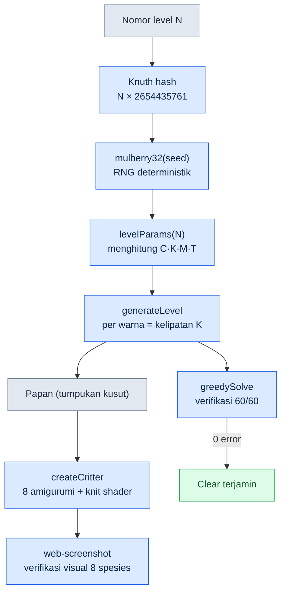

# Bagian 23 · Bab 4. Game Puzzle yang Saya Buat Sendiri — Catatan Praktik Critter Sort

Suatu Sabtu sore, istri saya sedang memainkan puzzle pencocokan warna di ponselnya. Itu game bernama *Yarn Fever*, di mana benang kusut harus dipilah ke keranjang berwarna sama. Setiap kali satu babak selesai, ia menutupnya sambil berkata, "Sama lagi." Karena tidak ada pembaruan, ia cepat bosan.

Pikiran yang muncul saat itu sederhana. Loop itu punya daya kecanduan yang sudah terbukti, dan mekanismenya sendiri bukan objek hak cipta. Jika temanya saya ganti menjadi hewan, lalu level-levelnya saya cetak tanpa batas secara prosedural, masalah "sama lagi" itu hilang. Kalau dibuat sebagai HTML 3D yang langsung berjalan di browser dan dikerjakan sendiri, istri saya bahkan tidak perlu memasangnya di ponsel.

Masalahnya, saya bukan graphics engineer. Meski sudah 24 tahun jadi Game Designer, saya belum pernah menulis shader dengan Three.js. Maka bab ini adalah catatan nyata tentang "membuat satu game berjalan dalam beberapa hari, sendirian, bersama AI". Ini juga catatan tentang pemisahan: saya memakai alat yang sama dengan pekerjaan MMORPG perusahaan (selanjutnya Proyek A), tetapi tidak mencampurkan satu baris pun konten domainnya.

Game-nya benar-benar ada di repository `critter-sort/`, dan keputusan selama tiga hari tersimpan dalam git tag v0.1–v0.3. Ini bukan kasus yang diolah; saya mengutip repository itu apa adanya.

---

## 23.4.1 Merekayasa Balik Lewat Prompt — dan Kehilangan Ciri Khasnya

Hal pertama yang saya lakukan adalah membongkar game aslinya dengan kata-kata, lalu melemparkannya ke AI. Prompt pertamanya seperti ini.

> **Prompt (memulai v0.1):**
> "Saya ingin mengadaptasi loop inti dari puzzle kasual bernama Yarn Fever menjadi tema hewan, dibuat dengan Three.js + Vite. Loopnya begini: pilah gumpalan-warna yang kusut ke wadah berwarna sama, dan jika slot sementara terlampaui, game over. Jadikan hewan sebagai objek yang dipilah, jadi kalau tumpukan hewan kusut di-tap, hewannya dikirim ke sarang (nest) berwarna sama. Tulis logikanya sebagai state machine JS murni yang lepas dari Three.js supaya bisa diuji secara headless. Tambahkan juga level prosedural tanpa batas (berbasis seed)."

AI mengikutinya dengan setia. Ia memecah struktur folder menjadi `game/` (logika murni) dan `render/` (Three.js), menulis `state.js`·`rules.js`·`generator.js` lebih dulu, lalu menampilkan papan dengan placeholder kotak berwarna. Bukan beberapa hari, hanya dalam satu sesi v0.1 sudah berjalan.

Tetapi begitu saya memainkannya sendiri untuk diperlihatkan ke istri, ada yang terasa janggal. Game-nya telah berubah menjadi puzzle pencocokan biasa, di mana hewan-hewan melompat dari atas layar ke dalam keranjang. Sentuhan khas game aslinya hilang. Identitas *Yarn Fever* bukanlah "memilah", melainkan **sensasi menguraikan benang kusut dengan tangan** dan **tindakan memutar layar untuk memeriksa warna yang tertutup**. Dalam prompt, saya memipihkan semua itu menjadi sort biasa berupa "tap hewan lalu kirim ke sarang", dan AI hanya setia pada definisi yang saya berikan.

Inilah jebakan pertama dari rekayasa balik. Begitu game aslinya diringkas, ciri khasnya menguap. Sebab ringkasan menyisakan permukaan, bukan esensinya.

Di sini saya tegaskan satu hal. AI tidak memberi jawaban yang salah. Prompt sayalah yang salah. Maka siklus berikutnya bukan perbaikan kode, melainkan **koreksi definisi**.

---

## 23.4.2 Tulang Punggung — Siklus Koreksi yang Menghidupkan Kembali Rotasi dan Penguraian Benang

Tepat setelah melihat v0.1, saya menyatakan ulang intinya dalam dua kali koreksi. Koreksi pertama membidik tindakan, koreksi kedua membidik sensasi.

> **Prompt (koreksi 1 — tindakan):**
> "Ini cuma jadi puzzle pencocokan. Identitas Yarn Fever itu 'memutar layar 3D untuk memeriksa warna yang tertutup, lalu menentukan urutan menguraikannya'. Jangan sebarkan papan di bidang datar, tapi tumpuk jadi gundukan tinggi di tengah, supaya warna yang tertutup di belakang baru terlihat kalau diputar. Tambahkan rotasi dengan OrbitControls. Tapi kan rotasi dan tap jadi bentrok — bagaimana cara memisahkannya?"

> **Keluaran Claude (mentah, tanpa diringkas):**
> "Benar. Gestur rotasi dan tap memakai pointer event yang sama sehingga bentrok. Saya usulkan memisahkannya lewat ambang jarak dan waktu. Pada `pointerdown` saya catat koordinat dan waktunya, lalu pada `pointerup` jika jarak gerak melampaui 9px atau durasi tekan melampaui 400ms, itu dianggap gestur rotasi sehingga tap diabaikan. Hanya di bawah ambang itulah raycaster memungut hewan dan memanggil `state.tap()`. Azimuth OrbitControls akan saya batasi sekitar ±54° agar tumpukan tidak keluar dari layar. Namun di mobile, 9px bisa terlalu sensitif, jadi perlu dicek di perangkat nyata."

Ambang 9px/400ms itu sampai sekarang masih hidup apa adanya di `src/main.js`. Kode yang ringkas, tanpa kelebihan, dan bisa diverifikasi langsung.

```javascript
// src/main.js — drag=rotasi(OrbitControls) / tap singkat=urai benang
canvas.addEventListener('pointerup', (ev) => {
  if (!down || state.status !== 'playing') { down = null; return }
  const dist = Math.hypot(ev.clientX - down.x, ev.clientY - down.y)
  const dt = performance.now() - down.t
  down = null
  if (dist > 9 || dt > 400) return // dianggap gestur rotasi
  const rect = canvas.getBoundingClientRect()
  const x = ((ev.clientX - rect.left) / rect.width) * 2 - 1
  const y = -((ev.clientY - rect.top) / rect.height) * 2 + 1
  const id = view.pick(x, y, camera)
  if (id !== null) state.tap(id)
})
```

Tindakan itu kembali. Tetapi saat saya memainkannya untuk kedua kali, sensasi "menguraikan benang" masih belum ada. Hewannya hanya berpindah ke sarang, tanpa sensasi terurai di tangan. Koreksi kedua.

> **Prompt (koreksi 2 — sensasi):**
> "Rotasinya sudah lebih baik. Tapi belum ada rasa 'menguraikan benang'. Kalau di-tap, buat untaian benang kusut yang melilit tubuh hewan terurai lalu menghilang, dan tambahkan efek benang itu menggulung masuk ke keranjang. Tampilan hewannya juga jangan burung GLB yang mulus, tapi boneka rajut gembul (amigurumi). Detail cozy seperti mata mengantuk dan rona pipi. Kalau aset eksternal tidak cocok, buang saja dan bikin secara prosedural pun boleh."

> **Keluaran Claude (mentah):**
> "Akan saya implementasikan dengan memisahkan dua hal. (1) Benang kusut: pada tiap tubuh hewan saya lilitkan 2 untai `TorusGeometry` berwarna sama yang sedikit lebih gelap, lalu saat di-tap, scale-nya saya kecilkan ke 0.01 supaya terurai dan menghilang. (2) Gulungan benang: dengan `TubeGeometry` saya gambar benang sepanjang jalur hewan→keranjang, lalu tween-nya menggulung masuk ke arah keranjang. Tampilan boneka akan saya buat secara prosedural — pada `MeshStandardMaterial` saya bangkitkan tekstur knit bump secara prosedural untuk memberi tekstur rajut, mata mengantuk dengan box pipih, dan rona pipi dengan sphere pink semitransparan. Starter GLB yang ada (3 jenis burung) tidak cocok dengan nada rajut sehingga saya hapus, tetapi pipeline pemuatan pack hewan akan saya pertahankan sebagai fallback. Satu catatan: hewan yang dibangkitkan secara prosedural keragaman spesiesnya tidak sebaik GLB — lebih aman memverifikasi dengan satu spesies dulu, baru menambah jumlah spesies."

Peringatan terakhir itu ("keragaman spesies tidak sebaik GLB" — GLB adalah glTF Binary, format file model 3D jadi yang diunduh dan dipakai dari luar) justru menjadi benih yang mengarah ke v0.3. AI menyebut lebih dulu keterbatasan berikutnya, dan saya menerimanya sebagai milestone berikutnya.

Verifikasi selalu dua tahap. Pertama secara headless apakah logikanya tidak rusak (0 error), lalu di browser saya rasakan sendiri lewat rotasi dan tap. Verifikasi itu terkunci jadi aturan di pesan commit v0.2. "Verifikasi headless: rotasi·penguraian benang·auto-clear normal, 0 error."

Dua untai benang kusut itu sekarang tersisa seperti ini di `src/render/pieces.js`.

```javascript
// src/render/pieces.js — 2 untai benang longgar melilit tubuh (berwarna sama yang sedikit lebih gelap)
const strandMat = new THREE.MeshStandardMaterial({ color: darken(hex, 0.7), roughness: 1 })
const strands = []
const orient = [[0.5, 0.2, 0.0], [1.25, 0.0, 0.6]]
for (let i = 0; i < 2; i++) {
  const s = addMesh(g, G.torus, strandMat, [0, byo + 0.02, 0], Math.max(bx, bz) + 0.02, orient[i])
  strands.push(s)
}
g.userData.strands = strands  // saat di-tap, view.js menguraikan untaian ini hingga menghilang
```

Pelajaran yang saya dapat di sini saya tinggalkan dalam satu baris.

- Rekayasa balik akan mematikan ciri khas jika diringkas.
- Jika definisinya salah, yang diperbaiki adalah definisinya, bukan kodenya.
- Keterbatasan berikutnya yang disebut AI adalah milestone berikutnya.

---

## 23.4.3 Riwayat Keputusan Selama Tiga Hari — Membaca Koreksi Lewat Git Tag

Kalau hanya diceritakan, kesannya "dikoreksi dua kali", tetapi riwayat git mencatat persis kapan dan dalam bentuk apa koreksi itu masuk, lengkap dengan waktunya. Inilah yang menggantikan retrospektif dalam pengembangan solo. Tanpa rekan kerja pun, commit menjadi saksi "kenapa jadinya seperti ini".

| Commit | Waktu (2026-05-30) | Apa yang berubah | Status ciri khas |
|---|---|---|---|
| `2b2e3bc` v0.1 | 14:43 | Rekayasa balik Yarn Fever, logika murni + placeholder, solver lolos 60/60 | Hilang (memipih jadi sort biasa) |
| `70a0117` v0.2 | 15:11 | Rotasi (OrbitControls ±54°) + pemisahan tap/drag + penguraian benang + amigurumi | Dipulihkan (definisi inti diperbarui) |
| `160663c` snapshot | 15:31 | Snapshot galeri v0.2 5 frame + galeri README | — |
| `59b0baf` v0.3 | 15:55 | 8 amigurumi prosedural + palet candy yang vivid | Diperkuat (keragaman spesies terjamin) |
| `c5b9a1b` serah terima | 16:20 | Pointer serah terima sesi NEXT_SESSION | — |

Isi pesan commit v0.2 mengunci keputusannya sendiri jadi aturan. "Membenahi identitas game dari 'hewan melompat' menjadi 'memutar layar lalu menguraikan benang kusut yang lucu (boneka rajut) ke keranjang berwarna sama'." Inilah catatan tentang identitas sebuah game yang sempat mati lalu hidup kembali hanya dalam rentang satu setengah jam.

Satu detail yang patut diperhatikan. Kalau melihat `git show --stat` v0.2, 3 jenis burung starter GLB (Flamingo·Parrot·Stork) terhapus seluruhnya. Alasannya, "art-nya tidak cocok dengan nada rajut". Bukan karena aset gratis eksternal itu gratis lalu semuanya dipakai, melainkan keputusan untuk menghapus jika nadanya tidak cocok. Ini adalah gerbang estetika yang dibuat oleh manusia, bukan AI.

```
public/assets/animals/pack_starter/Flamingo.glb  | Bin 77428 -> 0 bytes
public/assets/animals/pack_starter/Parrot.glb    | Bin 97024 -> 0 bytes
public/assets/animals/pack_starter/Stork.glb     | Bin 76852 -> 0 bytes
```

---

## 23.4.4 Bukti Nyata Procedural Generation — 8 Amigurumi dan Level Tanpa Batas

Pekerjaan rumah yang ditinggalkan v0.2 adalah "hewan prosedural keragaman spesiesnya tidak sebaik GLB". Di v0.3 hal itu saya pecahkan. Tanpa menambah satu pun aset eksternal, saya mencetak 8 spesies hewan dengan kode.

Intinya ada pada tabel `SPECIES` di `src/render/pieces.js`. Untuk tiap spesies saya mendefinisikan rasio tubuh·kepala·tipe telinga·moncong·bentuk mata sebagai parameter, dan satu fungsi membaca parameter itu untuk merakit mesh.

```javascript
// src/render/pieces.js — parameter siluet per spesies
const SPECIES = {
  cat:      { body: [0.5,0.46,0.48,0.04], ears: 'cat',   snout: 0.13, tail: 'cat',  eyes: 'sleepy' },
  bear:     { body: [0.52,0.5,0.5,0.03],  ears: 'bear',  snout: 0.16, tail: 'none', eyes: 'round' },
  bunny:    { body: [0.46,0.5,0.46,0.02], ears: 'bunny', snout: 0.12, tail: 'puff', eyes: 'round' },
  fox:      { body: [0.5,0.44,0.48,0.04], ears: 'fox',   snout: 0.2,  tail: 'fox',  eyes: 'sleepy' },
  capybara: { body: [0.58,0.5,0.56,0.02], ears: 'tiny',  snout: 0.22, tail: 'none', eyes: 'sleepy' },
  pig:      { body: [0.54,0.5,0.52,0.03], ears: 'pig',   snout: 0.1,  nose: true,   eyes: 'round' },
  frog:     { body: [0.56,0.4,0.54,0.05], ears: 'none',  snout: 0.1,  topEyes: true, eyes: 'none' },
  chick:    { body: [0.42,0.44,0.42,0.05], ears: 'none', beak: true,  tail: 'none', eyes: 'round' },
}
export const SPECIES_IDS = Object.keys(SPECIES)  // 8 spesies
```

Bentuk telinga saja sudah memisahkan siluet. Kucing dan rubah pakai cone runcing, beruang pakai sphere bulat, kelinci pakai sphere memanjang, babi pakai cone yang menekuk ke depan. Katak punya mata yang menonjol di atas kepala (`topEyes`), anak ayam punya paruh (`beak`). Cabang-cabang kecil inilah yang membentuk keterbedaan 8 spesies. Aset eksternal 0, kode satu file.

Namun procedural generation punya jebakan. Apakah kode yang "tampak meyakinkan" benar-benar menghasilkan 8 spesies yang bisa dibedakan, itu tidak diketahui hanya dari membaca kode. Maka verifikasinya lagi-lagi dua tahap. Pertama secara headless apakah 8 spesies terbangkit tanpa error, lalu dengan skill web-screenshot (headless Chrome) saya tangkap render aslinya untuk memastikan dengan mata bahwa 8 spesies dapat dibedakan. Hasilnya ada di DEVLOG v0.3. "Siluet dibedakan lewat telinga/moncong/hidung/paruh/ekor/mata. Aset eksternal 0, nada rajut benar-benar seragam."

### Satu Seed Menentukan Seluruh Papan

Ketakterbatasan level ditanggung oleh seed RNG. `generator.js` menjadikan nomor level sebagai seed lewat Knuth multiplicative hash, lalu menarik bilangan acak deterministik dengan `mulberry32`. Nomor level yang sama selalu menghasilkan papan yang sama.

```javascript
// src/game/generator.js
export function generateLevel(level, animalPool = null) {
  const seed = (level * 2654435761) >>> 0  // Knuth multiplicative hash
  const rng = makeRng(seed)
  const { C, K, groupsPerColor, M, T } = levelParams(level)
  const colors = rng.shuffle(COLORS).slice(0, C)
  // ...
  for (const color of colors) {
    const count = K * groupsPerColor  // selalu kelipatan K → terurai pas ke sarang (solusi terjamin)
    // ...
  }
}
```

Satu baris di sini menjamin keadilan game. Karena jumlah hewan per warna saya paksa **selalu kelipatan K (jumlah hewan untuk menyelesaikan sarang, yaitu 3)**, papan apa pun akan terbagi habis dengan pas ke sarang. Level yang tidak bisa diselesaikan mustahil muncul sejak akarnya.

### Apakah 60 Level Semuanya Bisa Diselesaikan — greedySolve

Bahwa secara desain dapat diselesaikan bukanlah bukti. Saya memasukkan greedy solver untuk verifikasi ke `rules.js`, lalu dengan `test-logic.mjs` saya mainkan 60 level secara otomatis untuk memastikan setiap kali bahwa semuanya benar-benar bisa di-clear. Ini keluaran terukur yang baru saja saya jalankan ulang saat menulis bab ini.

```
$ node scripts/test-logic.mjs
[solver] 60/60 level clear

[kurva kesulitan] (C=warna, K=penyelesaian, groups, M=sarang, T=tray, total ekor)
  Lv 1: C=3 K=3 grp=2 M=3 T=7 total=18
  Lv 8: C=4 K=3 grp=3 M=4 T=6 total=36
  Lv12: C=5 K=3 grp=3 M=4 T=5 total=45
  Lv20: C=5 K=3 grp=3 M=4 T=4 total=45

[main asal-asalan] tingkat kalah saat tap acak (memastikan kesulitan ada)
  Lv 1: tingkat kalah acak 0%
  Lv12: tingkat kalah acak 1%
  Lv20: tingkat kalah acak 3%
```

Tes ini membuktikan dua hal sekaligus. Bahwa greedy solver menuntaskan 60/60 berarti **semua level dapat diselesaikan** (kesulitannya tidak mustahil), dan bahwa tingkat kalah dari tap acak naik dari 0%→3% seiring level meningkat berarti **kesulitan itu nyata** (kalau ditekan asal-asalan pun semuanya beres, itu bukan game). Kurva kesulitan, saat tray menyempit dari 7 petak menjadi 4 petak, terukur lewat tingkat kalah.

Di sini saya tegaskan secara jujur. Tingkat kalah acak 3% adalah tingkat kalah "bot yang menekan asal", bukan kesulitan yang dirasakan manusia. Manusia memeriksa warna lebih dulu dengan memutar, jadi tingkat kalahnya lebih rendah. Angka ini adalah bukti arah bahwa "kesulitan bukan 0", bukan berarti istri saya kalah dengan peluang 3%. Kesulitan yang dirasakan manusia pada titik v0.3 masih belum terukur, dan saya tinggalkan di NEXT_SESSION sebagai "mengumpulkan umpan balik permainan istri (prioritas utama)".

### Pipeline Procedural Generation



Alur yang bermula dari seed lalu bercabang ke parameter·papan·mesh·verifikasi inilah jawaban yang secara struktural memecahkan masalah awal, yaitu "bosan karena tidak ada pembaruan".

---

## 23.4.5 Bagaimana Kalau GLB Masuk? — Auto-Scale dan Fallback

8 hewan prosedural adalah fallback ketika GLB tidak ada. Supaya nanti, kalau saya benar-benar mendapatkan GLB amigurumi, GLB itu dipakai lebih dulu, saya mempertahankan pipeline pack hewan. Cukup jatuhkan GLB ke folder dan jalankan `npm run scan`, selesai.

Masalahnya, ukuran tiap GLB berbeda-beda. Ada model yang 0.5 unit, ada yang 200 unit. Kalau scale disesuaikan dengan tangan, menambah pack hewan jadi pekerjaan kasar. Maka `scan-packs.mjs` membaca bounding box GLB lalu menghitung otomatis scale yang sesuai dengan tinggi target (0.95 unit).

```javascript
// scripts/scan-packs.mjs — menghitung scale/yOffset otomatis dari bounding box GLB
const maxDim = Math.max(max[0]-min[0], max[1]-min[1], max[2]-min[2])
const scale = +(TARGET_H / maxDim).toPrecision(3)        // TARGET_H = 0.95
const yOffset = +(-((min[1] + max[1]) / 2) * scale).toPrecision(3)
```

Lalu `assets.js` diam-diam jatuh ke hewan prosedural jika packs.json tidak ada atau gagal dimuat.

```javascript
// src/render/assets.js
createAnimal(species, hex) {
  const entry = this.models.get(species)
  if (!entry) return createCritter(hex, species)  // fallback amigurumi prosedural
  // ... klon GLB + pewarnaan
}
```

Dua baris ini menjamin "kalau ada GLB pakai GLB, kalau tidak ada pakai hewan kode" tanpa terputus. Sekalipun saya menjatuhkan pack GLB baru saat istri sedang bermain, game-nya tidak berhenti.

---

## 23.4.6 Sendirian tetapi Seperti Tim — Bagaimana Saya Memakai AI

Dalam proyek ini saya hanya satu Game Designer, tetapi pekerjaannya berjalan dalam berbagai peran. AI mengisi peran-peran itu. Intinya bukan "menuliskan kode sebagai pengganti saya", melainkan **mengisi titik-titik kelemahan saya**.

| Titik lemah saya | Apa yang AI lakukan | Gerbang yang dijaga manusia (saya) |
|---|---|---|
| Shader Three.js | Tekstur prosedural knit bump, efek benang TubeGeometry | Apakah nadanya cocok (keputusan menghapus 3 jenis burung GLB) |
| Resolusi konflik input | Usulan ambang 9px/400ms | Konfirmasi rasa di perangkat mobile nyata |
| Keamanan regresi | Verifikasi otomatis 60/60 dengan greedySolve | "Kesulitan itu nyata" didefinisikan oleh manusia |
| Prediksi keterbatasan berikutnya | Peringatan "hewan prosedural keragaman spesiesnya lemah" | Menerimanya sebagai milestone v0.3 |

Khususnya, verifikasi visual adalah mata rantai lemah dalam pengembangan solo. Kode yang berjalan dan "8 spesies yang terlihat berbeda di mata" adalah dua masalah berbeda. Maka skill web-screenshot (menyalakan dev server dengan headless Chrome untuk mengambil screenshot + melaporkan error konsol) saya pinjam apa adanya dari pekerjaan kantor. Tanpa ekstensi claude-in-chrome pun saya bisa memeriksa dengan mata render pada viewport mobile (iPhone 15 Pro potret, 393×852).

Di sinilah prinsip terpenting bekerja. **Alat dipinjam dari kantor, tetapi konten domain dipinjam 0 butir.**

- Yang dipinjam: pola verifikasi web-screenshot, disiplin pesan commit git, kebiasaan tes logika headless, hook injeksi JIT atom.
- Yang tidak dipinjam: pertarungan·skill·worldview·sheet data Proyek A — tidak satu baris pun.

Pemisahan ini terverifikasi dengan grep. Pada catatan memori tertinggal "konten domain proyek perusahaan dipinjam 0 butir (grep verifikasi PASS)". Warna Critter Sort adalah pink·mint·kuning, dan hewannya adalah kucing·beruang·kelinci. Kosakata domain Proyek A (MMORPG perusahaan) tidak ada di mana pun dalam repository ini.

Mengapa harus memisahkan sejauh ini? Untuk mencegah dua kecelakaan sekaligus. Kecelakaan hukum berupa IP perusahaan bocor ke hobi pribadi, dan pencemaran konteks berupa atom domain MMORPG yang salah terinjeksi ke pekerjaan puzzle hingga menjadi noise. Hanya alat yang mengalir, sementara konten dibendung — di antara keduanya itulah letak pemisahan yang sehat.

---

## 23.4.7 Penutup — Sistem Tetap Bekerja Meski Sendirian

Critter Sort adalah game kecil. Tiga hari, 5 commit, 8 spesies hewan, 60 level. Namun cara yang saya pakai di kantor tetap bekerja sama persis bahkan pada skala 1/1000.

- Rekayasa balik harus menjaga ciri khasnya.
- Jika definisinya salah, perbaiki definisinya.
- Verifikasi dalam dua tahap: headless + mata.

Pelajaran terbesar adalah kegagalan di subbab pertama. Pada v0.1 identitas game sempat saya matikan sekali, lalu saya hidupkan kembali lewat dua kali koreksi. Dalam pengembangan solo tanpa rekan kerja, yang menjadi saksi kematian dan kebangkitan itu adalah commit git. Andai tidak ada retrospektif, saya pasti lupa "kenapa di v0.2 semuanya dirombak?" sebulan kemudian.

Di Bagian 24 berikutnya saya membahas bagaimana riwayat keputusan semacam ini dikukuhkan menjadi tata kelola di tim besar dan operasi jangka panjang.

Bab ini adalah catatan yang bermula dari puzzle yang ditutup istri saya karena bosan, hingga game buatan sendiri kembali sampai ke tangannya. Saya memastikan bahwa sistem adalah soal disiplin, bukan skala.

---

## Coba Sendiri — Satu Langkah yang Bisa Anda Lakukan Hari Ini

Ini adalah langkah untuk menjalankan loop inti dari satu game kasual favorit bersama AI. Namun, tanpa kehilangan ciri khasnya.

**setup** — Pada lingkungan yang sudah terpasang Node, buatlah satu folder kosong. `mkdir my-puzzle && cd my-puzzle`.

**prompt** — Lemparkan ini ke AI. Intinya adalah "jangan meringkas, tapi nyatakan ciri khasnya".

> "Saya ingin mengadaptasi loop inti dari [nama game] menjadi [tema]. Ciri khas game ini adalah [tuliskan sensasinya dalam satu baris — misalnya: 'sensasi memutar layar untuk memeriksa yang tertutup lalu menguraikannya']. Jangan sekali-kali memipihkannya menjadi puzzle pencocokan biasa. Tulis logikanya terpisah dari render supaya bisa diuji secara headless."

**verify** — Mainkan sendiri hasil pertamanya. Tanyakan, "Apakah ciri khas yang saya tulis masih hidup?" Kalau tidak, **tulis ulang definisinya** lalu minta lagi, bukan memperbaiki kode. Itulah yang saya lakukan di v0.1→v0.2.

### Versi Ringkas untuk Pembaca Solo·Hobi

Anda tidak perlu engine maupun procedural generation. Tulis "satu baris ciri khas game ini" di selembar kertas, suruh AI membuat prototipenya, lalu mainkan sendiri dan cukup cek apakah satu baris itu hidup. Kalau mati, tulis ulang satu baris itu dengan lebih konkret. Kebiasaan menjaga satu baris ciri khas, hanya itu saja sudah cukup untuk menghindari jebakan pertama dari rekayasa balik.
