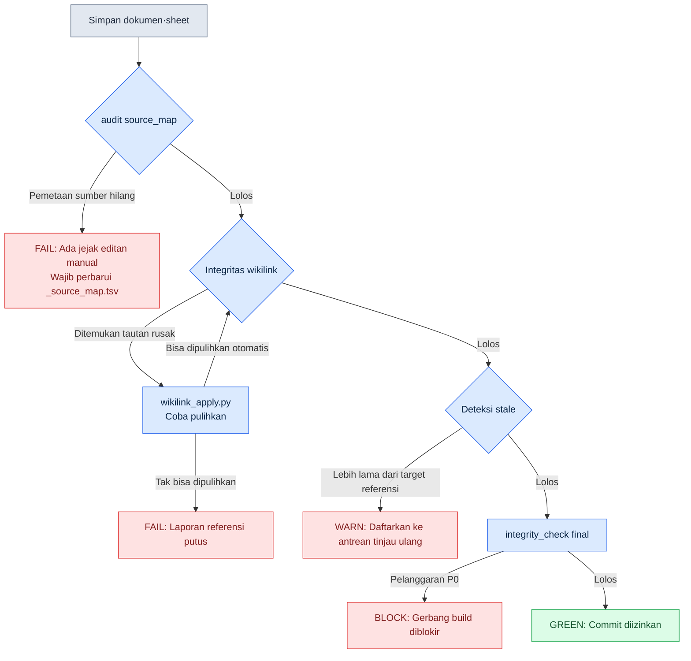

# 24.1 Sistem Verifikasi — Menangkap Konsistensi, Tautan, dan Stale dengan Kode

Senin pagi, tepat setelah stand-up, anggota tim A dari tim data mengirimi saya sebuah tangkapan layar lewat messenger. Itu adalah laporan QA: deskripsi salah satu item material di toko dalam game kosong. Setelah menelusuri penyebabnya selama 30 menit, akar masalahnya terungkap. Dua minggu sebelumnya seseorang mengganti nama item itu di dokumen desain menjadi `재료_목재_상`, tetapi referensi di sheet data masih menunjuk ke nama lama `재료_목재_A`. Dokumennya diperbarui, sheet-nya tidak, dan tautan yang menghubungkan keduanya putus diam-diam. Tidak ada satu orang pun yang berbohong, tetapi game tetap menampilkan informasi yang salah.

Insiden seperti ini menjadi makin sering secara eksponensial seiring bertambahnya dokumen. Mata manusia tidak bisa mengamati referensi silang dari 50 dokumen secara bersamaan. Karena itu, verifikasi kita delegasikan ke kode. Bab ini membahas sistem yang membuat konsistensi antara dokumen, data, dan tautan diperiksa oleh skrip, bukan oleh manusia. Intinya ada tiga — konsistensi sumber (audit `_source_map.tsv`), integritas tautan (wikilink), dan deteksi stale (menangkap referensi yang sudah usang dan membusuk).

---

## 24.1.1 Mengapa Tautan yang Putus Itu Senyap

Dokumen dan data hidup dengan saling menunjuk satu sama lain. GDD merujuk ke enum, enum merujuk ke sheet data, dan sheet kembali merujuk ke keputusan di GDD lain. Jika jaring ini dikelola manusia dengan tangan, setiap kali satu node berubah, manusia harus mengingat dan menelusuri semua referensi yang menunjuk ke node itu. Ingatan akan gagal.

Alasan tautan yang putus berbahaya adalah karena ia **tidak melemparkan error**. Dalam kode, ketika sebuah variabel yang tidak ada dirujuk, kompiler akan menghentikannya. Namun wikilink yang ditulis `[[재료_목재_A]]` di dokumen akan tetap tinggal sebagai teks biasa meskipun targetnya hilang. Ia tidak berubah merah. Game di-build, dirilis, dan baru setelah pengguna melihat deskripsi kosong itu, barulah ada yang menyadarinya.

Karena itu, tugas pertama sistem verifikasi adalah **membuat yang tak terlihat mata manusia menjadi terlihat**. Tarik pelanggaran konsistensi ke dalam keluaran teks, lalu ikat keluaran itu ke gerbang build; dengan begitu, sekalipun manusia lupa, skrip tidak akan lupa.

---

## 24.1.2 Cascade Verifikasi Tiga Cabang

Verifikasi bukan satu kesatuan, melainkan bertahap. Pertama jalankan pemeriksaan paling murah untuk menyaring pelanggaran yang nyata, lalu hanya yang lolos diteruskan ke tahap berikutnya. Jika pemeriksaan yang mahal dijalankan pada semua input, prosesnya lambat sehingga tidak ada yang mau menjalankannya. Berikut adalah alur verifikasi yang saya jalankan.



Inti dari cascade ini adalah **semakin cepat gagal, semakin murah**. `audit source_map` hanya membandingkan satu baris TSV, jadi selesai dalam satuan milidetik. Sebaliknya, `integrity_check` yang paling akhir memuat seluruh sheet data lalu memeriksa relasi FK, sehingga butuh beberapa detik. Jika pemeriksaan murah ditaruh di depan, kesalahan yang nyata akan terpotong di situ, dan pemeriksaan mahal hanya berjalan pada sedikit input yang lolos.

Bahwa keluaran tiap tahap berbeda juga penting. `audit` menghasilkan FAIL (bukti bahwa editor menyentuh sesuatu dengan tangan), `wikilink` FAIL setelah pemulihan otomatis, `stale` WARN (bukan blokir tetapi perlu ditinjau ulang), dan `integrity_check` BLOCK (menghentikan build itu sendiri). Untuk "masalah" yang sama pun, sistem harus bereaksi berbeda menurut tingkat keparahannya, agar manusia bisa membedakan sinyal dari derau.

---

## 24.1.3 Tahap Pertama — Audit `_source_map.tsv`

Pemeriksaan yang paling dulu berjalan adalah konsistensi sumber. Pipeline pembuatan dokumen saya mencatat di `_source_map.tsv` dari berkas sumber mana sebuah dokumen hasil sintesis (misalnya isi GDD) berasal. Satu baris memaku silsilah (lineage) yang menyatakan "bagian hasil ini = sintesis dari berkas-berkas sumber ini".

Alasan ini menjadi alat verifikasi adalah karena **jika manusia mengedit hasil dengan tangan, pemetaannya jadi rusak**. Kalau ada orang yang langsung mengubah bagian GDD yang dibangkitkan otomatis, bagian itu tidak lagi menjadi sintesis setia dari berkas sumber. Skrip audit membandingkan hash tiap bagian hasil dengan hash hasil sintesis ulang dari sumbernya, dan jika tidak cocok, ia mengeluarkan FAIL. Aturan "audit FAIL saat ada editan manual" lahir dari sini.

Ini bukan untuk menghalangi suntingan manusia, melainkan untuk **membuat suntingan menjadi eksplisit**. Jika hasilnya harus diperbaiki, sinyalnya adalah: lakukan salah satu dari dua hal — perbaiki sumbernya lalu bangkitkan ulang, atau lepaskan bagian itu dari pemetaan secara resmi (deklarasi pemisahan). Membuat suntingan yang senyap menjadi berisik, itulah tugas audit.

---

## 24.1.4 Tahap Kedua — Integritas Wikilink dan Pemulihan Mandiri

Setelah lolos audit, kita beralih ke pemeriksaan tautan. Dokumen saya menghubungkan node dengan wikilink gaya Obsidian `[[대상]]`. `wikilink_apply.py` melakukan dua hal — menerjemahkan wikilink menjadi jalur nyata lalu menerapkannya, dan memulihkan tautan rusak sejauh yang memungkinkan.

Kasus yang bisa dipulihkan itu jelas. Yaitu ketika node target **hanya berganti nama tetapi tetap ada di tempat yang sama**. Penggantian nama seperti `재료_목재_A` → `재료_목재_상` di atas akan dikoreksi otomatis oleh skrip dari nama lama ke nama baru, asalkan peta alias (alias map) sudah diperbarui. Sebaliknya, jika target dihapus seluruhnya atau tak bisa dilacak ke mana perginya, pemulihan dibatalkan dan referensi yang putus dilaporkan.

Di sini ada satu keputusan desain. **Jika pemulihan otomatis dilakukan terlalu agresif, itu berbahaya.** Kalau skrip mencari "nama yang mirip" lalu menyambungkannya sembarangan, tautan bisa salah tersambung ke node bermakna lain dan menimbulkan insiden yang lebih buruk. Karena itu, pemulihan pada `wikilink_apply.py` bersifat konservatif — hanya penggantian nama yang punya peta alias eksplisit yang dikoreksi otomatis, sedangkan kasus yang butuh tebakan diserahkan ke manusia. Keutamaan otomasi terletak pada kesederhanaan menahan diri: hanya mengotomatiskan yang pasti, dan dengan jujur menyerahkan yang ambigu kepada manusia.

---

## 24.1.5 Tahap Ketiga — Deteksi Stale

Sekalipun tautan masih hidup, **referensinya bisa saja sudah usang.** Dokumen A merujuk ke sheet data B, tetapi jika B diperbarui lebih belakangan daripada A, deskripsi A berkemungkinan tidak sesuai dengan B yang sekarang. Tautannya sendiri baik-baik saja, karena target yang ditunjuk memang ada. Namun isinya sudah membusuk.

Deteksi stale membandingkan waktu modifikasi (atau versi hash konten) kedua sisi referensi. Jika sisi yang merujuk lebih lama daripada target referensi, ia memunculkan WARN dan mendaftarkan node itu ke antrean tinjau ulang. Alasannya WARN dan bukan BLOCK adalah karena pembaruan tidak selalu berarti benturan isi. Kalau pembaruannya cuma memperbaiki satu salah ketik, referensinya baik-baik saja. Karena itu, stale bukanlah "yang menghalangi", melainkan "yang menandai agar dilihat kembali".

Mari kita lihat bagaimana tahap ini menangkap insiden tautan putus tadi. Andai sheet `재료_목재` diperbarui lebih belakangan daripada dokumen, WARN stale sudah muncul lebih dulu sebelum pemulihan otomatis. Artinya, ketiga pemeriksaan itu adalah **jaring pengaman yang saling tumpang tindih**. Apa yang lolos dari satu jaring akan ditangkap jaring berikutnya. Inilah alasan cascade bisa menangkap insiden yang tak tertangkap oleh pemeriksaan tunggal.

---

## 24.1.6 Worked Transcript — Menyuruh Claude Membuat Skrip Pemeriksa

Kalau manusia menyusun seluruh logika verifikasi dari nol, ia akan kelelahan. Saya menulis aturan pemeriksaan dalam bahasa alami, lalu meminta draf skrip eksekusinya kepada AI. Berikut adalah sesi nyata saat saya membuat skrip deteksi stale. Keluarannya tidak saya poles; proses kegagalan dan penolakan saya biarkan apa adanya.

**[Prompt lengkap]**

> Markdown-markdown di folder dokumen saling terhubung lewat wikilink `[[대상]]`. Buatkan skrip Python yang memeriksa apakah tiap dokumen lebih lama diperbaruinya (=stale) dibanding berkas target yang dirujuknya. Syaratnya:
> - Waktu modifikasi berkas berdasarkan waktu commit terakhir git (mtime filesystem tidak bisa dipercaya karena diperbarui saat checkout)
> - Tautan putus (target tidak ada) dikeluarkan dari pemeriksaan stale dan dilaporkan terpisah
> - Keluaran berupa TSV: `source<TAB>target<TAB>status` (status = OK / STALE / BROKEN)
> - WARN bersifat non-pemblokir, kode keluar tetap 0 (tidak boleh menghalangi build)

**[Keluaran mentah Claude — putaran 1]**

> Skrip di bawah memperoleh waktu commit terakhir tiap berkas dengan `git log -1 --format=%ct <file>`, lalu mengekstrak wikilink dengan ekspresi reguler `\[\[([^\]]+)\]\]` untuk dibandingkan.
>
> ```python
> import subprocess, re, sys, pathlib
>
> def git_mtime(path):
>     out = subprocess.run(
>         ["git", "log", "-1", "--format=%ct", str(path)],
>         capture_output=True, text=True)
>     return int(out.stdout.strip())
>
> def resolve(link, root):
>     # [[대상]] -> root/대상.md
>     return root / f"{link}.md"
>
> root = pathlib.Path(sys.argv[1])
> for md in root.glob("*.md"):
>     src_t = git_mtime(md)
>     for link in re.findall(r"\[\[([^\]]+)\]\]", md.read_text(encoding="utf-8")):
>         tgt = resolve(link, root)
>         if not tgt.exists():
>             print(f"{md.name}\t{link}\tBROKEN")
>             continue
>         tgt_t = git_mtime(tgt)
>         status = "STALE" if src_t < tgt_t else "OK"
>         print(f"{md.name}\t{link}\t{status}")
> ```
>
> Dengan cara ini, keluarannya akan sesuai format TSV yang Anda minta.

**[Verifikasi manusia / penolakan]**

Saya berhenti di sini. Tampak tiga cacat.

Pertama, jika `git_mtime` mengembalikan string kosong, `int("")` akan meledak. Itu terjadi pada berkas baru yang belum pernah di-commit. Kedua, `glob("*.md")` tidak melihat subfolder. Dokumen saya tersebar di bawah `part*/`. Ketiga — dan ini yang paling penting — pada wikilink kadang menempel alias pipa seperti `[[대상|표시이름]]`, dan kode putaran pertama salah menganggap seluruh `대상|표시이름` sebagai nama berkas. Akibatnya, tautan yang baik-baik saja semuanya tertangkap sebagai BROKEN. Kalau dipakai apa adanya, itu bom alarm palsu.

Saya menunjuk ketiga hal ini dan meminta ulang.

**[Permintaan ulang]**

> Perbaiki tiga hal: (1) Untuk berkas yang belum di-commit, git_mtime mengembalikan None; dalam kasus ini tahan keputusan STALE dan beri status=UNTRACKED. (2) Jangan pakai glob, pakai rglob agar subfolder ikut tercakup. (3) Tangani pipa `[[대상|별칭]]` — gunakan hanya bagian sebelum `|` sebagai target. Dan kode keluar tetap 0 meskipun ada BROKEN (prinsip WARN non-pemblokir).

**[Keluaran mentah Claude — putaran 2]**

> ```python
> import subprocess, re, sys, pathlib
>
> def git_mtime(path):
>     out = subprocess.run(
>         ["git", "log", "-1", "--format=%ct", str(path)],
>         capture_output=True, text=True)
>     s = out.stdout.strip()
>     return int(s) if s else None   # Tidak ada riwayat commit -> None
>
> def target_name(link):
>     return link.split("|", 1)[0].strip()   # [[대상|별칭]] -> 대상
>
> root = pathlib.Path(sys.argv[1])
> for md in root.rglob("*.md"):
>     src_t = git_mtime(md)
>     text = md.read_text(encoding="utf-8")
>     for raw in re.findall(r"\[\[([^\]]+)\]\]", text):
>         name = target_name(raw)
>         hits = list(root.rglob(f"{name}.md"))
>         if not hits:
>             print(f"{md.name}\t{name}\tBROKEN")
>             continue
>         tgt_t = git_mtime(hits[0])
>         if src_t is None or tgt_t is None:
>             status = "UNTRACKED"
>         elif src_t < tgt_t:
>             status = "STALE"
>         else:
>             status = "OK"
>         print(f"{md.name}\t{name}\t{status}")
>
> sys.exit(0)   # WARN non-pemblokir: selalu 0
> ```

Keluaran putaran kedua ini saya terima. Hanya saja, ada satu hal yang sengaja saya tinggalkan sebagai keputusan manusia — jika `rglob(f"{name}.md")` menemukan berkas bernama sama di beberapa folder, ia hanya memakai `hits[0]`. Ini ambiguitas potensial, tetapi karena aturan penamaan berkas pada dokumen saya membuat nama berkas unik secara global, di praktik tidak terjadi benturan. Asumsi yang tidak ditunjuk AI ini saya terima secara sadar dan saya tinggalkan sebagai komentar. **Sekalipun kode itu ditulis oleh otomasi, asumsi yang menjadi sandaran kode itu adalah tanggung jawab manusia.**

---

## 24.1.7 Mengikat Hasil Pemeriksaan ke Gerbang Build

Punya skrip pun percuma kalau tidak ada yang menjalankannya. Desain terakhir verifikasi adalah **membuatnya tidak bisa tidak dijalankan**. Saya mengikat ketiga tahap ke hook pra-commit (pre-commit) atau ke pipeline build. Pelanggaran audit FAIL dan integrity_check P0 bersifat BLOCK sehingga menghalangi commit/build, sedangkan wikilink BROKEN dan stale bersifat WARN sehingga diloloskan tetapi meninggalkan laporan.

Dwi-jalur BLOCK/WARN inilah yang menentukan kelangsungan hidup sistem. Kalau semua dipasang sebagai BLOCK, satu stale sepele saja menghalangi commit, sehingga orang-orang mulai mengakali verifikasi itu sendiri. Verifikasi yang diakali sama dengan tidak ada verifikasi. Sebaliknya, kalau semua dibiarkan WARN, pelanggaran integritas data yang benar-benar harus dihalangi pun jadi lolos begitu saja. **Batas antara apa yang dihalangi dan apa yang sekadar ditandai itulah titik desain sejati dari sistem verifikasi.**

---

## 24.1.8 Pengukuran — Sebelum dan Sesudah Mengaktifkan Verifikasi Kode

Berikut adalah kecenderungan yang saya amati pada Proyek A di perusahaan pengembang MMORPG A yang saya jalankan, dengan tolok ukur dokumen sekitar 90 buah. Sebagian angka absolut adalah perkiraan penulis (belum terverifikasi); yang bermakna adalah trennya.

| Item | Era Tinjauan Manual | Cascade Verifikasi Kode |
|---|---|---|
| Waktu penemuan referensi putus | Setelah laporan pengguna·QA | Sebelum commit (arah: insiden → pencegahan) |
| Durasi sekali pemeriksaan konsistensi | Beberapa jam (perkiraan penulis) | Puluhan detik (pengukuran skrip) |
| Latensi tumpukan stale | Mengendap berminggu-minggu | WARN di commit berikutnya |
| Insiden pemulihan otomatis yang salah | Tidak ada | Tetap 0 berkat pemulihan konservatif |

Daripada mempercayai angka secara harfiah, saya menyarankan untuk hanya memercayai arahnya — bahwa "waktu penemuan tertarik maju dari pascakejadian ke prakejadian". Nilai sejati sistem verifikasi terletak bukan pada penghematan waktu, melainkan pada **perpindahan posisi: insiden tertangkap sebelum sampai ke pengguna**.

---

## 24.1.9 Kegagalan yang Lazim

| Pola | Resep |
|---|---|
| Memasang semua pelanggaran sebagai BLOCK sehingga orang mengakali verifikasi | Dwi-jalur BLOCK/WARN, blokir hanya untuk P0 integritas data |
| Pemulihan otomatis agresif sampai ke tebakan | Hanya penggantian nama dengan alias eksplisit yang otomatis, yang ambigu ke manusia |
| Hanya melihat tautan putus dan mengabaikan stale | Deteksi referensi usang terpisah dengan membandingkan waktu modifikasi |
| Membiarkan suntingan manual hasil secara senyap | Buat suntingan terlihat sebagai FAIL lewat audit source_map |
| Ada skrip tetapi tidak diikat ke hook | Hubungkan ke gerbang pre-commit·build, agar tidak bisa tidak dijalankan |

---

## Coba Sendiri — Satu Set Cascade Verifikasi Minimal

**setup.** Kelola folder dokumen dengan git (sebagai acuan perbandingan waktu commit). Seragamkan wikilink dengan notasi `[[대상]]` atau `[[대상|별칭]]`.

**prompt.** Berikan prompt lengkap dari transkrip di atas kepada AI apa adanya, tetapi jangan pernah memakai keluaran pertamanya langsung. Wajib verifikasi (1) penanganan berkas yang belum di-commit, (2) penelusuran subfolder, dan (3) parsing alias pipa — ketiga hal ini — lalu tolak dan minta ulang. Ini adalah titik yang hampir selalu dilewatkan AI pada putaran pertama.

**verify.** Jalankan skrip dan terima TSV-nya. Periksa dengan tangan 5 sampel apakah baris `BROKEN` itu benar-benar tautan putus. Jika muncul BROKEN palsu, berarti parsing alias/subfolder masih kurang. Begitu normalnya terkonfirmasi, ikat ke hook pre-commit, lalu cabangkan kode keluar: WARN (STALE/BROKEN) diloloskan dan BLOCK (P0 integritas data) dihalangi.

**Versi Ringkas Solo.** Kalau Anda menulis GDD kecil seorang diri, seluruh cascade itu berlebihan. Ambil **hanya satu tahap deteksi stale**. Sekadar membandingkan dengan waktu git apakah dokumen lebih lama daripada sheet data pun sudah menangkap sebagian besar insiden "kira-kira sudah diperbaiki padahal belum". Pemulihan otomatis dan audit source_map bisa ditambahkan ketika dokumen sudah melewati 30 buah dan tak bisa lagi diikuti dengan tangan.

---

### Poin-Poin Penting
- Tautan putus tidak melemparkan error, jadi pindahkan verifikasi ke kode untuk menarik pelanggaran yang tak terlihat mata manusia menjadi keluaran.
- Dengan cascade yang memasang pemeriksaan murah lebih dulu, potong kesalahan yang nyata terlebih dahulu, dan jalankan pemeriksaan mahal hanya pada segelintir input.
- Batas yang memisahkan BLOCK dan WARN adalah titik desain sejati dari sistem verifikasi, dan jika semuanya dihalangi, ia akan diakali.
