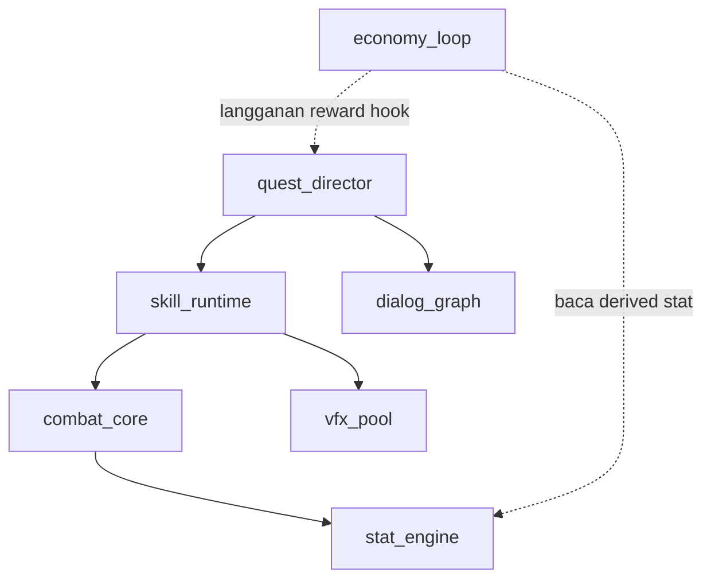
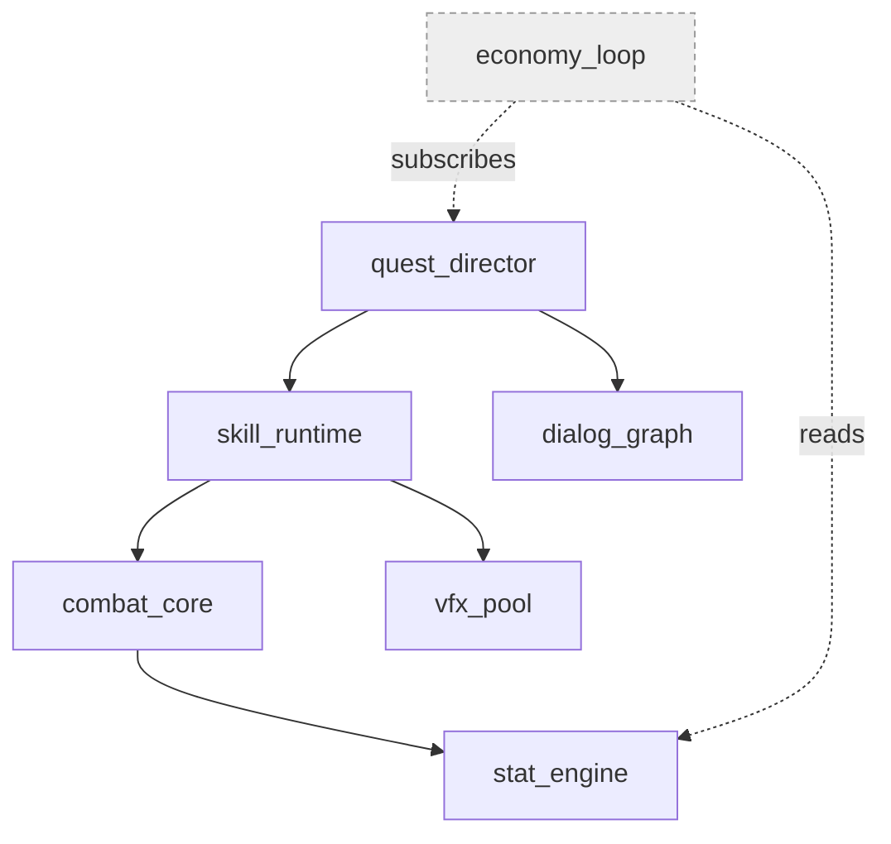
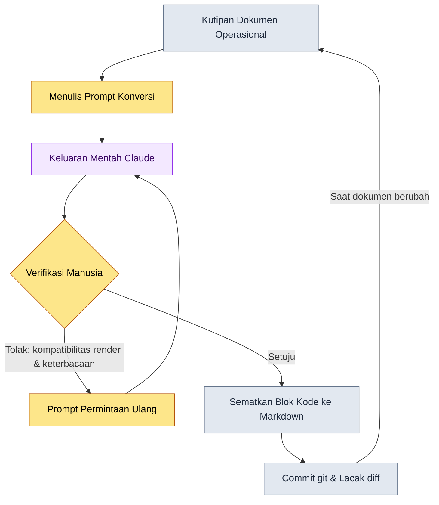
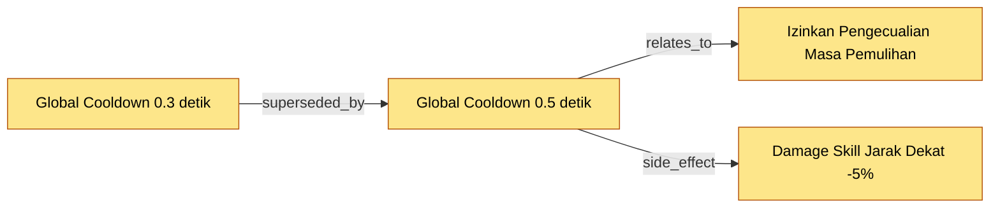

# 24.2 Otomatisasi Diagram Mermaid — Membuat Dokumen Menggambar Dirinya Sendiri

Pada hari ketiga kerjanya, seorang Game Designer baru bertanya kepada saya. "Mas, di mana ada gambar yang merangkum urutan bagaimana sistem-sistem ini saling memengaruhi?" Saya tertegun sejenak. Gambarnya memang ada. Setengah tahun lalu seseorang menggambar di papan tulis, lalu fotonya diunggah di suatu sudut wiki. Tetapi pada gambar itu masih hidup dua sistem yang sekarang sudah tidak ada, sementara tiga loop inti yang ditambahkan setelahnya justru hilang. Akhirnya saya menjawab, "Jangan percaya pada gambar, baca saja dokumennya." Itu jawaban yang memalukan. Begitu gambar menyimpang dari dokumen, gambar berhenti menjadi informasi dan berubah menjadi misinformasi.

Saya sampaikan dulu kesimpulan bab ini. Diagram yang digambar manusia pasti membusuk dalam satu atau dua bulan. Karena itu, pekerjaan menggambar diagram harus dilepaskan dari tangan manusia, dan struktur dokumen itu sendirilah yang harus memuntahkan gambarnya sendiri. Tulisan ini memperlihatkan proses tersebut melalui satu rekaman kerja nyata. Saya memuat utuh sebuah worked transcript (rekaman sesi nyata) yang menerima dokumen sebagai input lalu menghasilkan kode Mermaid, dan diagram yang terambil dari situ benar-benar dirender di halaman ini. Dengan kata lain, tulisan yang menjelaskan suatu teknik membuktikan dirinya sendiri sebagai produk dari teknik itu.

---

## 24.2.1 Mengapa Harus Mermaid

Alat diagram itu banyak. draw.io, Figma, Visio, sampai foto papan tulis. Alat-alat ini punya satu jebakan yang sama: hasilnya berupa berkas gambar (image). Image tidak bisa dilacak perubahannya baris demi baris di git, tidak bisa dibuat atau diubah langsung oleh LLM yang mengolah teks, dan tidak bisa dimuat sebagai kode di dalam dokumen Markdown. Dari sudut pandang operasional, yang paling fatal adalah poin pertama. Gambar yang tidak bisa dilacak siapa mengubahnya, kapan, dan mengapa, seiring waktu menjadi artefak yang tidak ada lagi penanggung jawabnya.

Mermaid menyelesaikan ketiga hal ini sekaligus. Diagram ditulis sebagai teks, dan urusan render diserahkan pada viewer. Karena berupa teks, `git diff` menangkap bahkan satu node yang ditambahkan. Karena berupa teks, LLM bisa membaca dan menulisnya. Karena berupa teks, ia masuk apa adanya ke dalam blok kode Markdown. Isi bab ini sendiri adalah buktinya. Diagram-diagram yang sebentar lagi muncul di bawah kalimat yang sedang Anda baca ini semuanya adalah blok teks di dalam Markdown, dan dirender menjadi gambar dalam proses build buku.

Namun ada kesalahpahaman yang harus dicegah. Tidak ada keharusan sama sekali untuk membuat semua materi operasional menjadi diagram. Untuk merinci daftar item, poin-poin (bullet) lebih cepat; untuk membandingkan angka, tabel lebih cepat. Tempat di mana Mermaid menang hanya tiga: relasi (apa terhubung dengan apa), alur (apa datang setelah apa), dan sekuens (siapa mengirim apa kepada siapa dan kapan). Memaksakan diagram di tempat selain ketiga hal ini justru menambah beban kognitif.

---

## 24.2.2 Tulang Punggung: Satu Sesi Kerja Mengambil Diagram dari Struktur Dokumen

Mulai dari sini adalah tulang punggung bab ini. Alih-alih penjelasan abstrak, saya tunjukkan dari awal sampai akhir proses mengubah satu bongkahan dokumen nyata menjadi Mermaid. Inputnya adalah potongan Markdown dari dokumen operasional Proyek A yang mencatat struktur dependensi sistem (di bawah ini kutipan nyata yang telah dianonimkan).

````text
# Memo Dependensi Sistem (kutipan dokumen operasional, dianonimkan)

- combat_core bergantung pada stat_engine
- skill_runtime bergantung pada combat_core
- skill_runtime bergantung pada vfx_pool
- quest_director bergantung pada skill_runtime
- quest_director bergantung pada dialog_graph
- economy_loop berlangganan reward hook milik quest_director
- economy_loop membaca derived stat milik stat_engine
````

Kalau ini dipindahkan ke diagram dengan tangan, hasilnya tujuh node dengan tujuh panah. Sekali saja bisa digambar. Masalahnya muncul minggu depan ketika sistem `mail_box` ditambahkan dan `dialog_graph` dipecah jadi dua. Mulai saat itu gambar tangan mulai berbohong. Karena itu konversi ini saya serahkan kepada LLM, bukan manusia.

### Tahap 1 — Prompt Selengkapnya

Berikut adalah prompt yang benar-benar saya lemparkan. Saya muat apa adanya tanpa memoles satu huruf pun.

````text
Ubahlah memo dependensi sistem di bawah menjadi Mermaid graph (atas->bawah, graph TB). Aturannya:
1. Hanya sistem yang muncul di memo yang jadi node, dilarang menambah sistem baru.
2. "A bergantung pada B" menjadi A --> B.
3. Kopling lemah seperti "berlangganan"/"membaca" pakai garis putus-putus -.-> dengan nama relasinya.
4. id node persis nama Inggris di memo, jangan tempelkan label berbahasa Korea.
Hanya blok kode, tanpa penjelasan/komentar.

[Memo]
- combat_core bergantung pada stat_engine
- skill_runtime bergantung pada combat_core
- skill_runtime bergantung pada vfx_pool
- quest_director bergantung pada skill_runtime
- quest_director bergantung pada dialog_graph
- economy_loop berlangganan reward hook milik quest_director
- economy_loop membaca derived stat milik stat_engine
````

Aturan 1 dan 4 adalah intinya. Kecelakaan paling lazim saat menyerahkan diagram pada LLM adalah "halusinasi yang sok ramah". Ia menambahkan node yang tidak diminta ("biasanya sistem login juga ada, jadi saya masukkan"), dan seenaknya menempelkan label dari teks Korea asli sehingga ID dan pencarian di isi dokumen jadi tidak cocok. Aturan-aturan itu menghalangi keramahan tersebut.

### Tahap 2 — Keluaran Mentah dari Claude (tanpa ringkasan)

Berikut adalah respons pertama yang dikembalikan model. Saya pindahkan apa adanya tanpa dimurnikan. Di dalamnya tercampur satu masalah kecil, dan masalah itu pun saya muat sekalian.

````text

````

Sintaksisnya beres dan node-nya pun tepat tujuh. Ia tidak mengarang sistem baru. Aturan 1 dan 4 terpenuhi. Namun ada satu hal yang mengganjal. Label garis putus-putus masih memuat label hasil terjemahan dari teks Korea asli yang mengandung spasi (`langganan reward hook`, `baca derived stat`). Ini bukan pelanggaran aturan. Aturan 3 menyuruh "tempelkan nama relasi", jadi model setia mengikutinya. Hanya saja, dari pengalaman saya tahu bahwa pada Mermaid, bila label yang mengandung spasi dipakai pada teks aslinya yang berbahasa Korea, sebagian renderer versi lama akan rusak. Model tidak punya cara untuk mengetahui hal itu.

### Tahap 3 — Verifikasi dan Penolakan oleh Manusia

Di sinilah tahap yang paling sering dilewati dalam otomatisasi, padahal yang paling penting. Saya tidak menerima keluaran apa adanya, melainkan menolaknya. Alasan penolakannya ada dua.

Pertama, spasi pada label garis putus-putus — yang pada teks aslinya berbahasa Korea — harus diubah menjadi token berbahasa Inggris untuk memastikan kompatibilitas render. Kedua, kopling lemah (garis putus-putus) dan kopling kuat (garis solid) tercampur dalam satu gambar, tetapi tidak ada pembeda warna atau gaya sehingga tidak langsung terbaca sekilas. Dengan dua hal ini saya mengajukan permintaan ulang.

### Tahap 4 — Prompt Permintaan Ulang

````text
Sudah hampir bagus. Perbaiki dua hal saja.

1. Ubah label panah garis putus-putus jadi satu kata berbahasa Inggris (tanpa spasi). 
   "langganan reward hook" -> subscribes, "baca derived stat" -> reads
   Alasan: sebagian renderer rusak pada label edge berbahasa Korea + spasi.
2. Untuk membedakan secara visual node garis putus-putus (kopling lemah) dan node garis solid (kopling kuat),
   beri gaya abu-abu muda dengan classDef pada node yang hanya punya kopling lemah seperti economy_loop.
3. Sisanya biarkan apa adanya.
````

### Tahap 5 — Keluaran Mentah atas Permintaan Ulang

````text

````

Kali ini saya menerimanya. Labelnya berubah menjadi token tunggal berbahasa Inggris, dan hanya `economy_loop` yang dijatuhkan ke warna abu-abu sehingga informasi "sistem ini bukan dependensi langsung, melainkan sistem pinggiran yang hanya terjalin lewat langganan dan pembacaan" tersampaikan lewat warna. Seandainya saya menggambar dengan tangan tanpa menyentuh satu baris prompt pun, kemungkinan besar saya bahkan tidak akan terpikir akan classDef ini.

### Produk dari Tulang Punggung — Dirender Nyata di Tempat Ini

Keluaran akhir dari transcript di atas saya muat apa adanya sebagai blok kode di halaman buku ini, tanpa menyalinnya dengan tangan. Build buku menggambarnya menjadi gambar. Inilah wujud nyata dari "membuktikan diri sendiri dengan teknik sendiri".


Satu bongkahan kutipan dokumen, melalui lima kali bolak-balik, menjadi aset operasional yang masuk ke git, bisa diperbarui oleh LLM, dan dirender di halaman ini. Bila minggu depan `mail_box` ditambahkan, cukup tulis satu baris di memo lalu lemparkan lagi prompt yang sama. Tidak ada lagi pekerjaan yang menuntut manusia mengangkat pena.

---

## 24.2.3 Diagram Kedua: Menggambar Pipeline Otomatisasi Ini Sendiri

Kalau diagram sebelumnya adalah "hasil dari konversi", yang ini adalah "proses dari konversi". Prosedur kerja yang baru saja dijalankan dalam lima tahap itu saya buat menjadi diagram alur. Diagram ini pun saya ambil dengan cara yang sama, menyuruh LLM, dan melalui verifikasi yang sama. Hasilnya saya muat apa adanya.



Ada satu hal yang dikatakan diagram alur ini. Yang ingin saya tekankan dengan panah tebal, bukan garis putus-putus, adalah belah ketupat di tengah, yaitu `Verifikasi Manusia`. Bila Anda mabuk oleh kata otomatisasi lalu menghapus node ini, halusinasi sok ramah dari Tahap 1 akan langsung termuat di dokumen operasional. Otomatisasi membebaskan manusia dari menggambar, tetapi tidak membebaskannya dari penilaian. Panah terakhir pada loop (`Saat dokumen berubah` → `Kutipan Dokumen Operasional`) adalah intinya. Lingkaran umpan balik inilah yang membuat diagram bukan jadi materi sekali pakai, melainkan aset yang tidak menua dan tumbuh bersama dokumen.

---

## 24.2.4 Skrip Konversi: Jalur Deterministik yang Berputar Tanpa LLM

Konversi dengan LLM memang luwes, tetapi bila relasinya sudah ada sebagai data terstruktur, tidak perlu repot-repot memanggil model. Untuk data dengan field yang sudah baku seperti decision card (kartu keputusan) Proyek A, skrip Python kecil lebih cepat dan lebih jujur (halusinasi mustahil terjadi dari akarnya). Berikut adalah bagian inti dari skrip nyata yang mengubah daftar decision card menjadi decision graph Mermaid.

````python
# decision_graph_to_mermaid.py
# Konversi decision card (data terstruktur) -> Mermaid graph. Tanpa LLM, deterministik.

def to_mermaid(decisions):
    lines = ["graph LR"]
    # 1) Deklarasi node: id dan judul apa adanya. Tidak mengarang.
    for d in decisions:
        safe_title = d.title.replace('"', "'")   # hanya escape tanda kutip
        lines.append(f'    {d.id}["{safe_title}"]')
    # 2) Edge: tipe relasi sebagai label panah.
    for d in decisions:
        for rel in d.relations:
            lines.append(f'    {d.id} -->|{rel.type}| {rel.target}')
    return "\n".join(lines)
````

Intinya adalah ia selesai hanya dalam dua tahap. Mendeklarasikan node, lalu menyambungkan edge. Node yang tidak ada di input tidak akan pernah muncul di output. Bila skrip ini menerima tiga lembar decision card, keluarnya graph seperti di bawah ini.



Satu keputusan digantikan oleh keputusan lain (superseded_by), dan efek samping yang terturun darinya (side_effect) pun terlihat dalam satu panah. Tanpa membaca habis puluhan baris log keputusan berupa teks, satu lembar graph ini sudah cukup untuk menangkap riwayat "mengapa cooldown sekarang 0.5 detik" dalam waktu 5 menit.

Kapan memakai LLM dan kapan memakai skrip? Patokannya sederhana. Bila inputnya data terstruktur (kartu atau sheet dengan field yang baku), pakai skrip; bila inputnya teks bebas (notulen rapat, memo, percakapan), pakai LLM. Memakai LLM pada data terstruktur hanya menanggung risiko halusinasi yang tidak perlu, sementara memakai skrip pada teks bebas membuat aturan parsing membengkak tanpa henti.

---

## 24.2.5 Empat Jebakan dan Resepnya

Inilah ranjau-ranjau yang benar-benar saya injak saat mengoperasikan otomatisasi diagram.

Pertama, jebakan menjadi terlalu rumit. Bila node melampaui lima puluh, gambar tidak lagi membantu kognisi melainkan menghalanginya. Resepnya adalah membatasi antara dua puluh sampai tiga puluh dalam satu layar, dan bila lebih besar dari itu, mengikat area dengan subgraph atau langsung memecah diagram jadi dua.

Kedua, jebakan pembaruan yang putus. Ini mudah dianggap hanya terjadi pada gambar tangan, tetapi meski sudah diotomatisasi, kalau dokumen input tidak diperbaiki ia tetap membusuk sama saja. Resepnya adalah lingkaran umpan balik yang tadi ada di diagram alur. Buatlah dokumen input menjadi single source of truth (satu-satunya sumber kebenaran), dan diagram selalu dibangkitkan ulang dari situ.

Ketiga, jebakan terlalu abstrak. Gambar tingkat "sistem-sistem kira-kira terjalin begini" memang cantik tetapi tidak berguna. Resepnya adalah memasukkan ID nyata (`skill_runtime`, `D_B`) ke node alih-alih kata benda abstrak. Pencarian di isi dokumen dan diagram harus berbagi pengidentifikasi yang sama agar bisa langsung melompat dari gambar ke kode.

Keempat, jebakan memakai keluaran LLM apa adanya tanpa tinjauan. Seperti terlihat di Tahap 3 tulang punggung, model bisa membuat label yang rendernya rusak sembari tetap mematuhi aturan. Resepnya adalah tidak pernah menghapus node verifikasi manusia dari pipeline.

---

## 24.2.6 Dampak — Perubahan yang Dikatakan dengan Jujur

Ada godaan untuk mengangkat angka, tetapi di sini saya hanya menyebut arahnya. Perbandingan di bawah adalah perubahan yang dirasakan di tim yang saya operasikan, dan bukan nilai pengukuran presisi melainkan perkiraan penulis (belum terverifikasi).

Yang paling jelas berubah adalah kecepatan karyawan baru memahami sistem. Memahami "bagaimana sistem-sistem ini terjalin", yang dahulu memakan beberapa hari pertama bekerja, kini menyusut menjadi sekitar satu jam di depan satu lembar graph dependensi yang terbangkit otomatis. Persiapan materi rapat pun jadi lebih ringan. Dahulu seseorang menggambar ulang dengan tangan pada malam sebelum rapat, kini cukup sekali mengonversi dokumen dan selesai. Yang terpenting, pertanyaan "boleh tidak ya saya percaya gambar ini" yang muncul saat diagram menyimpang dari kenyataan nyaris lenyap. Karena dokumen input itulah gambarnya, maka kalau dokumennya benar, gambarnya pun benar.

Sebaliknya, kalau ditulis dengan jujur, otomatisasi bukan solusi serba bisa. Sketsa ide pada tahap awal yang belum terstrukturkan tetap lebih cepat di papan tulis. Otomatisasi bersinar setelah struktur cukup mengeras.

---

## Poin-Poin Penting

- Diagram yang digambar manusia pasti membusuk, jadi pekerjaan menggambar diserahkan pada struktur dokumen.
- Teks bebas dikonversi dengan LLM, data terstruktur dengan skrip, tetapi verifikasi dilakukan oleh manusia.
- Diagram dan isi dokumen harus berbagi ID yang sama agar bisa melompat dari gambar ke kode.

---

## Coba Sendiri

**setup.** Cukup satu repositori Markdown untuk menyimpan dokumen, dan sebuah viewer yang merender Mermaid (tertanam pada kebanyakan viewer Markdown dan git hosting). Pilihlah satu potongan yang termasuk "relasi, alur, sekuens" dari dokumen yang akan dikonversi (misalnya memo dependensi sistem).

**prompt.** Sisipkan potongan itu ke dalam kerangka prompt Tahap 1 pada tulang punggung isi bab, lalu lemparkan ke LLM. Pastikan memasukkan dua aturan: "jangan menambahkan node yang tidak ada di memo" dan "tulis ID persis nama Inggris aslinya". Bila datanya terstruktur, konversikan dengan skrip deterministik seperti `decision_graph_to_mermaid.py` alih-alih LLM.

**verify.** Tempelkan blok kode keluaran ke Markdown lalu coba render sungguhan. Periksa tiga hal. (1) Apakah tidak muncul node yang tidak ada di input, (2) apakah label edge tergambar tanpa rusak, (3) apakah ID yang dipakai di isi dokumen cocok dengan ID diagram. Bila satu saja menyimpang, tolak dengan prompt permintaan ulang dan minta lagi. Bila lolos, commit ke git — sekarang perubahan dilacak lewat diff.

### Versi Ringkas Solo

Bila Anda pekerja solo tanpa tim maupun skrip, ringkaskan begini. Pada aplikasi catatan, tuliskan relasi antara sistem, tugas, dan ide dalam format poin "A bergantung pada B". Sekali seminggu, salin utuh daftar itu lalu lemparkan satu baris: "ubah ini jadi Mermaid graph TB, jangan tambah node yang tidak ada di daftar". Tempelkan blok kode yang dikembalikan di bagian paling atas catatan. Selesai. Karena tidak menggambar dengan tangan, tidak ada beban pembaruan, dan selama daftar input tetap hidup, gambarnya selalu yang terbaru.
