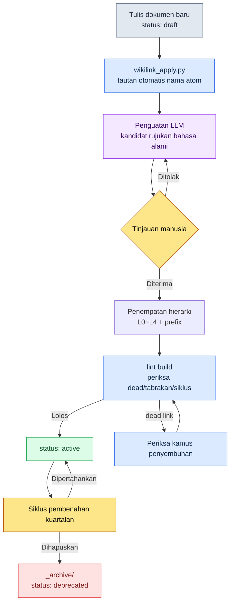

# 24.3 Wikilink dan Hierarki Dokumen — Koneksi dan Klasifikasi, Dua Pintu Masuk Pencarian

> Koneksi (wikilink) dan klasifikasi (hierarki) adalah dua pintu masuk dari masalah yang sama. Yang satu menjawab "ke mana keputusan ini bermuara", yang lain menjawab "di mana dokumen ini tinggal".

Seorang Game Designer yang baru bergabung bertanya pada pagi hari keduanya. "Apakah benar nilai global cooldown pertarungan itu 0.5 detik? Di dokumen mana dasarnya?" Saya tidak bisa menjawab. Pasti ada catatan keputusannya di suatu tempat, tetapi saya tidak ingat apakah itu di rulebook pertarungan, notula rapat, atau laporan kuartalan. Bertiga kami menempel dan menyisir seluruh folder dengan grep. Angka yang sama muncul di enam tempat, dan kami tidak bisa membedakan mana yang "keputusan asli" dan mana "salinan rujukan". Kami menghabiskan 40 menit. Yang akhirnya kami temukan adalah satu baris yang terkubur di dalam notula rapat.

Malam itu saya menyadari bahwa ada dua hal yang tidak ada. Pertama, tidak ada **koneksi eksplisit** antar dokumen. Meski angka yang sama ada di enam tempat, tidak ada di mana pun yang menuliskan benang "ini dikutip dari sana". Kedua, tidak ada **hierarki** tempat dokumen tinggal. Catatan keputusan tersebar di rulebook, notula, dan laporan tanpa adanya janji bahwa "keputusan tinggal di sini".

Kedua hal inilah tema bab ini. Wikilink menuliskan koneksi sebagai teks, dan hierarki menjanjikan klasifikasi sebagai folder. Keduanya tampak seperti teknik yang terpisah, tetapi sebenarnya merupakan dua sisi dari satu masalah, yaitu pencarian.

---

## 24.3.1 Apa yang Runtuh Ketika Tidak Ada Koneksi

Ketika dokumen berjumlah 30, semuanya bisa diingat di kepala. Begitu melewati 100, ingatan manusia tidak lagi berperan sebagai indeks. Saat itu yang bisa kita andalkan ada satu dari dua. Menyisir keseluruhan dengan grep (lambat dan tidak akurat), atau mengikuti koneksi eksplisit yang tertulis di dalam dokumen (cepat dan akurat).

Alasan grep tidak akurat itu sederhana. Jika kita mencari string `combat_global_cooldown_constant`, maka dokumen yang **memutuskan** nilai itu dan dokumen yang hanya **menyebutkan** nilai itu sama-sama terjaring. Grep tidak tahu mana yang asli. Sebaliknya, jika kita menjanjikan notasi kurung siku ganda `[[combat_global_cooldown_constant]]` di dalam dokumen, maka sinyal "ini secara sengaja merujuk atom tersebut" tertinggal pada string itu sendiri. Jika kita menyempitkan dengan pola `\[\[combat_global_cooldown`, penyebutan kebetulan akan tersaring keluar dan hanya rujukan yang disengaja yang tersisa.

Notasi satu baris yang dijanjikan ini menjadi sebuah sisi (edge) dari graf. Ketika dokumen A menuliskan `[[atom_X]]`, terbentuk sisi berarah A→X. Jika 200 dokumen masing-masing menuliskan beberapa, maka tanpa ada yang menggambarnya pun graf akan terakumulasi di dalam teks.

Di bawah ini adalah satu potongan gambaran bagaimana atom, keputusan, dan dokumen di proyek kami terikat oleh wikilink. Warna simpul menunjukkan jenis, dan anak panah menunjukkan arah rujukan.

<svg viewBox="0 0 720 360" xmlns="http://www.w3.org/2000/svg" font-family="sans-serif" font-size="12">
  <defs>
    <marker id="arrow" markerWidth="9" markerHeight="9" refX="8" refY="3" orient="auto" markerUnits="strokeWidth">
      <path d="M0,0 L8,3 L0,6 Z" fill="#555"/>
    </marker>
  </defs>
  <!-- edges -->
  <g stroke="#888" stroke-width="1.4" marker-end="url(#arrow)" fill="none">
    <line x1="180" y1="80" x2="350" y2="150"/>
    <line x1="180" y1="240" x2="350" y2="160"/>
    <line x1="430" y1="150" x2="560" y2="90"/>
    <line x1="430" y1="170" x2="560" y2="240"/>
    <line x1="180" y1="80" x2="180" y2="220"/>
  </g>
  <!-- doc nodes (blue) -->
  <g>
    <rect x="90" y="58" width="180" height="44" rx="6" fill="#dbeafe" stroke="#2563eb"/>
    <text x="180" y="84" text-anchor="middle" fill="#1e3a8a">[[CombatFormula_v3]]</text>
    <rect x="90" y="218" width="180" height="44" rx="6" fill="#dbeafe" stroke="#2563eb"/>
    <text x="180" y="244" text-anchor="middle" fill="#1e3a8a">[[Meeting_W21]]</text>
  </g>
  <!-- atom node (green) -->
  <g>
    <rect x="350" y="134" width="180" height="48" rx="6" fill="#dcfce7" stroke="#16a34a"/>
    <text x="440" y="155" text-anchor="middle" fill="#14532d">[[combat_global_</text>
    <text x="440" y="171" text-anchor="middle" fill="#14532d">cooldown_constant]]</text>
  </g>
  <!-- decision nodes (amber) -->
  <g>
    <rect x="560" y="68" width="150" height="44" rx="6" fill="#fef3c7" stroke="#d97706"/>
    <text x="635" y="94" text-anchor="middle" fill="#92400e">[[D2026_Q2_017]]</text>
    <rect x="560" y="218" width="150" height="44" rx="6" fill="#fef3c7" stroke="#d97706"/>
    <text x="635" y="244" text-anchor="middle" fill="#92400e">[[D2026_Q2_018]]</text>
  </g>
  <!-- legend -->
  <g font-size="11">
    <rect x="90" y="312" width="14" height="14" fill="#dbeafe" stroke="#2563eb"/>
    <text x="110" y="324" fill="#333">Dokumen</text>
    <rect x="170" y="312" width="14" height="14" fill="#dcfce7" stroke="#16a34a"/>
    <text x="190" y="324" fill="#333">atom</text>
    <rect x="250" y="312" width="14" height="14" fill="#fef3c7" stroke="#d97706"/>
    <text x="270" y="324" fill="#333">Keputusan</text>
  </g>
</svg>

Yang ditunjukkan potongan kecil ini adalah fakta bahwa jawaban atas pertanyaan Game Designer baru tadi sudah ada di dalam graf. Jika kita menelusuri mundur anak panah yang masuk ke atom `combat_global_cooldown_constant`, akan muncul keputusan `D2026_Q2_017`. Bukan 40 menit, melainkan satu kali penelusuran balik (back-reference).

---

## 24.3.2 Janji Notasi — Empat Jenis, Satu Format

Kami menetapkan objek yang diikat dengan wikilink hanya empat jenis. Jika jenisnya ditambah, formatnya akan goyah, dan jika formatnya goyah, grep menjadi tidak akurat lagi.

- **Rujukan atom** — `[[combat_global_cooldown_constant]]`. Menunjuk atom yang merupakan unit 1 dokumen 1 keputusan.
- **Rujukan keputusan** — `[[D2026_Q2_017]]`. Catatan pengambilan keputusan yang diidentifikasi oleh kuartal dan nomor.
- **Rujukan dokumen** — `[[CombatFormula_v3]]`. Dokumen besar seperti rulebook dan spesifikasi.
- **Rujukan orang** — `[[팀원 A]]`. Penanggung jawab dan pengambil keputusan.

Keempat jenis memakai satu format yang sama, `[[name]]`. name harus unik secara global. Jika nama atom bertabrakan di dua tempat, keduanya menyatu menjadi simpul yang sama di graf, sehingga terjadi kecelakaan di mana "cooldown pertarungan" dan "cooldown UI" menjadi satu simpul. Karena itu, dalam aturan penamaan atom kami mewajibkan prefix bidang (`combat_`, `ui_`).

---

## 24.3.3 wikilink_apply.py — Penerapan dan Penyembuhan

Janji notasi saja tidak cukup. Bagi manusia, memberi kurung siku satu per satu pada 200 dokumen itu tidak realistis, dan sekalipun sudah dibubuhkan, semuanya akan rusak jika nama atom berubah. Karena itu kami mengoperasikan skrip yang melakukan dua tugas. Pertama adalah **penerapan** (apply) — secara otomatis mengubah nama atom yang dikenal yang muncul di teks menjadi wikilink. Kedua adalah **penyembuhan** (heal) — menemukan tautan yang namanya berubah atau rusak, lalu memperbaruinya dan melaporkannya.

Bagian inti dari `wikilink_apply.py` tampak seperti ini.

```python
# wikilink_apply.py — menerapkan nama atom di teks menjadi [[wikilink]], dan menyembuhkan tautan yang rusak
import re
from pathlib import Path

WIKILINK = re.compile(r"\[\[([A-Za-z0-9_]+)\]\]")
# Hanya menjaring nama atom yang muncul telanjang, yang belum berupa tautan (kasus tanpa [[ di depannya)
BARE_NAME = lambda name: re.compile(rf"(?<!\[\[)(?<![A-Za-z0-9_])({re.escape(name)})(?![A-Za-z0-9_])(?!\]\])")

def load_known_atoms(registry: Path) -> set[str]:
    # _atom_registry.tsv: kolom pertama adalah nama atom yang saat ini valid
    return {ln.split("\t")[0].strip()
            for ln in registry.read_text(encoding="utf-8").splitlines()
            if ln.strip() and not ln.startswith("#")}

def apply_links(text: str, known: set[str]) -> tuple[str, int]:
    applied = 0
    for name in sorted(known, key=len, reverse=True):  # Nama panjang lebih dulu: mencegah kontaminasi pencocokan sebagian
        text, n = BARE_NAME(name).subn(rf"[[{name}]]", text)
        applied += n
    return text, applied

def heal_links(text: str, known: set[str], aliases: dict[str, str]) -> tuple[str, list[str]]:
    dead = []
    def repl(m):
        ref = m.group(1)
        if ref in known:
            return m.group(0)              # Masih hidup → biarkan apa adanya
        if ref in aliases:                  # atom yang diubah namanya → sembuhkan ke nama baru
            return f"[[{aliases[ref]}]]"
        dead.append(ref)                    # benar-benar dead link → laporkan
        return m.group(0)
    return WIKILINK.sub(repl, text), dead
```

Di sini dua pilihan desain menjadi tulang punggung dari pembahasan ini.

Pertama, `apply_links` melakukan substitusi **nama panjang lebih dulu**. Ketika ada dua atom `combat_cooldown` dan `combat_cooldown_global`, jika kita mensubstitusi yang pendek lebih dulu, maka bagian depan dari yang panjang akan terkontaminasi. Satu baris pengurutan menurun berdasarkan panjang mencegah kecelakaan ini. Bagian ini saya lewatkan saat pertama kali menulisnya, dan baru saya tambahkan setelah benar-benar muncul hasil rusak berupa `[[combat_cooldown]]_global`.

Kedua, `heal_links` menyembuhkan melalui **kamus penggantian nama** (aliases). Ketika nama atom berubah dari `combat_gcd` → `combat_global_cooldown_constant`, nama lama diganti otomatis menjadi nama baru, dan jika tidak ada juga di kamus, barulah dilaporkan sebagai dead link. Alih-alih memperbaiki 200 dokumen dengan tangan setiap kali nama berubah, kami menambahkan satu baris alias.

---

## 24.3.4 Worked Transcript — Menyerahkan Penguatan Wikilink kepada Claude

Apply otomatis hanya menautkan "nama atom yang sudah dikenal". Tetapi kalimat yang ditulis dengan menguraikannya tanpa memakai nama atom di teks ("global cooldown pertarungan adalah 0.5 detik") tidak terjaring. Untuk mengubah rujukan bahasa alami semacam ini menjadi kandidat wikilink, LLM lebih cepat daripada manusia. Di bawah ini adalah transkrip lengkap yang benar-benar saya pertukarkan. Keluaran tidak saya ringkas, dan bagian yang saya tolak pun saya tinggalkan apa adanya.

**Prompt saya (lengkap):**

```
Saya akan memberimu satu paragraf rulebook pertarungan dan daftar atom yang terdaftar.
Carilah ekspresi bahasa alami di teks yang menunjuk atom-atom ini, lalu usulkan
kandidat [[wikilink]] dalam bentuk tabel. Hanya saat yakin; jika ambigu, cukup tandai
dengan "ambigu". Jangan menulis ulang teksnya, cukup tunjukkan frasa mana diganti
menjadi tautan mana. Konsep yang belum terdaftar, pisahkan sebagai "kandidat atom baru".

[atom terdaftar]
combat_global_cooldown_constant
combat_skill_cast_interrupt_rule
combat_resource_regen_rate

[teks]
Global cooldown pertarungan adalah 0.5 detik, dan berlaku umum untuk semua skill aktif.
Jika terkena serangan saat sedang cast, cast-nya terputus. Namun, skill jenis penyembuhan adalah pengecualian.
Regenerasi resource hanya kembali ke kecepatan normal dalam kondisi non-pertarungan.
```

**Keluaran Claude (mentah apa adanya):**

```
Usulan wikilink:

| Frasa di teks                                | Kandidat tautan                        | Keyakinan |
|----------------------------------------------|----------------------------------------|-----------|
| "Global cooldown pertarungan adalah 0.5 detik" | [[combat_global_cooldown_constant]]    | Tinggi    |
| "Jika terkena serangan saat sedang cast, cast-nya terputus" | [[combat_skill_cast_interrupt_rule]]   | Tinggi    |
| "Regenerasi resource hanya dalam kondisi non-pertarungan" | [[combat_resource_regen_rate]]         | Sedang    |

Kandidat atom baru:
- "skill jenis penyembuhan adalah pengecualian" → Aturan pengecualian ini tidak
  tercantum secara eksplisit di mana pun di antara atom yang terdaftar. Tampaknya
  diperlukan atom terpisah seperti combat_skill_cast_interrupt_heal_exception.
  (ambigu: bisa jadi merupakan klausa anak dari interrupt_rule, sehingga tidak
  dapat dipastikan apakah ini atom mandiri)

Catatan: Untuk baris "regenerasi resource", saya yakin sedang karena belum melihat
definisi atom apakah combat_resource_regen_rate menunjuk 'kecepatan regenerasi'
atau 'kondisi non-pertarungan'.
```

**Verifikasi dan penolakan saya:**

Dari tiga baris, dua baris saya terima. Global cooldown dan interupsi cast persis cocok dengan definisi atom. Baris ketiga "regenerasi resource" tepat ketika Claude sendiri menurunkan keyakinannya menjadi "sedang" — atom `combat_resource_regen_rate` hanya mendefinisikan **nilai kecepatan**, sedangkan **kondisi** "hanya dalam kondisi non-pertarungan" adalah ranah atom lain. Jika tautan tetap dipasang, akan terjadi kecelakaan menghubungkan "kondisi" secara keliru ke atom "kecepatan". **Saya tolak.**

Penunjukan kandidat atom baru itu tepat. "Pengecualian jenis penyembuhan" benar-benar tidak punya atom di mana pun. Hanya saja, bagian yang Claude sebut ambigu ("apakah ini klausa anak dari interrupt_rule atau atom mandiri") adalah wilayah yang harus diputuskan manusia, dan saya memutuskan untuk memisahkannya menjadi atom mandiri.

**Permintaan ulang:**

```
Jangan tautkan baris "regenerasi resource". Sebagai gantinya, [[combat_resource_regen_rate]]
hanya untuk 'kecepatan', dan 'kondisi non-pertarungan' dipisahkan menjadi atom baru.
Tuliskan definisi 1 baris untuk masing-masing dari kedua atom tersebut. Pengecualian
penyembuhan juga tuliskan definisi 1 baris sebagai atom mandiri.
```

Dalam bolak-balik ini, yang dilakukan LLM bukan "membuat kandidat dari nol", melainkan "memilihkan kandidat". Intinya, **ada tempat yang jelas bagi manusia untuk menolak**. Seandainya ini penerbitan otomatis, satu tautan yang salah akan tertinggal selamanya di graf.

---

## 24.3.5 lint — Mencegah Koneksi yang Rusak di Tahap Build

Tautan rusak seiring waktu. atom dihapus, nama berubah, salah ketik masuk. Karena itu, di setiap build kami menjalankan wikilink lint. Item pemeriksaan dan penanganannya seperti ini.

- **dead link** — name di `[[name]]` tidak ada di registri → peringatan build, periksa kamus penyembuhan
- **pelanggaran format** — pelanggaran aturan snake_case/prefix → blokir
- **tabrakan nama** — name yang sama pada dua atom → blokir (keunikan global rusak)
- **rujukan siklik** — A→B→A → peringatan (diizinkan via daftar izin jika disengaja)
- **rujukan berlebih** — satu dokumen merujuk atom yang sama 10 kali atau lebih → peringatan (dicurigai noise)

Bahwa hanya dead link yang dijadikan peringatan dan bukan blokir adalah disengaja. Dalam kondisi peralihan saat mengganti nama atom, sesaat akan muncul dead, dan jika ini diblokir sebagai kegagalan build, pekerjaan berhenti. Sebagai gantinya, kami meminta kamus penyembuhan diperiksa terlebih dahulu. Pelanggaran format dan tabrakan nama langsung diblokir — keduanya mengontaminasi keseluruhan graf.

> lint ini bersifat membuktikan diri sendiri. Tautan yang dibuat wikilink_apply.py diperiksa oleh lint dari sistem yang sama, dan hasilnya ditinggalkan lagi sebagai keputusan atom yang lain. Lingkaran di mana alat memverifikasi keluarannya sendiri dengan kriterianya sendiri adalah kerangka dasar dari operasional.

---

## 24.3.6 Klasifikasi — Hierarki Tempat Dokumen Tinggal

Sampai sini adalah koneksi. Sekarang klasifikasi. Jika wikilink menjawab "ke mana keputusan ini bermuara", maka hierarki menjawab "di mana dokumen ini tinggal". Jika keduanya tidak ada, pencarian 40 menit oleh Game Designer baru itu akan terulang.

Folder dokumen kami terdiri dari empat lapisan. Lapisan ini berbagi kerangka yang sama dengan integrasi Layer pada arsitektur informasi — visi, sistem, konten, dan meta masing-masing menjadi satu lapisan.

```
docs/
├── L0_vision/              visi (5 berkas atau kurang, hampir tak berubah)
├── L1_systems/             rulebook per bidang
│   ├── combat/
│   ├── narrative/
│   └── ui/
├── L2_content/             konten individual
│   ├── characters/
│   └── quests/
└── L4_meta/                operasional·keputusan·rapat·atom
    ├── decisions/
    ├── meetings/
    ├── reports/
    └── atoms/
```

L3 kosong karena tempat itu ditempati oleh sheet data dan basis data (bukan dokumen, melainkan tabel). Keputusan yang dicari Game Designer baru itu tinggal di `L4_meta/decisions/` — dengan satu janji ini saja, pencarian 40 menit itu akan selesai dengan satu kalimat "keputusan ada di sana".

Agar hierarki berfungsi sebagai pintu masuk pencarian, lima hal berikut harus dipatuhi bersama. Jika salah satu saja terlewat, klasifikasi runtuh.

1. **Klasifikasi berdasarkan makna, dilarang berdasarkan waktu.** `combat/`·`narrative/` dapat dicari, tetapi `2026-Q1/`·`2026-Q2/` tidak akan dibuka siapa pun enam bulan kemudian. Waktu sudah dicatat oleh git, jadi tidak ada alasan membaginya lagi dengan folder.
2. **Kedalaman 4 atau kurang.** `L1_systems/combat/skills/active/single_target/attack.md` itu 5 tingkat. Jika path melebihi satu layar, manusia tidak bisa menampung lokasinya di kepala.
3. **Prefix nama berkas.** Masukkan jenis ke dalam nama berkas dengan `spec_`·`report_`·`decision_`·`char_`. Tanpa melihat folder pun, jenisnya terlihat.
4. **README di setiap folder.** README menuliskan definisi, isi, dan aturan penamaan dari masing-masing folder. Inilah pintu masuk pertama bagi anggota baru.
5. **Folder meta berprefiks `_`.** `_archive/`·`_TEMPLATES/`·`_NAMING/` naik ke atas dalam pengurutan otomatis, dan tidak bercampur dengan konten utama.

Dokumen tidak menetap di satu tempat. Selagi ditulis, ia tinggal di folder utama dengan `status: draft`; saat diaktifkan menjadi `status: active`; dan saat dihapuskan, **bukan dihapus**, melainkan dipindahkan ke `_archive/` lalu diberi `status: deprecated`. Tidak menghapus materi yang dihapuskan adalah prinsip mutlak. Ketika enam bulan kemudian seseorang bertanya "kenapa keputusan itu dibatalkan?", jawabannya hanya ada di dalam materi yang dihapuskan. Seandainya dihapus, tidak ada cara untuk kembali menyusun dasar keputusan di kemudian hari.

Perubahan besar tidak hanya diserahkan ke git, melainkan ditinggalkan di frontmatter sebagai change_log.

```yaml
---
title: combat_global_cooldown_rule
version: v3
last_modifier: teammate_a
change_log:
  - v1 (2025): draf
  - v2 (2025): cooldown 0.3 → 0.5  ([[D2026_Q2_017]])
  - v3 (2026): tambah pengecualian penyembuhan  ([[D2026_Q2_018]])
---
```

Perhatikan bahwa ID keputusan di change_log dituliskan sebagai wikilink. Di sinilah koneksi dan klasifikasi bertemu. Dokumen tinggal di satu tempat di dalam hierarki (klasifikasi), tetapi riwayat perubahannya bermuara ke graf keputusan (koneksi). Satu frontmatter membuka dua pintu sekaligus.

---

## 24.3.7 Sekali Tiap Kuartal, Siklus Pembenahan

Hierarki akan membusuk jika dibiarkan. Folder kosong bermunculan, draft berumur enam bulan menumpuk, dan kedalaman perlahan bertambah. Karena itu kami membenahi sekali tiap kuartal. Folder kosong dihapus, draft yang berusia lebih dari enam bulan diputuskan aktif/dihapuskan, kedalaman 5 atau lebih diratakan, folder tanpa README dibuatkan atau dihapuskan, dan jika `_archive` melebihi separuh, dilakukan pengarsipan kompresi. Tanpa siklus ini, hierarki terisi noise sehingga pembedaan antara sinyal dan derau lenyap.

Jika kita melihat keseluruhan alur dalam satu gambar, hasilnya seperti ini. Dari dokumen masuk, terkoneksi, terklasifikasi, terverifikasi, hingga dihapuskan adalah satu lingkaran.



Dalam lingkaran ini, koneksi (B·C·D·F) dan klasifikasi (E·I·J) bekerja bergantian. Keduanya tidak berputar terpisah, melainkan saling bertaut di dalam masa hidup satu dokumen.

---

## 24.3.8 Dampak — Apa yang Berubah dan Bagaimana

Angka-angka di sini adalah **arah** dari perbandingan sebelum dan sesudah penerapan di proyek penulis. Bukan nilai pengukuran presisi, melainkan besar perbedaan yang dirasakan ketika pekerjaan yang sama dilakukan di dua lingkungan (observasi penulis, tanpa pengukuran presisi).

Sebelum koneksi dan hierarki tertata, pertanyaan pelacakan keputusan dari Game Designer baru bisa memakan satu hingga dua jam seperti kasus 40 menit di bagian pembuka. Setelah penerapan, cukup satu kali penelusuran balik atom — dalam hitungan menit. Pencarian dokumen berkurang dari 5\~10 menit menjadi sekitar 30 detik, dan ini adalah hasil dari klasifikasi berdasarkan makna dan prefix pada hierarki yang bekerja bersama. Kecelakaan akibat kutipan keliru (jenis salah mengira nilai yang sudah dihapuskan sebagai yang berlaku) berkurang dari beberapa kasus per kuartal menjadi satu-dua kasus — karena wikilink menyatakan "ini merujuk atom tersebut", nilai yang disalin dan nilai asli tidak lagi tertukar.

Perubahan terbesar adalah **adaptasi anggota baru**. Tanpa hierarki, perlu beberapa hari untuk menghafal apa ada di folder mana, dan tanpa koneksi, tidak ada cara memahami bagaimana sistem saling terkait. Setelah keduanya tersedia, anggota baru menghafal lokasi melalui README folder, dan menelusuri sendiri relasi antar-sistem dengan mengikuti graf wikilink. "Hal yang baru bisa diketahui dengan bertanya" berubah menjadi "hal yang terlihat jika ditelusuri".

Dampak ini hanya muncul ketika kedua pintu masuk ada **bersama-sama**. Jika hanya ada koneksi tanpa klasifikasi, grafnya ada tetapi tidak tahu di mana dokumen tinggal; jika hanya ada klasifikasi tanpa koneksi, foldernya rapi tetapi tidak tahu ke mana keputusan bermuara.

---

## 24.3.9 Kegagalan Umum dan Resepnya

Di sisi koneksi, kegagalan paling umum adalah **tautan noise**. Jika karena wikilink itu baik lalu semua kata benda diberi kurung siku, graf akan penuh sisi tak bermakna sehingga alat visualisasi tak berdaya. Prinsipnya adalah hanya menyisakan tautan yang bisa ditanyai dan dijawab "relasi apa yang dimiliki dokumen ini dengan dokumen itu". Berikutnya adalah **penerbitan otomatis** — jika tautan yang dibuat LLM di-commit tanpa tinjauan, koneksi keliru seperti baris "regenerasi resource" di worked transcript akan tertinggal selamanya. apply itu otomatis, penerbitan itu manusia.

Kegagalan di sisi klasifikasi sebagian besar adalah pelanggaran lima prinsip. Folder berdasarkan waktu, kedalaman 5 atau lebih, nama berkas tanpa aturan, ketiadaan README. Dan yang paling sulit dipulihkan — **menghapus materi yang dihapuskan**. Dasar dari keputusan yang sudah dihapus tidak bisa dibuat ulang. Satu baris pemindahan ke `_archive` menjaga materi pembelajaran enam bulan kemudian.

---

### Poin-Poin Penting

- Koneksi dan klasifikasi adalah dua pintu masuk pencarian, dan dengan salah satunya saja pencarian 40 menit oleh anggota baru akan terulang.
- wikilink menerapkan nama atom secara otomatis, tetapi kandidat dari LLM harus menyisakan tempat bagi manusia untuk menolak agar aman.
- Materi yang dihapuskan harus disimpan ke `_archive` dan bukan dihapus, agar dasar keputusan tetap bertahan di kemudian hari.

---

## Coba Sendiri — Penerapan Minimal wikilink + Hierarki

**setup.** Buatlah empat folder `L0_vision/` `L1_systems/` `L2_content/` `L4_meta/` di folder dokumen, dan letakkan README satu baris di setiap folder. Kumpulkan daftar nama atom dalam satu berkas `_atom_registry.tsv` (kolom pertama = atom name).

**prompt.** Berikan satu paragraf teks dan daftar atom yang terdaftar kepada LLM, lalu mintalah seperti ini — "Carilah ekspresi bahasa alami di teks yang menunjuk atom-atom ini, lalu usulkan kandidat `[[wikilink]]` dalam bentuk tabel. Usulkan hanya saat yakin, dan jika ambigu cukup tandai dengan 'ambigu'. Jangan menulis ulang teksnya. Konsep yang belum terdaftar, pisahkan sebagai 'kandidat atom baru'."

**verify.** Untuk setiap tautan yang diusulkan, cocokkan dengan definisi atom. Terima hanya jika objek yang ditunjuk atom dan objek yang ditunjuk teks **persis** sama, dan tolak jika kondisi/atribut/pengecualiannya tidak cocok. Setelah diterima, periksa dengan `grep "\[\[name\]\]"` apakah tautan benar-benar telah dimasukkan dan apakah tidak ada dead link.

**Versi Ringkas Solo.** Untuk memulai tanpa skrip maupun lint, cukup dua baris aturan. (1) Keputusan selalu diletakkan di satu folder `decisions/` sebagai `decision_*.md`. (2) Ketika dokumen lain menyebut keputusan itu, tuliskan `[[decision_id]]`. Dengan mematuhi dua baris ini saja, pertanyaan "keputusan itu di mana?" bisa dijawab dengan satu kali `grep "\[\[decision_"`. Alat tidak terlambat untuk diadopsi setelah dokumen melewati 100 berkas.
