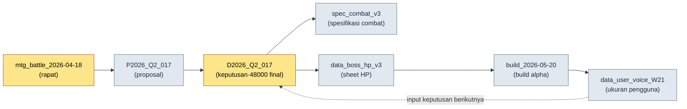

# 24.4 Pelacakan Sumber dan Data Lineage

> Momen kita mulai meragukan sebuah data selalu datang terlambat. Baru setelah angka yang salah masuk ke build live, kita mulai bertanya, "Ini datang dari mana?"

---

Pada Jumat malam tepat sebelum build alpha, rekan tim B datang ke meja saya. Di tangannya ada laptop yang menampilkan spreadsheet balancing combat. "Pak Direktur, di sheet, HP fase 1 bos tertulis 48,000, tapi nilai yang masuk ke build adalah 52,000. Yang mana yang benar?"

Saya tidak tahu. Lebih tepatnya — saat itu juga, tidak ada satu orang pun yang tahu. Bisa jadi 52,000 di sheet adalah nilai terbaru yang mencerminkan keputusan rapat beberapa hari lalu, atau bisa juga seseorang sekadar memasukkan nilai yang belum terverifikasi untuk sementara. Bisa jadi 48,000 adalah nilai yang disepakati sebelum rapat itu. Kedua angka itu sama-sama masuk akal. Dan "masuk akal" bukanlah dasar.

Untuk menjawab pertanyaan ini, kita harus menelusuri kembali ke sumbernya. Di rapat mana hal ini diputuskan, apa input dari rapat itu, dan siapa yang memindahkannya ke sheet. Namun jika rantai penelusuran itu hanya ada di dalam ingatan manusia, jawabannya menjadi, "Besok saya tanyakan ke rekan tim A." Pada bulan keenam operasional live, pertanyaan-pertanyaan yang belum terjawab seperti ini menumpuk seperti gunung. Data lineage — silsilah dari sebuah data — adalah infrastruktur yang mencegah gunung itu terbentuk.

Intinya satu. Sumber tidak boleh dicatat dengan tangan. Catatan sumber yang dilengkapi manusia secara susulan tidak akan bertahan sebulan. Hanya sumber yang dicatat secara otomatis pada momen data itu dibuat yang akan bertahan.

---

## 24.4.1 Lima Biaya dari Data yang Sumbernya Terputus

Biaya untuk mencatat satu baris `_source_map.tsv` secara otomatis hanya beberapa milidetik. Biaya yang harus dibayar ketika satu baris itu tidak ada menyebar ke lima cabang.

<svg viewBox="0 0 720 300" xmlns="http://www.w3.org/2000/svg" font-family="sans-serif">
  <rect x="280" y="120" width="160" height="60" rx="8" fill="#1f2933" stroke="#0b3d2e"/>
  <text x="360" y="148" fill="#ffffff" font-size="15" text-anchor="middle">Sumber Terputus</text>
  <text x="360" y="168" fill="#9fb3c8" font-size="12" text-anchor="middle">(source tidak tercatat)</text>

  <rect x="20" y="20" width="170" height="44" rx="6" fill="#e8f0fe" stroke="#1967d2"/>
  <text x="105" y="40" fill="#1a1a1a" font-size="12.5" text-anchor="middle">Tak Bisa Diverifikasi</text>
  <text x="105" y="56" fill="#5f6368" font-size="11" text-anchor="middle">"Angka ini dari mana?"</text>

  <rect x="530" y="20" width="170" height="44" rx="6" fill="#e8f0fe" stroke="#1967d2"/>
  <text x="615" y="40" fill="#1a1a1a" font-size="12.5" text-anchor="middle">Perubahan Terlewat</text>
  <text x="615" y="56" fill="#5f6368" font-size="11" text-anchor="middle">Sumber diperbarui→turunan tertinggal</text>

  <rect x="20" y="236" width="170" height="44" rx="6" fill="#fce8e6" stroke="#c5221f"/>
  <text x="105" y="256" fill="#1a1a1a" font-size="12.5" text-anchor="middle">Paparan Hukum</text>
  <text x="105" y="272" fill="#5f6368" font-size="11" text-anchor="middle">Dasar aset eksternal hilang</text>

  <rect x="530" y="236" width="170" height="44" rx="6" fill="#fce8e6" stroke="#c5221f"/>
  <text x="615" y="256" fill="#1a1a1a" font-size="12.5" text-anchor="middle">Diagnosis Insiden Lambat</text>
  <text x="615" y="272" fill="#5f6368" font-size="11" text-anchor="middle">Nilai salah tak bisa ditelusuri</text>

  <rect x="275" y="236" width="170" height="44" rx="6" fill="#fef7e0" stroke="#f29900"/>
  <text x="360" y="256" fill="#1a1a1a" font-size="12.5" text-anchor="middle">Serah Terima Hilang</text>
  <text x="360" y="272" fill="#5f6368" font-size="11" text-anchor="middle">"Kenapa keputusan ini?" tak terjawab</text>

  <line x1="280" y1="135" x2="190" y2="55" stroke="#5f6368" stroke-width="1.5"/>
  <line x1="440" y1="135" x2="530" y2="55" stroke="#5f6368" stroke-width="1.5"/>
  <line x1="280" y1="165" x2="190" y2="245" stroke="#c5221f" stroke-width="1.5"/>
  <line x1="440" y1="165" x2="530" y2="245" stroke="#c5221f" stroke-width="1.5"/>
  <line x1="360" y1="180" x2="360" y2="236" stroke="#f29900" stroke-width="1.5"/>
</svg>

Jebakannya adalah: tidak satu pun dari kelima biaya ini terlihat pada momen data dibuat. Semuanya menagih beberapa minggu kemudian, beberapa bulan kemudian, setelah orangnya berganti. Karena itu, sumber tidak bisa menjadi objek dari "nanti saja kita rapikan". Ia harus tercatat pada momen pembuatannya.

---

## 24.4.2 _source_map.tsv — Kerangka Standar Pemetaan Sumber

File pemetaan sumber yang dioperasikan di Proyek A hanya satu, yaitu `_source_map.tsv`. Alasan memakai teks dengan pemisah tab sederhana. Manusia bisa membaca satu baris dengan mata, skrip dapat mem-parsing-nya hanya dengan sekali `split('\t')`, dan git diff menampilkan perubahan satu baris dengan rapi. CSV akan rusak jika ada koma di dalam isinya, dan JSON sulit dibaca manusia per barisnya.

```tsv
asset_id	source_type	source	created	creator	notes
spec_combat_v3	internal	mtg_battle_2026-04-18	2026-04-18	teammate_a	Dasar decision_D2026_Q2_017
data_boss_hp_v3	internal	decision_D2026_Q2_017	2026-04-18	teammate_b	Fase 1 48000 final
asset_K_001_concept	internal_ai_assisted	imagegen + perbaikan teammate_b	2026-04-20	teammate_b	legal_review selesai
data_user_voice_W21	external_aggregated	forum + community + sns	2026-05-25	auto_collect	Hasil pipeline 13.1
ref_visual_tone_a	external_reference	refgame (2024)	2026-04-15	teammate_c	Referensi visual tone, tanpa peminjaman langsung
```

Peran enam kolom ini jelas. `asset_id` adalah kunci unik data, `source_type` adalah klasifikasi (dibahas di bawah), `source` adalah lokasi sumbernya — ID rapat, ID keputusan, pipeline pengumpulan, atau judul karya eksternal, `created`/`creator` adalah kapan dan oleh siapa, dan `notes` adalah satu baris konteks yang bisa dibaca manusia.

Jika kita lihat lagi baris kedua dan ketiga di sini, jawaban atas pertanyaan rekan tim B di subbab sebelumnya menjadi terlihat. Sumber dari `data_boss_hp_v3` adalah `decision_D2026_Q2_017`, dan di notes tertulis "Fase 1 48000 final". Angka 52,000 di build tidak ada dalam lineage ini. Artinya, 52,000 adalah nilai sementara yang belum terverifikasi, dan jawaban yang benar adalah 48,000. Pertanyaan itu tertutup dalam 1–2 menit. Tanpa memanggil ingatan manusia, dan tanpa merusak Jumat malam.

Namun ada satu aturan lagi yang melekat pada file ini. Jika seseorang mengedit `_source_map.tsv` dengan tangan, audit dari `integrity_check` akan menghasilkan FAIL. Alasannya dibahas di subbab berikutnya — karena sumber harus dicatat hanya secara otomatis.

---

## 24.4.3 5 Jenis source_type — Klasifikasi yang Langsung Menjadi Aturan Penanganan

Alasan mengklasifikasikan sumber ke dalam lima jenis bukan karena obsesi merapikan. Sebabnya adalah setiap source_type membawa aturan operasional yang berbeda.

<svg viewBox="0 0 720 270" xmlns="http://www.w3.org/2000/svg" font-family="sans-serif">
  <rect x="20" y="20" width="210" height="48" rx="6" fill="#e6f4ea" stroke="#137333"/>
  <text x="32" y="40" fill="#1a1a1a" font-size="13" font-weight="bold">internal</text>
  <text x="32" y="58" fill="#5f6368" font-size="11">Rapat·proposal·keputusan → hanya lacak</text>

  <rect x="20" y="76" width="210" height="48" rx="6" fill="#e6f4ea" stroke="#137333"/>
  <text x="32" y="96" fill="#1a1a1a" font-size="13" font-weight="bold">internal_ai_assisted</text>
  <text x="32" y="114" fill="#5f6368" font-size="11">AI buat+perbaikan manusia → sumber wajib</text>

  <rect x="20" y="132" width="210" height="48" rx="6" fill="#fef7e0" stroke="#f29900"/>
  <text x="32" y="152" fill="#1a1a1a" font-size="13" font-weight="bold">external_aggregated</text>
  <text x="32" y="170" fill="#5f6368" font-size="11">Ukuran pengguna → tgl·sampel wajib</text>

  <rect x="20" y="188" width="210" height="48" rx="6" fill="#fce8e6" stroke="#c5221f"/>
  <text x="32" y="208" fill="#1a1a1a" font-size="13" font-weight="bold">external_reference</text>
  <text x="32" y="226" fill="#5f6368" font-size="11">Karya pihak lain → legal_review wajib</text>

  <rect x="20" y="244" width="210" height="22" rx="6" fill="#e8f0fe" stroke="#1967d2"/>
  <text x="32" y="259" fill="#1a1a1a" font-size="12" font-weight="bold">self_measured</text>

  <rect x="280" y="20" width="420" height="246" rx="8" fill="#f8f9fa" stroke="#dadce0"/>
  <text x="300" y="48" fill="#1a1a1a" font-size="13" font-weight="bold">Klasifikasi → Pemetaan Aturan Penanganan</text>
  <text x="300" y="78" fill="#3c4043" font-size="12">internal: lolos jika bisa ditelusuri lewat ID keputusan</text>
  <text x="300" y="104" fill="#3c4043" font-size="12">ai_assisted: notes wajib sebut alat·prompt mana</text>
  <text x="300" y="130" fill="#3c4043" font-size="12">aggregated: tanpa waktu pengumpulan, angka tak terbaca</text>
  <text x="300" y="156" fill="#c5221f" font-size="12">reference: legal_review kosong → audit FAIL ← dipaksa</text>
  <text x="300" y="182" fill="#3c4043" font-size="12">self_measured: sim/KPI, notes kondisi reproduksi disarankan</text>
  <text x="300" y="222" fill="#5f6368" font-size="11.5">→ source_type bukan label, melainkan</text>
  <text x="300" y="242" fill="#5f6368" font-size="11.5">  switch yang dibaca dan dicabangkan pemeriksa</text>
</svg>

Mari lihat satu baris `external_reference`. Jika aset itu melihat refgame sebagai referensi visual tone, aset ini tidak boleh masuk ke build tanpa tinjauan hukum. Jika source_type-nya `external_reference` tetapi catatan legal_review kosong, audit akan menghentikannya. Inilah titik di mana label tidak berhenti sekadar sebagai label, melainkan menjadi switch yang dibaca pemeriksa. Ketika kita bilang klasifikasi 5 jenis adalah kerangka kepercayaan operasional, yang dimaksud adalah daya paksa ini.

---

## 24.4.4 Pencatatan Otomatis — Satu Baris yang Ditinggalkan pada Momen Pembuatan

Sekarang bagian intinya. Sumber harus dicatat secara otomatis pada momen pembuatan data. `source_tracker.py` di Proyek A terpasang pada hook pembuatan aset.

```python
# source_tracker.py
import time, getpass, csv
from pathlib import Path

SOURCE_MAP = Path("_source_map.tsv")
VALID_TYPES = {
    "internal", "internal_ai_assisted",
    "external_aggregated", "external_reference", "self_measured",
}

def track_source(asset_id: str, source_type: str, source: str, notes: str = ""):
    if source_type not in VALID_TYPES:
        raise ValueError(f"unknown source_type: {source_type}")
    if source_type == "external_reference" and "legal_review" not in notes:
        raise ValueError(f"{asset_id}: aset external_reference wajib mencantumkan legal_review")

    record = [
        asset_id,
        source_type,
        source,
        time.strftime("%Y-%m-%d"),
        getpass.getuser(),
        notes,
    ]
    with SOURCE_MAP.open("a", encoding="utf-8", newline="") as f:
        csv.writer(f, delimiter="\t").writerow(record)
```

Jika fungsi ini terpasang pada pipeline pembuatan aset — saat sheet di-export, saat aset konsep didaftarkan, saat data pengguna diagregasi — satu baris sumber akan otomatis di-append. Tidak ada tahap yang bisa dilupakan manusia. Beban pelengkapan susulan mendekati 0.

Hal yang mengisi kolom `creator` secara otomatis dengan `getpass.getuser()` memang kecil, tetapi menentukan. Jika manusia disuruh menulis namanya sendiri, akan muncul kolom kosong. Jika sistem yang menulisnya, tidak ada kolom kosong. Dan jika `external_reference` tidak memiliki legal_review, pencatatannya sendiri ditolak — jalur masuk aset eksternal tanpa sumber ke dalam sistem diblokir.

Di sini saya catat wujud nyata pemanfaatan AI. Saya menerima draf awal fungsi `track_source` ini dari Claude. Berikut adalah salah satu tulang punggung dari worked transcript (rekaman sesi nyata) tersebut.

**Prompt saya (lengkap):**

```
Tuliskan fungsi Python yang mem-append satu baris sumber ke _source_map.tsv.
Kolom: asset_id, source_type, source, created (tanggal hari ini),
creator (pengguna OS saat ini), notes. Dipisah tab.
Batasi source_type menjadi 5 jenis: internal, internal_ai_assisted,
external_aggregated, external_reference, self_measured.
```

**Keluaran mentah Claude (tidak diringkas):**

```python
import csv, datetime, os

def track_source(asset_id, source_type, source, notes=""):
    record = [asset_id, source_type, source,
              datetime.date.today().isoformat(),
              os.getlogin(),          # ← pengguna saat ini
              notes]
    with open("_source_map.tsv", "a", newline="") as f:
        csv.writer(f, delimiter="\t").writerow(record)
```

> Jika Anda ingin menambahkan validasi source_type, Anda bisa membuat himpunan VALID_TYPES
> dan memeriksanya di awal fungsi. Apakah perlu saya tambahkan?

**Verifikasi dan penolakan saya:**

Keluaran ini memang berfungsi, tetapi pada dua tempat tidak cocok dengan operasional kami. Pertama, `os.getlogin()` jika dipanggil dari cron atau CI bisa melempar string kosong atau memunculkan exception tergantung lingkungannya. Pipeline export kami juga berjalan dengan jadwal tanpa pengawasan. Karena itu saya menggantinya dengan `getpass.getuser()` — yang menangkap pengguna lebih stabil dengan membaca environment variable. Kedua, Claude membiarkan validasi source_type sebagai pilihan dengan "apakah perlu saya tambahkan", padahal bagi kami itu bukan pilihan melainkan keharusan. Tanpa validasi, source_type yang salah ketik akan masuk dan klasifikasi pun runtuh.

**Permintaan ulang saya:**

```
Ganti dengan getpass.getuser(). Lalu tanamkan validasi source_type ke dalam
fungsi sebagai keharusan, bukan pilihan. Tambahan, jika tipenya external_reference
tetapi notes tidak memuat string legal_review, lempar ValueError.
Saya ingin memblokir di sumbernya pencatatan aset eksternal tanpa tinjauan hukum.
```

Hasil dari permintaan ulang ini adalah `source_tracker.py` final yang dimuat di atas. Yang perlu ditekankan bukan karena keluaran pertama Claude salah, melainkan karena penolakan dan permintaan ulang diperlukan justru karena saya mengetahui kendala operasional yang tidak diketahui AI — jadwal tanpa pengawasan, pemaksaan legal_review. AI memberikan kode yang umumnya benar dengan cepat, dan manusia memverifikasi "apakah ini benar di lingkungan kami". Titik verifikasi itulah yang kemudian menjadi keputusan desain dari sistem pelacakan sumber.

---

## 24.4.5 audit FAIL — Pemeriksaan Integritas yang Mencegah Pengeditan Manual

Tadi saya katakan bahwa jika seseorang mengedit `_source_map.tsv` dengan tangan, `integrity_check` akan menghasilkan FAIL. Bagaimana cara menangkapnya?

Prinsipnya sederhana. Setiap kali `track_source` mem-append satu baris, kolom inti dari baris itu (asset_id, source_type, source, created, creator) diserialisasi untuk membuat hash, lalu diakumulasi ke file `.source_map.audit` terpisah. Pemeriksaan audit membaca ulang `_source_map.tsv`, menghitung ulang hash dengan cara yang sama, lalu membandingkan kedua daftar hash.

```python
# Bagian audit source_map di dalam integrity_check
def audit_source_map():
    fails = []
    rows = read_tsv(SOURCE_MAP)
    expected = read_lines(AUDIT_FILE)   # hash terakumulasi saat append

    for i, row in enumerate(rows):
        h = row_hash(row["asset_id"], row["source_type"],
                     row["source"], row["created"], row["creator"])
        if i >= len(expected) or h != expected[i]:
            fails.append(f"L{i+1} {row['asset_id']}: dugaan edit manual (hash tidak cocok)")

    if len(rows) != len(expected):
        fails.append(f"jumlah baris tidak cocok: tsv={len(rows)} audit={len(expected)}")
    return fails
```

Misalkan seseorang mengubah source dari `data_boss_hp_v3` di sheet dengan tangan menjadi `decision_D2026_Q2_099`. Hash baris itu akan menyimpang dari hash asli yang terakumulasi di audit, dan pemeriksaan akan menampilkan hal berikut.

```
[FAIL] source_map audit
  L3 data_boss_hp_v3: dugaan edit manual (hash tidak cocok)
  → Perubahan yang tidak melewati track_source(). Sumber hanya dicatat lewat jalur kode.
```

Mengapa pemaksaan ini penting? Jika edit manual diizinkan, pada akhirnya seseorang yang sedang terburu-buru akan mengisi sumber secara "masuk akal". Pada momen itu, lineage merosot dari kebenaran menjadi file yang memuat tebakan seseorang. audit FAIL memberi taring pada aturan "sumber hanya lewat jalur otomatis". Sistem verification di §24.1 mengikat audit ini bersama pemeriksaan lain dan menjalankannya di CI.

---

## 24.4.6 Propagasi Perubahan — Jika Sumber Berubah, Bangunkan Turunannya

Alasan sesungguhnya mencatat sumber secara otomatis ada pada kueri arah balik. "Sumber X telah berubah. Apa saja yang terdampak?"

```python
def find_derivatives(source_id: str):
    return [
        row for row in read_tsv(SOURCE_MAP)
        if row["source"] == source_id
    ]

# Penggunaan: decision_D2026_Q2_017 dibatalkan di rapat
deps = find_derivatives("decision_D2026_Q2_017")
# → [spec_combat_v3, data_boss_hp_v3, ...]
```

Misalkan `decision_D2026_Q2_017` dibatalkan di rapat berikutnya sehingga HP fase 1 bos berubah dari 48,000 menjadi 50,000. Jika kita memanggil `find_derivatives`, semua aset turunan yang bergantung pada keputusan ini langsung muncul — dokumen spesifikasi combat, sheet data HP. Notifikasi dikirim ke penanggung jawab tiap aset, dan insiden "aset yang masih memandang keputusan lama" tertinggal di build berkurang dari beberapa kasus per kuartal menjadi hampir 0.

Dengan sumber yang dicatat dengan tangan, kueri arah balik ini tidak akan berfungsi. Jika sumber berupa teks bebas, `decision_D2026_Q2_017` akan tertulis di satu baris sebagai "keputusan Q2 017", di baris lain sebagai "keputusan rapat ke-17 kuartal 2", sehingga pencocokannya rusak. Hanya dengan format standar `_source_map.tsv` dan pencatatan otomatis `track_source` barulah propagasi perubahan dapat bekerja.

---

## 24.4.7 Graf lineage — Silsilah Data dalam Satu Layar

`_source_map.tsv` terlihat datar jika dibaca baris demi baris, tetapi ketika source dari satu aset menjadi source bagi aset lain, silsilah data membentuk sebuah rantai. Jika rantai itu kita bentangkan dalam satu layar, kepercayaan input dari sebuah keputusan menjadi terlihat. mermaid ini ditarik langsung oleh pipeline pembangkitan diagram otomatis di §24.2 dengan membaca `_source_map.tsv` — semacam membuktikan aset sendiri dengan teknik sendiri.



Sebuah siklus muncul secara alami. Build melahirkan data pengguna, dan data pengguna menjadi input bagi keputusan berikutnya. Jika siklus ini terlihat, "angka ini datang dari mana" menjadi sebuah jalur di atas layar. Pertanyaan rekan tim B di hari Jumat pun, dalam graf ini, adalah perkara menelusuri `Data → Decision` sekali ke atas.

---

## 24.4.8 Pengukuran — Efek dari Operasional lineage

Saya membandingkan kondisi sebelum dan sesudah penerapan sistem lineage di Proyek A. Nilai waktu di bawah adalah perkiraan penulis (belum terverifikasi), dan yang harus dilihat adalah perbedaan arah dan rasionya, bukan nilai absolutnya. Jumlah kasus adalah hasil pengukuran nyata yang diagregasi dari log audit kuartalan.

| Item | Tanpa lineage | Dengan lineage | Sifat |
|---|---|---|---|
| Waktu memastikan sumber data | 1\~2 jam | 1\~2 menit | perkiraan penulis (belum terverifikasi) |
| Dasar verifikasi kepercayaan data | Ingatan senior | Pencarian sumber instan | kualitatif |
| Turunan terlewat saat sumber berubah | 5\~8 kasus/kuartal | 0\~1 kasus | pengukuran nyata log audit |
| Tinjauan hukum aset eksternal terlewat | Mungkin terjadi | 0 kasus (pencatatan dipaksa) | pengukuran nyata log audit |
| Durasi audit kuartalan | 1\~2 hari | 2\~3 jam | perkiraan penulis (belum terverifikasi) |

Angka yang paling kokoh adalah baris "turunan terlewat saat sumber berubah". Ini bisa dihitung karena ID keputusan dan aset turunan yang terlewat tertinggal apa adanya di log audit. Nilai waktu sangat dipengaruhi lingkungan pengukuran (ukuran tim·jumlah aset), jadi saya tandai sebagai perkiraan. Arahnya jelas — ketika sumber dicatat otomatis, pelacakan berubah dari ingatan menjadi pencarian.

---

## 24.4.9 Kegagalan Umum dan Resepnya

| Pola Kegagalan | Resep |
|---|---|
| Sumber diisi dengan tangan secara susulan | Pencatatan otomatis pada momen pembuatan dengan `track_source` |
| Format sumber berbeda-beda tiap baris | Standar tab `_source_map.tsv` + pemaksaan format |
| Tinjauan hukum aset eksternal terlewat | legal_review dipaksa di validasi source_type |
| Edit manual `_source_map.tsv` | Perbandingan hash via audit `integrity_check` → FAIL |
| Turunan terabaikan saat sumber berubah | Kueri arah balik `find_derivatives` + notifikasi |
| Silsilah hanya dijelaskan dengan kata-kata | Visualisasi satu layar via pembangkitan mermaid otomatis |

Kesamaan dari enam resep ini adalah tidak bergantung pada ketelitian manusia. Pencatatan otomatis, pemaksaan format, perbandingan hash, dan kueri arah balik semuanya dikerjakan sistem. Karena satu-satunya alasan pelacakan sumber runtuh adalah "manusia lupa".

---

## 24.4.10 Menutup Bagian 24

Bagian 24 adalah empat cabang yang menopang kepercayaan operasional dengan otomatisasi. Bab 1 mengumpulkan verifikasi ke satu titik dengan verification, bab 2 menggambar struktur dengan pembangkitan mermaid otomatis, bab 3 menghubungkan dan menghierarkikan dokumen dengan wikilink dan document hierarchy, dan terakhir di bab 4 ini, kepercayaan data disegel dengan sumber dan silsilah.

Satu kalimat yang menembus keempat bab ini adalah ini. **Kepercayaan operasional datang dari catatan sistem, bukan dari ingatan manusia.** Sebagaimana verification secara otomatis bertanya "apakah produk ini sesuai aturan", lineage secara otomatis menjawab "data ini datang dari mana". Inti dari keduanya adalah sama-sama tidak runtuh meskipun manusia lupa.

Pengetahuan operasional ini membentuk pola yang sama dengan filosofi Layer terintegrasi di seluruh buku ini. Sebuah rantai satu baris di mana visi (asetisasi·kepercayaan) turun menjadi sistem (aturan sumber), sistem menjadi data (`_source_map.tsv`), dan data menjadi build·QA (audit·pembaruan otomatis). Rantai itu sendiri adalah lineage.

---

### Poin-Poin Penting
- Sumber harus dicatat secara otomatis pada momen pembuatan, dan sumber yang dilengkapi secara susulan tidak akan bertahan sebulan.
- Standar `_source_map.tsv` dan 5 jenis source_type adalah kerangka dari propagasi perubahan dan pemaksaan hukum.
- Edit manual harus dicegah dengan audit FAIL agar lineage tetap menjadi kebenaran.

---

## Coba Sendiri (setup → prompt → verify)

**setup.** Di root proyek, buat `_source_map.tsv` dengan satu baris header (`asset_id\tsource_type\tsource\tcreated\tcreator\tnotes`), dan taruh `source_tracker.py` di atas. Pasang panggilan `track_source(...)` di akhir skrip export·pendaftaran aset.

**prompt.** Jika Anda membutuhkan fungsi pencatatan sumber otomatis, mintalah ke Claude seperti ini.

```
Tuliskan fungsi Python yang mem-append satu baris ke _source_map.tsv
(dipisah tab, kolom: asset_id, source_type, source, created, creator, notes).
Batasi source_type menjadi 5 jenis, dan jika external_reference tetapi notes
tidak memuat legal_review, lempar ValueError. creator dengan getpass.getuser().
```

**verify.** Pastikan langsung dua hal. (1) Panggil dengan `external_reference` tetapi kosongkan notes-nya, dan cek apakah muncul ValueError. (2) Ubah satu huruf di kolom source `_source_map.tsv` dengan editor teks, lalu jalankan audit source_map dari `integrity_check` dan cek apakah muncul FAIL. Jika keduanya terblokir, berarti jalur sumber sudah tertutup.

### Versi Ringkas Solo
Jika Anda bekerja sendiri, satu file `_source_map.tsv` dan satu fungsi `track_source` sudah cukup. integrity audit, kueri arah balik, dan otomatisasi mermaid bisa Anda pasang satu per satu ketika aset melampaui puluhan dan sumbernya mulai membingungkan. Awalnya cukup satu kebiasaan ini: "saat menulis angka, tinggalkan satu baris sumber secara otomatis di tempat yang sama".
