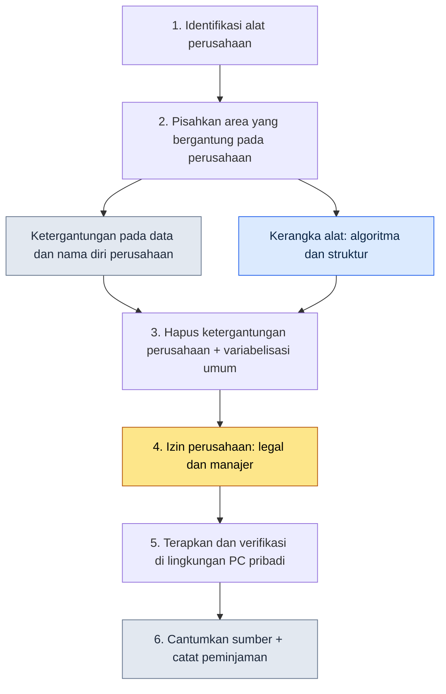

# Lampiran B. Prosedur Peminjaman Alat (Menggeneralisasi dari Perusahaan ke Penggunaan Pribadi)

> Lampiran ini merangkum prosedur yang saya gunakan untuk membawa alat dan skill yang saya buat dan operasikan di proyek perusahaan, Proyek A, ke PC pribadi dan pekerjaan umum, lalu memakainya kembali. Pertanyaan intinya hanya satu. "Bagaimana cara membawa secara sah hanya kerangka alat yang saya pelajari di sana, tanpa melanggar aset pengetahuan perusahaan?" Lampiran ini menunjukkan bagaimana saya menarik garis batas itu, apa yang saya bawa dan apa yang saya tinggalkan, serta bagaimana saya mendokumentasikan keputusan tersebut.

Cara membaca lampiran ini begini. Pertama, bacalah lima prinsip di B.1 sambil mencocokkannya dengan situasi Anda sendiri, lalu ikuti prosedur di B.3 persis seperti adanya satu kali. Setelah itu, salin format catatan di B.4 dan isi sesuai alat yang ingin Anda bawa. Karena ini menyangkut penanganan aset perusahaan, "agar bisa ditinggalkan sebagai catatan" lebih diutamakan ketimbang "cepat", dan seluruh lampiran ini disusun dengan sudut pandang itu.

---

## B.1 Lima Prinsip Peminjaman

Berikut lima prinsip yang saya sepakati sebelum membawa sebuah alat. Kelimanya bukan urutan, melainkan syarat yang harus dipenuhi secara bersamaan; jika satu saja runtuh, peminjaman itu sendiri ditangguhkan. Tiga yang pertama adalah batas teknis tentang "apa yang dibawa", dan dua yang terakhir adalah batas prosedural tentang "bagaimana membawanya dengan sah".

| Prinsip | Penjelasan |
|---|---|
| 1. Tanpa IP perusahaan | Hapus nama perusahaan, nama asli, dan nama diri |
| 2. Hanya bawa kerangka alat | Blokir data domain perusahaan |
| 3. Rekonstruksi generalisasi | Buat ulang menjadi kasus penggunaan umum |
| 4. Kutipan dan sumber jelas | Cantumkan bahwa alat ini dipinjam dari perusahaan |
| 5. Persetujuan legal dan SDM | Lalui prosedur izin perusahaan |

Baris yang paling sering goyah adalah nomor 2. Algoritma dan struktur (kerangka) boleh dibawa, tetapi jika format data perusahaan yang menjadi prasyarat kerangka itu ikut terbawa, pada saat itu juga sama saja dengan membawa IP. Pekerjaan memisahkan kerangka dari data adalah inti dari peminjaman itu sendiri.

---

## B.2 Enam Alat dan Skill yang Dipinjam

Sesuai prinsip, alat yang benar-benar saya bawa ke PC pribadi ada enam (per Mei 2026). Semuanya punya kesamaan, yaitu alat yang menangani data, dan itu bukan kebetulan. Alat pengolah data relatif lebih mudah dipisahkan antara kerangka (logika parsing, transformasi, visualisasi) dan domain (format konkret sheet perusahaan).

| Alat | Asli Perusahaan | Versi Umum Pribadi |
|---|---|---|
| excel-reader | Ekstraksi sheet xlsm dan VBA | Pengolahan Excel umum |
| relation-map-gen | HTML relasi FK | Diagram relasi data umum |
| schema-doc | Membuat skema Markdown dari sheet | Dokumentasi skema umum |
| table-creator | Produksi tabel data | Pembuatan tabel umum |
| gdd-gen | Pembuatan GDD otomatis | Pembuatan dokumen umum |
| gdd-export | Konversi dari Markdown ke xlsx multi-sheet | Konversi xlsx umum |

Jika Anda bandingkan kolom tengah dan kanan pada tabel, akan tampak apa arti generalisasi. Sebelah kiri adalah nama yang mengandung domain seperti "sheet perusahaan" dan "GDD", sedangkan sebelah kanan adalah nama yang telah membuang domain seperti "Excel umum" dan "dokumen umum". Hilangnya perusahaan dari nama adalah tanda pertama generalisasi.

---

## B.3 Prosedur Peminjaman

Jika prinsip (B.1) dipindahkan menjadi gerakan tangan nyata, hasilnya adalah enam langkah berikut. Titik cabang yang paling penting adalah langkah 2 dan langkah 4. Jika di langkah 2 kerangka dan domain tidak dipisahkan dengan bersih, semua langkah berikutnya akan terkontaminasi, dan jika izin perusahaan di langkah 4 dilewati, sebagus apa pun alat itu dibuat, ia menjadi alat yang tidak bisa dipakai.



Di antara keenam langkah, kolom yang paling memakan waktu bukanlah pekerjaan kode (langkah 2 dan 3), melainkan langkah 4, yaitu kesepakatan perusahaan dan lolos pemeriksaan legal. Artinya, bukan teknologi melainkan kepercayaan yang menjadi gerbang terbesar, dan karena itu peminjaman selalu dilakukan dengan urutan menyepakati persetujuan lebih dahulu lalu menyempurnakan kode kemudian.

---

## B.4 Catatan Peminjaman

Alat yang dipinjam wajib disertai catatan. Sebab, suatu saat bisa muncul pertanyaan, "Dari mana alat ini berasal, apa yang dihapus, dan dari siapa izinnya diperoleh." Berikut adalah format catatan dengan excel-reader sebagai contoh; Anda bisa menyalin kerangka ini apa adanya dan mengisinya sesuai alat Anda sendiri.

```yaml
---
tool: excel-reader (versi umum pribadi)
original_source: Proyek A perusahaan
adopted: 2026-05
permission: Manajer perusahaan + lolos legal
modifications:
  - Hapus ketergantungan pada format sheet perusahaan
  - Hapus fungsi domain perusahaan (VBA xlsm)
  - Generalisasi menjadi pengolahan csv/xlsx umum
  - Hapus seluruh referensi nama perusahaan dan nama asli
usage_in_book: Kutipan kasus alat di buku ini (Bagian 1, 5, 6, 8, dll.)
---
```

Kolom tanggal pada format (`adopted`) ditulis sebagai tahun-bulan yang sudah pasti seperti `2026-05`. Penulisan bebas seperti "sekitar Mei 2026" tampak seperti kolom kosong yang akan diisi nanti, jadi tetapkanlah saat itu juga titik waktu ketika peminjaman dipastikan.

Baris yang paling berharga dalam catatan ini adalah `permission` dan `modifications`. Baris pertama membuktikan bahwa peminjaman itu sah, baris kedua membuktikan apa yang telah dilepaskan. Jika kedua baris ini ada, sekalipun kelak muncul keraguan, masih tersisa dasar untuk menelusurinya.

---

## B.5 Alat yang Tidak Dipinjam

Sama pentingnya dengan apa yang dibawa, apa yang ditinggalkan juga penting. Saya mencatat alat-alat perusahaan yang sengaja tidak dipinjam beserta alasannya. Kesamaan dari alat-alat yang ditinggalkan adalah bahwa mereka merupakan IP inti perusahaan atau terikat dalam pada struktur organisasi perusahaan, sehingga kerangka dan domainnya tidak dapat dipisahkan.

| Alat | Alasan tidak dipinjam |
|---|---|
| Alat sistem combat perusahaan | IP inti perusahaan, eksklusif perusahaan |
| Alat dokumen naratif perusahaan | Bergantung pada worldbuilding perusahaan |
| Alat TF combat perusahaan | Bergantung pada struktur organisasi perusahaan |
| Alat SDM dan keuangan perusahaan | Tidak cocok dengan lingkungan eksternal |

Ini persis berkontras dengan alat-alat yang dibawa di B.2 yang semuanya merupakan "pengolahan data". Yang dibawa adalah alat yang terpisahkan dari domain, dan yang ditinggalkan adalah alat yang menyatu dengan domain. Kemungkinan pemisahan itulah yang menentukan kemungkinan peminjaman.

---

## B.6 Catatan untuk Pembaca — Daftar Periksa Mandiri Sebelum Meminjam

Terakhir, berikut lima poin yang harus Anda loloskan sendiri sebelum membawa sebuah alat. Tabel ini adalah daftar periksa yang memilah lulus/tidak lulus; pinjamlah hanya ketika kelima poin lolos semua, dan tangguhkan jika satu poin saja tersangkut. Tidak ada "secara umum baik-baik saja". Sebab dalam menangani aset perusahaan, lolos sebagian tidak berlaku.

| Poin Periksa | Kriteria Lulus |
|---|---|
| Apakah izin perusahaan sudah diperoleh | Persetujuan eksplisit manajer dan legal |
| Apakah lolos tinjauan legal | Konfirmasi tertulis atau terekam |
| Apakah IP perusahaan sudah dihapus sepenuhnya | Pemeriksaan grep watchlist 0 temuan |
| Apakah keumumannya sudah diverifikasi | Konfirmasi berfungsi di lingkungan lain |
| Apakah ada prosedur penanganan saat insiden | Jalur penelusuran dan penarikan terdefinisi |

Mohon jangan membaca lima poin ini sebagai lima kolom yang harus lolos, melainkan sebagai lima kunci pengaman. Membawa secara sah apa yang dipelajari di perusahaan menjadi aset pribadi memang jelas mungkin dilakukan, tetapi keabsahan itu hanya berlaku ketika kelima kunci pengaman ini terpasang semua.
