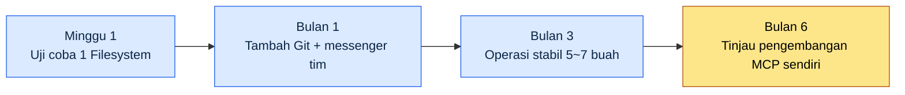

# Lampiran E. Katalog Server MCP (dari Sudut Pandang Game Designer)

MCP (Model Context Protocol) adalah jalur yang menghubungkan LLM ke alat dan data eksternal dengan cara yang terstandar. Pada Bagian 20 saya membahas MCP untuk manajemen proyek, tetapi server MCP yang bisa ditarik ke alur kerja game design jauh lebih banyak dari itu. Lampiran ini mengumpulkan kandidat-kandidat tersebut agar terlihat sekilas, dan memberi prioritas tentang urutan adopsi yang baik — sebuah katalog.

Tujuan katalog ini bukan "pasang semuanya", melainkan "tahu di mana harus memilih saat dibutuhkan". Kalau Anda memasang banyak MCP sekaligus, Anda tidak akan bisa membedakan mana yang menimbulkan masalah. Ikuti siklus adopsi di E.4 dan tambahkan satu per satu.

Cara memakainya begini. Pada awalnya, lihat hanya daftar P0 di E.2.1. Setelah dasar-dasarnya mapan, lanjut ke E.2.2 (P1), dan ketika muncul kebutuhan khusus tim, pertimbangkan E.2.3 (P2) atau E.3 (pengembangan sendiri). Kalau biaya jadi perhatian, lihat E.5 lebih dulu; kalau ingin bersiap menghadapi gangguan, lihat E.6 lebih dulu.

---

## E.1 Empat Wilayah Pemanfaatan MCP

Server MCP secara garis besar terbagi menjadi empat kelompok berdasarkan target koneksinya. Sebagian besar alat yang setiap hari dipakai bolak-balik oleh seorang Game Designer masuk ke dalam empat kelompok ini.

| Wilayah | Server MCP |
|---|---|
| Manajemen proyek | ClickUp, JIRA, Linear |
| Dokumen | Confluence, Notion, Google Drive |
| Kolaborasi | Messenger tim (Slack, Discord, dll.) |
| Data | Excel, Google Sheets, DB |

Manajemen proyek mengarah ke task dan jadwal, dokumen ke GDD dan wiki, kolaborasi ke komunikasi tim, dan data ke sheet balance dan item. Kalau Anda lebih dulu memetakan alat yang sudah dipakai tim Anda termasuk ke wilayah mana, kandidat untuk diadopsi otomatis menyempit.

---

## E.2 Server MCP yang Direkomendasikan (Prioritas Game Design)

Prioritas saya tetapkan berdasarkan "apakah pekerjaan akan macet tanpanya". P0 adalah fondasi bagi hampir semua pekerjaan, P1 sangat memudahkan kalau ada, dan P2 dipilih sesuai situasi tim.

### E.2.1 P0 — Adopsi Lebih Dulu

| Server | Kegunaan | Catatan |
|---|---|---|
| Filesystem MCP | Akses file lokal | Dasar |
| Git MCP | Pelacakan perubahan | Wajib |
| MCP messenger tim | Komunikasi tim | Disarankan |
| MCP alat kolaborasi (ClickUp, JIRA, dll.) | Task | Alat perusahaan |

Filesystem dan Git adalah fondasi yang membuat LLM bisa membaca materi dan menelusuri riwayat perubahan, jadi pasanglah keduanya paling awal. MCP messenger tim menarik konteks tim, dan alat task cukup menghubungkan apa yang sudah dipakai perusahaan (entah ClickUp entah JIRA) apa adanya.

### E.2.2 P1 — Adopsi Tambahan

| Server | Kegunaan |
|---|---|
| MCP wiki (Confluence, Notion, dll.) | Wiki |
| Google Drive MCP | Materi berbagi eksternal |
| Excel MCP | Pengecekan sheet langsung |
| Mermaid MCP | Render diagram |

Setelah P0 stabil, perluas ke sisi dokumen dan data. Khususnya Excel MCP membuat LLM bisa langsung memeriksa sheet balance, sehingga sangat berguna dalam game design. Mermaid MCP me-render diagram desain di tempat sehingga tidak memutus alur pendokumentasian.

### E.2.3 P2 — Opsional

| Server | Kegunaan |
|---|---|
| Discord MCP | Komunitas pengguna |
| GitHub MCP | Kolaborasi eksternal |
| Linear MCP | Alat task alternatif |
| Notion MCP | Wiki alternatif |

P2 adalah alternatif atau khusus untuk situasi tertentu. Kalau Anda mengelola komunitas pengguna, pasang Discord; kalau kolaborasi eksternal sering terjadi, pasang GitHub. Linear dan Notion adalah pengganti dari alat yang sudah Anda adopsi, jadi tidak perlu dipasang secara berlebihan.

---

## E.3 MCP Khusus Game (Dikembangkan Sendiri oleh Penulis)

Celah yang tidak terisi oleh MCP komersial dibuat sendiri. Berikut adalah MCP yang penulis kembangkan sendiri agar pas dengan alur kerja game design. Semuanya bertujuan agar sistem yang dibahas di tubuh buku (atom, decision card, notula rapat) bisa langsung dilihat dari LLM.

| Server | Kegunaan |
|---|---|
| Atom MCP | Pencarian dan pengecekan atom |
| Decision Card MCP | Pengecekan dan pembuatan decision card |
| KPI Dashboard MCP | Data dasbor |
| Meeting Notes MCP | Pencarian notula rapat |

Keempat ini menangani aset internal perusahaan (atom pengetahuan, riwayat keputusan, notula rapat) yang tidak ada pada alat komersial. Pengembangan sendiri cukup membebani, jadi sebaiknya ditunda ke tahap terakhir siklus E.4 dan dimulai saat sudah jelas ada hal yang tidak bisa ditutup oleh MCP komersial.

---

## E.4 Siklus Adopsi MCP

Kalau MCP dipasang sekaligus, sumber masalah jadi sulit terlihat. Siklus di bawah ini menjabarkan prinsip "satu per satu, lanjut yang berikutnya setelah yang sebelumnya stabil" di sepanjang sumbu waktu.

Aturan intinya cuma satu: jangan mengadopsi 5 sekaligus dalam satu waktu. Setiap kali memasang MCP baru, amati beberapa hari apakah yang satu itu berjalan stabil, baru lanjut ke berikutnya.

---

## E.5 Biaya Operasional MCP

| Server | Biaya |
|---|---|
| MCP eksternal (open source) | Hanya infrastruktur |
| Self-hosting | Infrastruktur + operasional |
| MCP komersial | Langganan bulanan |

Struktur biaya terbagi menjadi tiga. MCP open source hanya memerlukan biaya infrastruktur untuk menjalankannya, self-hosting menambahkan biaya tenaga operasional di atas itu, dan MCP komersial menanggung biaya langganan. Saat mengoperasikan 8\~10 buah, biaya bulanan diperkirakan sekitar $50\~200, tetapi angka ini sangat bergantung pada konfigurasi sehingga hanya dipakai sebagai arah.

---

## E.6 Penanganan Insiden

| Insiden | Penanganan |
|---|---|
| Gangguan server MCP | Server inti dioperasikan dengan fallback |
| Insiden hak akses (modifikasi data yang keliru) | Utamakan read-only |
| Kebocoran data | Data sensitif di-self-hosting |
| Lonjakan biaya | cap + pemantauan |

MCP menghubungkan alat eksternal langsung ke LLM, sehingga satu kali tulis yang keliru bisa merusak data sungguhan. Karena itu, secara dasar setel read-only, dan buka hak tulis hanya pada server yang benar-benar memerlukannya. Server inti dibekali fallback untuk berjaga menghadapi gangguan, dan MCP yang menangani data sensitif dijalankan dengan self-hosting alih-alih eksternal. Biaya ditahan bersama-sama dengan batas atas (cap) dan pemantauan.

---

## E.7 Daftar Pemeriksaan Mandiri Sebelum Adopsi

Kalau subbab-subbab sebelumnya membahas "apa, dengan urutan apa, dengan biaya berapa" yang dipasang, tabel ini mengumpulkan item-item yang harus Anda loloskan sendiri tepat sebelum benar-benar memasang satu MCP. Alih-alih membaca ulang katalog dari awal, setiap kali menambah MCP baru cukup periksa ulang lima baris ini. Kelima item ini masing-masing memadatkan aturan inti dari subbab sebelumnya menjadi satu baris.

| Item pemeriksaan | Kriteria lolos | Subbab acuan |
|---|---|---|
| Termasuk wilayah mana | Jelas masuk ke salah satu dari manajemen proyek, dokumen, kolaborasi, atau data | E.1 |
| Apakah prioritas yang dibutuhkan sekarang | Menjaga urutan P0 dulu stabil, baru P1, lalu P2 | E.2 |
| Apakah dipasang satu per satu | Tidak mengadopsi beberapa sekaligus dalam satu waktu | E.4 |
| Apakah hak aksesnya minimal | Secara dasar read-only, hak tulis hanya pada server yang benar-benar perlu | E.6 |
| Apakah ada batas biaya | Memasang batas atas (cap) dan pemantauan secara bersamaan | E.5 |

Di antara kelima item, kolom yang paling sering dilewati adalah "Apakah dipasang satu per satu". Kalau Anda menaikkan beberapa MCP sekaligus, saat masalah muncul Anda tidak bisa membedakan itu kesalahan server yang mana. Pasang MCP itu hanya ketika kelima baris lolos semua, dan kalau satu baris saja tersangkut, tunda server itu ke siklus berikutnya.
