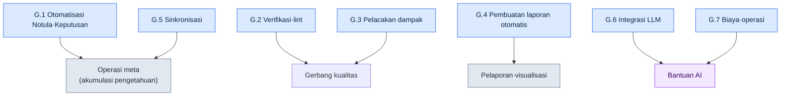

# Lampiran G. Kumpulan Kasus Skrip Operasional

Lampiran ini mengumpulkan dalam satu tempat skrip-skrip otomatisasi operasional yang disebutkan di badan buku. Badan buku menjelaskan "mengapa setiap skrip dibutuhkan" dalam alur ceritanya, tetapi ketika Anda benar-benar hendak membuat alat yang serupa, Anda butuh sebuah peta yang memperlihatkan sekilas "skrip mana saja yang terikat dalam peran apa". Lampiran inilah peta itu.

Saya mencantumkan nama skrip, deskripsi satu baris, beserta di subbab mana di badan buku hal itu dibahas. Untuk skrip inti yang generalisasinya rapi (G.1.1 pemeriksa format, G.2.1 pemeriksa integritas, G.3.1 peta relasi, G.7.1 pelacak biaya) dan contoh tes serta hook di G.8, saya menulis ulang sebagai kerangka umum yang tidak berkaitan dengan materi perusahaan, dan menyertakan kode nyata yang telah diverifikasi agar langsung berjalan. Contoh masukan, keluaran, hingga kode keluar (exit code) adalah nilai yang benar-benar saya jalankan dan konfirmasikan. Untuk item lainnya, saya hanya mencantumkan nama, peran, dan subbab badan buku yang terhubung, dan alasannya saya ungkapkan secara jujur di Lampiran G.9. Pembaca dapat menjadikan item kode nyata sebagai contoh dan membuat sendiri implementasi yang sesuai dengan lingkungannya.

Cara memakainya seperti ini. Tentukan dulu sifat pekerjaan yang ingin Anda otomatiskan (apakah verifikasi, pembuatan laporan, atau sinkronisasi), lalu bukalah subbab yang sesuai (G.1–G.7). Di sana pilih skrip yang paling mendekati, lalu pergi ke nomor subbab badan buku di dalam tanda kurung untuk memeriksa konteks dan niat desainnya. Terakhir, tinjaulah apakah skrip Anda sendiri menaati prinsip-prinsip operasional di G.8.

Bila seluruh skrip dikelompokkan menurut perannya, hasilnya seperti berikut.



---

## G.1 Otomatisasi Notula·Keputusan

Ini adalah kumpulan skrip yang membuat keputusan-keputusan dari rapat tidak tercecer, melainkan tertimbun menjadi aset pengetahuan. Mulai dari verifikasi notula, ekstraksi atom, hingga promosi menjadi aset resmi, semuanya tersambung dalam satu alur.

### G.1.1 meeting_lint.py

Skrip untuk memeriksa apakah notula memenuhi format yang ditetapkan (frontmatter wajib·bagian wajib). Notula yang formatnya berantakan akan merusak ekstraksi otomatis berikutnya, jadi ia dihadang di pintu masuk (17.2.2).

Berikut adalah kerangka umum yang tidak berkaitan dengan materi perusahaan. Ditulis hanya dengan pustaka standar (hanya sys) dan berjalan apa adanya. Skrip memeriksa apakah kunci frontmatter (blok yang dibungkus `---`) dan kepala bagian badan (`## ...`) dalam notula Markdown semuanya ada. Bila ada yang hilang, ia mengeluarkan violation dan exit 1; bila semua ada, exit 0.

```python
#!/usr/bin/env python3
"""meeting_lint.py

Memeriksa apakah notula Markdown memenuhi format yang ditetapkan.
- Apakah semua kunci wajib ada di dalam frontmatter (blok ---).
- Apakah semua kepala bagian wajib (## ...) ada di badan.
Bila ada item yang hilang, cetak violation dan exit 1; bila tidak, exit 0.
Hanya menggunakan pustaka standar.

Penggunaan:
    python meeting_lint.py meeting.md
"""
import sys

REQUIRED_FRONTMATTER = ["type", "date", "category", "attendees"]
REQUIRED_SECTIONS = ["## Agenda", "## Keputusan", "## Item Tindakan", "## Rapat Berikutnya"]


def lint(text):
    """Menerima string badan notula dan mengembalikan daftar item yang hilang (violation)."""
    violations = []

    # Frontmatter: jika baris pertama adalah ---, anggap sampai --- berikutnya sebagai frontmatter.
    lines = text.splitlines()
    front = []
    if lines and lines[0].strip() == "---":
        for line in lines[1:]:
            if line.strip() == "---":
                break
            front.append(line)
    front_keys = [ln.split(":", 1)[0].strip() for ln in front if ":" in ln]
    for key in REQUIRED_FRONTMATTER:
        if key not in front_keys:
            violations.append({"kind": "frontmatter", "missing": key})

    # Bagian: apakah baris kepala yang bersangkutan ada apa adanya di badan.
    body_lines = [ln.strip() for ln in lines]
    for section in REQUIRED_SECTIONS:
        if section not in body_lines:
            violations.append({"kind": "section", "missing": section})

    return violations


def main(argv=None):
    argv = sys.argv[1:] if argv is None else argv
    if len(argv) != 1:
        sys.stderr.write("Penggunaan: python meeting_lint.py meeting.md\n")
        return 2
    with open(argv[0], encoding="utf-8") as f:
        violations = lint(f.read())

    for v in violations:
        print(f"[VIOLATION] {v['kind']}: {v['missing']}")
    if violations:
        sys.stderr.write(f"[FAIL] Pelanggaran format {len(violations)} kasus\n")
        return 1
    sys.stderr.write("[PASS] Format terpenuhi\n")
    return 0


if __name__ == "__main__":
    sys.exit(main())
```

Dua konstanta adalah kriteria pemeriksaan. Misalnya, bila Anda memasukkan notula yang frontmatter-nya kehilangan `attendees` dan badannya tidak punya `## Rapat Berikutnya`, maka dua kasus terjaring seperti berikut dan kode keluarnya 1.

```text
[VIOLATION] frontmatter: attendees
[VIOLATION] section: ## Rapat Berikutnya
```

### G.1.2 decision_parser.py

Skrip yang membaca bagian "Keputusan" notula dan secara otomatis menarik kandidat atom pengetahuan. Ia menggantikan pekerjaan menyalin satu per satu yang dulu dilakukan manusia (17.2.3).

### G.1.3 promote.py

Skrip yang mempromosikan atom berstatus menunggu peninjauan (pending) ke folder atom resmi. Ia menaruh gerbang tinjauan manusia di antara ekstraksi otomatis dan aset resmi (17.2.6).

---

## G.2 Verifikasi·lint

Ini adalah gerbang kualitas yang secara otomatis menjaring apakah data dan konten tidak melanggar aturan. Mesin menyaring lebih dulu kesalahan konsistensi yang mudah terlewat oleh mata manusia.

### G.2.1 integrity_check_id_uniqueness.py

Skrip yang memverifikasi apakah ID item data unik tanpa duplikat. Tabrakan ID adalah kecelakaan yang baru meledak saat runtime, jadi ia dihadang di tahap data (10.1.2).

Berikut adalah kerangka umum yang tidak berkaitan dengan materi perusahaan. Hanya memakai pustaka standar (csv·json·sys·argparse), dan berjalan langsung begitu disimpan apa adanya. Masukannya berupa format sederhana yang lazim dimiliki data game apa pun, yaitu CSV yang punya kolom `id`.

```python
#!/usr/bin/env python3
"""integrity_check_id_uniqueness.py

Memeriksa apakah kolom id pada data CSV unik.
- Bila ada id duplikat, cetak daftar violation dan exit 1.
- Bila semua unik, exit 0.
Hanya menggunakan pustaka standar.

Penggunaan:
    python integrity_check_id_uniqueness.py data.csv
    python integrity_check_id_uniqueness.py data.csv --id-column quest_id
"""
import argparse
import csv
import json
import sys


def find_duplicate_ids(rows, id_column):
    """Mencari duplikat nilai id_column di dalam rows (daftar kamus).

    Mengembalikan: daftar violation. Setiap item berbentuk
    {"id": nilai, "row_numbers": [nomor baris berbasis-1, ...]}.
    Header dihitung sebagai baris 1 dan baris data pertama dihitung sebagai 2.
    """
    seen = {}  # nilai id -> daftar nomor baris kemunculan
    for index, row in enumerate(rows):
        row_number = index + 2  # mulai setelah header (baris 1)
        key = row.get(id_column, "")
        seen.setdefault(key, []).append(row_number)

    violations = []
    for key, row_numbers in seen.items():
        if len(row_numbers) > 1:
            violations.append({"id": key, "row_numbers": row_numbers})
    violations.sort(key=lambda v: v["row_numbers"][0])
    return violations


def load_rows(csv_path):
    with open(csv_path, newline="", encoding="utf-8") as f:
        return list(csv.DictReader(f))


def main(argv=None):
    parser = argparse.ArgumentParser(description="Pemeriksaan keunikan id CSV")
    parser.add_argument("csv_path", help="path berkas CSV yang akan diperiksa")
    parser.add_argument("--id-column", default="id", help="nama kolom yang dipakai sebagai id (default: id)")
    args = parser.parse_args(argv)

    rows = load_rows(args.csv_path)
    violations = find_duplicate_ids(rows, args.id_column)

    # Standar keluaran G.8: keluarkan violation_list sebagai JSON ke stdout.
    print(json.dumps({"violation_list": violations}, ensure_ascii=False, indent=2))

    if violations:
        sys.stderr.write(f"[FAIL] Ditemukan id duplikat {len(violations)} kasus\n")
        return 1
    sys.stderr.write("[PASS] Tidak ada id duplikat\n")
    return 0


if __name__ == "__main__":
    sys.exit(main())
```

Contoh masukan (`data.csv`):

```text
id,name
Q001,Permintaan Pertama
Q002,Norigae yang Hilang
Q001,Permintaan Pertama(duplikat)
```

Hasil eksekusinya seperti berikut. Karena `Q001` muncul dua kali pada baris 2 dan baris 4, satu kasus violation terjaring dan kode keluarnya 1.

```json
{
  "violation_list": [
    {
      "id": "Q001",
      "row_numbers": [2, 4]
    }
  ]
}
```

### G.2.2 voice_lint.py

Skrip yang memeriksa konsistensi voice (gaya bicara·karakter) dialog NPC. Ia menjaring ketidakcocokan ketika karakter yang sama memakai gaya bicara berbeda di tiap bab (5.2·5.4).

### G.2.3 visual_regression.py

Skrip pemeriksaan regresi yang membandingkan apakah muncul perubahan visual yang tidak disengaja ketika aset (art·UI dll.) berubah (12.1.5).

---

## G.3 Pelacakan Dampak

Ini adalah kumpulan skrip yang melacak apa saja yang ikut bergoyang ketika satu hal diubah. Dengan menelusuri keterkaitan antara dokumen·keputusan·aset, ia memperlihatkan jangkauan riak dari sebuah perubahan.

### G.3.1 wikilink_graph.py

Skrip yang mengikis Wikilink antar-dokumen (`[[target]]`) dan secara otomatis membangun graf keterkaitan. Ia membuat Anda melihat sekilas dokumen mana merujuk dokumen mana (24.3.4).

Berikut adalah kerangka umum yang tidak berkaitan dengan materi perusahaan. Hanya memakai pustaka standar (os·re·json·argparse). Skrip membaca berkas `.md` di dalam satu folder, menganggap nama berkas (tanpa ekstensi) sebagai simpul, dan tautan `[[...]]` sebagai sisi. Sebagai hasilnya, ia mengeluarkan daftar ketetanggaan sekaligus kode diagram Mermaid.

```python
#!/usr/bin/env python3
"""wikilink_graph.py

Membuat graf dari keterkaitan [[Wikilink]] dokumen .md di dalam folder.
- Simpul: nama berkas tanpa ekstensi.
- Sisi: notasi [[target]] di badan dokumen. Bila berbentuk [[target|tampilan]], hanya target yang dilihat.
Hanya menggunakan pustaka standar.

Penggunaan:
    python wikilink_graph.py ./docs
    python wikilink_graph.py ./docs --format mermaid
"""
import argparse
import json
import os
import re
import sys

WIKILINK = re.compile(r"\[\[([^\]|#]+)")  # [[target]] / [[target|tampilan]] / [[target#anchor]]


def extract_links(text):
    """Menarik nama-nama target tautan dari badan, dalam urutan kemunculan, tanpa duplikat."""
    result = []
    for match in WIKILINK.findall(text):
        target = match.strip()
        if target and target not in result:
            result.append(target)
    return result


def build_graph(doc_dir):
    """Menelusuri .md di dalam folder dan membuat daftar ketetanggaan {nama dokumen: [target tautan, ...]}."""
    graph = {}
    for name in sorted(os.listdir(doc_dir)):
        if not name.endswith(".md"):
            continue
        node = name[:-3]
        path = os.path.join(doc_dir, name)
        with open(path, encoding="utf-8") as f:
            graph[node] = extract_links(f.read())
    return graph


def to_mermaid(graph):
    """Mengubah daftar ketetanggaan menjadi string kode flowchart Mermaid."""
    lines = ["flowchart LR"]
    for node, targets in graph.items():
        if not targets:
            lines.append(f'    {_id(node)}["{node}"]')
        for target in targets:
            lines.append(f'    {_id(node)}["{node}"] --> {_id(target)}["{target}"]')
    return "\n".join(lines)


_ID_CACHE = {}


def _id(name):
    """id simpul Mermaid harus ASCII. Untuk nama berbahasa Korea, beri id ASCII pendek
    n1, n2, ... dalam urutan kemunculan pertama, dan pertahankan nama asli di label[...]."""
    if name not in _ID_CACHE:
        _ID_CACHE[name] = "n%d" % (len(_ID_CACHE) + 1)
    return _ID_CACHE[name]


def main(argv=None):
    parser = argparse.ArgumentParser(description="Pembangun graf keterkaitan Wikilink")
    parser.add_argument("doc_dir", help="folder yang berisi dokumen (.md)")
    parser.add_argument("--format", choices=["json", "mermaid"], default="json")
    args = parser.parse_args(argv)

    graph = build_graph(args.doc_dir)
    if args.format == "mermaid":
        print(to_mermaid(graph))
    else:
        print(json.dumps(graph, ensure_ascii=False, indent=2))
    return 0


if __name__ == "__main__":
    sys.exit(main())
```

Contoh masukan (tiga berkas di dalam folder `docs/`):

```text
docs/세계관.md     tautan [[지역_한양]] dan [[세력_의금부]] di badan
docs/지역_한양.md  tautan [[세력_의금부]] di badan
docs/세력_의금부.md  tanpa tautan
```

Bila dijalankan dengan `--format mermaid`, keluar kode diagram berikut. Simpul diproses dalam urutan nama berkas (세계관 → 세력_의금부 → 지역_한양), dan nama asli Korea tetap tertinggal apa adanya di dalam label. Anda melihat sekilas dokumen mana menjulur ke mana, dan apa titik ujungnya (`세력_의금부`).

```text
flowchart LR
    n1["세계관"] --> n2["지역_한양"]
    n1["세계관"] --> n3["세력_의금부"]
    n3["세력_의금부"]
    n2["지역_한양"] --> n3["세력_의금부"]
```

### G.3.2 decision_impact.sh

Skrip yang menganalisis dokumen·aset mana yang terpengaruh oleh decision card tertentu. Sebelum membalik sebuah keputusan, ia memeriksa lebih dulu jangkauan riaknya (18.4.3).

### G.3.3 find_skills_using.py

Skrip yang secara terbalik menemukan skill-skill yang memakai aset tertentu. Sebelum memodifikasi·menghapus sebuah aset, ia memetakan tempat-tempat yang bergantung padanya (11.2.4).

---

## G.4 Pembuatan Laporan Otomatis

Ini adalah skrip yang mengikat data yang tercecer menjadi laporan·diagram yang bisa dibaca manusia. Dengan mengotomatiskan pelaporan rutin yang berulang, ia mengurangi pekerjaan yang merepotkan.

### G.4.1 alpha_gap_report_generator.py

Skrip yang menghimpun kekurangan (gap) terhadap target di tahap alpha dan secara otomatis membuat laporan mingguan (10.3.3).

### G.4.2 decision_graph_to_mermaid.py

Skrip yang mengubah relasi keterkaitan decision card menjadi kode diagram Mermaid. Alur keputusan dilihat sebagai gambar (24.2.3).

### G.4.3 weekly_kpi_summary.py

Skrip yang meringkas indikator utama (KPI) dalam satuan mingguan (13.2).

---

## G.5 Sinkronisasi

Ini adalah skrip yang secara efisien menyelaraskan materi yang tercecer di berbagai lokasi. Alih-alih menyalin keseluruhan setiap kali, ia hanya memilih bagian yang berubah untuk disinkronkan.

### G.5.1 incremental_sync.py

Skrip yang menyinkronkan notula bukan seluruhnya, melainkan hanya bagian yang berubah. Karena penyalinan keseluruhan makin lambat seiring materi menumpuk, ia memakai cara inkremental (17.5.4).

### G.5.2 Deteksi perubahan berbasis git diff

Cara yang memanfaatkan diff git untuk secara efisien mendeteksi apa yang berubah. Tanpa perangkat pelacak terpisah, git itu sendiri dipakai sebagai pendeteksi perubahan (17.5.4.1).

---

## G.6 Integrasi LLM

Ini adalah skrip yang menyerahkan pekerjaan yang butuh penilaian — seperti klasifikasi·pemanggilan — kepada LLM. Pekerjaan yang tidak bisa dibereskan secara pas oleh aturan ditangani dengan bantuan LLM.

### G.6.1 faq_classifier.py

Skrip yang secara otomatis mengelompokkan FAQ yang masuk menurut kategori (13.1.3).

### G.6.2 meeting_classifier.py

Skrip yang secara otomatis mengelompokkan rapat menurut kategori sifatnya. Dipakai untuk mengisi category pada frontmatter notula (17.3.6).

### G.6.3 prompt_library_loader.py

Skrip yang memuat prompt yang dibutuhkan dari pustaka prompt yang sudah dirapikan sebelumnya. Ia mencegah Anda menulis ulang prompt yang sama setiap kali (22.1.2).

---

## G.7 Biaya·Operasi

Ini adalah skrip yang mengelola agar otomatisasi itu sendiri tidak menciptakan titik buta dalam biaya dan pelacakan materi.

### G.7.1 llm_cost_tracker.py

Skrip yang melacak biaya pemanggilan LLM dan menerapkan batas atas (cap). Ia mencegah lonjakan biaya secara dini, bukan setelah kejadian (22.3.5).

Berikut adalah kerangka umum yang tidak berkaitan dengan materi perusahaan. Hanya memakai pustaka standar (json·os·argparse). Skrip mencatat jumlah token tiap pemanggilan dan menghitung biaya kumulatif, lalu mengeluarkan sinyal penolakan (exit 2) bila melampaui batas atas. Harga satuan adalah konstanta di dalam kode, dan nilai sebenarnya cukup diganti dengan tabel harga model yang masing-masing pakai (nilai di bawah adalah placeholder untuk penjelasan).

```python
#!/usr/bin/env python3
"""llm_cost_tracker.py

Mencatat secara kumulatif token pemanggilan LLM dan memeriksa batas atas biaya harian.
- record: menambahkan satu pemanggilan (token masukan/keluaran) ke berkas ledger.
- Bila biaya kumulatif melampaui cap, hadang pemanggilan dengan exit 2 (penghadangan dini).
Hanya menggunakan pustaka standar.

Penggunaan:
    python llm_cost_tracker.py --ledger ledger.json --in 1200 --out 800
    python llm_cost_tracker.py --ledger ledger.json --in 1200 --out 800 --cap-usd 5.0
"""
import argparse
import json
import os
import sys

# Harga satuan: USD per 1,000 token. Nilai placeholder untuk penjelasan — ganti dengan tabel harga model sebenarnya.
PRICE_PER_1K_INPUT = 0.003
PRICE_PER_1K_OUTPUT = 0.015


def cost_of(in_tokens, out_tokens):
    """Menghitung biaya (USD) satu pemanggilan dari token masukan/keluaran."""
    return (in_tokens / 1000) * PRICE_PER_1K_INPUT + (out_tokens / 1000) * PRICE_PER_1K_OUTPUT


def load_ledger(path):
    if os.path.exists(path):
        with open(path, encoding="utf-8") as f:
            return json.load(f)
    return {"calls": 0, "in_tokens": 0, "out_tokens": 0, "total_usd": 0.0}


def save_ledger(path, ledger):
    with open(path, "w", encoding="utf-8") as f:
        json.dump(ledger, f, ensure_ascii=False, indent=2)


def main(argv=None):
    parser = argparse.ArgumentParser(description="Pelacakan·batas atas biaya LLM")
    parser.add_argument("--ledger", required=True, help="path berkas JSON catatan kumulatif")
    parser.add_argument("--in", dest="in_tokens", type=int, required=True, help="token masukan pemanggilan ini")
    parser.add_argument("--out", dest="out_tokens", type=int, required=True, help="token keluaran pemanggilan ini")
    parser.add_argument("--cap-usd", type=float, default=None, help="batas atas biaya kumulatif (USD). Bila terlampaui, dihadang")
    args = parser.parse_args(argv)

    ledger = load_ledger(args.ledger)
    this_cost = cost_of(args.in_tokens, args.out_tokens)

    ledger["calls"] += 1
    ledger["in_tokens"] += args.in_tokens
    ledger["out_tokens"] += args.out_tokens
    ledger["total_usd"] = round(ledger["total_usd"] + this_cost, 6)
    save_ledger(args.ledger, ledger)

    print(json.dumps({"this_call_usd": round(this_cost, 6), "ledger": ledger}, ensure_ascii=False, indent=2))

    if args.cap_usd is not None and ledger["total_usd"] > args.cap_usd:
        sys.stderr.write(f"[CAP] Kumulatif {ledger['total_usd']} USD > batas atas {args.cap_usd} USD — dihadang\n")
        return 2
    return 0


if __name__ == "__main__":
    sys.exit(main())
```

Contoh masukan dan hasilnya. Bila dari keadaan kosong Anda mencatat 1,200 token masukan·800 token keluaran, biaya pemanggilan kali ini adalah `1200/1000*0.003 + 800/1000*0.015 = 0.0036 + 0.012 = 0.0156` USD.

```json
{
  "this_call_usd": 0.0156,
  "ledger": {
    "calls": 1,
    "in_tokens": 1200,
    "out_tokens": 800,
    "total_usd": 0.0156
  }
}
```

Bila Anda menyertakan `--cap-usd 0.01`, karena kumulatif 0.0156 melampaui batas atas 0.01, ia menghadang pemanggilan berikutnya dengan kode keluar 2. Inilah perilaku nyata dari "mencegah secara dini, bukan setelah kejadian".

### G.7.2 source_tracker.py

Skrip yang secara otomatis mencatat sumber materi yang dikutip·dirujuk. Ia meninggalkan jejak agar belakangan sumbernya dapat ditelusuri kembali (24.5.4).

---

## G.8 Prinsip Operasional Skrip

Lebih penting daripada membuat banyak skrip adalah memastikan skrip yang telah dibuat berjalan dengan andal. Kelima prinsip di bawah berlaku umum untuk semua skrip di atas.

| Prinsip | Penjelasan |
|---|---|
| Kesederhanaan | Hindari pustaka yang rumit |
| Tes | Tes unit untuk semua skrip |
| Standar keluaran | Standar seperti violation_list (10.1.7) |
| Manajemen versi | git |
| Gerbang tinjauan pengguna | Otomatisasi pun ditinjau manusia |

Prinsip terakhir secara khusus penting. Otomatisasi bukan menggantikan manusia, melainkan mengurangi tahap di depan penilaian manusia. Apa pun itu — verifikasi·ekstraksi·pembuatan — pastikan ada gerbang tempat manusia melihat sekali sebelum penerapan akhir.

### G.8.1 Contoh tes unit

Agar prinsip "tes" tidak hanya menjadi kata-kata, saya menaruh tes nyata yang memverifikasi fungsi inti G.2.1 `find_duplicate_ids` dengan pustaka standar `unittest`. Karena tidak ada dependensi eksternal, simpan apa adanya dan jalankan dengan `python -m unittest test_integrity_check -v`. Intinya: fungsi yang akan diverifikasi harus terpisah dari masukan/keluaran berkas agar bisa dites semudah ini (itulah sebabnya di G.2.1 saya memisahkan logika pemeriksaan dengan `load_rows`).

```python
# test_integrity_check.py
import unittest

from integrity_check_id_uniqueness import find_duplicate_ids


class TestFindDuplicateIds(unittest.TestCase):
    def test_no_duplicates_returns_empty(self):
        rows = [{"id": "Q001"}, {"id": "Q002"}]
        self.assertEqual(find_duplicate_ids(rows, "id"), [])

    def test_one_duplicate_reports_row_numbers(self):
        rows = [{"id": "Q001"}, {"id": "Q002"}, {"id": "Q001"}]
        self.assertEqual(
            find_duplicate_ids(rows, "id"),
            [{"id": "Q001", "row_numbers": [2, 4]}],
        )

    def test_missing_column_treated_as_empty_string(self):
        rows = [{"name": "a"}, {"name": "b"}]
        result = find_duplicate_ids(rows, "id")
        self.assertEqual(result, [{"id": "", "row_numbers": [2, 3]}])


if __name__ == "__main__":
    unittest.main()
```

Bila dijalankan, ketiga tes lulus semua.

```text
test_missing_column_treated_as_empty_string ... ok
test_no_duplicates_returns_empty ... ok
test_one_duplicate_reports_row_numbers ... ok

----------------------------------------------------------------------
Ran 3 tests in 0.000s

OK
```

### G.8.2 Kegagalan diam hook (exit 0)

Di antara prinsip-prinsip di atas, yang mudah terlewat adalah penanganan kegagalan hook. Hook yang berjalan otomatis sebelum commit atau saat menyimpan semestinya menjadi cabang sampingan dari pekerjaan pokok (commit·simpan). Namun bila hook mengeluarkan kode keluar bukan nol karena kesalahan internalnya, pekerjaan pokok yang mengikatkan hook itu pun ikut terhalang seluruhnya. Perangkat bantu menyandera induknya. Maka hook yang sifatnya membantu dibuat agar, apa pun yang terjadi di dalamnya, ia hanya meninggalkan peringatan ke standar kesalahan (stderr) dan mengembalikan kode keluar 0 sehingga tidak menghalangi pekerjaan pokok. Berikut adalah bentuk minimalnya, dan walaupun terjadi pengecualian di dalamnya, kode keluarnya 0.

```python
import sys

def run_hook():
    raise RuntimeError("Terjadi kesalahan internal")

def main():
    try:
        run_hook()
    except Exception as exc:
        sys.stderr.write(f"[hook] peringatan: {exc} — pekerjaan pokok tidak dihalangi\n")
    return 0  # hook bantu, apa pun yang terjadi, tidak menghalangi pekerjaan pokok

if __name__ == "__main__":
    sys.exit(main())
```

Bila dijalankan, peringatan terlihat tetapi kode keluarnya 0. Artinya, manusia bisa tahu apa yang melenceng, dan alur kerja tidak terputus.

```text
[hook] peringatan: Terjadi kesalahan internal — pekerjaan pokok tidak dihalangi
(kode keluar 0)
```

Namun "kegagalan diam" ini hanya dipakai pada hook bantu. Verifikasi yang tujuannya justru lulus-tidaknya itu sendiri — seperti gerbang kualitas G.2 — sebaliknya harus mengeluarkan kode bukan nol (exit 1 yang dilihat sebelumnya) saat gagal untuk menghentikan pipeline. Pada posisi hook yang sama pun, bedakan bahwa kebijakan kode keluarnya berkebalikan tergantung apakah ia "bantu" atau "gerbang".

### G.8.3 Bagaimana menyadari dan menghidupkan kembali kegagalan diam

Kebijakan exit 0 di subbab sebelumnya punya satu harga. Bahwa hook bantu, apa pun yang terjadi, tidak menghalangi pekerjaan pokok, dibalik berarti **walaupun hook mati diam-diam, pekerjaan pokok tetap bergulir mulus**. Hook yang berputar di cabang sampingan — seperti penyuntikan konteks otomatis — bisa tidak berjalan berhari-hari tanpa lampu merah menyala di alur kerja. Maka pada hook bantu, bersama "walaupun gagal tidak menghalangi" wajib menyertai perangkat pasangan "kegagalan tetap dilihat manusia, sekalipun terlambat". Bila pasangannya hilang, suatu hari di retrospektif Anda baru menemukan "atom ini akhir-akhir ini tidak pernah muncul sekali pun", dan setelah itu baru sadar bahwa hook sudah mati selama seminggu.

Pasangan itu adalah log. Jangan biarkan peringatan yang ditinggalkan bentuk minimal subbab sebelumnya (`sys.stderr.write(...)`) menguap; jatuhkan ke berkas, sehingga pemanggilan normal meninggalkan satu baris, dan pemanggilan yang gagal meninggalkan satu baris beserta alasannya. Di lingkungan penulis, jejak ini menumpuk di `~/.claude/hooks/_injection_log.txt` (log yang sama juga dibaca pada verifikasi pemicuan di §21.3.4). Loop operasionalnya tidak muluk-muluk. Satu putaran prosedur periksa·pulih tiga tahap sudah cukup.

| Tahap | Apa yang dilihat | Apa yang dilakukan |
|---|---|---|
| Deteksi | Apakah baris penyuntikan normal terakhir di log terputus, atau baris kegagalan dengan alasan yang sama berulang | Sapu sekali ekor log di retrospektif mingguan (satu baris tangkapan otomatis sudah cukup) |
| Isolasi | Apakah alasan kegagalan adalah bug hook itu sendiri, atau data masukan (manifest rusak·berkas atom yang tidak ada) | Pisahkan keduanya dari string alasan stderr — bila masalah kode maka kode, bila masalah data maka manifest |
| Pemulihan | Apakah dengan pemicu, penyuntikan normal muncul lagi | Setelah diperbaiki, masukkan sekali pemicu yang dimaksud di sesi baru dan pastikan baris normal kembali tertinggal di log (sama dengan verifikasi pemicuan di §21.3.4) |

Intinya adalah menyerahkan "deteksi" bukan pada kewaspadaan manusia, melainkan pada **satu berkas log dan satu baris retrospektif**. Yang dihalangi exit 0 adalah terhentinya pekerjaan pokok, bukan penyembunyian kegagalan. Kegagalan disingkapkan lewat stderr→log, retrospektif memeriksa log itu secara berkala, dan pemulihan memakai ulang apa adanya verifikasi pemicuan yang biasa dipakai. Hanya ketika "tidak menghalangi + menyingkapkan + memeriksa berkala + menghidupkan kembali dengan cara yang sama" menjadi satu paket, kegagalan diam tidak mengeras menjadi penelantaran diam.

---

## G.9 Catatan untuk Pembaca

Kode dalam kumpulan kasus ini ada dua jenis. Yang satu adalah kode yang — seperti G.1.1·G.2.1·G.3.1·G.7.1·G.8 — ditulis ulang sebagai kerangka umum yang tidak berkaitan dengan materi perusahaan dan telah diverifikasi agar berjalan apa adanya. Ia hanya memakai pustaka standar, dan contoh masukan·keluaran·kode keluar yang dicantumkan di atas semuanya adalah hasil yang benar-benar saya jalankan dan konfirmasikan. Salin-tempel dan langsung pakai, lalu cukup ganti nilai placeholder seperti tabel harga atau nama kolom sesuai lingkungan Anda sendiri.

Yang lain adalah item yang — seperti subbab sisanya — hanya mencantumkan nama·peran·subbab badan buku yang terhubung. Alasan saya tidak memuat sisi ini sebagai kode utuh, sejujurnya, ada dua. Pertama, naskah asli skrip operasional perusahaan adalah IP perusahaan sehingga tidak bisa dipindahkan apa adanya. Kedua, sebagian besar logikanya terikat pada skema data·struktur folder·format decision card khas perusahaan, sehingga setelah premis itu dicabut, tidak tersisa kode yang langsung berguna bagi pembaca umum. Maka empat yang generalisasinya rapi (pemeriksa format·pemeriksa integritas·peta relasi·pelacak biaya) saja yang saya promosikan menjadi kode nyata, dan sisanya saya biarkan sebagai kerangka. Pembaca dapat menjadikan keempat ini sebagai contoh dan, dengan cara yang sama — memisahkan logika pemeriksaan dari masukan/keluaran, mengeluarkan daftar violation lewat stdout, dan melekatkan tes unit — membuat sendiri implementasi yang sesuai dengan lingkungannya.

Prosedur mengambil alat yang ada lalu memvariasikannya dirujuk di Lampiran B.
