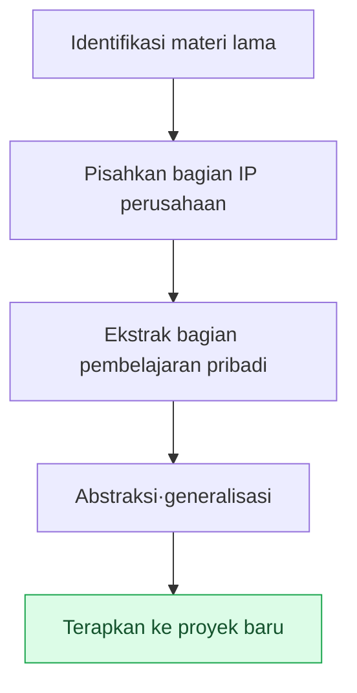

# Lampiran H. Mendaur Ulang Materi Pekerjaan Lama

Seorang Game Designer yang sudah lama berkecimpung di bidang ini akan mengumpulkan materi pekerjaan selama puluhan tahun. Mulai dari notula rapat, catatan keputusan, retrospektif, catatan pembelajaran, hingga pelajaran yang dipetik dari kegagalan. Lampiran ini membahas bagaimana materi tersebut dipakai kembali untuk proyek baru. Ketegangan intinya hanya satu. Sebagian besar materi merupakan IP perusahaan sehingga tidak bisa sembarangan dipindahkan, namun di dalamnya juga bercampur pembelajaran pribadi yang berlaku di mana saja. Memilah keduanya adalah titik awal dari pendauran ulang.

Cara membaca lampiran ini berbeda-beda tergantung posisi Anda. Jika Anda berada dalam situasi ingin menarik materi lama ke proyek baru, ikuti H.2 (prinsip pemilahan) dan H.3 (prosedur) secara berurutan. Jika Anda khawatir terjadi insiden saat memindahkannya, bacalah dulu H.5 (lima jebakan) untuk mencegahnya lebih awal. Jika Anda masih di awal karier dan belum punya banyak materi untuk dikumpulkan, lihat H.6 dan tentukan dari sekarang apa dan bagaimana yang harus Anda tinggalkan.

Prinsip yang dibahas di sini bukanlah teori manajemen aset yang muluk-muluk. Ia bisa dipadatkan menjadi satu kalimat: "Yang konkret ditinggalkan di perusahaan, hanya pola abstrak yang dibawa." Sisanya adalah cara menerapkan kalimat itu pada situasi nyata.

---

## H.1 Nilai Materi Lama

Pertama, kita lihat materi apa saja yang menumpuk dan bagaimana hak penyimpanan masing-masing berbeda. Sebab jika hak penyimpanannya berbeda, cakupan yang dapat didaur ulang pun ikut berbeda.

| Materi | Penyimpanan |
|---|---|
| Notula rapat (materi perusahaan) | Dalam wewenang perusahaan |
| Decision card (materi perusahaan) | Dalam wewenang perusahaan |
| Retrospektif kuartalan (pribadi+perusahaan) | Salinan pribadi dimungkinkan |
| Catatan pembelajaran (pribadi) | Milik pribadi permanen |
| Catatan insiden (pembelajaran pribadi) | Milik pribadi permanen |

Notula rapat dan decision card tetap berada dalam wewenang perusahaan. Retrospektif boleh disimpan sebagai salinan pribadi, sementara catatan pembelajaran dan catatan insiden sepenuhnya merupakan aset pribadi. Materi yang menumpuk dalam waktu lama dengan sendirinya menjadi aset pembelajaran yang besar, tetapi batas antara wilayah IP perusahaan dan wilayah pribadi tidak boleh dikaburkan. Semakin jelas batas itu, semakin tenang Anda mendaur ulangnya.

---

## H.2 Pemilahan antara IP Perusahaan vs Pembelajaran Pribadi

Tolok ukur pemilahan adalah "konkret atau abstrak". Hasil yang konkret adalah milik perusahaan, sedangkan pola berpikir yang menghasilkannya adalah milik pribadi. Intinya, kedua sisi ini muncul bersamaan dari pekerjaan yang sama.

| Wilayah | IP Perusahaan | Pembelajaran Pribadi |
|---|---|---|
| Isi keputusan | Perusahaan | — |
| Pola keputusan (di situasi seperti ini, keputusan seperti ini bagus) | — | Pribadi |
| Data game | Perusahaan | — |
| Kiat operasional (rulebook·operasi alat) | — | Pribadi |
| Kode | Perusahaan | — |
| Algoritme·struktur | — | Pribadi |

"Keputusan apa yang diambil" adalah IP perusahaan, tetapi pola "di situasi seperti ini, keputusan seperti ini ternyata berhasil" adalah pembelajaran pribadi. Nilai data game itu sendiri milik perusahaan, tetapi kiat mengoperasikan data tersebut adalah milik pribadi. Materi konkret ditinggalkan di perusahaan, hanya pola abstrak yang dibawa — inilah prinsip pemilahan.

---

## H.3 Prosedur Pendauran Ulang

Jika prinsip pemilahan dipindahkan menjadi pekerjaan nyata, ia menjadi lima langkah berikut. Mengidentifikasi materi, melepaskan IP-nya, mengekstrak pembelajaran, lalu menggeneralisasi, dan menerapkannya ke proyek baru.

Prosedur ini wajib dijalankan setelah melalui konfirmasi wewenang perusahaan dan tinjauan hukum. Sekalipun abstraksinya sudah cukup, jika titik awalnya adalah materi perusahaan, lebih aman untuk mendapatkan konfirmasi secara prosedural.

---

## H.4 Kasus Pendauran Ulang — Buku Ini

Kasus pendauran ulang yang paling dekat adalah buku ini sendiri. Berbagai bagian isi buku berangkat dari pekerjaan masa lalu penulis, dan merupakan hasil generalisasi·anonimisasi setelah melalui prosedur di atas.

| Wilayah | Sumber | Pendauran ulang |
|---|---|---|
| Desain integrasi Layer (Bagian 6) | Operasi bertahun-tahun oleh penulis | Pembelajaran pribadi → generalisasi |
| Sistem notula rapat (Bagian 17) | Operasi Proyek A oleh penulis | Pola perusahaan → anonimisasi |
| Kiat operasional (Bagian 24) | Akumulasi bertahun-tahun | Pembelajaran pribadi → generalisasi |
| Inventaris Lampiran A | Proyek A perusahaan | Anonimisasi + sebagian diolah |

Desain Layer dan kiat operasional menggeneralisasi pembelajaran pribadi, sedangkan sistem notula rapat dan Lampiran A menganonimkan pola perusahaan. Semua butir telah melewati persetujuan perusahaan dan IP perusahaan telah dianonimkan tanpa terkecuali. Buku sebagai hasil itu sendiri merupakan bukti nyata dari prosedur H.3.

---

## H.5 Lima Jebakan dalam Pendauran Ulang

Pendauran ulang bila dilakukan dengan baik menjadi aset, tetapi bila salah menjadi insiden. Lima jebakan di bawah ini adalah titik yang nyata-nyata sering terinjak, dan masing-masing diberi resepnya.

### H.5.1 Jebakan 1 — Tidak Melewati Wewenang Perusahaan

Memakai materi tanpa persetujuan perusahaan akan berkembang menjadi sengketa. Resepnya sederhana. Dapatkan persetujuan perusahaan dulu sebelum memakainya.

### H.5.2 Jebakan 2 — Anonimisasi Terlewat

Bila nama perusahaan atau nama asli tersisa walau di satu tempat, jadilah insiden IP. Resepnya adalah pemeriksaan grep otomatis. Buat nama perusahaan·nama asli·jalur menjadi watchlist agar mesin menyisirnya tanpa terlewat.

### H.5.3 Jebakan 3 — Menerapkan Apa Adanya dari Masa Lalu

Bila kiat lama dipakai apa adanya tanpa disentuh, ia tidak cocok dengan keadaan sekarang. Resepnya adalah merekonstruksinya sesuai zaman. Pertahankan prinsipnya, tetapi perbarui alat dan konteksnya ke kondisi saat ini.

### H.5.4 Jebakan 4 — Abstraksi Kurang

Bila hanya kasus konkret yang dipindahkan, sulit diterapkan ke lingkungan lain. Resepnya adalah menyandingkan pola abstrak dan contoh konkret. Pola untuk keumuman, contoh untuk pemahaman.

### H.5.5 Jebakan 5 — Tidak Belajar Itu Sendiri

Seberapa banyak pun materinya, bila tidak dibuka lagi, sama saja dengan tidak ada. Resepnya adalah siklus pembelajaran berkala. Ciptakan periode untuk menemui kembali materi tersebut, seperti retrospektif harian·mingguan·bulanan.

---

## H.6 Catatan untuk Pembaca — Mendaur Ulang Materi Sendiri

Prinsip ini bukan hanya milik penulis. Pembaca pun dapat mendaur ulang materi kariernya sendiri dengan cara yang sama. Berikut adalah kebiasaan yang dianjurkan dan dapat Anda mulai dari sekarang.

| Anjuran | Alasan |
|---|---|
| Retrospektif keputusan sendiri setiap kuartal | Menemukan pola |
| Simpan catatan pembelajaran secara terpisah | Terpisah dari IP perusahaan |
| Tegaskan pola abstrak | Dapat didaur ulang di masa depan |
| Mentoring·presentasi eksternal | Berbagi pola |
| Buku·blog (setelah persetujuan perusahaan) | Pembelajaran abadi |

Bila setiap kuartal Anda meretrospeksi keputusan sendiri, polanya akan terlihat, dan bila Anda menyimpan catatan pembelajaran terpisah dari materi perusahaan, kelak Anda bisa mengeluarkannya dengan tenang. Bila pola itu Anda salurkan melalui mentoring·presentasi·penulisan, pembelajaran tidak lenyap setelah sekali pakai, melainkan bertahan lama. Pada akhirnya, pembelajaran diri Anda itulah aset Anda sendiri.
