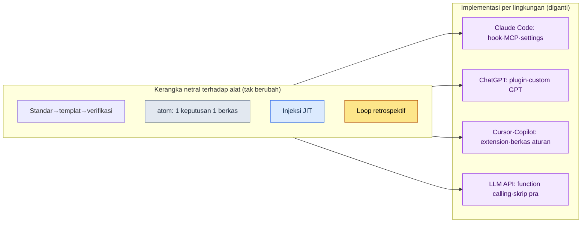

# Lampiran K. Memindahkan ke LLM atau Harness Lain

Hampir semua contoh dan alat dalam buku ini ditulis dengan mengandaikan satu lingkungan, yaitu Claude Code. Karena itu, ada satu keberatan yang nyaris selalu muncul di rapat persetujuan atau peninjauan eksternal: "Bukankah ini terikat pada alat satu perusahaan tertentu?" Penanggung jawab perencanaan merasa berat untuk menyetujui keputusan yang bergantung pada satu vendor, kalangan skeptis curiga bahwa seluruh metode buku ini akan runtuh begitu alatnya berganti, dan pihak yang meninjau hak terbit luar negeri bertanya apakah buku ini masih berguna ketika alat lain menjadi standar di negara mereka. Ungkapan ketiganya berbeda, tetapi intinya sama: ketidakpercayaan terhadap vendor lock-in (keterkuncian pada satu vendor), yaitu terjebak pada satu alat.

Tujuan lampiran ini adalah menjawab ketidakpercayaan itu. Saya katakan kesimpulannya lebih dahulu: kerangka kerja yang dianjurkan buku ini bersifat netral terhadap alat. Ia tidak terikat pada nama model tertentu, juga tidak pada alat baris perintah tertentu. Claude Code hanyalah wadah yang mewujudkan kerangka itu dengan paling mulus, dan kerangka yang sama dapat dipindahkan ke wadah lain. Lampiran ini akan (1) menunjukkan dalam bentuk tabel apa yang menjadi kerangka yang tak bergantung pada alat, (2) memasangkan setiap elemen Claude Code dengan padanannya ketika dipindahkan ke lingkungan lain, (3) menetapkan prinsip untuk memastikan kondisi terkini dengan asumsi bahwa generasi model akan terus berganti, dan (4) menuliskan secara jujur apa yang hilang dan apa yang tetap terjaga saat pemindahan dilakukan.

---

## K.1 Kerangka yang Tak Bergantung pada Alat

Cara kerja yang menjadi benang merah seluruh buku ini dapat diringkas menjadi lima pilar. Tak satu pun dari kelimanya merupakan nama fitur dari model atau alat baris perintah tertentu, melainkan jawaban atas pertanyaan: "Bagaimana cara berulang kali menghasilkan keluaran yang dapat dipercaya ketika manusia dan kecerdasan buatan bekerja bersama?" Karena itu, kelimanya tetap bertahan meskipun alatnya berganti.

| Kerangka | Apa itu | Mengapa netral terhadap alat |
|---|---|---|
| Standar → templat → verification gate | Mengukuhkan aturan yang disepakati (standar) menjadi kerangka isian (templat), lalu menempatkan gerbang (gate) yang secara otomatis menyaring apakah hasilnya mematuhi aturan | Konsep aturan, kerangka, dan pemeriksaan dapat dinyatakan dengan teks atau skrip di alat mana pun |
| atom = 1 keputusan 1 berkas | Menuliskan satu keputusan ke dalam satu berkas kecil, mengambilnya saat dibutuhkan, dan hanya mengubah satu sel itu saat hendak merevisi | Memecah keputusan menjadi berkas-berkas kecil cukup memerlukan sistem berkas saja |
| Injeksi JIT | Memilih hanya keputusan yang benar-benar diperlukan untuk percakapan saat ini, tepat pada waktunya (Just-In-Time), lalu menyuntikkannya ke model | Ini adalah prinsip "masukkan hanya konteks yang diperlukan", dan cara menyuntikkannya hanya berbeda dari satu alat ke alat lain |
| Loop retrospektif | Menengok kembali apa yang telah dikerjakan dalam satuan harian, mingguan, dan bulanan, lalu mengangkat pola yang berulang menjadi aturan untuk pekerjaan berikutnya | Prosedur menengok dan memperbaiki bergantung pada kebiasaan dan dokumen, bukan pada alat |
| Batas peminjaman alat | Yang dibawa hanyalah kerangka (algoritma, struktur), sedangkan data domain ditinggalkan (Lampiran B) | Pertimbangan tentang apa yang dibawa dan apa yang ditinggalkan adalah sama di alat mana pun |

Kolom kanan tabel ini adalah intinya. Pada kelima kerangka itu, di dalam definisinya tak sekali pun muncul nama produk tertentu. Yang muncul hanyalah konsep universal yang ada di lingkungan kerja mana pun: aturan, berkas, konteks, kebiasaan, dan batas. Karena itu, pertanyaan "Bagaimana kalau Claude Code tidak bisa lagi dipakai?" sebenarnya berubah menjadi pertanyaan yang jauh lebih mudah dijawab: "Bagaimana cara mewujudkan kelima konsep ini di alat lain?" Jawabannya ada di subbab berikutnya.

---

## K.2 Tabel Padanan Elemen (Claude Code → Lingkungan Lain)

Claude Code memiliki perangkat konkret yang mewujudkan kerangka di atas dengan nyaman. Di antaranya: hook (skrip yang dijalankan otomatis pada titik waktu tertentu), MCP (protokol yang menghubungkan alat dan data eksternal ke model), berkas settings (pengaturan izin dan lingkungan), slash command (perintah singkat yang memanggil prosedur yang sering dipakai dalam satu baris), dan skill (kumpulan tugas yang dapat dipakai ulang). Ini semua adalah nama khas Claude Code, tetapi perannya hampir selalu memiliki padanan di lingkungan lain. Tabel berikut adalah pasangannya.

| Claude Code | ChatGPT (web/aplikasi) | Cursor / Copilot | LLM API umum |
|---|---|---|---|
| hook (eksekusi otomatis pada titik waktu) | Prosedur manual sebelum/sesudah percakapan / instruksi custom GPT | Task sebelum/sesudah pekerjaan editor / hook pre-commit | Skrip pra dan pasca yang disisipkan sebelum dan sesudah panggilan |
| MCP (protokol koneksi eksternal) | Plugin / action / code interpreter | Extension / pemanggilan alat bawaan | Function calling / pembungkus API buatan sendiri |
| Berkas settings (izin/lingkungan) | Layar pengaturan custom GPT / pengaturan proyek | Berkas pengaturan `.cursor`/workspace | Objek konfigurasi dalam kode / berkas konfigurasi `.env`/YAML |
| Slash command (pemendekan prosedur) | Prompt tersimpan / custom GPT | Snippet / perintah buatan pengguna | Fungsi templat prompt |
| Skill (kumpulan tugas yang dapat dipakai ulang) | Custom GPT / koleksi prompt | Berkas aturan + skrip | Prompt dan fungsi kode yang dimodulkan |
| CLAUDE.md / memori | Instruksi kustom / fitur memori | Berkas aturan proyek (rules) | System prompt + penyimpanan memori eksternal |
| Kumpulan berkas atom | (tak bergantung alat) berkas Markdown | (tak bergantung alat) Markdown di dalam repositori | (tak bergantung alat) berkas / record basis data |

Dari tabel ini satu hal menjadi jelas. Semakin ke kanan, yaitu semakin mendekati LLM API umum, "sesuatu yang tadinya dilakukan otomatis" berubah menjadi "sesuatu yang harus dibuat dan disisipkan sendiri". Injeksi otomatis yang di Claude Code selesai dengan satu baris hook, di API umum menjadi skrip pra yang harus ditulis sendiri sebelum panggilan. Kemudahan otomasinya berkurang, tetapi kerangkanya sendiri berpindah apa adanya. Dengan kata lain, pemindahan bukanlah "pekerjaan kehilangan fitur", melainkan "pekerjaan memasang ulang kemudahan dengan tangan sendiri".

Gambar ini adalah ringkasan satu halaman dari keseluruhan lampiran. Kotak atas (kerangka) tidak berubah isinya ke mana pun panah mengarah, dan hanya kotak bawah (implementasi) yang diganti menyesuaikan lingkungan. Bila di rapat persetujuan muncul istilah "vendor lock-in", bukalah gambar ini satu halaman dan jawablah: "Yang terikat adalah kolom bawah, bukan kolom atas."

---

## K.3 Asumsi bahwa Nama Model Akan Berubah

Saat membicarakan pemindahan, informasi yang paling cepat usang adalah nama model. Jika nama model terbaru pada saat buku ini ditulis dipatok mati di dalam teks, kalimat itu akan menjadi informasi yang keliru begitu generasi berikutnya muncul. Karena itu, sejak awal buku ini mengikuti satu prinsip: tidak menjelaskan dengan bersandar pada nama atau nomor generasi model tertentu, melainkan dengan bersandar pada peran yang dijalankan model (fungsi seperti penalaran, peringkasan, dan pembuatan kode).

| Yang berubah (jangan dipatok) | Yang tidak berubah (boleh diandalkan) |
|---|---|
| Nama produk dan nomor generasi model | Pembedaan peran seperti "model yang andal bernalar", "model yang menerima konteks panjang" |
| Angka spesifik batas konteks | Prinsip JIT, "karena ada batas, masukkan hanya konteks yang benar-benar diperlukan" |
| Angka spesifik harga dan kecepatan | Kesadaran biaya, "pekerjaan mahal hanya dijalankan untuk yang lolos gate" |
| Cara menyalakan dan mematikan fitur tertentu | "Peran yang dijalankan fitur itu" dan kerangka yang menggantikannya |

Cara memastikan model dan fitur terbaru di lapangan pun cukup satu baris di tiap alat. Di Claude Code, perintah `/model` langsung menampilkan model yang sedang dipakai beserta pilihannya, dan alat seperti ChatGPT atau Cursor juga menampilkan informasi yang sama di layar pengaturan atau dropdown pemilihan model. Maka, bila ada kalimat dalam buku ini yang tampak tidak cocok dengan nama model, bukan kalimat itu yang keliru, melainkan modelnya yang sudah berlalu satu generasi. Selama perannya sama, metodenya tetap berlaku apa adanya. Bila saat membaca buku ini Anda merasa nama modelnya asing, janganlah meragukan teksnya, tetapi pastikan dahulu kondisi terkini alat yang ada di tangan Anda dengan perintah seperti `/model`.

---

## K.4 Apa yang Hilang dan Apa yang Terjaga saat Pemindahan

Memindahkan alat pasti membuat ada yang hilang. Menyembunyikan kenyataan itu justru akan menghilangkan kepercayaan, maka saya tuliskan lebih dahulu secara jujur apa yang hilang. Namun, yang hilang hampir seluruhnya berada di ranah "kemudahan", sedangkan yang terjaga berada di ranah "kerangka". Artinya, yang hilang adalah hal yang bisa diperoleh kembali dengan memasangnya ulang, dan yang terjaga adalah hal yang sejak awal memang tidak terikat pada alat.

| Kategori | Item | Penjelasan |
|---|---|---|
| Yang hilang (kemudahan) | Kemulusan eksekusi otomatis | Otomasi yang menyela dengan sendirinya seperti hook harus dibuat sendiri sebagai skrip pra dan pasca |
| Yang hilang (kemudahan) | Satu layar yang terpadu | Perintah, alat, dan berkas yang tadinya berkumpul dalam satu alur mungkin harus dipecah dan ditempelkan ke beberapa alat |
| Yang hilang (kemudahan) | Skill dan perintah yang langsung pakai | Slash command dan skill harus didaftarkan ulang dengan cara alat tersebut |
| Yang terjaga (kerangka) | Standar, templat, verification gate | Aturan, kerangka, dan pemeriksaan adalah teks dan skrip sehingga tetap hidup apa adanya di mana saja |
| Yang terjaga (kerangka) | atom, JIT, loop retrospektif | Karena bergantung pada berkas dan kebiasaan, ia tetap terjaga meski alatnya berganti |
| Yang terjaga (kerangka) | Batas peminjaman alat (Lampiran B) | Kriteria pertimbangan tentang apa yang dibawa dan ditinggalkan tidak bergantung pada lingkungan |

Bila tabel ini diringkas menjadi satu kalimat, jadinya begini. Yang hilang dalam pemindahan adalah kemudahan otomasi yang dapat dihidupkan kembali bila kita meluangkan waktu, dan yang terjaga adalah kerangka kerja yang sejak awal diupayakan buku ini agar berada di luar alat. Maka, jawaban paling jujur atas pertanyaan "Bukankah ini vendor lock-in?" adalah ini: memang ada bagian yang terikat, tetapi itu adalah wadah yang dapat diganti, sedangkan isi yang merupakan nilai sebenarnya sejak awal tidak terikat pada wadah mana pun. Saya berharap satu lampiran ini dapat mewakili jawaban itu di meja persetujuan.
