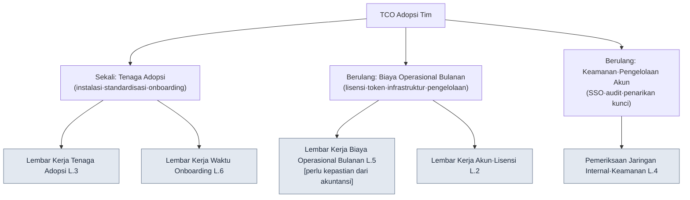

# Lampiran L. Lembar Kerja TCO dan Onboarding Adopsi Tim

> Lampiran ini adalah lembar kerja berupa kolom isian yang menjawab pertanyaan dari PD dan pimpinan studio: "Ketika sistem solo selama 6 bulan diperluas menjadi tim berukuran menengah, dengan apa dan bagaimana kita memperkirakan tenaga adopsi, biaya operasional, akun, dan keamanan jaringan internal?" Jika bagian 19.3 (Strategi adopsi AI dan meyakinkan jajaran manajemen) mengatakan "jangan mengarang ROI", maka lampiran ini menerapkan prinsip yang sama persis pada sisi biaya adopsi. Artinya, **lampiran ini tidak menyediakan angka.** Semua kolom kosong, dan yang mengisi kolom itu adalah pengukuran serta perkiraan tim Anda; kolom yang ditandai `[perlu kepastian dari akuntansi]` tidak boleh diisi siapa pun dengan perkiraan sampai akuntansi mengisinya.

Cara menggunakan lampiran ini seperti berikut. Pertama, di L.1 pahami dulu lewat gambar bagaimana TCO (Total Cost of Ownership, total biaya kepemilikan) dipecah menjadi item-itemnya. Lalu cetak kelima lembar kerja L.2–L.6 dalam keadaan kosong, sesuaikan dengan baris ukuran tim Anda, lalu ukur sendiri atau teruskan kepada penanggung jawab akuntansi/keamanan informasi sebagai pertanyaan satu baris. Terakhir, gunakan daftar swaperiksa L.7 untuk memastikan tidak ada kolom yang terlewat. Nilai lampiran ini bukan pada angka yang sudah terisi, melainkan pada **membuat lebih dulu kolom untuk item-item biaya yang mudah terlewat**.

---

## L.1 TCO Bukanlah Tarif Lisensi

Jebakan yang paling sering dilewatkan PD adalah memandang biaya adopsi hanya sebagai "biaya langganan × jumlah orang". Total biaya kepemilikan sebenarnya jauh lebih luas dari itu. Ia terbagi menjadi **tenaga adopsi** yang dibayar sekali lalu selesai (instalasi, standardisasi, onboarding) dan **biaya operasional** yang berulang tiap bulan (lisensi, token, infrastruktur, tenaga pengelolaan), lalu di atasnya tertumpuk biaya **keamanan dan pengelolaan akun** yang tak kasat mata.

Di antara ketiga cabang itu, yang mudah diremehkan PD adalah sisi kiri (tenaga adopsi) dan sisi kanan (keamanan·akun). Tarif lisensi datang tertulis di surat penawaran, tetapi "tenaga untuk merapikan standar dan skill yang dibangun seseorang dengan tangan selama 6 bulan menjadi bentuk yang dapat dibagi tim" dan "tinjauan keamanan untuk menetapkan sejauh mana panggilan LLM eksternal diizinkan di jaringan internal" tidak ada dalam surat penawaran, dan karena itulah keduanya selalu membuat jadwal dan anggaran melampaui batas. Lembar kerja dalam lampiran ini bertujuan menyingkapkan lebih dulu biaya tak kasat mata itu, sekalipun dalam bentuk kolom kosong.

> Bagian 19.3.6 mengatakan "biaya tidak dicantumkan sebagai nilai mutlak di buku — itu adalah kolom kosong yang akan diisi dari akuntansi". Lampiran ini membentangkan per item di mana kolom kosong itu harus diletakkan.

---

## L.2 Lembar Kerja Akun·Lisensi

Tabel yang paling pertama diisi. Catat siapa memakai alat apa, dan bagaimana wewenang itu diterbitkan serta ditarik, beserta jumlah orangnya. Isi kolom jumlah orang dengan jumlah kepala nyata tim Anda, dan isi kolom tarif satuan dengan mengambilnya dari surat penawaran atau tabel tarif publik. Buku ini tidak mencantumkan tarif satuan.

| Item | Apa yang dicatat | Siapa yang mengisi | Nilai tim Anda |
|---|---|---|---|
| Jumlah seat per alat | Jumlah akun (seat) yang dibutuhkan tiap alat | Lead | ______ seat |
| Distribusi tingkat wewenang | full / cap per tugas / orang outsourcing sekali pakai (Lampiran C.1.2) | Lead | full __orang / umum __orang / outsourcing __orang |
| Tarif per seat | Tarif seat bulanan per alat | Akuntansi·Pembelian | ______ /seat·bulan |
| Kunci bersama atau tidak | API key bersama tim vs kunci per individu | Keamanan informasi | □ bersama □ per individu |
| Prosedur penerbitan | Jalur·waktu penerbitan akun untuk karyawan baru | Lead | ______ |
| Prosedur penarikan | Jalur penarikan kunci/seat saat resign·outsourcing berakhir | Keamanan informasi | ______ |

Aturannya ada dua. Pertama, **untuk personel outsourcing·jangka pendek, jangan terbitkan seat secara permanen, melainkan buka dan tarik per satuan tugas** (Lampiran C.1.2). Kedua, **jika kolom prosedur penarikan masih kosong, jangan mulai menerbitkan.** Insiden yang paling sering terjadi adalah akun orang yang sudah resign tidak ditarik sehingga biaya dan paparan kunci bocor bersamaan; karena itu, rancang penarikan lebih dulu daripada penerbitan.

---

## L.3 Lembar Kerja Tenaga Adopsi per Ukuran Tim

Tabel untuk memperkirakan, per ukuran, tenaga sekali pakai yang bertambah ketika "solo 6 bulan" diperluas menjadi tim. Kolom tenaga diisi dalam satuan **orang-hari (jumlah pekerjaan satu orang dalam satu hari kerja)**, yang diukur atau diperkirakan dan diisi sendiri oleh tim Anda. Buku ini tidak menyediakan jumlah orang-hari — karena angkanya sangat bervariasi tergantung kecakapan tim dan tingkat kerapian standar yang sudah ada.

| Item tenaga adopsi | 1\~3 orang | 4\~10 orang | 11\~30 orang | 31\~50 orang | Subjek pengukuran/perkiraan |
|---|---|---|---|---|---|
| Instalasi·setup lingkungan (alat·hook·wewenang) | ___orang-hari | ___orang-hari | ___orang-hari | ___orang-hari | Lead/Infrastruktur |
| Membagikan aset solo ke tim (merapikan skill·standar·atom) | ___orang-hari | ___orang-hari | ___orang-hari | ___orang-hari | Lead |
| Menyusun standar tim (penamaan·frontmatter·rulebook, Lampiran D) | ___orang-hari | ___orang-hari | ___orang-hari | ___orang-hari | Lead |
| Membangun gerbang verifikasi (otomatisasi lint·rulebook) | ___orang-hari | ___orang-hari | ___orang-hari | ___orang-hari | QA/Lead |
| Membuat materi onboarding (terhubung dengan L.6) | ___orang-hari | ___orang-hari | ___orang-hari | ___orang-hari | Lead |
| Total (tenaga adopsi sekali pakai) | ___orang-hari | ___orang-hari | ___orang-hari | ___orang-hari | — |

Saat mengisi tabel ini, kolom yang mudah terlewat adalah baris kedua. Aset yang ditumpuk seseorang di dalam kepala dan folder pribadi selama 6 bulan, untuk dibagikan ke tim, butuh tenaga tersendiri bagi seseorang untuk mengeluarkan, merapikan, dan menjadikannya dokumen. Jika tenaga ini ditetapkan "0", jadwal adopsi pasti molor. Selain itu, semakin besar ukurannya, kolom-kolomnya menunjukkan lebih dulu lewat bentuknya bahwa tenaga **penyusunan standar·gerbang verifikasi** bertambah lebih curam daripada tenaga instalasi — karena bertambahnya orang berarti bertambahnya jumlah standar yang harus disepakati.

> Jika Anda mengikuti adopsi bertahap (konservatif→progresif) dari bagian 19.3.1, Anda tidak perlu menghabiskan tenaga ini dalam satu kuartal, melainkan dapat menyebarnya mulai dari pilot tahap 1 (injeksi konteks). Jangan berusaha mendapat persetujuan untuk total tabel sekaligus; lebih realistis untuk memisahkan dulu tenaga tahap 1 saja dan mengajukannya untuk persetujuan.

---

## L.4 Lembar Kerja Pemeriksaan Jaringan Internal·Keamanan

Area yang paling langsung ditakuti PD·pimpinan. Periksa per item apa yang keluar ke LLM eksternal dan sejauh mana panggilan eksternal diizinkan dari jaringan internal. Tabel ini adalah daftar periksa yang memilah lolos/ditangguhkan (terhubung dengan keamanan di Lampiran C.6); jika satu item saja belum ditentukan, tangguhkan adopsi pada lingkup tersebut.

| Item pemeriksaan | Kriteria lolos | Penanggung jawab | Status |
|---|---|---|---|
| Cakupan data yang dikirim ke LLM eksternal | Data sensitif memakai placeholder/self-hosting (C.6) | Keamanan informasi | □ lolos □ ditangguhkan |
| Pengiriman data pembayaran·data pribadi | Larangan pengiriman dibakukan tanpa pengecualian | Keamanan informasi | □ lolos □ ditangguhkan |
| Kebijakan panggilan eksternal jaringan internal | Domain diizinkan·proxy·periode retensi log didefinisikan | Infrastruktur | □ lolos □ ditangguhkan |
| Perlu tidaknya self-hosting | Menentukan apakah IP inti diproses dengan model self-hosting | Pimpinan/Keamanan informasi | □ diputuskan □ belum ditentukan |
| Penanganan insiden paparan kunci | Jalur penggantian segera + peninjauan riwayat penggunaan (C.7) | Keamanan informasi | □ lolos □ ditangguhkan |
| Log audit | Pencatatan·retensi siapa·kapan·apa yang dipanggil | Infrastruktur | □ lolos □ ditangguhkan |
| Pemeriksaan kebocoran IP perusahaan ke luar | Prosedur pemeriksaan dini seperti grep watchlist (Lampiran B.6) | Lead | □ lolos □ ditangguhkan |
| Isolasi akses outsourcing | Akun outsourcing diblokir dari akses aset inti·diisolasi per tugas | Keamanan informasi | □ lolos □ ditangguhkan |

Kolom yang membuat biaya paling besar berbeda dalam tabel ini adalah baris keempat (perlu tidaknya self-hosting). Jika diputuskan bahwa IP inti sama sekali tidak boleh dikirim ke LLM eksternal, biaya infrastruktur self-hosting tertumpuk seluruhnya ke biaya operasional L.5. Karena itu keputusan ini harus diambil **bersama oleh pimpinan·keamanan informasi**, bukan oleh lead, dan sampai keputusan itu diambil, kolom infrastruktur L.5 tidak dapat dipastikan. Kedua lembar kerja terhubung lewat satu kolom ini.

---

## L.5 Lembar Kerja Biaya Operasional Bulanan [perlu kepastian dari akuntansi]

Tabel yang menguraikan per item biaya yang berulang tiap bulan. **Semua kolom nominal pada tabel ini kosong, dan kolom yang ditandai `[perlu kepastian dari akuntansi]` tidak boleh diisi siapa pun dengan perkiraan sampai akuntansi mengisinya.** Karena tarif token·biaya langganan·tarif infrastruktur berubah tiap bulan tergantung model·volume panggilan·kontrak, buku ini tidak mencantumkan nilai mutlak.

| Item biaya operasional | Cara perhitungan | Siapa yang mengisi | Nominal bulanan |
|---|---|---|---|
| Lisensi·langganan | Jumlah seat × tarif per seat (L.2) | Akuntansi | [perlu kepastian dari akuntansi] |
| Biaya token LLM | Volume panggilan × tarif token, jumlah batas (cap) per alat | Akuntansi | [perlu kepastian dari akuntansi] |
| Infrastruktur (jika self-hosting) | Server·GPU·storage sesuai keputusan L.4 | Akuntansi·Infrastruktur | [perlu kepastian dari akuntansi] |
| Backup·sinkronisasi | Repositori·storage backup (Lampiran C.5) | Akuntansi | [perlu kepastian dari akuntansi] |
| Tenaga pengelolaan operasional | Konversi waktu penanggung jawab pengelolaan alat·kunci·log | Lead·Akuntansi | [perlu kepastian dari akuntansi] |
| Total bulanan | Jumlah item di atas | Akuntansi | [perlu kepastian dari akuntansi] |

Aturan tabel ini hanya satu, **biarkan kolom kosong tetap kosong**. Ingatlah kegagalan pada bagian 19.3.2 ketika AI mengarang kolom biaya operasional secara meyakinkan menjadi `$4,500` — entah manusia maupun AI, begitu kolom ini diisi dengan perkiraan, laporan itu runtuh pada pertanyaan pertama. Sebagai gantinya, perangkat sejati yang mengendalikan biaya bukanlah nominal, melainkan **struktur yang memasang batas bulanan (cap) per alat dan melaporkan pelampauannya secara otomatis** (19.3.6). Yang ditunjukkan kepada jajaran manajemen saat persetujuan bukanlah nominal yang sudah diisi, melainkan struktur "batas terpasang dan pelampauan dilaporkan" beserta daftar kolom kosong yang akan diisi akuntansi.

> Baris kelima (tenaga pengelolaan operasional) paling sering terlewat. Alat bukanlah selesai setelah dipasang; ia memakan waktu seseorang setiap bulan untuk menarik kunci, melihat log, dan menyesuaikan batas. Jika kolom ini ditetapkan 0, pekerjaan itu tersembunyi menjadi lembur lead yang tak terlihat.

---

## L.6 Lembar Kerja Waktu Onboarding

Tabel untuk memperkirakan per tahap waktu yang dibutuhkan satu anggota baru hingga dapat menjalankan perannya di atas sistem. Kolom waktu paling akurat jika diukur dengan benar-benar menjalankan onboarding sekali di tim Anda (cara yang sama dengan resep pengukuran baseline di bagian 19.3.7). Sebelum diukur, biarkan kosong.

| Tahap onboarding | Apa yang dilakukan | Waktu terukur | Catatan |
|---|---|---|---|
| Instalasi lingkungan | Hingga setup alat·hook·akun | ___jam | Terhubung dengan prosedur penerbitan L.2 |
| Mempelajari standar | Menguasai penamaan·frontmatter·rulebook (Lampiran D) | ___jam | Lebih singkat jika ada materinya |
| Tugas pertama (konservatif) | Lolos keluaran pertama·tinjauan via injeksi konteks | ___jam | Tahap 1 dari 19.3.1 |
| Adaptasi gerbang verifikasi | Bekerja sesuai gerbang lint·rulebook | ___jam | — |
| Mencapai kerja mandiri | Mampu bekerja·memberi putusan adopsi tanpa pengawasan | ___hari | Kriteria selesainya onboarding |

Jika Anda mengisi tabel ini, akan tersingkap mengapa kolom "membuat materi onboarding" pada tenaga adopsi (L.3) itu penting. Semakin rapi materi onboarding tersusun, semakin singkat waktu pada baris kedua·ketiga, dan semakin banyak anggota baru, semakin terakumulasi penghematan itu. Artinya, membuat materi onboarding adalah tenaga sekali pakai, tetapi pengembaliannya berulang sebanyak jumlah anggota. Apa yang dikatakan bagian 19.3.3, "injeksi otomatis JIT 221 kasus — anggota baru pun bekerja di atas aturan yang sama", muncul pada tabel ini sebagai pemangkasan waktu pada baris ketiga.

> Baris terakhir (mencapai kerja mandiri) adalah kriteria nyata selesainya onboarding. Jika selesainya instalasi lingkungan disalahartikan sebagai selesainya onboarding, biaya pengawasan terus menumpuk pada lead. Kriterianya harus "memberi putusan adopsi tanpa pengawasan".

---

## L.7 Daftar Swaperiksa Sebelum Adopsi

Terakhir, item yang harus Anda loloskan sendiri sebelum membawa lembar-lembar kerja ini ke jajaran manajemen. Dengan semangat yang sama seperti Lampiran B.6 (pemeriksaan sebelum meminjam), jika satu item saja masih kosong, tunda persetujuan dan isi dulu kolom itu.

| Item pemeriksaan | Kriteria lolos |
|---|---|
| Apakah prosedur penarikan akun sudah didefinisikan | Kolom prosedur penarikan L.2 tidak kosong |
| Apakah semua pemeriksaan keamanan sudah lolos/diputuskan | □ditangguhkan·□belum ditentukan di L.4 berjumlah 0 |
| Apakah kolom kosong biaya operasional sudah diteruskan ke akuntansi | `[perlu kepastian dari akuntansi]` L.5 sudah dikirim sebagai pertanyaan |
| Apakah tenaga adopsi sudah dipecah per tahap | Persetujuan dari tenaga tahap 1, bukan total L.3 |
| Apakah kriteria selesainya onboarding adalah "kerja mandiri" | Putuskan selesai lewat baris terakhir L.6 |
| Apakah nilai perkiraan tidak ditulis sebagai pernyataan pasti | Tandai "perkiraan·jumlah sampel" pada semua kolom perkiraan |

Jangan membaca tabel ini sebagai kelulusan lima kolom, melainkan mohon dibaca sebagai enam pengunci. Memperluas sistem solo menjadi tim jelas mungkin, tetapi biaya perluasan itu bukanlah tarif lisensi; gambaran utuhnya baru tersingkap ketika keenam kolom kosong ini diisi dengan jujur. Dan jangan menyuruh AI mengisi kolom mana pun — AI mengisi kolom kosong dengan angka yang meyakinkan seperti pada bagian 19.3.2. Tempat AI adalah menerima nilai yang Anda ukur dan merapikannya menjadi kalimat slide persetujuan, sampai di situ saja.
