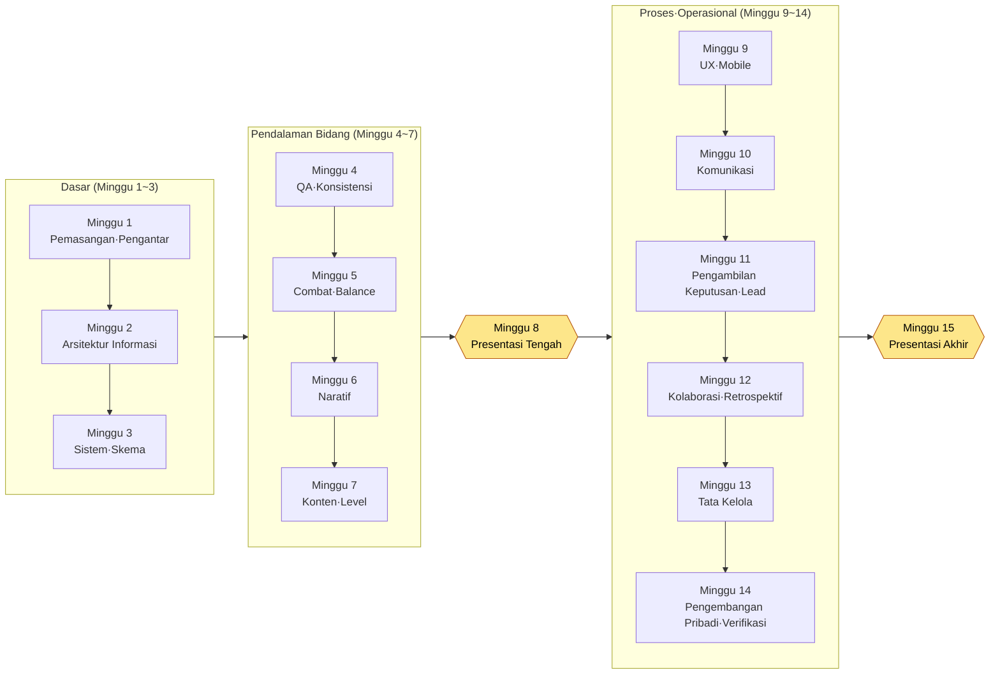

# Lampiran N. Jadwal Perkuliahan 15 Minggu dan Panduan Tingkat Kesulitan

Lampiran ini ditujukan bagi Anda yang ingin memakai buku ini sebagai bahan ajar satu semester — dosen di universitas, politeknik, atau akademi; penanggung jawab pelatihan internal; serta pemimpin kelompok belajar. Memecah sebuah buku tebal hampir 1,000 halaman ke dalam unit per semester ternyata lebih membingungkan dari yang dibayangkan. Bagian mana yang masuk ke minggu keberapa, bagaimana mengubah «Coba Sendiri» dalam teks menjadi tugas, dan dengan kriteria apa menilai hasil kumpulan — jika ketiga hal itu macet, buku sebagus apa pun sulit diadopsi sebagai bahan ajar. Lampiran ini menyiapkan ketiga hal tersebut menjadi alat yang bisa Anda salin dan pakai apa adanya.

Cara memakai lampiran ini begini. Pertama, baca jadwal perkuliahan 15 minggu di N.1 sambil menyesuaikannya dengan kalender akademik Anda (variasi 16 minggu dan semester pendek saya pisahkan di N.2). Lalu, gunakan lencana tingkat kesulitan dan tabel pengetahuan prasyarat di N.3 untuk mengira-ngira level peserta. Setelah itu, salin rubrik penilaian di N.4 dan ubah hanya butir-butirnya agar sesuai dengan tugas Anda. Semua tabel saya susun agar bisa langsung dicetak dan ditempel ke silabus (rencana perkuliahan).

Ada satu hal yang perlu saya sampaikan di awal. Setiap bab dalam buku ini ditutup dengan «Coba Sendiri». Tujuan teks utama bukanlah bab yang dibaca lalu ditutup, melainkan bab yang membuat Anda menggerakkan tangan hari ini juga, dan dalam perkuliahan «Coba Sendiri» itulah yang menjadi bahan utama untuk tugas. Itulah sebabnya jadwal perkuliahan dalam lampiran ini turut mencatat bagaimana «Coba Sendiri» dari teks utama dipindahkan menjadi tugas per minggu.

---

## N.1 Jadwal Perkuliahan Standar 15 Minggu

Ini adalah jadwal perkuliahan standar yang disusun berdasarkan semester 15 minggu yang paling lazim (satu kali 3 jam per minggu). Buku ini terdiri dari 24 bagian, dan tidak semuanya akan dibahas dalam satu semester — karena kalau dijejalkan secara berlebihan, tidak ada satu pun yang benar-benar tertinggal di tangan. Sebagai gantinya, saya memilih susunan yang **meletakkan dasar (Bagian 1 dan 2) dengan kokoh, membahas 5–6 bidang representatif secara mendalam, lalu menutup dengan memilih inti dari proses dan operasional saja**. Bagian yang tidak dibahas saya tandai sebagai «Bacaan Lanjutan» agar peserta yang berminat membukanya sendiri.

Tujuan pembelajaran semuanya saya tulis dalam bentuk kata kerja "apa yang bisa dilakukan peserta setelah perkuliahan". Bukan "mengetahui", melainkan "membuat, memverifikasi, memilih". Karena seluruh buku ini mengulang satu kalimat — "AI mengajukan kandidat dan manusia menyaringnya" — kata kerja pada tujuan pun mengikuti pembagian kerja tersebut.

| Minggu | Bagian/Bab yang Dibahas | Tujuan Pembelajaran (yang bisa dilakukan setelahnya) | «Coba Sendiri» yang Dijadikan Tugas |
|---|---|---|---|
| 1 | 1.0 Sebelum Memulai + Bagian 1 (Pengantar) | Menjelaskan terminal, akun, dan struktur biaya, lalu memasang alat AI di PC sendiri dan membuka sesi pertama | «Coba Sendiri» pemasangan 1.0 — kumpulkan tangkapan layar pemasangan + prompt dan keluaran pertama |
| 2 | Bagian 2 (Arsitektur Informasi) | Mendatakan dokumen dengan frontmatter YAML, lalu merancang konvensi folder dan penamaan | «Coba Sendiri» frontmatter 2.1 — beri frontmatter pada 3 dokumen milik sendiri |
| 3 | Bagian 3 (System Design) | Mendefinisikan $skema dari sheet data terlebih dahulu dengan prinsip skema-pertama | «Coba Sendiri» skema 3.2 — susun spesifikasi untuk 1 mini-sheet |
| 4 | Bagian 10 (QA dan Konsistensi) | Membangun sendiri, sambil mengikuti panduan, alat untuk memeriksa konsistensi FK pada 30 sheet dengan kode | «Coba Sendiri» verifikasi konsistensi 10.1 — **tugas inti yang dinilai dengan rubrik N.4** |
| 5 | Bagian 4 (Combat) + Bagian 8 (Balance) | Menguraikan nilai combat ke dalam Layer dan menetapkan formula balance deterministik sebagai rulebook | «Coba Sendiri» formula balance 8.1 — 1 formula damage + simulasi |
| 6 | Bagian 5 (Naratif) | Membuat voice_profile dialog NPC dan menangkap penyimpangan nada dengan voice_lint | «Coba Sendiri» voice_profile 5.2 — profil suara untuk 1 karakter |
| 7 | Bagian 6 (Konten) + Bagian 7 (Level) | Membedakan dua poros procedural generation (aturan dan AI), lalu memproduksi dan meninjau kandidat konten | «Coba Sendiri» generator 6.2 — hasilkan 10 kandidat konten + log peninjauan |
| 8 | **Pemeriksaan Tengah Semester dan Presentasi** | Mengintegrasikan tugas minggu 1–7 dan mendemokannya sebagai mini-proyek sendiri | Presentasi tugas tengah semester (demo integrasi hasil minggu 3–6) |
| 9 | Bagian 9 (UX/UI) + Bagian 14 (Mobile) | Menjaring HUD melalui lint untuk menangkap penyimpangan arah pandang dan kontras yang kurang, lalu memadatkan HUD PC ke mobile | «Coba Sendiri» HUD lint 9.1 — laporan lint untuk 1 layar |
| 10 | Bagian 16 (Komunikator) + Bagian 17 (Notula) | Membakukan hanya keputusan di ruang kerja terisolasi, lalu menstrukturkan notula | «Coba Sendiri» notula 17.x — strukturkan 1 rekaman rapat nyata |
| 11 | Bagian 18 (Pengambilan Keputusan) + Bagian 19 (Team Lead) | Mencatat keputusan sebagai kartu yang dapat dilacak, lalu mengubah visi menjadi lembar penilaian keputusan | «Coba Sendiri» pelacakan pengambilan keputusan 18.1 — tulis 3 decision card |
| 12 | Bagian 20 (Memori Kolaborasi) + Bagian 21 (Perbaikan Diri) | Mengoperasikan konteks kolaborasi sebagai memori, lalu menjalankan retrospektif sebagai loop perbaikan diri | «Coba Sendiri» retrospektif bab 21 — 1 retrospektif mingguan + 1 aturan ekstraksi |
| 13 | Bagian 22 (Tata Kelola) | Memeriksa batas prompt, halusinasi, biaya, hukum, dan etika, lalu menyusun aturan | «Coba Sendiri» prompt 22.1 — 1 lembar instruksi kerja + prosedur pemeriksaan halusinasi |
| 14 | Bagian 23 (Pengembangan Pribadi) + Bagian 24 (Operasional Lanjutan) | Memindahkan alat ke Versi Ringkas Solo, lalu memverifikasi konsistensi, tautan, dan stale dengan kode | «Coba Sendiri» verifikasi 24.1 — 1 skrip verifikasi untuk proyek sendiri |
| 15 | **Presentasi dan Evaluasi Proyek Akhir** | Merancang, mendemokan, dan memverifikasi 1 alur kerja sendiri yang menembus seluruh semester | Presentasi tugas akhir (dievaluasi dengan rubrik perluasan N.4) |

> **Bacaan Lanjutan (tidak masuk perkuliahan, dianjurkan belajar mandiri):** Bagian 11 (Karakter, Pet, Kendaraan), Bagian 12 (Art Direction), Bagian 13 (Data dan KPI), Bagian 15 (Live Ops). Keempat bagian ini sangat spesifik pada bidangnya, sehingga saya biarkan agar peserta yang berminat membukanya sesuai bidang masing-masing. Dengan menjadikan Lampiran F (Indeks Studi Kasus) sebagai pemandu, Anda bisa menelusuri secara terbalik mulai dari kasus yang paling dekat dengan lingkungan Anda sendiri.

Jika alur kemajuan dilihat sekilas, hasilnya seperti berikut. Ini adalah struktur dengan dua puncak (tengah dan akhir): dasar → pendalaman bidang → integrasi tengah → proses dan operasional → integrasi akhir.

---

## N.2 Variasi Panjang Semester (16 Minggu / Semester Pendek 8 Minggu)

Panjang semester berbeda-beda di tiap kampus. Selain standar 15 minggu, saya menyertakan rekomendasi penyesuaian untuk dua variasi yang paling sering dijumpai. Saya menyarankan agar tugas inti (pemeriksaan konsistensi minggu 4) dan dua puncak presentasi tetap dipertahankan pada variasi mana pun — karena di situlah prinsip kejujuran buku ini ("menunjukkan struktur, bukan efek") paling jelas terlihat.

| Bentuk Semester | Cara Penyesuaian |
|---|---|
| 16 minggu | Standar 15 minggu + tambahkan **minggu pengayaan dan penilaian ulang** pada minggu 16. Kesempatan pengumpulan ulang tugas akhir, atau kuliah khusus 1 bagian dari «Bacaan Lanjutan» (4 bagian) yang dipilih melalui pemungutan suara peserta |
| Semester pendek 8 minggu (dua kali per minggu atau intensif) | Minggu 1 (Pemasangan·Pengantar) → Minggu 2 (Informasi·Skema) → Minggu 3 (Konsistensi, tugas inti) → Minggu 4 (paket Combat·Balance·Naratif) → Minggu 5 Presentasi Tengah → Minggu 6 (Rapat·Pengambilan Keputusan·Kolaborasi) → Minggu 7 (Tata Kelola·Verifikasi) → Minggu 8 Presentasi Akhir. Bidang dipersempit menjadi 3 yang representatif, dan «Coba Sendiri» diserap menjadi praktik di dalam kelas |
| Flipped learning (kelas terbalik) | Pembacaan menyeluruh teks utama dialihkan menjadi tugas pra-kelas, dan seluruh jam kuliah dialokasikan untuk praktik «Coba Sendiri» dan penilaian sejawat berbasis rubrik. Buku ini memuat kode yang berjalan apa adanya tanpa dependensi eksternal, sehingga cocok untuk pengelolaan berbasis praktik |

---

## N.3 Lencana Tingkat Kesulitan Bab dan Pengetahuan Prasyarat

Di dalam buku yang sama pun, latar pengetahuan yang dituntut tiap bab berbeda-beda. Sebagian bab bisa diikuti mahasiswa tahun pertama yang baru pertama kali menyentuh terminal, sebagian lain hanya dapat dicerna sepenuhnya jika sudah memiliki konsep kunci basis data atau dasar statistik. Saya merangkumnya ke dalam tiga tingkat lencana agar bisa Anda pakai saat menyesuaikan laju perkuliahan dengan level peserta atau saat memandu mata kuliah prasyarat.

Arti tiap lencana adalah sebagai berikut.

| Lencana | Tingkat | Makna |
|---|---|---|
| 🟢 Pemula | Pemula | Bisa diikuti non-jurusan dan mahasiswa tahun pertama. Cukup pada level menyalin dan menjalankan kode |
| 🟡 Praktik | Praktik | Harus mampu membaca kode dan memodifikasinya sesuai data sendiri. Dianjurkan memahami konteks praktik desain |
| 🔴 Lanjutan | Lanjutan | Tahap merancang dan memperluas algoritma serta struktur. Tanpa pengetahuan prasyarat, tingkat kesulitan untuk mencernanya tinggi |

Lencana dan pengetahuan prasyarat untuk bagian inti per minggu adalah sebagai berikut. "Pengetahuan prasyarat" adalah latar yang baik dimiliki lebih dulu agar bisa mengikuti minggu tersebut tanpa kesulitan, dan ketiadaannya tidak lantas membuat perkuliahan itu sendiri terhalang.

| Minggu | Bagian Inti | Lencana | Pengetahuan Prasyarat |
|---|---|---|---|
| 1 | 1.0·Bagian 1 Pengantar | 🟢 Pemula | Tidak ada (mengasumsikan pengalaman terminal pertama) |
| 2 | Bagian 2 Arsitektur Informasi | 🟢 Pemula | Penggunaan penyunting teks |
| 3 | Bagian 3 Sistem·Skema | 🟡 Praktik | Dasar tabel/spreadsheet, konsep tipe data |
| 4 | Bagian 10 Verifikasi Konsistensi | 🔴 Lanjutan | **Dasar Python** (fungsi, perulangan), konsep kunci relasional (FK) |
| 5 | Bagian 4·8 Combat·Balance | 🟡 Praktik | Rumus operasi aritmetika dasar, **perhitungan tabel** (fungsi Excel) |
| 6 | Bagian 5 Naratif | 🟢 Pemula | Naluri menulis karakter dan skenario |
| 7 | Bagian 6·7 Konten·Level | 🟡 Praktik | Konsep procedural generation (dianjurkan), naluri koordinat dan grid |
| 9 | Bagian 9·14 UX·Mobile | 🟡 Praktik | Konsep tata letak layar dan resolusi |
| 10 | Bagian 16·17 Komunikasi | 🟢 Pemula | Tidak ada (pengalaman kolaborasi menguntungkan) |
| 11 | Bagian 18·19 Pengambilan Keputusan·Lead | 🟡 Praktik | Pengalaman kerja tim dan manajemen proyek (dianjurkan) |
| 12 | Bagian 20·21 Kolaborasi·Retrospektif | 🟡 Praktik | Telah menyelesaikan Arsitektur Informasi minggu 2 |
| 13 | Bagian 22 Tata Kelola | 🟡 Praktik | **Statistik dasar** (rata-rata, distribusi, konteks deteksi halusinasi), dasar hak cipta |
| 14 | Bagian 23·24 Pribadi·Operasional | 🔴 Lanjutan | Dasar Python, dasar git, telah menyelesaikan konsistensi minggu 4 |

> **Panduan satu baris untuk mata kuliah prasyarat (untuk silabus):** "Pengantar Python atau dasar pemrograman setara dianjurkan tetapi tidak wajib. Bab lanjutan minggu 4 dan 14 mengasumsikan level fungsi dan perulangan Python, dan bagi yang belum menempuhnya, tugas dikelola secara terpisah agar mereka tetap bisa mengikuti dengan baik melalui jalur pemula minggu 1–3."

Tips pengelolaan sesuai komposisi peserta adalah sebagai berikut.

- **Kelas non-jurusan atau umum:** Jika 🔴 Lanjutan (minggu 4 dan 14) dikelola dalam bentuk "menyuruh AI menulis kode dan meninjau hasilnya", peserta yang belum menempuh Python pun bisa mencapai tujuan pembelajaran. Pembagian kerja yang ditunjukkan teks utama buku ini — "manusia menjaga posisi sebagai peninjau" — langsung menjadi rancangan pembelajaran.
- **Program penjurusan atau pelatihan praktik:** Jika pada bab 🔴 Lanjutan peserta diminta membaca sendiri kode yang dihasilkan AI dan menjelaskannya baris demi baris, kemampuan peninjauan itu sendiri menjadi objek penilaian (terhubung dengan butir 4 rubrik N.4).

---

## N.4 Contoh Rubrik Penilaian — Coba Sendiri Alat Pemeriksa Konsistensi (Tugas Inti Minggu 4)

Tanpa rubrik, hasil kumpulan «Coba Sendiri» cenderung hanya dinilai dengan dikotomi "berjalan/tidak berjalan". Kalau begitu, hal yang paling dipentingkan buku ini — **proses meninjau dan menolak keluaran AI** — lenyap dari penilaian. Karena itu, dengan mengambil contoh tugas inti minggu 4 («Coba Sendiri» atom verifikasi konsistensi 10.1), saya menyertakan rubrik yang menilai bukan hanya hasil, melainkan juga prosesnya. Anda bisa memakainya apa adanya pada tugas minggu lain hanya dengan mengganti nama butirnya.

**Definisi tugas:** Untuk beberapa jenis sheet data yang Anda buat sendiri (atau yang disediakan), bangunlah alat pemeriksa konsistensi kunci asing (FK) antar-sheet bersama AI, lalu demokan apakah alat itu berhasil menangkap kesalahan yang sengaja ditanam. Hasil kumpulan terdiri dari ① kode alat ② hasil eksekusi pemeriksaan (laporan lulus/gagal) ③ prompt lengkap yang dikirim ke AI beserta rekaman keluaran yang Anda tolak atau perbaiki di antaranya.

Rubrik disusun dengan 4 butir, masing-masing 25 poin (total 100 poin). Intinya, terlepas dari "alat berjalan" (butir 2), **bagaimana Anda menangani AI** (butir 3 dan 4) dinilai dengan bobot separuh.

| # | Butir Penilaian | Poin | Kurang (0\~12) | Cukup (13\~19) | Baik (20\~25) |
|---|---|---|---|---|---|
| 1 | **Definisi aturan konsistensi** — apakah jelas relasi FK mana yang diperiksa dan mengapa | 25 | Relasi yang diperiksa tidak jelas atau sembarang | Relasi FK utama teridentifikasi tetapi penjelasan dasarnya kurang | Mendefinisikan relasi antar-sheet beserta diagram dan dasarnya, lalu menjelaskan prioritas pemeriksaan |
| 2 | **Kerja alat dan deteksi kesalahan** — apakah benar-benar menangkap kesalahan yang ditanam | 25 | Tidak dapat dijalankan atau melewatkan kesalahan yang jelas | Menangkap sebagian besar kesalahan tetapi ada yang terlewat atau salah deteksi | Menangkap semua kesalahan yang ditanam, dan laporan keluar tanpa salah deteksi serta dapat dibaca manusia |
| 3 | **Transparansi proses pemanfaatan AI** — apakah prompt lengkap dan keluaran tercatat agar dapat direproduksi | 25 | Tidak ada rekaman prompt/keluaran, atau hanya melampirkan hasil | Ada prompt tetapi proses penolakan/perbaikan tidak tercantum | Mencatat prompt lengkap yang dikirim, keluaran mentah, serta proses penolakan dan instruksi ulang secara kronologis |
| 4 | **Penilaian peninjauan dan penolakan** — apa dari keluaran AI yang ditolak/diperbaiki dan mengapa | 25 | Menerima keluaran apa adanya (tanpa jejak peninjauan) | Sebagian diperbaiki tetapi dasar penilaiannya lemah | Menunjuk kesalahan, halusinasi, dan rancangan berlebih untuk ditolak, lalu menjelaskan dasar penilaian itu dengan bahasa sendiri |

> **Catatan pengelolaan penilaian:** Butir 3 dan 4 (total 50 poin) adalah tulang punggung rubrik ini. Walaupun alat berjalan sempurna (nilai penuh butir 2), jika keluaran AI diterima tanpa kritik (butir 4 kurang), tugas ini dipandang belum mencapai tujuan pembelajaran — "manusia menjaga posisi sebagai peninjau". Sebaliknya, walaupun alat sebagian belum sempurna, jika proses penolakan dan instruksi ulang kokoh, nilai tinggi bisa diraih. Prinsip buku ini — menilai struktur (bagaimana ditangani), bukan efek (hasil yang berjalan) — diterapkan pula apa adanya pada penilaian.

Untuk tugas akhir, saya menyarankan rubrik perluasan 5 butir, masing-masing 20 poin, yaitu 4 butir di atas ditambah **⑤ Generalisasi alur kerja (penjelasan penerapan ke bidang sendiri)**. Apakah alat yang dibahas sepanjang semester bisa dipindahkan ke proyek Anda sendiri — itulah pertanyaan yang diajukan buku ini di bagian akhir, dan cukup jika evaluasi terakhir perkuliahan pun bertanya hal yang sama.

---

## N.5 Ringkasan Satu Halaman Pengelolaan Perkuliahan

Terakhir, jika lampiran ini dipadatkan ke dalam satu halaman, hasilnya begini.

- **Pilih, jangan masukkan semuanya.** Jangan berusaha membahas seluruh 24 bagian; susunlah satu semester dari dasar (Bagian 1 dan 2) + konsistensi (Bagian 10) + 5–6 bidang representatif + inti proses dan operasional. Sisanya biarkan sebagai «Bacaan Lanjutan».
- **Pindahkan «Coba Sendiri» menjadi tugas.** Karena teks utama sudah dirancang untuk menggerakkan tangan, separuh perancangan tugas sudah ada di dalam buku.
- **Nilai peninjauan, bukan hasil.** Letakkan pusat bobot rubrik pada "bagaimana AI ditangani". Itulah cara membuat satu kalimat yang diulang buku ini dari awal sampai akhir — AI mengajukan kandidat, dan keputusan terakhir dibuat manusia — hidup di ruang kelas.

Jadwal perkuliahan ini adalah titik berangkat, bukan jawaban yang benar. Pindahkan minggu dan ubah tugas sesuai level peserta dan kalender akademik Anda sendiri. Membiarkan buku ini sendiri dibaca utuh oleh alat AI lalu meminta "Susun ulang jadwal perkuliahan ini agar sesuai dengan jadwal 16 minggu dan level peserta kuliah saya" pun — sebagaimana cara tercepat memanfaatkan buku ini — adalah jalan yang terbuka.
